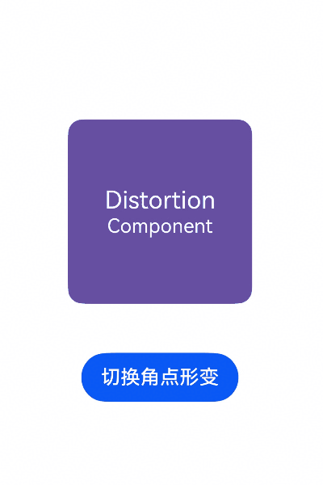
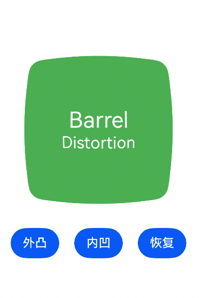
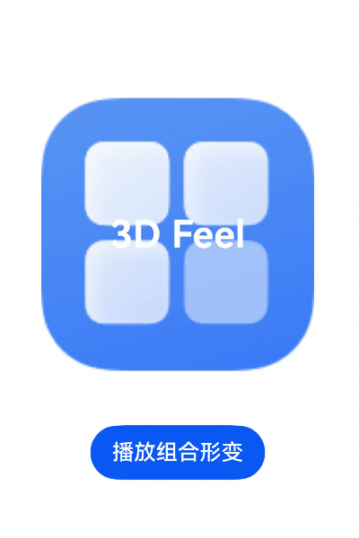

# DistortionComponent (系统接口)
<!--Kit: ArkUI-->
<!--Subsystem: ArkUI-->
<!--Owner: @hehongyang3-->
<!--Designer: @hehongyang3-->
<!--Tester: @lxl007-->
<!--Adviser: @Brilliantry_Rui-->

DistortionComponent（空间形变组件）是一种容器型视效组件，可对其子组件施加二维平面上的空间形变，模拟透视投影、镜头桶形/枕形畸变以及边角拉伸等视觉效果。通过改变四个角点的归一化坐标与四条边的桶形扭曲系数，组件内容能够产生贴近三维空间的扭曲、凸起、凹陷或错切感。

>  **说明：**
>
> - 本模块为系统接口。
> 
> - 空间扭曲感的形变视效支持动画，如在[animateTo](../../apis-arkui/arkts-apis-uicontext-uicontext.md#animateto)动画接口闭包中改变该视效参数，可以产生空间扭曲感的形变动画。

**起始版本：** 26.0.0

## 子组件

可以包含子组件。

## 接口

### DistortionComponent

DistortionComponent(options?: DistortionComponentOptions)

创建提供空间扭曲形变视效的组件。

**起始版本：** 26.0.0

**系统接口：** 此接口为系统接口。

**模型约束：** 此接口仅可在Stage模型下使用。

**系统能力：** SystemCapability.ArkUI.ArkUI.Full

**参数：**

| 参数名  | 类型                                             | 必填 | 说明                                                         |
| ------- | ------------------------------------------------- | ---- | ------------------------------------------------------------ |
| options | [DistortionComponentOptions](#distortioncomponentoptions)  | 否  | 空间扭曲形变选项。                                           |

## DistortionComponentOptions

空间扭曲形变选项。

**起始版本：** 26.0.0

**系统接口：** 此接口为系统接口。

**模型约束：** 此接口仅可在Stage模型下使用。

**系统能力：** SystemCapability.ArkUI.ArkUI.Full

| 名称        | 类型                                              | 只读  | 可选 | 说明                                                         |
| ----------- | ------------------------------------------------- | ---- | ---- | ------------------------------------------------------------ |
| distortion  | [DistortionParam](#distortionparam) | 否  | 是  | 空间扭曲形变参数。通过指定四个角的位置关系和四条边的桶形变程度产生空间扭曲效果。                                        |

## DistortionParam

空间扭曲形变参数。

> **说明：**
> - 四个角的坐标可以按照如下坐标系设置。一个组件，左上角位置为[0, 0]，右上角位置为[1, 0]，左下角位置为[0, 1]，右下角位置为[1, 1]。
> - 如bottomLeft属性设置为[0.5, 0.5]，则表示左下角形变到组件中心点的位置，产生对应的形变效果。
> - 设置四个角坐标位置时请符合空间感逻辑。如topLeft = [0, 0.7]，bottomLeft = [0, 0.2]，左上角的位置低于左下角的位置，违背空间感的逻辑，可能导致渲染异常。

**起始版本：** 26.0.0

**系统接口：** 此接口为系统接口。

**模型约束：** 此接口仅可在Stage模型下使用。

**系统能力：** SystemCapability.ArkUI.ArkUI.Full

| 名称           | 类型    | 只读  | 可选 | 说明                                                                                                                                  |
| --------------- | --------- | ---- | ---- | ------------------------------------------------------------------------------------------------------------------------------------- |
| topLeft        | [Vector2](#vector2) | 否  | 否   | 左上角的坐标。<br/>默认值：[0, 0]                                                                                      |
| topRight       | [Vector2](#vector2) | 否  | 否   | 右上角的坐标。<br/>默认值：[1, 0]                                                                                     |
| bottomLeft     | [Vector2](#vector2) | 否  | 否   | 左下角的坐标。<br/>默认值：[0, 1]                                                                                     |
| bottomRight    | [Vector2](#vector2) | 否  | 否   | 右下角的坐标。<br/>默认值：[1, 1]                                                                                   |
| barrelDistortion | [Vector4](#vector4) | 否   | 否   | 四条边的桶形扭曲程度参数。<br/>Vector4中四个值分别控制：x是左边，y是右边，z是上边，w是下边。<br/>默认值：[0, 0, 0, 0] <br/>正数表示边向外凸出的扭曲，负数表示边向内凹陷的扭曲。扭曲参数绝对值达到1时，扭曲程度为极端扭曲。<br/> x、y、z、w 各值建议设置范围：[-1, 1] <br/>**说明：**<br/>barrelDistortion的四个分量共同决定四条边的桶形扭曲强度，可与四个角点坐标组合使用，构建更丰富的空间形变。<br/>从几何意义上看，x、y决定左右两条竖直边的弯曲方向与幅度，z、w决定上下两条水平边的弯曲方向与幅度。当某一分量为正值时，对应边向组件外侧凸出，呈现“桶形外凸”效果；为负值时，对应边向组件内侧凹陷，呈现“枕形内凹”效果。四个分量取值相近时，整体呈现类似广角镜头的均匀桶形畸变；x、y与z、w取值差异较大时，则会产生横向拉伸或纵向拉伸的非对称形变。<br/>由于极端值可能导致画面折叠或采样异常，建议将x、y、z、w保持在[-1, 1]范围内使用。|

## Vector2

type Vector2 = Vector2

二维向量类型，包含x和y坐标，表示位置坐标关系。

**起始版本：** 26.0.0

**系统接口：** 此接口为系统接口。

**模型约束：** 此接口仅可在Stage模型下使用。

**系统能力：** SystemCapability.ArkUI.ArkUI.Full

| 类型   | 说明     |
| ------ | -------- |
| [Vector2](../../apis-arkui/js-apis-arkui-graphics.md#vector2)   | 包含x和y两个值的向量。<br/>x和y表示坐标值。<br/>取值范围：(-∞, +∞) |


## Vector4

type Vector4 = Vector4

四维向量类型，包含x、y、z、w，各数值表示桶形形变程度。

**起始版本：** 26.0.0

**系统接口：** 此接口为系统接口。

**模型约束：** 此接口仅可在Stage模型下使用。

**系统能力：** SystemCapability.ArkUI.ArkUI.Full

| 类型   | 说明     |
| ------ | -------- |
| [Vector4](../../apis-arkui/js-apis-arkui-graphics.md#vector4)   | 包含x、y、z、w四个值的向量。<br/>x、y、z、w的值分别表示组件左边、右边、上边、下边的桶形形变程度。<br/>取值范围：(-∞, +∞) |


## 属性

仅支持系统材质属性[systemMaterial](ts-universal-attributes-image-effect-sys.md#systemmaterial23)。

## 示例

### 示例1（动态改变角点形变）

该示例演示如何使用[DistortionComponent](#distortioncomponent)组件，通过改变四个角点的坐标，产生由角点拉伸带来的空间扭曲效果。点击按钮后，使用animateTo播放形变动画。

从API版本26.0.0开始，新增系统组件DistortionComponent。

```ts
@Entry
@Component
struct DistortionCornerExample {
  @State distortionParam: DistortionParam = {
    topLeft: { x: 0, y: 0 },
    topRight: { x: 1, y: 0 },
    bottomLeft: { x: 0, y: 1 },
    bottomRight: { x: 1, y: 1 },
    barrelDistortion: { x: 0, y: 0, z: 0, w: 0 }
  }

  build() {
    Column({ space: 40 }) {
      // 动态更新角点形变，组件前景内容会跟随角点位置发生形变。
      DistortionComponent({
        distortion: this.distortionParam
      }) {
        Column() {
          Text('Distortion')
            .fontSize(20)
            .fontColor(Color.White)
          Text('Component')
            .fontSize(16)
            .fontColor(Color.White)
        }
        .width(150)
        .height(150)
        .backgroundColor(0xFF6750A4)
        .borderRadius(12)
        .justifyContent(FlexAlign.Center)
      }

      Button('切换角点形变')
        .onClick(() => {
          this.getUIContext()?.animateTo({ duration: 800, curve: Curve.EaseInOut }, () => {
            this.distortionParam = {
              topLeft: { x: 0.2, y: 0.2 },
              topRight: { x: 0.9, y: 0.1 },
              bottomLeft: { x: 0.1, y: 0.9 },
              bottomRight: { x: 0.8, y: 1.1 },
              barrelDistortion: { x: 0, y: 0, z: 0, w: 0 }
            }
          })
        })
    }
    .width('100%')
    .height('100%')
    .justifyContent(FlexAlign.Center)
  }
}
```


### 示例2（四边桶形扭曲）

该示例演示barrelDistortion参数中z和w对上下两条水平边的影响，同时设置x和y控制左右竖边，展示整体桶形扭曲效果。

从API版本26.0.0开始，新增[DistortionParam](#distortionparam)的barrelDistortion属性。

```ts
@Entry
@Component
struct DistortionBarrelExample {
  @State barrelValue: number = 0.5

  build() {
    Column({ space: 40 }) {
      // 单独控制四条边的桶形扭曲，突出z/w对上下边的作用
      DistortionComponent({
        distortion: {
          topLeft: { x: 0, y: 0 },
          topRight: { x: 1, y: 0 },
          bottomLeft: { x: 0, y: 1 },
          bottomRight: { x: 1, y: 1 },
          barrelDistortion: {
            x: this.barrelValue,
            y: this.barrelValue,
            z: this.barrelValue,
            w: this.barrelValue
          }
        }
      }) {
        Column() {
          Text('Barrel')
            .fontSize(24)
            .fontColor(Color.White)
          Text('Distortion')
            .fontSize(18)
            .fontColor(Color.White)
        }
        .width(180)
        .height(180)
        .backgroundColor(0xFF4CAF50)
        .borderRadius(16)
        .justifyContent(FlexAlign.Center)
      }

      Row({ space: 20 }) {
        Button('外凸')
          .onClick(() => {
            this.getUIContext()?.animateTo({ duration: 600 }, () => {
              this.barrelValue = 0.6
            })
          })
        Button('内凹')
          .onClick(() => {
            this.getUIContext()?.animateTo({ duration: 600 }, () => {
              this.barrelValue = -0.6
            })
          })
        Button('恢复')
          .onClick(() => {
            this.getUIContext()?.animateTo({ duration: 600 }, () => {
              this.barrelValue = 0
            })
          })
      }
    }
    .width('100%')
    .height('100%')
    .justifyContent(FlexAlign.Center)
  }
}
```


### 示例3（角点与桶形扭曲组合动画）

该示例演示[DistortionComponent](#distortioncomponent)组件将角点坐标形变与四条边的桶形扭曲结合，并通过animateTo实现从正常状态到空间扭曲状态的过渡动画。

从API版本26.0.0开始，新增系统组件DistortionComponent。

```ts
@Entry
@Component
struct DistortionCombinedExample {
  @State isDistorted: boolean = false
  @State distortionParam: DistortionParam = {
    topLeft: { x: 0, y: 0 },
    topRight: { x: 1, y: 0 },
    bottomLeft: { x: 0, y: 1 },
    bottomRight: { x: 1, y: 1 },
    barrelDistortion: { x: 0, y: 0, z: 0, w: 0 }
  }

  handleToggle() {
    this.isDistorted = !this.isDistorted
    this.getUIContext()?.animateTo({ duration: 1000, curve: Curve.EaseInOut }, () => {
      if (this.isDistorted) {
        this.distortionParam = {
          topLeft: { x: 0.1, y: 0.15 },
          topRight: { x: 0.85, y: 0.05 },
          bottomLeft: { x: 0.05, y: 0.9 },
          bottomRight: { x: 0.95, y: 0.85 },
          barrelDistortion: { x: 0.3, y: 0.3, z: 0.5, w: 0.5 }
        }
      } else {
        this.distortionParam = {
          topLeft: { x: 0, y: 0 },
          topRight: { x: 1, y: 0 },
          bottomLeft: { x: 0, y: 1 },
          bottomRight: { x: 1, y: 1 },
          barrelDistortion: { x: 0, y: 0, z: 0, w: 0 }
        }
      }
    })
  }

  build() {
    Column({ space: 40 }) {
      // 组合角点形变与桶形扭曲，产生更强烈的空间透视感
      DistortionComponent({
        distortion: this.distortionParam
      }) {
        Stack() {
          Column()
            .width(200)
            .height(200)
            // 'app.media.icon'需要替换为开发者所需的图像资源文件
            .backgroundImage($r('app.media.icon'))
            .backgroundImageSize(ImageSize.Cover)
            .opacity(0.8)
          Text('3D Feel')
            .fontSize(28)
            .fontColor(Color.White)
            .fontWeight(FontWeight.Bold)
        }
        .width(200)
        .height(200)
        .borderRadius(20)
        .clip(true)
      }

      Button(this.isDistorted ? '恢复原始状态' : '播放组合形变')
        .onClick(() => this.handleToggle())
    }
    .width('100%')
    .height('100%')
    .justifyContent(FlexAlign.Center)
  }
}
```
