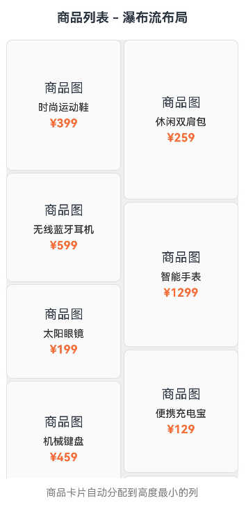
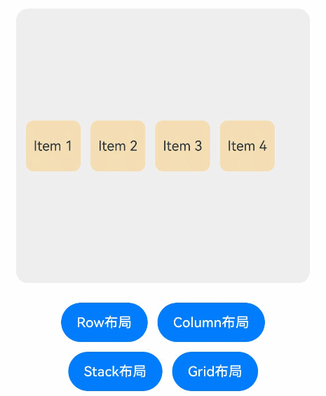
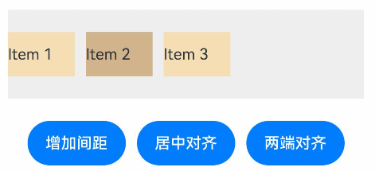

# DynamicLayout
<!--Kit: ArkUI-->
<!--Subsystem: ArkUI-->
<!--Owner: @zju_ljz-->
<!--Designer: @lanshouren-->
<!--Tester: @liuli0427-->
<!--Adviser: @Brilliantry_Rui-->

动态布局容器组件，支持在运行时动态切换不同的布局算法，不改变子组件的状态。

> **说明：**
>
> - 该组件从API version 24开始支持。后续版本如有新增内容，则采用上角标单独标记该内容的起始版本。
>
> - 本模块接口仅可在Stage模型下使用。

## 子组件

可以包含子组件。

## 接口

DynamicLayout(algorithm: LayoutAlgorithm)  

动态布局容器。

**模型约束：** 此接口仅可在Stage模型下使用。

**卡片能力：** 从API version 24开始，该接口支持在ArkTS卡片中使用。

**原子化服务API：** 从API version 24开始，该接口支持在原子化服务中使用。

**系统能力：** SystemCapability.ArkUI.ArkUI.Full

**参数：**

| 参数名 | 类型 | 必填 | 说明 |
| ---- | ---- | ---- | ---- |
| algorithm | [LayoutAlgorithm](../js-apis-arkui-layoutAlgorithm.md#layoutalgorithm-1) | 是 | 指定动态布局组件的布局算法。取非法值时，按照堆叠布局算法[StackLayoutAlgorithm](../js-apis-arkui-layoutAlgorithm.md#stacklayoutalgorithm)布局子组件，子组件堆叠排列。|

## 属性

支持[通用属性](ts-component-general-attributes.md)。

> **说明：**
>
> - 当布局算法为[RowLayoutAlgorithm](../js-apis-arkui-layoutAlgorithm.md#rowlayoutalgorithm)或[ColumnLayoutAlgorithm](../js-apis-arkui-layoutAlgorithm.md#columnlayoutalgorithm)时，子组件设置[Flex布局](ts-universal-attributes-flex-layout.md)属性生效。
>
> - 当布局算法为[StackLayoutAlgorithm](../js-apis-arkui-layoutAlgorithm.md#stacklayoutalgorithm)时，子组件设置[layoutGravity](ts-universal-attributes-location.md#layoutgravity20)属性生效。
>
> - 当布局算法为[CustomLayoutAlgorithm](../js-apis-arkui-layoutAlgorithm.md#customlayoutalgorithm)时，DynamicLayout组件[FrameNode](../js-apis-arkui-frameNode.md#framenode-1)的[setMeasuredSize](../js-apis-arkui-frameNode.md#setmeasuredsize12)方法优先级高于[尺寸设置](ts-universal-attributes-size.md)和[边框](ts-universal-attributes-border.md)属性，子组件[FrameNode](../js-apis-arkui-frameNode.md#framenode-1)的[measure](../js-apis-arkui-frameNode.md#measure12)和[layout](../js-apis-arkui-frameNode.md#layout12)方法优先级高于[ignoreLayoutSafeArea](ts-universal-attributes-expand-safe-area.md#ignorelayoutsafearea20)属性。

## 事件

支持[通用事件](ts-component-general-events.md)。

## 示例

### 示例1（自定义布局算法实现瀑布流布局）

该示例展示如何重写[onMeasure](../js-apis-arkui-layoutAlgorithm.md#onmeasure)、[onLayout](../js-apis-arkui-layoutAlgorithm.md#onlayout)函数，实现瀑布流布局展示商品列表的功能。

从API version 24开始，新增onMeasure、onLayout。

```typescript
import { DynamicLayout, DynamicLayoutAttribute, CustomLayoutAlgorithm, LayoutAlgorithm, FrameNode, LayoutConstraint, Position } from '@kit.ArkUI';

// 瀑布流布局算法
class WaterfallLayout extends CustomLayoutAlgorithm {
  private columnCount: number = 2;
  private columnGap: number = 10;
  private rowGap: number = 10;

  onMeasure(self: FrameNode, constraint: LayoutConstraint): void {
    const childCount = self.getChildrenCount();
    const columnWidth = (constraint.maxSize.width - (this.columnCount - 1) * this.columnGap) / this.columnCount;

    // 记录每列的当前高度
    const columnHeights: number[] = new Array(this.columnCount).fill(0);

    for (let i = 0; i < childCount; i++) {
      const child = self.getChild(i);
      if (child) {
        // 通过将minSize和maxSize设置为相同值来约束子组件宽度
        const childConstraint: LayoutConstraint = {
          maxSize: {
            width: columnWidth,
            height: constraint.maxSize.height
          },
          minSize: {
            width: columnWidth,
            height: 0
          },
          percentReference: constraint.percentReference
        };

        child.measure(childConstraint);

        // 找到当前高度最小的列
        const minColumn = columnHeights.indexOf(Math.min(...columnHeights));
        columnHeights[minColumn] += child.getMeasuredSize().height + this.rowGap;
      }
    }

    const maxHeight = Math.max(...columnHeights);
    self.setMeasuredSize({
      width: constraint.maxSize.width,
      height: maxHeight
    });
  }

  onLayout(self: FrameNode, position: Position): void {
    const childCount = self.getChildrenCount();
    const measuredSize = self.getMeasuredSize();
    const columnWidth = (measuredSize.width - (this.columnCount - 1) * this.columnGap) / this.columnCount;

    // 记录每列的当前Y坐标
    const columnYs: number[] = new Array(this.columnCount).fill(0);

    for (let i = 0; i < childCount; i++) {
      const child = self.getChild(i);
      if (child) {
        const childSize = child.getMeasuredSize();

        // 找到当前Y坐标最小的列
        const minColumn = columnYs.indexOf(Math.min(...columnYs));
        const x = minColumn * (columnWidth + this.columnGap);
        const y = columnYs[minColumn];

        child.layout({ x, y });

        columnYs[minColumn] += childSize.height + this.rowGap;
      }
    }

    self.setLayoutPosition(position);
  }
}

@Entry
@ComponentV2
struct WaterfallLayoutExample {
  @Local algorithm: LayoutAlgorithm = new WaterfallLayout();

  // 商品数据
  private products: Product[] = [
    { id: '1', name: '时尚运动鞋', price: '¥399', height: 180, image: '商品图' },
    { id: '2', name: '休闲双肩包', price: '¥259', height: 220, image: '商品图' },
    { id: '3', name: '无线蓝牙耳机', price: '¥599', height: 150, image: '商品图' },
    { id: '4', name: '智能手表', price: '¥1299', height: 200, image: '商品图' },
    { id: '5', name: '太阳眼镜', price: '¥199', height: 130, image: '商品图' },
    { id: '6', name: '便携充电宝', price: '¥129', height: 170, image: '商品图' },
    { id: '7', name: '机械键盘', price: '¥459', height: 160, image: '商品图' },
    { id: '8', name: '游戏鼠标', price: '¥189', height: 140, image: '商品图' },
    { id: '9', name: '高清显示器', price: '¥1599', height: 210, image: '商品图' },
    { id: '10', name: '智能音箱', price: '¥299', height: 190, image: '商品图' }
  ];

  // 商品卡片组件
  @Builder ProductCard(product: Product) {
    Column() {
      Text(product.image)
        .fontSize(18)
        .margin({ bottom: 8 })
      Text(product.name)
        .fontSize(14)
        .fontWeight(FontWeight.Medium)
        .fontColor(0x333333)
        .margin({ bottom: 4 })
        .maxLines(1)
        .textOverflow({ overflow: TextOverflow.Ellipsis })
      Text(product.price)
        .fontSize(16)
        .fontColor(0xFF6B35)
        .fontWeight(FontWeight.Bold)
    }
    .width('100%')
    .padding(12)
    .backgroundColor(0xFAFAFA)
    .borderRadius(8)
    .border({ width: 1, color: 0xE0E0E0 })
    .height(product.height)
    .justifyContent(FlexAlign.Center)
  }

  build() {
    Column() {
      Text('商品列表 - 瀑布流布局')
        .fontSize(18)
        .fontWeight(FontWeight.Bold)
        .margin({ bottom: 20 })

      Scroll() {
        DynamicLayout(this.algorithm) {
          ForEach(this.products, (product: Product) => {
            this.ProductCard(product)
          })
        }
        .width('100%')
        .backgroundColor(0xEFEFEF)
        .borderRadius(12)
        .padding(10)
      }
      .scrollable(ScrollDirection.Vertical)
      .scrollBar(BarState.Auto)
      .edgeEffect(EdgeEffect.Spring)
      .width('100%')
      .layoutWeight(1)

      Text('商品卡片自动分配到高度最小的列')
        .fontSize(14)
        .fontColor(Color.Gray)
        .margin({ top: 12 })
    }
    .padding(20)
    .width('100%')
    .height('100%')
  }
}

// 商品数据模型
interface Product {
  id: string;
  name: string;
  price: string;
  height: number;
  image: string;
}
```


### 示例2（切换布局算法）

该示例通过改变[@Local](../../../ui/state-management/arkts-new-local.md)装饰的[LayoutAlgorithm](../js-apis-arkui-layoutAlgorithm.md#layoutalgorithm-1)类型变量，实现动态切换DynamicLayout组件布局算法的功能。示例展示如何切换布局算法为水平线性布局算法[RowLayoutAlgorithm](../js-apis-arkui-layoutAlgorithm.md#rowlayoutalgorithm)、垂直线性布局算法[ColumnLayoutAlgorithm](../js-apis-arkui-layoutAlgorithm.md#columnlayoutalgorithm)、堆叠布局算法[StackLayoutAlgorithm](../js-apis-arkui-layoutAlgorithm.md#stacklayoutalgorithm)和网格布局算法[GridLayoutAlgorithm](../js-apis-arkui-layoutAlgorithm.md#gridlayoutalgorithm)。

从API version 24开始，新增RowLayoutAlgorithm、ColumnLayoutAlgorithm、StackLayoutAlgorithm、GridLayoutAlgorithm。

```typescript
import { DynamicLayout, DynamicLayoutAttribute, RowLayoutAlgorithm, ColumnLayoutAlgorithm, StackLayoutAlgorithm, GridLayoutAlgorithm, LayoutAlgorithm, LengthMetrics } from '@kit.ArkUI';

@Entry
@ComponentV2
struct LayoutSwitchExample {
  @Local algorithm: LayoutAlgorithm = new RowLayoutAlgorithm({
    space: LengthMetrics.vp(10),
    alignItems: VerticalAlign.Center
  });
  @Local childWidth: string = '20%'
  @Local childHeight: string = '20%'

  build() {
    Column() {
      // 使用状态变量控制布局算法
      DynamicLayout(this.algorithm) {
        Text('Item 1')
          .width(this.childWidth)
          .height(this.childHeight)
          .fontSize(14)
          .textAlign(TextAlign.Center)
          .backgroundColor(0xF5DEB3)
          .borderRadius(8)
          .layoutGravity(LocalizedAlignment.TOP_START)
        Text('Item 2')
          .width(this.childWidth)
          .height(this.childHeight)
          .fontSize(14)
          .textAlign(TextAlign.Center)
          .backgroundColor(0xF5DEB3)
          .borderRadius(8)
          .layoutGravity(LocalizedAlignment.TOP_END)
        Text('Item 3')
          .width(this.childWidth)
          .height(this.childHeight)
          .fontSize(14)
          .textAlign(TextAlign.Center)
          .backgroundColor(0xF5DEB3)
          .borderRadius(8)
          .layoutGravity(LocalizedAlignment.BOTTOM_START)
        Text('Item 4')
          .width(this.childWidth)
          .height(this.childHeight)
          .fontSize(14)
          .textAlign(TextAlign.Center)
          .backgroundColor(0xF5DEB3)
          .borderRadius(8)
          .layoutGravity(LocalizedAlignment.BOTTOM_END)
      }
      .width(300)
      .height(280)
      .backgroundColor(0xEFEFEF)
      .borderRadius(12)
      .padding(10)

      Column({ space: 10 }) {
        Row({ space: 10 }) {
          Button('Row布局')
            .fontSize(14)
            .onClick(() => {
              this.algorithm = new RowLayoutAlgorithm({
                space: LengthMetrics.vp(10),
                alignItems: VerticalAlign.Center
              });
              this.childWidth = '20%'
              this.childHeight = '20%'
            })
          Button('Column布局')
            .fontSize(14)
            .onClick(() => {
              this.algorithm = new ColumnLayoutAlgorithm({
                space: LengthMetrics.vp(10),
                alignItems: HorizontalAlign.Center
              });
              this.childWidth = '20%'
              this.childHeight = '20%'
            })
        }
        Row({ space: 10 }) {
          Button('Stack布局')
            .fontSize(14)
            .onClick(() => {
              this.algorithm = new StackLayoutAlgorithm({
                alignContent: LocalizedAlignment.CENTER
              });
              this.childWidth = '20%'
              this.childHeight = '20%'
            })
          Button('Grid布局')
            .fontSize(14)
            .onClick(() => {
              this.algorithm = new GridLayoutAlgorithm({
                columnsTemplate: '1fr 1fr',
                rowsGap: LengthMetrics.vp(5),
                columnsGap: LengthMetrics.vp(5)
              });
              this.childWidth = '100%'
              this.childHeight = '50%'
            })
        }
      }
      .margin({ top: 20 })
    }
    .padding(20)
  }
}
```


### 示例3（修改布局算法属性）

该示例通过修改[RowLayoutAlgorithm](../js-apis-arkui-layoutAlgorithm.md#rowlayoutalgorithm)的space和justifyContent属性，实现DynamicLayout组件布局效果刷新的功能。

从API version 24开始，新增space、justifyContent属性。

```typescript
import { DynamicLayout, DynamicLayoutAttribute, RowLayoutAlgorithm, LengthMetrics } from '@kit.ArkUI';

@Entry
@ComponentV2
struct PropertyChangeExample {
  algorithm: RowLayoutAlgorithm = new RowLayoutAlgorithm({
    space: LengthMetrics.vp(10),
    justifyContent: FlexAlign.Start
  });

  build() {
    Column() {
      DynamicLayout(this.algorithm) {
        Text('Item 1')
          .width(60)
          .height(40)
          .fontSize(14)
          .backgroundColor(0xF5DEB3)
        Text('Item 2')
          .width(60)
          .height(40)
          .fontSize(14)
          .backgroundColor(0xD2B48C)
        Text('Item 3')
          .width(60)
          .height(40)
          .fontSize(14)
          .backgroundColor(0xF5DEB3)
      }
      .width('100%')
      .height(80)
      .backgroundColor(0xEFEFEF)

      Row({ space: 10 }) {
        Button('增加间距')
          .fontSize(14)
          .onClick(() => {
            // 修改space属性触发重新布局
            const currentSpace = this.algorithm.space?.value;
            this.algorithm.space = LengthMetrics.vp(currentSpace as number + 5);
          })
        Button('居中对齐')
          .fontSize(14)
          .onClick(() => {
            // 修改justifyContent属性触发重新布局
            this.algorithm.justifyContent = FlexAlign.Center;
          })
        Button('两端对齐')
          .fontSize(14)
          .onClick(() => {
            this.algorithm.justifyContent = FlexAlign.SpaceBetween;
          })
      }
      .margin({ top: 20 })
    }
    .padding(20)
  }
}
```

