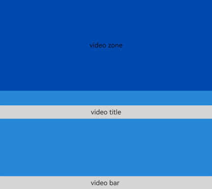
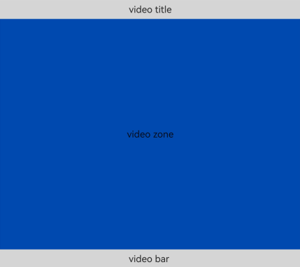

# FolderStack
<!--Kit: ArkUI-->
<!--Subsystem: ArkUI-->
<!--Owner: @fenglinbailu-->
<!--Designer: @lanshouren-->
<!--Tester: @liuli0427-->
<!--Adviser: @Brilliantry_Rui-->

FolderStack继承自[Stack](ts-container-stack.md)（层叠布局）控件，新增了<!--RP1-->折叠屏悬停<!--RP1End-->能力，通过在FolderStack的配置项[FolderStackOptions](#folderstackoptions18对象说明)的upperItems数组上设置子组件id，使相应子组件自动避让折叠屏折痕区后移到上半屏。FolderStack适用于双折叠设备的悬停态场景，如视频播放、视频会议等应用，实现视频画面自动移至上半屏、控制面板保留在下半屏的布局。该组件能解决双折叠设备适配问题，带来提升用户体验、简化开发者布局适配工作的收益。

> **说明：**
>
> - 该组件从API version 11开始支持。后续版本的新增接口，采用上角标单独标记接口的起始版本。
>
> - 本模块接口仅可在Stage模型下使用。
>
> - 该组件的悬停态能力针对<!--RP2-->双折叠<!--RP2End-->设计，只在双折叠设备生效。可通过[FoldStatus](ts-appendix-enums.md#foldstatus11)判断设备的折叠状态。
>
> - 当该组件的父组件为[if/else：条件渲染](../../../ui/rendering-control/arkts-rendering-control-ifelse.md)节点时，折叠屏悬停能力将会失效。

## 子组件

可以包含多个子组件。

## 接口

FolderStack(options?: FolderStackOptions)

折叠屏悬停布局容器，继承自[Stack](ts-container-stack.md)，通过配置upperItems实现折叠屏悬停能力。当设备处于悬停态时，指定子组件自动移至上半屏，其他组件堆叠在下半屏。

**原子化服务API：** 从API version 12开始，该接口支持在原子化服务中使用。

**模型约束：** 此接口仅可在Stage模型下使用。

**系统能力：** SystemCapability.ArkUI.ArkUI.Full

**设备行为差异：** 该接口在Wearable设备上使用时，应用程序运行异常，异常信息中提示接口未定义，在其他设备中可正常调用。

**参数：**

| 参数名       | 类型                                    | 必填 | 说明                                                                 |
| ------------ | ------------------------------------------- | ---- |----------------------------------------------------------------------|
| options |  [FolderStackOptions](#folderstackoptions18对象说明) | 否   | FolderStack的配置项，用于设置悬停态时需要移到上半屏的子组件。当需要使用折叠屏悬停能力时，通过upperItems数组指定子组件id；不传入时FolderStack作为普通Stack组件使用，不启用悬停能力，upperItems默认为空数组。 |

## FolderStackOptions<sup>18+</sup>对象说明

FolderStack悬停态配置项对象，用于描述悬停态状态下需要移到上半屏的子组件相关信息。

> **说明：**
>
> 为规范匿名对象的定义，API 18版本修改了此处的元素定义。其中，保留了历史匿名对象的起始版本信息，会出现外层元素@since版本号高于内层元素版本号的情况，但这不影响接口的使用。

**原子化服务API：** 从API version 18开始，该接口支持在原子化服务中使用。

**系统能力：** SystemCapability.ArkUI.ArkUI.Full

**设备行为差异：** 该接口在Wearable设备上使用时，应用程序运行异常，异常信息中提示接口未定义，在其他设备中可正常调用。

| 名称 | 类型 | 只读 | 可选 | 说明 |
| -------- | -------- | -------- | -------- | -------- |
| upperItems<sup>11+</sup> |    Array<string\>  | 否 | 是  | 定义悬停态会被移到上半屏的子组件的id数组。<br>默认值：[]<br>当悬停触发时，upperItems数组中的子组件自动避让折叠屏折痕区后移到上半屏，其它组件堆叠在下半屏区域。<br>**原子化服务API：** 从API version 12开始，该接口支持在原子化服务中使用。 |

## 属性

>  **说明：**
>
>  设置offset和margin属性，可能会导致上下半屏遮挡折痕区，不建议使用。

除支持[通用属性](ts-component-general-attributes.md)外，还支持以下属性：

### alignContent

alignContent(value: Alignment)

设置子组件在容器内的对齐方式，调用后子组件按照指定的对齐方式在容器内排列。该属性与[align](ts-universal-attributes-location.md#align)同时设置时，后设置的属性生效。

>**说明：**
>
> 从API version 12开始，该接口支持在[attributeModifier](ts-universal-attributes-attribute-modifier.md#attributemodifier)中调用。

**原子化服务API：** 从API version 12开始，该接口支持在原子化服务中使用。

**系统能力：** SystemCapability.ArkUI.ArkUI.Full

**设备行为差异：** 该接口在Wearable设备上使用时，应用程序运行异常，异常信息中提示接口未定义，在其他设备中可正常调用。

**参数：**

| 参数名 | 类型                                        | 必填 | 说明                                                    |
| ------ | ------------------------------------------- | ---- | ------------------------------------------------------- |
| value  | [Alignment](ts-appendix-enums.md#alignment) | 是   | 子组件在容器内的对齐方式，取值包括TopStart、Top、TopEnd、Start、Center、End、BottomStart、Bottom、BottomEnd。<br>默认值：Alignment.Center <br>非法值：按默认值处理。 |

### enableAnimation

enableAnimation(value: boolean)

设置是否使用默认动效，调用后启用或禁用FolderStack的默认悬停动画效果。

>**说明：**
>
> 从API version 12开始，该接口支持在[attributeModifier](ts-universal-attributes-attribute-modifier.md#attributemodifier)中调用。

**原子化服务API：** 从API version 12开始，该接口支持在原子化服务中使用。

**系统能力：** SystemCapability.ArkUI.ArkUI.Full

**设备行为差异：** 该接口在Wearable设备上使用时，应用程序运行异常，异常信息中提示接口未定义，在其他设备中可正常调用。

**参数：**

| 参数名 | 类型                                        | 必填 | 说明                                |
| ------ | ------------------------------------------- | ---- | ----------------------------------- |
| value  | boolean | 是   | 是否使用默认动效。<br>默认值：true，设置true表示使用默认动效，设置false表示不使用默认动效。<br>非法值：按默认值处理。 |

### autoHalfFold

autoHalfFold(value: boolean)

设置在半折叠状态下是否开启FolderStack组件的自动旋转。当系统自动旋转开关关闭时，可通过该属性控制FolderStack在半折叠状态下是否进行自动旋转。<br>典型使用场景：当用户在系统设置中关闭自动旋转功能后，希望在折叠屏设备半折叠状态下仍然能够根据折叠状态自动调整应用布局方向。

>**说明：**
>
> 从API version 12开始，该接口支持在[attributeModifier](ts-universal-attributes-attribute-modifier.md#attributemodifier)中调用。

**原子化服务API：** 从API version 12开始，该接口支持在原子化服务中使用。

**系统能力：** SystemCapability.ArkUI.ArkUI.Full

**设备行为差异：** 该接口在Wearable设备上使用时，应用程序运行异常，异常信息中提示接口未定义，在其他设备中可正常调用。

**参数：**

| 参数名 | 类型    | 必填 | 说明                                |
| ------ | ------- | ---- | ----------------------------------- |
| value  | boolean | 是   | 是否开启自动旋转。<br>默认值：true。设置为true时，FolderStack在半折叠状态（见[FoldStatus](ts-appendix-enums.md#foldstatus11)）进行布局时自动旋转；设置为false时，FolderStack在半折叠状态下不会自动旋转。仅在系统自动旋转关闭时生效；系统自动旋转开启时，此属性不生效，FolderStack遵循系统旋转行为。该参数仅在双折叠设备上生效，当FolderStack的父组件为if/else条件渲染节点时，该参数将失效。<br>非法值：按默认值处理。 |

## 事件

除支持[通用事件](ts-component-general-events.md)外，还支持以下事件：

### onFolderStateChange

onFolderStateChange(callback: OnFoldStatusChangeCallback)

当前设备的折叠状态改变时触发回调<!--RP3-->（该回调仅在横屏状态下生效）<!--RP3End-->。<br>典型使用场景：根据折叠状态调整应用布局，例如在展开状态下显示双栏布局，在半折叠状态下调整上半屏和下半屏的内容分布。

>**说明：**
>
> 从API version 20开始，该接口支持在[attributeModifier](ts-universal-attributes-attribute-modifier.md#attributemodifier)中调用。

**原子化服务API：** 从API version 12开始，该接口支持在原子化服务中使用。

**系统能力：** SystemCapability.ArkUI.ArkUI.Full

**设备行为差异：** 该接口在Wearable设备上使用时，应用程序运行异常，异常信息中提示接口未定义，在其他设备中可正常调用。

**参数：**

| 参数名     | 类型                                            | 必填 | 说明                 |
| ---------- | ----------------------------------------------- | ---- | -------------------- |
| callback | [OnFoldStatusChangeCallback](#onfoldstatuschangecallback18) | 是   | 当前设备的折叠状态改变时触发的回调。 |

### onHoverStatusChange<sup>12+</sup>

onHoverStatusChange(handler: OnHoverStatusChangeCallback)

当前设备的悬停状态改变时触发回调。<br>典型使用场景：根据悬停状态调整应用布局和交互逻辑，例如在悬停模式下优化上半屏和下半屏的内容展示。

>**说明：**
>
> 从API version 20开始，该接口支持在[attributeModifier](ts-universal-attributes-attribute-modifier.md#attributemodifier)中调用。

**原子化服务API：** 从API version 12开始，该接口支持在原子化服务中使用。

**系统能力：** SystemCapability.ArkUI.ArkUI.Full

**设备行为差异：** 该接口在Wearable设备上使用时，应用程序运行异常，异常信息中提示接口未定义，在其他设备中可正常调用。

**参数：**

| 参数名     | 类型                                            | 必填 | 说明                 |
| ---------- | ----------------------------------------------- | ---- | -------------------- |
| handler | [OnHoverStatusChangeCallback](#onhoverstatuschangecallback18) | 是   | 当前设备的悬停状态改变时触发的回调。 |

## OnHoverStatusChangeCallback<sup>18+</sup>

type OnHoverStatusChangeCallback = (param: HoverEventParam) => void

当前设备的悬停状态改变时触发的回调。

**原子化服务API：** 从API version 18开始，该接口支持在原子化服务中使用。

**系统能力：** SystemCapability.ArkUI.ArkUI.Full

**设备行为差异：** 该接口在Wearable设备上使用时，应用程序运行异常，异常信息中提示接口未定义，在其他设备中可正常调用。

**参数：**

| 参数名     | 类型                                            | 必填 | 说明                 |
| ---------- | ----------------------------------------------- | ---- | -------------------- |
| param | [HoverEventParam](#hovereventparam12对象说明) | 是   | 当前设备与悬停状态相关的参数，包括设备的折叠状态、悬停状态、应用方向以及窗口模式枚举。 |

## OnFoldStatusChangeCallback<sup>18+</sup>

type OnFoldStatusChangeCallback = (event: OnFoldStatusChangeInfo) => void

当折叠状态改变时触发的回调<!--RP4-->，仅在横屏状态下生效<!--RP4End-->。

**原子化服务API：** 从API version 18开始，该接口支持在原子化服务中使用。

**系统能力：** SystemCapability.ArkUI.ArkUI.Full

**设备行为差异：** 该接口在Wearable设备上使用时，应用程序运行异常，异常信息中提示接口未定义，在其他设备中可正常调用。

**参数：**

| 参数名     | 类型                                            | 必填 | 说明                 |
| ---------- | ----------------------------------------------- | ---- | -------------------- |
| event | [OnFoldStatusChangeInfo](#onfoldstatuschangeinfo18) | 是   | 折叠状态改变时的信息，仅在横屏状态下生效。 |


## OnFoldStatusChangeInfo<sup>18+</sup>

折叠状态改变时的信息，仅在横屏状态下生效。

> **说明：**
>
> 为规范匿名对象的定义，API 18版本修改了此处的元素定义。其中，保留了历史匿名对象的起始版本信息，会出现外层元素@since版本号高于内层元素版本号的情况，但这不影响接口的使用。

**原子化服务API：** 从API version 18开始，该接口支持在原子化服务中使用。

**系统能力：** SystemCapability.ArkUI.ArkUI.Full

**设备行为差异：** 该接口在Wearable设备上使用时，应用程序运行异常，异常信息中提示接口未定义，在其他设备中可正常调用。

| 名称 | 类型 | 只读 | 可选 | 说明 |
| -------- | -------- | -------- | -------- | -------- |
| foldStatus<sup>11+</sup> | [FoldStatus](ts-appendix-enums.md#foldstatus11) | 否 | 否   | 当前设备的折叠状态。<br>**原子化服务API：** 从API version 12开始，该接口支持在原子化服务中使用。 |

## HoverEventParam<sup>12+</sup>对象说明

**原子化服务API：** 从API version 12开始，该接口支持在原子化服务中使用。

**系统能力：** SystemCapability.ArkUI.ArkUI.Full

**设备行为差异：** 该接口在Wearable设备上使用时，应用程序运行异常，异常信息中提示接口未定义，在其他设备中可正常调用。

| 名称 | 类型 | 只读 | 可选 | 说明 |
| -------- | -------- | -------- | -------- | -------- |
| foldStatus       | [FoldStatus](ts-appendix-enums.md#foldstatus11)             | 否 | 否   | 当前设备的折叠状态。 |
| isHoverMode      | boolean                                                     | 否 | 否   | 当前是否为悬停态。设置为true时表示当前为悬停态，设置为false时表示当前为非悬停态。|
| appRotation      | [AppRotation](ts-appendix-enums.md#approtation12)           | 否 | 否   | 当前应用方向的旋转角度。    |
| windowStatusType | [WindowStatusType](#windowstatustype12) | 否 | 否   | 窗口模式枚举。    |

## WindowStatusType<sup>12+</sup>

type WindowStatusType = import('../api/@ohos.window').default.WindowStatusType

窗口模式枚举。

**原子化服务API：** 从API version 12开始，该接口支持在原子化服务中使用。

**系统能力：** SystemCapability.ArkUI.ArkUI.Full

**设备行为差异：** 该接口在Wearable设备上使用时，应用程序运行异常，异常信息中提示接口未定义，在其他设备中可正常调用。

| 类型        | 说明                 |
| ---------- | ---------------------|
| import('../api/@ohos.window').default.[WindowStatusType](../arkts-apis-window-e.md#windowstatustype11)  | 窗口模式枚举。 |

## 示例

### 示例1（FolderStack折叠屏悬停能力）

该示例实现了折叠屏悬停能力。

```ts
@Entry
@Component
struct Index {
  build() {
    Column() {
      // upperItems将所需要的悬停到上半屏的id放入upperItems传入，其余组件会堆叠在下半屏区域
      FolderStack({ upperItems: ['upperitemsId'] }) {
        // 此Column会自动上移到上半屏
        Column() {
          Text('video zone').height('100%').width('100%').textAlign(TextAlign.Center).fontSize(25)
        }.backgroundColor('rgb(0, 74, 175)').width('100%').height('100%').id('upperitemsId')

        // 下列两个Column堆叠在下半屏区域
        Column() {
          Text('video title')
            .width('100%')
            .height(50)
            .textAlign(TextAlign.Center)
            .backgroundColor('rgb(213, 213, 213)')
            .fontSize(25)
        }.width('100%').height('100%').justifyContent(FlexAlign.Start)

        Column() {
          Text('video bar ')
            .width('100%')
            .height(50)
            .textAlign(TextAlign.Center)
            .backgroundColor('rgb(213, 213, 213)')
            .fontSize(25)
        }.width('100%').height('100%').justifyContent(FlexAlign.End)
      }
      .backgroundColor('rgb(39, 135, 217)')
      // 是否启动动效
      .enableAnimation(true)
      // 是否自动旋转
      .autoHalfFold(true)
      // folderStack回调 当折叠状态改变时回调
      .onFolderStateChange((msg) => {
        if (msg.foldStatus === FoldStatus.FOLD_STATUS_EXPANDED) {
          console.info('The device is currently in the expanded state')
        } else if (msg.foldStatus === FoldStatus.FOLD_STATUS_HALF_FOLDED) {
          console.info('The device is currently in the half folded state')
        } else {
          // ...
        }
      })
      // hoverStatusChange回调 当悬停状态改变时回调
      .onHoverStatusChange((msg) => {
        console.info('this foldStatus:' + msg.foldStatus);
        console.info('this isHoverMode:' + msg.isHoverMode);
        console.info('this appRotation:' + msg.appRotation);
        console.info('this windowStatusType:' + msg.windowStatusType);
      })
      // folderStack如果不撑满页面全屏，作为普通Stack使用
      .alignContent(Alignment.Bottom)
      .height('100%')
      .width('100%')

    }
    .height('100%')
    .width('100%')
    .borderWidth(1)
    .borderColor('rgb(213, 213, 213)')
    .backgroundColor('rgb(0, 74, 175)')
    .expandSafeArea([SafeAreaType.SYSTEM], [SafeAreaEdge.BOTTOM])
  }
}
```
**图1** 横屏展开<br>
<br>
**图2** 横屏半折叠<br>


### 示例2（使用attributeModifier动态设置FolderStack组件的属性及方法）

该示例展示了如何使用attributeModifier动态设置FolderStack组件的onFolderStateChange和onHoverStatusChange方法。

```ts
// xxx.ets
class MyFolderStackModifier implements AttributeModifier<FolderStackAttribute> {
  applyNormalAttribute(instance: FolderStackAttribute): void {
    // folderStack回调 当折叠状态改变时回调
    instance.onFolderStateChange((msg) => {
      if (msg.foldStatus === FoldStatus.FOLD_STATUS_EXPANDED) {
        console.info('The device is currently in the expanded state')
      } else if (msg.foldStatus === FoldStatus.FOLD_STATUS_HALF_FOLDED) {
        console.info('The device is currently in the half folded state')
      } else if (msg.foldStatus === FoldStatus.FOLD_STATUS_FOLDED) {
        console.info('The device is currently in the folded state')
      } else {
        // ...
      }
    })
    // hoverStatusChange回调 当悬停状态改变时回调
    instance.onHoverStatusChange((msg) => {
      console.info('this foldStatus:' + msg.foldStatus);
      console.info('this isHoverMode:' + msg.isHoverMode);
      console.info('this appRotation:' + msg.appRotation);
      console.info('this windowStatusType:' + msg.windowStatusType);
    })
  }
}

@Entry
@Component
struct attributeDemo {
  @State modifier: MyFolderStackModifier = new MyFolderStackModifier()

  build() {
    Column() {
      // upperItems将所需要的悬停到上半屏的id放入upperItems传入，其余组件会堆叠在下半屏区域
      FolderStack({ upperItems: ['upperitemsId'] }) {
        // 此Column会自动上移到上半屏
        Column() {
          Text('video zone').height('100%').width('100%').textAlign(TextAlign.Center).fontSize(25)
        }.backgroundColor('rgb(0, 74, 175)').width('100%').height('100%').id('upperitemsId')

        // 下列两个Column堆叠在下半屏区域
        Column() {
          Text('video title')
            .width('100%')
            .height(50)
            .textAlign(TextAlign.Center)
            .backgroundColor('rgb(213, 213, 213)')
            .fontSize(25)
        }.width('100%').height('100%').justifyContent(FlexAlign.Start)

        Column() {
          Text('video bar ')
            .width('100%')
            .height(50)
            .textAlign(TextAlign.Center)
            .backgroundColor('rgb(213, 213, 213)')
            .fontSize(25)
        }.width('100%').height('100%').justifyContent(FlexAlign.End)
      }
      .backgroundColor('rgb(39, 135, 217)')
      // 是否启动动效
      .enableAnimation(true)
      // 是否自动旋转
      .autoHalfFold(true)
      .attributeModifier(this.modifier)
      // folderStack如果不撑满页面全屏，作为普通Stack使用
      .alignContent(Alignment.Bottom)
      .height('100%')
      .width('100%')
    }
    .height('100%')
    .width('100%')
    .borderWidth(1)
    .borderColor('rgb(213, 213, 213)')
    .backgroundColor('rgb(0, 74, 175)')
    .expandSafeArea([SafeAreaType.SYSTEM], [SafeAreaEdge.BOTTOM])
  }
}
```

**图1** 横屏展开<br>
预期日志：<br>
The device is currently in the expanded state<br>
this foldStatus:1<br>
this isHoverMode:0<br>
this appRotation:3<br>
this windowStatusType:1<br>
<br>
**图2** 横屏半折叠<br>
预期日志：<br>
The device is currently in the half folded state<br>
this foldStatus:3<br>
this isHoverMode:1<br>
this appRotation:3<br>
this windowStatusType:1<br>
