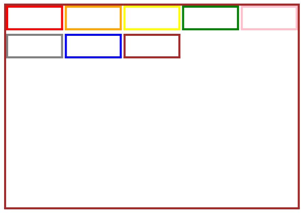

# GridCol
<!--Kit: ArkUI-->
<!--Subsystem: ArkUI-->
<!--Owner: @zju_ljz-->
<!--Designer: @lanshouren-->
<!--Tester: @liuli0427-->
<!--Adviser: @Brilliantry_Rui-->

栅格布局系统中的列组件，必须作为栅格容器组件([GridRow](ts-container-gridrow.md))的子组件使用。适用于响应式布局、多设备适配等需要动态调整列宽的场景。支持响应式断点配置、跨列布局、偏移和排序功能。使用GridCol组件可以快速实现响应式布局，简化多设备适配的开发工作。

>  **说明：**
>
> 该组件从API version 9开始支持。后续版本的新增接口，采用上角标单独标记接口的起始版本。  

## 子组件

可以包含单个子组件。
## 接口

GridCol(option?: GridColOptions)

栅格列布局组件。创建成功后，可根据配置的span、offset、order属性进行栅格布局，作为GridRow的子组件参与栅格系统的布局计算。

**卡片能力：** 从API version 9开始，该接口支持在ArkTS卡片中使用。

**原子化服务API：** 从API version 11开始，该接口支持在原子化服务中使用。

**系统能力：** SystemCapability.ArkUI.ArkUI.Full

**参数：**
| 参数名 | 类型                                                  | 必填 | 说明                                                         |
| ------ | ----------------------------------------------------- | ---- | ------------------------------------------------------------ |
| option   | [GridColOptions](#gridcoloptions对象说明) | 否   | 栅格布局子组件配置选项，可配置span（占用列数）、offset（偏移列数）、order（排序序号）。当需要自定义栅格布局行为（如响应式列宽、固定偏移位置、指定渲染顺序）时传入此参数；当使用默认栅格布局时可不传入。不传入时使用默认配置。 |

## GridColOptions对象说明

设置栅格列布局组件布局选项。

**卡片能力：** 从API version 9开始，该接口支持在ArkTS卡片中使用。

**原子化服务API：** 从API version 11开始，该接口支持在原子化服务中使用。

**系统能力：** SystemCapability.ArkUI.ArkUI.Full

| 名称 | 类型 | 只读 | 可选 | 说明 |
| -------- | -------- | -------- | -------- | -------- |
| span   | number \| [GridColColumnOption](#gridcolcolumnoption) | 否 | 是   | 栅格子组件占用栅格容器组件的列数。span为0表示该元素不参与布局计算，即不会被渲染。<br>取值为非负整数，默认值为1。<br>非法值：按默认值处理。|
| offset | number \| [GridColColumnOption](#gridcolcolumnoption) | 否 | 是   | 栅格子组件相对于原本位置偏移的列数。offset为0表示不偏移。<br>取值为非负整数，默认值为0。<br>非法值：按默认值处理。|
| order  | number \| [GridColColumnOption](#gridcolcolumnoption) | 否 | 是   | 元素的序号，根据栅格子组件的序号，从小到大对栅格子组件做排序。<br>取值为非负整数，默认值为0。<br>非法值：按默认值处理。<br>**说明：**<br>当子组件不设置order或者设置相同的order，子组件按照代码顺序展示。<br>当子组件部分设置order，部分不设置order时，未设置order的子组件依次排序靠前，设置了order的子组件按照数值从小到大排列。|

`span`、`offset`、`order`属性按照`xs`、`sm`、`md`、`lg`、`xl`、`xxl`的顺序具有“继承性”，未设置值的断点将会从前一个断点取值。

API version 20之后，`span`的继承规则见[GridColColumnOption](#gridcolcolumnoption)，`offset`和`order`的继承规则保持不变。

## 属性
除支持[通用属性](ts-component-general-attributes.md)外，还支持以下属性：

### span

span(value: number | GridColColumnOption)

设置栅格子组件占用列数。调用成功后，栅格子组件将按照设置的列数占据相应宽度的栅格区域。span为0表示该元素不参与布局计算，即不会被渲染。

**卡片能力：** 从API version 9开始，该接口支持在ArkTS卡片中使用。

**原子化服务API：** 从API version 11开始，该接口支持在原子化服务中使用。

**系统能力：** SystemCapability.ArkUI.ArkUI.Full

**参数：** 

| 参数名 | 类型                                                         | 必填 | 说明                     |
| ------ | ------------------------------------------------------------ | ---- | ------------------------ |
| value  | number&nbsp;\|&nbsp;[GridColColumnOption](#gridcolcolumnoption) | 是   | 占用列数。span为0表示该元素不参与布局计算，即不会被渲染。<br>取值为非负整数，默认值为1。<br>非法值：按默认值处理。<br>**说明：** 该属性具有断点继承性，详见[GridColOptions对象说明](#gridcoloptions对象说明)。API version 20之后，默认值继承规则有变化，详见[GridColColumnOption](#gridcolcolumnoption)。 |

### gridColOffset

gridColOffset(value: number | GridColColumnOption)

设置栅格子组件相对于原本位置偏移的列数。

**卡片能力：** 从API version 9开始，该接口支持在ArkTS卡片中使用。

**原子化服务API：** 从API version 11开始，该接口支持在原子化服务中使用。

**系统能力：** SystemCapability.ArkUI.ArkUI.Full

**参数：** 

| 参数名 | 类型                                                         | 必填 | 说明                                             |
| ------ | ------------------------------------------------------------ | ---- | ------------------------------------------------ |
| value  | number&nbsp;\|&nbsp;[GridColColumnOption](#gridcolcolumnoption) | 是   | 相对于原本位置偏移的列数。gridColOffset为0表示不偏移。<br>取值为非负整数，默认值为0。<br>非法值：按默认值处理。<br>**说明：** 该属性具有断点继承性，详见[GridColOptions对象说明](#gridcoloptions对象说明)。|

### order

order(value: number | GridColColumnOption)

设置栅格子组件的序号，根据序号从小到大对栅格子组件进行排序。

**卡片能力：** 从API version 9开始，该接口支持在ArkTS卡片中使用。

**原子化服务API：** 从API version 11开始，该接口支持在原子化服务中使用。

**系统能力：** SystemCapability.ArkUI.ArkUI.Full

**参数：** 

| 参数名 | 类型                                                         | 必填 | 说明                                                         |
| ------ | ------------------------------------------------------------ | ---- | ------------------------------------------------------------ |
| value  | number&nbsp;\|&nbsp;[GridColColumnOption](#gridcolcolumnoption) | 是   | 元素序号，根据栅格子组件的序号从小到大排序。<br>取值为非负整数，默认值为0。<br>非法值：按默认值处理。<br>**说明：** 该属性具有断点继承性，详见[GridColOptions对象说明](#gridcoloptions对象说明)。|

## GridColColumnOption

用于自定义指定在不同宽度设备类型上，栅格子组件占据的栅格数量单位。

- API version 20之前，仅配置部分断点下GridCol组件所占列数，取已配置的更小断点的列数补全未配置的列数。若未配置更小断点的列数，取默认值1。
  <!--code_no_check-->
  ```ts
  span: {xs:2, md:4, lg:8} // 等于配置 span: {xs:2, sm:2, md:4, lg:8, xl:8, xxl:8}
  span: {md:4, lg:8} // 等于配置 span: {xs:1, sm:1, md:4, lg:8, xl:8, xxl:8}
  ```
- API version 20及以后，仅配置部分断点下GridCol组件所占列数，取已配置的更小断点的列数补全未配置的列数。若未配置更小断点的列数，取已配置的更大断点的列数补全未配置的列数。
  <!--code_no_check-->
  ```ts
  span: {xs:2, md:4, lg:8} // 等于配置 span: {xs:2, sm:2, md:4, lg:8, xl:8, xxl:8}
  span: {md:4, lg:8} // 等于配置 span: {xs:4, sm:4, md:4, lg:8, xl:8, xxl:8}
  ```
- 建议手动配置不同断点下GridCol组件所占列数，避免默认补全列数的布局效果不符合预期。

**卡片能力：** 从API version 9开始，该接口支持在ArkTS卡片中使用。

**原子化服务API：** 从API version 11开始，该接口支持在原子化服务中使用。

**系统能力：** SystemCapability.ArkUI.ArkUI.Full

| 名称 | 类型 | 只读 | 可选 | 说明 |
| -------- | -------- | -------- | -------- | -------- |
| xs  | number | 否 | 是  | 在最小宽度类型设备上，栅格子组件占据的栅格列数。取值为非负整数。默认值为1。非法值：按默认值处理。    |
| sm  | number | 否 | 是  | 在小宽度类型设备上，栅格子组件占据的栅格列数。取值为非负整数。默认值为1。非法值：按默认值处理。      |
| md  | number | 否 | 是  | 在中等宽度类型设备上，栅格子组件占据的栅格列数。取值为非负整数。默认值为1。非法值：按默认值处理。    |
| lg  | number | 否 | 是  | 在大宽度类型设备上，栅格子组件占据的栅格列数。取值为非负整数。默认值为1。非法值：按默认值处理。      |
| xl  | number | 否 | 是  | 在特大宽度类型设备上，栅格子组件占据的栅格列数。取值为非负整数。默认值为1。非法值：按默认值处理。    |
| xxl | number | 否 | 是  | 在超大宽度类型设备上，栅格子组件占据的栅格列数。取值为非负整数。默认值为1。非法值：按默认值处理。    |

## 事件
支持[通用事件](ts-component-general-events.md)。

## 示例
GridCol的基本用法示例。

```ts
// xxx.ets
@Entry
@Component
struct GridColExample {
  @State bgColors: Color[] =
    [Color.Red, Color.Orange, Color.Yellow, Color.Green, Color.Pink, Color.Grey, Color.Blue, Color.Brown]
  @State currentBp: string = 'unknown'

  build() {
    Column() {
      // 创建栅格容器，配置列数、间距和响应式断点
      GridRow({
        columns: 5,
        gutter: { x: 5, y: 10 },
        // 设置响应式断点，基于窗口尺寸判断
        breakpoints: {
          value: ['400vp', '600vp', '800vp'],
          reference: BreakpointsReference.WindowSize
        },
        direction: GridRowDirection.Row
      }) {
        ForEach(this.bgColors, (color: Color) => {
          // 配置不同断点下的span值，实现响应式布局
          GridCol({
            span: { xs: 1, sm: 2, md: 3, lg: 4 },
            offset: 0,
            order: 0
          }) {
            Row().width('100%').height('20vp')
          }.borderColor(color).borderWidth(2)
        })
      }.width('100%').height('100%')
      .onBreakpointChange((breakpoint) => {
        this.currentBp = breakpoint
      })
    }.width('80%').margin({ left: 10, top: 5, bottom: 5 }).height(200)
    .border({ color: '#880606', width: 2 })
  }
}
```

