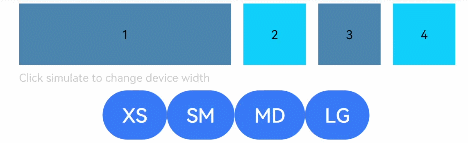

# GridContainer
<!--Kit: ArkUI-->
<!--Subsystem: ArkUI-->
<!--Owner: @fenglinbailu-->
<!--Designer: @lanshouren-->
<!--Tester: @liuli0427-->
<!--Adviser: @Brilliantry_Rui-->

纵向排布栅格布局容器，仅在栅格布局场景中使用。栅格布局通过将容器宽度划分为指定列数，实现响应式布局，子组件可占用不同的列数和偏移量。适用于响应式页面布局、多栏目内容展示、仪表盘布局等场景。

>  **说明：**
>
>  从API version 9开始，该组件不再维护，推荐使用新组件[GridCol](ts-container-gridcol.md)、[GridRow](ts-container-gridrow.md)。
>
>  该组件从API version 7开始支持。后续版本的新增接口，采用上角标单独标记接口的起始版本。


## 子组件

可以包含子组件。

## 接口

### GridContainer<sup>(deprecated)</sup>

GridContainer(value?: GridContainerOptions)

创建纵向排布栅格布局容器。

> **说明：**
>
> 从API version 7开始支持，从API version 9开始废弃。建议使用[GridCol](ts-container-gridcol.md#接口)或[GridRow](ts-container-gridrow.md#接口)替代。

**系统能力：** SystemCapability.ArkUI.ArkUI.Full

**参数：**

| 参数名 | 类型 | 必填 | 说明 |
| -------- | -------- | -------- | -------- |
| value | [GridContainerOptions](#gridcontaineroptionsdeprecated对象说明) | 否 | GridContainer配置参数，用于设置栅格布局的列数、设备宽度类型、列间距和两侧间距。不传入时使用默认配置。 |

## GridContainerOptions<sup>(deprecated)</sup>对象说明

栅格栅格布局容器配置参数对象，用于设置GridContainer组件的列数、设备宽度类型、列间距和两侧间距。

> **说明：**
>
> 从API version 7开始支持，从API version 9开始废弃。建议使用[GridColOptions](ts-container-gridcol.md#gridcoloptions对象说明)或[GridRowOptions](ts-container-gridrow.md#gridrowoptions对象说明)替代。

**系统能力：** SystemCapability.ArkUI.ArkUI.Full

| 名称 | 类型 | 只读 | 可选 | 说明 |
| -------- | -------- | -------- | -------- | -------- |
| columns | number&nbsp;\|&nbsp;'auto' | 否 | 是 | 当前布局总列数，number类型需为正整数。设置为number时使用固定列数布局；设置为'auto'时，系统根据设备宽度类型自动确定列数（XS为2列，SM为4列，MD为8列，LG为12列）。传入0或负数时视为未设置，系统自动确定列数。<br>默认值：'auto' |
| sizeType | [SizeType](#sizetypedeprecated枚举说明) | 否 | 是 | 设置设备宽度类型，用于响应式布局。<br>默认值：SizeType.Auto |
| gutter | number&nbsp;\|&nbsp;string | 否 | 是 | 栅格布局列间距，不支持百分比。number类型默认单位为vp，取值范围[0, +∞)。不设置时根据设备宽度类型自动确定：XS为12vp，SM/MD/LG为24vp。 |
| margin | number&nbsp;\|&nbsp;string | 否 | 是 | 栅格布局两侧间距，不支持百分比。number类型默认单位为vp，取值范围[0, +∞)。不设置时根据设备宽度类型自动确定：XS为12vp，SM为24vp，MD为32vp，LG为48vp。 |

## SizeType<sup>(deprecated)</sup>枚举说明

设备宽度类型枚举，用于在栅格布局中区分不同宽度的设备类型，实现响应式布局。

> **说明：**
>
> 从API version 7开始支持，从API version 9开始废弃。建议使用[GridColColumnOption](ts-container-gridcol.md#gridcolcolumnoption)或[GridRowColumnOption](ts-container-gridrow.md#gridrowcolumnoption)替代。

**系统能力：** SystemCapability.ArkUI.ArkUI.Full

| 名称 | 说明 |
| -------- | -------- |
| XS | 最小宽度类型设备，宽度≤320vp。 |
| SM | 小宽度类型设备，宽度320vp-600vp。 |
| MD | 中等宽度类型设备，宽度600vp-840vp。 |
| LG | 大宽度类型设备，宽度≥840vp。 |
| Auto | 根据设备宽度自动匹配合适的尺寸类型。 |


## 属性

支持[通用属性](ts-component-general-attributes.md)和Column组件的[属性方法](ts-container-column.md#属性)。


## 事件

支持[通用事件](ts-component-general-events.md)。

## 示例

```ts
// xxx.ets
// 栅格布局示例：GridContainer配合useSizeType实现响应式布局
@Entry
@Component
struct GridContainerExample {
  @State sizeType: SizeType = SizeType.XS // 当前设备宽度类型

  build() {
    Column({ space: 5 }) {
      // 配置12列栅格布局，列间距10vp，两侧间距20vp
      GridContainer({ columns: 12, sizeType: this.sizeType, gutter: 10, margin: 20 }) {
        Row() {
          // 子组件通过useSizeType设置不同设备宽度类型下的span（占列数）和offset（偏移列数）
          Text('1')
            .useSizeType({
              xs: { span: 6, offset: 0 },
              sm: { span: 2, offset: 0 },
              md: { span: 2, offset: 0 },
              lg: { span: 2, offset: 0 }
            })
            .height(50).backgroundColor(0x4682B4).textAlign(TextAlign.Center)
          Text('2')
            .useSizeType({
              xs: { span: 2, offset: 6 },
              sm: { span: 6, offset: 2 },
              md: { span: 2, offset: 2 },
              lg: { span: 2, offset: 2 }
            })
            .height(50).backgroundColor(0x00BFFF).textAlign(TextAlign.Center)
          Text('3')
            .useSizeType({
              xs: { span: 2, offset: 8 },
              sm: { span: 2, offset: 8 },
              md: { span: 6, offset: 4 },
              lg: { span: 2, offset: 4 }
            })
            .height(50).backgroundColor(0x4682B4).textAlign(TextAlign.Center)
          Text('4')
            .useSizeType({
              xs: { span: 2, offset: 10 },
              sm: { span: 2, offset: 10 },
              md: { span: 2, offset: 10 },
              lg: { span: 6, offset: 6 }
            })
            .height(50).backgroundColor(0x00BFFF).textAlign(TextAlign.Center)
        }
      }.width('90%')

      Text('Click Simulate to change the device width').fontSize(9).width('90%').fontColor(0xCCCCCC)
      // 点击按钮切换设备宽度类型，观察响应式布局变化
      Row() {
        Button('XS')
          .onClick(() => {
            this.sizeType = SizeType.XS
          }).backgroundColor(0x317aff)
        Button('SM')
          .onClick(() => {
            this.sizeType = SizeType.SM
          }).backgroundColor(0x317aff)
        Button('MD')
          .onClick(() => {
            this.sizeType = SizeType.MD
          }).backgroundColor(0x317aff)
        Button('LG')
          .onClick(() => {
            this.sizeType = SizeType.LG
          }).backgroundColor(0x317aff)
      }
    }.width('100%').margin({ top: 5 })
  }
}
```


