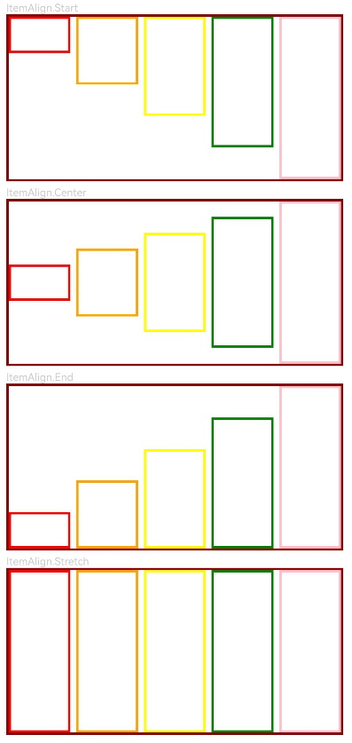

# GridRow
<!--Kit: ArkUI-->
<!--Subsystem: ArkUI-->
<!--Owner: @zju_ljz-->
<!--Designer: @lanshouren-->
<!--Tester: @liuli0427-->
<!--Adviser: @Brilliantry_Rui-->

栅格布局可以为布局提供规律性的结构，解决多尺寸多设备的动态布局问题，保证不同设备上各个模块的布局一致性。

栅格容器组件，仅可以和栅格子组件([GridCol](ts-container-gridcol.md))在栅格布局场景中使用。

支持根据设备尺寸和断点动态调整列数与间距，实现响应式布局。

>  **说明：**
>
> 该组件从API version 9开始支持。后续版本的新增接口，采用上角标单独标记接口的起始版本。


## 子组件

可以包含GridCol子组件。


## 接口
GridRow(option?: GridRowOptions)

栅格行布局容器。仅可以和栅格子组件在栅格布局场景中使用。

**卡片能力：** 从API version 9开始，该接口支持在ArkTS卡片中使用。

**原子化服务API：** 从API version 11开始，该接口支持在原子化服务中使用。

**系统能力：** SystemCapability.ArkUI.ArkUI.Full

**参数：**
| 参数名 |类型|必填|说明|
|-----|-----|----|----|
| option | [GridRowOptions](#gridrowoptions对象说明) | 否  | 栅格行布局容器的布局选项。当需要自定义栅格布局（如设置列数、间距、断点位置、排列方向等）时传入此参数。不传入时使用默认配置。GridRow需与[GridCol](ts-container-gridcol.md)子组件配合使用。 |

## GridRowOptions对象说明

设置栅格行布局容器的布局选项。

**卡片能力：** 从API version 9开始，该接口支持在ArkTS卡片中使用。

**原子化服务API：** 从API version 11开始，该接口支持在原子化服务中使用。

**系统能力：** SystemCapability.ArkUI.ArkUI.Full

| 名称 | 类型 | 只读 | 可选 | 说明 |
| -------- | -------- | -------- | -------- | -------- |
|columns| number \| [GridRowColumnOption](#gridrowcolumnoption) |  否 | 是  |设置布局列数。<br>取值为大于0的整数。<br>- API version 20之前：默认值为12。<br>- API version 20及之后：默认值为{ xs: 2, sm: 4, md: 8, lg: 12, xl: 12, xxl: 12 } <br>非法值：按默认值处理。|
|gutter|[Length](ts-types.md#length) \| [GutterOption](#gutteroption)|  否 | 是  |栅格布局间距。<br>默认值：0vp <br>非法值：按默认值处理。<br>单位：vp |
|breakpoints|[BreakPoints](#breakpoints)|  否 | 是  |设置断点位置的单调递增数组，以及断点切换时的参照对象（基于应用窗口或容器尺寸）。<br>默认值：<br>{<br>value: ["320vp", "600vp", "840vp"],<br>reference: BreakpointsReference.WindowSize<br>} <br>非法值：按默认值处理。<br>单位：vp |
|direction|[GridRowDirection](#gridrowdirection枚举说明)|  否 | 是  |栅格布局排列方向。支持Row（行方向排列，适用于常规LTR布局）和RowReverse（逆序行方向排列，适用于RTL布局或需要反向排列的场景）。<br>默认值：GridRowDirection.Row <br>非法值：按默认值处理。 |

## GutterOption

栅格布局间距类型，用于描述栅格子组件不同方向的间距。

**卡片能力：** 从API version 9开始，该接口支持在ArkTS卡片中使用。

**原子化服务API：** 从API version 11开始，该接口支持在原子化服务中使用。

**系统能力：** SystemCapability.ArkUI.ArkUI.Full

| 名称 | 类型 | 只读 | 可选 | 说明 |
| -------- | -------- | -------- | -------- | -------- |
| x  | [Length](ts-types.md#length) \| [GridRowSizeOption](#gridrowsizeoption) | 否  | 是  | 栅格子组件水平方向间距。取值范围：大于等于0的数值或字符串。<br>默认值：0vp。<br>非法值：按默认值处理。<br>单位：vp    |
| y  | [Length](ts-types.md#length) \| [GridRowSizeOption](#gridrowsizeoption) | 否  | 是   | 栅格子组件垂直方向间距。取值范围：大于等于0的数值或字符串。<br>默认值：0vp。<br>非法值：按默认值处理。<br>单位：vp    |

## GridRowColumnOption

栅格在不同宽度设备类型下的栅格列数配置。

API version 20之前，仅配置部分断点下GridRow组件的栅格列数，取已配置的相邻较小断点（如md的相邻较小断点为sm）的栅格列数补全未配置的栅格列数。若未配置相邻较小断点的栅格列数，以默认栅格列数12补全未配置的栅格列数。
<!--code_no_check-->
```ts
columns: {xs:2, md:4, lg:8} // 等于配置 columns: {xs:2, sm:2, md:4, lg:8, xl:8, xxl:8}
columns: {md:4, lg:8} // 等于配置 columns: {xs:12, sm:12, md:4, lg:8, xl:8, xxl:8}
```

API version 20及以后，仅配置部分断点下GridRow组件的栅格列数，取已配置的相邻较小断点的栅格列数补全未配置的栅格列数。若未配置相邻较小断点的栅格列数，取已配置的更大断点的栅格列数补全未配置的栅格列数。
<!--code_no_check-->
```ts
columns: {xs:2, md:4, lg:8} // 等于配置 columns: {xs:2, sm:2, md:4, lg:8, xl:8, xxl:8}
columns: {md:4, lg:8} // 等于配置 columns: {xs:4, sm:4, md:4, lg:8, xl:8, xxl:8}
```

建议手动配置不同断点下GridRow组件的栅格列数，避免默认补全的栅格列数的布局效果不符合预期。

每列栅格的宽度为GridRow的内容区大小减去栅格子组件的间距gutter，再除以总的栅格列数。比如，宽800vp的GridRow设置columns为12，gutter设置为10vp，padding设置为20vp，那么每列栅格的宽度为(800 - 20 * 2 - 10 * 11) / 12。

**卡片能力：** 从API version 9开始，该接口支持在ArkTS卡片中使用。

**原子化服务API：** 从API version 11开始，该接口支持在原子化服务中使用。

**系统能力：** SystemCapability.ArkUI.ArkUI.Full

| 名称 | 类型 | 只读 | 可选 | 说明 |
| -------- | -------- | -------- | -------- | -------- |
| xs  | number | 否   | 是   | 在最小宽度类型设备上，栅格容器组件的栅格列数。取值为大于0的整数。<br>- API version 20之前：默认值为12。<br>- API version 20及之后：默认值为2。<br>非法值：按默认值处理。    |
| sm  | number | 否    | 是  | 在小宽度类型设备上，栅格容器组件的栅格列数。取值为大于0的整数。<br>- API version 20之前：默认值为12。<br>- API version 20及之后：默认值为4。<br>非法值：按默认值处理。      |
| md  | number | 否    | 是  | 在中等宽度类型设备上，栅格容器组件的栅格列数。取值为大于0的整数。<br>- API version 20之前：默认值为12。<br>- API version 20及之后：默认值为8。<br>非法值：按默认值处理。    |
| lg  | number | 否   | 是   | 在大宽度类型设备上，栅格容器组件的栅格列数。取值为大于0的整数。<br>- API version 20之前：默认值为12。<br>- API version 20及之后：默认值为12。<br>非法值：按默认值处理。      |
| xl  | number | 否    | 是  | 在特大宽度类型设备上，栅格容器组件的栅格列数。取值为大于0的整数。<br>- API version 20之前：默认值为12。<br>- API version 20及之后：默认值为12。<br>非法值：按默认值处理。    |
| xxl | number | 否    | 是  | 在超大宽度类型设备上，栅格容器组件的栅格列数。取值为大于0的整数。<br>- API version 20之前：默认值为12。<br>- API version 20及之后：默认值为12。<br>非法值：按默认值处理。    |

## GridRowSizeOption

栅格在不同宽度设备类型下的gutter大小配置。

**卡片能力：** 从API version 9开始，该接口支持在ArkTS卡片中使用。

**原子化服务API：** 从API version 11开始，该接口支持在原子化服务中使用。

**系统能力：** SystemCapability.ArkUI.ArkUI.Full

| 名称 | 类型 | 只读 | 可选 | 说明 |
| -------- | -------- | -------- | -------- | -------- |
| xs  | [Length](ts-types.md#length) | 否  | 是   | 在最小宽度类型设备上，栅格子组件的间距。取值范围：大于等于0的数值或字符串。<br>默认值：0vp<br>单位：vp<br>非法值：按默认值处理。    |
| sm  | [Length](ts-types.md#length) | 否  | 是   | 在小宽度类型设备上，栅格子组件的间距。取值范围：大于等于0的数值或字符串。<br>默认值：0vp<br>单位：vp<br>非法值：按默认值处理。      |
| md  | [Length](ts-types.md#length) | 否  | 是   | 在中等宽度类型设备上，栅格子组件的间距。取值范围：大于等于0的数值或字符串。<br>默认值：0vp<br>单位：vp<br>非法值：按默认值处理。    |
| lg  | [Length](ts-types.md#length) | 否  | 是   | 在大宽度类型设备上，栅格子组件的间距。取值范围：大于等于0的数值或字符串。<br>默认值：0vp<br>单位：vp<br>非法值：按默认值处理。      |
| xl  | [Length](ts-types.md#length) | 否  | 是   | 在特大宽度类型设备上，栅格子组件的间距。取值范围：大于等于0的数值或字符串。<br>默认值：0vp<br>单位：vp<br>非法值：按默认值处理。    |
| xxl | [Length](ts-types.md#length) | 否  | 是   | 在超大宽度类型设备上，栅格子组件的间距。取值范围：大于等于0的数值或字符串。<br>默认值：0vp<br>单位：vp<br>非法值：按默认值处理。    |

## BreakPoints

设置栅格容器组件的断点。更多断点的说明参考[栅格容器断点](../../../ui/arkts-layout-development-grid-layout.md#栅格容器断点)。

**卡片能力：** 从API version 9开始，该接口支持在ArkTS卡片中使用。

**原子化服务API：** 从API version 11开始，该接口支持在原子化服务中使用。

**系统能力：** SystemCapability.ArkUI.ArkUI.Full

| 名称 | 类型 | 只读 | 可选 | 说明 |
| -------- | -------- | -------- | -------- | -------- |
| value  | Array&lt;string&gt; | 否 | 是  | 设置断点位置的单调递增数组，字符串格式为"数字+vp"，例如"320vp"、"600vp"等。<br>默认值：["320vp", "600vp", "840vp"] <br>非法值：按默认值处理。<br>单位：vp<br>默认断点适用于大多数场景，可根据特殊屏幕尺寸或特定布局需求自定义。    |
| reference  | [BreakpointsReference](#breakpointsreference枚举说明) | 否 | 是   | 断点切换参照物。支持WindowSize（以窗口为参照）和ComponentSize（以容器为参照）。<br>默认值：BreakpointsReference.WindowSize <br>非法值：按默认值处理。 |
<!--code_no_check-->
```ts
  // 启用xs、sm、md共3个断点
  breakpoints: {value: ['100vp', '200vp']}
  // 启用xs、sm、md、lg共4个断点，断点范围值必须单调递增
  breakpoints: {value: ['320vp', '600vp', '840vp']}
  // 启用xs、sm、md、lg、xl共5个断点，断点范围数量不可超过断点可取值数量-1
  breakpoints: {value: ['320vp', '600vp', '840vp', '1080vp']}
```

## BreakpointsReference枚举说明

设置栅格容器组件的断点参照物。

**卡片能力：** 从API version 9开始，该接口支持在ArkTS卡片中使用。

**原子化服务API：** 从API version 11开始，该接口支持在原子化服务中使用。

**系统能力：** SystemCapability.ArkUI.ArkUI.Full

| 名称 | 值 | 说明 |
| -------- | -------- | -------- |
| WindowSize | 0 | 以窗口为参照。断点计算基于应用窗口尺寸，适用于需要根据窗口整体大小变化进行响应式布局的场景。 |
| ComponentSize | 1 | 以容器为参照。断点计算基于GridRow组件自身尺寸，适用于需要根据组件容器尺寸变化进行响应式布局的场景，例如GridRow嵌套在其他容器中时。 |

## GridRowDirection枚举说明

栅格元素排列方向。

> **说明：**
>
> - 栅格元素仅支持Row/RowReverse排列，不支持Column/ColumnReverse方向排列。
> - 栅格子组件仅能通过span、offset计算子组件位置与大小。多个子组件span超过规定列数时自动换行。
> - 单个元素span大小超过最大列数时后台默认span为最大列数。
> - 新一行的offset加上子组件的span超过总列数时，将下一个子组件放在新一行。
> - 例：Item1: GridCol({ span: 6 })， Item2: GridCol({ span: 8, offset:11 })。 
>
>   

**卡片能力：** 从API version 9开始，该接口支持在ArkTS卡片中使用。

**原子化服务API：** 从API version 11开始，该接口支持在原子化服务中使用。

**系统能力：** SystemCapability.ArkUI.ArkUI.Full

| 名称 | 值   | 说明 |
| -------- | ---- | -------- |
| Row | 0 | 栅格元素按照行方向排列。适用于常规LTR（从左到右）布局场景。 |
| RowReverse | 1 | 栅格元素按照逆序行方向排列，适用于RTL（从右到左）语言布局或需要反向排列的场景。 |

## 属性

除支持[通用属性](ts-component-general-attributes.md)外，还支持以下属性：

### alignItems<sup>10+</sup>

alignItems(value: ItemAlign)

设置GridRow中的GridCol交叉轴方向对齐方式。GridCol本身也可通过alignSelf([ItemAlign](ts-appendix-enums.md#itemalign))设置自身对齐方式。当上述两种对齐方式都设置时，以GridCol自身设置为准。

**卡片能力：** 从API version 10开始，该接口支持在ArkTS卡片中使用。

**原子化服务API：** 从API version 11开始，该接口支持在原子化服务中使用。

**模型约束：** 此接口仅可在Stage模型下使用。

**系统能力：** SystemCapability.ArkUI.ArkUI.Full

**参数：** 

| 参数名 | 类型                                        | 必填 | 说明                                                         |
| ------ | ------------------------------------------- | ---- | ------------------------------------------------------------ |
| value  | [ItemAlign](ts-appendix-enums.md#itemalign) | 是   | GridRow中的GridCol交叉轴方向对齐方式。<br>默认值：ItemAlign.Start <br>非法值：按默认值处理。<br>**说明：**<br>ItemAlign支持的枚举：ItemAlign.Start、ItemAlign.Center、ItemAlign.End、ItemAlign.Stretch。 |


## 事件

除支持[通用事件](ts-component-general-events.md)外，还支持以下事件：

### onBreakpointChange

onBreakpointChange(callback: (breakpoints: string) => void)

断点发生变化时触发回调。回调函数接收到的breakpoints参数表示当前断点值（取值为`"xs"`、`"sm"`、`"md"`、`"lg"`、`"xl"`、`"xxl"`），开发者可在回调中根据断点值执行相应的UI布局调整或业务逻辑处理。

> **说明：**
>
> - 当[断点参照物](#breakpointsreference枚举说明)设置为BreakpointsReference.ComponentSize时，不要在onBreakpointChange回调中动态修改GridRow组件的[padding](ts-universal-attributes-size.md#padding)或[margin](ts-universal-attributes-size.md#margin)属性值，否则可能导致组件尺寸计算循环触发、布局抖动或渲染性能下降。

**卡片能力：** 从API version 9开始，该接口支持在ArkTS卡片中使用。

**原子化服务API：** 从API version 11开始，该接口支持在原子化服务中使用。

**系统能力：** SystemCapability.ArkUI.ArkUI.Full

**参数：**

| 参数名   | 类型   | 必填   | 说明   |
| ----- | ------ | ---- | ---------------------------------------- |
|callback| (breakpoints: string) => void |是|断点变化时触发的回调函数。参数breakpoints表示当前断点值，取值为`"xs"`、`"sm"`、`"md"`、`"lg"`、`"xl"`、`"xxl"`。|

## 示例

### 示例1（栅格布局的基本用法）

本示例展示GridRow组件的基本用法。

```ts
// xxx.ets
@Entry
@Component
struct GridRowExample {
  @State bgColors: Color[] = [Color.Red, Color.Orange, Color.Yellow, Color.Green, Color.Pink, Color.Grey, Color.Blue, Color.Brown]
  @State currentBp: string = 'unknown'

  build() {
    Column() {
      GridRow({
        columns: 5,
        gutter: { x: 5, y: 10 },
        breakpoints: { value: ['400vp', '600vp', '800vp'],
          reference: BreakpointsReference.WindowSize },
        direction: GridRowDirection.Row
      }) {
        ForEach(this.bgColors, (color: Color) => {
          GridCol({ span: { xs: 1, sm: 2, md: 3, lg: 4 }, offset: 0, order: 0 }) {
            Row().width('100%').height('20vp')
          }.borderColor(color).borderWidth(2)
        })
      }.width('100%').height('100%')
      .onBreakpointChange((breakpoint) => {
        this.currentBp = breakpoint
      })
    }.width('80%').margin({ left: 10, top: 5, bottom: 5 }).height(200)
    .border({ color: '#880606', width: 2 })
  }
}
```


### 示例2（AlignItems的基本用法）

本示例展示GridCol组件在不同alignItems对齐方式下的效果。

```ts
@ComponentV2
struct AlignItemsDemo {
  bgColors: Color[] = [Color.Red, Color.Orange, Color.Yellow, Color.Green, Color.Pink];
  @Param alignment: ItemAlign = ItemAlign.Start; // 接收父组件传入的alignItems属性值

  ToString(alignment: ItemAlign): string {
    switch (alignment) {
      case ItemAlign.Start:
        return 'ItemAlign.Start';
      case ItemAlign.Center:
        return 'ItemAlign.Center';
      case ItemAlign.End:
        return 'ItemAlign.End';
      case ItemAlign.Stretch:
        return 'ItemAlign.Stretch';
      default:
        return 'ItemAlign.Auto';
    }
  }

  build() {
    Column() {
      Text(this.ToString(this.alignment))
        .fontSize(9)
        .fontColor(0xCCCCCC)
        .width('90%')
        .alignSelf(ItemAlign.Start)
      GridRow({
        columns: 5,
        gutter: { x: 5, y: 10 },
      }) {
        ForEach(this.bgColors, (color: Color, index: number) => {
          GridCol({ span: 1 }) {
            Row() {
            }.width('100%').height(`${(index + 1) * 20}%`) // GridCol内的Row设置不同的高度，方便观察alignItems属性的效果
          }.borderColor(color).borderWidth(2)
        })
      }
      .border({ color: '#880606', width: 2 })
      .alignItems(this.alignment)
      .width('100%')
    }
    .height('20%')
  }
}

@Entry
@ComponentV2
struct GridRowExample {
  alignmentArray: ItemAlign[] = [ItemAlign.Start, ItemAlign.Center, ItemAlign.End, ItemAlign.Stretch];

  build() {
    Column({ space: 15 }) {
      ForEach(this.alignmentArray, (ele: ItemAlign) => {
        AlignItemsDemo({ alignment: ele })
      })
    }.width('80%').margin({ left: 10, top: 5, bottom: 5 }).height('100%')
  }
}
```


