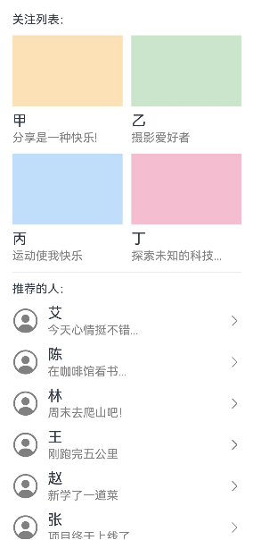
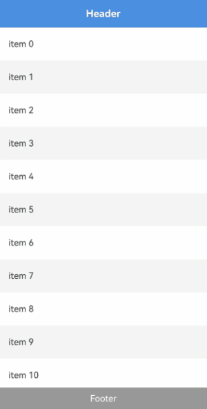

# LazyColumnLayout

<!--Kit: ArkUI-->
<!--Subsystem: ArkUI-->
<!--Owner: @yylong; @rongShao-Z; @yangcan18-->
<!--Designer: @yylong; @yangcan18-->
<!--Tester: @leiyuqian-->
<!--Adviser: @Brilliantry_Rui-->

该组件用于实现支持懒加载的垂直线性布局，其父组件仅限于[List](ts-container-list.md)、[Scroll](ts-container-scroll.md)、[WaterFlow](ts-container-waterflow.md)或[FlowItem](ts-container-flowitem.md)，并支持使用自定义组件或[NodeContainer](ts-basic-components-nodecontainer.md)组件封装后应用在上述组件中。

该组件支持嵌套懒加载容器[LazyVGridLayout](ts-container-lazyvgridlayout.md)、[LazyVWaterFlowLayout](ts-container-lazyvwaterflowlayout.md)及其自身LazyColumnLayout。

更多关于懒加载布局的使用场景和完整示例，可参考[创建懒加载布局](../../../ui/arkts-layout-development-create-lazy-layout.md)。

> **说明：**
>
> - LazyColumnLayout组件高度默认自适应内容，不建议设置会固定或约束组件垂直方向尺寸的属性，设置后会导致显示异常或无法正常滚动。涉及的属性包括[height](ts-universal-attributes-size.md#height)、[size](ts-universal-attributes-size.md#size)中的height、[constraintSize](ts-universal-attributes-size.md#constraintsize)中的minHeight/maxHeight、[aspectRatio](ts-universal-attributes-layout-constraints.md#aspectratio)、[layoutWeight](ts-universal-attributes-size.md#layoutweight)，以及[height](ts-universal-attributes-size.md#height15)取[LayoutPolicy](ts-universal-attributes-size.md#layoutpolicy15)值的场景。
> - 当父组件设置主轴方向尺寸时，LazyColumnLayout按照父组件可视区域进行懒加载；当父组件未设置主轴方向尺寸时，LazyColumnLayout会被内容撑开，导致所有子组件都会被加载布局。
> - 该组件在不同父组件下的懒加载支持条件如下：
>   1. 在List组件下，要求List组件布局方向必须是竖直方向（即[listDirection](ts-container-list.md#listdirection)属性设置为Axis.Vertical），在非竖直方向的List中使用该组件会导致应用崩溃。当List设置了[lanes](ts-container-list.md#lanes9)、[chainAnimation](ts-container-list.md#chainanimation)、[scrollSnapAlign](ts-container-list.md#scrollsnapalign10)属性中的任意一个或多个时，该组件的懒加载功能会失效。
>   2. 在Scroll组件下，要求Scroll组件布局方向必须是竖直方向（即[scrollable](ts-container-scroll.md#scrollable)属性设置为ScrollDirection.Vertical），在非竖直方向的Scroll中使用该组件会导致应用崩溃。
>   3. 在WaterFlow组件下，要求WaterFlow组件布局方向必须是竖直方向（即[layoutDirection](ts-container-waterflow.md#layoutdirection)属性设置为FlexDirection.Column），在非竖直方向的WaterFlow中使用该组件会导致应用崩溃。当WaterFlow为多列模式或布局方向为FlexDirection.Row、FlexDirection.RowReverse时，该组件的懒加载功能会失效。此外，在布局方向为FlexDirection.ColumnReverse的WaterFlow组件下使用该组件会导致显示异常。
> - 当懒加载功能生效时，该组件仅加载父组件可视区域内的子组件，并在帧间空闲时隙预加载可视区域上方和下方各半屏的内容。
> - 此处的父组件指最靠近当前组件的上层滚动组件，其他文档下的具体含义请参考对应内容。

**起始版本：** 26.0.0

## 导入模块

```ts
import { LazyColumnLayout } from '@kit.ArkUI';
```

## 接口

LazyColumnLayout()

创建垂直方向懒加载线性布局容器。

**起始版本：** 26.0.0

**原子化服务API：** 从API版本26.0.0开始，该接口支持在原子化服务中使用。

**模型约束：** 此接口仅可在Stage模型下使用。

**系统能力：** SystemCapability.ArkUI.ArkUI.Full

## 属性

除支持[通用属性](ts-component-general-attributes.md)外，还支持以下属性：

### space

space(space: LengthMetrics | undefined)

设置子组件在垂直方向上的间距。未通过该接口设置时，间距默认值为0vp。

**起始版本：** 26.0.0

**原子化服务API：** 从API版本26.0.0开始，该接口支持在原子化服务中使用。

**模型约束：** 此接口仅可在Stage模型下使用。

**系统能力：** SystemCapability.ArkUI.ArkUI.Full

**参数：**

| 参数名 | 类型                         | 必填 | 说明                         |
| ------ | ---------------------------- | ---- | ---------------------------- |
| space  |  [LengthMetrics](../js-apis-arkui-graphics.md#lengthmetrics12) \| undefined | 是   | 子组件在垂直方向上的间距。<br/>取值范围：[0, +∞)<br/>设置为小于0的值时，按0vp显示。<br/>方法入参为undefined时，恢复为0vp。 |

### alignItems

alignItems(value: HorizontalAlign | undefined)

设置子组件在水平方向上的对齐格式。未通过该接口设置时，对齐格式默认值为HorizontalAlign.Center。

**起始版本：** 26.0.0

**原子化服务API：** 从API版本26.0.0开始，该接口支持在原子化服务中使用。

**模型约束：** 此接口仅可在Stage模型下使用。

**系统能力：** SystemCapability.ArkUI.ArkUI.Full

**参数：**

| 参数名 | 类型                                                    | 必填 | 说明                                                         |
| ------ | ------------------------------------------------------- | ---- | ------------------------------------------------------------ |
| value  | [HorizontalAlign](ts-appendix-enums.md#horizontalalign) \| undefined | 是   | 子组件在水平方向上的对齐格式。<br/>方法入参为undefined时，恢复为HorizontalAlign.Center。 |

### header

header(builder: CustomBuilder | undefined)

设置当前LazyColumnLayout的头部组件。

> **说明：**
>
> 头部组件位于容器顶部区域，通常用于展示标题、分组说明或其他固定在内容前方的元素。
>
> 当本组件随滚动容器滚动至可视区域内，且通过[sticky](#sticky)设置了header吸顶模式时，header会吸附在滚动容器可视区域顶部。

**起始版本：** 26.0.0

**原子化服务API：** 从API版本26.0.0开始，该接口支持在原子化服务中使用。

**模型约束：** 此接口仅可在Stage模型下使用。

**系统能力：** SystemCapability.ArkUI.ArkUI.Full

**参数：**

| 参数名 | 类型                                                     | 必填 | 说明                                                         |
| ------ | -------------------------------------------------------- | ---- | ------------------------------------------------------------ |
| builder | [CustomBuilder](ts-types.md#custombuilder8) \| undefined | 是   | 头部组件构造函数。<br/>方法入参为undefined时，当前LazyColumnLayout不设置头部组件，如果已有头部组件，也会被移除。 |

### footer

footer(builder: CustomBuilder | undefined)

设置当前LazyColumnLayout的尾部组件。

> **说明：**
>
> 尾部组件位于容器底部区域，通常用于展示补充信息、加载状态或其他固定在内容后方的元素。
>
> 当本组件随滚动容器滚动至可视区域内，且通过[sticky](#sticky)设置了footer吸底模式时，footer会吸附在滚动容器可视区域底部。

**起始版本：** 26.0.0

**原子化服务API：** 从API版本26.0.0开始，该接口支持在原子化服务中使用。

**模型约束：** 此接口仅可在Stage模型下使用。

**系统能力：** SystemCapability.ArkUI.ArkUI.Full

**参数：**

| 参数名 | 类型                                                     | 必填 | 说明                                                         |
| ------ | -------------------------------------------------------- | ---- | ------------------------------------------------------------ |
| builder | [CustomBuilder](ts-types.md#custombuilder8) \| undefined | 是   | 尾部组件构造函数。<br/>方法入参为undefined时，当前LazyColumnLayout不设置尾部组件，如果已有尾部组件，也会被移除。 |

### sticky

sticky(sticky: StickyStyle | undefined)

设置[header](#header)和[footer](#footer)的吸附效果。

当本组件随滚动容器滚动至可视区域内，且通过sticky设置header吸顶或footer吸底时，header会吸附在滚动容器可视区域顶部，footer会吸附在滚动容器可视区域底部。

> **说明：**
>
> 由于浮点数计算精度，设置sticky后，在滚动过程中小概率产生缝隙，可以通过[pixelRound](ts-universal-attributes-pixelRoundForComponent.md#pixelround)指定当前组件向下像素取整解决该问题。

**起始版本：** 26.0.0

**原子化服务API：** 从API版本26.0.0开始，该接口支持在原子化服务中使用。

**模型约束：** 此接口仅可在Stage模型下使用。

**系统能力：** SystemCapability.ArkUI.ArkUI.Full

**参数：**

| 参数名 | 类型                                                              | 必填 | 说明                                                         |
| ------ | ----------------------------------------------------------------- | ---- | ------------------------------------------------------------ |
| sticky | [StickyStyle](ts-container-list.md#stickystyle9枚举说明) \| undefined | 是   | 头部组件和尾部组件的吸附模式。sticky属性可以设置为StickyStyle.Header或StickyStyle.Footer，也可以设置为StickyStyle.BOTH，以同时支持头部组件吸顶和尾部组件吸底。<br/>方法入参为undefined时，恢复为默认值StickyStyle.None。<br/>未通过该接口设置时，默认头部组件不吸顶、尾部组件不吸底。 |

## 事件

除支持[通用事件](ts-component-general-events.md)外，还支持以下事件：

### onVisibleIndexesChange

onVisibleIndexesChange(callback: OnVisibleIndexesChangeCallback | undefined)

设置onVisibleIndexesChange回调函数。当LazyColumnLayout在可视区域内的子组件的索引值发生变化时触发回调，返回可视区域内子组件的起始索引值和结束索引值。

> **说明：**
>
> 当父组件设置主轴方向尺寸时，LazyColumnLayout按照父组件可视区域进行懒加载。此时onVisibleIndexesChange回调中start返回当前可视区域起始位置子组件的索引值，end返回当前可视区域结束位置子组件的索引值。
>
> 当父组件未设置主轴方向尺寸时，LazyColumnLayout会被内容撑开，导致所有子组件都会被加载布局。此时onVisibleIndexesChange回调中start返回0，end返回数据源最后一个子组件的索引值。
>
> 此处的父组件指最靠近当前组件的上层滚动组件，其他文档下的具体含义请参考对应内容。

**起始版本：** 26.0.0

**原子化服务API：** 从API版本26.0.0开始，该接口支持在原子化服务中使用。

**模型约束：** 此接口仅可在Stage模型下使用。

**系统能力：** SystemCapability.ArkUI.ArkUI.Full

**参数：**

| 参数名 | 类型   | 必填 | 说明                                  |
| ------ | ------ | ---- | ------------------------------------- |
| callback  | [OnVisibleIndexesChangeCallback](ts-container-scrollable-common.md#onvisibleindexeschangecallback) \| undefined | 是   | 回调函数，用于接收可视区域内子组件起始索引值和结束索引值的变化通知。<br/>方法入参为undefined时，取消监听。 |

## 示例

### 示例1（实现懒加载线性布局）

通过[Scroll](ts-container-scroll.md)和LazyColumnLayout组件实现懒加载线性布局，并通过[onVisibleIndexesChange](#onvisibleindexeschange)在可视区域发生变化时回调索引。

从API版本26.0.0开始，新增支持LazyColumnLayout组件和onVisibleIndexesChange事件。

```ts
import { LengthMetrics, LazyColumnLayout, LazyColumnLayoutAttribute } from '@kit.ArkUI';

// 关注列表数据结构
class Follow {
  name: string;
  image: Resource;
  description: string;

  constructor(name: string, image: Resource, description: string) {
    this.name = name;
    this.image = image;
    this.description = description;
  }
}

// 推荐列表数据结构
class Recommend {
  name: string;
  icon: Resource;
  description: string;

  constructor(name: string, icon: Resource, description: string) {
    this.name = name;
    this.icon = icon;
    this.description = description;
  }
}

@Entry
@Component
struct LazyColumnLayoutSample1 {
  private followList: Follow[] = [
    new Follow('甲', $r('app.media.icon'), '分享是一种快乐!'), // $r('app.media.icon')需要替换为开发者所需的图像资源文件
    new Follow('乙', $r('app.media.icon'), '摄影爱好者'),
    new Follow('丙', $r('app.media.icon'), '运动使我快乐'),
    new Follow('丁', $r('app.media.icon'), '探索未知的科技...'),
    // ...
  ]
  // 将 followList 转成每两个一组的数组
  private followPairs: Follow[][] = []
  private recommend: Recommend[] = [
    new Recommend('艾', $r('sys.symbol.person_crop_circle_fill'), '今天心情挺不错...'),
    new Recommend('陈', $r('sys.symbol.person_crop_circle_fill'), '在咖啡馆看书...'),
    new Recommend('林', $r('sys.symbol.person_crop_circle_fill'), '周末去爬山吧！'),
    new Recommend('王', $r('sys.symbol.person_crop_circle_fill'), '刚跑完五公里'),
    new Recommend('赵', $r('sys.symbol.person_crop_circle_fill'), '新学了一道菜'),
    new Recommend('张', $r('sys.symbol.person_crop_circle_fill'), '项目终于上线了'),
    new Recommend('刘', $r('sys.symbol.person_crop_circle_fill'), '在听一首老歌...'),
    new Recommend('孙', $r('sys.symbol.person_crop_circle_fill'), '准备出发去旅行'),
    new Recommend('周', $r('sys.symbol.person_crop_circle_fill'), '今天天气真好！'),
    new Recommend('吴', $r('sys.symbol.person_crop_circle_fill'), '加班中，勿扰...'),
    new Recommend('郑', $r('sys.symbol.person_crop_circle_fill'), '养了一只小猫'),
    new Recommend('杨', $r('sys.symbol.person_crop_circle_fill'), '正在打篮球'),
    // ...
  ]

  private itemColor(index: number): string {
    const colors: string[] = ['#FFE0B2', '#C8E6C9', '#BBDEFB', '#F8BBD0']
    return colors[index % colors.length]
  }

  aboutToAppear() {
    for (let i = 0; i < this.followList.length; i += 2) {
      this.followPairs.push(this.followList.slice(i, i + 2))
    }
  }

  build() {
    Column() {
      Scroll() {
        LazyColumnLayout() {
          Text('关注列表：')

          // 嵌套LazyColumnLayout展示双列关注列表
          LazyColumnLayout() {
            ForEach(this.followPairs, (pair: Follow[], rowIndex: number) => {
              Row({ space: 12 }) {
                ForEach(pair, (item: Follow, colIndex: number) => {
                  Column() {
                    Image(item.image).height(96).width('100%').backgroundColor(this.itemColor(rowIndex * 2 + colIndex))
                    Text(item.name).fontSize(20).margin({ top: 8 })
                    Text(item.description).fontSize(16).fontColor(Color.Gray).margin({ top: 2 })
                  }
                  .alignItems(HorizontalAlign.Start)
                  .layoutWeight(1)
                }, (item: Follow) => JSON.stringify(item))
              }
              .width('100%')
            })
          }
          .space(LengthMetrics.vp(12))

          Divider().height(2)

          Text('推荐的人：')

          // 使用独立LazyColumnLayout展示推荐列表
          LazyColumnLayout() {
            ForEach(this.recommend, (item: Recommend, index: number) => {
              Row() {
                SymbolGlyph(item.icon).fontSize(36).fontColor([Color.Gray])
                Column() {
                  Text(item.name).fontSize(20)
                  Text(item.description).fontSize(16).fontColor(Color.Gray).margin({ top: 2 })
                }
                .margin({ left: 12 })
                .alignItems(HorizontalAlign.Start)

                Blank()
                SymbolGlyph($r('sys.symbol.chevron_forward')).fontSize(20).fontColor([Color.Gray])
              }
              .width('100%')
            }, (item: Recommend) => JSON.stringify(item))
          }
          .space(LengthMetrics.vp(12))
          .onVisibleIndexesChange((start: number, end: number) => {
            console.info('LazyColumnLayout visible indexes: start: ' + start + ', end: ' + end);
          })
        }
        .padding({ left: 24, right: 24 })
        .space(LengthMetrics.vp(12))
        .alignItems(HorizontalAlign.Start)
      }
      .layoutWeight(1)
    }
    .width('100%')
    .height('100%')
  }
}
```


### 示例2（设置头部组件或尾部组件及吸附效果）

该示例通过[Scroll](ts-container-scroll.md)嵌套LazyColumnLayout，并通过[header](#header)、[footer](#footer)、[sticky](#sticky)实现顶部和底部吸附效果。滚动过程中header吸附在可视区域顶部，footer吸附在可视区域底部。

从API版本26.0.0开始，新增支持header、footer和sticky属性。

<!--code_no_check-->
```ts
import { LazyColumnLayout, LazyColumnLayoutAttribute } from '@kit.ArkUI';
// MyDataSource是自定义数据源类，实现了LazyForEach所需的IDataSource接口
import { MyDataSource } from './MyDataSource';

@Entry
@Component
struct LazyColumnLayoutStickyDemo {
  private items: MyDataSource<number> = new MyDataSource<number>();

  aboutToAppear(): void {
    for (let i = 0; i < 30; i++) {
      this.items.pushData(i);
    }
  }

  // 构建头部组件
  @Builder
  HeaderBuilder() {
    Row() {
      Text('Header')
        .fontSize(18)
        .fontColor(Color.White)
        .fontWeight(FontWeight.Bold)
    }
    .width('100%')
    .height(50)
    .justifyContent(FlexAlign.Center)
    .alignItems(VerticalAlign.Center)
    .backgroundColor('#4A90E2')
  }

  @Builder
  FooterBuilder() {
    Row() {
      Text('Footer')
        .fontSize(16)
        .fontColor(Color.White)
    }
    .width('100%')
    .height(40)
    .justifyContent(FlexAlign.Center)
    .alignItems(VerticalAlign.Center)
    .backgroundColor('#999999')
  }

  build() {
    Scroll() {
      LazyColumnLayout() {
        LazyForEach(this.items, (item: number) => {
          Text('item ' + item)
            .fontSize(16)
            .height(60)
            .width('100%')
            .padding({ left: 16 })
            .backgroundColor(item % 2 === 0 ? '#FFFFFF' : '#F5F5F5')
            .textAlign(TextAlign.Start)
        })
      }
      .header(this.HeaderBuilder)
      .footer(this.FooterBuilder)
      // 设置头部和尾部同时吸附
      .sticky(StickyStyle.BOTH)
    }
    .width('100%')
    .height('100%')
    .edgeEffect(EdgeEffect.Spring)
  }
}
```

<!--code_no_check-->
```ts
// MyDataSource.ets
export class BasicDataSource<T> implements IDataSource {
  private listeners: DataChangeListener[] = [];
  protected dataArray: T[] = [];

  public totalCount(): number {
    return this.dataArray.length;
  }

  public getData(index: number): T {
    return this.dataArray[index];
  }

  registerDataChangeListener(listener: DataChangeListener): void {
    if (this.listeners.indexOf(listener) < 0) {
      console.info('add listener');
      this.listeners.push(listener);
    }
  }

  unregisterDataChangeListener(listener: DataChangeListener): void {
    const pos = this.listeners.indexOf(listener);
    if (pos >= 0) {
      console.info('remove listener');
      this.listeners.splice(pos, 1);
    }
  }

  notifyDataReload(): void {
    this.listeners.forEach(listener => {
      listener.onDataReloaded();
    })
  }

  notifyDataAdd(index: number): void {
    this.listeners.forEach(listener => {
      listener.onDataAdd(index);
    })
  }

  notifyDataChange(index: number): void {
    this.listeners.forEach(listener => {
      listener.onDataChange(index);
    })
  }

  notifyDataDelete(index: number): void {
    this.listeners.forEach(listener => {
      listener.onDataDelete(index);
    })
  }

  notifyDataMove(from: number, to: number): void {
    this.listeners.forEach(listener => {
      listener.onDataMove(from, to);
    })
  }

  notifyDatasetChange(operations: DataOperation[]): void {
    this.listeners.forEach(listener => {
      listener.onDatasetChange(operations);
    })
  }
}

export class MyDataSource<T> extends BasicDataSource<T> {
  public shiftData(): void {
    this.dataArray.shift();
    this.notifyDataDelete(0);
  }
  public unshiftData(data: T): void {
    this.dataArray.unshift(data);
    this.notifyDataAdd(0);
  }
  public pushData(data: T): void {
    this.dataArray.push(data);
    this.notifyDataAdd(this.dataArray.length - 1);
  }

  public popData(): void {
    this.dataArray.pop();
    this.notifyDataDelete(this.dataArray.length);
  }

  public clearData(): void {
    this.dataArray = [];
    this.notifyDataReload();
  }
}
```

