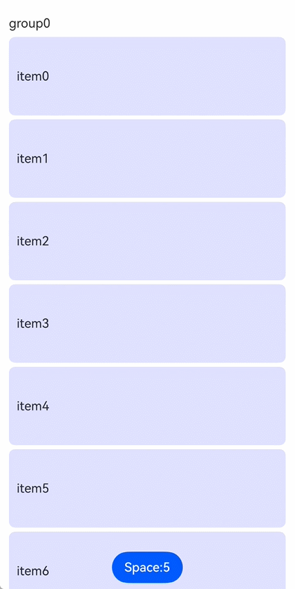

# LazyDynamicLayout

<!--Kit: ArkUI-->
<!--Subsystem: ArkUI-->
<!--Owner: @yylong; @rongShao-Z; @guozejun-->
<!--Designer: @yylong-->
<!--Tester: @huchuyun-->
<!--Adviser: @Brilliantry_Rui-->

该组件用于实现支持懒加载的动态布局容器，支持开发者自定义布局算法。

该组件的父组件支持[List](ts-container-list.md)、[WaterFlow](ts-container-waterflow.md)、[FlowItem](ts-container-flowitem.md)、[Scroll](ts-container-scroll.md)和[LazyColumnLayout](ts-container-lazycolumnlayout.md)，同时支持使用自定义组件或[NodeContainer](ts-basic-components-nodecontainer.md)组件封装后应用在List、WaterFlow、FlowItem、Scroll和LazyColumnLayout中。

> **说明：**
>
> - 本模块同时支持ArkTS-Dyn、ArkTS-Sta。
>
> - 本模块接口仅可在Stage模型下使用。
>
> - 该组件在不同父组件下的懒加载支持条件如下：
>   1. 在WaterFlow组件下，仅在WaterFlow组件的单列模式或分段布局中的单列分段场景下使用时支持懒加载。
>   2. 在List组件下，当List设置了[lanes](ts-container-list.md#lanes9)、[chainAnimation](ts-container-list.md#chainanimation)、[scrollSnapAlign](ts-container-list.md#scrollsnapalign10)属性中的任意一个时，该组件的懒加载功能会失效。
>   3. 在Scroll、List、WaterFlow组件下使用时，Scroll、List、WaterFlow的滚动方向（水平或垂直）必须和该组件布局方向相同，若布局方向不同会导致应用崩溃。

**起始版本：** 26.0.0

## 子组件

可以包含子组件。

## 接口

LazyDynamicLayout(algorithm: LazyLayoutAlgorithm)  

懒加载动态布局容器。

**起始版本：** 26.0.0

**模型约束：** 此接口仅可在Stage模型下使用。

**原子化服务API（仅ArkTS-Dyn）：** 从API版本26.0.0开始，该接口支持在原子化服务中使用。

**系统能力：** SystemCapability.ArkUI.ArkUI.Full

**ArkTS-Dyn起始版本：** 26.0.0

**ArkTS-Sta起始版本：** 26.0.0

**参数：**

| 参数名 | 类型 | 必填 | 说明 |
| ---- | ---- | ---- | ---- |
| algorithm | [LazyLayoutAlgorithm](../js-apis-arkui-lazyLayoutAlgorithm.md#lazylayoutalgorithm-1) | 是 | 指定懒加载动态布局组件的布局算法。|

## 属性

支持[通用属性](ts-component-general-attributes.md)。

> **说明：**
>
> 当布局算法为[LazyCustomLayoutAlgorithm](../js-apis-arkui-lazyLayoutAlgorithm.md#lazycustomlayoutalgorithm)时，LazyDynamicLayout组件[FrameNode](../js-apis-arkui-frameNode.md#framenode-1)的[setMeasuredSize](../js-apis-arkui-frameNode.md#setmeasuredsize12)方法优先级高于[尺寸设置](ts-universal-attributes-size.md)和[边框设置](ts-universal-attributes-border.md)属性，子组件[FrameNode](../js-apis-arkui-frameNode.md#framenode-1)的[measure](../js-apis-arkui-frameNode.md#measure12)和[layout](../js-apis-arkui-frameNode.md#layout12)方法优先级高于[ignoreLayoutSafeArea](ts-universal-attributes-expand-safe-area.md#ignorelayoutsafearea20)属性。


## 事件

支持[通用事件](ts-component-general-events.md)。

### onVisibleIndexesChange

onVisibleIndexesChange(callback: [Callback](ts-types.md#callback12)&lt;number[]&gt; | undefined)

设置onVisibleIndexesChange回调函数。当LazyDynamicLayout首次布局完成或在其父可滚动组件可视区域内的子组件的索引值发生变化时触发回调，返回可视区域内子组件的索引值列表。

**起始版本：** 26.0.0

**模型约束：** 此接口仅可在Stage模型下使用。

**原子化服务API（仅ArkTS-Dyn）：** 从API版本26.0.0开始，该接口支持在原子化服务中使用。

**系统能力：** SystemCapability.ArkUI.ArkUI.Full

**ArkTS-Dyn起始版本：** 26.0.0

**ArkTS-Sta起始版本：** 26.0.0

**参数：**

| 参数名 | 类型   | 必填 | 说明                       |
| ------ | ------ | ---- | -------------------------- |
| callback  | [Callback](ts-types.md#callback12)&lt;number[]&gt;&nbsp;\|&nbsp;undefined | 是  | LazyDynamicLayout在其父可滚动组件可视区域内子组件的索引值发生变化时触发的回调函数。返回可视区域内子组件的索引数组。入参为undefined时，取消监听。 |

## 示例

### 示例1（实现懒加载自定义布局）

通过[List](ts-container-list.md)和LazyDynamicLayout组件实现自定义的懒加载列表布局，并通过[onVisibleIndexesChange](#onvisibleindexeschange)在可视区域发生变化时回调索引。

LazyListLayout实现了一个自定义懒加载列表布局算法，布局算法中通过[setAdjustedOffset](../js-apis-arkui-lazyLayoutAlgorithm.md#setadjustedoffset)接口，实现了LazyDynamicLayout下子组件布局间隔变化后，LazyDynamicLayout在可视区域第一个子组件位置不变的效果。

MyDataSource实现了[LazyForEach](ts-rendering-control-lazyforeach.md)数据源接口[IDataSource](ts-rendering-control-lazyforeach.md#idatasource)，用于通过LazyForEach给LazyDynamicLayout提供子组件。

从API版本26.0.0开始，新增LazyDynamicLayout组件。

```ts
import { LazyDynamicLayout, LazyDynamicLayoutAttribute } from '@kit.ArkUI';
import { MyDataSource } from './MyDataSource';
import { LazyListLayout } from './LazyListLayout';

// 自定义懒加载列表布局组件
@Component
struct MyLazyListLayout {
  // 间隔大小，使用@Watch监听变化，变化时触发onSpaceChange方法
  @Prop @Watch('onSpaceChange') space: number;
  arr: MyDataSource<string> = new MyDataSource<string>();
  private itemHeight: number = 100;
  // 懒加载布局算法实例，将高度转换为像素单位
  private lazyAlgorithm: LazyListLayout = new LazyListLayout(this.getUIContext().vp2px(this.itemHeight));

  // 间隔变化时更新布局算法中的间隔值
  onSpaceChange(): void {
    this.lazyAlgorithm.setSpace(this.getUIContext().vp2px(this.space));
  }

  aboutToAppear(): void {
    this.lazyAlgorithm.setSpace(this.getUIContext().vp2px(this.space));
  }

  build() {
    // 使用LazyDynamicLayout组件，传入懒加载布局算法
    LazyDynamicLayout(this.lazyAlgorithm) {
      LazyForEach(this.arr, (item: string) => {
        Text(item)
          .height(this.itemHeight)
          .width('100%')
          .borderRadius(8)
          .backgroundColor('#E0E0FF')
          .padding(10)
      })
    }
    // 监听可视区域内子组件索引变化
    .onVisibleIndexesChange((child: number[]) => {
      console.info(`onVisibleIndexesChange:start:${child}`);
    })
  }
}

// 定义分组数据接口
interface groupData {
  title: string;
  data: MyDataSource<string>;
}

// 主页面组件
@Entry
@Component
struct CustomListLayoutTest {
  @State groupArr: groupData[] = []; // 分组数据数组
  @State space: number = 5; // 列表项间隔大小

  aboutToAppear(): void {
    for (let i = 0; i < 3; i++) {
      let data = new MyDataSource<string>();
      for (let j = 0; j < 10; j++) {
        data.pushData('item' + j.toString());
      }
      this.groupArr.push({ title: 'group' + i.toString(), data: data });
    }
  }

  build() {
    Stack({ alignContent: Alignment.Bottom }) {
      List() {
        ForEach(this.groupArr, (item: groupData) => {
          ListItem() {
            Text(item.title).margin({ top: 20, bottom: 8 })
          }
          // 使用自定义懒加载布局组件
          MyLazyListLayout({ arr: item.data, space: this.space })
        })
      }
      .layoutWeight(1)
      .padding({ left: 12, right: 12 })
      .height('100%')
      .width('100%')

      Button('Space:' + this.space.toString())
        .onClick(() => {
          // 在5和10之间切换间隔大小，切换前后保持可视区域第一个子组件位置不变
          this.space = this.space === 5 ? 10 : 5;
        })
    }
    .height('100%')
    .width('100%')
  }
}
```

```ts
// LazyListLayout.ets
// 导入布局相关的接口和类
import { LayoutConstraint, LazyLayoutHelper, LazyCustomLayoutAlgorithm, ExpandMode, ChildrenCountMode,
  LazyLayoutDirection } from '@kit.ArkUI';

// 自定义懒加载列表布局算法，继承自LazyCustomLayoutAlgorithm
export class LazyListLayout extends LazyCustomLayoutAlgorithm {
  private itemHeight: number = 320; // 每个列表项的高度（像素）
  private totalHeight: number = 0; // 列表总高度
  private childCnt: number = 0; // 子组件总数
  private startIndex: number = -1; // 当前可视区域的起始索引
  private endIndex: number = -1; // 当前可视区域的结束索引
  private space: number = 0; // 当前间隔大小
  private prevSpace: number = 0; // 上一次的间隔大小
  selfNode?: FrameNode; // 自身FrameNode节点引用

  // 构造函数，接收列表项高度参数
  constructor(itemHeight: number) {
    super();
    this.itemHeight = itemHeight;
  }

  // 设置列表项间隔大小
  setSpace(value: number): void {
    if (this.space == value) {
      return;
    }
    this.prevSpace = this.space;
    this.space = value;
    // 触发布局重新计算
    this.selfNode?.setNeedsLayout();
  }

  // 测量方法，测量子组件和计算组件大小
  onMeasure(self: FrameNode, constraint: LayoutConstraint, helper?: LazyLayoutHelper): void {
    // 获取子组件总数，getChildrenCount接口使用ChildrenCountMode.ALL_NOT_EXPAND，避免获取子组件总数时全量加载子组件导致懒加载失效。
    this.childCnt = self.getChildrenCount(ChildrenCountMode.ALL_NOT_EXPAND);
    this.selfNode = self;
    // 如果没有懒加载helper，则测量所有子组件
    if (!helper) {
      this.measureAllChildren(self, constraint);
      self.setMeasuredSize({ width: constraint.maxSize.width, height: this.totalHeight });
      this.prevSpace = this.space;
      return;
    }

    // 获取可视区域的起始和结束位置
    let viewStart = helper.getViewStart();
    let viewEnd = helper.getViewEnd();
    let prevTotalHeight = this.totalHeight;
    // 计算列表总高度：子组件数量 * (子组件高度 + 间隔) - 最后一个间隔
    this.totalHeight = Math.max(this.childCnt * (this.itemHeight + this.space) - this.space, 0);
    // 正向布局（从上到下）
    if (helper.getLazyLayoutDirection() == LazyLayoutDirection.FORWARD) {
      // 如果间隔变化，需要调整偏移量以保持可视区域第一个子组件位置不变
      if (this.startIndex > 0 && this.startIndex < this.childCnt && this.prevSpace != this.space) {
        let adjustStartOffset = this.startIndex * (this.prevSpace - this.space);
        console.info(`Top setAdjustedOffset:${adjustStartOffset}`);
        helper.setAdjustedOffset(adjustStartOffset);
        viewStart -= adjustStartOffset;
        viewEnd -= adjustStartOffset;
      }
    } else {
      // 反向布局（从下到上）
      if (this.endIndex >= 0 && this.endIndex < this.childCnt - 1 && this.prevSpace != this.space) {
        let adjustEndOffset = (this.childCnt - 1 - this.endIndex) * (this.space - this.prevSpace);
        let adjustStartOffset = this.totalHeight - prevTotalHeight - adjustEndOffset;
        console.info(`Bottom setAdjustedOffset:${adjustEndOffset}`);
        helper.setAdjustedOffset(adjustEndOffset);
        viewStart += adjustStartOffset;
        viewEnd += adjustStartOffset;
      } else if (this.totalHeight != prevTotalHeight) {
        let adjustOffset = this.totalHeight - prevTotalHeight;
        viewStart += adjustOffset;
        viewEnd += adjustOffset;
      }
    }
    this.prevSpace = this.space;

    // 如果可视区域不在内容范围内，清空索引
    if (viewStart > this.totalHeight || viewEnd < 0 || this.childCnt == 0) {
      this.startIndex = -1;
      this.endIndex = -1;
      this.totalHeight = Math.max(this.childCnt * (this.itemHeight + this.space) - this.space, 0);
      self.setMeasuredSize({ width: constraint.maxSize.width, height: this.totalHeight });
      return;
    }

    // 计算可视区域的起始和结束索引
    let prevStartIndex = this.startIndex;
    let prevEndIndex = this.endIndex;
    this.startIndex = Math.floor(viewStart / (this.itemHeight + this.space));
    this.startIndex = Math.max(this.startIndex, 0);
    this.endIndex = Math.floor(viewEnd / (this.itemHeight + this.space));
    this.endIndex = Math.min(this.endIndex, this.childCnt - 1);

    // 测量可视区域内的子组件
    for (let i = this.startIndex; i <= this.endIndex; i++) {
      // 调用getChild时使用ExpandMode.LAZY_NOT_EXPAND参数，避免获取子组件时全量加载导致懒加载失效。
      let child = self.getChild(i, ExpandMode.LAZY_NOT_EXPAND);
      if (child) {
        child.measure(constraint);
      } else {
        console.error(`Get child[${i}] error`);
      }
    }

    // 收集需要回收的子组件索引
    let recycleList: number[] = [];
    // 如果起始索引后移，回收之前的子组件
    if (prevStartIndex < this.startIndex) {
      for (let i = prevStartIndex; i < this.startIndex; i++) {
        recycleList.push(i);
      }
    }
    // 如果结束索引前移，回收之后的子组件
    if (prevEndIndex > this.endIndex) {
      for (let i = this.endIndex + 1; i <= prevEndIndex; i++) {
        recycleList.push(i);
      }
    }
    // 将不再可见的子组件设置为非激活态
    helper.setChildrenInactive(recycleList);
    // 设置测量后的尺寸
    self.setMeasuredSize({ width: constraint.maxSize.width, height: this.totalHeight });
  }

  // 测量所有子组件（非懒加载模式）
  private measureAllChildren(self: FrameNode, constraint: LayoutConstraint): void {
    for (let i = 0; i < this.childCnt; i++) {
      let child = self.getChild(i, ExpandMode.LAZY_NOT_EXPAND);
      if (child) {
        child.measure(constraint);
      } else {
        console.error(`Get child[${i}] error`);
      }
    }

    this.startIndex = 0;
    this.endIndex = this.childCnt - 1;
    this.totalHeight = Math.max(this.childCnt * (this.itemHeight + this.space) - this.space, 0);
  }

  // 布局方法，确定每个子组件的位置
  onLayout(self: FrameNode): void {
    if (this.childCnt == 0) {
      return;
    }
    // 布局可视区域内的子组件
    for (let i = this.startIndex; i <= this.endIndex; i++) {
      let child = self.getChild(i, ExpandMode.LAZY_NOT_EXPAND);

      child?.layout({ x: 0, y: i * (this.itemHeight + this.space) });
    }
  }
}
```

<!--code_no_check-->
```ts
// MyDataSource.ets
// 基础数据源类，实现IDataSource接口
export class BasicDataSource<T> implements IDataSource {
  private listeners: DataChangeListener[] = [];
  protected dataArray: T[] = [];

  public totalCount(): number {
    return this.dataArray.length;
  }

  public getData(index: number): T {
    return this.dataArray[index];
  }

  registerDataChangeListener(listener: DataChangeListener): void {
    if (this.listeners.indexOf(listener) < 0) {
      console.info('add listener');
      this.listeners.push(listener);
    }
  }

  unregisterDataChangeListener(listener: DataChangeListener): void {
    const pos = this.listeners.indexOf(listener);
    if (pos >= 0) {
      console.info('remove listener');
      this.listeners.splice(pos, 1);
    }
  }

  notifyDataReload(): void {
    this.listeners.forEach(listener => {
      listener.onDataReloaded();
    });
  }

  notifyDataAdd(index: number): void {
    this.listeners.forEach(listener => {
      listener.onDataAdd(index);
    });
  }

  notifyDataChange(index: number): void {
    this.listeners.forEach(listener => {
      listener.onDataChange(index);
    });
  }

  notifyDataDelete(index: number): void {
    this.listeners.forEach(listener => {
      listener.onDataDelete(index);
    });
  }

  notifyDataMove(from: number, to: number): void {
    this.listeners.forEach(listener => {
      listener.onDataMove(from, to);
    });
  }

  notifyDatasetChange(operations: DataOperation[]): void {
    this.listeners.forEach(listener => {
      listener.onDatasetChange(operations);
    });
  }
}

export class MyDataSource<T> extends BasicDataSource<T> {
  public shiftData(): void {
    this.dataArray.shift();
    this.notifyDataDelete(0);
  }

  public unshiftData(data: T): void {
    this.dataArray.unshift(data);
    this.notifyDataAdd(0);
  }

  public pushData(data: T): void {
    this.dataArray.push(data);
    this.notifyDataAdd(this.dataArray.length - 1);
  }

  public popData(): void {
    this.dataArray.pop();
    this.notifyDataDelete(this.dataArray.length);
  }

  public clearData(): void {
    this.dataArray = [];
    this.notifyDataReload();
  }
}
```
