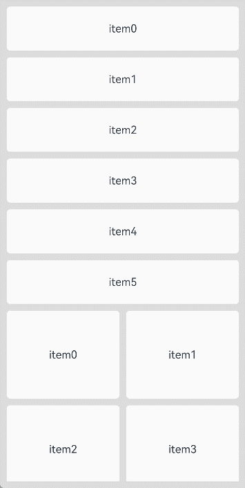
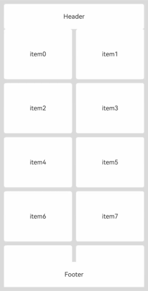

# LazyVGridLayout

<!--Kit: ArkUI-->
<!--Subsystem: ArkUI-->
<!--Owner: @yylong; @rongShao-Z; @guozejun-->
<!--Designer: @yylong-->
<!--Tester: @leiyuqian-->
<!--Adviser: @Brilliantry_Rui-->

该组件用于实现支持懒加载的网格布局。

API版本26.0.0之前，其父组件支持[WaterFlow](ts-container-waterflow.md)和[FlowItem](ts-container-flowitem.md)组件，并支持使用自定义组件或[NodeContainer](ts-basic-components-nodecontainer.md)组件封装后应用在WaterFlow或FlowItem中。

从API版本26.0.0开始，其父组件新增支持[List](ts-container-list.md)、[Scroll](ts-container-scroll.md)和[LazyColumnLayout](ts-container-lazycolumnlayout.md)，同时新增支持使用自定义组件或[NodeContainer](ts-basic-components-nodecontainer.md)组件封装后应用在List、Scroll或LazyColumnLayout中。

> **说明：**
>
> - 本模块同时支持ArkTS-Dyn、ArkTS-Sta。
> - 该组件从API version 19开始支持。后续版本如有新增内容，则采用上角标单独标记该内容的起始版本。
>
> - 本模块接口仅可在Stage模型下使用。
>
> - LazyVGridLayout组件高度默认自适应内容，不建议设置高度、高度约束或宽高比，设置后会导致显示异常。
> - 当父组件设置主轴方向尺寸时，LazyVGridLayout按照父组件可视区域进行懒加载；当父组件未设置主轴方向尺寸时，LazyVGridLayout会被内容撑开，导致所有子组件都会被加载布局。
> - 该组件在不同父组件下的懒加载支持条件如下：
>   1. 在WaterFlow组件下，仅在WaterFlow组件的单列模式或分段布局中的单列分段，并且布局方向[FlexDirection](ts-appendix-enums.md#flexdirection)设置为FlexDirection.Column的情况下支持懒加载。在WaterFlow的多列模式或横向布局（FlexDirection.Row或FlexDirection.RowReverse）下使用该组件，则不支持懒加载。此外，在布局方向为FlexDirection.ColumnReverse的WaterFlow组件下使用该组件会导致显示异常。
>   2. 在List组件下，要求List组件布局方向必须是竖直方向（即[listDirection](ts-container-list.md#listdirection)属性设置为Axis.Vertical）。在非竖直方向的List中使用该组件会导致应用崩溃。当List设置了[lanes](ts-container-list.md#lanes9)、[chainAnimation](ts-container-list.md#chainanimation)、[scrollSnapAlign](ts-container-list.md#scrollsnapalign10)属性中的任意一个时，该组件的懒加载功能会失效。
>   3. 在Scroll组件下，要求Scroll组件布局方向必须是竖直方向（即[scrollable](ts-container-scroll.md#scrollable)属性设置为ScrollDirection.Vertical）。在非竖直方向的Scroll中使用该组件会导致应用崩溃。
> - 当懒加载功能生效时，该组件仅加载父组件可视区域内的子组件，并在帧间空闲时隙预加载可视区域上方和下方各半屏的内容。
> - 此处的父组件指最靠近当前组件的上层滚动组件，其他文档下的具体含义请参考对应内容。

## 接口

LazyVGridLayout()

创建垂直方向懒加载网格布局容器。

**原子化服务API（仅ArkTS-Dyn）：** 从API version 19开始，该接口支持在原子化服务中使用。

**系统能力：** SystemCapability.ArkUI.ArkUI.Full

**ArkTS-Dyn起始版本：** 19

**ArkTS-Sta起始版本：** 23

## 属性

除支持[通用属性](ts-component-general-attributes.md)外，还支持以下属性：

### columnsTemplate

ArkTS-Dyn: columnsTemplate(value: string)

ArkTS-Sta: columnsTemplate(value: string | undefined)

设置当前网格布局列的数量、固定列宽或最小列宽值，不设置时默认1列。

例如，'1fr&nbsp;1fr&nbsp;2fr'&nbsp;是将父组件分3列，将父组件允许的宽分为4等份，第一列占1份，第二列占1份，第三列占2份。

columnsTemplate('repeat(auto-fit, track-size)')是设置最小列宽值为track-size，自动计算列数和实际列宽。

columnsTemplate('repeat(auto-fill, track-size)')是设置固定列宽值为track-size，自动计算列数。

columnsTemplate('repeat(auto-stretch, track-size)')是设置固定列宽值为track-size，使用columnsGap为最小列间距，自动计算列数和实际列间距。

其中repeat、auto-fit、auto-fill、auto-stretch为关键字。<br>
track-size为列宽，支持的单位包括px、vp、%或有效数字，默认单位为vp，track-size至少包含一个有效列宽。<br/>
auto-fit模式和auto-stretch模式只支持track-size为一个有效列宽值，并且auto-stretch模式中的track-size只支持px、vp和有效数字，不支持%。<br>
auto-fill模式支持一个或多个有效列宽，如columnsTemplate('repeat(auto-fill, 20)')、columnsTemplate('repeat(auto-fill, 20 80px)')。

设置为'0fr'时，该列的列宽为0，不显示子组件。设置为其他非法值时，子组件显示为固定1列。

**原子化服务API（仅ArkTS-Dyn）：** 从API version 19开始，该接口支持在原子化服务中使用。

**系统能力：** SystemCapability.ArkUI.ArkUI.Full

**ArkTS-Dyn起始版本：** 19

**ArkTS-Sta起始版本：** 23

**参数：** 

| 参数名 | 类型   | 必填 | 说明                               |
| ------ | ------ | ---- | ---------------------------------- |
| value  | ArkTS-Dyn: string<br/>ArkTS-Sta: string \| undefined | 是   | 当前网格布局列的数量或最小列宽值。<br/>取值为undefined时，按默认1列处理。 |

### attributeModifier<sup>23+</sup>

attributeModifier(modifier: AttributeModifier\<LazyVGridLayoutAttribute> | AttributeModifier\<CommonMethod> | undefined)

动态设置LazyVGridLayout组件的属性方法。

**系统能力：** SystemCapability.ArkUI.ArkUI.Full

**ArkTS模式：** 该接口仅适用于ArkTS-Sta。

**ArkTS-Sta起始版本：** 23

**参数：**

| 参数名   | 类型                                         | 必填 | 说明                                                                                                                             |
| -------- | -------------------------------------------- | ---- | -------------------------------------------------------------------------------------------------------------------------------- |
| modifier | [AttributeModifier](ts-universal-attributes-attribute-modifier.md#attributemodifiert)\<LazyVGridLayoutAttribute> \| AttributeModifier\<CommonMethod> \| undefined | 是   | 在当前组件上，动态设置属性方法，支持使用if/else语法。<br/>CommonMethod：通用属性和事件。 |

### columnsGap

ArkTS-Dyn: columnsGap(value: LengthMetrics)

ArkTS-Sta: columnsGap(value: LengthMetrics | undefined)

设置列与列的间距。设置为小于0的值时，按默认值显示。

**原子化服务API（仅ArkTS-Dyn）：** 从API version 19开始，该接口支持在原子化服务中使用。

**系统能力：** SystemCapability.ArkUI.ArkUI.Full

**ArkTS-Dyn起始版本：** 19

**ArkTS-Sta起始版本：** 23

**参数：** 

| 参数名 | 类型                         | 必填 | 说明                         |
| ------ | ---------------------------- | ---- | ---------------------------- |
| value  |  ArkTS-Dyn: [LengthMetrics](../js-apis-arkui-graphics.md#lengthmetrics12)<br/>ArkTS-Sta: [LengthMetrics](../js-apis-arkui-graphics.md#lengthmetrics12) \| undefined | 是   | 列与列的间距。<br/>默认值：LengthMetrics.vp(0)<br/>取值为undefined时，按默认值处理。 |

### rowsGap

ArkTS-Dyn: rowsGap(value: LengthMetrics)

ArkTS-Sta: rowsGap(value: LengthMetrics | undefined)

设置行与行的间距。设置为小于0的值时，按默认值显示。

**原子化服务API（仅ArkTS-Dyn）：** 从API version 19开始，该接口支持在原子化服务中使用。

**系统能力：** SystemCapability.ArkUI.ArkUI.Full

**ArkTS-Dyn起始版本：** 19

**ArkTS-Sta起始版本：** 23

**参数：** 

| 参数名 | 类型                         | 必填 | 说明                         |
| ------ | ---------------------------- | ---- | ---------------------------- |
| value  | ArkTS-Dyn: [LengthMetrics](../js-apis-arkui-graphics.md#lengthmetrics12)<br/>ArkTS-Sta: [LengthMetrics](../js-apis-arkui-graphics.md#lengthmetrics12) \| undefined | 是   | 行与行的间距。<br/>默认值：LengthMetrics.vp(0)<br/>取值为undefined时，按默认值处理。 |

### header

header(builder: CustomBuilder | undefined)

设置当前LazyVGridLayout的头部组件。

> **说明：**
>
> 头部组件位于容器顶部区域，通常用于展示标题、分组说明或其他固定在内容前方的元素。
>
> 当本组件随滚动容器滚动至可视区域内，且通过[sticky](#sticky)设置了header吸顶模式时，header会吸附在滚动容器可视区域顶部。

**原子化服务API（仅ArkTS-Dyn）：** 从API版本26.0.0开始，该接口支持在原子化服务中使用。

**模型约束：** 此接口仅可在Stage模型下使用。

**系统能力：** SystemCapability.ArkUI.ArkUI.Full

**ArkTS-Dyn起始版本：** 26.0.0

**ArkTS-Sta起始版本：** 26.0.0

**参数：**

| 参数名 | 类型                                                     | 必填 | 说明                                                         |
| ------ | -------------------------------------------------------- | ---- | ------------------------------------------------------------ |
| builder | [CustomBuilder](ts-types.md#custombuilder8) \| undefined | 是   | 头部组件构造函数。<br/>方法入参为undefined时，当前LazyVGridLayout不设置头部组件，如果已有头部组件，也会被移除。 |

### footer

footer(builder: CustomBuilder | undefined)

设置当前LazyVGridLayout的尾部组件。

> **说明：**
>
> 尾部组件位于容器底部区域，通常用于展示补充信息、加载状态或其他固定在内容后方的元素。
>
> 当本组件随滚动容器滚动至可视区域内，且通过[sticky](#sticky)设置了footer吸底模式时，footer会吸附在滚动容器可视区域底部。

**原子化服务API（仅ArkTS-Dyn）：** 从API版本26.0.0开始，该接口支持在原子化服务中使用。

**模型约束：** 此接口仅可在Stage模型下使用。

**系统能力：** SystemCapability.ArkUI.ArkUI.Full

**ArkTS-Dyn起始版本：** 26.0.0

**ArkTS-Sta起始版本：** 26.0.0

**参数：**

| 参数名 | 类型                                                     | 必填 | 说明                                                         |
| ------ | -------------------------------------------------------- | ---- | ------------------------------------------------------------ |
| builder | [CustomBuilder](ts-types.md#custombuilder8) \| undefined | 是   | 尾部组件构造函数。<br/>方法入参为undefined时，当前LazyVGridLayout不设置尾部组件，如果已有尾部组件，也会被移除。 |

### sticky

sticky(sticky: StickyStyle | undefined)

设置[header](#header)和[footer](#footer)的吸附效果。

当本组件随滚动容器滚动至可视区域内，且通过sticky设置header吸顶或footer吸底时，header会吸附在滚动容器可视区域顶部，footer会吸附在滚动容器可视区域底部。

> **说明：**
>
> 由于浮点数计算精度，设置sticky后，在滚动过程中小概率产生缝隙，可以通过[pixelRound](ts-universal-attributes-pixelRoundForComponent.md#pixelround)指定当前组件向下像素取整解决该问题。

**原子化服务API（仅ArkTS-Dyn）：** 从API版本26.0.0开始，该接口支持在原子化服务中使用。

**模型约束：** 此接口仅可在Stage模型下使用。

**系统能力：** SystemCapability.ArkUI.ArkUI.Full

**ArkTS-Dyn起始版本：** 26.0.0

**ArkTS-Sta起始版本：** 26.0.0

**参数：**

| 参数名 | 类型                                                              | 必填 | 说明                                                         |
| ------ | ----------------------------------------------------------------- | ---- | ------------------------------------------------------------ |
| sticky | [StickyStyle](ts-container-list.md#stickystyle9枚举说明) \| undefined | 是   | 头部组件和尾部组件的吸附模式。sticky属性可以设置为StickyStyle.Header或StickyStyle.Footer，也可以设置为StickyStyle.BOTH，以同时支持头部组件吸顶和尾部组件吸底。<br/>方法入参为undefined时，恢复为默认值StickyStyle.None。<br/>未通过该接口设置时，默认头部组件不吸顶、尾部组件不吸底。 |

## 事件

除支持[通用事件](ts-component-general-events.md)外，还支持以下事件：

### onVisibleIndexesChange

onVisibleIndexesChange(callback: OnVisibleIndexesChangeCallback | undefined)

设置onVisibleIndexesChange回调函数。当LazyVGridLayout在可视区域内的子组件的索引值发生变化时触发回调，返回可视区域内子组件的起始索引值和结束索引值。

> **说明：**
>
> 当父组件设置主轴方向尺寸时，LazyVGridLayout按照父组件可视区域进行懒加载。此时onVisibleIndexesChange回调中start返回当前可视区域起始位置子组件的索引值，end返回当前可视区域结束位置子组件的索引值。
>
> 当父组件未设置主轴方向尺寸时，LazyVGridLayout会被内容撑开，导致所有子组件都会被加载布局。此时onVisibleIndexesChange回调中start返回0，end返回数据源最后一个子组件的索引值。
>
> 此处的父组件指最靠近当前组件的上层滚动组件，其他文档下的具体含义请参考对应内容。

**原子化服务API（仅ArkTS-Dyn）：** 从API版本26.0.0开始，该接口支持在原子化服务中使用。

**模型约束：** 此接口仅可在Stage模型下使用。

**系统能力：** SystemCapability.ArkUI.ArkUI.Full

**ArkTS-Dyn起始版本：** 26.0.0

**ArkTS-Sta起始版本：** 26.0.0

**参数：**

| 参数名 | 类型   | 必填 | 说明                       |
| ------ | ------ | ---- | -------------------------- |
| callback  | [OnVisibleIndexesChangeCallback](./ts-container-scrollable-common.md#onvisibleindexeschangecallback)&nbsp;\|&nbsp;undefined | 是  | onVisibleIndexesChange事件的回调函数。方法入参为undefined时，取消监听。 |

## 示例

### 示例1（实现懒加载网格布局）

该示例通过[WaterFlow](ts-container-waterflow.md)和[LazyVGridLayout](ts-container-lazyvgridlayout.md)实现懒加载网格布局，并通过[onVisibleIndexesChange](#onvisibleindexeschange)在可视区域发生变化时回调索引。

MyDataSource实现了[LazyForEach](ts-rendering-control-lazyforeach.md)数据源接口[IDataSource](ts-rendering-control-lazyforeach.md#idatasource)，用于通过LazyForEach给LazyVGridLayout提供子组件。

从API版本26.0.0开始，新增onVisibleIndexesChange事件。

<!--code_no_check-->
```ts
import { LengthMetrics } from '@kit.ArkUI';
import { MyDataSource } from './MyDataSource';

@Entry
@Component
struct LazyVGridLayoutSample1 {
  private arr1:MyDataSource<number> = new MyDataSource<number>();
  private arr2:MyDataSource<number> = new MyDataSource<number>();
  build() {
    Column() {
      WaterFlow() {
        // 第一个LazyVGridLayout：单列布局
        LazyVGridLayout() {
          LazyForEach(this.arr1, (item:number)=>{
            Text('item' + item.toString())
              .height(64)
              .width('100%')
              .borderRadius(5)
              .backgroundColor(Color.White)
              .textAlign(TextAlign.Center)
          })
        }
        .columnsTemplate('1fr') // 单列布局
        .rowsGap(LengthMetrics.vp(10)) // 行间距10vp
        // 从API版本26.0.0开始，新增onVisibleIndexesChange事件。
        .onVisibleIndexesChange((start: number, end: number) => {
          console.info('visible indexes: start= ' + 'start,' + 'end= ' + 'end');
      })

        // 第二个LazyVGridLayout：双列布局
        LazyVGridLayout() {
          LazyForEach(this.arr2, (item:number)=>{
            Text('item' + item.toString())
              .height(128)
              .width('100%')
              .borderRadius(5)
              .backgroundColor(Color.White)
              .textAlign(TextAlign.Center)
          })
        }
        .columnsTemplate('1fr 1fr') // 双列布局，两列等宽
        .rowsGap(LengthMetrics.vp(10)) // 行间距10vp
        .columnsGap(LengthMetrics.vp(10)) // 列间距10vp
      }.padding(10)
      .rowsGap(10)
    }
    .width('100%').height('100%')
    .backgroundColor('#DCDCDC')
  }

  // 初始化数据源
  aboutToAppear(): void {
    for (let i = 0; i < 6; i++) {
      this.arr1.pushData(i);
    }
    for (let i = 0; i < 100; i++) {
      this.arr2.pushData(i);
    }
  }
}
```

<!--code_no_check-->
```ts
// MyDataSource.ets
export class BasicDataSource<T> implements IDataSource {
  private listeners: DataChangeListener[] = [];
  protected dataArray: T[] = [];

  public totalCount(): number {
    return this.dataArray.length;
  }

  public getData(index: number): T {
    return this.dataArray[index];
  }

  registerDataChangeListener(listener: DataChangeListener): void {
    if (this.listeners.indexOf(listener) < 0) {
      console.info('add listener');
      this.listeners.push(listener);
    }
  }

  unregisterDataChangeListener(listener: DataChangeListener): void {
    const pos = this.listeners.indexOf(listener);
    if (pos >= 0) {
      console.info('remove listener');
      this.listeners.splice(pos, 1);
    }
  }

  notifyDataReload(): void {
    this.listeners.forEach(listener => {
      listener.onDataReloaded();
    })
  }

  notifyDataAdd(index: number): void {
    this.listeners.forEach(listener => {
      listener.onDataAdd(index);
    })
  }

  notifyDataChange(index: number): void {
    this.listeners.forEach(listener => {
      listener.onDataChange(index);
    })
  }

  notifyDataDelete(index: number): void {
    this.listeners.forEach(listener => {
      listener.onDataDelete(index);
    })
  }

  notifyDataMove(from: number, to: number): void {
    this.listeners.forEach(listener => {
      listener.onDataMove(from, to);
    })
  }

  notifyDatasetChange(operations: DataOperation[]): void {
    this.listeners.forEach(listener => {
      listener.onDatasetChange(operations);
    })
  }
}

export class MyDataSource<T> extends BasicDataSource<T> {
  public shiftData(): void {
    this.dataArray.shift();
    this.notifyDataDelete(0);
  }
  public unshiftData(data: T): void {
    this.dataArray.unshift(data);
    this.notifyDataAdd(0);
  }
  public pushData(data: T): void {
    this.dataArray.push(data);
    this.notifyDataAdd(this.dataArray.length - 1);
  }
  public popData(): void {
    this.dataArray.pop();
    this.notifyDataDelete(this.dataArray.length);
  }
  public clearData(): void {
    this.dataArray = [];
    this.notifyDataReload();
  }
}
```



### 示例2（设置头部组件或尾部组件及吸附效果）

该示例通过[WaterFlow](ts-container-waterflow.md)嵌套LazyVGridLayout，并通过[header](#header)、[footer](#footer)、[sticky](#sticky)实现网格顶部和底部吸附效果。滚动过程中header吸附在可视区域顶部，footer吸附在可视区域底部。

从API版本26.0.0开始，新增支持header、footer和sticky属性。

<!--code_no_check-->
```ts
import { LengthMetrics } from '@kit.ArkUI';
import { MyDataSource } from './MyDataSource';

@Entry
@Component
struct LazyVGridLayoutStickyDemo {
  private arr:MyDataSource<number> = new MyDataSource<number>();

  @Builder
  HeaderBuilder() {
    Column() {
      Text('Header')
        .fontSize(16)
    }
    .width('100%')
    .height(64)
    .borderRadius(5)
    .backgroundColor(Color.White)
    .justifyContent(FlexAlign.Center)
  }

  @Builder
  FooterBuilder() {
    Column() {
      Text('Footer')
        .fontSize(16)
    }
    .width('100%')
    .height(64)
    .borderRadius(5)
    .backgroundColor(Color.White)
    .justifyContent(FlexAlign.Center)
  }

  build() {
    Column() {
      WaterFlow() {
        LazyVGridLayout() {
          LazyForEach(this.arr, (item:number)=>{
            Text('item' + item.toString())
              .height(128)
              .width('100%')
              .borderRadius(5)
              .backgroundColor(Color.White)
              .textAlign(TextAlign.Center)
          })
        }
        .columnsTemplate('1fr 1fr')
        .rowsGap(LengthMetrics.vp(10))
        .columnsGap(LengthMetrics.vp(10))
        .header(this.HeaderBuilder)
        .footer(this.FooterBuilder)
        .sticky(StickyStyle.BOTH)
      }.padding(10)
      .rowsGap(10)
    }
    .width('100%').height('100%')
    .backgroundColor('#DCDCDC')
  }

  aboutToAppear(): void {
    for (let i = 0; i < 100; i++) {
      this.arr.pushData(i);
    }
  }
}
```

