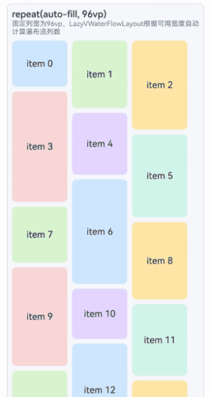

# LazyVWaterFlowLayout

<!--Kit: ArkUI-->
<!--Subsystem: ArkUI-->
<!--Owner: @yylong; @rongShao-Z; @guozejun-->
<!--Designer: @guozejun-->
<!--Tester: @leiyuqian-->
<!--Adviser: @Brilliantry_Rui-->

LazyVWaterFlowLayout用于实现支持懒加载的瀑布流布局，适用于展示大量高度不一的列表项场景，如图片墙、商品列表等。通过懒加载机制，该组件仅加载可视区域及附近内容，减少内存占用和渲染开销，提升滚动流畅度。该组件应位于竖直方向的[List](ts-container-list.md)、[Scroll](ts-container-scroll.md)或[WaterFlow](ts-container-waterflow.md)组件下，并支持通过[FlowItem](ts-container-flowitem.md)、[LazyColumnLayout](ts-container-lazycolumnlayout.md)、自定义组件或[NodeContainer](ts-basic-components-nodecontainer.md)组件封装后使用。

更多关于懒加载布局的使用场景和完整示例，可参考[创建懒加载布局](../../../ui/arkts-layout-development-create-lazy-layout.md)。

> **说明：**
>
> - LazyVWaterFlowLayout组件高度默认自适应内容，不建议设置会固定或约束组件垂直方向尺寸的属性，设置后会导致显示异常或无法正常滚动。涉及的属性包括[height](ts-universal-attributes-size.md#height)、[size](ts-universal-attributes-size.md#size)中的height、[constraintSize](ts-universal-attributes-size.md#constraintsize)中的minHeight/maxHeight、[aspectRatio](ts-universal-attributes-layout-constraints.md#aspectratio)、[layoutWeight](ts-universal-attributes-size.md#layoutweight)，以及[height](ts-universal-attributes-size.md#height15)取[LayoutPolicy](ts-universal-attributes-size.md#layoutpolicy15)值的场景。
> - 当父组件设置主轴方向尺寸时，LazyVWaterFlowLayout按照父组件可视区域进行懒加载；当父组件未设置主轴方向尺寸时，LazyVWaterFlowLayout会被内容撑开，导致所有子组件都会被加载布局。
> - 该组件在不同父组件下的懒加载支持条件如下：
>   1. 在List组件下，要求List组件布局方向必须是竖直方向（即[listDirection](ts-container-list.md#listdirection)属性设置为Axis.Vertical），在非竖直方向的List中使用该组件会导致应用崩溃。当List设置了[lanes](ts-container-list.md#lanes9)、[chainAnimation](ts-container-list.md#chainanimation)、[scrollSnapAlign](ts-container-list.md#scrollsnapalign10)属性中的任意一个或多个时，该组件的懒加载功能会失效。
>   2. 在Scroll组件下，要求Scroll组件布局方向必须是竖直方向（即[scrollable](ts-container-scroll.md#scrollable)属性设置为ScrollDirection.Vertical），在非竖直方向的Scroll中使用该组件会导致应用崩溃。
>   3. 在WaterFlow组件下，仅在WaterFlow组件的单列模式或分段布局中的单列分段，并且[layoutDirection](ts-container-waterflow.md#layoutdirection)属性设置为FlexDirection.Column时支持懒加载。当WaterFlow为多列模式或布局方向为FlexDirection.Row、FlexDirection.RowReverse时，该组件的懒加载功能会失效。此外，在布局方向为FlexDirection.ColumnReverse的WaterFlow组件下使用该组件会导致显示异常。
>   4. 通过FlowItem、LazyColumnLayout、自定义组件或NodeContainer封装使用时，懒加载行为取决于其上层滚动组件（如WaterFlow、Scroll或List）的配置条件。
> - 当懒加载功能生效时，该组件仅加载父组件可视区域内的子组件，并在帧间空闲时隙预加载可视区域上方和下方各半屏的内容。
> - 此处的父组件指最靠近当前组件的上层滚动组件，其他文档下的具体含义请参考对应内容。

**起始版本：** 26.0.0

## 导入模块

```ts
import { LazyVWaterFlowLayout } from '@kit.ArkUI';
```

## 接口

LazyVWaterFlowLayout()

创建垂直方向的LazyVWaterFlowLayout组件。该组件应位于竖直方向的[List](ts-container-list.md)、[Scroll](ts-container-scroll.md)或[WaterFlow](ts-container-waterflow.md)组件下，并支持通过[FlowItem](ts-container-flowitem.md)、[LazyColumnLayout](ts-container-lazycolumnlayout.md)、自定义组件或[NodeContainer](ts-basic-components-nodecontainer.md)组件封装后使用。不建议设置高度、高度约束或宽高比，设置后会导致显示异常。

**起始版本：** 26.0.0

**原子化服务API：** 从API版本26.0.0开始，该接口支持在原子化服务中使用。

**模型约束：** 此接口仅可在Stage模型下使用。

**系统能力：** SystemCapability.ArkUI.ArkUI.Full

## 属性

除支持[通用属性](ts-component-general-attributes.md)外，还支持以下属性：

### columnsTemplate

columnsTemplate(value: string | ItemFillPolicy | undefined)

设置当前LazyVWaterFlowLayout的列数、固定列宽或最小列宽值，不设置时默认1列。

当value设置为string类型时，可设置当前LazyVWaterFlowLayout的列数、固定列宽或最小列宽值。例如，columnsTemplate('1fr 1fr 2fr')可将LazyVWaterFlowLayout分为3列，组件宽度分为4等份，第1列占1份，第2列占1份，第3列占2份。

columnsTemplate('repeat(auto-fit, track-size)')是设置最小列宽值为track-size，自动计算列数和实际列宽。

columnsTemplate('repeat(auto-fill, track-size)')是设置固定列宽值为track-size，自动计算列数。

columnsTemplate('repeat(auto-stretch, track-size)')是设置固定列宽值为track-size，使用[columnsGap](#columnsgap)作为最小列间距，自动计算列数和实际列间距。

其中repeat、auto-fit、auto-fill、auto-stretch为关键字。track-size为列宽，支持的单位包括px、vp、%或有效数字，默认单位为vp，track-size至少包括一个有效列宽。<br/>
auto-fit模式和auto-stretch模式只支持track-size为一个有效列宽值，并且auto-stretch模式中的track-size只支持px、vp和有效数字，不支持%。auto-fill模式支持一个或多个有效列宽，如columnsTemplate('repeat(auto-fill, 20)')、columnsTemplate('repeat(auto-fill, 20 80px)')。

使用效果可以参考[示例3](#示例3设置自适应列数)。

当value设置为ItemFillPolicy类型时，将根据LazyVWaterFlowLayout组件宽度对应的[断点类型](../../../ui/arkts-layout-development-grid-layout.md#栅格容器断点)确定列数。

例如，ItemFillPolicy的fillType属性设置为PresetFillType.BREAKPOINT_DEFAULT时，在组件宽度属于sm及更小的断点区间时显示2列，属于md断点区间时显示3列，属于lg及更大的断点区间时显示5列，且每列均为1fr（表示每列占用1等份可用宽度）。

**起始版本：** 26.0.0

**原子化服务API：** 从API版本26.0.0开始，该接口支持在原子化服务中使用。

**模型约束：** 此接口仅可在Stage模型下使用。

**系统能力：** SystemCapability.ArkUI.ArkUI.Full

**参数：** 

| 参数名 | 类型   | 必填 | 说明                               |
| ------ | ------ | ---- | ---------------------------------- |
| value  | string \| [ItemFillPolicy](ts-types.md#itemfillpolicy22) \| undefined | 是   | LazyVWaterFlowLayout的列数、固定列宽、最小列宽值或断点填充策略。使用string类型时，可通过`1fr 1fr 2fr`设置列数和比例，或通过`repeat(auto-fill, track-size)`按列宽自动计算列数；track-size支持px、vp、%或有效数字，默认单位为vp；使用ItemFillPolicy类型时，按组件宽度对应断点类型确定列数。<br/>入参为undefined时，恢复为默认值（1列）。 |

**返回值：**

| 类型 | 说明           |
| --- | -------------- |
| T | 返回当前组件。 |

### columnsGap

columnsGap(value: LengthMetrics | undefined): T

设置列与列的间距。默认值为LengthMetrics.vp(0)，设置为小于0的值时，按LengthMetrics.vp(0)处理。

**起始版本：** 26.0.0

**原子化服务API：** 从API版本26.0.0开始，该接口支持在原子化服务中使用。

**模型约束：** 此接口仅可在Stage模型下使用。

**系统能力：** SystemCapability.ArkUI.ArkUI.Full

**参数：** 

| 参数名 | 类型                         | 必填 | 说明                         |
| ------ | ---------------------------- | ---- | ---------------------------- |
| value  |  [LengthMetrics](../js-apis-arkui-graphics.md#lengthmetrics12) \| undefined | 是   | 列与列的间距。<br/>默认值：LengthMetrics.vp(0)<br/>取值范围：[0, +∞)<br/>设置为小于0的值时，按LengthMetrics.vp(0)处理。<br/>方法入参为undefined时，恢复为默认值（LengthMetrics.vp(0)）。 |

**返回值：**

| 类型 | 说明           |
| --- | -------------- |
| T | 返回当前组件。 |

### rowsGap

rowsGap(value: LengthMetrics | undefined): T

设置行与行的间距。默认值为LengthMetrics.vp(0)，设置为小于0的值时，按LengthMetrics.vp(0)处理。

**起始版本：** 26.0.0

**原子化服务API：** 从API版本26.0.0开始，该接口支持在原子化服务中使用。

**模型约束：** 此接口仅可在Stage模型下使用。

**系统能力：** SystemCapability.ArkUI.ArkUI.Full

**参数：** 

| 参数名 | 类型                         | 必填 | 说明                         |
| ------ | ---------------------------- | ---- | ---------------------------- |
| value  | [LengthMetrics](../js-apis-arkui-graphics.md#lengthmetrics12) \| undefined | 是   | 行与行的间距。<br/>默认值：LengthMetrics.vp(0)<br/>取值范围：[0, +∞)<br/>设置为小于0的值时，按LengthMetrics.vp(0)处理。<br/>方法入参为undefined时，恢复为默认值（LengthMetrics.vp(0)）。 |

**返回值：**

| 类型 | 说明           |
| --- | -------------- |
| T | 返回当前组件。 |

### header

header(builder: CustomBuilder | undefined): T

设置当前LazyVWaterFlowLayout的头部组件。头部组件的吸顶效果需通过[sticky](#sticky)属性设置后才能生效。

> **说明：**
>
> 头部组件位于容器顶部区域，通常用于展示标题、分组说明或其他固定在内容前方的元素。
>
> 当本组件随滚动容器滚动至可视区域内，且通过[sticky](#sticky)设置了header吸顶模式时，header会吸附在滚动容器可视区域顶部。

**起始版本：** 26.0.0

**原子化服务API：** 从API版本26.0.0开始，该接口支持在原子化服务中使用。

**模型约束：** 此接口仅可在Stage模型下使用。

**系统能力：** SystemCapability.ArkUI.ArkUI.Full

**参数：**

| 参数名 | 类型                                                     | 必填 | 说明                                                         |
| ------ | -------------------------------------------------------- | ---- | ------------------------------------------------------------ |
| builder | [CustomBuilder](ts-types.md#custombuilder8) \| undefined | 是   | 头部组件构造函数。<br/>入参为undefined时，不设置头部组件，如果已有头部组件，也会被移除。 |

### footer

footer(builder: CustomBuilder | undefined): T

设置当前LazyVWaterFlowLayout的尾部组件。尾部组件的吸底效果需通过[sticky](#sticky)属性设置后才能生效。

> **说明：**
>
> 尾部组件位于容器底部区域，通常用于展示补充信息、加载状态或其他固定在内容后方的元素。
>
> 当本组件随滚动容器滚动至可视区域内，且通过[sticky](#sticky)设置了footer吸底模式时，footer会吸附在滚动容器可视区域底部。

**起始版本：** 26.0.0

**原子化服务API：** 从API版本26.0.0开始，该接口支持在原子化服务中使用。

**模型约束：** 此接口仅可在Stage模型下使用。

**系统能力：** SystemCapability.ArkUI.ArkUI.Full

**参数：**

| 参数名 | 类型                                                     | 必填 | 说明                                                         |
| ------ | -------------------------------------------------------- | ---- | ------------------------------------------------------------ |
| builder | [CustomBuilder](ts-types.md#custombuilder8) \| undefined | 是   | 尾部组件构造函数。<br/>入参为undefined时，不设置尾部组件，如果已有尾部组件，也会被移除。 |

### sticky

sticky(sticky: StickyStyle | undefined): T

设置[header](#header)和[footer](#footer)的吸附效果。

当本组件随滚动容器滚动至可视区域内，且通过可选的sticky属性设置header吸顶或footer吸底时，header会吸附在滚动容器可视区域顶部，footer会吸附在滚动容器可视区域底部；未设置sticky时，默认头部组件不吸顶、尾部组件不吸底。

> **说明：**
>
> 由于浮点数计算精度，设置sticky后，在滚动过程中可能产生缝隙，可以通过[pixelRound](ts-universal-attributes-pixelRoundForComponent.md#pixelround)指定当前组件向下像素取整解决该问题。

**起始版本：** 26.0.0

**原子化服务API：** 从API版本26.0.0开始，该接口支持在原子化服务中使用。

**模型约束：** 此接口仅可在Stage模型下使用。

**系统能力：** SystemCapability.ArkUI.ArkUI.Full

**参数：**

| 参数名 | 类型                                                              | 必填 | 说明                                                         |
| ------ | ----------------------------------------------------------------- | ---- | ------------------------------------------------------------ |
| sticky | [StickyStyle](ts-container-list.md#stickystyle9枚举说明) \| undefined | 是   | 头部组件和尾部组件的吸附模式。sticky属性可设置为StickyStyle.Header（头部组件吸顶）、StickyStyle.Footer（尾部组件吸底）、StickyStyle.BOTH（同时支持头部组件吸顶和尾部组件吸底）或StickyStyle.None（不启用吸附效果）。<br/>入参为undefined时，恢复为默认值StickyStyle.None。<br/>未通过该接口设置时，默认头部组件不吸顶、尾部组件不吸底。 |

## 事件

除支持[通用事件](ts-component-general-events.md)外，还支持以下事件：

### onVisibleIndexesChange

onVisibleIndexesChange(callback: OnVisibleIndexesChangeCallback | undefined): T

设置onVisibleIndexesChange回调函数。当LazyVWaterFlowLayout可视区域内子组件索引发生变化时触发回调，返回可视区域内子组件的起始索引和结束索引。

> **说明：**
>
> 当父组件设置主轴方向尺寸时，LazyVWaterFlowLayout按照父组件可视区域进行懒加载。此时onVisibleIndexesChange回调中start返回当前可视区域起始位置子组件的索引值，end返回当前可视区域结束位置子组件的索引值。
>
> 当父组件未设置主轴方向尺寸时，LazyVWaterFlowLayout会被内容撑开，导致所有子组件都会被加载布局。此时onVisibleIndexesChange回调中start返回0，end返回数据源最后一个子组件的索引值。
>
> 当该组件懒加载功能因上述父组件配置条件失效时，所有子组件都会被加载布局。此时onVisibleIndexesChange回调中start返回0，end返回数据源最后一个子组件的索引值。
>
> 此处的父组件指最靠近当前组件的上层滚动组件，其他文档下的具体含义请参考对应内容。

**起始版本：** 26.0.0

**原子化服务API：** 从API版本26.0.0开始，该接口支持在原子化服务中使用。

**模型约束：** 此接口仅可在Stage模型下使用。

**系统能力：** SystemCapability.ArkUI.ArkUI.Full

**参数：** 

| 参数名 | 类型   | 必填 | 说明                                  |
| ------ | ------ | ---- | ------------------------------------- |
| callback  | [OnVisibleIndexesChangeCallback](ts-container-scrollable-common.md#onvisibleindexeschangecallback) \| undefined | 是   | 回调函数，当可见区域内的子组件索引发生变化时触发。<br/>入参为undefined时，取消监听。 |

**返回值：**

| 类型 | 说明           |
| --- | -------------- |
| T | 返回当前组件。 |

## 示例

### 示例1（实现懒加载瀑布流布局）

通过[Scroll](ts-container-scroll.md)和LazyVWaterFlowLayout组件实现懒加载瀑布流布局。

MyDataSource实现了LazyForEach数据源接口[IDataSource](ts-rendering-control-lazyforeach.md#idatasource)，用于通过LazyForEach给LazyVWaterFlowLayout提供子组件。 

从API版本26.0.0开始，新增支持LazyVWaterFlowLayout组件。

<!--code_no_check-->
```ts
import { LengthMetrics, LazyVWaterFlowLayout, LazyVWaterFlowLayoutAttribute } from '@kit.ArkUI';
// MyDataSource是自定义数据源类，实现了LazyForEach所需的IDataSource接口
import { MyDataSource } from './MyDataSource';

@Entry
@Component
struct LazyVWaterFlowLayoutSample1 {
  private arr : MyDataSource<number> = new MyDataSource<number>();

  // 返回随机高度
  private itemHeight(index: number): number {
    return 80 + (index * 37 % 121);
  }

  private itemColor(index: number): string {
    const colors: string[] = ['#FFE0B2', '#C8E6C9', '#BBDEFB', '#F8BBD0', '#D1C4E9', '#FFF9C4'];
    return colors[index % colors.length];
  }

  build() {
    Column() {
      Scroll() {
        LazyVWaterFlowLayout() {
          LazyForEach(this.arr, (item: number) => {
            Column() {
              Text('item ' + item.toString())
                .fontSize(16)
                .fontColor(Color.Black)
            }
            .height(this.itemHeight(item))
            .width('100%')
            .borderRadius(8)
            .backgroundColor(this.itemColor(item))
            .justifyContent(FlexAlign.Center)
          })
        }
        .columnsTemplate('1fr 1fr')
        .rowsGap(LengthMetrics.vp(10))
        .columnsGap(LengthMetrics.vp(10))
        .onVisibleIndexesChange((start: number, end: number) => {
          console.info('LazyVWaterFlowLayout visible indexes: start: ' + start + ', end: ' + end);
          // 滚动监听：即将触底时提前加载更多数据
          if (end + 20 >= this.arr.totalCount()) {
            // 添加100个新数据到数据源
            let currentCount = this.arr.totalCount();
            for (let i = currentCount; i < currentCount + 100; i++) {
              this.arr.pushData(i);
            }
          }
        })
      }
      .padding(10)
      .layoutWeight(1)
    }
    .width('100%')
    .height('100%')
    .backgroundColor('#DCDCDC')
  }

  aboutToAppear(): void {
    for (let i = 0; i < 100; i++) {
      this.arr.pushData(i);
    }
  }
}
```

<!--code_no_check-->
```ts
// MyDataSource.ets
export class BasicDataSource<T> implements IDataSource {
  private listeners: DataChangeListener[] = [];
  protected dataArray: T[] = [];

  public totalCount(): number {
    return this.dataArray.length;
  }

  public getData(index: number): T {
    return this.dataArray[index];
  }

  registerDataChangeListener(listener: DataChangeListener): void {
    if (this.listeners.indexOf(listener) < 0) {
      console.info('add listener');
      this.listeners.push(listener);
    }
  }

  unregisterDataChangeListener(listener: DataChangeListener): void {
    const pos = this.listeners.indexOf(listener);
    if (pos >= 0) {
      console.info('remove listener');
      this.listeners.splice(pos, 1);
    }
  }

  notifyDataReload(): void {
    this.listeners.forEach(listener => {
      listener.onDataReloaded();
    });
  }

  notifyDataAdd(index: number): void {
    this.listeners.forEach(listener => {
      listener.onDataAdd(index);
    });
  }

  notifyDataChange(index: number): void {
    this.listeners.forEach(listener => {
      listener.onDataChange(index);
    });
  }

  notifyDataDelete(index: number): void {
    this.listeners.forEach(listener => {
      listener.onDataDelete(index);
    });
  }

  notifyDataMove(from: number, to: number): void {
    this.listeners.forEach(listener => {
      listener.onDataMove(from, to);
    });
  }

  notifyDatasetChange(operations: DataOperation[]): void {
    this.listeners.forEach(listener => {
      listener.onDatasetChange(operations);
    });
  }
}

export class MyDataSource<T> extends BasicDataSource<T> {
  public shiftData(): void {
    this.dataArray.shift();
    this.notifyDataDelete(0);
  }
  public unshiftData(data: T): void {
    this.dataArray.unshift(data);
    this.notifyDataAdd(0);
  }
  public pushData(data: T): void {
    this.dataArray.push(data);
    this.notifyDataAdd(this.dataArray.length - 1);
  }

  public popData(): void {
    const deleteIndex = this.dataArray.length - 1;
    this.dataArray.pop();
    this.notifyDataDelete(deleteIndex);
  }

  public clearData(): void {
    this.dataArray = [];
    this.notifyDataReload();
  }
}
```


### 示例2（设置头部组件或尾部组件及吸附效果）

该示例通过[Scroll](ts-container-scroll.md)嵌套LazyVWaterFlowLayout，并通过[header](#header)、[footer](#footer)、[sticky](#sticky)实现瀑布流顶部和底部吸附效果。滚动过程中header吸附在可视区域顶部，footer吸附在可视区域底部。

从API版本26.0.0开始，新增支持header、footer和sticky属性。

<!--code_no_check-->
```ts
import { LengthMetrics, LazyVWaterFlowLayout, LazyVWaterFlowLayoutAttribute, StickyStyle } from '@kit.ArkUI';
// MyDataSource是自定义数据源类，实现了LazyForEach所需的IDataSource接口
import { MyDataSource } from './MyDataSource';

@Entry
@Component
struct LazyVWaterFlowLayoutStickyDemo {
  private arr : MyDataSource<number> = new MyDataSource<number>();

  // 返回随机高度
  private itemHeight(index: number): number {
    return 80 + (index * 37 % 121);
  }

  private itemColor(index: number): string {
    const colors: string[] = ['#FFE0B2', '#C8E6C9', '#BBDEFB', '#F8BBD0', '#D1C4E9', '#FFF9C4'];
    return colors[index % colors.length];
  }

  // 构建头部组件
  @Builder
  HeaderBuilder() {
    Column() {
      Text('Header')
        .fontSize(16)
        .fontColor(Color.Black)
    }
    .height(50)
    .width('100%')
    .borderRadius(8)
    .backgroundColor('#BBDEFB')
    .justifyContent(FlexAlign.Center)
  }

  @Builder
  FooterBuilder() {
    Column() {
      Text('Footer')
        .fontSize(16)
        .fontColor(Color.Black)
    }
    .height(40)
    .width('100%')
    .borderRadius(8)
    .backgroundColor('#D1C4E9')
    .justifyContent(FlexAlign.Center)
  }

  build() {
    Column() {
      Scroll() {
        LazyVWaterFlowLayout() {
          LazyForEach(this.arr, (item: number) => {
            Column() {
              Text('item ' + item.toString())
                .fontSize(16)
                .fontColor(Color.Black)
            }
            .height(this.itemHeight(item))
            .width('100%')
            .borderRadius(8)
            .backgroundColor(this.itemColor(item))
            .justifyContent(FlexAlign.Center)
          })
        }
        .columnsTemplate('1fr 1fr')
        .rowsGap(LengthMetrics.vp(10))
        .columnsGap(LengthMetrics.vp(10))
        .header(this.HeaderBuilder)
        .footer(this.FooterBuilder)
        // 设置头部和尾部同时吸附
        .sticky(StickyStyle.BOTH)
        .onVisibleIndexesChange((start: number, end: number) => {
          console.info('LazyVWaterFlowLayout visible indexes: start: ' + start + ', end: ' + end);
          // 滚动监听：即将触底时提前加载更多数据
          if (end + 20 >= this.arr.totalCount()) {
            // 添加100个新数据到数据源
            let currentCount = this.arr.totalCount();
            for (let i = currentCount; i < currentCount + 100; i++) {
              this.arr.pushData(i);
            }
          }
        })
      }
      .padding(10)
      .layoutWeight(1)
    }
    .width('100%')
    .height('100%')
    .backgroundColor('#DCDCDC')
  }

  aboutToAppear(): void {
    for (let i = 0; i < 100; i++) {
      this.arr.pushData(i);
    }
  }
}
```


### 示例3（设置自适应列数）

该示例通过[columnsTemplate](#columnstemplate)设置repeat(auto-fill, track-size)和ItemFillPolicy，实现LazyVWaterFlowLayout列数自适应。

从API版本26.0.0开始，新增[columnsTemplate](#columnstemplate)接口。

<!--code_no_check-->
```ts
import {
  LengthMetrics,
  LazyColumnLayout,
  LazyColumnLayoutAttribute,
  LazyVWaterFlowLayout,
  LazyVWaterFlowLayoutAttribute,
} from '@kit.ArkUI';
// MyDataSource是自定义数据源类，实现了LazyForEach所需的IDataSource接口
import { MyDataSource } from './MyDataSource';

@Entry
@Component
struct LazyVWaterFlowLayoutColumnsTemplateDemo {
  private autoFillData: MyDataSource<number> = new MyDataSource<number>();
  private breakpointData: MyDataSource<number> = new MyDataSource<number>();
  private breakpointPolicy: ItemFillPolicy = { fillType: PresetFillType.BREAKPOINT_DEFAULT };

  aboutToAppear(): void {
    // 初始化固定数量的数据，不进行滚动触底加载
    for (let i = 0; i < 18; i++) {
      this.autoFillData.pushData(i);
      this.breakpointData.pushData(i);
    }
  }

  private itemHeight(index: number): number {
    return 80 + (index * 37 % 121)
  }

  private itemColor(index: number): string {
    const colors: string[] = ['#CDE7FF', '#D8F5D0', '#FFE6A8', '#F8D7DA', '#E4D7FF', '#D2F4EA']
    return colors[index % colors.length]
  }

  @Builder
  ModeTitle(title: string, description: string) {
    Column() {
      Text(title)
        .fontSize(16)
        .fontWeight(FontWeight.Medium)
        .fontColor('#182230')
      Text(description)
        .fontSize(12)
        .fontColor('#667085')
    }
    .alignItems(HorizontalAlign.Start)
    .width('100%')
    .padding({ bottom: 8 })
  }

  @Builder
  AutoFillHeader() {
    this.ModeTitle('repeat(auto-fill, 96vp)',
      '固定列宽为96vp，LazyVWaterFlowLayout根据可用宽度自动计算瀑布流列数。')
  }

  @Builder
  BreakpointHeader() {
    this.ModeTitle('ItemFillPolicy: BREAKPOINT_DEFAULT',
      '根据组件宽度对应的断点类型确定列数，sm及以下为2列，md为3列，lg及以上为5列。')
  }

  @Builder
  WaterFlowItemBuilder(item: number) {
    Text('item ' + item)
      .height(this.itemHeight(item))
      .width('100%')
      .borderRadius(8)
      .backgroundColor(this.itemColor(item))
      .fontColor('#182230')
      .textAlign(TextAlign.Center)
  }

  build() {
    Column() {
      Scroll() {
        LazyColumnLayout() {
          // repeat(auto-fill, 96vp)：固定列宽为96vp，根据可用宽度自动计算瀑布流列数
          LazyVWaterFlowLayout() {
            LazyForEach(this.autoFillData, (item: number) => {
              this.WaterFlowItemBuilder(item)
            })
          }
          .columnsTemplate('repeat(auto-fill, 96)')
          .rowsGap(LengthMetrics.vp(8))
          .columnsGap(LengthMetrics.vp(8))
          .header(this.AutoFillHeader)
          .padding(8)
          .backgroundColor('#F7F9FC')
          .border({ width: 1, color: '#D0D5DD' })
          .borderRadius(8)

          // ItemFillPolicy：根据组件宽度对应的断点类型确定列数
          LazyVWaterFlowLayout() {
            LazyForEach(this.breakpointData, (item: number) => {
              this.WaterFlowItemBuilder(item)
            })
          }
          .columnsTemplate(this.breakpointPolicy)
          .rowsGap(LengthMetrics.vp(8))
          .columnsGap(LengthMetrics.vp(8))
          .header(this.BreakpointHeader)
          .padding(8)
          .backgroundColor('#F7F9FC')
          .border({ width: 1, color: '#D0D5DD' })
          .borderRadius(8)
        }
        .space(LengthMetrics.vp(16))
        .width('100%')
      }
      .width('100%')
      .scrollable(ScrollDirection.Vertical)
      .layoutWeight(1)
    }
    .width('100%')
    .height('100%')
    .padding({ top: 48, left: 12, right: 12, bottom: 12 })
  }
}
```
