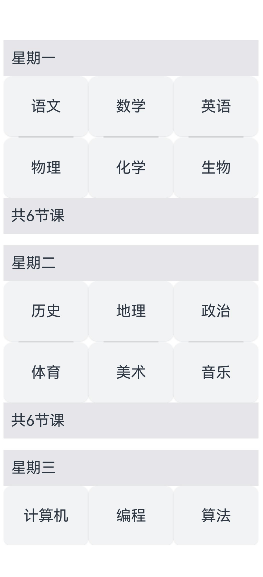

# ListItemGroup

<!--Kit: ArkUI-->
<!--Subsystem: ArkUI-->
<!--Owner: @yylong-->
<!--Designer: @yylong-->
<!--Tester: @liuzhenshuo-->
<!--Adviser: @Brilliantry_Rui-->

该组件用来展示列表item分组，宽度默认充满[List](ts-container-list.md)组件，必须配合List组件来使用。

ListItemGroup的懒加载是指组件按需加载可见区域可见的子组件。相比全量加载，使用懒加载可以提升应用启动速度，减少内存消耗。ListItemGroup和[ForEach](../../../ui/rendering-control/arkts-rendering-control-foreach.md)、[LazyForEach](../../../ui/rendering-control/arkts-rendering-control-lazyforeach.md)、[Repeat](../../../ui/rendering-control/arkts-new-rendering-control-repeat.md)结合，懒加载能力存在差异：

 - 当ListItemGroup和ForEach结合，会一次性创建所有的子节点，在需要的时候布局和渲染屏幕范围内的节点。当用户滑动时，划出屏幕范围的节点不会下树销毁，划入屏幕范围的节点会布局和渲染。

 - 当ListItemGroup和LazyForEach结合，会一次性创建、布局、渲染屏幕范围的节点。当用户滑动时，划出屏幕范围的节点会下树销毁，划入屏幕范围的节点会创建、布局、渲染。

 - 当ListItemGroup和带[virtualScroll](./ts-rendering-control-repeat.md#virtualscroll)的Repeat结合，它的懒加载行为和LazyForEach一致。当ListItemGroup和不带virtualScroll的Repeat结合，它的懒加载行为和ForEach一致。

ListItemGroup的预加载是指除了加载显示区域可见区域外子组件外，还支持空闲时隙提前加载部分显示区域外不可见的子组件。使用预加载可以减少滚动丢帧，提升流畅性。预加载需要结合懒加载才会生效。ListItemGroup和[ForEach](../../../ui/rendering-control/arkts-rendering-control-foreach.md)、[LazyForEach](../../../ui/rendering-control/arkts-rendering-control-lazyforeach.md)、[Repeat](../../../ui/rendering-control/arkts-new-rendering-control-repeat.md)结合，预加载能力存在差异：

 - 当ListItemGroup和ForEach结合，如果设置了[cachedCount](./ts-container-list.md#cachedcount)，除了会布局显示区域内子组件外，还会在空闲时隙根据List组件的cachedCount属性预布局显示区域外cachedCount范围内的子节点。

 - 当ListItemGroup和LazyForEach结合，如果设置了[cachedCount](./ts-container-list.md#cachedcount)，除了会创建和布局显示区域内子组件外，还会在空闲时隙根据List组件的cachedCount属性预创建和预布局显示区域外cachedCount范围内的子节点。

 - 当ListItemGroup和带[virtualScroll](./ts-rendering-control-repeat.md#virtualscroll)的Repeat结合，它的预加载行为和LazyForEach一致。当ListItemGroup和不带virtualScroll的Repeat结合，它的预加载行为和ForEach一致。

> **说明：**
>
> - 该组件从API version 9开始支持。后续版本如有新增内容，则采用上角标单独标记该内容的起始版本。
> - 该组件的父组件只能是[List](ts-container-list.md)。
> - ListItemGroup组件不支持设置[通用属性aspectRatio](ts-universal-attributes-layout-constraints.md#aspectratio)。
> - 当ListItemGroup的父组件List的[listDirection](./ts-container-list.md#listdirection)属性为Axis.Vertical时，设置[通用属性height](ts-universal-attributes-size.md#height)属性不生效。ListItemGroup的高度为header高度、footer高度和所有ListItem布局后总高度之和。
> - 当父组件List的listDirection属性为Axis.Horizontal时，设置[通用属性width](ts-universal-attributes-size.md#width)属性不生效。ListItemGroup的宽度为header宽度、footer宽度和所有ListItem布局后总宽度之和。
> - 当前ListItemGroup内部的ListItem组件不支持编辑、拖拽功能，即ListItem组件的[editable](./ts-container-listitem.md#editabledeprecated)属性不生效。
> - ListItemGroup使用direction属性设置布局方向不生效，ListItemGroup组件布局方向跟随父容器List组件的布局方向。

## 子组件

包含[ListItem](ts-container-listitem.md)子组件。支持通过渲染控制类型（[if/else](../../../ui/rendering-control/arkts-rendering-control-ifelse.md)、[ForEach](../../../ui/rendering-control/arkts-rendering-control-foreach.md)、[LazyForEach](../../../ui/rendering-control/arkts-rendering-control-lazyforeach.md)和[Repeat](../../../ui/rendering-control/arkts-new-rendering-control-repeat.md)）动态生成子组件，更推荐使用LazyForEach或Repeat以优化性能。

## 接口

ListItemGroup(options?: ListItemGroupOptions)

创建ListItemGroup组件。

**原子化服务API：** 从API version 11开始，该接口支持在原子化服务中使用。

**系统能力：** SystemCapability.ArkUI.ArkUI.Full

**参数：**

| 参数名 | 类型 | 必填 | 说明 |
| -------- | -------- | -------- | -------- |
| options |  [ListItemGroupOptions](#listitemgroupoptions对象说明)| 否 | 列表item分组组件参数。 |

## ListItemGroupOptions对象说明

ListItemGroup组件参数。

**原子化服务API：** 从API version 11开始，该接口支持在原子化服务中使用。

**系统能力：** SystemCapability.ArkUI.ArkUI.Full

| 名称              | 类型                                            | 只读 | 可选   | 说明                                                     |
| ------------------- | --------------------------------------------------- | ---- | -- | ------------------------------------------------------------ |
| header              | [CustomBuilder](ts-types.md#custombuilder8) &nbsp;   | 否   | 是 | 设置ListItemGroup头部组件。<br/>**说明：**<br/>可以放单个子组件或不放子组件。<br/>**原子化服务API：** 从API version 11开始，该接口支持在原子化服务中使用。               |
| headerComponent<sup>13+</sup>              | [ComponentContent](../js-apis-arkui-ComponentContent.md)       | 否   | 是 | 使用ComponentContent类型参数设置ListItemGroup头部组件。<br/>**说明：**<br/>可以放单个子组件或不放子组件。 该参数的优先级高于参数header。即同时设置header和headerComponent时，以headerComponent设置的值为准。<br/>同一个headerComponent不推荐同时给不同的ListItemGroup使用，否则会导致显示问题。<br/>**原子化服务API：** 从API version 13开始，该接口支持在原子化服务中使用。              |
| footer              | [CustomBuilder](ts-types.md#custombuilder8) &nbsp;     | 否   | 是 | 设置ListItemGroup尾部组件。<br/>**说明：**<br/>可以放单个子组件或不放子组件。<br/>**原子化服务API：** 从API version 11开始，该接口支持在原子化服务中使用。               |
| footerComponent<sup>13+</sup>              | [ComponentContent](../js-apis-arkui-ComponentContent.md)       | 否   | 是 | 使用ComponentContent类型参数设置ListItemGroup尾部组件。<br/>**说明：**<br/>可以放单个子组件或不放子组件。该参数的优先级高于参数footer。 即同时设置footer和footerComponent时，以footerComponent设置的值为准。<br/>同一个footerComponent不推荐同时给不同的ListItemGroup使用，否则会导致显示问题。<br/>**原子化服务API：** 从API version 13开始，该接口支持在原子化服务中使用。                           |
| space               | number&nbsp;\|&nbsp;string                          | 否   | 是 | 列表项间距。只作用于ListItem与ListItem之间，不作用于header与ListItem、footer与ListItem之间。<br/>默认值：0<br/>单位：vp <br/>**说明：**<br/>设置为负数或者大于等于List内容区长度时，按默认值显示。<br/>**原子化服务API：** 从API version 11开始，该接口支持在原子化服务中使用。  |
| style<sup>10+</sup> | [ListItemGroupStyle](#listitemgroupstyle10枚举说明) | 否   | 是 | 设置List组件卡片样式。<br/>默认值：ListItemGroupStyle.NONE<br/>设置为ListItemGroupStyle.NONE时无样式。<br/>设置为ListItemGroupStyle.CARD时，建议配合[ListItem](ts-container-listitem.md)的ListItemStyle.CARD同时使用，显示默认卡片样式。 <br/>卡片样式下，ListItemGroup默认规格：左右外边距12vp，上下左右内边距4vp。<br/>卡片样式下，为卡片内的列表选项提供了默认的focus、hover、press、selected和disable样式。<br/>**说明：**<br/>当设置为ListItemStyle.CARD时，List的listDirection属性值须为Axis.Vertical，如果设置为Axis.Horizontal，会导致显示混乱；List属性[alignListItem](./ts-container-list.md#alignlistitem9)默认为ListItemAlign.Center，居中对齐显示。<br/>**原子化服务API：** 从API version 11开始，该接口支持在原子化服务中使用。 |

## 属性

### divider

divider(value: [ListDividerOptions](ts-container-list.md#listdivideroptions18对象说明) | null)

设置ListItem分割线样式，默认无分割线。

strokeWidth，startMargin和endMargin不支持设置百分比。

ListItem设置[多态样式](ts-universal-attributes-polymorphic-style.md)时，被按压的子组件上下的分割线不绘制。

**原子化服务API：** 从API version 11开始，该接口支持在原子化服务中使用。

**系统能力：** SystemCapability.ArkUI.ArkUI.Full

**参数：** 

| 参数名 | 类型                                                         | 必填 | 说明                                                         |
| ------ | ------------------------------------------------------------ | ---- | ------------------------------------------------------------ |
| value  | [ListDividerOptions](ts-container-list.md#listdivideroptions18对象说明)&nbsp;\|&nbsp;null | 是   | ListItem分割线样式。<br/> 默认值：null |

### childrenMainSize<sup>12+</sup>

childrenMainSize(value: ChildrenMainSize)

设置ListItemGroup组件的子组件在主轴方向的大小信息。

> **说明：**
>
> - 必须同时给所在的List组件设置childrenMainSize属性才可以正常生效。

**原子化服务API：** 从API version 12开始，该接口支持在原子化服务中使用。

**系统能力：** SystemCapability.ArkUI.ArkUI.Full

**参数：** 

| 参数名     | 类型   | 必填 | 说明                            |
| ---------- | ------ | ---- | ------------------------------- |
| value | [ChildrenMainSize](ts-container-scrollable-common.md#childrenmainsize12对象说明) | 是   | 该对象用来维护子组件在主轴方向的大小信息。|

## ListItemGroupStyle<sup>10+</sup>枚举说明

List组件卡片样式枚举。

**原子化服务API：** 从API version 11开始，该接口支持在原子化服务中使用。

**系统能力：** SystemCapability.ArkUI.ArkUI.Full

| 名称 | 值  | 说明             |
| ---- | ---- | ------------------ |
| NONE | 0 | 无样式。           |
| CARD | 1 | 显示默认卡片样式。 |


## 示例

### 示例1（设置吸顶/吸底）

该示例通过[sticky](ts-container-list.md#sticky9)实现了Header吸顶和Footer吸底的效果。

ListDataSource实现了LazyForEach数据源接口[IDataSource](ts-rendering-control-lazyforeach.md#idatasource)，用于通过LazyForEach给List和ListItemGroup提供子组件。

<!--code_no_check-->
```ts
// ListDataSource.ets
export class TimeTableDataSource implements IDataSource {
  private list: TimeTable[] = [];
  private listeners: DataChangeListener[] = [];

  constructor(list: TimeTable[]) {
    this.list = list;
  }

  totalCount(): number {
    return this.list.length;
  }

  getData(index: number): TimeTable {
    return this.list[index];
  }

  registerDataChangeListener(listener: DataChangeListener): void {
    if (this.listeners.indexOf(listener) < 0) {
      this.listeners.push(listener);
    }
  }

  unregisterDataChangeListener(listener: DataChangeListener): void {
    const pos = this.listeners.indexOf(listener);
    if (pos >= 0) {
      this.listeners.splice(pos, 1);
    }
  }

  // 通知控制器数据变化
  notifyDataChange(index: number): void {
    this.listeners.forEach(listener => {
      listener.onDataChange(index);
    });
  }

  // 修改第一个元素
  public change1stItem(temp: TimeTable): void {
    this.list[0] = temp;
    this.notifyDataChange(0);
  }
}

export class ProjectsDataSource implements IDataSource {
  private list: string[] = [];

  constructor(list: string[]) {
    this.list = list;
  }

  totalCount(): number {
    return this.list.length;
  }

  getData(index: number): string {
    return this.list[index];
  }

  registerDataChangeListener(listener: DataChangeListener): void {
  }

  unregisterDataChangeListener(listener: DataChangeListener): void {
  }
}

export interface TimeTable {
  title: string;
  projects: string[];
}
```

<!--code_no_check-->
```ts
// xxx.ets
import { TimeTable, ProjectsDataSource, TimeTableDataSource } from './ListDataSource';
@Entry
@Component
struct ListItemGroupExample {
  itemGroupArray: TimeTableDataSource = new TimeTableDataSource([]);

  aboutToAppear(): void {
    let timeTable: TimeTable[] = [
      {
        title: '星期一',
        projects: ['语文', '数学', '英语']
      },
      {
        title: '星期二',
        projects: ['物理', '化学', '生物']
      },
      {
        title: '星期三',
        projects: ['历史', '地理', '政治']
      },
      {
        title: '星期四',
        projects: ['美术', '音乐', '体育']
      }
    ];
    this.itemGroupArray = new TimeTableDataSource(timeTable);
  }

  @Builder
  itemHead(text: string) {
    Text(text)
      .fontSize(20)
      .backgroundColor(0xAABBCC)
      .width('100%')
      .padding(10)
  }

  @Builder
  itemFoot(num: number) {
    Text('共' + num + '节课')
      .fontSize(16)
      .backgroundColor(0xAABBCC)
      .width('100%')
      .padding(5)
  }

  build() {
    Column() {
      List({ space: 20 }) {
        LazyForEach(this.itemGroupArray, (item: TimeTable) => {
          ListItemGroup({ header: this.itemHead(item.title), footer: this.itemFoot(item.projects.length) }) {
            LazyForEach(new ProjectsDataSource(item.projects), (project: string) => {
              ListItem() {
                Text(project)
                  .width('100%')
                  .height(100)
                  .fontSize(20)
                  .textAlign(TextAlign.Center)
                  .backgroundColor(0xFFFFFF)
              }
            }, (item: string) => item)
          }
          .divider({ strokeWidth: 1, color: Color.Blue }) // 每行之间的分界线
        })
      }
      .width('90%')
      .sticky(StickyStyle.Header | StickyStyle.Footer)
      .scrollBar(BarState.Off)
    }.width('100%').height('100%').backgroundColor(0xDCDCDC).padding({ top: 5 })
  }
}
```


### 示例2（设置卡片样式）

该示例展示了ListItemGroup的卡片样式效果。

```ts
// xxx.ets
@Entry
@Component
struct ListItemGroupExample2 {
  private arr: ArrObject[] = [
    {
      style: ListItemGroupStyle.CARD,
      itemStyles: [ListItemStyle.CARD, ListItemStyle.CARD, ListItemStyle.CARD]
    },
    {
      style: ListItemGroupStyle.CARD,
      itemStyles: [ListItemStyle.CARD, ListItemStyle.CARD, ListItemStyle.NONE]
    },
    {
      style: ListItemGroupStyle.CARD,
      itemStyles: [ListItemStyle.CARD, ListItemStyle.NONE, ListItemStyle.CARD]
    },
    {
      style: ListItemGroupStyle.NONE,
      itemStyles: [ListItemStyle.CARD, ListItemStyle.CARD, ListItemStyle.NONE]
    }
  ];

  build() {
    Column() {
      List({ space: '4vp', initialIndex: 0 }) {
        ForEach(this.arr, (item: ArrObject, index?: number) => {
          ListItemGroup({ style: item.style }) {
            ForEach(item.itemStyles, (itemStyle: number, itemIndex?: number) => {
              ListItem({ style: itemStyle }) {
                if (index != undefined && itemIndex != undefined) {
                  Text('第' + (index + 1) + '个Group中第' + (itemIndex + 1) + '个item')
                    .width('100%')
                    .textAlign(TextAlign.Center)
                }
              }
            }, (item: string) => item)
          }
        })
      }
      .width('100%')
      .multiSelectable(true)
      .backgroundColor(0xDCDCDC)
    }
    .width('100%')
    .padding({ top: 5 })
  }
}

interface ArrObject {
  style: number;
  itemStyles: number[];
}
```


### 示例3（设置Header/Footer）

该示例通过[ComponentContent](../js-apis-arkui-ComponentContent.md#componentcontent-1)设置Header/Footer。

ListDataSource说明及完整代码参考[示例1设置吸顶/吸底](#示例1设置吸顶吸底)。

<!--code_no_check-->
```ts
// xxx.ets
import { ComponentContent } from '@kit.ArkUI';
import { TimeTable, ProjectsDataSource, TimeTableDataSource } from './ListDataSource';

class HeadBuilderParams {
  text: string | Resource;
  constructor(text: string | Resource) {
    this.text = text;
  }
}

class FootBuilderParams {
  num: number | Resource;
  constructor(num: number | Resource) {
    this.num = num;
  }
}

@Builder
function itemHead(params: HeadBuilderParams) {
  Text(params.text)
    .fontSize(20)
    .height('48vp')
    .width('100%')
    .padding(10)
    .backgroundColor($r('sys.color.background_tertiary'))
}

@Builder
function itemFoot(params: FootBuilderParams) {
  Text('共' + params.num.toString() + '节课')
    .fontSize(20)
    .height('48vp')
    .width('100%')
    .padding(10)
    .backgroundColor($r('sys.color.background_tertiary'))
}

@Component
struct MyItemGroup {
  item: TimeTable = { title: '', projects: [] };
  header?: ComponentContent<HeadBuilderParams> = undefined;
  footer?: ComponentContent<FootBuilderParams> = undefined;
  headerParam = new HeadBuilderParams(this.item.title);
  footerParam = new FootBuilderParams(this.item.projects.length);
  itemArr: ProjectsDataSource = new ProjectsDataSource([]);

  aboutToAppear(): void {
    this.header = new ComponentContent(this.getUIContext(), wrapBuilder(itemHead), this.headerParam);
    this.footer = new ComponentContent(this.getUIContext(), wrapBuilder(itemFoot), this.footerParam);
    this.itemArr = new ProjectsDataSource(this.item.projects);
  }
  GetHeader() {
    this.header?.update(new HeadBuilderParams(this.item.title));
    return this.header;
  }

  GetFooter() {
    this.footer?.update(new FootBuilderParams(this.item.projects.length));
    return this.footer;
  }

  build() {
    ListItemGroup({
      headerComponent: this.GetHeader(),
      footerComponent: this.GetFooter()
    }) {
      LazyForEach(this.itemArr, (project: string) => {
        ListItem() {
          Text(project)
            .width('100%')
            .height(100)
            .fontSize(20)
            .textAlign(TextAlign.Center)
        }
      }, (item: string) => item)
    }
    .divider({ strokeWidth: 1, color: Color.Blue }) // 每行之间的分界线
  }
}

@Entry
@Component
struct ListItemGroupExample {
  itemGroupArray: TimeTableDataSource = new TimeTableDataSource([]);
  aboutToAppear(): void {
    let timeTable: TimeTable[] = [
      {
        title: '星期一',
        projects: ['语文', '数学', '英语']
      },
      {
        title: '星期二',
        projects: ['物理', '化学', '生物']
      },
      {
        title: '星期三',
        projects: ['历史', '地理', '政治', '体育']
      },
      {
        title: '星期四',
        projects: ['美术', '音乐']
      }
    ];
    this.itemGroupArray = new TimeTableDataSource(timeTable);
  }

  build() {
    Column() {
      Button('update').width(100).height(50).onClick(() => {
        this.itemGroupArray.change1stItem({
          title: '更新后的星期一',
          projects: ['语文', '物理', '历史', '美术']
        });
      })
      List({ space: 20 }) {
        LazyForEach(this.itemGroupArray, (item: TimeTable) => {
          MyItemGroup({ item: item })
        }, (item: TimeTable) => item.title) // LazyForEach依赖键值判断是否刷新子组件
      }
      .layoutWeight(1)
      .sticky(StickyStyle.Header | StickyStyle.Footer)
      .scrollBar(BarState.Off)
    }
    .backgroundColor($r('sys.color.background_primary'))
  }
}
```


### 示例4（设置多列布局）

该示例展示了ListItemGroup在多列布局中的使用，通过设置List组件的[lanes](./ts-container-list.md#lanes9)属性实现多列布局。

ListDataSource说明及完整代码参考[示例1设置吸顶/吸底](#示例1设置吸顶吸底)。

<!--code_no_check-->
```ts
// xxx.ets
import { ComponentContent } from '@kit.ArkUI';
import { TimeTable, ProjectsDataSource, TimeTableDataSource } from './ListDataSource';

class HeadBuilderParams {
  text: string | Resource;

  constructor(text: string | Resource) {
    this.text = text;
  }
}

class FootBuilderParams {
  num: number | Resource;

  constructor(num: number | Resource) {
    this.num = num;
  }
}

@Builder
function itemHead(params: HeadBuilderParams) {
  Text(params.text)
    .fontSize(20)
    .height('48vp')
    .width('100%')
    .padding(10)
    .backgroundColor($r('sys.color.background_tertiary'))
}

@Builder
function itemFoot(params: FootBuilderParams) {
  Text('共' + params.num.toString() + '节课')
    .fontSize(20)
    .height('48vp')
    .width('100%')
    .padding(10)
    .backgroundColor($r('sys.color.background_tertiary'))
}

@Component
struct MyItemGroup {
  item: TimeTable = { title: '', projects: [] };
  header?: ComponentContent<HeadBuilderParams> = undefined;
  footer?: ComponentContent<FootBuilderParams> = undefined;
  headerParam = new HeadBuilderParams(this.item.title);
  footerParam = new FootBuilderParams(this.item.projects.length);
  itemArr: ProjectsDataSource = new ProjectsDataSource([]);

  aboutToAppear(): void {
    this.header = new ComponentContent(this.getUIContext(), wrapBuilder(itemHead), this.headerParam);
    this.footer = new ComponentContent(this.getUIContext(), wrapBuilder(itemFoot), this.footerParam);
    this.itemArr = new ProjectsDataSource(this.item.projects);
  }

  GetHeader() {
    this.header?.update(new HeadBuilderParams(this.item.title));
    return this.header;
  }

  GetFooter() {
    this.footer?.update(new FootBuilderParams(this.item.projects.length));
    return this.footer;
  }

  build() {
    ListItemGroup({
      headerComponent: this.GetHeader(),
      footerComponent: this.GetFooter()
    }) {
      LazyForEach(this.itemArr, (project: string) => {
        ListItem() {
          // 修改ListItem样式以适应多列布局
          Column() {
            Text(project)
              .fontSize(20)
              .textAlign(TextAlign.Center)
          }
          .width('100%')
          .height(80)
          .padding(8)
          .justifyContent(FlexAlign.Center)
          .backgroundColor($r('sys.color.background_secondary'))
          .borderRadius(12)
          .shadow({
            radius: 4,
            color: '#20000000',
            offsetX: 0,
            offsetY: 2
          })
        }
      }, (item: string) => item)
    }
    .divider({
      strokeWidth: 2,
      color: $r('sys.color.background_tertiary'),
      startMargin: 20,
      endMargin: 20
    })
  }
}

@Entry
@Component
struct ListItemGroupExample {
  itemGroupArray: TimeTableDataSource = new TimeTableDataSource([]);

  aboutToAppear(): void {
    let timeTable: TimeTable[] = [
      {
        title: '星期一',
        projects: ['语文', '数学', '英语', '物理', '化学', '生物']
      },
      {
        title: '星期二',
        projects: ['历史', '地理', '政治', '体育', '美术', '音乐']
      },
      {
        title: '星期三',
        projects: ['计算机', '编程', '算法', '数据结构', '网络']
      },
      {
        title: '星期四',
        projects: ['文学', '写作', '阅读', '书法']
      },
      {
        title: '星期五',
        projects: ['实验', '生活', '奥数', '高数', '中医']
      }
    ];
    this.itemGroupArray = new TimeTableDataSource(timeTable);
  }

  build() {
    Column() {
      List({ space: 15 }) {
        LazyForEach(this.itemGroupArray, (item: TimeTable) => {
          MyItemGroup({ item: item })
        }, (item: TimeTable) => item.title)
      }
      .lanes(3) // 设置3列布局
      .alignListItem(ListItemAlign.Center) // 交叉轴居中对齐
      .layoutWeight(1)
      .scrollBar(BarState.Auto)
      .width('100%')
      .margin(10)
    }
    .backgroundColor($r('sys.color.background_primary'))
    .width('100%')
    .height('100%')
    .padding(10)
  }
}
```

