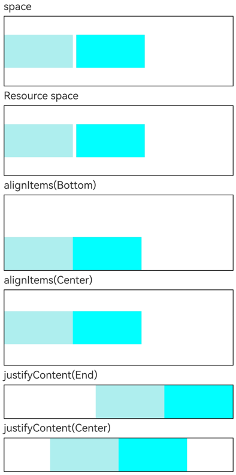
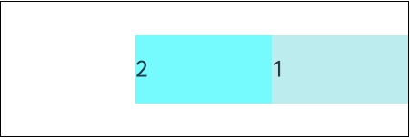

# Row
<!--Kit: ArkUI-->
<!--Subsystem: ArkUI-->
<!--Owner: @camlostshi-->
<!--Designer: @lanshouren-->
<!--Tester: @liuli0427-->
<!--Adviser: @Brilliantry_Rui-->

沿水平方向布局的容器，支持设置子组件间距、对齐方式，适用于需要横向排列多个子组件的场景，如工具栏、标签栏、按钮组等。

>  **说明：**
>
>  该组件从API version 7开始支持。后续版本的新增接口，采用上角标单独标记接口的起始版本。
>
>  Row未设置宽度或高度时，在主轴或交叉轴方向上自适应子组件大小。


## 子组件

可以包含子组件。


## 接口
### Row

Row(options?: RowOptions)

创建横向线性布局容器，可设置子组件间距。

>  **说明：**
>
>  在复杂界面中使用多组件嵌套时，若布局组件的嵌套层数过深或嵌套的组件数量过多，将会产生额外开销。建议通过移除冗余节点、利用布局边界减少布局计算、合理采用渲染控制语法及布局组件方法来优化性能。最佳实践请参考[布局优化指导](https://developer.huawei.com/consumer/cn/doc/best-practices/bpta-improve-layout-performance)。

**卡片能力：** 从API version 9开始，该接口支持在ArkTS卡片中使用。

**原子化服务API：** 从API version 11开始，该接口支持在原子化服务中使用。

**系统能力：** SystemCapability.ArkUI.ArkUI.Full

**参数：**

| 参数名 | 类型 | 必填 | 说明 |
| -------- | -------- | -------- | -------- |
| options<sup>18+</sup> | [RowOptions](#rowoptions18对象说明) | 否 | 横向布局的配置对象，用于设置子组件间距（单位：vp），其中space属性支持设置number或string类型的值。当需要自定义子组件间距时传入此参数；不传入时默认间距为0。<br>**模型约束：** 此接口仅可在Stage模型下使用。<br>**说明：** 从API version 9开始，space为负数或者justifyContent设置为FlexAlign.SpaceBetween、FlexAlign.SpaceAround、FlexAlign.SpaceEvenly时不生效。 |

### Row<sup>18+</sup>
Row(options?: RowOptions | RowOptionsV2)

创建横向线性布局容器，可设置子组件间距。

>  **说明：**
>
>  在复杂界面中使用多组件嵌套时，若布局组件的嵌套层数过深或嵌套的组件数量过多，将会产生额外开销。建议通过移除冗余节点、利用布局边界减少布局计算、合理采用渲染控制语法及布局组件方法来优化性能。最佳实践请参考[布局优化指导](https://developer.huawei.com/consumer/cn/doc/best-practices/bpta-improve-layout-performance)。

**卡片能力：** 从API version 18开始，该接口支持在ArkTS卡片中使用。

**原子化服务API：** 从API version 18开始，该接口支持在原子化服务中使用。

**模型约束：** 此接口仅可在Stage模型下使用。

**系统能力：** SystemCapability.ArkUI.ArkUI.Full

**参数：**

| 参数名 | 类型 | 必填 | 说明 |
| -------- | -------- | -------- | -------- |
| options | [RowOptions](#rowoptions18对象说明) \| [RowOptionsV2](#rowoptionsv218对象说明) | 否 | 横向布局的配置对象，用于设置子组件间距（单位：vp），其中space属性支持设置number、string或Resource类型的值。不传入时默认间距为0。<br>**说明：** 从API version 9开始，space为负数或者justifyContent设置为FlexAlign.SpaceBetween、FlexAlign.SpaceAround、FlexAlign.SpaceEvenly时不生效。 |

## RowOptions<sup>18+</sup>对象说明

设置Row组件的子组件间距属性。

> **说明：**
>
> 为规范匿名对象的定义，API 18版本修改了此处的元素定义。其中，保留了历史匿名对象的起始版本信息，会出现外层元素@since版本号高于内层元素版本号的情况，但这不影响接口的使用。

**卡片能力：** 从API version 18开始，该接口支持在ArkTS卡片中使用。

**原子化服务API：** 从API version 18开始，该接口支持在原子化服务中使用。

**模型约束：** 此接口仅可在Stage模型下使用。

**系统能力：** SystemCapability.ArkUI.ArkUI.Full

| 名称 | 类型 | 只读 | 可选 | 说明 |
| -------- | -------- | -------- | -------- | -------- |
| space<sup>7+</sup> | string \| number | 否 | 是 | 横向布局元素间距。<br>从API version 9开始，space为负数或者justifyContent设置为FlexAlign.SpaceBetween、FlexAlign.SpaceAround、FlexAlign.SpaceEvenly时不生效。<br>默认值：0<br>单位：vp<br>非法值：按默认值处理。<br>**说明：** <br>space取值是大于等于0的数字，或者可以转换为数字的字符串。<br>**卡片能力：** 从API version 9开始，该接口支持在ArkTS卡片中使用。<br>**原子化服务API：** 从API version 11开始，该接口支持在原子化服务中使用。 |

## RowOptionsV2<sup>18+</sup>对象说明

设置Row组件的子组件间距属性。间距类型SpaceType支持number、string或Resource类型。

**卡片能力：** 从API version 18开始，该接口支持在ArkTS卡片中使用。

**原子化服务API：** 从API version 18开始，该接口支持在原子化服务中使用。

**模型约束：** 此接口仅可在Stage模型下使用。

**系统能力：** SystemCapability.ArkUI.ArkUI.Full

| 名称 | 类型 | 只读 | 可选 | 说明 |
| -------- | -------- | -------- | -------- | -------- |
| space | [SpaceType](ts-container-column.md#spacetype18) | 否 | 是 | 横向布局元素间距。<br>取值范围：大于等于0。<br>从API version 9开始，justifyContent设置为FlexAlign.SpaceBetween、FlexAlign.SpaceAround、FlexAlign.SpaceEvenly时space参数不生效。<br>默认值：0<br>单位：vp<br>非法值：按默认值处理。<br>**说明：**<br>space取值是大于等于0的数字，或者可以转换为非负数字的字符串，或者可以转换为数字的Resource类型数据。负数作为非法值将被当作默认值0处理。|

## 属性

除支持[通用属性](ts-component-general-attributes.md)外，还支持以下属性：

### alignItems

alignItems(value: VerticalAlign)

设置子组件在垂直方向上的对齐格式。调用后，子组件将按照指定方式在垂直方向对齐，默认为垂直居中对齐。

**卡片能力：** 从API version 9开始，该接口支持在ArkTS卡片中使用。

**原子化服务API：** 从API version 11开始，该接口支持在原子化服务中使用。

**系统能力：** SystemCapability.ArkUI.ArkUI.Full

**参数：**

| 参数名 | 类型                                                | 必填 | 说明                                                         |
| ------ | --------------------------------------------------- | ---- | ------------------------------------------------------------ |
| value  | [VerticalAlign](ts-appendix-enums.md#verticalalign) | 是   | 子组件在垂直方向上的对齐格式。<br>默认值：VerticalAlign.Center |

### justifyContent<sup>8+</sup>

justifyContent(value: FlexAlign)

设置子组件在水平方向上的对齐格式。调用后，子组件将按照指定方式在水平方向对齐，默认为起始端对齐。

**卡片能力：** 从API version 9开始，该接口支持在ArkTS卡片中使用。

**原子化服务API：** 从API version 11开始，该接口支持在原子化服务中使用。

**系统能力：** SystemCapability.ArkUI.ArkUI.Full

**参数：**

| 参数名 | 类型                                        | 必填 | 说明                                                       |
| ------ | ------------------------------------------- | ---- | ---------------------------------------------------------- |
| value  | [FlexAlign](ts-appendix-enums.md#flexalign) | 是   | 子组件在水平方向上的对齐格式。<br>默认值：FlexAlign.Start<br>**说明：** 从API version 9开始，space为负数或者justifyContent设置为FlexAlign.SpaceBetween、FlexAlign.SpaceAround、FlexAlign.SpaceEvenly时，space参数不生效。 |

>  **说明：**
>
>  Row布局时若子组件不设置[flexShrink](ts-universal-attributes-flex-layout.md#flexshrink)则默认不会压缩子组件，即所有子组件主轴大小累加可超过容器主轴，此时FlexAlign.Center和FlexAlign.End的对齐行为会发生变化，子组件起始位置将与FlexAlign.Start一致。

### reverse<sup>12+</sup>

`reverse(isReversed: Optional<boolean>)`

设置子组件在水平方向上的排列顺序是否反转。设置为true时，子组件按照从右到左的顺序排列；设置为false时，子组件按照从左到右的顺序排列。适用于需要动态调整子组件显示顺序的场景，如国际化布局适配。

**卡片能力：** 从API version 12开始，该接口支持在ArkTS卡片中使用。

**原子化服务API：** 从API version 12开始，该接口支持在原子化服务中使用。

**模型约束：** 此接口仅可在Stage模型下使用。

**系统能力：** SystemCapability.ArkUI.ArkUI.Full

**参数：**

| 参数名 | 类型                                        | 必填 | 说明                                                       |
| ------ | ------------------------------------------- | ---- | ---------------------------------------------------------- |
| isReversed  | [Optional](ts-universal-attributes-custom-property.md#optionalt)\<boolean\> | 是   | 子组件在水平方向上的排列顺序是否反转。<br>设置true表示子组件在水平方向上反转排列（从右到左），设置false表示子组件在水平方向上正序排列（从左到右）。参数值为undefined时视为true，主轴方向反转。 |

>  **说明：**
>
>  若未设置reverse属性，主轴方向不反转；若设置了reverse属性，且参数值为undefined，则视为默认值true，主轴方向反转；若参数值为false，主轴方向不反转。<br>由于主轴排列方向受通用属性direction影响，若设置了direction属性，则当reverse属性设置为true时，总在direction属性生效的结果上再做一次反转；若reverse属性设置为false或未设置，则主轴方向由direction属性决定，不进行额外反转。

## 事件

支持[通用事件](ts-component-general-events.md)。

## 示例

### 示例1（设置Row组件的布局属性）

本示例展示设置Row组件的布局属性，如间距、对齐方式等属性后的效果。

```json
// resources/base/element/string.json
{
  "string": [
    {
      "name": "stringSpace",
      "value": "5"
    }
  ]
}
```

```ts
// xxx.ets
@Entry
@Component
struct RowExample {
  build() {
    Column({ space: 5 }) {
      // 设置子组件水平方向的间距为5
      Text('space').width('90%')
      Row({ space: 5 }) {
        Row().width('30%').height(50).backgroundColor(0xAFEEEE)
        Row().width('30%').height(50).backgroundColor(0x00FFFF)
      }.width('90%').height(107).border({ width: 1 })

      // 通过资源引用方式设置子组件水平方向的间距
      Text('Resource space').width('90%')
      // 使用资源引用方式设置space属性（API 18+支持）
      Row({ space: $r('app.string.stringSpace') }) {
        Row().width('30%').height(50).backgroundColor(0xAFEEEE)
        Row().width('30%').height(50).backgroundColor(0x00FFFF)
      }.width('90%').height(107).border({ width: 1 })

      // 设置子组件垂直方向对齐方式
      Text('alignItems(Bottom)').width('90%')
      // 设置子组件底部对齐
      Row() {
        Row().width('30%').height(50).backgroundColor(0xAFEEEE)
        Row().width('30%').height(50).backgroundColor(0x00FFFF)
      }.width('90%').alignItems(VerticalAlign.Bottom).height('15%').border({ width: 1 })

      Text('alignItems(Center)').width('90%')
      // 设置子组件垂直居中对齐
      Row() {
        Row().width('30%').height(50).backgroundColor(0xAFEEEE)
        Row().width('30%').height(50).backgroundColor(0x00FFFF)
      }.width('90%').alignItems(VerticalAlign.Center).height('15%').border({ width: 1 })

      // 设置子组件水平方向对齐方式
      Text('justifyContent(End)').width('90%')
      // 设置子组件右对齐
      Row() {
        Row().width('30%').height(50).backgroundColor(0xAFEEEE)
        Row().width('30%').height(50).backgroundColor(0x00FFFF)
      }.width('90%').border({ width: 1 }).justifyContent(FlexAlign.End)

      Text('justifyContent(Center)').width('90%')
      // 设置子组件水平居中对齐
      Row() {
        Row().width('30%').height(50).backgroundColor(0xAFEEEE)
        Row().width('30%').height(50).backgroundColor(0x00FFFF)
      }.width('90%').border({ width: 1 }).justifyContent(FlexAlign.Center)
    }.width('100%')
  }
}
```



### 示例2（设置反转属性）

本示例展示设置Row组件的reverse属性后的效果，演示如何实现子组件排列顺序的反转。

```ts
@Entry
@Component
struct RowReverseSample {
  build() {
    Row() {
      Text('1')
        .width(100)
        .height(50)
        .backgroundColor(0xAFEEEE)

      Text('2')
        .width(100)
        .height(50)
        .backgroundColor(0x00FFFF)
    }
    .height(100)
    .width(300)
    .border({ width: 1 })
    .reverse(true)
  }
}
```

