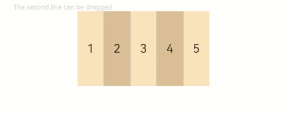

# RowSplit
<!--Kit: ArkUI-->
<!--Subsystem: ArkUI-->
<!--Owner: @zju_ljz-->
<!--Designer: @lanshouren-->
<!--Tester: @liuli0427-->
<!--Adviser: @Brilliantry_Rui-->

将子组件横向布局，并在每个子组件之间插入纵向分割线。适用于需要横向多区域布局且支持动态调整子组件宽度的场景，如文件管理器的左右分栏、设置页面的双栏布局等。通过可拖拽的分割线，用户可以灵活调整各区域宽度。

>  **说明：**
>
> 该组件从API version 7开始支持。后续版本的新增接口，采用上角标单独标记接口的起始版本。

## 子组件

可以包含子组件。

RowSplit通过分割线限制子组件的宽度。初始化时，分割线位置根据子组件的宽度来计算。初始化后，动态修改子组件的宽度不会改变分割线位置，分割线位置保持不变。可以通过拖动分割线改变子组件宽度。

初始化后，动态修改[margin](ts-universal-attributes-size.md#margin)、[border](ts-universal-attributes-border.md#border)、[padding](ts-universal-attributes-size.md#padding)通用属性可能导致子组件宽度大于相邻分割线间距。在此异常情况下，不支持拖动分割线改变子组件的宽度。这是因为分割线的位置在初始化时已确定，动态修改边距、边框、内边距等属性会破坏原有的布局计算，导致分割线无法正确响应拖动操作。建议在初始化时合理设置子组件的尺寸和边距属性。

## 接口

RowSplit()

带分割线的子组件横向分隔布局。

**原子化服务API：** 从API version 11开始，该接口支持在原子化服务中使用。

**系统能力：** SystemCapability.ArkUI.ArkUI.Full

## 属性

除支持[通用属性](ts-component-general-attributes.md)外，还支持以下属性：

> **说明：**
>
> RowSplit组件[形状裁剪](ts-universal-attributes-sharp-clipping.md)的默认值为true。

### resizeable

resizeable(value: boolean)

设置分割线是否可拖拽。设置为true时，用户可以拖拽分割线改变子组件宽度；设置为false时，分割线位置固定。

> **说明：**
>
> 初始化后，动态修改margin、border、padding通用属性导致子组件宽度大于相邻分割线间距的异常情况下，不支持拖动分割线改变子组件的宽度。

**原子化服务API：** 从API version 11开始，该接口支持在原子化服务中使用。

**系统能力：** SystemCapability.ArkUI.ArkUI.Full

**参数：** 

| 参数名 | 类型 | 必填 | 说明 |
| -------- | -------- | -------- | -------- |
| value | boolean | 是 | 分割线是否可拖拽。设置为true时表示分割线可拖拽，设置为false时表示分割线不可拖拽。<br>默认值：false <br>非法值：按默认值处理。 |

>  **说明：**
>
> RowSplit的分割线可以改变左右两边子组件的宽度，子组件可改变宽度的范围取决于子组件的最大最小宽度。分割线拖动时，会实时计算子组件的宽度，当达到子组件设置的最小宽度或最大宽度限制时，分割线将停止移动。

## 事件

支持[通用事件](ts-component-general-events.md)。

## 示例

RowSplit的基本用法。实现分割线可拖动的横向布局。

```ts
// xxx.ets
@Entry
@Component
struct RowSplitExample {
  build() {
    Column() {
      Text('The second line can be dragged').fontSize(9).fontColor(0xCCCCCC).width('90%')
      // 创建RowSplit组件，实现横向布局
      RowSplit() {
        Text('1').width('10%').height(100).backgroundColor(0xF5DEB3).textAlign(TextAlign.Center)
        Text('2').width('10%').height(100).backgroundColor(0xD2B48C).textAlign(TextAlign.Center)
        Text('3').width('10%').height(100).backgroundColor(0xF5DEB3).textAlign(TextAlign.Center)
        Text('4').width('10%').height(100).backgroundColor(0xD2B48C).textAlign(TextAlign.Center)
        Text('5').width('10%').height(100).backgroundColor(0xF5DEB3).textAlign(TextAlign.Center)
      }
      .resizeable(true) // 可拖拽
      .width('90%').height(100)
    }.width('100%').margin({ top: 5 })
  }
}
```


