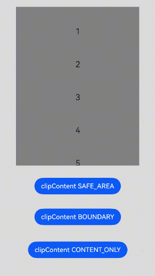

# 滚动组件通用接口

<!--Kit: ArkUI-->
<!--Subsystem: ArkUI-->
<!--Owner: @yylong; @rongShao-Z; @yangcan18-->
<!--Designer: @yylong;@guozejun-->
<!--Tester: @leiyuqian-->
<!--Adviser: @Brilliantry_Rui-->

滚动组件通用属性和事件目前只支持[List](ts-container-list.md)、[Grid](ts-container-grid.md)、[Scroll](ts-container-scroll.md)和[WaterFlow](ts-container-waterflow.md)组件。

>  **说明：**
>
> - 本模块同时支持ArkTS-Dyn、ArkTS-Sta。
>
> - 本模块从API version 8开始支持。后续版本如有新增内容，则采用上角标单独标记该内容的起始版本。

## 属性

### scrollBar<sup>11+</sup>

ArkTS-Dyn: scrollBar(barState: BarState)

ArkTS-Sta: scrollBar(barState: BarState | undefined)

设置滚动条状态。

**原子化服务API（仅ArkTS-Dyn）：** 从API version 11开始，该接口支持在原子化服务中使用。

**系统能力：** SystemCapability.ArkUI.ArkUI.Full

**模型约束：** 此接口仅可在Stage模型下使用。

**ArkTS-Dyn起始版本：** 11

**ArkTS-Sta起始版本：** 23

**参数：** 

| 参数名   | 类型                                      | 必填 | 说明                                   |
| -------- | ----------------------------------------- | ---- | -------------------------------------- |
| barState | ArkTS-Dyn: [BarState](ts-appendix-enums.md#barstate)<br/>ArkTS-Sta: [BarState](ts-appendix-enums.md#barstate)&nbsp;\|&nbsp;undefined | 是   | 滚动条状态。<br/>默认值：List、Grid、Scroll组件默认BarState.Auto，WaterFlow组件默认BarState.Off。<br/>取值为undefined时，按默认值处理。 |

### scrollBarColor<sup>11+</sup>

scrollBarColor(color: Color | number | string): T

设置滚动条的颜色。

**ArkTS模式：** 该接口仅适用于ArkTS-Dyn。

**原子化服务API（仅ArkTS-Dyn）：** 从API version 11开始，该接口支持在原子化服务中使用。

**模型约束：** 此接口仅可在Stage模型下使用。

**系统能力：** SystemCapability.ArkUI.ArkUI.Full

**ArkTS-Dyn起始版本：** 11

**参数：** 

| 参数名 | 类型                                                         | 必填 | 说明           |
| ------ | ------------------------------------------------------------ | ---- | -------------- |
| color  | [Color](ts-appendix-enums.md#color)&nbsp;\|&nbsp;number&nbsp;\|&nbsp;string | 是   | 滚动条的颜色。<br/>儿童智能表的默认值颜色为'\#ffffff'，表示白色（100%不透明度）。其他设备默认值为'\#182431'，表示深蓝灰色（40%不透明度）。<br/>number为HEX格式颜色，支持rgb或者argb，示例：0xffffff。string为rgb或者argb格式颜色，示例：'#ffffff'。 |

**返回值：**

| 类型 | 说明           |
| --- | -------------- |
| T | 返回当前滚动组件。 |

### scrollBarColor<sup>22+</sup>

ArkTS-Dyn: scrollBarColor(color: Color | number | string | Resource)

ArkTS-Sta: scrollBarColor(color: Color | int | string | Resource | undefined)

设置滚动条的颜色。与[scrollBarColor<sup>11+</sup>](#scrollbarcolor11)相比，color参数开始支持Resource类型。

**原子化服务API（仅ArkTS-Dyn）：** 从API version 22开始，该接口支持在原子化服务中使用。

**模型约束：** 此接口仅可在Stage模型下使用。

**系统能力：** SystemCapability.ArkUI.ArkUI.Full

**ArkTS-Dyn起始版本：** 22

**ArkTS-Sta起始版本：** 23

**参数：** 

| 参数名 | 类型                                                         | 必填 | 说明           |
| ------ | ------------------------------------------------------------ | ---- | -------------- |
| color  | ArkTS-Dyn: [Color](ts-appendix-enums.md#color)&nbsp;\|&nbsp;number&nbsp;\|&nbsp;string&nbsp;\|&nbsp;[Resource](ts-types.md#resource)<br/>ArkTS-Sta: [Color](ts-appendix-enums.md#color)&nbsp;\|&nbsp;int&nbsp;\|&nbsp;string&nbsp;\|&nbsp;[Resource](ts-types.md#resource)&nbsp;\|&nbsp;undefined | 是   | 滚动条的颜色。<br/>儿童智能表的默认值颜色为'\#ffffff'，表示白色（100%不透明度）。其他设备默认值为'\#182431'，表示深蓝灰色（40%不透明度）。<br/>number为HEX格式颜色，支持rgb或者argb，示例：0xffffff。string为rgb或者argb格式颜色，示例：'#ffffff'。 |

### scrollBarWidth<sup>11+</sup>

ArkTS-Dyn: scrollBarWidth(value: number | string)

ArkTS-Sta: scrollBarWidth(value: double | string | undefined)

设置滚动条的宽度，不支持百分比设置。宽度设置后，滚动条正常状态和按压状态宽度均为滚动条的宽度值。如果滚动条的宽度超过滚动组件主轴方向的高度，则滚动条的宽度会变为默认值。

**原子化服务API（仅ArkTS-Dyn）：** 从API version 11开始，该接口支持在原子化服务中使用。

**系统能力：** SystemCapability.ArkUI.ArkUI.Full

**模型约束：** 此接口仅可在Stage模型下使用。

**ArkTS-Dyn起始版本：** 11

**ArkTS-Sta起始版本：** 23

**参数：** 

| 参数名 | 类型                       | 必填 | 说明                                      |
| ------ | -------------------------- | ---- | ----------------------------------------- |
| value  | ArkTS-Dyn: number&nbsp;\|&nbsp;string<br/>ArkTS-Sta: double&nbsp;\|&nbsp;string&nbsp;\|&nbsp;undefined | 是   | 滚动条的宽度。<br/>默认值：4<br/>单位：vp <br/>取值范围：[0, +∞)。设置为小于0的值时，按默认值处理，儿童智能表则恢复至默认值5vp。设置为0时，不显示滚动条。<br/>取值为undefined时，按默认值处理。 |

### scrollBarWidth

ArkTS-Dyn: scrollBarWidth(value: number | string | Resource): T

ArkTS-Sta: scrollBarWidth(value: Resource | undefined): this

设置滚动条的宽度，不支持百分比设置。宽度设置后，滚动条正常状态和按压状态宽度均为滚动条的宽度值。如果滚动条的宽度超过滚动组件主轴方向的高度，则滚动条的宽度会变为4vp，支持Resource资源类型。

未通过该接口设置时，设置滚动条的宽度为4vp。

**模型约束：** 此接口仅可在Stage模型下使用。

**原子化服务API（仅ArkTS-Dyn）：** 从API版本26.0.0开始，该接口支持在原子化服务中使用。

**系统能力：** SystemCapability.ArkUI.ArkUI.Full

**ArkTS-Dyn起始版本：** 26.0.0

**ArkTS-Sta起始版本：** 26.0.0

**参数：** 

| 参数名 | 类型                                                         | 必填 | 说明                                                         |
| ------ | ------------------------------------------------------------ | ---- | ------------------------------------------------------------ |
| value  | ArkTS-Dyn: number&nbsp;\|&nbsp;string \|&nbsp;[Resource](ts-types.md#resource)<br/>ArkTS-Sta: [Resource](ts-types.md#resource)&nbsp;\|&nbsp;undefined | 是   | 滚动条的宽度。<br/>单位：vp <br/>取值范围：[0, +∞)。设置为小于0的值时，按4vp处理，儿童智能表则恢复至5vp。设置为0时，不显示滚动条。<br/>取值为undefined时，按4vp处理。 |

**返回值：**

| 类型 | 说明           |
| --- | -------------- |
| ArkTS-Dyn: T <br/>ArkTS-Sta: this | 返回当前滚动组件。 |

### scrollBarHeight

ArkTS-Dyn: scrollBarHeight(height: LengthMetrics | undefined): T

ArkTS-Sta: scrollBarHeight(height: LengthMetrics | undefined): this

设置滚动条滑轨高度。

未设置该接口时，滚动条滑轨高度默认自适应滚动组件高度，儿童智能表的默认值高度为37vp。

> **说明：**
>
> 推荐scrollBarHeight与[scrollBarMargin](#scrollbarmargin20)的设定值之和不超过滚动组件高度。

**模型约束：** 此接口仅可在Stage模型下使用。

**原子化服务API（仅ArkTS-Dyn）：** 从API版本26.0.0开始，该接口支持在原子化服务中使用。

**系统能力：** SystemCapability.ArkUI.ArkUI.Full

**ArkTS-Dyn起始版本：** 26.0.0

**ArkTS-Sta起始版本：** 26.0.0

**参数：**

| 参数名 | 类型 | 必填 | 说明 |
| ------ | ---- | ---- | ---- |
| height | [LengthMetrics](../js-apis-arkui-graphics.md#lengthmetrics12)\|&nbsp;undefined | 是 | 滚动条滑轨高度。<br/>值必须大于等于0。设置为undefined或小于0时，自适应滚动组件高度，儿童智能表则恢复至默认值37vp。设置为0时，不显示滚动条。 |

**返回值：**

| 类型 | 说明           |
| --- | -------------- |
| ArkTS-Dyn: T <br/>ArkTS-Sta: this  | 返回当前滚动组件。|

### edgeEffect<sup>11+</sup>

ArkTS-Dyn: edgeEffect(edgeEffect: EdgeEffect, options?: EdgeEffectOptions)

ArkTS-Sta: edgeEffect(edgeEffect: EdgeEffect | undefined, options?: EdgeEffectOptions)

设置边缘滑动效果。

**原子化服务API（仅ArkTS-Dyn）：** 从API version 11开始，该接口支持在原子化服务中使用。

**系统能力：** SystemCapability.ArkUI.ArkUI.Full

**模型约束：** 此接口仅可在Stage模型下使用。

**ArkTS-Dyn起始版本：** 11

**ArkTS-Sta起始版本：** 23

**参数：** 

| 参数名                | 类型                                              | 必填 | 说明                                                         |
| --------------------- | ------------------------------------------------- | ---- | ------------------------------------------------------------ |
| edgeEffect            | ArkTS-Dyn: [EdgeEffect](ts-appendix-enums.md#edgeeffect)<br/>ArkTS-Sta: [EdgeEffect](ts-appendix-enums.md#edgeeffect)&nbsp;\|&nbsp;undefined     | 是   | 滚动组件的边缘滑动效果，支持弹簧效果和阴影效果。<br/>默认值：Grid、Scroll、WaterFlow组件默认EdgeEffect.None，List组件默认EdgeEffect.Spring。<br/>取值为undefined时，按默认值处理。|
| options | [EdgeEffectOptions](#edgeeffectoptions11对象说明) | 否   | 组件内容大小小于组件自身时是否开启滑动效果，以及设置边缘效果生效的边缘。设置为{ alwaysEnabled: true }会开启滑动效果，{ alwaysEnabled: false }不开启。<br/>默认值：<br/>List、Grid、WaterFlow组件默认{ alwaysEnabled: false, EffectEdge: EffectEdge.START \| EffectEdge.END }，Scroll组件默认{ alwaysEnabled: true, EffectEdge: EffectEdge.START \| EffectEdge.END }。|

### nestedScroll<sup>11+</sup>

ArkTS-Dyn: nestedScroll(value: NestedScrollOptions)

ArkTS-Sta: nestedScroll(value: NestedScrollOptions | undefined)

设置前后两个方向的嵌套滚动模式，实现与父组件的滚动联动。

**原子化服务API（仅ArkTS-Dyn）：** 从API version 11开始，该接口支持在原子化服务中使用。

**系统能力：** SystemCapability.ArkUI.ArkUI.Full

**模型约束：** 此接口仅可在Stage模型下使用。

**ArkTS-Dyn起始版本：** 11

**ArkTS-Sta起始版本：** 23

**参数：** 

| 参数名 | 类型                                                  | 必填 | 说明           |
| ------ | ----------------------------------------------------- | ---- | -------------- |
| value  | ArkTS-Dyn: [NestedScrollOptions](#nestedscrolloptions10对象说明)<br/>ArkTS-Sta: [NestedScrollOptions](#nestedscrolloptions10对象说明)&nbsp;\|&nbsp;undefined | 是   | 嵌套滚动选项。<br/>默认值：{ scrollForward: NestedScrollMode.SELF_ONLY, scrollBackward: NestedScrollMode.SELF_ONLY }<br/>取值为undefined时，按默认值处理。 |

### enableScrollInteraction<sup>11+</sup>

ArkTS-Dyn: enableScrollInteraction(value: boolean)

ArkTS-Sta: enableScrollInteraction(value: boolean | undefined)

设置是否支持滚动手势。

**原子化服务API（仅ArkTS-Dyn）：** 从API version 11开始，该接口支持在原子化服务中使用。

**系统能力：** SystemCapability.ArkUI.ArkUI.Full

**模型约束：** 此接口仅可在Stage模型下使用。

**ArkTS-Dyn起始版本：** 11

**ArkTS-Sta起始版本：** 23

**参数：** 

| 参数名 | 类型    | 必填 | 说明                                |
| ------ | ------- | ---- | ----------------------------------- |
| value  | ArkTS-Dyn: boolean<br/>ArkTS-Sta: boolean&nbsp;\|&nbsp;undefined | 是   | 是否支持滚动手势。设置为true时可以通过手指或者鼠标滚动，设置为false时无法通过手指或者鼠标滚动，但不影响控制器[Scroller](ts-container-scroll.md#scroller)的滚动接口。<br/>默认值：true<br/>取值为undefined时，按默认值处理。 |

### friction<sup>11+</sup>

ArkTS-Dyn: friction(value: number | Resource)

ArkTS-Sta: friction(value: double | Resource | undefined)

设置摩擦系数，手动划动滚动区域时生效，仅影响惯性滚动过程，对惯性滚动过程中的链式效果有间接影响。设置为小于等于0的值时，按默认值处理。

**原子化服务API（仅ArkTS-Dyn）：** 从API version 11开始，该接口支持在原子化服务中使用。

**系统能力：** SystemCapability.ArkUI.ArkUI.Full

**模型约束：** 此接口仅可在Stage模型下使用。

**ArkTS-Dyn起始版本：** 11

**ArkTS-Sta起始版本：** 23

**参数：** 

| 参数名 | 类型                                                 | 必填 | 说明                                                      |
| ------ | ---------------------------------------------------- | ---- | --------------------------------------------------------- |
| value  | ArkTS-Dyn: number&nbsp;\|&nbsp;[Resource](ts-types.md#resource)<br/>ArkTS-Sta: double&nbsp;\|&nbsp;[Resource](ts-types.md#resource)&nbsp;\|&nbsp;undefined | 是   | 摩擦系数。<br/>默认值：非wearable设备为0.6，wearable设备为0.9。<br/>从API version 11开始，非wearable设备默认值为0.7。<br/>从API version 12开始，非wearable设备默认值为0.75。 <br/>取值范围：(0, +∞)，设置为小于等于0的值时，按默认值处理。<br/>取值为undefined时，按默认值处理。|

### flingSpeedLimit<sup>11+</sup>

ArkTS-Dyn: flingSpeedLimit(speedLimit: number)

ArkTS-Sta: flingSpeedLimit(speedLimit: double | undefined)

限制跟手滑动结束后，惯性动效开始时的最大初始速度。

> **说明：**
>
> - 惯性动效是指手指快速滑动并离开屏幕后，滚动内容继续滚动并逐渐减速停止的效果，也称为惯性滚动。
>
> - 惯性动效触发场景包括：惯性手指快速滑动并离手时，或调用[fling](ts-container-scroll.md#fling12)方法。
>
> - 使用鼠标滚轮、键盘方向键方式滚动，或通过[scrollTo](ts-container-scroll.md#scrollto)等方法直接滚动到指定位置，不会产生惯性动效。
>
> - 如果惯性动效通过[fling](ts-container-scroll.md#fling12)方法触发，则flingSpeedLimit设置不生效。

**原子化服务API（仅ArkTS-Dyn）：** 从API version 11开始，该接口支持在原子化服务中使用。

**系统能力：** SystemCapability.ArkUI.ArkUI.Full

**模型约束：** 此接口仅可在Stage模型下使用。

**ArkTS-Dyn起始版本：** 11

**ArkTS-Sta起始版本：** 23

**参数：** 

| 参数名     | 类型   | 必填 | 说明                            |
| ---------- | ------ | ---- | ------------------------------- |
| speedLimit | ArkTS-Dyn: number<br/>ArkTS-Sta: double&nbsp;\|&nbsp;undefined | 是   | 惯性动效开始时的最大初始速度。<br/>默认值：9000<br/>单位：vp/s <br/>取值范围：(0, +∞)，设置为小于等于0的值时，按默认值处理。<br/>取值为undefined时，按默认值处理。|

### fadingEdge<sup>14+</sup>

ArkTS-Dyn: fadingEdge(enabled: Optional&lt;boolean&gt;, options?: FadingEdgeOptions)

ArkTS-Sta: fadingEdge(enabled: boolean | undefined, options?: FadingEdgeOptions)

设置是否开启边缘渐隐效果及设置边缘渐隐长度。

> **说明：** 
> 
> fadingEdge是通过设置[overlay](ts-universal-attributes-overlay.md#overlay)属性和[blendMode](ts-universal-attributes-image-effect.md#blendmode11)属性（参数值为BlendMode.SRC_OVER，BlendApplyType.OFFSCREEN）实现的。当fadingEdge生效时，会覆盖原组件的.overlay()属性和.blendMode()属性，并将导致当前组件和其子组件需要截屏的接口无法截取到正确的画面。需要截屏的接口有：[blur](ts-universal-attributes-image-effect.md#blur)、[linearGradientBlur](ts-universal-attributes-image-effect.md#lineargradientblur12)、[brightness](ts-universal-attributes-image-effect.md#brightness)、[visualEffect](ts-universal-attributes-filter-effect.md#visualeffect)、[grayscale](ts-universal-attributes-image-effect.md#grayscale)、[saturate](ts-universal-attributes-image-effect.md#saturate)、[contrast](ts-universal-attributes-image-effect.md#contrast)、[invert](ts-universal-attributes-image-effect.md#invert)、[sepia](ts-universal-attributes-image-effect.md#sepia)、[hueRotate](ts-universal-attributes-image-effect.md#huerotate)、[colorBlend](ts-universal-attributes-image-effect.md#colorblend)、[lightUpEffect](ts-universal-attributes-image-effect.md#lightupeffect12)、[pixelStretchEffect](ts-universal-attributes-image-effect.md#pixelstretcheffect12)、[blendMode](ts-universal-attributes-image-effect.md#blendmode11)、[backgroundBrightness](ts-universal-attributes-background.md#backgroundbrightness12)。
>
> fadingEdge生效时，建议不在设置fadingEdge属性的组件上设置[background](ts-universal-attributes-background.md#background10)相关属性，会影响渐隐的显示效果。
>
> fadingEdge生效时，建议不在设置fadingEdge属性的组件以及其子组件上设置[systemMaterial](ts-universal-attributes-image-effect.md#systemmaterial)相关属性，会影响系统材质的显示效果，导致材质效果与预期效果不一致。
>
> fadingEdge生效时，设置fadingEdge属性的组件会裁剪到边界，在该组件上设置[clip](ts-universal-attributes-sharp-clipping.md#clip12)属性为false不生效。

**原子化服务API（仅ArkTS-Dyn）：** 从API version 14开始，该接口支持在原子化服务中使用。

**系统能力：** SystemCapability.ArkUI.ArkUI.Full

**模型约束：** 此接口仅可在Stage模型下使用。

**ArkTS-Dyn起始版本：** 14

**ArkTS-Sta起始版本：** 23

**参数：** 

| 参数名  | 类型                                              | 必填 | 说明                                                         |
| ------- | ------------------------------------------------- | ---- | ------------------------------------------------------------ |
| enabled | ArkTS-Dyn: [Optional](ts-universal-attributes-custom-property.md#optionalt)&lt;boolean&gt;<br/>ArkTS-Sta: boolean&nbsp;\|&nbsp;undefined                           | 是   | 是否开启边缘渐隐效果。设置为true时开启边缘渐隐效果，设置为false时不开启边缘渐隐效果。<br/>默认值：false <br/>取值为undefined时，按默认值处理。|
| options | [FadingEdgeOptions](#fadingedgeoptions14对象说明)  | 否   | 边缘渐隐参数对象。可以通过该对象定义边缘渐隐效果属性，比如设置渐隐长度。<br/>如果设置小于0的值或undefined或者不设置则取默认值，默认长度为32vp。<br/>如果设置的长度超过容器高度的一半时，渐隐长度取容器高度的一半。 |

### clipContent<sup>14+</sup>

ArkTS-Dyn: clipContent(clip: ContentClipMode | RectShape)

ArkTS-Sta: clipContent(clip: ContentClipMode | RectShape | undefined)

设置滚动容器的内容层裁剪区域。

从API版本26.0.0开始，内容层裁剪区域内的子组件支持正常显示。API版本26.0.0以前的版本，List、Grid和WaterFlow组件内容层裁剪区域比组件自身大小更大时，完全在组件区域外但在裁剪区域内的子组件默认不会显示。若需要显示可将组件的cachedCount属性的isShow参数设置为true，但由于cachedCount属性设置的预加载子组件只会在空闲时隙时执行，组件大小变化、数据更新等场景可能存在更新不及时导致闪烁问题。

**原子化服务API（仅ArkTS-Dyn）：** 从API version 14开始，该接口支持在原子化服务中使用。

**系统能力：** SystemCapability.ArkUI.ArkUI.Full

**模型约束：** 此接口仅可在Stage模型下使用。

**ArkTS-Dyn起始版本：** 14

**ArkTS-Sta起始版本：** 23

**参数：** 

| 参数名  | 类型                                              | 必填 | 说明                                                         |
| ------- | ------------------------------------------------- | ---- | ------------------------------------------------------------ |
| clip | ArkTS-Dyn: [ContentClipMode](#contentclipmode14枚举说明)&nbsp;\|&nbsp;[RectShape](../js-apis-arkui-shape.md#rectshape)<br/>ArkTS-Sta: [ContentClipMode](#contentclipmode14枚举说明)&nbsp;\|&nbsp;[RectShape](../js-apis-arkui-shape.md#rectshape)&nbsp;\|&nbsp;undefined   | 是   | 裁剪只针对滚动容器的内容，即其子节点，背景不受影响。通过RectShape传入自定义矩形区域时仅支持设置宽高和相对于组件左上角的[offset](../js-apis-arkui-shape.md#offset)，不支持圆角。<br></div>默认值：Grid、Scroll的默认值为ContentClipMode.BOUNDARY，List、WaterFlow的默认值为ContentClipMode.CONTENT_ONLY。<br/>取值为undefined时，按默认值处理。 |

### backToTop<sup>15+</sup>

ArkTS-Dyn: backToTop(backToTop: boolean)

ArkTS-Sta: backToTop(backToTop: boolean | undefined)

设置滚动组件是否支持点击状态栏回到顶部。

支持当前页面的滚动组件收到点击状态栏事件后，通过动画回到顶部。点击状态栏后，后台应用的滚动组件不受影响，不做回到顶部的动作。本属性不受[enableScrollInteraction](#enablescrollinteraction11)设置的影响。

**原子化服务API（仅ArkTS-Dyn）：** 从API version 15开始，该接口支持在原子化服务中使用。

**系统能力：** SystemCapability.ArkUI.ArkUI.Full

**模型约束：** 此接口仅可在Stage模型下使用。

**ArkTS-Dyn起始版本：** 15

**ArkTS-Sta起始版本：** 23

**参数：** 

| 参数名 | 类型    | 必填 | 说明                                           |
| ------ | ------- | ---- | ---------------------------------------------- |
| backToTop  | ArkTS-Dyn: boolean<br/>ArkTS-Sta: boolean&nbsp;\|&nbsp;undefined | 是   | 设置滚动组件是否支持点击状态栏回到顶部。设置为true支持点击状态栏通过动画回到顶部，设置为false不支持点击状态栏回到顶部。<br/>默认值：<br/>API version 18之前：false。 <br/>API version 18及以后：滚动方向是水平方向时为false，是垂直方向时为true。 |

### scrollBarMargin<sup>20+</sup>

ArkTS-Dyn: scrollBarMargin(margin: ScrollBarMargin)

ArkTS-Sta: scrollBarMargin(margin: ScrollBarMargin | undefined)

设置滚动条的边距。边距是在滚动条避让圆角距离的基础上计算的，如果滚动条区域小于滚动条的最小长度，则不显示滚动条。

**原子化服务API（仅ArkTS-Dyn）：** 从API version 20开始，该接口支持在原子化服务中使用。

**系统能力：** SystemCapability.ArkUI.ArkUI.Full

**模型约束：** 此接口仅可在Stage模型下使用。

**ArkTS-Dyn起始版本：** 20

**ArkTS-Sta起始版本：** 24

**参数：** 

| 参数名 | 类型    | 必填 | 说明                                  |
| ------ | ------- | ---- | ------------------------------------- |
| margin  | ArkTS-Dyn: [ScrollBarMargin](./ts-types.md#scrollbarmargin20对象说明)<br/>ArkTS-Sta: [ScrollBarMargin](./ts-types.md#scrollbarmargin20对象说明)&nbsp;\|&nbsp;undefined  | 是   |滚动条起始、末尾边距。<br/>儿童智能表默认值：{start: LengthMetrics.vp(42), end: LengthMetrics.vp(0)}<br/>其他设备默认值：{start: LengthMetrics.vp(0), end: LengthMetrics.vp(0)} <br/>取值为undefined时，滚动条起始、末尾边距默认为0。 |

### autoAdjustScrollBarMargin

ArkTS-Dyn: autoAdjustScrollBarMargin(enable: boolean | undefined): T

ArkTS-Sta: autoAdjustScrollBarMargin(enable: boolean | undefined): this

设置滚动条是否自动调整边距。默认不会自动调整边距。

打开滚动条自动边距调整后，滚动条滚动方向上会避让组件[padding](ts-universal-attributes-size.md#padding)、[safeAreaPadding](ts-universal-attributes-size.md#safeareapadding14)、[contentStartOffset](#contentstartoffset22)/[contentEndOffset](#contentendoffset22)区域。如果设置了[scrollBarMargin](#scrollbarmargin20)属性，则自动调整边距不生效。当[padding](ts-universal-attributes-size.md#padding)、[safeAreaPadding](ts-universal-attributes-size.md#safeareapadding14)、[contentStartOffset](#contentstartoffset22)、[contentEndOffset](#contentendoffset22)在水平方向上的总和大于组件的宽度，或在垂直方向上的总和大于组件的高度时，滚动条不显示。

**模型约束：** 此接口仅可在Stage模型下使用。

**原子化服务API（仅ArkTS-Dyn）：** 从API版本26.0.0开始，该接口支持在原子化服务中使用。

**系统能力：** SystemCapability.ArkUI.ArkUI.Full

**ArkTS-Dyn起始版本：** 26.0.0

**ArkTS-Sta起始版本：** 26.0.0

**参数：** 

| 参数名 | 类型    | 必填 | 说明                                  |
| ------ | ------- | ---- | ------------------------------------- |
| enable  | ArkTS-Dyn: boolean&nbsp;\|&nbsp;undefined<br/>ArkTS-Sta: boolean&nbsp;\|&nbsp;undefined  | 是   | 是否自动调整边距。<br>true：自动调整边距。<br>false：不自动调整边距。<br>undefined：不自动调整边距。 |

**返回值：**

| 类型 | 说明           |
| --- | -------------- |
| ArkTS-Dyn: T <br/>ArkTS-Sta: this | 返回当前组件。 |

### digitalCrownSensitivity<sup>18+</sup>

ArkTS-Dyn: digitalCrownSensitivity(sensitivity: Optional\<CrownSensitivity>): T

ArkTS-Sta: digitalCrownSensitivity(sensitivity: CrownSensitivity | undefined): this

设置表冠响应事件灵敏度。

组件收到[表冠事件](ts-universal-events-crown.md)的前提是该组件获焦，焦点控制可以通过[focusable](ts-universal-attributes-focus.md#focusable)、[defaultFocus](ts-universal-attributes-focus.md#defaultfocus9)、[focusOnTouch](ts-universal-attributes-focus.md#focusontouch9)进行管理。

**原子化服务API（仅ArkTS-Dyn）：** 从API version 18开始，该接口支持在原子化服务中使用。

**模型约束：** 此接口仅可在Stage模型下使用。

**系统能力：** SystemCapability.ArkUI.ArkUI.Full

**ArkTS-Dyn起始版本：** 18

**ArkTS-Sta起始版本：** 23

**参数：** 

| 参数名      | 类型                                                         | 必填 | 说明                                                         |
| ----------- | ------------------------------------------------------------ | ---- | ------------------------------------------------------------ |
| sensitivity | ArkTS-Dyn: Optional&lt;[CrownSensitivity](ts-appendix-enums.md#crownsensitivity18)&gt; <br/>ArkTS-Sta: [CrownSensitivity](ts-appendix-enums.md#crownsensitivity18) \| undefined | 是   | 表冠响应灵敏度。<br/>默认值：CrownSensitivity.MEDIUM，响应速度适中。 |

**返回值：**

| 类型 | 说明           |
| --- | -------------- |
| ArkTS-Dyn: T <br/>ArkTS-Sta: this | 返回当前滚动组件。 |

### contentStartOffset<sup>22+</sup>

ArkTS-Dyn: contentStartOffset(offset: number | Resource)

ArkTS-Sta: contentStartOffset(offset: double | Resource | undefined)

设置内容区域起始偏移量。滚动组件滚动到起始位置时，内容与组件显示区域边界保留指定距离。

contentStartOffset + contentEndOffset超过滚动组件内容区长度后contentStartOffset和contentEndOffset会置0。

**原子化服务API（仅ArkTS-Dyn）：** 从API version 22开始，该接口支持在原子化服务中使用。

**模型约束：** 此接口仅可在Stage模型下使用。

**系统能力：** SystemCapability.ArkUI.ArkUI.Full

**ArkTS-Dyn起始版本：** 22

**ArkTS-Sta起始版本：** 24

**参数：** 

| 参数名 | 类型   | 必填 | 说明                                            |
| ------ | ------ | ---- | ----------------------------------------------- |
| offset  | ArkTS-Dyn: number&nbsp;\|&nbsp;[Resource](ts-types.md#resource)<br/>ArkTS-Sta: double&nbsp;\|&nbsp;[Resource](ts-types.md#resource)&nbsp;\|&nbsp;undefined | 是   | 内容区域起始偏移量。<br/>默认值：0<br/>单位：vp <br/>设置异常值如负数、非数字Resource与undefined时，按默认值处理。|

### contentEndOffset<sup>22+</sup>

ArkTS-Dyn: contentEndOffset(offset: number | Resource)

ArkTS-Sta: contentEndOffset(offset: double | Resource | undefined)

设置内容区末尾偏移量。滚动组件滚动到末尾位置时，内容与组件显示区域边界保留指定距离。

contentStartOffset + contentEndOffset超过滚动组件内容区长度后contentStartOffset和contentEndOffset会置0。

**原子化服务API（仅ArkTS-Dyn）：** 从API version 22开始，该接口支持在原子化服务中使用。

**模型约束：** 此接口仅可在Stage模型下使用。

**系统能力：** SystemCapability.ArkUI.ArkUI.Full

**ArkTS-Dyn起始版本：** 22

**ArkTS-Sta起始版本：** 24

**参数：** 

| 参数名 | 类型   | 必填 | 说明                                          |
| ------ | ------ | ---- | --------------------------------------------- |
| offset  | ArkTS-Dyn: number&nbsp;\|&nbsp;[Resource](ts-types.md#resource)<br/>ArkTS-Sta: double&nbsp;\|&nbsp;[Resource](ts-types.md#resource)&nbsp;\|&nbsp;undefined | 是   | 内容区末尾偏移量。<br/>默认值：0<br/>单位：vp <br/>设置异常值如负数、非数字Resource与undefined时，按默认值处理。|

### enableScrollWithMouse

ArkTS-Dyn: enableScrollWithMouse(enabled: boolean | undefined): T

ArkTS-Sta: enableScrollWithMouse(enabled: boolean | undefined): this

设置是否支持鼠标左键按下拖动滚动。未通过该接口设置时，默认不支持鼠标左键按下拖动滚动。

**模型约束：** 此接口仅可在Stage模型下使用。

**原子化服务API（仅ArkTS-Dyn）：** 从API版本26.0.0开始，该接口支持在原子化服务中使用。

**系统能力：** SystemCapability.ArkUI.ArkUI.Full

**ArkTS-Dyn起始版本：** 26.0.0

**ArkTS-Sta起始版本：** 26.0.0


**参数：** 

| 参数名 | 类型   | 必填 | 说明                                          |
| ------ | ------ | ---- | --------------------------------------------- |
| enabled  | ArkTS-Dyn: boolean&nbsp;\|&nbsp;undefined<br/>ArkTS-Sta: boolean&nbsp; \| undefined | 是   | 是否支持鼠标左键按下拖动滚动。<br/>true：支持鼠标左键按下拖动滚动。<br/>false：不支持鼠标左键按下拖动滚动。<br/>undefined：不支持鼠标左键按下拖动滚动。 |

**返回值：**

| 类型 | 说明           |
| --- | -------------- |
| ArkTS-Dyn: T <br/>ArkTS-Sta: this | 返回当前组件。 |

## 事件

### onReachStart<sup>11+</sup>

ArkTS-Dyn: onReachStart(event: () => void)

ArkTS-Sta: onReachStart(event: (() => void) | undefined)

滚动组件到达起始位置时触发。

滚动组件初始化时会触发一次，滚动到起始位置时触发一次。边缘效果为弹簧效果时，划动经过起始位置时触发一次，回弹回起始位置时再触发一次。

**原子化服务API（仅ArkTS-Dyn）：** 从API version 11开始，该接口支持在原子化服务中使用。

**系统能力：** SystemCapability.ArkUI.ArkUI.Full

**模型约束：** 此接口仅可在Stage模型下使用。

**ArkTS-Dyn起始版本：** 11

**ArkTS-Sta起始版本：** 23

**参数：** 

| 参数名 | 类型   | 必填 | 说明                 |
| ------ | ------ | ---- | -------------------- |
| event  | ArkTS-Dyn: () => void<br/>ArkTS-Sta: (() => void)&nbsp;\|&nbsp;undefined | 是   | 滚动组件到达起始位置时的回调。 |

### onReachEnd<sup>11+</sup>

ArkTS-Dyn: onReachEnd(event: () => void)

ArkTS-Sta: onReachEnd(event: (() => void) | undefined)

滚动组件到达末尾位置时触发。

滚动组件边缘效果为弹簧效果时，划动经过末尾位置时触发一次，回弹回末尾位置时再触发一次。

**原子化服务API（仅ArkTS-Dyn）：** 从API version 11开始，该接口支持在原子化服务中使用。

**系统能力：** SystemCapability.ArkUI.ArkUI.Full

**模型约束：** 此接口仅可在Stage模型下使用。

**ArkTS-Dyn起始版本：** 11

**ArkTS-Sta起始版本：** 23

**参数：** 

| 参数名 | 类型   | 必填 | 说明                 |
| ------ | ------ | ---- | -------------------- |
| event  | ArkTS-Dyn: () => void<br/>ArkTS-Sta: (() => void)&nbsp;\|&nbsp;undefined | 是   | 滚动组件到达末尾位置时的回调。 |

### onScrollStart<sup>11+</sup>

ArkTS-Dyn: onScrollStart(event: () => void)

ArkTS-Sta: onScrollStart(event: (() => void) | undefined)

滚动开始时触发。手指拖动滚动组件或拖动滚动组件的滚动条触发的滚动开始时，会触发该事件。使用[Scroller](ts-container-scroll.md#scroller)滚动控制器触发的带动画的滚动，动画开始时会触发该事件。

触发该事件的条件：

1. 滚动组件开始滚动时触发，支持键鼠操作等其他触发滚动的输入设置。

2. 通过滚动控制器API接口调用后开始，带过渡动效。

**原子化服务API（仅ArkTS-Dyn）：** 从API version 11开始，该接口支持在原子化服务中使用。

**系统能力：** SystemCapability.ArkUI.ArkUI.Full

**模型约束：** 此接口仅可在Stage模型下使用。

**ArkTS-Dyn起始版本：** 11

**ArkTS-Sta起始版本：** 23

**参数：** 

| 参数名 | 类型   | 必填 | 说明                 |
| ------ | ------ | ---- | -------------------- |
| event  | ArkTS-Dyn: () => void<br/>ArkTS-Sta: (() => void)&nbsp;\|&nbsp;undefined | 是   | 滚动开始时的回调。 |

### onScrollStop<sup>11+</sup>

ArkTS-Dyn: onScrollStop(event: () => void)

ArkTS-Sta: onScrollStop(event: (() => void) | undefined)

滚动停止时触发。手拖动滚动组件或拖动滚动组件的滚动条触发的滚动，手离开屏幕后滚动停止时会触发该事件。使用[Scroller](ts-container-scroll.md#scroller)滚动控制器触发的带动画的滚动，动画停止时会触发该事件。

触发该事件的条件：

1. 滚动组件触发滚动后停止，支持键鼠操作等其他触发滚动的输入设置。

2. 通过调用带过渡动画的滚动控制器API接口，动画停止时。

**原子化服务API（仅ArkTS-Dyn）：** 从API version 11开始，该接口支持在原子化服务中使用。

**系统能力：** SystemCapability.ArkUI.ArkUI.Full

**模型约束：** 此接口仅可在Stage模型下使用。

**ArkTS-Dyn起始版本：** 11

**ArkTS-Sta起始版本：** 23

**参数：** 

| 参数名 | 类型   | 必填 | 说明                 |
| ------ | ------ | ---- | -------------------- |
| event  | ArkTS-Dyn: () => void<br/>ArkTS-Sta: (() => void)&nbsp;\|&nbsp;undefined | 是   | 滚动停止时的回调。 |

### onWillScroll<sup>12+</sup> 

onWillScroll(handler: Optional&lt;OnWillScrollCallback&gt;): T

滚动事件回调，滚动组件滚动前触发。

回调当前帧将要滚动的偏移量和当前滚动状态和滚动操作来源，其中回调的偏移量为计算得到的将要滚动的偏移量值，并非最终实际滚动偏移。可以通过该回调返回值指定滚动组件将要滚动的偏移。[Scroll](./ts-container-scroll.md)组件的[onWillScroll](./ts-container-scroll.md#onwillscroll12)接口的参数类型是[ScrollOnWillScrollCallback](./ts-container-scroll.md#scrollonwillscrollcallback12)。

>**说明：**
>
> - 从API version 14开始，该接口支持在[attributeModifier](ts-universal-attributes-attribute-modifier.md#attributemodifier)中调用。
>
> - 调用不带动画的[ScrollEdge](ts-container-scroll.md#scrolledge)和[ScrollToIndex](ts-container-scroll.md#scrolltoindex)时，不触发onWillScroll。

**ArkTS模式:** 该接口仅适用于ArkTS-Dyn。

**原子化服务API（仅ArkTS-Dyn）：** 从API version 12开始，该接口支持在原子化服务中使用。

**模型约束：** 此接口仅可在Stage模型下使用。

**系统能力：** SystemCapability.ArkUI.ArkUI.Full

**ArkTS-Dyn起始版本：** 12

**参数：**

| 参数名 | 类型 | 必填 | 说明 |
| ------ | ------ | ------ | ------|
| handler | [Optional](ts-universal-attributes-custom-property.md#optionalt)&lt;[OnWillScrollCallback](#onwillscrollcallback12)&gt; | 是 | 滚动组件滑动前触发的回调。 |

**返回值：**

| 类型 | 说明           |
| --- | -------------- |
| T | 返回当前滚动组件。 |

### onDidScroll<sup>12+</sup> 

onDidScroll(handler: OnScrollCallback): T

滚动组件滑动时触发，返回当前帧滑动的偏移量和当前滑动状态。

>**说明：**
>
> 从API version 14开始，该接口支持在[attributeModifier](ts-universal-attributes-attribute-modifier.md#attributemodifier)中调用。

**ArkTS模式:** 该接口仅适用于ArkTS-Dyn。

**卡片能力（仅ArkTS-Dyn）：** 从API version 12开始，该接口支持在ArkTS卡片中使用。

**原子化服务API（仅ArkTS-Dyn）：** 从API version 12开始，该接口支持在原子化服务中使用。

**模型约束：** 此接口仅可在Stage模型下使用。

**系统能力：** SystemCapability.ArkUI.ArkUI.Full

**ArkTS-Dyn起始版本：** 12

**参数：**

| 参数名 | 类型 | 必填 | 说明 |
| ------ | ------ | ------ | ------|
| handler | [OnScrollCallback](#onscrollcallback12) | 是 | 滚动组件滑动时触发的回调。 |

**返回值：**

| 类型 | 说明           |
| --- | -------------- |
| T | 返回当前滚动组件。 |

### onScroll<sup>(deprecated)</sup>

onScroll(event: (scrollOffset: number, scrollState: ScrollState) => void): T

滚动组件滑动时触发。

> **说明：**
>
> 从API version 11开始支持，从API version 12开始废弃，[List](ts-container-list.md)、[Grid](ts-container-grid.md)和[WaterFlow](ts-container-waterflow.md)组件的onScroll事件在布局之后触发，建议使用[onDidScroll](#ondidscroll12)替代；[Scroll](ts-container-scroll.md)组件的onScroll事件在布局之前触发，建议使用[onWillScroll](#onwillscroll12)替代。

**ArkTS模式:** 该接口仅适用于ArkTS-Dyn。

**原子化服务API（仅ArkTS-Dyn）：** 从API version 11开始，该接口支持在原子化服务中使用。

**模型约束：** 此接口仅可在Stage模型下使用。

**系统能力：** SystemCapability.ArkUI.ArkUI.Full

**ArkTS-Dyn起始版本：** 11

**参数：**

| 参数名 | 类型 | 必填 | 说明 |
| ------ | ------ | ------ | ------|
| event  | (scrollOffset: number, scrollState: [ScrollState](ts-container-list.md#scrollstate枚举说明)) => void | 是 | 滚动组件滑动时的回调。<br/>scrollOffset：相对于上一帧的偏移量，滚动组件的内容向上滚动时偏移量为正，向下滚动时偏移量为负。单位vp。<br/>scrollState：当前滑动状态。|

**返回值：**

| 类型 | 说明           |
| --- | -------------- |
| T | 返回当前滚动组件。 |

### onWillStartDragging<sup>21+</sup>

ArkTS-Dyn: onWillStartDragging(handler: VoidCallback)

ArkTS-Sta: onWillStartDragging(handler: VoidCallback | undefined)

滚动组件开始拖动时触发。

**卡片能力（仅ArkTS-Dyn）：** 从API version 21开始，该接口支持在ArkTS卡片中使用。

**原子化服务API（仅ArkTS-Dyn）：** 从API version 21开始，该接口支持在原子化服务中使用。

**模型约束：** 此接口仅可在Stage模型下使用。

**系统能力：** SystemCapability.ArkUI.ArkUI.Full

**ArkTS-Dyn起始版本：** 21

**ArkTS-Sta起始版本：** 24

**参数：**

| 参数名  | 类型                                        | 必填 | 说明                         |
| ------- | ------------------------------------------ | ---- | ---------------------------- |
| handler | ArkTS-Dyn: [VoidCallback](ts-types.md#voidcallback12)<br/>ArkTS-Sta: [VoidCallback](ts-types.md#voidcallback12)&nbsp;\|&nbsp;undefined | 是   | 滚动组件开始拖动时触发的回调。<br/>当设置为undefined时，重置该事件回调。 |

### onWillStopDragging<sup>20+</sup>

ArkTS-Dyn: onWillStopDragging(handler: OnWillStopDraggingCallback)

ArkTS-Sta: onWillStopDragging(handler: OnWillStopDraggingCallback | undefined)

滚动组件划动离手时触发，使用鼠标滚轮划动时不会触发。

**卡片能力（仅ArkTS-Dyn）：** 从API version 20开始，该接口支持在ArkTS卡片中使用。

**原子化服务API（仅ArkTS-Dyn）：** 从API version 20开始，该接口支持在原子化服务中使用。

**模型约束：** 此接口仅可在Stage模型下使用。

**系统能力：** SystemCapability.ArkUI.ArkUI.Full

**ArkTS-Dyn起始版本：** 20

**ArkTS-Sta起始版本：** 24

**参数：**

| 参数名  | 类型                                                        | 必填 | 说明                         |
| ------- | ----------------------------------------------------------- | ---- | ---------------------------- |
| handler | ArkTS-Dyn: [OnWillStopDraggingCallback](#onwillstopdraggingcallback20)<br/>ArkTS-Sta: [OnWillStopDraggingCallback](#onwillstopdraggingcallback20)&nbsp;\|&nbsp;undefined | 是   | 滚动组件划动离手时触发的回调。<br/>当设置为undefined时，重置该事件回调。 |

### onDidStopDragging<sup>21+</sup>

ArkTS-Dyn: onDidStopDragging(handler: OnDidStopDraggingCallback)

ArkTS-Sta: onDidStopDragging(handler: OnDidStopDraggingCallback | undefined)

滚动组件结束拖拽时触发。

**卡片能力（仅ArkTS-Dyn）：** 从API version 21开始，该接口支持在ArkTS卡片中使用。

**原子化服务API（仅ArkTS-Dyn）：** 从API version 21开始，该接口支持在原子化服务中使用。

**模型约束：** 此接口仅可在Stage模型下使用。

**系统能力：** SystemCapability.ArkUI.ArkUI.Full

**ArkTS-Dyn起始版本：** 21

**ArkTS-Sta起始版本：** 24

**参数：**

| 参数名  | 类型                                                       | 必填 | 说明                         |
| ------- | --------------------------------------------------------- | ---- | --------------------------- |
| handler | ArkTS-Dyn: [OnDidStopDraggingCallback](#ondidstopdraggingcallback21)<br/>ArkTS-Sta: [OnDidStopDraggingCallback](#ondidstopdraggingcallback21)&nbsp;\|&nbsp;undefined | 是   | 滚动组件结束拖动时触发的回调。<br/>当设置为undefined时，重置该事件回调。 |

### onWillStartFling<sup>21+</sup>

ArkTS-Dyn: onWillStartFling(handler: VoidCallback)

ArkTS-Sta: onWillStartFling(handler: VoidCallback | undefined)

滚动组件将要开始惯性动效时触发。

> **说明：**
>
> - 如果惯性动效通过[fling](ts-container-scroll.md#fling12)方法触发，则onWillStartFling不触发。
>
> - 惯性动效的触发场景参考[flingSpeedLimit](#flingspeedlimit11)方法的说明。

**卡片能力（仅ArkTS-Dyn）：** 从API version 21开始，该接口支持在ArkTS卡片中使用。

**原子化服务API（仅ArkTS-Dyn）：** 从API version 21开始，该接口支持在原子化服务中使用。

**模型约束：** 此接口仅可在Stage模型下使用。

**系统能力：** SystemCapability.ArkUI.ArkUI.Full

**ArkTS-Dyn起始版本：** 21

**ArkTS-Sta起始版本：** 24

**参数：**

| 参数名  | 类型                                        | 必填 | 说明                         |
| ------- | ------------------------------------------ | ---- | ---------------------------- |
| handler | ArkTS-Dyn: [VoidCallback](ts-types.md#voidcallback12)<br/>ArkTS-Sta: [VoidCallback](ts-types.md#voidcallback12)&nbsp;\|&nbsp;undefined | 是   | 滚动组件将要开始惯性动效时触发的回调。<br/>当设置为undefined时，重置该事件回调。 |

### onDidStopFling<sup>21+</sup>

ArkTS-Dyn: onDidStopFling(handler: VoidCallback)

ArkTS-Sta: onDidStopFling(handler: VoidCallback | undefined)

滚动组件结束惯性动效后触发，进行中的惯性动效被新的滑动事件打断时不触发。

**卡片能力（仅ArkTS-Dyn）：** 从API version 21开始，该接口支持在ArkTS卡片中使用。

**原子化服务API（仅ArkTS-Dyn）：** 从API version 21开始，该接口支持在原子化服务中使用。

**模型约束：** 此接口仅可在Stage模型下使用。

**系统能力：** SystemCapability.ArkUI.ArkUI.Full

**ArkTS-Dyn起始版本：** 21

**ArkTS-Sta起始版本：** 24

**参数：**

| 参数名  | 类型                                        | 必填 | 说明                         |
| ------- | ------------------------------------------ | ---- | ---------------------------- |
| handler | ArkTS-Dyn: [VoidCallback](ts-types.md#voidcallback12)<br/>ArkTS-Sta: [VoidCallback](ts-types.md#voidcallback12)&nbsp;\|&nbsp;undefined | 是   | 滚动组件结束惯性动效后触发的回调。<br/>当设置为undefined时，重置该事件回调。 |

## ItemDragInfo对象说明

拖拽点信息对象。

**原子化服务API（仅ArkTS-Dyn）：** 从API version 11开始，该接口支持在原子化服务中使用。

**模型约束：** 此接口仅可在Stage模型下使用。

**系统能力：** SystemCapability.ArkUI.ArkUI.Full

**ArkTS-Dyn起始版本：** 8

**ArkTS-Sta起始版本：** 23

| 名称         | 类型         | 只读 | 可选 |   说明         |
| ---------- | ---------- | -- | -- | ---------- |
| x | number | 否 | 否 |  当前拖拽点的x坐标，单位vp。    |
| y | number | 否 | 否 |  当前拖拽点的y坐标，单位vp。    |

## NestedScrollOptions<sup>10+</sup>对象说明

[nestedScroll](#nestedscroll11)属性参数对象。

**原子化服务API（仅ArkTS-Dyn）：** 从API version 11开始，该接口支持在原子化服务中使用。

**系统能力：** SystemCapability.ArkUI.ArkUI.Full

**ArkTS-Dyn起始版本：** 10

**ArkTS-Sta起始版本：** 23

| 名称   | 类型  | 只读 | 可选 | 说明              |
| ----- | ------ | ------ | -- | ----------------- |
| scrollForward | [NestedScrollMode](ts-appendix-enums.md#nestedscrollmode10) | 否 | 否 | 滚动组件往末尾端滚动时的嵌套滚动选项。 |
| scrollBackward | [NestedScrollMode](ts-appendix-enums.md#nestedscrollmode10) | 否 | 否 | 滚动组件往起始端滚动时的嵌套滚动选项。 |

## EdgeEffectOptions<sup>11+</sup>对象说明

[edgeEffect](#edgeeffect11)属性参数对象。

**模型约束：** 此接口仅可在Stage模型下使用。

**系统能力：** SystemCapability.ArkUI.ArkUI.Full

| 名称   | 类型  | 只读 | 可选 | 说明              |
| ----- | ------| ------- | -- | ----------------- |
| alwaysEnabled | boolean | 否 | 否 | 组件内容大小小于组件自身时，设置是否开启滑动效果。设置为true开启滑动效果，设置为false关闭滑动效果。[List](ts-container-list.md)、[Grid](ts-container-grid.md)和[WaterFlow](ts-container-waterflow.md)组件默认值是false，[Scroll](ts-container-scroll.md)组件默认值是true。<br/>**原子化服务API（仅ArkTS-Dyn）：** 从API version 12开始，该接口支持在原子化服务中使用。<br/>**ArkTS-Dyn起始版本：** 11 <br/>**ArkTS-Sta起始版本：** 23|
| effectEdge<sup>18+</sup> | number | 否 | 是 | 设置边缘效果生效的边缘。<br/>如果设置[EffectEdge](#effectedge18枚举说明).START表示只有起始边生效。如果设置[EffectEdge](#effectedge18枚举说明).END表示只有末尾边生效。<br/>默认值为[EffectEdge](#effectedge18枚举说明).START \| [EffectEdge](#effectedge18枚举说明).END表示双边同时生效。当设置为其它异常值时，则默认双边同时生效。<br/>如果需要双边都不生效，可将edgeEffect设置为EdgeEffect.None。<br/>**原子化服务API（仅ArkTS-Dyn）：** 从API version 18开始，该接口支持在原子化服务中使用。<br/>**ArkTS-Dyn起始版本：** 18 <br/>**ArkTS-Sta起始版本：** 23 |

## FadingEdgeOptions<sup>14+</sup>对象说明

[fadingEdge](#fadingedge14)属性边缘渐隐参数对象。

**原子化服务API（仅ArkTS-Dyn）：** 从API version 14开始，该接口支持在原子化服务中使用。

**系统能力：** SystemCapability.ArkUI.ArkUI.Full

**ArkTS-Dyn起始版本：** 14

**ArkTS-Sta起始版本：** 23

| 名称           | 类型                                                         | 只读 | 可选 | 说明                                                         |
| ---------------- | ------------------------------------------------------------ | ---- | -- | ------------------------------------------------------------ |
| fadingEdgeLength | [LengthMetrics](../js-apis-arkui-graphics.md#lengthmetrics12) | 否   | 是 | 设置边缘渐隐长度。如果设置小于0的值则取默认值，默认长度为32vp。<br/>如果设置的长度超过容器高度的一半时，渐隐长度取容器高度的一半。 |

## EditModeOptions<sup>23+</sup>对象说明

List/Grid组件编辑模式选项属性参数对象。

**模型约束：** 此接口仅可在Stage模型下使用。

**系统能力：** SystemCapability.ArkUI.ArkUI.Full

**ArkTS-Dyn起始版本：** 23

**ArkTS-Sta起始版本：** 23

| 名称           | 类型                                                         | 只读 | 可选 | 说明                                                         |
| ---------------- | ------------------------------------------------------------ | ---- | -- | ------------------------------------------------------------ |
| enableGatherSelectedItemsAnimation | boolean | 否   | 是 | 是否启用多选聚拢动画。设置true时启用聚拢动画，设置为false时关闭聚拢动画。<br>只有GridItem或ListItem上设置了[bindContextMenu](ts-universal-attributes-menu.md#bindcontextmenu8)且responseType设置为[ResponseType](ts-appendix-enums.md#responsetype8).LongPress、[preview](ts-universal-attributes-menu.md#contextmenuoptions10)参数设置为MenuPreviewMode.IMAGE或CustomBuilder时会显示多选聚拢动画。<br>如果GridItem或ListItem上设置了[拖拽事件](ts-universal-events-drag-drop.md)，是否聚拢以[dragPreviewOptions](ts-universal-attributes-drag-drop.md#dragpreviewoptions11)设置为准。<br>默认值：false<br>**原子化服务API（仅ArkTS-Dyn）：** 从API version 23开始，该接口支持在原子化服务中使用。 |
| onGetPreviewBadge | [OnGetPreviewBadgeCallback](#ongetpreviewbadgecallback23) | 否   | 是 | 即将启动多选长按聚拢动画时，触发用于获取选中数量的回调。<br>缺省时用Grid或List显示范围内选中item的数量作为多选长按聚拢动画后菜单预览图的角标。<br>**原子化服务API（仅ArkTS-Dyn）：** 从API version 23开始，该接口支持在原子化服务中使用。 |
| useDefaultMultiSelectStyle | boolean | 否   | 是 | 是否使用默认多选样式。<br>true表示GridItem或ListItem进入多选状态后显示勾选框；false表示进入多选状态后无默认样式。<br>默认值：true<br>**ArkTS-Dyn起始版本：** 26.0.0<br>**ArkTS-Sta起始版本：** 26.0.0<br>**原子化服务API（仅ArkTS-Dyn）：** 从API版本26.0.0开始，该接口支持在原子化服务中使用。 |
| enableTwoFingerMultiSelect | boolean | 否   | 是 | 是否开启双指滑动多选。<br>true表示双指滑动可以进入编辑模式并进行多选，只有List/Grid使用[enableEditMode](ts-container-grid.md#enableeditmode)双向绑定或设置[onEditModeChange](ts-container-grid.md#oneditmodechange)事件回调才生效；false表示双指滑动不可进行多选。<br>默认值：true<br>**ArkTS-Dyn起始版本：** 26.0.0<br>**ArkTS-Sta起始版本：** 26.0.0<br>**原子化服务API（仅ArkTS-Dyn）：** 从API版本26.0.0开始，该接口支持在原子化服务中使用。 |

## EffectEdge<sup>18+</sup>枚举说明

表示当前边缘效果要生效的边缘。

**原子化服务API（仅ArkTS-Dyn）：** 从API version 18开始，该接口支持在原子化服务中使用。

**模型约束：** 此接口仅可在Stage模型下使用。

**系统能力：** SystemCapability.ArkUI.ArkUI.Full

**ArkTS-Dyn起始版本：** 18

**ArkTS-Sta起始版本：** 23

| 名称  | 值   | 说明         |
| ----- | ---- | ------------ |
| START | 1    | 起始边生效。 |
| END   | 2    | 末尾边生效。 |

## ContentClipMode<sup>14+</sup>枚举说明

表示滚动容器的内容裁剪模式。

**原子化服务API（仅ArkTS-Dyn）：** 从API version 14开始，该接口支持在原子化服务中使用。

**系统能力：** SystemCapability.ArkUI.ArkUI.Full

**ArkTS-Dyn起始版本：** 14

**ArkTS-Sta起始版本：** 23

下图是组件配置了边距属性后的示意图，可理解每种枚举对应的裁剪区域。


| 名称     |  值  | 说明                                       |
| ------ | ------ | ---------------------------------------- |
| CONTENT_ONLY   |  0  | 按内容区裁剪，对应图中的绿色区域。 |
| BOUNDARY |  1  | 按组件区域裁剪，对应图中的整个蓝色区域。 |
| SAFE_AREA  |  2  | 按组件配置的SafeArea区域裁剪，对应图中的整个黄色区域。 |

## OnWillScrollCallback<sup>12+</sup>

ArkTS-Dyn: type OnWillScrollCallback = (scrollOffset: number, scrollState: ScrollState, scrollSource: ScrollSource) => void | ScrollResult

ArkTS-Sta: type OnWillScrollCallback = (scrollOffset: double, scrollState: ScrollState, scrollSource: ScrollSource) => (undefined | ScrollResult)

滚动组件滑动前触发的回调。

**原子化服务API（仅ArkTS-Dyn）：** 从API version 12开始，该接口支持在原子化服务中使用。

**模型约束：** 此接口仅可在Stage模型下使用。

**系统能力：** SystemCapability.ArkUI.ArkUI.Full

**ArkTS-Dyn起始版本：** 12

**ArkTS-Sta起始版本：** 23

**参数：**

| 参数名 | 类型 | 必填 | 说明 |
| ------ | ------ | ------ | ------|
| scrollOffset | ArkTS-Dyn: number<br/> ArkTS-Sta: double | 是 | 相对于上一帧的偏移量，滚动组件的内容向上滚动时偏移量为正，向下滚动时偏移量为负。<br/>单位vp。 |
| scrollState | [ScrollState](ts-container-list.md#scrollstate枚举说明) | 是 | 当前滑动状态。 |
| scrollSource | [ScrollSource](ts-appendix-enums.md#scrollsource12) | 是 | 当前滑动操作的来源。 |

**返回值：** 

| 类型                          | 说明                                  |
| ----------------------------- | ------------------------------------ |
| ArkTS-Dyn: void \| [ScrollResult](#scrollresult12对象说明)<br/> ArkTS-Sta: undefined \| [ScrollResult](#scrollresult12对象说明) |  返回ScrollResult时按照开发者指定的相对上一帧的偏移量滑动；不返回时按回调参数scrollOffset滑动。  <br/>取值范围：(-∞, +∞)|

## OnScrollCallback<sup>12+</sup>

ArkTS-Dyn: type OnScrollCallback = (scrollOffset: number, scrollState: ScrollState) => void

ArkTS-Sta: type OnScrollCallback = (scrollOffset: double, scrollState: ScrollState) => void

滚动组件滑动时触发的回调。

**卡片能力（仅ArkTS-Dyn）：** 从API version 12开始，该接口支持在ArkTS卡片中使用。

**原子化服务API（仅ArkTS-Dyn）：** 从API version 12开始，该接口支持在原子化服务中使用。

**模型约束：** 此接口仅可在Stage模型下使用。

**系统能力：** SystemCapability.ArkUI.ArkUI.Full

**ArkTS-Dyn起始版本：** 12

**ArkTS-Sta起始版本：** 23

**参数：**

| 参数名 | 类型 | 必填 | 说明 |
| ------ | ------ | ------ | ------|
| scrollOffset | ArkTS-Dyn: number<br/> ArkTS-Sta: double | 是 | 相对于上一帧的偏移量，滚动组件的内容向上滚动时偏移量为正，向下滚动时偏移量为负。<br/>单位vp。 |
| scrollState | [ScrollState](ts-container-list.md#scrollstate枚举说明) | 是 | 当前滑动状态。 |

## OnItemDragStartCallback<sup>23+</sup>

ArkTS-Dyn: type OnItemDragStartCallback = (event: ItemDragInfo, itemIndex: number) => CustomBuilder

ArkTS-Sta: type OnItemDragStartCallback = (event: ItemDragInfo, itemIndex: int) => (CustomBuilder | undefined)

开始拖拽列表或网格元素时触发的回调。

**原子化服务API（仅ArkTS-Dyn）：** 从API version 23开始，该接口支持在原子化服务中使用。

**系统能力：** SystemCapability.ArkUI.ArkUI.Full

**ArkTS-Dyn起始版本：** 23

**ArkTS-Sta起始版本：** 23

**参数：**

| 参数名    | 类型                                                      | 必填 | 说明                   |
| --------- | --------------------------------------------------------- | ---- | ---------------------- |
| event     | [ItemDragInfo](ts-container-scrollable-common.md#itemdraginfo对象说明) | 是   | 拖拽点的信息。         |
| itemIndex | ArkTS-Dyn: number<br/> ArkTS-Sta: int                                                    | 是   | 被拖拽列表元素索引值。 |

**返回值：** 

| 类型                          | 说明                                  |
| ----------------------------- | ------------------------------------ |
| [CustomBuilder](ts-types.md#custombuilder8) |  返回CustomBuilder用于构建被拖拽元素的拖拽图。返回void表示不能拖拽。|

## OnGetPreviewBadgeCallback<sup>23+</sup>

ArkTS-Dyn: type OnGetPreviewBadgeCallback = () => boolean | number

ArkTS-Sta: type OnGetPreviewBadgeCallback = () => (boolean | int)

即将启动多选长按聚拢动画时，触发用于获取选中数量的回调。

**模型约束：** 此接口仅可在Stage模型下使用。

**原子化服务API（仅ArkTS-Dyn）：** 从API version 23开始，该接口支持在原子化服务中使用。

**系统能力：** SystemCapability.ArkUI.ArkUI.Full

**ArkTS-Dyn起始版本：** 23

**ArkTS-Sta起始版本：** 23

**返回值：**

| 类型                          | 说明                                  |
| ----------------------------- | ------------------------------------  |
| ArkTS-Dyn: boolean \| number <br>ArkTS-Sta: boolean \| int |  多选长按聚拢动画后菜单预览图是否显示选中数量角标，或需要显示的数量。<br>返回true表示显示选中数量角标，对应Grid或List显示范围内选中item数量；false表示不显示角标。<br>返回数字时默认显示角标，该数字表示角标中需要显示的数量。取值范围：[0, 2<sup>31</sup>-1]，超过取值范围时按返回true处理。<br>返回浮点数时，向下取整。|

## ScrollResult<sup>12+</sup>对象说明

[OnWillScrollCallback](#onwillscrollcallback12)返回值对象。

**原子化服务API（仅ArkTS-Dyn）：** 从API version 12开始，该接口支持在原子化服务中使用。

**系统能力：** SystemCapability.ArkUI.ArkUI.Full

**ArkTS-Dyn起始版本：** 12

**ArkTS-Sta起始版本：** 23

| 名称 | 类型 | 只读 | 可选 | 说明 |
| ------ | ------ | ------ | -- | ------|
| offsetRemain | ArkTS-Dyn: number<br/> ArkTS-Sta: double | 否 | 否 | 将要滑动偏移量，单位vp。 |

## ChildrenMainSize<sup>12+</sup>对象说明

维护[List](./ts-container-list.md)组件或[ListItemGroup](./ts-container-listitemgroup.md)组件的子组件在主轴方向的大小信息，仅支持一对一绑定到List组件或ListItemGroup组件。

> **说明：**
>
> - 提供的主轴方向大小信息必须与子组件实际在主轴方向的大小一致，子组件在主轴方向大小变化或者增删子组件时都必须通过ChildrenMainSize对象方法通知List组件或ListItemGroup组件。

**原子化服务API（仅ArkTS-Dyn）：** 从API version 12开始，该接口支持在原子化服务中使用。

**系统能力：** SystemCapability.ArkUI.ArkUI.Full

### constructor<sup>12+</sup>

ArkTS-Dyn: constructor(childDefaultSize: number)

ArkTS-Sta: constructor(childDefaultSize: double)

ChildrenMainSize有参构造函数。

**原子化服务API（仅ArkTS-Dyn）：** 从API version 12开始，该接口支持在原子化服务中使用。

**模型约束：** 此接口仅可在Stage模型下使用。

**系统能力：** SystemCapability.ArkUI.ArkUI.Full

**ArkTS-Dyn起始版本：** 12

**ArkTS-Sta起始版本：** 23

**参数：**

| 参数名   | 类型                            | 必填   | 说明                   |
| ---- | ----------------------------- | ---- | -------------------- |
| childDefaultSize | ArkTS-Dyn: number<br/> ArkTS-Sta: double | 是    | 子组件在主轴方向的默认大小。<br/>单位：vp<br/>**说明：** <br/>必须是有限的非负数值，否则抛出异常。|

**错误码**：

以下错误码详细介绍请参考[通用错误码](../../errorcode-universal.md)。

| 错误码ID | 错误信息 |
| ------- | -------- |
| 401      | Parameter error. Possible causes: 1. Mandatory parameters are left unspecified; 2. Incorrect parameters types; 3. Parameter verification failed.   |


### childDefaultSize<sup>12+</sup>

ArkTS-Dyn: set childDefaultSize(value: number)

ArkTS-Sta: set childDefaultSize(value: double)

修改子组件在主轴方向的默认大小。

**原子化服务API（仅ArkTS-Dyn）：** 从API version 12开始，该接口支持在原子化服务中使用。

**模型约束：** 此接口仅可在Stage模型下使用。

**系统能力：** SystemCapability.ArkUI.ArkUI.Full

**ArkTS-Dyn起始版本：** 12

**ArkTS-Sta起始版本：** 23

**参数：**

| 参数名   | 类型                            | 必填   | 说明                   |
| ---- | ----------------------------- | ---- | -------------------- |
| value | ArkTS-Dyn: number<br/> ArkTS-Sta: double | 是    | 子组件在主轴方向的默认大小。<br/>单位：vp<br/>**说明：** <br/>必须是有限的非负数值，否则抛出异常。|

**错误码**：

以下错误码详细介绍请参考[通用错误码](../../errorcode-universal.md)。

| 错误码ID | 错误信息 |
| ------- | -------- |
| 401      | Parameter error. Possible causes: 1. Mandatory parameters are left unspecified; 2. Incorrect parameters types; 3. Parameter verification failed.   |

ArkTS-Dyn: get childDefaultSize(): number

ArkTS-Sta: get childDefaultSize(): double

获取子组件在主轴方向的默认大小。

**原子化服务API（仅ArkTS-Dyn）：** 从API version 12开始，该接口支持在原子化服务中使用。

**系统能力：** SystemCapability.ArkUI.ArkUI.Full

**ArkTS-Dyn起始版本：** 12

**ArkTS-Sta起始版本：** 23

**返回值：** 

| 类型                                                         | 说明                                                         |
| ------------------------------------------------------------ | ------------------------------------------------------------ |
| ArkTS-Dyn: number<br/> ArkTS-Sta: double | 子组件在主轴方向的默认大小。<br/>单位：vp |

### splice<sup>12+</sup>

ArkTS-Dyn: splice(start: number, deleteCount?: number, childrenSize?: Array\<number>): void

ArkTS-Sta: splice(start: int, deleteCount?: int, childrenSize?: Array\<double\>): void

批量增删改子组件在主轴方向的大小信息。

**原子化服务API（仅ArkTS-Dyn）：** 从API version 12开始，该接口支持在原子化服务中使用。

**模型约束：** 此接口仅可在Stage模型下使用。

**系统能力：** SystemCapability.ArkUI.ArkUI.Full

**ArkTS-Dyn起始版本：** 12

**ArkTS-Sta起始版本：** 23

**参数：**

| 参数名   | 类型                            | 必填   | 说明                   |
| ---- | ----------------------------- | ---- | -------------------- |
| start | ArkTS-Dyn: number<br/> ArkTS-Sta: int | 是    | 从0开始计算的索引值，表示要开始修改子组件在主轴方向大小信息的位置。<br/>**说明：** <br/>1. 必须是有限的非负数值，否则抛出异常。<br/>2. 非整数会被截断为整数。<br/>3. 超过最大索引值不生效。<br/>取值范围：[0, +∞) |
| deleteCount | ArkTS-Dyn: number<br/> ArkTS-Sta: int | 否    | 从start开始删除的大小信息的数量。<br/>**说明：** <br/>1.  必须是有限的非负数值，否则处理为0。<br/>2. 非整数会被截断为整数。<br/>3. start + deleteCount - 1可以超过最大索引值，会删除索引值start开始之后的所有子组件的大小信息。<br/>默认值为+∞。 <br/>取值范围：[0, +∞) |
| childrenSize | ArkTS-Dyn: Array\<number><br/> ArkTS-Sta: Array\<double> | 否    | 要在start位置插入的所有子组件的主轴方向的大小。<br/>Array中各个数值单位：vp <br/>**说明：** <br/>1.数组中数值如果是有限的非负值，则认为是指定的大小，后续不随默认大小的变化而变化。<br/>2. 数组中数值如果不是有限的非负值，会被处理成默认大小，后续会随默认大小的变化而变化。<br/>默认值为空数组。 <br/>取值范围：[0, +∞) |


**错误码**：

以下错误码详细介绍请参考[通用错误码](../../errorcode-universal.md)。

| 错误码ID | 错误信息 |
| ------- | -------- |
| 401      | Parameter error. Possible causes: 1. Mandatory parameters are left unspecified; 2. Incorrect parameters types; 3. Parameter verification failed.   |


> **说明：**
>
> - 如果仅使用start参数，表示删除索引值start及之后的子组件的大小信息。
> - 如果仅使用start和deleteCount参数，表示删除索引值start开始的deleteCount数量的子组件的大小信息。一般在删除子组件时使用。
> - 如果使用3个参数，表示删除索引值start开始的deleteCount数量的子组件的大小信息，再在start位置插入childrenSize中所有的大小信息。一般在增加子组件或者批量更新子组件主轴方向大小的时候使用，如果仅是增加子组件，deleteCount为0，childrenSize的元素数量和增加子组件的个数应该相等；如果仅是批量更新子组件主轴方向的大小，childrenSize的元素数量应该和deleteCount相等，即为批量更新的数量。
> - 如果想要通知某个子组件的大小为默认大小，childrenSize中对应的值不应该给一个有限的非负值，而应该给NaN，任意负值等能被处理成默认大小的值。

### update<sup>12+</sup>

ArkTS-Dyn: update(index: number, childSize: number): void

ArkTS-Sta: update(index: int, childSize: double): void

修改指定索引值对应的子组件的主轴方向的大小信息。

**原子化服务API（仅ArkTS-Dyn）：** 从API version 12开始，该接口支持在原子化服务中使用。

**模型约束：** 此接口仅可在Stage模型下使用。

**系统能力：** SystemCapability.ArkUI.ArkUI.Full

**ArkTS-Dyn起始版本：** 12

**ArkTS-Sta起始版本：** 23

**参数：**

| 参数名   | 类型                            | 必填   | 说明                   |
| ---- | ----------------------------- | ---- | -------------------- |
| index | ArkTS-Dyn: number<br/> ArkTS-Sta: int | 是    | 从0开始计算的索引值，表示要开始修改子组件在主轴方向大小信息的位置。<br/>**说明：** <br/>1. 必须是有限的非负数值，否则抛出异常。<br/>2. 非整数会被截断为整数。<br/>3. 超过最大索引值不生效。 <br/>取值范围：[0, +∞)|
| childSize | ArkTS-Dyn: number<br/> ArkTS-Sta: double | 是    | 要更新成的大小。<br/>单位：vp <br/>**说明：** <br/>1.数值如果是有限的非负值，则认为是指定的大小，后续不随默认大小的变化而变化。<br/>2. 数值如果不是有限的非负值，会被处理成默认大小，后续会随默认大小的变化而变化。  <br/>取值范围：[0, +∞)|

**错误码**：

以下错误码详细介绍请参考[通用错误码](../../errorcode-universal.md)。

| 错误码ID | 错误信息 |
| ------- | -------- |
| 401      | Parameter error. Possible causes: 1. Mandatory parameters are left unspecified; 2. Incorrect parameters types; 3. Parameter verification failed.   |

## UIScrollableCommonEvent<sup>19+</sup>
用于设置滚动事件回调。
### setOnReachStart<sup>19+</sup>

ArkTS-Dyn: setOnReachStart(callback: Callback\<void> | undefined): void

ArkTS-Sta: setOnReachStart(callback: VoidCallback | undefined): void

设置[onReachStart](./ts-container-scrollable-common.md#onreachstart11)事件的回调。

方法入参为undefined的时候，重置对应的事件回调。

**原子化服务API（仅ArkTS-Dyn）：** 从API version 19开始，该接口支持在原子化服务中使用。

**系统能力：** SystemCapability.ArkUI.ArkUI.Full

**模型约束：** 此接口仅可在Stage模型下使用。

**ArkTS-Dyn起始版本：** 19

**ArkTS-Sta起始版本：** 24

**参数：**

| 参数名 | 类型   | 必填 | 说明                       |
| ------ | ------ | ---- | -------------------------- |
| callback  | ArkTS-Dyn: [Callback](./ts-types.md#callback12)\<void> &nbsp;\|&nbsp;undefined<br/>ArkTS-Sta: [VoidCallback](ts-types.md#voidcallback12)&nbsp;\|&nbsp;undefined | 是   | onReachStart事件的回调函数。 |

### setOnReachEnd<sup>19+</sup>

ArkTS-Dyn: setOnReachEnd(callback: Callback\<void> | undefined): void

ArkTS-Sta: setOnReachEnd(callback: VoidCallback | undefined): void

设置[onReachEnd](./ts-container-scrollable-common.md#onreachend11)事件的回调。

方法入参为undefined时，会重置事件回调。

**原子化服务API（仅ArkTS-Dyn）：** 从API version 19开始，该接口支持在原子化服务中使用。

**系统能力：** SystemCapability.ArkUI.ArkUI.Full

**模型约束：** 此接口仅可在Stage模型下使用。

**ArkTS-Dyn起始版本：** 19

**ArkTS-Sta起始版本：** 24

**参数：**

| 参数名 | 类型   | 必填 | 说明                       |
| ------ | ------ | ---- | -------------------------- |
| callback  | ArkTS-Dyn: [Callback](./ts-types.md#callback12)\<void> &nbsp;\|&nbsp;undefined<br/>ArkTS-Sta: [VoidCallback](ts-types.md#voidcallback12)&nbsp;\|&nbsp;undefined | 是   | onReachEnd事件的回调函数。 |


### setOnScrollStart<sup>19+</sup>

ArkTS-Dyn: setOnScrollStart(callback: Callback\<void> | undefined): void

ArkTS-Sta: setOnScrollStart(callback: VoidCallback | undefined): void

设置[onScrollStart](./ts-container-scrollable-common.md#onscrollstart11)事件的回调。

方法入参为undefined时，会重置事件回调。

**原子化服务API（仅ArkTS-Dyn）：** 从API version 19开始，该接口支持在原子化服务中使用。

**系统能力：** SystemCapability.ArkUI.ArkUI.Full

**模型约束：** 此接口仅可在Stage模型下使用。

**ArkTS-Dyn起始版本：** 19

**ArkTS-Sta起始版本：** 24

**参数：**

| 参数名 | 类型   | 必填 | 说明                       |
| ------ | ------ | ---- | -------------------------- |
| callback  | ArkTS-Dyn: [Callback](./ts-types.md#callback12)\<void> &nbsp;\|&nbsp; undefined<br/>ArkTS-Sta: [VoidCallback](ts-types.md#voidcallback12)&nbsp;\|&nbsp;undefined | 是   | onScrollStart事件的回调函数。|


### setOnScrollStop<sup>19+</sup>

ArkTS-Dyn: setOnScrollStop(callback: Callback\<void> | undefined): void

ArkTS-Sta: setOnScrollStop(callback: VoidCallback | undefined): void

设置[onScrollStop](./ts-container-scrollable-common.md#onscrollstop11)事件的回调。

方法入参为undefined时，会重置事件回调。

**原子化服务API（仅ArkTS-Dyn）：** 从API version 19开始，该接口支持在原子化服务中使用。

**系统能力：** SystemCapability.ArkUI.ArkUI.Full

**模型约束：** 此接口仅可在Stage模型下使用。

**ArkTS-Dyn起始版本：** 19

**ArkTS-Sta起始版本：** 24

**参数：**

| 参数名 | 类型   | 必填 | 说明                       |
| ------ | ------ | ---- | -------------------------- |
| callback  | ArkTS-Dyn: [Callback](./ts-types.md#callback12)\<void> &nbsp;\|&nbsp;undefined<br/>ArkTS-Sta: [VoidCallback](ts-types.md#voidcallback12)&nbsp;\|&nbsp;undefined | 是   | onScrollStop事件的回调函数。 |

### setOnScrollFrameBegin<sup>19+</sup>

setOnScrollFrameBegin(callback: OnScrollFrameBeginCallback | undefined): void

设置[onScrollFrameBegin](./ts-container-scroll.md#onscrollframebegin9)事件的回调。

方法入参为undefined时，会重置事件回调。

**原子化服务API（仅ArkTS-Dyn）：** 从API version 19开始，该接口支持在原子化服务中使用。

**模型约束：** 此接口仅可在Stage模型下使用。

**系统能力：** SystemCapability.ArkUI.ArkUI.Full

**ArkTS-Dyn起始版本：** 19

**ArkTS-Sta起始版本：** 24

**参数：**

| 参数名 | 类型   | 必填 | 说明                       |
| ------ | ------ | ---- | -------------------------- |
| callback  | [OnScrollFrameBeginCallback](./ts-container-scroll.md#onscrollframebegincallback18)&nbsp;\|&nbsp;undefined | 是   | onScrollFrameBegin事件的回调函数。 |


## OnWillStopDraggingCallback<sup>20+</sup>

ArkTS-Dyn: type OnWillStopDraggingCallback = (velocity: number) => void

ArkTS-Sta: type OnWillStopDraggingCallback = (velocity: double) => void

滚动组件划动离手时触发的回调。

**卡片能力（仅ArkTS-Dyn）：** 从API version 20开始，该接口支持在ArkTS卡片中使用。

**原子化服务API（仅ArkTS-Dyn）：** 从API version 20开始，该接口支持在原子化服务中使用。

**模型约束：** 此接口仅可在Stage模型下使用。

**系统能力：** SystemCapability.ArkUI.ArkUI.Full

**ArkTS-Dyn起始版本：** 20

**ArkTS-Sta起始版本：** 24

**参数：**

| 参数名   | 类型   | 必填 | 说明                                                         |
| -------- | ------ | ---- | ------------------------------------------------------------ |
| velocity | ArkTS-Dyn: number<br/>ArkTS-Sta: double | 是   | 划动离手速度，滚动组件的内容向上滚动时速度为正，向下滚动时速度为负。<br/>单位vp/s。 |

## OnDidStopDraggingCallback<sup>21+</sup>

type OnDidStopDraggingCallback = (willFling: boolean) => void

滚动组件在结束拖拽时触发的回调。

**卡片能力（仅ArkTS-Dyn）：** 从API version 21开始，该接口支持在ArkTS卡片中使用。

**原子化服务API（仅ArkTS-Dyn）：** 从API version 21开始，该接口支持在原子化服务中使用。

**模型约束：** 此接口仅可在Stage模型下使用。

**系统能力：** SystemCapability.ArkUI.ArkUI.Full

**ArkTS-Dyn起始版本：** 21

**ArkTS-Sta起始版本：** 24

**参数：**

| 参数名     | 类型    | 必填 | 说明                                                                              |
| --------  | ------- | ---- | -------------------------------------------------------------------------------- |
| willFling | boolean | 是   | 结束拖拽后是否会有惯性动效。返回true代表拖拽结束后有惯性动效，返回false代表没有惯性动效。 |

## OnVisibleIndexesChangeCallback

ArkTS-Dyn: type OnVisibleIndexesChangeCallback = (start: number, end: number) => void

ArkTS-Sta: type OnVisibleIndexesChangeCallback = (start: int, end: int) => void

懒加载布局容器[LazyColumnLayout](ts-container-lazycolumnlayout.md)、[LazyVGridLayout](ts-container-lazyvgridlayout.md)、[LazyVWaterFlowLayout](ts-container-lazyvwaterflowlayout.md)所显示的子组件索引发生变化时的回调类型。

> **说明：**
>
> - 当懒加载布局容器没有子组件时，start和end都返回-1。
> - 当懒加载布局容器在可视区域内无子组件时，start和end都返回-1。

**原子化服务API（仅ArkTS-Dyn）：** 从API版本26.0.0开始，该接口支持在原子化服务中使用。

**模型约束：** 此接口仅可在Stage模型下使用。

**系统能力：** SystemCapability.ArkUI.ArkUI.Full

**ArkTS-Dyn起始版本：** 26.0.0

**ArkTS-Sta起始版本：** 26.0.0

**参数：**

| 参数名 | 类型   | 必填 | 说明                                  |
| ------ | ------ | ---- | ------------------------------------- |
| start  | ArkTS-Dyn: number<br/>ArkTS-Sta: int | 是   | 可视区域起始位置的索引值。<br/>取值范围：[0, 子节点总数-1] |
| end    | ArkTS-Dyn: number<br/>ArkTS-Sta: int  | 是   | 可视区域终止位置的索引值。<br/>取值范围：[0, 子节点总数-1] |

## 示例

### 示例1（支持滚动手势）
该示例通过设置[enableScrollInteraction](ts-container-scrollable-common.md#enablescrollinteraction11)属性，实现了使用手势滚动纵向列表，并在当前显示界面发生改变时回调索引。

ListDataSource说明及完整代码参考[示例1（添加滚动事件）](./ts-container-list.md#示例1添加滚动事件)。

<!--code_no_check-->
```ts
// xxx.ets
import { ListDataSource } from './ListDataSource';

@Entry
@Component
struct ListExample {
  private arr: ListDataSource = new ListDataSource([0, 1, 2, 3, 4, 5, 6, 7, 8, 9]);

  build() {
    Column() {
      List({ space: 20, initialIndex: 0 }) {
        LazyForEach(this.arr, (item: number) => {
          ListItem() {
            Text('' + item)
              .width('100%')
              .height(100)
              .fontSize(16)
              .textAlign(TextAlign.Center)
              .borderRadius(10)
              .backgroundColor(0xFFFFFF)
          }
        }, (item: number) => item.toString())
      }
      .enableScrollInteraction(true)
      .listDirection(Axis.Vertical) // 排列方向
      .scrollBar(BarState.Off)
      .friction(0.6)
      .divider({
        strokeWidth: 2,
        color: 0xFFFFFF,
        startMargin: 20,
        endMargin: 20
      }) // 每行之间的分界线
      .edgeEffect(EdgeEffect.Spring) // 边缘效果设置为Spring
      .onScrollIndex((firstIndex: number, lastIndex: number, centerIndex: number) => {
        console.info('first' + firstIndex);
        console.info('last' + lastIndex);
        console.info('center' + centerIndex);
      })
      .onScrollVisibleContentChange((start: VisibleListContentInfo, end: VisibleListContentInfo) => {
        console.info(' start index: ' + start.index +
          ' start item group area: ' + start.itemGroupArea +
          ' start index in group: ' + start.itemIndexInGroup);
        console.info(' end index: ' + end.index +
          ' end item group area: ' + end.itemGroupArea +
          ' end index in group: ' + end.itemIndexInGroup);
      })
      .onDidScroll((scrollOffset: number, scrollState: ScrollState) => {
        console.info(`onScroll scrollState = ScrollState` + scrollState + `, scrollOffset = ` + scrollOffset);
      })
      .width('90%')
    }
    .width('100%')
    .height('100%')
    .backgroundColor(0xDCDCDC)
    .padding({ top: 5 })
  }
}
```


### 示例2（设置边缘渐隐）
该示例通过设置[fadingEdge](ts-container-scrollable-common.md#fadingedge14)属性，实现了[List](ts-container-list.md)组件开启边缘渐隐效果并设置边缘渐隐长度。

ListDataSource说明及完整代码参考[示例1（添加滚动事件）](./ts-container-list.md#示例1添加滚动事件)。

<!--code_no_check-->
```ts
// xxx.ets
import { LengthMetrics } from '@kit.ArkUI';
import { ListDataSource } from './ListDataSource';

@Entry
@Component
struct ListExample {
  private arr: ListDataSource = new ListDataSource([0, 1, 2, 3, 4, 5, 6, 7, 8, 9, 10, 11]);
  scrollerForList: Scroller = new Scroller();

  build() {
    Column() {

      List({ space: 20, initialIndex: 0, scroller: this.scrollerForList }) {
        LazyForEach(this.arr, (item: number) => {
          ListItem() {
            Text('' + item)
              .width('100%')
              .height(100)
              .fontSize(16)
              .textAlign(TextAlign.Center)
              .borderRadius(10)
              .backgroundColor(0xFFFFFF)
          }
        }, (item: number) => item.toString())
      }
      .fadingEdge(true, { fadingEdgeLength: LengthMetrics.vp(80) })
    }
    .width('100%')
    .height('100%')
    .backgroundColor(0xDCDCDC)
    .padding({ top: 5 })
  }
}
```


### 示例3（设置裁剪区域）
该示例通过设置[clipContent](ts-container-scrollable-common.md#clipcontent14)属性，改变组件的内容层裁剪区域。

```ts
// xxx.ets
import { LengthMetrics } from '@kit.ArkUI';

@Entry
@Component
struct ScrollExample {
  scroller: Scroller = new Scroller();
  private arr: number[] = [0, 1, 2, 3, 4, 5, 6, 7, 8, 9, 10, 11, 12];
  @State clipContent: ContentClipMode | RectShape | undefined = undefined;

  build() {
    Column() {
      Scroll(this.scroller) {
        Column() {
          ForEach(this.arr, (item: number) => {
            Text(item.toString())
              .width(300)
              .height(80)
              .fontSize(20)
              .textAlign(TextAlign.Center)
              .backgroundColor(Color.Grey)
          }, (item: string) => item)
        }
      }
      .backgroundColor(Color.Blue)
      .clipContent(this.clipContent)
      .scrollBar(BarState.Off)
      .friction(0.6)
      .width(300)
      .height('50%')
      .padding(10)
      .safeAreaPadding(LengthMetrics.vp(10))
      .initialOffset({ yOffset: 80 })
      .margin({ top: 20 })

      Button('clipContent SAFE_AREA')
        .onClick(() => {
          this.clipContent = ContentClipMode.SAFE_AREA;
        }).margin({ top: 30 })

      Button('clipContent BOUNDARY')
        .onClick(() => {
          this.clipContent = ContentClipMode.BOUNDARY;
        }).margin({ top: 35 })

      Button('clipContent CONTENT_ONLY')
        .onClick(() => {
          this.clipContent = ContentClipMode.CONTENT_ONLY;
        }).margin({ top: 40 })
    }.width('100%').height('100%').backgroundColor(0xDCDCDC)
  }
}
```



### 示例4（设置滚动条边距）
从API version 20开始，该示例通过设置[scrollBarMargin](#scrollbarmargin20)属性，调整滚动组件的滚动条边距。

ListDataSource说明及完整代码参考[示例1（添加滚动事件）](./ts-container-list.md#示例1添加滚动事件)。

<!--code_no_check-->
```ts
// xxx.ets
import { ListDataSource } from './ListDataSource';
import { LengthMetrics } from '@kit.ArkUI';

@Entry
@Component
struct ListExample {
  arr: ListDataSource = new ListDataSource([0, 1, 2, 3, 4, 5, 6, 7, 8, 9]);
  @State scrollBarMargin: ScrollBarMargin = { start: LengthMetrics.vp(0), end: LengthMetrics.vp(0) };

  build() {
    Stack({ alignContent: Alignment.TopStart }) {
      Column() {
        List({ space: 20, initialIndex: 0 }) {
          LazyForEach(this.arr, (item: number, index?: number) => {
            ListItem() {
              Flex({ direction: FlexDirection.Row, alignItems: ItemAlign.Center }) {
                Text('' + item)
                  .width('100%')
                  .height(80)
                  .fontSize(20)
                  .textAlign(TextAlign.Center)
                  .borderRadius(10)
                  .backgroundColor(Color.White)
                  .flexShrink(1)
              }
            }
          }, (item: number) => item.toString())
        }.width('90%')
        .friction(0.6)
        .scrollBar(BarState.On)
        .scrollBarMargin(this.scrollBarMargin)
      }.width('100%')

      Button('scrollBarMargin')
        .onClick(() => {
          this.scrollBarMargin = { start: LengthMetrics.vp(45), end: LengthMetrics.vp(70) };
        }).margin({ top: 5, left: 20 })

      Button('scrollBarMargin2')
        .onClick(() => {
          this.scrollBarMargin = { start: LengthMetrics.vp(15), end: LengthMetrics.vp(100) };
        }).margin({ top: 200, left: 20 })
    }.width('100%').height('100%').backgroundColor(0xDCDCDC).padding({ top: 5 })
  }
}
```


