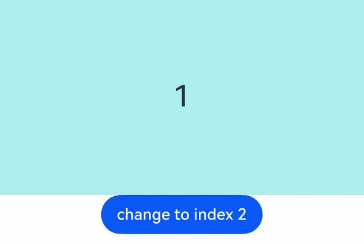

# Swiper (系统接口)

<!--Kit: ArkUI-->
<!--Subsystem: ArkUI-->
<!--Owner: @Hu_ZeQi-->
<!--Designer: @Hu_ZeQi-->
<!--Tester: @gouyuanyuan-->
<!--Adviser: @Brilliantry_Rui-->

滑块视图容器，提供子组件滑动轮播显示的能力。

> **说明：**
>
> - 该组件从API版本7开始支持。后续版本如有新增内容，则采用上角标单独标记该内容的起始版本。
>
> - 当前页面仅包含本模块的系统接口，其他公开接口参见[Swiper](ts-container-swiper.md)。

## 属性

### ignoreHiddenItem

ignoreHiddenItem(enabled: boolean)

设置当子组件的[visibility](ts-universal-attributes-visibility.md#visibility)属性设置为Visibility.None时，该子组件是否在视窗中占位。

> **说明：**
>
> 该接口在属性[loop](ts-container-swiper.md#loop)为true，或者属性[displayCount](ts-container-swiper.md#displaycount22)的swipeByGroup参数为true时不生效。

**起始版本：** 26.1.0

**系统接口：** 此接口为系统接口。

**模型约束：** 此接口仅可在Stage模型下使用。

**系统能力：** SystemCapability.ArkUI.ArkUI.Full

**参数：**

| 参数名  | 类型     | 必填 | 说明                                                         |
| ------ | -------- | ---- | ------------------------------------------------------------ |
| enabled | boolean  | 是   | 设置当子组件的visibility属性设置为Visibility.None时，该子组件是否在视窗中占位。<br/>默认值：false<br/>true：设置为隐藏的子组件不在视窗中占位。<br/>false：设置为隐藏的子组件依然在视窗中占位。<br/>异常值按false处理。 |

## 示例

该示例通过设置[ignoreHiddenItem](#ignorehiddenitem)接口，展示了Swiper组件如何在子节点设置不可见时，使其不占位显示。

从API版本26.1.0开始，新增[ignoreHiddenItem](#ignorehiddenitem)接口。

```ts
// xxx.ets
@Entry
@Component
struct IgnoreHiddenItemSample {
  private swiperController: SwiperController = new SwiperController();

  build() {
    Column() {
      Swiper(this.swiperController) {
        Text('1')
          .width('100%')
          .height(160)
          .backgroundColor(0xAFEEEE)
          .textAlign(TextAlign.Center)
          .fontSize(30)
        Text('2')
          .width('100%')
          .height(160)
          .backgroundColor(0xAFEEEE)
          .textAlign(TextAlign.Center)
          .fontSize(30)
          .visibility(Visibility.None)
        Text('3')
          .width('100%')
          .height(160)
          .backgroundColor(0xAFEEEE)
          .textAlign(TextAlign.Center)
          .fontSize(30)
      }
      .width('100%')
      .height(200)
      .loop(false)
      .indicator(false)
      .ignoreHiddenItem(true)
      .curve(Curve.Linear)
      .duration(2000)

      Button('change to index 2').onClick(() => {
        this.swiperController.changeIndex(2, true)
      })
    }
  }
}
```

