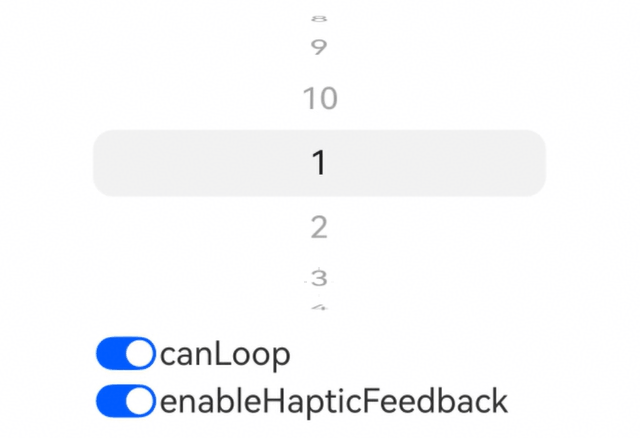
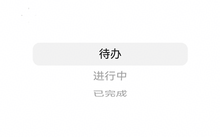
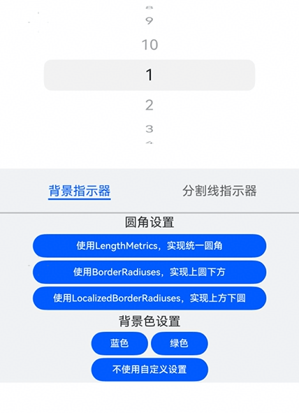
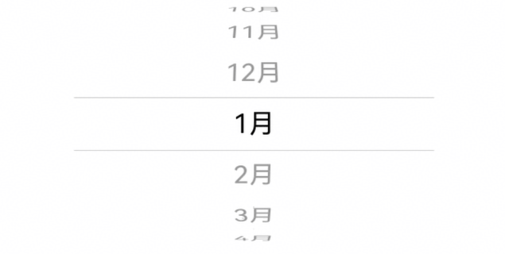
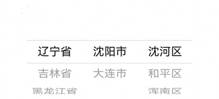
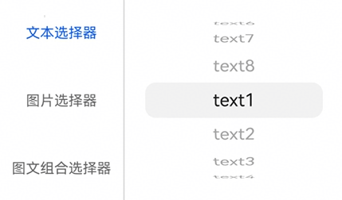
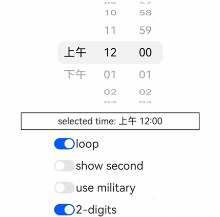

# UIPickerComponent
<!--Kit: ArkUI-->
<!--Subsystem: ArkUI-->
<!--Owner: @luoying_ace_admin-->
<!--Designer: @weixin_52725220-->
<!--Tester: @xiong0104-->
<!--Adviser: @Brilliantry_Rui-->

UIPickerComponent容器是用于实现用户选择操作的组件。它支持从一组有限的选项中让用户进行单选，可应用于时间选择、日期选择、地区选择、状态选择等多种场景。UIPickerComponent容器的显示效果为立体滚轮样式，支持选项按需定制，包括文本类型、图片类型和图文组合类型。

>  **说明：**
>
> - 该组件从API version 22开始支持。后续版本如有新增内容，则采用上角标单独标记该内容的起始版本。
>
> - UIPickerComponent容器的选项行高固定为40vp，最多可显示7个选项。由于显示效果为立体滚轮样式，因此除选中项外的其他选项会进行不同角度的旋转，实际的可视高度会小于40vp。
>
> - UIPickerComponent容器的[height](./ts-universal-attributes-size.md#height)建议设置为200vp。当设置的高度大于等于该建议值时，可完全显示7个选项；小于该建议值时，显示范围会从上下边缘向中间裁剪，可显示的选项数量也会相应减少，始终保持选中项垂直居中。
>
> - 当UIPickerComponent容器未设置[width](./ts-universal-attributes-size.md#width)时，取当前视图中可见子组件的最大宽度作为容器宽度。建议为UIPickerComponent容器设置宽度，或为每个子组件设置相同宽度，以避免滑动过程中容器宽度动态发生变化，影响显示效果。
>
> - UIPickerComponent容器的子组件的对齐方式固定为居中对齐，不支持通过[align](ts-universal-attributes-location.md#align)属性改变子组件的对齐方式。
>
> - UIPickerComponent容器当前不支持智能手表设备。

## 子组件

- 支持多个子组件。

- 支持子组件类型：[Text](./ts-basic-components-text.md)、[Image](./ts-basic-components-image.md)、[Row](./ts-container-row.md)和[SymbolGlyph](./ts-basic-components-symbolGlyph.md)。

- 支持渲染控制类型：[if/else](../../../ui/rendering-control/arkts-rendering-control-ifelse.md)和[ForEach](../../../ui/rendering-control/arkts-rendering-control-foreach.md)。

>  **说明：**
>
> - 开发者在使用Row容器作为子组件时，Row容器中仅支持包含Text、Image、SymbolGlyph基础组件，包含其他容器组件可能会影响显示效果或滑动功能异常。
>
> - 统计子组件的个数时，不包含Row容器内的子组件，Row容器及其子组件共同视为1个子组件。
>
> - 子组件为Text、Image、SymbolGlyph时，[height](./ts-universal-attributes-size.md#height)属性不生效，固定为40vp。
>
> - 子组件为Row容器时，Row容器的[height](./ts-universal-attributes-size.md#height)属性不生效，固定为40vp，Row容器内的子组件[height](./ts-universal-attributes-size.md#height)属性能正常生效，最终显示效果由Row容器决定。
>
> - 图文组合类型选项需要使用Row容器包含图片和文本组件。使用图文组合类型选项时，建议将图片的[height](./ts-universal-attributes-size.md#height)设置为40vp及以下，避免图片较大时被裁剪。
>
> - UIPickerComponent容器内所有文本组件（包括Row容器内的文本组件）的fontSize属性默认为20fp。用户设置将覆盖默认值，设置异常值时以文本组件[fontSize](./ts-basic-components-text.md#fontsize)处理的结果为准。建议统一设置或不设置fontSize以保证良好的显示效果。


## 接口

UIPickerComponent(options?: UIPickerComponentOptions)

创建UIPickerComponent容器，其选中项由options参数中的selectedIndex属性值决定。

**模型约束：** 此接口仅可在Stage模型下使用。

**原子化服务API：** 从API version 22开始，该接口支持在原子化服务中使用。

**系统能力：** SystemCapability.ArkUI.ArkUI.Full

**参数：**

| 参数名 | 类型 | 必填 | 说明 |
| -------- | -------- | -------- | -------- |
| options |  [UIPickerComponentOptions](#uipickercomponentoptions对象说明)| 否 | 配置UIPickerComponent容器的参数。 |

## UIPickerComponentOptions对象说明

UIPickerComponent容器的参数说明。

**模型约束：** 此接口仅可在Stage模型下使用。

**原子化服务API：** 从API version 22开始，该接口支持在原子化服务中使用。

**系统能力：** SystemCapability.ArkUI.ArkUI.Full

| 名称 | 类型 | 只读 | 可选 | 说明 |
| -------- | -------- | -------- | -------- | -------- |
| selectedIndex | number | 否 | 是 | 选中项的索引值。</br>取值范围：[0, 子组件的个数-1]内的整数。不在取值范围内时，使用默认值；设置小数时，使用向下取整后的整数。</br>默认值：0<br/>**说明：**<br/>统计子组件的个数时，不包含Row容器内的子组件，Row容器及其子组件共同视为1个子组件。 |

## 属性

除支持[通用属性](ts-component-general-attributes.md)外，还支持以下属性：

### canLoop

canLoop(isLoop: Optional\<boolean>)

设置选项列是否可循环滚动。

**模型约束：** 此接口仅可在Stage模型下使用。

**原子化服务API：** 从API version 22开始，该接口支持在原子化服务中使用。

**系统能力：** SystemCapability.ArkUI.ArkUI.Full

**参数：** 

| 参数名 | 类型    | 必填 | 说明                                                         |
| ------ | ------- | ---- | ------------------------------------------------------------ |
| isLoop  | [Optional](ts-universal-attributes-custom-property.md#optionalt12)\<boolean> | 是   | 是否可循环滚动。<br/>- true：可循环滚动。<br/>- false：不可循环滚动。<br/>默认值：true<br/>当isLoop的值为undefined时，使用默认值。<br/>如果子组件的个数小于8个，无论isLoop设置为true还是false，都不会循环滚动。 |

### enableHapticFeedback

enableHapticFeedback(enable: Optional\<boolean>)

设置是否开启触控反馈。

开启触控反馈时，需要在工程的src/main/module.json5文件的"module"内配置requestPermissions字段开启振动权限，配置如下：
``` json
"requestPermissions": [
   {
      "name": "ohos.permission.VIBRATE",
   }
]
```

**模型约束：** 此接口仅可在Stage模型下使用。

**原子化服务API：** 从API version 22开始，该接口支持在原子化服务中使用。

**系统能力：** SystemCapability.ArkUI.ArkUI.Full

**参数：**

| 参数名 | 类型                                          | 必填  | 说明                                                                                  |
| ------ | --------------------------------------------- |-----|-------------------------------------------------------------------------------------|
| enable  | [Optional](ts-universal-attributes-custom-property.md#optionalt12)\<boolean> | 是   | 设置是否开启触控反馈。<br/>- true：开启触控反馈。<br/>- false：不开启触控反馈。<br/>默认值：true<br/>当enable的值为undefined时，使用默认值。<br/>开启后，是否存在触控反馈取决于系统硬件支持情况。|

### selectionIndicator

selectionIndicator(style: Optional\<PickerIndicatorStyle>)

设置选中项指示器的样式。

**模型约束：** 此接口仅可在Stage模型下使用。

**原子化服务API：** 从API version 22开始，该接口支持在原子化服务中使用。

**系统能力：** SystemCapability.ArkUI.ArkUI.Full

**参数：** 

| 参数名 | 类型                                                         | 必填 | 说明                                                         |
| ------ | ------------------------------------------------------------ | ---- | ------------------------------------------------------------ |
| style  | [Optional](ts-universal-attributes-custom-property.md#optionalt12)\<[PickerIndicatorStyle](ts-container-ui-picker-component.md#pickerindicatorstyle对象说明)> | 是   | 选中项指示器的样式。<br/>默认值：<br/>{<br/>type: PickerIndicatorType.BACKGROUND,<br/>borderRadius: {<br/>value:12,<br/>unit:LengthUnit.vp<br/>},<br/>backgroundColor: 'sys.color.comp_background_tertiary'<br/>}<br/>当style的值为undefined时，使用默认值。|

## 事件

除支持[通用事件](ts-component-general-events.md)外，还支持以下事件：

### onChange

onChange(callback: Optional\<OnUIPickerComponentCallback>)

滑动选择器选项时，若选中项发生变化，触发该事件。

>  **说明：**
> 
> 如果某个选项有一半以上的区域进入选中项区域内，则该选项成为选中项。
> 
> 选中项区域可通过设置[selectionIndicator](#selectionindicator)进行标识。如果设置选中项指示器为背景，则背景区域即为选中项区域。如果设置选中项指示器为分割线，则上下分割线的中心线内的区域为选中项区域。

**模型约束：** 此接口仅可在Stage模型下使用。

**原子化服务API：** 从API version 22开始，该接口支持在原子化服务中使用。

**系统能力：** SystemCapability.ArkUI.ArkUI.Full

**参数：** 

| 参数名 | 类型                                       | 必填 | 说明                                              |
| ------ | ------------------------------------------ | ---- | ------------------------------------------------- |
| callback  | [Optional](ts-universal-attributes-custom-property.md#optionalt12)\<[OnUIPickerComponentCallback](#onuipickercomponentcallback)> | 是   | 当选中项发生变化时触发的回调函数。<br/>当callback的值为undefined时，不使用回调函数。 |

### onScrollStop

onScrollStop(callback: Optional\<OnUIPickerComponentCallback>)

选择器滑动停止时，触发该事件。选择器滑动停止指某次行为触发的滑动动画完全结束。如果某次滑动动画还未结束时又触发了新的滑动动画，则不属于滑动停止。

**模型约束：** 此接口仅可在Stage模型下使用。

**原子化服务API：** 从API version 22开始，该接口支持在原子化服务中使用。

**系统能力：** SystemCapability.ArkUI.ArkUI.Full

**参数：** 

| 参数名 | 类型                                       | 必填 | 说明                                              |
| ------ | ------------------------------------------ | ---- | ------------------------------------------------- |
| callback | [Optional](ts-universal-attributes-custom-property.md#optionalt12)\<[OnUIPickerComponentCallback](#onuipickercomponentcallback)> | 是   | 当选择器滑动停止时触发的回调函数。<br/>当callback的值为undefined时，不使用回调函数。 |

## PickerIndicatorStyle对象说明

选中项指示器样式的参数说明。

**模型约束：** 此接口仅可在Stage模型下使用。

**原子化服务API：** 从API version 22开始，该接口支持在原子化服务中使用。

**系统能力：** SystemCapability.ArkUI.ArkUI.Full

| 名称  | 类型   | 只读 | 可选 | 说明                                       |
| ----- | ------ | ---- | ---- | ------------------------------------------ |
| type  | [PickerIndicatorType](#pickerindicatortype枚举说明) | 否   | 否   | 选中项指示器的类型。<br/>默认值：PickerIndicatorType.BACKGROUND<br/>当type的值为小数时，使用向下取整后的整数；当type的值不在PickerIndicatorType枚举范围内时，使用默认值。 |
| strokeWidth |  [LengthMetrics](../js-apis-arkui-graphics.md#lengthmetrics12)      | 否   | 是   | 分割线的线宽。<br/>默认值：2.0px<br/>单位：与LengthMetrics一致。<br/>取值范围：[0, 选中项高度的一半（即20vp）]。strokeWidth小于0或大于选中项高度的一半时使用默认值。不支持“百分比”类型。<br/>**说明：**<br/>1. 当type为PickerIndicatorType.DIVIDER时生效。<br/>2. 通过LengthMetrics.resource方式设置时，使用非长度属性的值会按照0vp处理。  |
| dividerColor       | [ResourceColor](ts-types.md#resourcecolor) | 否   | 是   | 分割线的颜色。<br/>默认值：'sys.color.comp_divider'<br/>**说明：**<br/>当type为PickerIndicatorType.DIVIDER时生效。 |
| startMargin |  [LengthMetrics](../js-apis-arkui-graphics.md#lengthmetrics12)       | 否   | 是   | 分割线与UIPickerComponent容器侧边起始端的距离。<br/>默认值：0<br/>单位：与LengthMetrics一致。<br/>取值范围：startMargin与endMargin之和不得超过UIPickerComponent容器的宽度。设置小于0或startMargin与endMargin之和超过UIPickerComponent容器的宽度时，使用默认值。不支持“百分比”类型。<br/>**说明：**<br/>当type为PickerIndicatorType.DIVIDER时生效。 |
| endMargin   |  [LengthMetrics](../js-apis-arkui-graphics.md#lengthmetrics12)        | 否   | 是   | 分割线与UIPickerComponent容器侧边结束端的距离。<br/>默认值：0<br/>单位：与LengthMetrics一致。<br/>取值范围：startMargin与endMargin之和不得超过UIPickerComponent容器的宽度。设置小于0或startMargin与endMargin之和超过UIPickerComponent容器的宽度时，使用默认值。不支持“百分比”类型。<br/>**说明：**<br/>当type为PickerIndicatorType.DIVIDER时生效。 |
| backgroundColor  | [ResourceColor](ts-types.md#resourcecolor) | 否  | 是  | 选中项背景的颜色。<br/>默认值：'sys.color.comp_background_tertiary'<br/>**说明：**<br/>当type为PickerIndicatorType.BACKGROUND时生效。   |
| borderRadius  | [LengthMetrics](../js-apis-arkui-graphics.md#lengthmetrics12) &nbsp;\|&nbsp; [BorderRadiuses](ts-types.md#borderradiuses9) &nbsp;\|&nbsp; [LocalizedBorderRadiuses](ts-types.md#localizedborderradiuses12) | 否  | 是  | 选中项背景的边框圆角半径。<br/>默认值：{ value:12, unit:LengthUnit.vp }，即四个圆角半径均为12vp。<br/>取值范围：取选中项的宽和高之中较小的边长为x，最大不超过x的一半。当取值小于0时，使用默认值；当取值大于最大值时，使用最大值。<br/>**说明：**<br/>1. 当type为PickerIndicatorType.BACKGROUND时生效。<br/>2. [LengthMetrics](../js-apis-arkui-graphics.md#lengthmetrics12)：统一设置四个圆角半径的大小和单位。<br/>3. [BorderRadiuses](ts-types.md#borderradiuses9)：单独设置四个圆角半径的大小（单位为vp）。<br/>4. [LocalizedBorderRadiuses](ts-types.md#localizedborderradiuses12)：单独设置四个圆角半径的大小和单位。 |

## PickerIndicatorType枚举说明

设置选中项指示器的类型。

**模型约束：** 此接口仅可在Stage模型下使用。

**原子化服务API：** 从API version 22开始，该类型支持在原子化服务中使用。

**系统能力：** SystemCapability.ArkUI.ArkUI.Full

| 名称 | 值 | 说明 |
| -------- | - |-------- |
| BACKGROUND | 0 | 通过给选中项添加背景，标识选中项。|
| DIVIDER | 1 | 通过在选中项的上下边缘添加分割线，标识选中项。|

## OnUIPickerComponentCallback

type OnUIPickerComponentCallback = (selectedIndex: number) => void

定义[onChange](#onchange)和[onScrollStop](#onscrollstop)事件的回调类型。

**模型约束：** 此接口仅可在Stage模型下使用。

**原子化服务API：** 从API version 22开始，该接口支持在原子化服务中使用。

**系统能力：** SystemCapability.ArkUI.ArkUI.Full

**参数：** 

| 参数名     | 类型                                       | 必填 | 说明                                                         |
| ---------- | ------------------------------------------ | ---- | ------------------------------------------------------------ |
| selectedIndex | number | 是   | 当前选中项的索引值。</br>取值范围：[0, 子组件的个数-1]内的整数。 |

## 示例

### 示例1（切换循环滚动和开关触控反馈）

从API version 22开始，该示例通过点击按钮的方式实现切换UIPickerComponent容器的循环滚动和开启/关闭触控反馈功能。

```ts
// xxx.ets
@Entry
@Component
struct UIPickerComponentAttrsExample {
  private dataArray: string[] = [];
  @State loop: boolean = true;
  @State hapticFeedback: boolean = true;

  aboutToAppear(): void {
    // 构造选项数据
    for (let i = 1; i <= 10; i++) {
      this.dataArray.push(i.toString())
    }
  }

  build() {
    Column() {
      Row() {
        UIPickerComponent() {
          ForEach(this.dataArray, (item: string) => {
            Text(item)
          })
        }
        // 配置选项列表循环
        .canLoop(this.loop)
        // 配置触控音振反馈
        .enableHapticFeedback(this.hapticFeedback)
        .width('70%')
      }

      Column() {
        Row() {
          Toggle({ type: ToggleType.Switch, isOn: true })
            .onChange((isOn: boolean) => {
              this.loop = isOn;
            })
          Text('canLoop').fontSize(20)
        }
        .width('70%')

        Row() {
          Toggle({ type: ToggleType.Switch, isOn: true })
            .onChange((isOn: boolean) => {
              this.hapticFeedback = isOn;
            })
          Text('enableHapticFeedback').fontSize(20)
        }
        .width('70%')
      }

    }
    .width('100%')
  }
}
```



### 示例2（设置事件回调）

从API version 22开始，该示例基于状态选择，实现了UIPickerComponent容器的onChange和onScrollStop事件回调。

```ts
// xxx.ets
@Entry
@Component
struct UIPickerComponentEventsExample {
  // 构造状态选项数据
  private dataArray: string[] = ['待办', '进行中', '已完成'];
  @State onChangeDesc: string = '';
  @State onScrollStopDesc: string = '';

  build() {
    Column() {
      Row() {
        UIPickerComponent() {
          ForEach(this.dataArray, (item: string) => {
            Text(item)
          })
        }
        // 配置onChange事件回调
        .onChange((selectedIndex: number) => {
          this.onChangeDesc = 'on change: ' + selectedIndex
        })
        // 配置onScrollStop事件回调
        .onScrollStop((selectedIndex: number) => {
          this.onScrollStopDesc = 'on scroll stop: ' + selectedIndex
        })
        .width('70%')
      }

      Column() {
        Text(this.onChangeDesc)
        Text(this.onScrollStopDesc)
      }

    }
    .width('100%')
  }
}
```



### 示例3（设置选中项索引值）

从API version 22开始，该示例实现了设置UIPickerComponent容器的选中项索引值。

```ts
// xxx.ets
@Entry
@Component
struct UIPickerComponentSelectedIndexExample {
  private dataArray: string[] = [];
  @State selectedIndex: number = 0;

  aboutToAppear(): void {
    // 构造选项数据
    for (let i = 1; i <= 10; i++) {
      this.dataArray.push(i.toString())
    }
  }

  build() {
    Column() {
      Row() {
        UIPickerComponent({
          // 配置选中项索引值
          selectedIndex: this.selectedIndex
        }) {
          ForEach(this.dataArray, (item: string) => {
            Text(item)
          })
        }
        .onChange((selectedIndex: number) => {
          this.selectedIndex = selectedIndex
        })
        .onScrollStop((selectedIndex: number) => {
          this.selectedIndex = selectedIndex
        })
        .width('70%')
      }

      Column() {
        Text('selectedIndex: ' + this.selectedIndex)
      }

    }
    .width('100%')
  }
}
```


### 示例4（设置选中项指示器）

从API version 22开始，该示例实现了设置UIPickerComponent容器的选中项指示器。具体包括：在使用背景指示器时，设置背景颜色、背景圆角；在使用分割线指示器时，设置分割线颜色、分割线宽度、起始侧边距、结束侧边距。

```ts
// xxx.ets
import { LengthMetrics } from '@kit.ArkUI';

@Entry
@Component
struct UIPickerComponentIndicatorExample {
  private dataArray: string[] = [];
  @State indicatorType: PickerIndicatorType | undefined = undefined;
  @State bgColor: Color | undefined = undefined;
  @State dividerColor: Color | undefined = undefined;
  @State strokeWidth: LengthMetrics = LengthMetrics.px(2);
  @State startMargin: LengthMetrics = LengthMetrics.px(2);
  @State endMargin: LengthMetrics = LengthMetrics.px(2);
  @State selectIndicator: PickerIndicatorStyle | undefined = undefined;
  @State bgBorderRadius: LengthMetrics | BorderRadiuses | LocalizedBorderRadiuses | undefined = undefined
  bgBorderRadiuses1: LengthMetrics = LengthMetrics.vp(10)
  bgBorderRadiuses2: BorderRadiuses = {
    topLeft: 10,
    bottomLeft: 0,
    topRight: 10,
    bottomRight: 0,
  }
  bgBorderRadiuses3: LocalizedBorderRadiuses = {
    topStart: LengthMetrics.vp(0),
    bottomStart: LengthMetrics.vp(10),
    topEnd: LengthMetrics.vp(0),
    bottomEnd: LengthMetrics.vp(10)
  }
  private controller: TabsController = new TabsController();
  @State curTabIndex: number = 0;

  @Builder
  dividerBuilder() {
    Column() {
      Row() {
        Text('分割线线宽')
      }.margin(2)

      Row() {
        Button('0')
          .onClick(() => {
            this.strokeWidth = LengthMetrics.px(0)
          })
          .fontSize(12)
          .height(30)
          .width(100)
          .margin(2)
        Button('10px')
          .onClick(() => {
            this.strokeWidth = LengthMetrics.px(10)
          })
          .fontSize(12)
          .height(30)
          .width(100)
          .margin(2)
        Button('10vp')
          .onClick(() => {
            this.strokeWidth = LengthMetrics.vp(10)
          })
          .fontSize(12)
          .height(30)
          .width(100)
          .margin(2)
      }

      Row() {
        Text('起始侧边距')
      }.margin(2)

      Row() {
        Button('0')
          .onClick(() => {
            this.startMargin = LengthMetrics.px(0)
          })
          .fontSize(12)
          .height(30)
          .width(100)
          .margin(2)
        Button('10px')
          .onClick(() => {
            this.startMargin = LengthMetrics.px(10)
          })
          .fontSize(12)
          .height(30)
          .width(100)
          .margin(2)
        Button('10vp')
          .onClick(() => {
            this.startMargin = LengthMetrics.vp(10)
          })
          .fontSize(12)
          .height(30)
          .width(100)
          .margin(2)
      }

      Row() {
        Text('结束侧边距')
      }.margin(2)

      Row() {
        Button('0')
          .onClick(() => {
            this.endMargin = LengthMetrics.px(0)
          })
          .fontSize(12)
          .height(30)
          .width(100)
          .margin(2)
        Button('10px')
          .onClick(() => {
            this.endMargin = LengthMetrics.px(10)
          })
          .fontSize(12)
          .height(30)
          .width(100)
          .margin(2)
        Button('10vp')
          .onClick(() => {
            this.endMargin = LengthMetrics.vp(10)
          })
          .fontSize(12)
          .height(30)
          .width(100)
          .margin(2)
      }

      Row() {
        Text('分割线颜色')
      }

      Row() {
        Button('蓝色')
          .onClick(() => {
            this.dividerColor = Color.Blue
          })
          .fontSize(12)
          .height(30)
          .width(73)
          .margin(2)
        Button('黑色')
          .onClick(() => {
            this.dividerColor = Color.Black
          })
          .fontSize(12)
          .height(30)
          .width(73)
          .margin(2)
      }

      Row() {
        Button('不使用自定义设置')
          .onClick(() => {
            this.dividerColor = undefined
          })
          .fontSize(12)
          .height(30)
          .width(150)
          .margin(2)
      }
    }
  }

  @Builder
  backgroundBuilder() {
    Column() {
      Row() {
        Text('圆角设置')
      }.margin(2)

      Column() {
        Button('使用LengthMetrics，实现统一圆角')
          .onClick(() => {
            this.bgBorderRadius = this.bgBorderRadiuses1
          })
          .fontSize(12)
          .height(30)
          .width(300)
          .margin(2)
        Button('使用BorderRadiuses，实现上圆下方')
          .onClick(() => {
            this.bgBorderRadius = this.bgBorderRadiuses2
          })
          .fontSize(12)
          .height(30)
          .width(300)
          .margin(2)
        Button('使用LocalizedBorderRadiuses，实现上方下圆')
          .onClick(() => {
            this.bgBorderRadius = this.bgBorderRadiuses3
          })
          .fontSize(12)
          .height(30)
          .width(300)
          .margin(2)
      }.margin(2)

      Row() {
        Text('背景色设置')
      }.margin(2)

      Row() {
        Button('蓝色')
          .onClick(() => {
            this.bgColor = Color.Blue
          })
          .fontSize(12)
          .height(30)
          .width(73)
          .margin(2)
        Button('绿色')
          .onClick(() => {
            this.bgColor = Color.Green
          })
          .fontSize(12)
          .height(30)
          .width(73)
          .margin(2)
      }

      Row() {
        Button('不使用自定义设置')
          .onClick(() => {
            this.bgColor = undefined
          })
          .fontSize(12)
          .height(30)
          .width(150)
          .margin(2)
      }
    }
  }

  aboutToAppear(): void {
    // 构造选项数据
    for (let i = 1; i <= 10; i++) {
      this.dataArray.push(i.toString())
    }
  }

  build() {
    Column() {
      Row() {
        UIPickerComponent() {
          ForEach(this.dataArray, (item: string) => {
            Text(item)
          })
        }
        // 配置选中项指示器
        .selectionIndicator({
          type: this.indicatorType,
          strokeWidth: this.strokeWidth,
          dividerColor: this.dividerColor,
          startMargin: this.startMargin,
          endMargin: this.endMargin,
          backgroundColor: this.bgColor,
          borderRadius: this.bgBorderRadius
        })
        .width('70%')
      }
      Tabs({ barPosition: BarPosition.Start, index: this.curTabIndex, controller: this.controller }) {
        TabContent() {
          this.backgroundBuilder()
        }.tabBar('背景指示器')

        TabContent() {
          this.dividerBuilder()
        }.tabBar('分割线指示器')
      }
      .vertical(false)
      .barMode(BarMode.Fixed)
      .barWidth(360)
      .barHeight(56)
      .animationDuration(400)
      .onChange((index: number) => {
        this.curTabIndex = index
        if (this.curTabIndex == 1) {
          this.indicatorType = PickerIndicatorType.DIVIDER
        } else {
          this.indicatorType = PickerIndicatorType.BACKGROUND
        }
      })
      .height(LayoutPolicy.wrapContent)
      .divider({ strokeWidth: 2 })
      .margin({ top: 20 })
      .backgroundColor('#F1F3F5')
    }
    .width('100%')
  }
}
```



### 示例5（自定义月份选择器）

从API version 22开始，该示例使用UIPickerComponent容器嵌套文本子组件的方式实现月份选择器。

```ts
// xxx.ets
@Entry
@Component
struct MonthUIPickerComponentExample {
  private fontSize: number | string | Resource = '20vp';
  private monthArray: string[] = [];

  aboutToAppear(): void {
    // 构造选项数据
    for (let i = 1; i <= 12; i++) {
      this.monthArray.push(i + '月')
    }
  }

  build() {
    Column() {
      UIPickerComponent() {
        ForEach(this.monthArray, (item: string) => {
          Text(item)
            .fontSize(this.fontSize)
            .textAlign(TextAlign.Center)
            .fontColor(Color.Black)
        })
      }
      .width('70%')
      // 配置选项列表循环
      .canLoop(true)
      // 配置触控音振反馈为关闭
      .enableHapticFeedback(false)
      // 配置选中项的指示器标识为分割线
      .selectionIndicator({ type: PickerIndicatorType.DIVIDER })
      // 订阅选中项改变事件
      .onChange((idx: number) => {
        console.info('UIPickerComponent item changed: ' + this.monthArray[idx])
      })
      // 订阅滑动停止事件
      .onScrollStop((idx: number) => {
        console.info('UIPickerComponent scroll stopped: ' + this.monthArray[idx])
      })
    }
    .width('100%')
  }
}
```



### 示例6（自定义地区选择器）

从API version 22开始，该示例使用多列UIPickerComponent容器组合实现地区选择器。

```ts
// xxx.ets

type RegionDict = Record<string, Record<string, Array<string>>>;
// 定义地区字典
let regionData: RegionDict = {
  '辽宁省': {
    '沈阳市': ['沈河区', '和平区', '浑南区'],
    '大连市': ['中山区', '金州区', '长海县']
  },
  '吉林省': {
    '长春市': ['南关区', '宽城区', '朝阳区'],
    '四平市': ['铁西区', '铁东区', '梨树县']
  },
  '黑龙江省': {
    '哈尔滨市': ['道里区', '道外区', '南岗区'],
    '牡丹江市': ['东安区', '西安区', '爱民区']
  },
};

@Entry
@Component
struct RegionUIPickerComponentExample {
  @State provinceIndex: number = 0;
  @State cityIndex: number = 0;
  @State countyIndex: number = 0;
  @State provinces: Array<string> = [];
  @State cities: Array<string> = [];
  @State counties: Array<string> = [];

  aboutToAppear(): void {
    this.provinces = Object.keys(regionData);
    this.flushCityColumn()
  }

  flushCityColumn() {
    let currentProvince = this.provinces[this.provinceIndex]
    this.cities = Object.keys(regionData[currentProvince])
    this.cityIndex = 0
    this.flushCountyColumn()
  }

  flushCountyColumn() {
    let currentProvince = this.provinces[this.provinceIndex]
    let currentCity = this.cities[this.cityIndex]
    this.counties = regionData[currentProvince][currentCity]
    this.countyIndex = 0
  }

  build() {
    Column() {
      Row() {
        // 省级
        UIPickerComponent({
          selectedIndex: this.provinceIndex
        }) {
          ForEach(this.provinces, (province: string) => {
            Text(province)
          })
        }
        .onChange((selectedIndex: number) => {
          this.provinceIndex = selectedIndex
          this.flushCityColumn()

        })
        .onScrollStop((selectedIndex: number) => {
          this.provinceIndex = selectedIndex
        })
        .selectionIndicator({ type: PickerIndicatorType.DIVIDER })
        .width('25%')

        // 地级
        UIPickerComponent({
          selectedIndex: this.cityIndex
        }) {
          ForEach(this.cities, (city: string) => {
            Text(city)
          })
        }
        .onChange((selectedIndex: number) => {
          this.cityIndex = selectedIndex
          this.flushCountyColumn()
        })
        .onScrollStop((selectedIndex: number) => {
          this.cityIndex = selectedIndex
        })
        .selectionIndicator({ type: PickerIndicatorType.DIVIDER })
        .width('25%')

        // 县级
        UIPickerComponent({
          selectedIndex: this.countyIndex
        }) {
          ForEach(this.counties, (county: string) => {
            Text(county)
          })
        }
        .onChange((selectedIndex: number) => {
          this.countyIndex = selectedIndex
        })
        .onScrollStop((selectedIndex: number) => {
          this.countyIndex = selectedIndex
        })
        .selectionIndicator({ type: PickerIndicatorType.DIVIDER })
        .width('25%')
      }
    }
    .width('100%')
  }
}
```



### 示例7（自定义选项类型）

从API version 22开始，该示例使用UIPickerComponent容器实现不同选项类型的选择器，包含文本选择器、图片选择器、图文组合选择器。

```ts
// xxx.ets
@Entry
@Component
struct UIPickerComponentExample {
  @State textList: string[] =
    ['text1', 'text2', 'text3', 'text4', 'text5', 'text6', 'text7', 'text8'];
  // 以下$r('sys.media.*')资源文件需要替换为开发者所需的图像资源文件。
  @State imageList: Resource[] =
    [$r('sys.media.ohos_ic_normal_white_grid_audio'), $r('sys.media.ohos_ic_normal_white_grid_calendar'),
      $r('sys.media.ohos_ic_normal_white_grid_compress'), $r('sys.media.ohos_ic_normal_white_grid_doc'),
      $r('sys.media.ohos_ic_normal_white_grid_flac'), $r('sys.media.ohos_ic_normal_white_grid_folder'),
      $r('sys.media.ohos_ic_normal_white_grid_html'), $r('sys.media.ohos_ic_normal_white_grid_image')];
  // 以下$r('sys.symbol.*')资源文件需要替换为开发者所需的图像资源文件。
  @State symbolList: Resource[] =
    [$r('sys.symbol.calendar_01'), $r('sys.symbol.calendar_02'), $r('sys.symbol.calendar_03'),
      $r('sys.symbol.calendar_04'), $r('sys.symbol.calendar_05'), $r('sys.symbol.calendar_06'),
      $r('sys.symbol.calendar_07'), $r('sys.symbol.calendar_08')];
  private controller: TabsController = new TabsController();
  @State curTabIndex: number = 0;

  @Builder
  ImagePicker() {
    Column() {
      UIPickerComponent() {
        ForEach(this.imageList, (item: Resource) => {
          Image(item)
        })
      }
      .margin(20)
      .width(200)
    }
  }

  @Builder
  TextPicker() {
    Column() {
      UIPickerComponent() {
        ForEach(this.textList, (item: string) => {
          Text(item)
        })
      }
      .margin(20)
      .width(200)
    }
  }

  @Builder
  HybridPicker() {
    Column() {
      UIPickerComponent() {
        ForEach(this.symbolList, (item: Resource, index: number) => {
          Row() {
            SymbolGlyph(item)
              .height('20vp')
            Text(this.textList[index])
          }
        })
      }
      .margin(20)
      .width(200)
    }
  }

  build() {
    Column() {
      Tabs({ barPosition: BarPosition.Start, index: this.curTabIndex, controller: this.controller }) {
        TabContent() {
          this.TextPicker()
        }.tabBar('文本选择器')

        TabContent() {
          this.ImagePicker()
        }.tabBar('图片选择器')

        TabContent() {
          this.HybridPicker()
        }.tabBar('图文组合选择器')
      }
      .vertical(true)
      .divider({ strokeWidth: 1 })
      .barMode(BarMode.Fixed)
      .barWidth(140)
      .barHeight(230)
      .height(230)
      .animationDuration(400)
    }
  }
}
```



### 示例8（自定义时间选择器）

从API version 22开始，该示例实现了一个时间选择器，功能包含设置切换是否循环滚动、切换是否显示秒数、切换是否使用24小时制、切换是否显示前导0，还可按照当前系统语言显示对应语言的内容，并根据语言习惯调整各列的显示顺序。

> **说明：**
> - 该示例中，时间选择器的各列内容根据系统语言显示对应语言的内容，例如：英文系统显示AM/PM，中文系统显示上午/下午。
> - 该示例中，时间选择器的各列根据系统语言调整显示顺序，例如：英文系统显示时/分/秒/AMPM，中文系统显示上下午/时/分/秒。

为实现"上下午"随系统语言切换，需要在工程的resource目录下添加对应语言的翻译，例如：
- 中文（默认）：在resource目录下创建base目录，在base目录下创建element目录，在element目录添加string.json文件（若文件已存在，请在文件中追加以下"name"-"value"键值对，请勿直接覆盖原文件）。文件内容如下：
    ```json
    {
      "string": [
        {
          "name": "app_name",
          "value": "timePicker"
        },
        {
          "name": "am",
          "value": "上午"
        },
        {
          "name": "pm",
          "value": "下午"
        }
      ]
    }
    ```
- 英文：在resource目录下创建en目录，在en目录下创建element目录，在element目录添加string.json文件（若文件已存在，请在文件中追加以下"name"-"value"键值对，请勿直接覆盖原文件）。文件内容如下：
    ```json
    {
      "string": [
        {
          "name": "app_name",
          "value": "timePicker"
        },
        {
          "name": "am",
          "value": "AM"
        },
        {
          "name": "pm",
          "value": "PM"
        }
      ]
    }
    ```
- 阿拉伯语：在resource目录下创建ar目录，在ar目录下创建element目录，在element目录下添加string.json文件（若文件已存在，请在文件中追加以下"name"-"value"键值对，请勿直接覆盖原文件）。文件内容如下：
    ```json
    {
      "string": [
        {
          "name": "app_name",
          "value": "timePicker"
        },
        {
          "name": "am",
          "value": "ص"
        },
        {
          "name": "pm",
          "value": "م"
        }
      ]
    }
    ```
- 其他语言依此类推。

示例代码如下：
```ts
// xxx.ets
import { LengthMetrics } from '@kit.ArkUI';
import { i18n, intl } from '@kit.LocalizationKit';
import { commonEventManager } from '@kit.BasicServicesKit';

@Entry
@Component
struct TimeUIPickerComponentExample {
  @State showSecond: boolean = false;
  @State useMilitary: boolean = false;
  @State zeroPrefix: boolean = true;
  @State loop: boolean = true;
  @State amPmAtLast: boolean = false
  @State isRtl: boolean = false;

  startBorderStyle: LocalizedBorderRadiuses = {
    topStart: LengthMetrics.px(40),
    bottomStart: LengthMetrics.px(40),
    topEnd: LengthMetrics.px(0),
    bottomEnd: LengthMetrics.px(0)
  }
  centerBorderStyle: LengthMetrics = LengthMetrics.px(0)
  endBorderStyle: LocalizedBorderRadiuses = {
    topStart: LengthMetrics.px(0),
    bottomStart: LengthMetrics.px(0),
    topEnd: LengthMetrics.px(40),
    bottomEnd: LengthMetrics.px(40)
  }
  @State amPmBorder: LengthMetrics | LocalizedBorderRadiuses = this.startBorderStyle;
  @State hourBorder: LengthMetrics | LocalizedBorderRadiuses = this.startBorderStyle;
  @State minBorder: LengthMetrics | LocalizedBorderRadiuses = this.endBorderStyle;
  @State secBorder: LengthMetrics | LocalizedBorderRadiuses = this.endBorderStyle;

  @State amPmIndex: number = 0;
  @State hourIndex: number = 0;
  @State minIndex: number = 0;
  @State secIndex: number = 0;

  @State amPmArr: Array<string| undefined> = []
  @State hourArr: Array<string> = []
  @State minSecArr: Array<string> = []

  @State currentTime: string = '';

  sysLanguageChanged: boolean = false
  zero: string = '0'
  systemLanguage: string = i18n.System.getSystemLanguage();
  // 使用系统当前区域ID创建NumberFormat对象
  formatter: intl.NumberFormat = new intl.NumberFormat();

  aboutToAppear(): void {
    this.zero = this.formatter.format(0)
    this.flushAmPmColumn()
    this.flushHourColumn()
    this.flushMinSecColumn()
    this.flushCurrentTime()
    this.flushBorderStyle()
    let subscriber: commonEventManager.CommonEventSubscriber;
    let subscribeInfo: commonEventManager.CommonEventSubscribeInfo = {
      events: [commonEventManager.Support.COMMON_EVENT_LOCALE_CHANGED]
    };
    // 创建订阅者，监听系统语言变化
    commonEventManager.createSubscriber(subscribeInfo)
      .then((commonEventSubscriber: commonEventManager.CommonEventSubscriber) => {
        console.info("CreateSubscriber");
        subscriber = commonEventSubscriber;
        commonEventManager.subscribe(subscriber, (err, data) => {
          if (err) {
            console.error(`Failed to subscribe common event. error code: ${err.code}, message: ${err.message}.`);
            return;
          }
          this.formatter = new intl.NumberFormat();
          this.zero = this.formatter.format(0)
          this.sysLanguageChanged = true
          this.systemLanguage = i18n.System.getSystemLanguage();
          this.flushAmPmColumn()
          this.flushHourColumn()
          this.flushMinSecColumn()
          this.flushCurrentTime()
          this.flushBorderStyle()
        })
      })
      .catch((err: BusinessError) => {
        console.error(`CreateSubscriber failed, code is ${err.code}, message is ${err.message}`);
      });
  }

  onPageShow(): void {
    if (this.sysLanguageChanged) {
      this.flushAmPmColumn()
      this.flushCurrentTime()
      this.flushBorderStyle()
      this.sysLanguageChanged = false
    }
  }

  buildColumnOptions(start: number, end: number, isHour: boolean = false) : string[] {
    let newOptions: string[] = []
    for (let i = start; i <= end; i++) {
      if (isHour && i == 0 && !this.useMilitary) {
        newOptions.push(this.formatter.format(12))
        continue
      }
      if (this.zeroPrefix) {
        newOptions.push(this.formatTime(i))
      } else {
        newOptions.push(this.formatter.format(i))
      }
    }
    return newOptions
  }

  flushAmPmColumn() {
    // 根据语言习惯设置amPm列是否放在最后
    if (this.systemLanguage.startsWith('en') || this.systemLanguage == 'ug') {
      this.amPmAtLast = true
    } else {
      this.amPmAtLast = false
    }
    this.amPmArr[0] = this.getUIContext().getHostContext()?.resourceManager.getStringSync($r('app.string.am').id)
    this.amPmArr[1] = this.getUIContext().getHostContext()?.resourceManager.getStringSync($r('app.string.pm').id)
  }

  flushHourColumn() {
    if (this.useMilitary) {
      this.hourArr = this.buildColumnOptions(0, 23)
    } else {
      this.hourArr = this.buildColumnOptions(0, 11, true)
    }
  }

  flushMinSecColumn() {
    this.minSecArr = this.buildColumnOptions(0, 59)
  }

  flushBorderStyle() {
    let realStartBorder = this.startBorderStyle
    let realEndBorder = this.endBorderStyle
    // 根据语言习惯设置镜像语言的时间顺序
    if (this.systemLanguage == 'ar' || this.systemLanguage == 'ug') {
      this.isRtl = true
      realStartBorder = this.endBorderStyle
      realEndBorder = this.startBorderStyle
    } else {
      this.isRtl = false
    }
    if (!this.useMilitary) {
      if (this.amPmAtLast) {
        this.amPmBorder = realEndBorder
        this.hourBorder = realStartBorder
        this.minBorder = this.centerBorderStyle
        this.secBorder = this.centerBorderStyle
      } else {
        this.amPmBorder = realStartBorder
        this.hourBorder = this.centerBorderStyle
        if (this.showSecond) {
          this.minBorder = this.centerBorderStyle
        } else {
          this.minBorder = realEndBorder
        }
        this.secBorder = realEndBorder
      }
    } else {
      this.hourBorder = realStartBorder
      if (this.showSecond) {
        this.minBorder = this.centerBorderStyle
      } else {
        this.minBorder = realEndBorder
      }
      this.secBorder = realEndBorder
    }
  }

  formatTime(time: number): string {
    if (time < 10) {
      return this.zero + this.formatter.format(time)
    }
    return this.formatter.format(time)
  }

  @Builder
  buildAmPmColumn() {
    UIPickerComponent({ selectedIndex: this.amPmIndex }) {
      ForEach(this.amPmArr, (amPm: string) => {
        Text(amPm)
      })
    }
    .width('200px')
    .canLoop(this.loop)
    .selectionIndicator({
      type: PickerIndicatorType.BACKGROUND,
      borderRadius: this.amPmBorder
    })
    .onChange((selectedIndex: number) => {
      this.amPmIndex = selectedIndex
      this.flushCurrentTime()
    })
    .onScrollStop((selectedIndex: number) => {
      this.amPmIndex = selectedIndex
      this.flushCurrentTime()
    })
  }

  @Builder
  buildHourColumn() {
    UIPickerComponent({ selectedIndex: this.hourIndex }) {
      ForEach(this.hourArr, (hour: string) => {
        Text(hour)
      })
    }
    .width('200px')
    .canLoop(this.loop)
    .selectionIndicator({
      type: PickerIndicatorType.BACKGROUND,
      borderRadius: this.hourBorder
    })
    .onChange((selectedIndex: number) => {
      this.hourIndex = selectedIndex
      this.flushCurrentTime()
    })
    .onScrollStop((selectedIndex: number) => {
      this.hourIndex = selectedIndex
      this.flushCurrentTime()
    })
  }

  @Builder
  buildMinColumn() {
    UIPickerComponent({ selectedIndex: this.minIndex }) {
      ForEach(this.minSecArr, (min: string) => {
        Text(min)
      })
    }
    .width('200px')
    .canLoop(this.loop)
    .selectionIndicator({
      type: PickerIndicatorType.BACKGROUND,
      borderRadius: this.minBorder
    })
    .onChange((selectedIndex: number) => {
      this.minIndex = selectedIndex
      this.flushCurrentTime()
    })
    .onScrollStop((selectedIndex: number) => {
      this.minIndex = selectedIndex
      this.flushCurrentTime()
    })
  }

  @Builder
  buildSecColumn() {
    UIPickerComponent({ selectedIndex: this.secIndex }) {
      ForEach(this.minSecArr, (sec: string) => {
        Text(sec)
      })
    }
    .width('200px')
    .canLoop(this.loop)
    .selectionIndicator({
      type: PickerIndicatorType.BACKGROUND,
      borderRadius: this.secBorder
    })
    .onChange((selectedIndex: number) => {
      this.secIndex = selectedIndex
      this.flushCurrentTime()
    })
    .onScrollStop((selectedIndex: number) => {
      this.secIndex = selectedIndex
      this.flushCurrentTime()
    })
  }

  flushCurrentTime() {
    this.currentTime = ''
    if (!this.useMilitary) {
      this.currentTime += this.amPmArr[this.amPmIndex] + ' '
    }
    this.currentTime += this.hourArr[this.hourIndex] + ':' + this.minSecArr[this.minIndex]
    if (this.showSecond) {
      this.currentTime += ':' + this.minSecArr[this.secIndex]
    }
  }

  build() {
    Column() {
      Row() {
        // 根据镜像语言显示顺序创建column
        if (!this.isRtl) {
          if (!this.useMilitary && !this.amPmAtLast) {
            this.buildAmPmColumn()
            this.buildHourColumn()
          } else {
            this.buildHourColumn()
          }
          this.buildMinColumn()
          if (this.showSecond) {
            this.buildSecColumn()
          }
          if (!this.useMilitary && this.amPmAtLast) {
            this.buildAmPmColumn()
          }
        } else {
          if (!this.useMilitary && this.amPmAtLast) {
            this.buildAmPmColumn()
          }
          if (this.showSecond) {
            this.buildSecColumn()
          }
          this.buildMinColumn()
          if (!this.useMilitary && !this.amPmAtLast) {
            this.buildHourColumn()
            this.buildAmPmColumn()
          } else {
            this.buildHourColumn()
          }
        }
      }

      Row() {
        Text('selected time: ' + this.currentTime)
          .margin(5)
          .width("80%")
          .textAlign(TextAlign.Center)
      }
      .border({ width: 1 })
      .margin(5)

      Column() {
        Row() {
          Toggle({ type: ToggleType.Switch, isOn: true })
            .onChange((isOn: boolean) => {
              this.loop = isOn;
            })
          Text('loop').fontSize(20)
        }.width(200).margin(5)
        Row() {
          Toggle({ type: ToggleType.Switch, isOn: false })
            .onChange((isOn: boolean) => {
              this.showSecond = isOn
              this.flushCurrentTime()
              this.flushBorderStyle()
            })
          Text('show second').fontSize(20)
        }.width(200).margin(5)
        Row() {
          Toggle({ type: ToggleType.Switch, isOn: false })
            .onChange((isOn: boolean) => {
              this.useMilitary = isOn
              if (this.useMilitary) {
                if (this.amPmIndex) {
                  this.hourIndex += 12
                }
              } else {
                if (this.hourIndex >= 12) {
                  this.amPmIndex = 1
                  this.hourIndex -= 12
                } else {
                  this.amPmIndex = 0
                }
              }
              this.flushBorderStyle()
              this.flushHourColumn()
              this.flushCurrentTime()
            })
          Text('use military').fontSize(20)
        }.width(200).margin(5)
        Row() {
          Toggle({ type: ToggleType.Switch, isOn: true })
            .onChange((isOn: boolean) => {
              this.zeroPrefix = isOn
              this.flushHourColumn()
              this.flushMinSecColumn()
              this.flushCurrentTime()
            })
          Text('2-digits').fontSize(20)
        }.width(200).margin(5)
      }
    }
    .width('100%')
  }
}
```


