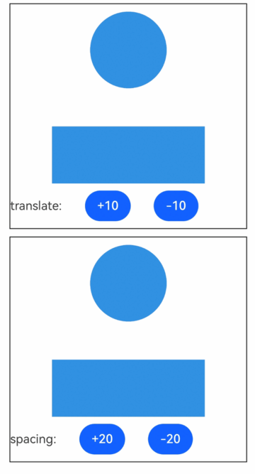

# UnionEffectContainer (系统接口)
<!--Kit: ArkUI-->
<!--Subsystem: ArkUI-->
<!--Owner: @hehongyang3-->
<!--Designer: @CCFFWW-->
<!--Tester: @lxl007-->
<!--Adviser: @Brilliantry_Rui-->
 	 
形状融合容器，会收集该容器内所有[使用祖先融合效果](ts-universal-attributes-use-union-effect-sys.md#useunioneffect)的后代组件形状，将收集的形状融合生效在容器上，作为该容器的绘制形状。
 	 
>  **说明：**
>
> - 该组件从API version 23开始支持。后续版本如有新增内容，则采用上角标单独标记该内容的起始版本。
>
> - 本模块为系统接口。
> 
> - 形状融合过程可以添加动画。
 	 
## 子组件

可以包含子组件。

## 接口

### UnionEffectContainer

UnionEffectContainer(options?: UnionEffectContainerOptions)

创建形状融合容器组件。

**系统接口：** 此接口为系统接口。

**模型约束：** 此接口仅可在Stage模型下使用。

**系统能力：** SystemCapability.ArkUI.ArkUI.Full

**参数:**

| 参数名            | 类型        | 必填   | 说明                                     |
| -------------- | ---------------------------------------- | ---- |  ---------------------------------------- |
| options      | [UnionEffectContainerOptions](#unioneffectcontaineroptions对象说明) | 否    |  UnionEffectContainer构造参数，用于决定收集到的后代组件形状的融合程度。<br/>默认值：{spacing:0}               |

## UnionEffectContainerOptions对象说明

设置UnionEffectContainer构造参数。

**系统接口：** 此接口为系统接口。

**模型约束：** 此接口仅可在Stage模型下使用。

**系统能力：** SystemCapability.ArkUI.ArkUI.Full

| 名称        | 类型                                    | 只读 | 可选 | 说明                                                     |
| ----------- | --------------------------------------- | ---- | ---------- | ---------------------------------------------- |
| spacing | number | 否 | 是  | spacing表示后代组件发生融合形变的程度。它不代表实际的间距，只有设置了使用祖先组件UnionEffectContainer融合效果的后代组件且后代组件靠近到一定程度时才会发生融合。<br/>**说明：**<br/>设置的spacing大于0，且设置了祖先组件UnionEffectContainer融合效果的后代组件彼此靠近到一定程度，这些后代组件会开始相互融合形变，且随着距离的变近融合形变的效果越强。该值越大，后代组件彼此靠近时，它们的融合会越早开始，越容易发生融合形变。<br/>默认值：0，此时子组件形状会融合在一起，但不会有形变效果。<br/>取值范围：[0, +∞)。小于0时按0处理。 |

## 事件

支持通用事件。

## 属性

支持通用属性，支持宽高设置。

> **说明：**
>
> - 融合过程中容器会变成粘连的非线性形变效果，边框会变成融合后的粘连效果，故与边框相关的能力会受到影响。目前与边框相关支持融合形变效果的属性：边框[border](ts-universal-attributes-border.md#border)、外边框[outline](ts-universal-attributes-outline.md#outline)、阴影[shadow](ts-universal-attributes-image-effect.md#shadow)、背景色[backgroundColor](ts-universal-attributes-background.md#backgroundcolor)、点光源[pointLight](#pointlight)。上述效果会绘制在融合后的形状上，属于UnionEffectContainer的绘制部分。
>
> - 在该组件上设置上述与边框相关支持融合形变效果的属性，绘制体现在该组件上，如果后代组件设置了同一个属性，实际上两个属性的设置相互独立，会绘制两次，一次发生在UnionEffectContainer控件的绘制中，一次发生在后代组件自身的属性绘制中。通常情况下不需要在使用祖先组件UnionEffectContainer融合效果的后代组件中设置同一个支持融合形变效果的属性，避免融合效果劣化。

### pointLight

pointLight(value: PointLightStyle)

设置点光源样式。

**系统接口：** 此接口为系统接口。

**模型约束：** 此接口仅可在Stage模型下使用。

**系统能力：** SystemCapability.ArkUI.ArkUI.Full

**参数：** 

| 参数名 | 类型                                                         | 必填 | 说明         |
| ------ | ------------------------------------------------------------ | ---- | ------------ |
| value  | [PointLightStyle](ts-universal-attributes-point-light-style-sys.md#pointlightstyle) | 是   | 点光源样式。 |

## 示例

### 示例1（设置产生融合形变效果）

该示例主要演示如何使用[UnionEffectContainer](#unioneffectcontainer)组件，通过改变spacing值或后代组件的距离，产生融合形变效果。

```ts
//UnionEffectContainerPage.ets
@Entry
@Component
struct UnionEffectContainerPage {
  @State spacing: number = 0;
  @State translateY: number = 0;

  build() {
    Column() {
      Column() {
        UnionEffectContainer({ spacing: 10 }) {
          Column({ space: 50 }) {
            Column()
              .width(100)
              .height(100)
              .margin({ top: 10 })
              .borderRadius(50)
              .useUnionEffect(true)//设置useUnionEffect属性，使用融合效果
              .translate({ y: this.translateY })

            Column()
              .width(200)
              .height(100)
              .useUnionEffect(true)
          }
          .width('100%')
        }
        .width('100%')
        .height('80%')
        .backgroundColor("#2787d9") // 设置融合效果支持的属性，如背景色

        Row({ space: 30 }) {
          Text("translate:")
          Button('+10')
            .onClick(() => {
              this.getUIContext().animateTo({ duration: 200 }, () => {
                this.translateY += 10; // 改变后代组件的距离
              });
            })
          Button('-10')
            .onClick(() => {
              this.getUIContext().animateTo({ duration: 200 }, () => {
                this.translateY -= 10; // 改变后代组件的距离
              });
            })
        }
        .width('100%')
        .height('20%')
      }.width('90%')
      .height('40%')
      .borderWidth(1)
      .margin({ top: 10 })

      Column() {
        UnionEffectContainer({ spacing: this.spacing }) {
          Column({ space: 50 }) {
            Column()
              .width(100)
              .height(100)
              .margin({ top: 10 })
              .borderRadius(50)
              .useUnionEffect(true) //设置useUnionEffect属性，使用融合效果

            Column()
              .width(200)
              .height(100)
              .useUnionEffect(true)
          }
          .width('100%')
        }
        .width('100%')
        .height('80%')
        .backgroundColor("#2787d9") // 设置融合效果支持的属性，如背景色

        Row({ space: 30 }) {
          Text("spacing:")
          Button('+20')
            .onClick(() => {
              this.getUIContext().animateTo({ duration: 200 }, () => {
                this.spacing += 20; // 改变后代组件的距离
              });
            })
          Button('-20')
            .onClick(() => {
              if (this.spacing <= 0 && this.spacing - 20 < 0) {
                return;
              }
              this.getUIContext().animateTo({ duration: 200 }, () => {
                this.spacing -= 20; // 改变后代组件的距离
                if (this.spacing < 0) {
                  this.spacing = 0;
                }
              });
            })
        }
        .width('100%')
        .height('20%')
      }.width('90%')
      .height('40%')
      .borderWidth(1)
      .margin({ top: 10 })
    }.width('100%')
    .height('100%')
  }
}
```

