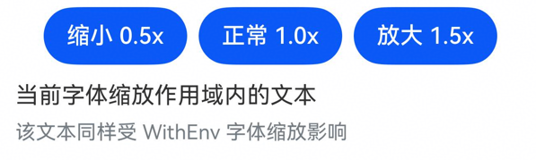
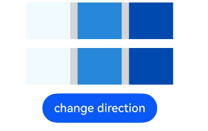

# WithEnv：环境变量容器
<!--Kit: ArkUI-->
<!--Subsystem: ArkUI-->
<!--Owner: @song-song-song-->
<!--Designer: @fenglinbailu-->
<!--Tester: @khq-->
<!--Adviser: @zhang_yixin13-->

WithEnv组件用于为子组件树设置局部环境变量作用域。开发者可以通过该组件为后代组件提供自定义环境变量，或设置系统环境变量。

**起始版本：** 26.0.0

> **说明：**
>
> - 此接口仅可在Stage模型下使用。
> - 可通过[customEnv](#customenv)设置自定义环境变量。
> - 支持通过[env](#env)设置的系统环境变量键，系统环境变量键存于[WritableEnvKey](ts-env-system-property.md#writableenvkey)。
> - WithEnv嵌套时，同名环境变量按最近作用域生效。

## 子组件

支持单个子组件。

## 接口

WithEnv()

设置局部环境变量作用域容器。

**起始版本：** 26.0.0

**原子化服务API（仅ArkTS-Dyn）：** 从API版本26.0.0开始，该接口支持在原子化服务中使用。

**系统能力：** SystemCapability.ArkUI.ArkUI.Full

**模型约束**：此接口仅可在Stage模型下使用。

## 属性

支持以下WithEnv专有属性。

### env

env&lt;T&gt;(key: WritableSystemEnvKey&lt;T&gt;, value: T)

设置作用域内的系统环境变量。当前正式支持的系统环境变量键为WritableEnvKey.FONT_SCALE、WritableEnvKey.DIRECTION。

> **说明：**
>
> - `WithEnv.env(WritableEnvKey.FONT_SCALE, value)`用于为尾随闭包里的作用域内组件提供局部字体缩放比例，`value`为number类型，表示字体缩放倍数。设置的`value`小于0时按0处理。
> - WithEnv尾随闭包里的作用域内组件实际生效的字体缩放值同时受env属性通过键WritableEnvKey.FONT_SCALE设置的值与组件自身的字体缩放限制共同作用。该限制可通过组件的`minFontScale`和`maxFontScale`属性设置，也可通过应用配置中的[fontSizeMaxScale](../../../quick-start/app-configuration-file.md)等全局配置生效。最终生效值为WritableEnvKey.FONT_SCALE设置值在各限制范围内的取值。

**起始版本：** 26.0.0

**原子化服务API（仅ArkTS-Dyn）：** 从API版本26.0.0开始，该接口支持在原子化服务中使用。

**系统能力：** SystemCapability.ArkUI.ArkUI.Full

**模型约束**：此接口仅可在Stage模型下使用。

**参数：**

| 参数名 | 类型 | 必填 | 说明 |
| ----- | ----- | ---- | ---- |
| key | [WritableSystemEnvKey&lt;T&gt;](ts-env-system-property.md#writablesystemenvkeyt) | 是 | 系统环境变量键。当前正式支持WritableEnvKey.FONT_SCALE和WritableEnvKey.DIRECTION。 |
| value | T | 是 | 系统环境变量值。value的类型T对应WritableSystemEnvKey&lt;T&gt;中的类型T。当`key`为`WritableEnvKey.FONT_SCALE`时，`value`类型为number。当`key`为`WritableEnvKey.DIRECTION`时，`value`类型为Direction。 |

### customEnv

customEnv&lt;T&gt;(key: CustomEnvKey&lt;T&gt;, value: T)

设置作用域内可被后代自定义组件读取的自定义环境变量。

**起始版本：** 26.0.0

**原子化服务API（仅ArkTS-Dyn）：** 从API版本26.0.0开始，该接口支持在原子化服务中使用。

**系统能力：** SystemCapability.ArkUI.ArkUI.Full

**模型约束**：此接口仅可在Stage模型下使用。

**参数：**

| 参数名 | 类型 | 必填 | 说明 |
| ----- | ----- | ---- | ---- |
| key | [CustomEnvKey](ts-custom-env-property.md#customenvkeys)&lt;T&gt; | 是 | 自定义环境变量的键。 |
| value | T | 是 | 自定义环境变量的值。value的类型T对应CustomEnvKey&lt;T&gt;的类型T。 |


## 事件

不支持[通用事件](ts-component-general-events.md)。

## 示例

### 示例1（设置局部字体缩放）

该示例通过`env(WritableEnvKey.FONT_SCALE, value)`为作用域内组件设置局部字体缩放比例。

从API版本26.0.0开始，新增env属性和键值WritableEnvKey.FONT_SCALE。

```ts
// xxx.ets
import { WithEnv } from '@kit.ArkUI';
@Entry
@Component
struct WithEnvExample1 {
  @State fontScale: number = 1.0;

  build() {
    Column({ space: 12 }) {
      Row({ space: 8 }) {
        Button('缩小 0.5x')
          .onClick(() => {
            this.fontScale = 0.5;
          })
        Button('正常 1.0x')
          .onClick(() => {
            this.fontScale = 1.0;
          })
        Button('放大 1.5x')
          .onClick(() => {
            this.fontScale = 1.5;
          })
      }

      WithEnv() {
        Column({ space: 8 }) {
          Text('当前字体缩放作用域内的文本')
            .fontSize(16)
          Text('该文本同样受 WithEnv 字体缩放影响')
            .fontSize(14)
            .fontColor('#99182431')
        }
        .width('100%')
        .alignItems(HorizontalAlign.Start)
      }
      .env(WritableEnvKey.FONT_SCALE, this.fontScale) // 设置局部字体缩放比例
    }
    .padding(12)
    .width('100%')
  }
}
```



### 示例2（设置局部布局方向）

该示例通过`env(WritableEnvKey.DIRECTION, value)`为作用域内组件设置局部布局方向。

从API版本26.0.0开始，新增env属性和键值WritableEnvKey.DIRECTION。


```ts
// xxx.ets
import { WithEnv } from '@kit.ArkUI';

@Entry
@Component
struct WithEnvExample2 {
  @State directionValue: Direction = Direction.Ltr;

  build() {
    Column({ space: 12 }) {
      Row({ space: 10 }) {
        Column().backgroundColor('#F0FAFF').width(60).height('100%')
        Column().backgroundColor('#2787D9').width(60).height('100%')
        Column().backgroundColor('#004AAF').width(60).height('100%')

      }.backgroundColor('#D5D5D5').width(200).height(50)

      WithEnv() {
        Row({ space: 10 }) {
          Column().backgroundColor('#F0FAFF').width(60).height('100%')
          Column().backgroundColor('#2787D9').width(60).height('100%')
          Column().backgroundColor('#004AAF').width(60).height('100%')

        }.backgroundColor('#D5D5D5').width(200).height(50)
      }
      .env(WritableEnvKey.DIRECTION, this.directionValue) // 设置局部布局方向

      Button('change direction').onClick(() => {
        if (this.directionValue === Direction.Ltr) {
          this.directionValue = Direction.Rtl;
        } else {
          this.directionValue = Direction.Ltr;
        }
      })
    }
    .width('80%')
    .height('30%')
  }
}
```

