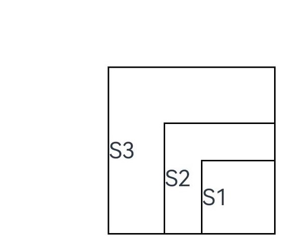
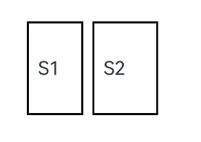
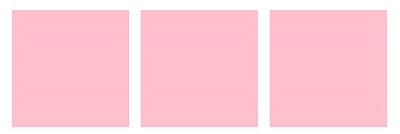
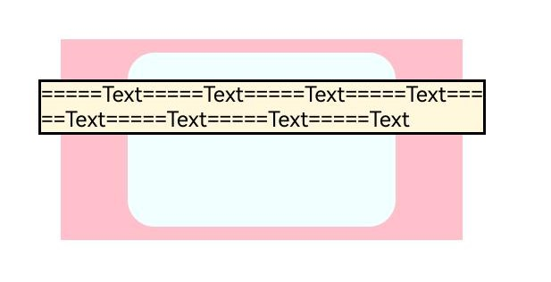

# 自定义组件的自定义布局
<!--Kit: ArkUI-->
<!--Subsystem: ArkUI-->
<!--Owner: @song-song-song-->
<!--Designer: @lanshouren-->
<!--Tester: @liuli0427-->
<!--Adviser: @Brilliantry_Rui-->

自定义组件的自定义布局允许开发者通过onMeasureSize和onPlaceChildren接口，以数据计算的方式精确控制子组件的位置和尺寸，实现更灵活的布局效果。适用于需要实现复杂非标准布局、内置布局组件无法满足特定排列需求、需要根据动态数据计算子组件位置和尺寸等场景。

> **说明：**
>
> 本模块首批接口从API version 9开始支持，后续版本的新增接口，采用上角标单独标记接口的起始版本。
>
> 在自定义组件内实现onMeasureSize、onPlaceChildren任一方法即视为实现自定义布局。onMeasureSize负责测量并返回自定义组件的尺寸，onPlaceChildren负责布局子组件的位置。为实现完整的自定义布局效果，推荐同时实现两种方法：onMeasureSize确定组件尺寸后，onPlaceChildren才能根据该尺寸正确布局子组件。具体参数说明请参见对应接口的详细描述。
>
> 从API version 20开始，在自定义布局的自定义组件中，子组件若设置了[LayoutPolicy](./ts-universal-attributes-size.md#layoutpolicy15)对象的fixAtIdealSize属性，表示尺寸将不受父组件约束，完全按照开发者自定义的尺寸范围布局。
> 
> 自定义布局内不支持使用懒加载(包含[Repeat](../../../ui/rendering-control/arkts-new-rendering-control-repeat.md)和[LazyForEach](../../../ui/rendering-control/arkts-rendering-control-lazyforeach.md))。

## onMeasureSize<sup>10+</sup>

onMeasureSize?(selfLayoutInfo: GeometryInfo, children: Array&lt;Measurable&gt;, constraint: ConstraintSizeOptions): SizeResult

ArkUI（方舟UI框架）会在自定义组件确定尺寸时，将该自定义组件的节点信息和尺寸范围通过onMeasureSize传递给开发者。不允许在onMeasureSize函数中改变状态变量。

> **说明：**
>
> - 使用自定义布局方法时，推荐同时实现onMeasureSize和onPlaceChildren方法，否则可能出现布局异常。
> - 自定义布局内不支持使用懒加载（包含Repeat和LazyForEach）。
> - 父容器（自定义组件）上设置的尺寸信息，除aspectRatio之外，优先级小于onMeasureSize设置的尺寸信息。

**原子化服务API：** 从API version 11开始，该接口支持在原子化服务中使用。

**模型约束：** 此接口仅可在Stage模型下使用。

**系统能力：** SystemCapability.ArkUI.ArkUI.Full

**参数：**

| 参数名         | 类型                                                       | 必填|说明                                                         |
| -------------- | ---------------------------------------------------------- | ---|------------------------------------------------------------ |
| selfLayoutInfo | [GeometryInfo](#geometryinfo10)                            | 是|父组件（自定义组件）布局信息。<br>**说明：** <br>第一次布局时以自身设置的属性为准。                                    |
| children       | Array&lt;[Measurable](#measurable10)&gt;                   | 是|计算子组件大小后的测量信息。<br>**说明：** <br>如果没有设置子组件的尺寸信息，子组件会维持上一次的尺寸，当子组件从来没有设置过尺寸时，尺寸默认为0。 |
| constraint     | [ConstraintSizeOptions](ts-types.md#constraintsizeoptions) | 是|父组件传入的布局约束信息，包含minWidth、maxWidth、minHeight、maxHeight等约束条件。取值原则：minWidth≤maxWidth，minHeight≤maxHeight；单位：vp。                                       |

**返回值：** 

| 类型                        | 说明           |
| --------------------------- | -------------- |
| [SizeResult](#sizeresult10) | 自定义组件自身的尺寸信息，包含测量后的宽度和高度。 |

## onPlaceChildren<sup>10+</sup>

onPlaceChildren?(selfLayoutInfo: GeometryInfo, children: Array&lt;Layoutable&gt;, constraint: ConstraintSizeOptions): void

ArkUI框架会在自定义组件确定位置时，将该自定义组件的子节点的布局信息通过onPlaceChildren传递给自定义组件。不允许在onPlaceChildren函数中改变状态变量。

**原子化服务API：** 从API version 11开始，该接口支持在原子化服务中使用。

**模型约束：** 此接口仅可在Stage模型下使用。

**系统能力：** SystemCapability.ArkUI.ArkUI.Full

**参数：**

| 参数名            | 类型                                                         | 必填 | 说明               |
|----------------|------------------------------------------------------------|------|------------------|
| selfLayoutInfo | [GeometryInfo](#geometryinfo10)                            | 是 |父组件（自定义组件）布局信息。         |
| children       | Array&lt;[Layoutable](#layoutable10)&gt;                   | 是 |计算子组件大小后的子组件布局信息。         |
| constraint     | [ConstraintSizeOptions](ts-types.md#constraintsizeoptions) | 是 |父组件传入的布局约束信息，包含minWidth、maxWidth、minHeight、maxHeight等约束条件。取值原则：minWidth≤maxWidth，minHeight≤maxHeight；单位：vp。 |

**示例：**

示例请参考[自定义布局代码示例](#示例1自定义布局代码示例)。

## GeometryInfo<sup>10+</sup>

父组件（自定义组件）布局信息，继承自[SizeResult](#sizeresult10)。在onMeasureSize和onPlaceChildren方法中，可通过selfLayoutInfo参数获取GeometryInfo对象，其中包含父组件的边框宽度、外边距和内边距信息，开发者在计算子组件布局时需要考虑这些信息。

**原子化服务API：** 从API version 11开始，该接口支持在原子化服务中使用。

**模型约束：** 此接口仅可在Stage模型下使用。

**系统能力：** SystemCapability.ArkUI.ArkUI.Full

| 名称 | 类型 | 只读 | 可选 | 说明 |
| -------- | -------- | -------- | -------- | -------- |
| borderWidth | [EdgeWidth](ts-types.md#edgewidth10) |否|否| 父组件边框宽度。<br>单位：vp。            |
| margin      | [Margin](ts-types.md#margin)       | 否|否|父组件margin信息。 <br>单位：vp。       |
| padding     | [Padding](ts-types.md#padding)   |否|否| 父组件padding信息。<br>单位：vp。 |

## Layoutable<sup>10+</sup>

子组件布局信息。Layoutable对象由ArkUI框架在onPlaceChildren调用时创建并传入，包含子组件的测量结果和唯一标识。开发者通过Layoutable的layout方法设置子组件位置，通过getMargin、getPadding、getBorderWidth方法获取子组件的边距信息用于精确布局计算。

**原子化服务API：** 从API version 11开始，该接口支持在原子化服务中使用。

**模型约束：** 此接口仅可在Stage模型下使用。

**系统能力：** SystemCapability.ArkUI.ArkUI.Full

### 属性

| 名称         | 类型       | 只读|可选|  说明                                                      |
|--------------|---------------------------------- | ------|-----------------------------------------------------|---------------------|
| measureResult| [MeasureResult](#measureresult10) |   否|否| 子组件测量后的尺寸信息。<br>**原子化服务API：** 从API version 11开始，该接口支持在原子化服务中使用。<br>单位：vp     |
| uniqueId<sup>18+</sup>| number | 否 | 是 | 系统为子组件分配的唯一标识UniqueID。用于唯一标识子组件以进行后续操作（如通过getFrameNodeByUniqueId获取FrameNode）。取值范围[0, +∞)。<br>**原子化服务API：** 从API version 18开始，该接口支持在原子化服务中使用。<br>**模型约束：** 此接口仅可在Stage模型下使用。|

### layout<sup>10+</sup>

layout(position: Position): void

调用此方法设置子组件的位置信息。

**原子化服务API：** 从API version 11开始，该接口支持在原子化服务中使用。

**模型约束：** 此接口仅可在Stage模型下使用。

**系统能力：** SystemCapability.ArkUI.ArkUI.Full

**参数：**

| 参数名         | 类型                                                    | 必填                 |说明         |
|-----------------|---------------------------------------------------------|---------------------|-------------|
|   position      | [Position](ts-types.md#position)                        | 是                  |   绝对位置，包含x和y坐标（原点为父组件左上角，x轴向右为正，y轴向下为正）。单位：vp。   |

### getMargin<sup>12+</sup>

getMargin(): DirectionalEdgesT&lt;number&gt;

调用此方法获取子组件的margin信息，返回其外边距。

**原子化服务API：** 从API version 12开始，该接口支持在原子化服务中使用。

**模型约束：** 此接口仅可在Stage模型下使用。

**系统能力：** SystemCapability.ArkUI.ArkUI.Full

**返回值：**

| 类型                          | 说明                                        |
|------------------------------------|---------------------------------------------|
| [DirectionalEdgesT](./ts-types.md#directionaledgestt12)&lt;number&gt;  |  子组件的外边距对象，包含四个方向的边距值。单位：vp。   |

 ### getPadding<sup>12+</sup>

getPadding(): DirectionalEdgesT&lt;number&gt;

 调用此方法获取子组件的padding信息，返回其内边距。

**原子化服务API：** 从API version 12开始，该接口支持在原子化服务中使用。

**模型约束：** 此接口仅可在Stage模型下使用。

**系统能力：** SystemCapability.ArkUI.ArkUI.Full

 **返回值：**

| 类型                          | 说明                                        |
|------------------------------------|---------------------------------------------|
| [DirectionalEdgesT](./ts-types.md#directionaledgestt12)&lt;number&gt;  |  子组件的内边距对象，包含四个方向的内边距值。单位：vp。  |

### getBorderWidth<sup>12+</sup>

getBorderWidth(): DirectionalEdgesT&lt;number&gt;

调用此方法获取子组件的borderWidth信息，返回其边框宽度。

**原子化服务API：** 从API version 12开始，该接口支持在原子化服务中使用。

**模型约束：** 此接口仅可在Stage模型下使用。

**系统能力：** SystemCapability.ArkUI.ArkUI.Full

**返回值：**

| 类型                          | 说明                                        |
|------------------------------------|---------------------------------------------|
| [DirectionalEdgesT](./ts-types.md#directionaledgestt12)&lt;number&gt;  |  子组件的边框宽度对象，包含四个方向的边框宽度值。单位：vp。  |

## Measurable<sup>10+</sup>

子组件测量信息。Measurable对象由ArkUI框架在onMeasureSize调用时创建并传入，用于测量阶段。与Layoutable（用于布局阶段）不同，Measurable主要用于测量子组件尺寸，开发者通过measure方法设置约束条件并获取测量结果。Measurable和Layoutable是同一子组件在不同布局阶段的两种表示形式。

**原子化服务API：** 从API version 11开始，该接口支持在原子化服务中使用。

**模型约束：** 此接口仅可在Stage模型下使用。

**系统能力：** SystemCapability.ArkUI.ArkUI.Full

### 属性

**原子化服务API：** 从API version 18开始，该接口支持在原子化服务中使用。

**系统能力：** SystemCapability.ArkUI.ArkUI.Full

| 名称 | 类型 | 只读 | 可选 | 说明 |
| -------- | -------- | -------- | -------- | -------- |
| uniqueId<sup>18+</sup>| number | 是 | 是 | 系统为子组件分配的唯一标识UniqueID。用于唯一标识子组件以进行后续操作（如通过getFrameNodeByUniqueId获取FrameNode）。取值范围[0, +∞)。系统会自动为每个子组件分配UniqueID，开发者可按需读取，无需主动设置。<br>**模型约束：** 此接口仅可在Stage模型下使用。|

### measure<sup>10+</sup>

 measure(constraint: ConstraintSizeOptions) : MeasureResult

 调用此方法限制子组件的尺寸范围，返回测量后的组件布局信息。

 **原子化服务API：** 从API version 11开始，该接口支持在原子化服务中使用。

 **模型约束：** 此接口仅可在Stage模型下使用。

 **系统能力：** SystemCapability.ArkUI.ArkUI.Full


**参数：**

| 参数名         | 类型                                                    | 必填                 |说明         |
|-----------------|---------------------------------------------------------|---------------------|-------------|
|   constraint    | [ConstraintSizeOptions](ts-types.md#constraintsizeoptions)  | 是            |   约束尺寸，包含minWidth、maxWidth、minHeight、maxHeight等约束条件，用于限制子组件的尺寸范围。取值原则：minWidth≤maxWidth，minHeight≤maxHeight；单位：vp。  |

**返回值：**

| 类型                               | 说明                     |
|------------------------------------|-------------------------|
| [MeasureResult](#measureresult10) | 测量后的组件布局信息，包含测量后的宽度和高度。 |

 ### getMargin<sup>12+</sup>

 getMargin(): DirectionalEdgesT&lt;number&gt;

  获取子组件的margin信息，返回其外边距。

**原子化服务API：** 从API version 12开始，该接口支持在原子化服务中使用。

**模型约束：** 此接口仅可在Stage模型下使用。

**系统能力：** SystemCapability.ArkUI.ArkUI.Full

**返回值：**

| 类型                               | 说明                     |
|------------------------------------|-------------------------|
| [DirectionalEdgesT](./ts-types.md#directionaledgestt12)&lt;number&gt; | 子组件的外边距对象，包含四个方向的边距值。单位：vp。 |

### getPadding<sup>12+</sup>

getPadding(): DirectionalEdgesT&lt;number&gt;

获取子组件的padding信息，返回其内边距。

**原子化服务API：** 从API version 12开始，该接口支持在原子化服务中使用。

**模型约束：** 此接口仅可在Stage模型下使用。

**系统能力：** SystemCapability.ArkUI.ArkUI.Full

**返回值：**

| 类型                               | 说明                     |
|------------------------------------|-------------------------|
| [DirectionalEdgesT](./ts-types.md#directionaledgestt12)&lt;number&gt; | 子组件的内边距对象，包含四个方向的内边距值。单位：vp。 |

 ### getBorderWidth<sup>12+</sup>

getBorderWidth(): DirectionalEdgesT&lt;number&gt;

获取子组件的borderWidth信息，返回其边框宽度。

**原子化服务API：** 从API version 12开始，该接口支持在原子化服务中使用。

**模型约束：** 此接口仅可在Stage模型下使用。

**系统能力：** SystemCapability.ArkUI.ArkUI.Full

**返回值：**

| 类型                               | 说明                     |
|------------------------------------|-------------------------|
| [DirectionalEdgesT](./ts-types.md#directionaledgestt12)&lt;number&gt; | 子组件的边框宽度对象，包含四个方向的边框宽度值。单位：vp。 |


## MeasureResult<sup>10+</sup>

测量后的组件布局信息。继承自[SizeResult](#sizeresult10)。

**原子化服务API：** 从API version 11开始，该接口支持在原子化服务中使用。

**模型约束：** 此接口仅可在Stage模型下使用。

**系统能力：** SystemCapability.ArkUI.ArkUI.Full

## SizeResult<sup>10+</sup>

组件尺寸信息。

> **说明：**
>
>- 使用builder形式的自定义布局创建，自定义组件的build()方法内只允许存在this.builder()，即示例的推荐用法。
>- 父容器（自定义组件）上设置的尺寸信息，除aspectRatio之外，优先级小于onMeasureSize设置的尺寸信息。
>- 子组件设置的位置信息（offset、position、markAnchor）优先级大于onPlaceChildren设置的位置信息，其他位置设置属性不生效。

**原子化服务API：** 从API version 11开始，该接口支持在原子化服务中使用。

**模型约束：** 此接口仅可在Stage模型下使用。

**系统能力：** SystemCapability.ArkUI.ArkUI.Full

| 名称     | 类型   |只读|可选| 说明    |
|--------|--------|------|------|-------|
| width  | number | 否|否|测量后的宽。<br>单位：vp。<br>取值范围：[0, +∞)。 |
| height | number | 否|否|测量后的高。<br>单位：vp。<br>取值范围：[0, +∞)。 |

## onLayout<sup>(deprecated)</sup>

onLayout?(children: Array&lt;LayoutChild&gt;, constraint: ConstraintSizeOptions): void

ArkUI框架会在自定义组件确定子组件位置时，将该自定义组件的子节点信息和自身的尺寸范围通过onLayout传递给自定义组件，开发者可在该方法中对子组件进行布局操作。不允许在onLayout函数中改变状态变量。

> **说明：**
>
> 从API version 9开始支持，从API version 10开始废弃。建议使用[onPlaceChildren](#onplacechildren10)替代。

**卡片能力：** 从API version 9开始，该接口支持在ArkTS卡片中使用。

**系统能力：** SystemCapability.ArkUI.ArkUI.Full

**参数：**

| 参数名        | 类型                                                         | 必填|说明               |
|------------|------------------------------------------------------------|------|------------------|
| children   | Array&lt;[LayoutChild](#layoutchilddeprecated)&gt;                | 是  | 子组件布局信息。         |
| constraint | [ConstraintSizeOptions](ts-types.md#constraintsizeoptions) | 是  |父组件constraint信息，包含minWidth、maxWidth、minHeight、maxHeight等约束条件。取值原则：minWidth≤maxWidth，minHeight≤maxHeight；单位：vp。 |

## onMeasure<sup>(deprecated)</sup>

onMeasure?(children: Array&lt;LayoutChild&gt;, constraint: ConstraintSizeOptions): void

ArkUI框架会在自定义组件确定尺寸时，将该自定义组件的子节点信息和自身的尺寸范围通过onMeasure传递给自定义组件，开发者可在该方法中对子组件进行测量操作。不允许在onMeasure函数中改变状态变量。

> **说明：**
>
> 从API version 9开始支持，从API version 10开始废弃。建议使用[onMeasureSize](#onmeasuresize10)替代。

**卡片能力：** 从API version 9开始，该接口支持在ArkTS卡片中使用。

**系统能力：** SystemCapability.ArkUI.ArkUI.Full

**参数：**

| 参数名        | 类型                                                         |必填| 说明               |
|------------|------------------------------------------------------------|------|------------------|
| children   | Array&lt;[LayoutChild](#layoutchilddeprecated)&gt;                  | 是  |子组件布局信息。         |
| constraint | [ConstraintSizeOptions](ts-types.md#constraintsizeoptions) | 是  |父组件constraint信息，包含minWidth、maxWidth、minHeight、maxHeight等约束条件。取值原则：minWidth≤maxWidth，minHeight≤maxHeight；单位：vp。 |

## LayoutChild<sup>(deprecated)</sup>

子组件布局信息。

> **说明：**
>
> 从API version 9开始支持，从API version 10开始废弃。建议使用[Measurable](#measurable10)或者[Layoutable](#layoutable10)替代。

### 属性

**卡片能力：** 从API version 9开始，该接口支持在ArkTS卡片中使用。

**系统能力：** SystemCapability.ArkUI.ArkUI.Full

| 名称       | 类型                                                     | 只读|可选|说明                                   |
| ---------- | ------------------------------------------------------------ | ------|------|-------------------------------------- |
| name       | string                                                       | 否|否|子组件名称。                           |
| id         | string                                                       | 否|否|子组件id。                             |
| constraint | [ConstraintSizeOptions](ts-types.md#constraintsizeoptions)   | 否|否|子组件约束尺寸。取值原则：minWidth≤maxWidth，minHeight≤maxHeight；单位：vp。 |
| borderInfo | [LayoutBorderInfo](#layoutborderinfodeprecated)              | 否|否|子组件border信息。                     |
| position   | [Position](ts-types.md#position)                             | 否|否|子组件位置坐标。单位：vp。                       |

### measure<sup>(deprecated)</sup>

measure(childConstraint: ConstraintSizeOptions)

调用此方法对子组件的尺寸范围进行限制。

> **说明：**
>
> 从API version 9开始支持，从API version 10开始废弃。建议使用[Measurable](#measurable10)或者[Layoutable](#layoutable10)替代。

**卡片能力：** 从API version 9开始，该接口支持在ArkTS卡片中使用。

**系统能力：** SystemCapability.ArkUI.ArkUI.Full

**参数：**

| 参数名        | 类型     |必填| 说明               |
|------------|-----------|------|------------------|
| childConstraint   | [ConstraintSizeOptions](ts-types.md#constraintsizeoptions) | 是  | 子组件的尺寸范围的约束信息，包含minWidth、maxWidth、minHeight、maxHeight等约束条件。单位：vp。|

### layout<sup>(deprecated)</sup>

layout(childLayoutInfo: LayoutInfo)

调用此方法对子组件的位置信息进行限制。

> **说明：**
>
> 从API version 9开始支持，从API version 10开始废弃。建议使用[Measurable](#measurable10)或者[Layoutable](#layoutable10)替代。

**卡片能力：** 从API version 9开始，该接口支持在ArkTS卡片中使用。

**系统能力：** SystemCapability.ArkUI.ArkUI.Full

**参数：**

| 参数名        | 类型     |必填| 说明               |
|------------|-----------|------|------------------|
| childLayoutInfo   | [LayoutInfo](#layoutinfodeprecated) | 是  |子组件layout信息，包含position（位置坐标）和constraint（约束尺寸）。其中position用于设置子组件的位置，constraint用于传递约束信息给子组件。|

## LayoutBorderInfo<sup>(deprecated)</sup>

子组件border信息。

> **说明：**
>
> 从API version 9开始支持，从API version 10开始废弃。建议使用[getBorderWidth](#getborderwidth12)、[getMargin](#getmargin12)、[getPadding](#getpadding12)替代。

**卡片能力：** 从API version 9开始，该接口支持在ArkTS卡片中使用。

**系统能力：** SystemCapability.ArkUI.ArkUI.Full

| 名称 | 类型 | 只读 | 可选 | 说明 |
| -------- | -------- | -------- | -------- | -------- |
| borderWidth | [EdgeWidths](ts-types.md#edgewidths9) | 否|否|边框宽度类型，用于描述组件边框不同方向的宽度。<br>单位：vp。 |
| margin      | [Margin](ts-types.md#margin)         | 否|否|外边距类型，用于描述组件不同方向的外边距。<br>单位：vp。   |
| padding     | [Padding](ts-types.md#padding)       | 否|否|内边距类型，用于描述组件不同方向的内边距。<br>单位：vp。   |

## LayoutInfo<sup>(deprecated)</sup>

子组件layout信息。

> **说明：**
>
> 从API version 9开始支持，从API version 10开始废弃。建议使用[Layoutable](#layoutable10)替代。

**卡片能力：** 从API version 9开始，该接口支持在ArkTS卡片中使用。

**系统能力：** SystemCapability.ArkUI.ArkUI.Full

| 名称       | 类型                                                   | 只读|可选|说明             |
| ---------- | ---------------------------------------------------------- | ------|------|---------------- |
| position   | [Position](ts-types.md#position)                           |否|否| 子组件位置坐标。单位：vp。 |
| constraint | [ConstraintSizeOptions](ts-types.md#constraintsizeoptions) | 否 | 否 | 子组件约束尺寸。取值原则：minWidth≤maxWidth，minHeight≤maxHeight；单位：vp。 |


## 示例

### 示例1（自定义布局代码示例）
自定义布局代码示例。
```ts
// xxx.ets
@Entry
@Component
struct Index {
  build() {
    Column() {
      CustomLayout({ builder: ColumnChildren })
    }
  }
}

// 通过builder的方式传递多个组件，作为自定义组件的一级子组件（即不包含容器组件，如Column）
@Builder
function ColumnChildren() {
  ForEach([1, 2, 3], (index: number) => { // 目前不支持使用lazyForEach语法。
    Text('S' + index)
      .fontSize(30)
      .width(100)
      .height(100)
      .borderWidth(2)
      .offset({ x: 10, y: 20 })
  })
}

@Component
struct CustomLayout {
  @Builder
  doNothingBuilder() {
  };

  @BuilderParam builder: () => void = this.doNothingBuilder;
  result: SizeResult = {
    width: 0,
    height: 0
  };

  // 第一步：计算各子组件的大小
  onMeasureSize(selfLayoutInfo: GeometryInfo, children: Array<Measurable>, constraint: ConstraintSizeOptions) {
    let size = 100;
    // 设置初始约束基准值为100vp，每次迭代累加子组件宽度的一半，逐步递增约束。
    children.forEach((child) => {
      let result: MeasureResult = child.measure({
        minHeight: size,
        minWidth: size,
        maxWidth: size,
        maxHeight: size
      })
      size += result.width / 2;
    })
    this.result.width = 100;
    this.result.height = 400;
    return this.result;
  }
  // 第二步：放置各子组件的位置
  onPlaceChildren(selfLayoutInfo: GeometryInfo, children: Array<Layoutable>, constraint: ConstraintSizeOptions) {
    // 从固定起始位置反向计算子组件位置，实现从下到上的反向布局效果。
    let startPos = 300;
    children.forEach((child) => {
      let pos = startPos - child.measureResult.height;
      child.layout({ x: pos, y: pos })
    })
  }

  build() {
    this.builder()
  }
}
```



### 示例2（判断是否参与布局计算）
通过组件的位置灵活判断是否参与布局计算。
```ts
// xxx.ets
@Entry
@Component
struct Index {
  build() {
    Column() {
      CustomLayout({ builder: ColumnChildren })
    }
    .justifyContent(FlexAlign.Center)
    .width('100%')
    .height('100%')
  }
}

@Builder
function ColumnChildren() {
  ForEach([1, 2, 3], (item: number, index: number) => { // 目前不支持使用lazyForEach语法。
    Text('S' + item)
      .fontSize(20)
      .width(60 + 10 * index)
      .height(100)
      .borderWidth(2)
      .margin({ left:10 })
      .padding(10)
  })
}

@Component
struct CustomLayout {
  // 只布局一行，如果布局空间不够的子组件不显示的demo。
  @Builder
  doNothingBuilder() {
  };

  @BuilderParam builder: () => void = this.doNothingBuilder;
  result: SizeResult = {
    width: 0,
    height: 0
  };
  overFlowIndex: number = -1;

  onPlaceChildren(selfLayoutInfo: GeometryInfo, children: Array<Layoutable>, constraint: ConstraintSizeOptions) {
    let currentX = 0;
    let infinity = 100000;
    if (this.overFlowIndex == -1) {
      this.overFlowIndex = children.length;
    }
    for (let index = 0; index < children.length; ++index) {
      let child = children[index];
      if (index >= this.overFlowIndex) {
        // 如果子组件超出父组件范围，将它布局到较偏的位置，达到不显示的目的。
        child.layout({x: infinity, y: 0});
        continue;
      }
      child.layout({ x: currentX, y: 0 })
      let margin = child.getMargin();
      currentX += child.measureResult.width + margin.start + margin.end;
    }
  }

  onMeasureSize(selfLayoutInfo: GeometryInfo, children: Array<Measurable>, constraint: ConstraintSizeOptions) {
    let width = 0;
    let height = 0;
    this.overFlowIndex = -1;
    // 假定该组件的宽度不能超过200vp，也不能超过最大约束。
    let maxWidth = Math.min(200, constraint.maxWidth as number);
    for (let index = 0; index < children.length; ++index) {
      let child = children[index];
      let childResult: MeasureResult = child.measure({
          minHeight: constraint.minHeight,
          minWidth: constraint.minWidth,
          maxWidth: constraint.maxWidth,
          maxHeight: constraint.maxHeight
      })
      let margin = child.getMargin();
      let newWidth = width + childResult.width + margin.start + margin.end;
      if (newWidth > maxWidth) {
        // 记录不该布局的组件的下标。
        this.overFlowIndex = index;
        break;
      }
      // 累积父组件的宽度和高度。
      width = newWidth;
      height = Math.max(height, childResult.height + margin.top + margin.bottom);
    }
    this.result.width = width;
    this.result.height = height;
    return this.result;
  }

  build() {
    this.builder()
  }
}
```



### 示例3（获取子组件FrameNode并设置相关属性）
通过uniqueId获取子组件的[FrameNode](../js-apis-arkui-frameNode.md)，并调用FrameNode的API接口修改尺寸、背景颜色。
```ts
import { FrameNode, NodeController } from '@kit.ArkUI';
@Entry
@Component
struct Index {
  build() {
    Column() {
      CustomLayout()
    }
  }
}

class MyNodeController extends NodeController {
  private rootNode: FrameNode | null = null;
  makeNode(uiContext: UIContext): FrameNode | null {
    this.rootNode = new FrameNode(uiContext)
    return this.rootNode
  }
}

@Component
struct CustomLayout {
  @Builder
  childrenBuilder() {
    ForEach([1, 2, 3], (index: number) => { // 目前不支持使用LazyForEach语法。
      NodeContainer(new MyNodeController())
    })
  };

  @BuilderParam builder: () => void = this.childrenBuilder;
  result: SizeResult = {
    width: 0,
    height: 0
  };

  onPlaceChildren(selfLayoutInfo: GeometryInfo, children: Array<Layoutable>, constraint: ConstraintSizeOptions) {
    // 水平排列子组件，每个子组件间隔10vp。
    let prev = 0;
    children.forEach((child) => {
      let pos = prev + 10;
      prev = pos + child.measureResult.width
      child.layout({ x: pos, y: 0 })
    })
  }

  onMeasureSize(selfLayoutInfo: GeometryInfo, children: Array<Measurable>, constraint: ConstraintSizeOptions) {
    let size = 100;
    children.forEach((child) => {
      console.info('child uniqueId: ', child.uniqueId)
      const uiContext = this.getUIContext()
      if (uiContext) {
        let node: FrameNode | null = uiContext.getFrameNodeByUniqueId(child.uniqueId) // 获取NodeContainer组件的FrameNode。
        if (node) {
          node.getChild(0)!.commonAttribute.width(100)
          node.getChild(0)!.commonAttribute.height(100)
          node.getChild(0)!.commonAttribute.backgroundColor(Color.Pink) // 修改FrameNode的尺寸与背景颜色。
        }
      }
      child.measure({ minHeight: size, minWidth: size, maxWidth: size, maxHeight: size })
    })
    this.result.width = 320;
    this.result.height = 100;
    return this.result;
  }

  build() {
    this.builder()
  }
}
```


### 示例4（子组件超过父组件大小约束）
在自定义布局的自定义组件中，为子组件设置了[LayoutPolicy](./ts-universal-attributes-size.md#layoutpolicy15)对象的fixAtIdealSize属性。
```ts
@Entry
@Component
struct Index {
  @Builder
  ColumnChildrenText() {
    Text('=====Text=====Text=====Text=====Text=====Text=====Text=====Text=====Text' )
      .fontSize(16).fontColor(Color.Black)
      .borderWidth(2).backgroundColor('#fff8dc')
      .width(LayoutPolicy.fixAtIdealSize) // 设置子组件宽度不受到父组件限制。
      .height(LayoutPolicy.fixAtIdealSize)  // 设置子组件高度不受到父组件限制。
  }

  build() {
    Column() {
      Column() {
        CustomLayoutText({ builder: this.ColumnChildrenText })
          .backgroundColor('#f0ffff').borderRadius(20).margin(10)
      }
      .width(300)
      .height(150)
      .margin(10)
      .backgroundColor(Color.Pink)
    }
    .width(350)
    .height(680)
    .margin(20)
    .alignItems(HorizontalAlign.Center)
  }
}

@Component
struct CustomLayoutText {
  @Builder
  doSomethingBuilder() {
  };

  @BuilderParam
  builder: () => void = this.doSomethingBuilder;
  result: SizeResult = {
    width: 0,
    height: 0
  };
  // 自定义组件进行自定义布局。
  onPlaceChildren(selfLayoutInfo: GeometryInfo, children: Array<Layoutable>, constraint: ConstraintSizeOptions) {
    let posY = 20;
    children.forEach((child) => {
      let posX = (selfLayoutInfo.width - child.measureResult.width) / 2;
      child.layout({ x: posX, y: posY })
      posY += child.measureResult.height + 30;
    })
  }

  onMeasureSize(selfLayoutInfo: GeometryInfo, children: Array<Measurable>, constraint: ConstraintSizeOptions) {
    children.forEach((child) => {
      child.measure({ maxWidth: 335, maxHeight: 50 }) // 设置自定义组件子组件大小的限制。
    })
    this.result.width = 200;
    this.result.height = 130;
    return this.result;
  }

  build() {
    this.builder()
  }
}
```
