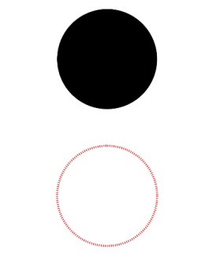
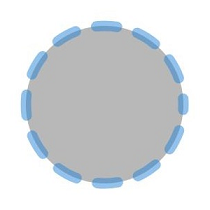
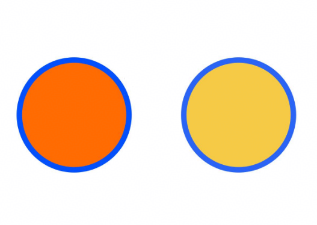

# Circle
<!--Kit: ArkUI-->
<!--Subsystem: ArkUI-->
<!--Owner: @camlostshi-->
<!--Designer: @fenglinbailu-->
<!--Tester: @liuli0427-->
<!--Adviser: @Brilliantry_Rui-->

 用于绘制圆形的组件。 

>  **说明：**
>
>  该组件从API version 7开始支持。后续版本如有新增内容，则采用上角标单独标记该内容的起始版本。


## 子组件

无

## 接口

### Circle

new Circle(value?: CircleOptions)

用于绘制圆形的构造函数。 

**卡片能力：** 从API version 9开始，该接口支持在ArkTS卡片中使用。

**原子化服务API：** 从API version 11开始，该接口支持在原子化服务中使用。

**系统能力：** SystemCapability.ArkUI.ArkUI.Full

**参数：**

| 参数名 | 类型 | 必填 | 说明 |
| -------- | -------- | -------- | -------- |
| value | [CircleOptions](#circleoptions对象说明) | 否 | 设置圆形尺寸。<br/>异常值undefined和null按照无效值处理，本次设置不生效。 |

### Circle

Circle(value?: CircleOptions)

用于绘制圆形的构造函数。 

**卡片能力：** 从API version 9开始，该接口支持在ArkTS卡片中使用。

**原子化服务API：** 从API version 11开始，该接口支持在原子化服务中使用。

**系统能力：** SystemCapability.ArkUI.ArkUI.Full

**参数：**

| 参数名 | 类型 | 必填 | 说明 |
| -------- | -------- | -------- | -------- |
| value | [CircleOptions](#circleoptions对象说明) | 否 | 设置圆形尺寸。<br/>异常值undefined和null按照无效值处理，本次设置不生效。 |

## CircleOptions对象说明

用于描述Circle组件绘制属性。

**卡片能力：** 从API version 9开始，该接口支持在ArkTS卡片中使用。

**原子化服务API：** 从API version 11开始，该接口支持在原子化服务中使用。

**系统能力：** SystemCapability.ArkUI.ArkUI.Full

| 名称 | 类型 | 只读 | 可选 | 说明 |
| -------- | -------- | -------- | -------- | -------- |
| width | [Length](ts-types.md#length) | 否 | 是 | 宽度，取值范围≥0。<br/>默认值：0<br/>默认单位：vp<br/>异常值undefined、null、NaN和Infinity按照默认值处理。 |
| height | [Length](ts-types.md#length) | 否 | 是 | 高度，取值范围≥0。<br/>默认值：0<br/>默认单位：vp<br/>异常值undefined、null、NaN和Infinity按照默认值处理。 |

## 属性

除支持[通用属性](ts-component-general-attributes.md)外，还支持以下属性：

### fill

fill(value: ResourceColor)

设置填充区域的颜色，支持[attributeModifier](ts-universal-attributes-attribute-modifier.md#attributemodifier)动态设置属性方法，异常值按照默认值处理。与通用属性foregroundColor同时设置时，后设置的属性生效。

**卡片能力：** 从API version 9开始，该接口支持在ArkTS卡片中使用。

**原子化服务API：** 从API version 11开始，该接口支持在原子化服务中使用。

**系统能力：** SystemCapability.ArkUI.ArkUI.Full

**参数：** 

| 参数名 | 类型                                       | 必填 | 说明                                   |
| ------ | ------------------------------------------ | ---- | -------------------------------------- |
| value  | [ResourceColor](ts-types.md#resourcecolor) | 是   | 填充区域颜色。<br/>默认值：[Color](ts-appendix-enums.md#color).Black <br/>异常值undefined、null、NaN和Infinity按照默认值处理。|

### fillOpacity

fillOpacity(value: number | string | Resource)

设置填充区域透明度，支持[attributeModifier](ts-universal-attributes-attribute-modifier.md#attributemodifier)动态设置属性方法。

**卡片能力：** 从API version 9开始，该接口支持在ArkTS卡片中使用。

**原子化服务API：** 从API version 11开始，该接口支持在原子化服务中使用。

**系统能力：** SystemCapability.ArkUI.ArkUI.Full

**参数：** 

| 参数名 | 类型                                                         | 必填 | 说明                           |
| ------ | ------------------------------------------------------------ | ---- | ------------------------------ |
| value  | number&nbsp;\|&nbsp;string&nbsp;\|&nbsp;[Resource](ts-types.md#resource) | 是   | 填充区域透明度。<br/>**说明：**<br/>number格式取值范围是[0.0, 1.0]，若给定值小于0.0，则取值为0.0；若给定值大于1.0，则取值为1.0，其余异常值按1.0处理。<br/>string格式支持number格式取值的字符串，取值范围与number格式相同。<br/>Resource格式支持系统资源或者应用资源中的字符串，取值范围和number格式相同。<br/>异常值NaN按0.0处理，undefined、null和Infinity按1.0处理。<br/>默认值：1.0 |

### stroke

stroke(value: ResourceColor)

设置边框颜色，支持[attributeModifier](ts-universal-attributes-attribute-modifier.md#attributemodifier)动态设置属性方法，不设置时，默认边框透明度为0，即没有边框。

**卡片能力：** 从API version 9开始，该接口支持在ArkTS卡片中使用。

**原子化服务API：** 从API version 11开始，该接口支持在原子化服务中使用。

**系统能力：** SystemCapability.ArkUI.ArkUI.Full

**参数：** 

| 参数名 | 类型                                       | 必填 | 说明       |
| ------ | ------------------------------------------ | ---- | ---------- |
| value  | [ResourceColor](ts-types.md#resourcecolor) | 是   | 边框颜色。<br/>默认值：[Color](ts-appendix-enums.md#color).Transparent<br/>异常值undefined和null按照默认值处理，NaN和Infinity按照[Color](ts-appendix-enums.md#color).Black处理。|

### strokeDashArray

strokeDashArray(value: Array&lt;any&gt;)

设置边框间隙，支持[attributeModifier](ts-universal-attributes-attribute-modifier.md#attributemodifier)动态设置属性方法。取值范围≥0，异常值按照默认值处理。

**卡片能力：** 从API version 9开始，该接口支持在ArkTS卡片中使用。

**原子化服务API：** 从API version 11开始，该接口支持在原子化服务中使用。

**系统能力：** SystemCapability.ArkUI.ArkUI.Full

**参数：** 

| 参数名 | 类型             | 必填 | 说明                      |
| ------ | ---------------- | ---- | ------------------------- |
| value  | Array&lt;any&gt; | 是   | 定义Circle轮廓的虚线模式的数组，数组元素交替表示线段长度和间隙长度。<br/>默认值：[]（空数组）<br/>默认单位：vp <br/>异常值undefined和null按照默认值处理。<br/>**说明：**<br/>空数组：实线<br/>偶数多元素数组：数组元素按顺序循环，如[a, b, c, d]表示线段长度a->间隙长度b->线段长度c->间隙长度d->线段长度a->...<br/>奇数多元素数组：重复一次该数组元素，按偶数多元素数组的规则顺序循环，如[a, b, c]等效于[a, b, c, a, b, c]，表示线段长度a->间隙长度b->线段长度c->间隙长度a->线段长度b->间隙长度c->线段长度a->... |

### strokeDashOffset

strokeDashOffset(value: number | string)

设置边框绘制起点的偏移量，支持[attributeModifier](ts-universal-attributes-attribute-modifier.md#attributemodifier)动态设置属性方法。

**卡片能力：** 从API version 9开始，该接口支持在ArkTS卡片中使用。

**原子化服务API：** 从API version 11开始，该接口支持在原子化服务中使用。

**系统能力：** SystemCapability.ArkUI.ArkUI.Full

**参数：** 

| 参数名 | 类型                       | 必填 | 说明                                 |
| ------ | -------------------------- | ---- | ------------------------------------ |
| value  | number&nbsp;\|&nbsp;string | 是   | 边框绘制起点的偏移量。<br/>默认值：0<br/>默认单位：vp <br/>异常值undefined和null按照默认值处理，NaN和Infinity会导致strokeDashArray失效。|

### strokeLineCap

strokeLineCap(value: LineCapStyle)

设置边框端点绘制样式，支持[attributeModifier](ts-universal-attributes-attribute-modifier.md#attributemodifier)动态设置属性方法。

**卡片能力：** 从API version 9开始，该接口支持在ArkTS卡片中使用。

**原子化服务API：** 从API version 11开始，该接口支持在原子化服务中使用。

**系统能力：** SystemCapability.ArkUI.ArkUI.Full

**参数：** 

| 参数名 | 类型                                              | 必填 | 说明                                             |
| ------ | ------------------------------------------------- | ---- | ------------------------------------------------ |
| value  | [LineCapStyle](ts-appendix-enums.md#linecapstyle) | 是   | 边框端点绘制样式。<br/>默认值：LineCapStyle.Butt <br/>异常值undefined、null、NaN和Infinity按照默认值处理。|

### strokeLineJoin

strokeLineJoin(value: LineJoinStyle)

设置边框拐角绘制样式，支持[attributeModifier](ts-universal-attributes-attribute-modifier.md#attributemodifier)动态设置属性方法。Circle组件无法形成拐角，该属性设置无效。

**卡片能力：** 从API version 9开始，该接口支持在ArkTS卡片中使用。

**原子化服务API：** 从API version 11开始，该接口支持在原子化服务中使用。

**系统能力：** SystemCapability.ArkUI.ArkUI.Full

**参数：** 

| 参数名 | 类型                                                | 必填 | 说明                                               |
| ------ | --------------------------------------------------- | ---- | -------------------------------------------------- |
| value  | [LineJoinStyle](ts-appendix-enums.md#linejoinstyle) | 是   | 边框拐角绘制样式。<br/>默认值：LineJoinStyle.Miter<br/>异常值undefined、null、NaN和Infinity按照默认值处理。 |

### strokeMiterLimit

strokeMiterLimit(value: number | string)

设置斜接长度与边框宽度比值的极限值，支持[attributeModifier](ts-universal-attributes-attribute-modifier.md#attributemodifier)动态设置属性方法。Circle组件无法设置尖角图形，该属性设置无效。

**卡片能力：** 从API version 9开始，该接口支持在ArkTS卡片中使用。

**原子化服务API：** 从API version 11开始，该接口支持在原子化服务中使用。

**系统能力：** SystemCapability.ArkUI.ArkUI.Full

**参数：** 

| 参数名 | 类型                       | 必填 | 说明                                           |
| ------ | -------------------------- | ---- | ---------------------------------------------- |
| value  | number&nbsp;\|&nbsp;string | 是   | 斜接长度与边框宽度比值的极限值。<br/>默认值：4<br/>异常值undefined、null和NaN按照默认值处理，Infinity会导致stroke失效。 |

### strokeOpacity

strokeOpacity(value: number | string | Resource)

设置边框透明度，支持[attributeModifier](ts-universal-attributes-attribute-modifier.md#attributemodifier)动态设置属性方法。该属性的取值范围是[0.0, 1.0]，若给定值小于0.0，则取值为0.0；若给定值大于1.0，则取值为1.0。

**卡片能力：** 从API version 9开始，该接口支持在ArkTS卡片中使用。

**原子化服务API：** 从API version 11开始，该接口支持在原子化服务中使用。

**系统能力：** SystemCapability.ArkUI.ArkUI.Full

**参数：** 

| 参数名 | 类型                                                         | 必填 | 说明                       |
| ------ | ------------------------------------------------------------ | ---- | -------------------------- |
| value  | number&nbsp;\|&nbsp;string&nbsp;\|&nbsp;[Resource](ts-types.md#resource) | 是   | 边框透明度。<br/>该属性的取值范围是[0.0, 1.0]，若给定值小于0.0，则取值为0.0，若给定值大于1.0，则取值为1.0。<br/>默认值：[stroke](#stroke)接口设置的透明度。<br/>异常值NaN按0.0处理，undefined、null和Infinity按1.0处理。 |

### strokeWidth

strokeWidth(value: Length)

设置边框宽度，支持[attributeModifier](ts-universal-attributes-attribute-modifier.md#attributemodifier)动态设置属性方法。该属性若为string类型，暂不支持百分比，百分比按照1px处理。

**卡片能力：** 从API version 9开始，该接口支持在ArkTS卡片中使用。

**原子化服务API：** 从API version 11开始，该接口支持在原子化服务中使用。

**系统能力：** SystemCapability.ArkUI.ArkUI.Full

**参数：** 

| 参数名 | 类型                         | 必填 | 说明                     |
| ------ | ---------------------------- | ---- | ------------------------ |
| value  | [Length](ts-types.md#length) | 是   | 边框宽度，取值范围≥0。<br/>默认值：1<br/>默认单位：vp<br/>异常值undefined、null和NaN按照默认值处理，Infinity按0处理。 |

### antiAlias

antiAlias(value: boolean)

设置是否开启抗锯齿效果，支持[attributeModifier](ts-universal-attributes-attribute-modifier.md#attributemodifier)动态设置属性方法。

**卡片能力：** 从API version 9开始，该接口支持在ArkTS卡片中使用。

**原子化服务API：** 从API version 11开始，该接口支持在原子化服务中使用。

**系统能力：** SystemCapability.ArkUI.ArkUI.Full

**参数：** 

| 参数名 | 类型    | 必填 | 说明                                  |
| ------ | ------- | ---- | ------------------------------------- |
| value  | boolean | 是   | 是否开启抗锯齿效果。<br/>-true：开启抗锯齿。<br/>-false：关闭抗锯齿。<br/>默认值：true <br/>异常值undefined和null按照false处理。|

### stroke

stroke(value: ResourceColor | ColorMetrics) : CircleAttribute

设置边框颜色，支持使用[ColorMetrics](../js-apis-arkui-graphics.md#colormetrics12)描述颜色，可进行HDR提亮，支持[attributeModifier](ts-universal-attributes-attribute-modifier.md#attributemodifier)动态设置属性方法，不设置时，默认边框透明度为0，即没有边框。

**起始版本：** 26.0.0

**卡片能力：** 从API版本26.0.0开始，该接口支持在ArkTS卡片中使用。

**原子化服务API：** 从API版本26.0.0开始，该接口支持在原子化服务中使用。

**系统能力：** SystemCapability.ArkUI.ArkUI.Full

**参数：**

| 参数名 | 类型 | 必填 | 说明 |
| ------ | ---- | ---- | ---- |
| value  | [ResourceColor](ts-types.md#resourcecolor) \| [ColorMetrics](../js-apis-arkui-graphics.md#colormetrics12) | 是   | 边框颜色。<br/>默认值：[Color](ts-appendix-enums.md#color).Transparent<br/>异常值undefined和null按照默认值处理，NaN和Infinity按照[Color](ts-appendix-enums.md#color).Black处理。 |

### fill

fill(value: ResourceColor | ColorMetrics)

设置填充区域的颜色，支持使用[ColorMetrics](../js-apis-arkui-graphics.md#colormetrics12)描述颜色，可进行HDR提亮，支持[attributeModifier](ts-universal-attributes-attribute-modifier.md#attributemodifier)动态设置属性方法，异常值按照默认值处理。与通用属性foregroundColor同时设置时，后设置的属性生效。

**起始版本：** 26.0.0

**卡片能力：** 从API版本26.0.0开始，该接口支持在ArkTS卡片中使用。

**原子化服务API：** 从API版本26.0.0开始，该接口支持在原子化服务中使用。

**系统能力：** SystemCapability.ArkUI.ArkUI.Full

**参数：**

| 参数名 | 类型 | 必填 | 说明 |
| ------ | ---- | ---- | ---- |
| value  | [ResourceColor](ts-types.md#resourcecolor) \| [ColorMetrics](../js-apis-arkui-graphics.md#colormetrics12) | 是   | 填充区域颜色。<br/>默认值：[Color](ts-appendix-enums.md#color).Black <br/>异常值undefined、null、NaN和Infinity按照默认值处理。 |

## 示例

### 示例1（组件属性绘制）

通过fillOpacity、stroke、strokeDashArray属性可分别设置圆的透明度、边框颜色和边框间隙样式。

ArkTS-Dyn示例：

```ts
// xxx.ets
@Entry
@Component
struct CircleExample {
  build() {
    Column({ space: 10 }) {
      // 绘制一个直径为150的圆
      Circle({ width: 150, height: 150 })
      // 绘制一个直径为150、线条为红色虚线的圆环（宽高设置不一致时以短边为直径）
      Circle()
        .width(150)
        .height(200)
        .fillOpacity(0)
        .strokeWidth(3)
        .stroke(Color.Red)
        .strokeDashArray([1, 2])
    }.width('100%')
  }
}
```

ArkTS-Sta示例：

```ts
// xxx.ets
import { Entry, Component, Column, Circle, Color, ColumnOptions } from '@kit.ArkUI';

@Entry
@Component
struct CircleExample {
  build() {
    Column({ space: 10 } as ColumnOptions) {
      Circle({ width: 150, height: 150 })
      Circle()
        .width(150)
        .height(200)
        .fillOpacity(0)
        .strokeWidth(3)
        .stroke(Color.Red)
        .strokeDashArray([1, 2])
    }.width('100%')
  }
}
```



### 示例2（宽和高使用不同参数类型绘制圆）

width、height属性分别使用不同的长度类型绘制圆。

ArkTS-Dyn示例：

```ts
// xxx.ets
@Entry
@Component
struct CircleTypeExample {
  build() {
    Column({ space: 10 }) {
      // 绘制一个直径为50的圆
      Circle({ width: '50', height: '50' }) // 使用string类型
      // 绘制一个直径为100的圆
      Circle({ width: 100, height: 100 }) // 使用number类型
      // 绘制一个直径为150的圆
      Circle({ width: $r('app.string.CircleWidth'), height: $r('app.string.CircleHeight') }) // 使用Resource类型，需用户自定义
    }.width('100%')
  }
}
```

ArkTS-Sta示例：

```ts
// xxx.ets
import { Entry, Component, Column, Circle, CircleOptions, ColumnOptions, $r } from '@kit.ArkUI';

@Entry
@Component
struct CircleTypeExample {
  build() {
    Column({ space: 10 } as ColumnOptions) {
      Circle({ width: '50', height: '50' } as CircleOptions)
      Circle({ width: 100, height: 100 } as CircleOptions)
      Circle({ width: $r('app.string.CircleWidth'), height: $r('app.string.CircleHeight') } as CircleOptions)
    }.width('100%')
  }
}
```


### 示例3（使用attributeModifier动态设置Circle组件的属性）

以下示例展示了如何使用attributeModifier动态设置Circle组件的fill、fillOpacity、stroke、strokeDashArray、strokeDashOffset、strokeLineCap、strokeOpacity、strokeWidth和antiAlias属性。

ArkTS-Dyn示例：

```ts
// xxx.ets
class MyCircleModifier implements AttributeModifier<CircleAttribute> {
  applyNormalAttribute(instance: CircleAttribute): void {
    // 填充颜色#707070，填充透明度0.5，边框颜色#2787D9，边框间隙[20]，向左偏移15，线条两端样式为半圆，边框透明度0.5，边框宽度10，抗锯齿开启
    instance.fill("#707070")
    instance.fillOpacity(0.5)
    instance.stroke("#2787D9")
    instance.strokeDashArray([20])
    instance.strokeDashOffset("15")
    instance.strokeLineCap(LineCapStyle.Round)
    instance.strokeOpacity(0.5)
    instance.strokeWidth(10)
    instance.antiAlias(true)
  }
}

@Entry
@Component
struct CircleModifierDemo {
  @State modifier: MyCircleModifier = new MyCircleModifier()

  build() {
    Column() {
      Circle({ width: 150, height: 150 })
        .attributeModifier(this.modifier)
        .offset({ x: 20, y: 20 })
    }
  }
}
```

ArkTS-Sta示例：

```ts
// xxx.ets
import { Entry, Component, Column, Circle, CircleOptions, CircleAttribute, AttributeModifier, LineCapStyle } from '@kit.ArkUI';
import { State } from '@ohos.arkui.stateManagement';

class MyCircleModifier implements AttributeModifier<CircleAttribute> {
  applyNormalAttribute(instance: CircleAttribute): void {
    instance.fill("#707070")
    instance.fillOpacity(0.5)
    instance.stroke("#2787D9")
    instance.strokeDashArray([20])
    instance.strokeDashOffset("15")
    instance.strokeLineCap(LineCapStyle.Round)
    instance.strokeOpacity(0.5)
    instance.strokeWidth(10)
    instance.antiAlias(true)
  }
}

@Entry
@Component
struct CircleModifierDemo {
  @State modifier: MyCircleModifier = new MyCircleModifier()

  build() {
    Column() {
      Circle({ width: 150, height: 150 } as CircleOptions)
        .attributeModifier(this.modifier)
        .offset({ x: 20, y: 20 })
    }
  }
}
```



### 示例4（使用ColorMetrics设置HDR填充和边框颜色）

通过[ColorMetrics](../js-apis-arkui-graphics.md#colormetrics12)可为Circle组件设置HDR颜色，实现超出普通显示范围的亮度效果。其中，[fill](#fill)接口用于设置填充区域的颜色，[stroke](#stroke)接口用于设置边框颜色。以下示例左侧使用HDR暖金色填充和冰蓝色边框（亮度倍数大于1.0），右侧使用普通SDR颜色作为对照，在支持HDR的屏幕上可观察到左侧明显比右侧更亮且色彩更鲜艳。

从API版本26.0.0开始，新增Circle组件专有的[fill](#fill)和[stroke](#stroke)接口，支持传入[ColorMetrics](../js-apis-arkui-graphics.md#colormetrics12)类型以实现HDR提亮效果。

```ts
// xxx.ets
import { ColorMetrics } from '@kit.ArkUI';

@Entry
@Component
struct CircleHDRDemo {
  build() {
    Column({ space: 30 }) {
      Row({ space: 60 }) {
        // HDR填充和边框：颜色分量值可以超过1.0，超过1.0的部分用于表现超出普通屏幕亮度范围的高亮效果
        Column({ space: 8 }) {
          Circle()
            .width(120).height(120).strokeWidth(6)
            .fill(ColorMetrics.createHDRColor(ColorSpace.BT2020, 2.5, 1.2, 0.0, 1)) // 高亮暖金
            .stroke(ColorMetrics.createHDRColor(ColorSpace.BT2020, 0.0, 0.8, 2.5, 1)) // 高亮冰蓝
          Text('HDR').fontColor(Color.White).fontSize(14)
        }

        // SDR填充和边框：颜色分量值的范围为0.0到1.0，是常规标准动态范围的颜色显示方式
        Column({ space: 8 }) {
          Circle()
            .width(120).height(120).strokeWidth(6)
            .fill('#ffc800') // 普通金黄
            .stroke('#0066ff') // 普通深蓝
          Text('SDR').fontColor(Color.White).fontSize(14)
        }
      }
    }
    .width('100%').height('100%')
    .justifyContent(FlexAlign.Center)
  }
}
```


