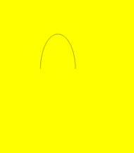
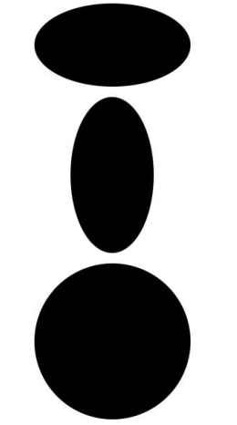

# Ellipse
<!--Kit: ArkUI-->
<!--Subsystem: ArkUI-->
<!--Owner: @camlostshi-->
<!--Designer: @fenglinbailu-->
<!--Tester: @liuli0427-->
<!--Adviser: @Brilliantry_Rui-->

椭圆绘制组件。

>  **说明：**
>
>  该组件从API version 7开始支持。后续版本如有新增内容，则采用上角标单独标记该内容的起始版本。

## 子组件

无

## 接口

### Ellipse

new Ellipse(options?: EllipseOptions)

用于绘制椭圆的构造函数。 

**卡片能力：** 从API version 9开始，该接口支持在ArkTS卡片中使用。

**原子化服务API：** 从API version 11开始，该接口支持在原子化服务中使用。

**系统能力：** SystemCapability.ArkUI.ArkUI.Full

**参数：**

| 参数名 | 类型 | 必填 | 说明 |
| -------- | -------- | -------- | -------- |
| options | [EllipseOptions](ts-drawing-components-ellipse.md#ellipseoptions18对象说明) | 否 | 椭圆绘制尺寸。 <br/>异常值undefined和null按照无效值处理，本次设置不生效。|

### Ellipse

Ellipse(options?: EllipseOptions)

用于绘制椭圆的构造函数。 

**卡片能力：** 从API version 9开始，该接口支持在ArkTS卡片中使用。

**原子化服务API：** 从API version 11开始，该接口支持在原子化服务中使用。

**系统能力：** SystemCapability.ArkUI.ArkUI.Full

**参数：**

| 参数名 | 类型 | 必填 | 说明 |
| -------- | -------- | -------- | -------- |
| options | [EllipseOptions](ts-drawing-components-ellipse.md#ellipseoptions18对象说明) | 否 | 椭圆绘制尺寸。 <br/>异常值undefined和null按照无效值处理，本次设置不生效。|

## EllipseOptions<sup>18+</sup>对象说明

用于描述Ellipse组件绘制属性。

> **说明：**
>
> 为规范匿名对象的定义，API 18版本修改了此处的元素定义。其中，保留了历史匿名对象的起始版本信息，会出现外层元素@since版本号高于内层元素版本号的情况，但这不影响接口的使用。

**卡片能力：** 从API version 18开始，该接口支持在ArkTS卡片中使用。

**原子化服务API：** 从API version 18开始，该接口支持在原子化服务中使用。

**模型约束：** 此接口仅可在Stage模型下使用。

**系统能力：** SystemCapability.ArkUI.ArkUI.Full

| 名称 | 类型 | 只读 | 可选 | 说明 |
| -------- | -------- | -------- | -------- | -------- |
| width<sup>7+</sup> | [Length](ts-types.md#length) | 否 | 是 | 宽度，取值范围≥0。<br/>默认值：0<br/>默认单位：vp<br/>异常值undefined、null、NaN和Infinity按照默认值处理。<br/>从API version 20开始，支持Resource类型。<br/>**卡片能力：** 从API version 9开始，该接口支持在ArkTS卡片中使用。<br/>**原子化服务API：** 从API version 11开始，该接口支持在原子化服务中使用。 |
| height<sup>7+</sup> | [Length](ts-types.md#length) | 否 | 是 | 高度，取值范围≥0。<br/>默认值：0<br/>默认单位：vp<br/>异常值undefined、null、NaN和Infinity按照默认值处理。<br/>从API version 20开始，支持Resource类型。<br/>**卡片能力：** 从API version 9开始，该接口支持在ArkTS卡片中使用。<br/>**原子化服务API：** 从API version 11开始，该接口支持在原子化服务中使用。 |

## 属性

支持[通用属性](ts-component-general-attributes.md)以及[图形绘制通用属性](ts-drawing-components-common.md)。

## 示例

### 示例1（组件属性绘制）

通过fillOpacity、stroke属性分别绘制椭圆的透明度、边框颜色。

```ts
// xxx.ets
@Entry
@Component
struct EllipseExample {
  build() {
    Column({ space: 10 }) {
      // 绘制一个 150 * 80 的椭圆
      Ellipse({ width: 150, height: 80 })
      // 绘制一个 150 * 100 、线条为蓝色的椭圆环
      Ellipse()
        .width(150)
        .height(100)
        .fillOpacity(0)
        .stroke(Color.Blue)
        .strokeWidth(3)
    }.width('100%')
  }
}
```



### 示例2（宽和高使用不同参数类型绘制椭圆）

width、height属性分别使用不同的长度类型绘制椭圆。

```ts
// xxx.ets
@Entry
@Component
struct EllipseTypeExample {
  build() {
    Column({ space: 10 }) {
      // 绘制一个 150 * 80 的椭圆
      Ellipse({ width: '150', height: '80' }) // 使用string类型
      // 绘制一个 80 * 150 的椭圆
      Ellipse({ width: 80, height: 150 }) // 使用number类型
      // 绘制一个 150 * 150 的椭圆
      Ellipse({ width: $r('app.string.EllipseWidth'), height: $r('app.string.EllipseHeight') }) // 使用Resource类型，需用户自定义
    }.width('100%')
  }
}
```



### 示例3（使用attributeModifier动态设置Ellipse组件的属性）

以下示例展示了如何使用attributeModifier动态设置Ellipse组件的fill、fillOpacity、stroke、strokeDashArray、strokeDashOffset、strokeLineCap、strokeOpacity、strokeWidth和antiAlias属性。

```ts
// xxx.ets
class MyEllipseModifier implements AttributeModifier<EllipseAttribute> {
  applyNormalAttribute(instance: EllipseAttribute): void {
    // 填充颜色#707070，填充透明度0.5，边框颜色#2787D9，边框间隙[20]，向左偏移15，线条两端样式为半圆，边框透明度0.5，边框宽度10，抗锯齿开启
    instance.fill("#707070")
    instance.fillOpacity(0.5)
    instance.stroke("#2787D9")
    instance.strokeDashArray([20])
    instance.strokeDashOffset("15")
    instance.strokeLineCap(LineCapStyle.Round)
    instance.strokeOpacity(0.5)
    instance.strokeWidth(10)
    instance.antiAlias(true)
  }
}

@Entry
@Component
struct EllipseModifierDemo {
  @State modifier: MyEllipseModifier = new MyEllipseModifier()

  build() {
    Column() {
      Ellipse({ width: 150, height: 80 })
        .attributeModifier(this.modifier)
        .offset({ x: 20, y: 20 })
    }
  }
}
```


