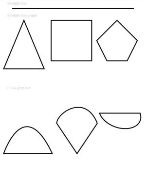
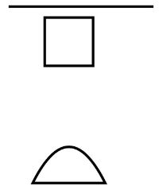
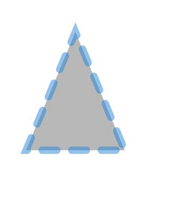

# Path
<!--Kit: ArkUI-->
<!--Subsystem: ArkUI-->
<!--Owner: @camlostshi-->
<!--Designer: @fenglinbailu-->
<!--Tester: @liuli0427-->
<!--Adviser: @Brilliantry_Rui-->

路径绘制组件，根据绘制路径生成封闭的自定义形状。

> **说明：**
>
> 该组件从API version 7开始支持。后续版本如有新增内容，则采用上角标单独标记该内容的起始版本。
>
> 该组件从API version 20开始支持使用[AttributeUpdater](../js-apis-arkui-AttributeUpdater.md)类的[updateConstructorParams](../js-apis-arkui-AttributeUpdater.md#属性)接口更新构造参数。


## 子组件

无

## 接口

### Path

new Path(options?: PathOptions)

用于描述Path组件绘制属性。

**卡片能力：** 从API version 9开始，该接口支持在ArkTS卡片中使用。

**原子化服务API：** 从API version 11开始，该接口支持在原子化服务中使用。

**系统能力：** SystemCapability.ArkUI.ArkUI.Full

**参数：**

| 参数名                                             | 类型         | 必填 | 说明                   |
| ------ | ---------------- | ---- | ------------------------------------------------------------ |
| options  | [PathOptions](ts-drawing-components-path.md#pathoptions18对象说明) | 否   | Path绘制区域。<br/>异常值undefined和null按照无效值处理，本次设置不生效。 |

### Path

Path(options?: PathOptions)

用于描述Path组件绘制属性。

**卡片能力：** 从API version 9开始，该接口支持在ArkTS卡片中使用。

**原子化服务API：** 从API version 11开始，该接口支持在原子化服务中使用。

**系统能力：** SystemCapability.ArkUI.ArkUI.Full

**参数：**

| 参数名                                             | 类型         | 必填 | 说明                   |
| ------ | ---------------- | ---- | ------------------------------------------------------------ |
| options  | [PathOptions](ts-drawing-components-path.md#pathoptions18对象说明) | 否   | Path绘制区域。<br/>异常值undefined和null按照无效值处理，本次设置不生效。 |

## PathOptions<sup>18+</sup>对象说明

用于描述Path组件绘制属性。

> **说明：**
>
> 为规范匿名对象的定义，API 18版本修改了此处的元素定义。其中，保留了历史匿名对象的起始版本信息，会出现外层元素@since版本号高于内层元素版本号的情况，但这不影响接口的使用。

**卡片能力：** 从API version 18开始，该接口支持在ArkTS卡片中使用。

**原子化服务API：** 从API version 18开始，该接口支持在原子化服务中使用。

**模型约束：** 此接口仅可在Stage模型下使用。

**系统能力：** SystemCapability.ArkUI.ArkUI.Full

| 名称 | 类型 | 只读 | 可选 | 说明 |
| -------- | -------- | -------- | -------- | -------- |
| width<sup>7+</sup> | [Length](ts-types.md#length) | 否 | 是 | 路径所在矩形的宽度。<br/>值为异常值或缺省时按照自身内容需要的宽度处理。<br/>默认单位：vp<br/>**卡片能力：** 从API version 9开始，该接口支持在ArkTS卡片中使用。<br/>**原子化服务API：** 从API version 11开始，该接口支持在原子化服务中使用。 |
| height<sup>7+</sup> | [Length](ts-types.md#length) | 否 | 是 | 路径所在矩形的高度。<br/>值为异常值或缺省时按照自身内容需要的高度处理。<br/>默认单位：vp<br/>**卡片能力：** 从API version 9开始，该接口支持在ArkTS卡片中使用。<br/>**原子化服务API：** 从API version 11开始，该接口支持在原子化服务中使用。 |
| [commands<sup>7+</sup>](ts-drawing-components-path.md#commands) | [ResourceStr](ts-types.md#resourcestr)  | 否 | 是 | 路径绘制的命令字符串。<br/>默认值：空字符串<br/>异常值按照默认值处理。<br/>**卡片能力：** 从API version 9开始，该接口支持在ArkTS卡片中使用。<br/>**原子化服务API：** 从API version 11开始，该接口支持在原子化服务中使用。 |

## 属性

除支持[通用属性](ts-component-general-attributes.md)以及[图形绘制通用属性](ts-drawing-components-common.md)外，还支持以下属性：

### commands

commands(value: [ResourceStr](ts-types.md#resourcestr))

设置符合[SVG路径描述规范](ts-drawing-components-path.md#svg路径描述规范)的命令字符串，单位为px。像素单位转换方法请参考[像素单位转换](ts-pixel-units.md)。

**卡片能力：** 从API version 9开始，该接口支持在ArkTS卡片中使用。

**原子化服务API：** 从API version 11开始，该接口支持在原子化服务中使用。

**系统能力：** SystemCapability.ArkUI.ArkUI.Full

**参数：** 

| 参数名 | 类型   | 必填 | 说明                          |
| ------ | ------ | ---- | ----------------------------- |
| value  | [ResourceStr](ts-types.md#resourcestr) | 是   | 路径绘制的命令字符串。<br/>默认值：空字符串<br/>默认单位：px <br/>异常值undefined和null按照默认值处理。|

## SVG路径描述规范

SVG路径描述规范支持的命令如下：

| 命令   | 名称                               | 参数                                       | 说明                                       |
| ---- | -------------------------------- | ---------------------------------------- | ---------------------------------------- |
| M    | moveto                           | x：起始点的x轴坐标。</br>y：起始点的y轴坐标。                                    | 在给定的(x, y)坐标处开始一个新的子路径。例如，`M 0 0`表示将(0, 0)点作为新子路径的起始点。 |
| L    | lineto                           | x：直线终点的x轴坐标。</br>y：直线终点的y轴坐标。                                    | 从当前点到给定的(x, y)坐标画一条线，该坐标成为新的当前点。例如，`L 50 50`表示绘制当前点到(50, 50)点的直线，并将(50, 50)点作为新子路径的起始点。 |
| H    | horizontal lineto                | x：水平直线终点的x轴坐标。                                        | 从当前点绘制一条水平线到给定的x坐标，等效于将y坐标指定为当前点y坐标的L命令。例如，当前点为(100, 100)，`H 50 `表示绘制当前点到(50, 100)点的直线，并将(50, 100)点作为新子路径的起始点。 |
| V    | vertical lineto                  | y：垂直直线终点的y轴坐标。                                        | 从当前点绘制一条垂直线到给定的y坐标，等效于将x坐标指定为当前点x坐标的L命令。例如，当前点为(100, 100)，`V 50 `表示绘制当前点到(100, 50)点的直线，并将(100, 50)点作为新子路径的起始点。 |
| C    | curveto                          | x1：第一个控制点参数的x坐标值。</br>y1：第一个控制点参数的y坐标值。</br>x2：第二个控制点参数的x坐标值。</br>y2：第二个控制点参数的y坐标值。</br>x：终点参数的x坐标值。</br>y：终点参数的y坐标值。                        | 使用(x1, y1)作为曲线起点的控制点，(x2, y2)作为曲线终点的控制点，从当前点到(x, y)绘制三次贝塞尔曲线。例如，`C100 100 250 100 250 200 `表示绘制当前点到(250, 200)点的三次贝塞尔曲线，并将(250, 200)点作为新子路径的起始点。 |
| S    | smooth curveto                   | x2：第二个控制点参数的x坐标值。</br>y2：第二个控制点参数的y坐标值。</br>x：终点参数的x坐标值。</br>y：终点参数的y坐标值。                              |(x2, y2)作为曲线终点的控制点，从当前点到(x, y)绘制三次贝塞尔曲线。若前一个命令是C或S，则起点控制点是上一个命令的终点控制点相对于起点的映射。例如，`C100 100 250 100 250 200 S400 300 400 200`第二段贝塞尔曲线的起点控制点为(250, 300)。如果没有前一个命令或者前一个命令不是 C或S，则第一个控制点与当前点重合。 |
| Q    | quadratic Bezier curve          | x1：第一个控制点参数的x坐标值。</br>y1：第一个控制点参数的y坐标值。</br>x：终点参数的x坐标值。</br>y：终点参数的y坐标值。                              | 使用(x1, y1)作为控制点，从当前点到(x, y)绘制二次贝塞尔曲线。例如，`Q400 50 600 300 `表示绘制当前点到(600, 300)点的二次贝塞尔曲线，并将(600, 300)点作为新子路径的起始点。 |
| T    | smooth quadratic Bezier curveto | x：终点参数的x坐标值。</br>y：终点参数的y坐标值。                                    | 从当前点到(x, y)绘制二次贝塞尔曲线。若前一个命令是Q或T，则控制点是上一个命令的终点控制点相对于起点的映射。 例如，`Q400 50 600 300 T1000 300`第二段贝塞尔曲线的控制点为(800, 550)。 如果没有前一个命令或者前一个命令不是Q或T，则第一个控制点与当前点重合。 |
| A    | elliptical Arc                   | rx：椭圆的x轴半径。</br>ry：椭圆的y轴半径。</br>x-axis-rotation：椭圆相对于坐标系的旋转角度。</br>large-arc-flag：标记绘制大弧(1)还是小弧(0)。</br>sweep-flag：标记向顺时针(1)还是逆时针(0)方向绘制。</br>x：终点参数的x坐标值。</br>y：终点参数的y坐标值。 | 从当前点到(x, y)绘制一条椭圆弧。椭圆的大小和方向由两个半径(rx, ry)和x-axis-rotation定义，指示整个椭圆相对于当前坐标系如何旋转（以度为单位）。 large-arc-flag 和 sweep-flag确定弧的绘制方式。 |
| Z    | closepath                        | none                                     | 通过将当前路径连接回当前子路径的初始点来关闭当前子路径。             |

例如：commands('M0 20 L50 50 L50 100 Z')定义了一个三角形，起始于位置(0, 20)，接着绘制点(0, 20)到点(50, 50)的直线，再绘制从点(50, 50)到点(50, 100)的直线，最后绘制从点(50, 100)到(0, 20)的直线关闭路径，形成封闭三角形。

## 示例

### 示例1（组件属性绘制）

通过commands、fillOpacity、stroke属性分别绘制路径、透明度、边框颜色。

```ts
// xxx.ets
@Entry
@Component
struct PathExample {
  build() {
    Column({ space: 10 }) {
      Text('Straight line')
        .fontSize(11)
        .fontColor(0xCCCCCC)
        .width('90%')
      // 绘制一条长600px，宽3vp的直线
      Path()
        .width('600px')
        .height('10px')
        .commands('M0 0 L600 0')
        .stroke(Color.Black)
        .strokeWidth(3)

      Text('Straight line graph')
        .fontSize(11)
        .fontColor(0xCCCCCC)
        .width('90%')
      // 绘制直线图形
      Flex({ justifyContent: FlexAlign.SpaceBetween }) {
        Path()
          .width('210px')
          .height('310px')
          .commands('M100 0 L200 240 L0 240 Z')
          .fillOpacity(0)
          .stroke(Color.Black)
          .strokeWidth(3)
        Path()
          .width('210px')
          .height('310px')
          .commands('M0 0 H200 V200 H0 Z')
          .fillOpacity(0)
          .stroke(Color.Black)
          .strokeWidth(3)
        Path()
          .width('210px')
          .height('310px')
          .commands('M100 0 L0 100 L50 200 L150 200 L200 100 Z')
          .fillOpacity(0)
          .stroke(Color.Black)
          .strokeWidth(3)
      }.width('95%')

      Text('Curve graphics').fontSize(11).fontColor(0xCCCCCC).width('90%')
      // 绘制弧线图形
      Flex({ justifyContent: FlexAlign.SpaceBetween }) {
        Path()
          .width('250px')
          .height('310px')
          .commands("M0 300 S100 0 240 300 Z")
          .fillOpacity(0)
          .stroke(Color.Black)
          .strokeWidth(3)
        Path()
          .width('210px')
          .height('310px')
          .commands('M0 150 C0 100 140 0 200 150 L100 300 Z')
          .fillOpacity(0)
          .stroke(Color.Black)
          .strokeWidth(3)
        Path()
          .width('210px')
          .height('310px')
          .commands('M0 100 A30 20 20 0 0 200 100 Z')
          .fillOpacity(0)
          .stroke(Color.Black)
          .strokeWidth(3)
      }.width('95%')
    }.width('100%')
    .margin({ top: 5 })
  }
}
```



### 示例2（使用不同参数类型绘制路径）

width、height、commands属性分别使用不同的长度类型绘制图形。

```ts
// xxx.ets
@Entry
@Component
struct PathTypeExample {
  build() {
    Column({ space: 10 }) {
      // 宽、高、命令字符串使用string类型，绘制一条直线。
      Path({ width: '600px', height: '10px' })
        .commands('M0 0 L600 0')
        .fillOpacity(0)
        .stroke(Color.Black)
        .strokeWidth(3)
      // 宽、高使用number类型，绘制一个矩形图形。
      Path({ width: 200, height: 100 })
        .commands('M200 0 H400 V200 H200 Z')
        .fillOpacity(0)
        .stroke(Color.Black)
        .strokeWidth(3)
      // 宽、高、命令字符串使用Resource类型（需用户自定义），绘制一个弧线图形。
      Path({ width: $r('app.string.PathWidth'), height: $r('app.string.PathHeight') }) // 本示例中PathWidth和PathHeight均定义为"200"。
        .commands($r('app.string.PathCommands')) // 本示例中PathCommands定义为"M150 300 Q300 0 450 300 Z"。
        .fillOpacity(0)
        .stroke(Color.Black)
        .strokeWidth(3)
    }.width('100%')
    .margin({ top: 5 })
  }
}
```



### 示例3（使用attributeModifier动态设置Path组件的属性）

以下示例展示了如何使用attributeModifier动态设置Path组件的commands、fill、fillOpacity、stroke、strokeDashArray、strokeDashOffset、strokeLineCap、strokeLineJoin、strokeMiterLimit、strokeOpacity、strokeWidth和antiAlias属性。

```ts
// xxx.ets
class MyPathModifier implements AttributeModifier<PathAttribute> {
  applyNormalAttribute(instance: PathAttribute): void {
    // 使用字符串commands绘制一个三角形，填充颜色#707070，填充透明度0.5，边框颜色#2787D9，边框间隙[20]，向左偏移15，线条两端样式为半圆，拐角样式使用尖角连接路径段，斜接长度与边框宽度比值的极限值为5，边框透明度0.5，边框宽度10，抗锯齿开启
    instance.commands('M100 0 L200 240 L0 240 Z')
    instance.fill("#707070")
    instance.fillOpacity(0.5)
    instance.stroke("#2787D9")
    instance.strokeDashArray([20])
    instance.strokeDashOffset("15")
    instance.strokeLineCap(LineCapStyle.Round)
    instance.strokeLineJoin(LineJoinStyle.Miter)
    instance.strokeMiterLimit(5)
    instance.strokeOpacity(0.5)
    instance.strokeWidth(10)
    instance.antiAlias(true)
  }
}

@Entry
@Component
struct PathModifierDemo {
  @State modifier: MyPathModifier = new MyPathModifier()

  build() {
    Column() {
      Path()
        .attributeModifier(this.modifier)
        .offset({ x: 20, y: 20 })
    }
  }
}
```


