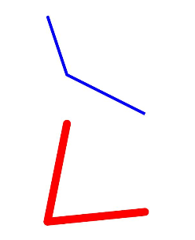
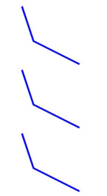
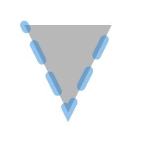

# Polyline
<!--Kit: ArkUI-->
<!--Subsystem: ArkUI-->
<!--Owner: @camlostshi-->
<!--Designer: @fenglinbailu-->
<!--Tester: @liuli0427-->
<!--Adviser: @Brilliantry_Rui-->

折线绘制组件。

>  **说明：**
>
>  该组件从API version 7开始支持。后续版本如有新增内容，则采用上角标单独标记该内容的起始版本。
>
>  该组件从API version 20开始支持使用[AttributeUpdater](../js-apis-arkui-AttributeUpdater.md)类的[updateConstructorParams](../js-apis-arkui-AttributeUpdater.md#属性)接口更新构造参数。


## 子组件

无


## 接口

### Polyline

new Polyline(options?: PolylineOptions)

用于绘制折线的构造函数。 

**卡片能力：** 从API version 9开始，该接口支持在ArkTS卡片中使用。

**原子化服务API：** 从API version 11开始，该接口支持在原子化服务中使用。

**系统能力：** SystemCapability.ArkUI.ArkUI.Full

**参数：**

| 参数名 | 类型 | 必填 | 说明 |
| -------- | -------- | -------- | -------- |
| options | [PolylineOptions](ts-drawing-components-polyline.md#polylineoptions18对象说明) | 否 | Polyline绘制区域。<br/>异常值undefined和null按照无效值处理，本次设置不生效。|

### Polyline

Polyline(options?: PolylineOptions)

用于绘制折线的构造函数。 

**卡片能力：** 从API version 9开始，该接口支持在ArkTS卡片中使用。

**原子化服务API：** 从API version 11开始，该接口支持在原子化服务中使用。

**系统能力：** SystemCapability.ArkUI.ArkUI.Full

**参数：**

| 参数名 | 类型 | 必填 | 说明 |
| -------- | -------- | -------- | -------- |
| options | [PolylineOptions](ts-drawing-components-polyline.md#polylineoptions18对象说明) | 否 | Polyline绘制区域。<br/>异常值undefined和null按照无效值处理，本次设置不生效。|

## PolylineOptions<sup>18+</sup>对象说明

用于描述Polyline组件绘制属性。

> **说明：**
>
> 为规范匿名对象的定义，API 18版本修改了此处的元素定义。其中，保留了历史匿名对象的起始版本信息，会出现外层元素@since版本号高于内层元素版本号的情况，但这不影响接口的使用。

**卡片能力：** 从API version 18开始，该接口支持在ArkTS卡片中使用。

**原子化服务API：** 从API version 18开始，该接口支持在原子化服务中使用。

**模型约束：** 此接口仅可在Stage模型下使用。

**系统能力：** SystemCapability.ArkUI.ArkUI.Full

| 名称 | 类型 | 只读 | 可选 | 说明 |
| -------- | -------- | -------- | -------- | -------- |
| width<sup>7+</sup> | [Length](ts-types.md#length) | 否 | 是 | 宽度，取值范围≥0。<br/>默认值：0<br/>默认单位：vp<br/>异常值undefined、null、NaN和Infinity按照默认值处理。<br/>**卡片能力：** 从API version 9开始，该接口支持在ArkTS卡片中使用。<br/>**原子化服务API：** 从API version 11开始，该接口支持在原子化服务中使用。 |
| height<sup>7+</sup> | [Length](ts-types.md#length) | 否 | 是 | 高度，取值范围≥0。<br/>默认值：0<br/>默认单位：vp<br/>异常值undefined、null、NaN和Infinity按照默认值处理。<br/>**卡片能力：** 从API version 9开始，该接口支持在ArkTS卡片中使用。<br/>**原子化服务API：** 从API version 11开始，该接口支持在原子化服务中使用。 |

## 属性

除支持[通用属性](ts-component-general-attributes.md)以及[图形绘制通用属性](ts-drawing-components-common.md)外，还支持以下属性：

### points

points(value: Array&lt;any&gt;)

设置折线经过坐标点列表，支持[attributeModifier](ts-universal-attributes-attribute-modifier.md#attributemodifier)动态设置属性方法。

**卡片能力：** 从API version 9开始，该接口支持在ArkTS卡片中使用。

**原子化服务API：** 从API version 11开始，该接口支持在原子化服务中使用。

**系统能力：** SystemCapability.ArkUI.ArkUI.Full

**参数：** 

| 参数名 | 类型                                                         | 必填 | 说明                                |
| ------ | ------------------------------------------------------------ | ---- | ----------------------------------- |
| value  | Array&lt;any&gt; | 是   | 折线经过坐标点列表。使用时传入一个二维数组，每个子数组表示一个顶点的[x, y]坐标。<br/>默认值：[]（空数组）<br/>默认单位：vp <br/>异常值undefined和null按照默认值处理。|

## 示例

### 示例1（组件属性绘制）

通过points、fillOpacity、stroke、strokeWidth、strokeLineJoin、strokeLineCap属性分别绘制折线的经过坐标、透明度、边框颜色、边框宽度、拐角样式、端点样式。

```ts
// xxx.ets
@Entry
@Component
struct PolylineExample {
  build() {
    Column({ space: 10 }) {
      // 在 100 * 100 的矩形框中绘制一段折线，起点(0, 0)，经过(20,60)，到达终点(100, 100)
      Polyline({ width: 100, height: 100 })
        .points([[0, 0], [20, 60], [100, 100]])
        .fillOpacity(0)
        .stroke(Color.Blue)
        .strokeWidth(3)
      // 在 100 * 100 的矩形框中绘制一段折线，起点(20, 0)，经过(0,100)，到达终点(100, 90)
      Polyline()
        .width(100)
        .height(100)
        .fillOpacity(0)
        .stroke(Color.Red)
        .strokeWidth(8)
        .points([[20, 0], [0, 100], [100, 90]])
        // 设置折线拐角处为圆弧
        .strokeLineJoin(LineJoinStyle.Round)
        // 设置折线两端为半圆
        .strokeLineCap(LineCapStyle.Round)
    }.width('100%')
  }
}
```



### 示例2（宽和高使用不同参数类型绘制折线）

width、height属性分别使用不同的长度类型绘制图形。

```ts
// xxx.ets
@Entry
@Component
struct PolylineTypeExample {
  build() {
    Column({ space: 10 }) {
      // 在 100 * 100 的矩形框中绘制一段折线，起点(0, 0)，经过(20,60)，到达终点(100, 100)
      Polyline({ width: '100', height: '100' }) // 使用string类型
        .points([[0, 0], [20, 60], [100, 100]])
        .fillOpacity(0)
        .stroke(Color.Blue)
        .strokeWidth(3)
      Polyline({ width: 100, height: 100 }) // 使用number类型
        .points([[0, 0], [20, 60], [100, 100]])
        .fillOpacity(0)
        .stroke(Color.Blue)
        .strokeWidth(3)
      Polyline({ width: $r('app.string.PolylineWidth'), height: $r('app.string.PolylineHeight') }) // 使用Resource类型，需用户自定义
        .points([[0, 0], [20, 60], [100, 100]])
        .fillOpacity(0)
        .stroke(Color.Blue)
        .strokeWidth(3)
    }.width('100%')
  }
}
```



### 示例3（使用attributeModifier动态设置Polyline组件的属性）

以下示例展示了如何使用attributeModifier动态设置Polyline组件的points、fill、fillOpacity、stroke、strokeDashArray、strokeDashOffset、strokeLineCap、strokeLineJoin、strokeMiterLimit、strokeOpacity、strokeWidth和antiAlias属性。

```ts
// xxx.ets
class MyPolylineModifier implements AttributeModifier<PolylineAttribute> {
  applyNormalAttribute(instance: PolylineAttribute): void {
    // 折线起点(0, 0)，经过(50, 100)，到达终点(100, 0)，填充颜色#707070，填充透明度0.5，边框颜色#2787D9，边框间隙[20]，向左偏移15，线条两端样式为半圆，拐角样式使用尖角连接路径段，斜接长度与边框宽度比值的极限值为5，边框透明度0.5，边框宽度10，抗锯齿开启
    instance.points([[0, 0], [50, 100], [100, 0]])
    instance.fill("#707070")
    instance.fillOpacity(0.5)
    instance.stroke("#2787D9")
    instance.strokeDashArray([20])
    instance.strokeDashOffset("15")
    instance.strokeLineCap(LineCapStyle.Round)
    instance.strokeLineJoin(LineJoinStyle.Miter)
    instance.strokeMiterLimit(5)
    instance.strokeOpacity(0.5)
    instance.strokeWidth(10)
    instance.antiAlias(true)
  }
}

@Entry
@Component
struct PolylineModifierDemo {
  @State modifier: MyPolylineModifier = new MyPolylineModifier()

  build() {
    Column() {
      Polyline()
        .width(100)
        .height(100)
        .attributeModifier(this.modifier)
        .offset({ x: 20, y: 20 })
    }
  }
}
```

