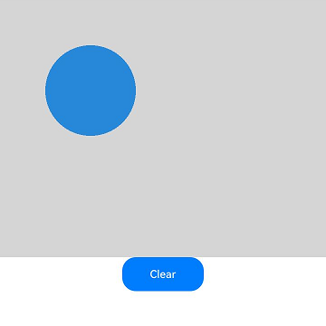

# DrawingRenderingContext
<!--Kit: ArkUI-->
<!--Subsystem: ArkUI-->
<!--Owner: @camlostshi-->
<!--Designer: @fenglinbailu-->
<!--Tester: @liuli0427-->
<!--Adviser: @Brilliantry_Rui-->

DrawingRenderingContext对象与Canvas组件绑定后，可在Canvas组件上进行绘制，绘制对象可以是形状、文本、图片等。绑定方式：通过Canvas组件构造函数传入DrawingRenderingContext对象建立绑定关系。绘制流程：通过canvas属性获取DrawingCanvas对象，调用drawing模块接口执行绘制操作，最后调用invalidate()方法触发重新渲染。适用于需要高性能图形绘制、自定义图表、图像编辑等场景，相比CanvasRenderingContext2D提供了更灵活的绘制接口。

> **说明：**
>
> 本模块首批接口从API version 12开始支持。后续版本的新增接口，采用上角标单独标记接口的起始版本。

## 接口

### constructor

constructor(unit?: LengthMetricsUnit)

构造使用drawing接口进行绘制的Canvas画布对象，支持配置DrawingRenderingContext对象的单位模式。构造成功后，可通过DrawingRenderingContext对象的canvas属性获取画布对象进行绘制操作。

**原子化服务API：** 从API version 12开始，该接口支持在原子化服务中使用。

**模型约束：** 此接口仅可在Stage模型下使用。

**系统能力：** SystemCapability.ArkUI.ArkUI.Full

**参数：**

| 参数名      | 类型 | 必填   | 说明 |
| -------- | ---------------------------------------- | ---- | ---------------------------------------- |
| unit  | [LengthMetricsUnit](../js-apis-arkui-graphics.md#lengthmetricsunit12) | 否    | 用来配置DrawingRenderingContext对象的单位模式，配置后无法更改，配置方法同[CanvasRenderingContext2D](ts-canvasrenderingcontext2d.md)。<br>可选值：DEFAULT（默认vp单位）、PX（px像素单位）。<br>异常值undefined、NaN和Infinity按默认值处理。<br>默认值：DEFAULT |

## size

get size(): Size

获取DrawingRenderingContext的大小。需要在Canvas组件上绑定DrawingRenderingContext对象后使用。返回的Size对象包含画布的宽度和高度信息，可用于计算绘制区域或调整绘制参数。

**原子化服务API：** 从API version 12开始，该接口支持在原子化服务中使用。

**模型约束：** 此接口仅可在Stage模型下使用。

**系统能力：** SystemCapability.ArkUI.ArkUI.Full

**返回值：**

| 类型          | 说明                                       |
| ----------- | ---------------------------------------- |
| [Size](#size-1) | DrawingRenderingContext的尺寸信息。 |

## canvas

get canvas(): DrawingCanvas

获取绘制内容的画布对象。需要在Canvas组件上绑定DrawingRenderingContext对象后使用。获取到的Canvas对象可用于绑定Brush、Pen等绘图工具，进行形状、文本、图片等绘制操作。

**原子化服务API：** 从API version 12开始，该接口支持在原子化服务中使用。

**模型约束：** 此接口仅可在Stage模型下使用。

**系统能力：** SystemCapability.ArkUI.ArkUI.Full

**返回值：**

| 类型          | 说明                                       |
| ----------- | ---------------------------------------- |
| [DrawingCanvas](#drawingcanvas对象说明) | 绘制内容的画布对象。 |

## invalidate

invalidate(): void

标记组件状态已变更，触发组件的重新渲染。需在Canvas组件绑定DrawingRenderingContext对象后，完成drawing绘制操作时调用，以将绘制内容渲染到屏幕上显示。

**原子化服务API：** 从API version 12开始，该接口支持在原子化服务中使用。

**模型约束：** 此接口仅可在Stage模型下使用。

**系统能力：** SystemCapability.ArkUI.ArkUI.Full

## DrawingCanvas对象说明

type DrawingCanvas = import('../api/@ohos.graphics.drawing').default.Canvas

可用于向DrawingRenderingContext上绘制内容的画布对象。

**原子化服务API：** 从API version 12开始，该接口支持在原子化服务中使用。

**模型约束：** 此接口仅可在Stage模型下使用。

**系统能力：** SystemCapability.ArkUI.ArkUI.Full

| 类型                  | 说明           |
| --------------------- | -------------- |
| import('../api/@ohos.graphics.drawing').default.[Canvas](../../apis-arkgraphics2d/arkts-apis-graphics-drawing-Canvas.md) | 返回一个Canvas对象，可用于在DrawingRenderingContext绑定的Canvas组件上绘制形状、文本、图片等内容。 |

## Size

DrawingRenderingContext的尺寸信息。

**原子化服务API：** 从API version 12开始，该接口支持在原子化服务中使用。

**模型约束：** 此接口仅可在Stage模型下使用。

**系统能力：** SystemCapability.ArkUI.ArkUI.Full

| 名称 | 类型 | 只读 | 可选 | 说明 |
| ---------- | -------------- | ------ | ---------------- | ------------------------ |
| width | number | 否 | 否 | 获取DrawingRenderingContext的宽度，其值为关联的Canvas组件的宽度。单位由constructor的unit参数配置决定，支持单位：vp、px。默认单位为vp。 |
| height | number | 否 | 否 | 获取DrawingRenderingContext的高度，其值为关联的Canvas组件的高度。单位由constructor的unit参数配置决定，支持单位：vp、px。默认单位为vp。 |

## 示例

### 示例1（绘制图形）

该示例实现了如何使用DrawingRenderingContext中的方法绘制图形。

```ts
import { common2D, drawing } from '@kit.ArkGraphics2D';

// xxx.ets
@Entry
@Component
struct CanvasExample {
  private context: DrawingRenderingContext = new DrawingRenderingContext();

  build() {
    Flex({ direction: FlexDirection.Column, alignItems: ItemAlign.Center, justifyContent: FlexAlign.Center }) {
      Canvas(this.context)
        .width('100%')
        .height('50%')
        .backgroundColor('#D5D5D5')
        .onReady(() => {
          let brush = new drawing.Brush();
          // 使用RGBA(39, 135, 217, 255)填充圆心为(200, 200)，半径为100的圆
          brush.setColor({
            alpha: 255,
            red: 39,
            green: 135,
            blue: 217
          });
          this.context.canvas.attachBrush(brush);
          this.context.canvas.drawCircle(200, 200, 100);
          this.context.canvas.detachBrush();
          this.context.invalidate();
        })
      Button("Clear")
        .width('120')
        .height('50')
        .onClick(() => {
          let color: common2D.Color = {
            alpha: 0,
            red: 0,
            green: 0,
            blue: 0
          };
          // 使用RGBA(0, 0, 0, 0)清空画布
          this.context.canvas.clear(color);
          this.context.invalidate();
        })
    }
    .width('100%')
    .height('100%')
  }
}
```

图1 绘制圆心为(200, 200)，半径为100的圆，填充色为RGBA(39, 135, 217, 255)

  

图2 点击Clear按钮清空画布

  

### 示例2（绘制文本）

该示例实现了通过[makeFromRawFile](../../apis-arkgraphics2d/arkts-apis-graphics-drawing-Typeface.md#makefromrawfile18)（从API version 18开始）加载自定义字体。并使用[drawTextBlob](../../apis-arkgraphics2d/arkts-apis-graphics-drawing-Canvas.md#drawtextblob)绘制文本，drawing接口绘制自定义文字时，不需要调用this.uiContext.getFont().[registerFont](../arkts-apis-uicontext-font.md#registerfont)或者fontCollection.[loadFontSync](../../apis-arkgraphics2d/js-apis-graphics-text.md#loadfontsync)提前注册字体，而是通过drawing.Typeface.[makeFromRawFile](../../apis-arkgraphics2d/arkts-apis-graphics-drawing-Typeface.md#makefromrawfile18)（从API version 18开始）传入rawfile目录下的自定义字体文件。

```ts
import { drawing } from '@kit.ArkGraphics2D';

// xxx.ets
@Entry
@Component
struct CanvasExample {
  private context: DrawingRenderingContext = new DrawingRenderingContext();

  build() {
    Flex({ direction: FlexDirection.Column, alignItems: ItemAlign.Center, justifyContent: FlexAlign.Center }) {
      Canvas(this.context)
        .width('100%')
        .height('50%')
        .backgroundColor('#D5D5D5')
        .onReady(() => {
          // 创建字体对象并设置字体大小为50
          let font = new drawing.Font();
          font.setSize(50);
          // 加载rawfile目录下的自定义字体文件HarmonyOS_Sans_Bold.ttf
          const myTypeFace = drawing.Typeface.makeFromRawFile($rawfile('HarmonyOS_Sans_Bold.ttf'));
          font.setTypeface(myTypeFace);
          // 创建文本Blob对象，参数依次为：文本内容、字体对象、文本编码格式
          const textBlob =
            drawing.TextBlob.makeFromString("Hello World", font, drawing.TextEncoding.TEXT_ENCODING_UTF8);
          // 在坐标(60, 100)处绘制文本Blob
          this.context.canvas.drawTextBlob(textBlob, 60, 100);
          this.context.invalidate();
        })
    }
    .width('100%')
    .height('100%')
  }
}
```

