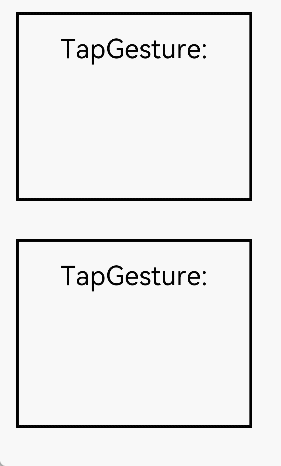

# 绑定手势方法

为组件绑定不同类型的手势事件，并设置事件的响应方法。

>  **说明：**
>
> - 本模块同时支持ArkTS-Dyn、ArkTS-Sta。
>
> - 本模块首批接口从API version 7开始支持。后续版本的新增接口，采用上角标单独标记接口的起始版本。


## 绑定手势识别

通过如下属性给组件绑定手势识别，手势识别成功后可以通过事件回调通知组件。
可以通过[触摸热区](ts-universal-attributes-touch-target.md)指定可识别手势的区域。

**原子化服务API：** 从API version 11开始，该接口支持在原子化服务中使用。

**系统能力：** SystemCapability.ArkUI.ArkUI.Full

| 名称 | 参数类型 | 默认值 | 描述 |
| -------- | -------- | -------- | -------- |
| gesture | gesture:&nbsp;[GestureType](#gesturetype),<br/>mask?:&nbsp;[GestureMask](#gesturemask枚举说明) | gesture:&nbsp;-，<br/>mask:&nbsp;GestureMask.Normal | 绑定手势。<br/>- gesture:&nbsp;绑定的手势类型。&nbsp;<br>- mask:&nbsp;事件响应设置。 |
| priorityGesture | gesture:&nbsp;[GestureType](#gesturetype),<br/>mask?:&nbsp;[GestureMask](#gesturemask枚举说明) | gesture:&nbsp;-，<br/>mask:&nbsp;GestureMask.Normal | 绑定优先识别手势。<br/>- gesture: 绑定的手势类型。 <br/>- mask: 事件响应设置。<br/>1、默认情况下，子组件优先识别通过gesture绑定的手势，当父组件配置priorityGesture时，父组件优先识别priorityGesture绑定的手势。<br/>2、长按手势时，设置触发长按的最短时间小的组件会优先响应，会忽略priorityGesture设置。|
| parallelGesture | gesture:&nbsp;[GestureType](#gesturetype),<br/>mask?:&nbsp;[GestureMask](#gesturemask枚举说明) | gesture:&nbsp;-，<br/>mask:&nbsp;GestureMask.Normal | 绑定可与子组件手势同时触发的手势。<br/>- gesture:&nbsp;绑定的手势类型。&nbsp;<br>- mask:&nbsp;事件响应设置。<br/>手势事件为非冒泡事件。父组件设置parallelGesture时，父子组件相同的手势事件都可以触发，实现类似冒泡效果。 |

>  **说明：**
>
>  gesture、priorityGesture和parallelGesture当前不支持使用三目运算符（条件? 表达式1 : 表达式2）切换手势绑定。


## 响应手势事件

组件通过手势事件绑定不同GestureType的手势对象，各手势对象在响应手势操作的事件回调中提供手势相关信息。下面通过TapGesture手势对象的onAction事件响应点击事件，获取事件相关信息。其余手势对象的事件定义见各个手势对象章节。 若需绑定多种手势，请使用[组合手势](ts-combined-gestures.md)。

**TapGesture事件说明**

| 名称 | 功能描述 |
| -------- | -------- |
| onAction((event:GestureEvent)&nbsp;=&gt;&nbsp;void) | Tap手势识别成功回调。 |

## SourceType枚举说明<sup>8+</sup>

**系统能力：** SystemCapability.ArkUI.ArkUI.Full

| 名称 | 值 | 说明 |
| -------- | -------- | -------- |
| Unknown | 0 | 未知设备。<br/>**原子化服务API：** 从API version 11开始，该接口支持在原子化服务中使用。<br/>**ArkTS-Dyn起始版本：** 8<br/>**ArkTS-Sta起始版本：** 23 |
| Mouse | 1 | 鼠标。<br/>**原子化服务API：** 从API version 11开始，该接口支持在原子化服务中使用。<br/>**ArkTS-Dyn起始版本：** 8<br/>**ArkTS-Sta起始版本：** 23 |
| TouchScreen | 2 | 触摸屏。<br/>**原子化服务API：** 从API version 11开始，该接口支持在原子化服务中使用。<br/>**ArkTS-Dyn起始版本：** 8<br/>**ArkTS-Sta起始版本：** 23 |
| KEY<sup>22+</sup> | 4 | 按键。<br/>**原子化服务API：** 从API version 22开始，该接口支持在原子化服务中使用。<br/>**ArkTS-Dyn起始版本：** 22<br/>**ArkTS-Sta起始版本：** 23 |
| JOYSTICK<sup>22+</sup> | 5 | 手柄。<br/>**原子化服务API：** 从API version 22开始，该接口支持在原子化服务中使用。<br/>**ArkTS-Dyn起始版本：** 22<br/>**ArkTS-Sta起始版本：** 23 |

## SourceTool枚举说明<sup>9+</sup>

**系统能力：** SystemCapability.ArkUI.ArkUI.Full

| 名称 | 描述 |
| -------- | -------- |
| Unknown | 未知输入源。<br/>**原子化服务API：** 从API version 11开始，该接口支持在原子化服务中使用。<br/>**ArkTS-Dyn起始版本：** 9<br/>**ArkTS-Sta起始版本：** 23 |
| Finger | 手指输入。<br/>**原子化服务API：** 从API version 11开始，该接口支持在原子化服务中使用。<br/>**ArkTS-Dyn起始版本：** 9<br/>**ArkTS-Sta起始版本：** 23 |
| Pen | 手写笔输入。<br/>**原子化服务API：** 从API version 11开始，该接口支持在原子化服务中使用。<br/>**ArkTS-Dyn起始版本：** 9<br/>**ArkTS-Sta起始版本：** 23 |
| MOUSE<sup>12+</sup> | 鼠标输入。<br/>**原子化服务API：** 从API version 12开始，该接口支持在原子化服务中使用。<br/>**ArkTS-Dyn起始版本：** 12<br/>**ArkTS-Sta起始版本：** 23 |
| TOUCHPAD<sup>12+</sup> | 触控板输入。触控板单指输入被视为鼠标输入操作。<br/>**原子化服务API：** 从API version 12开始，该接口支持在原子化服务中使用。<br/>**ArkTS-Dyn起始版本：** 12<br/>**ArkTS-Sta起始版本：** 23 |
| JOYSTICK<sup>12+</sup> | 手柄输入。<br/>**原子化服务API：** 从API version 12开始，该接口支持在原子化服务中使用。<br/>**ArkTS-Dyn起始版本：** 12<br/>**ArkTS-Sta起始版本：** 23 |


## 示例

### 示例1(父组件优先识别手势和父子组件同时触发手势)

该示例通过配置priorityGesture和parallelGesture分别实现了父组件优先识别手势和父子组件同时触发手势。

```ts
// xxx.ets
@Entry
@Component
struct GestureSettingsExample {
  @State priorityTestValue: string = ''
  @State parallelTestValue: string = ''

  build() {
    Column() {
      Column() {
        Text('TapGesture:' + this.priorityTestValue).fontSize(28)
          .gesture(
            TapGesture()
              .onAction((event: GestureEvent) => {
                this.priorityTestValue += '\nText'
              }))
      }
      .height(200)
      .width(250)
      .padding(20)
      .margin(20)
      .border({ width: 3 })
      // 设置为priorityGesture时，点击文本会忽略Text组件的TapGesture手势事件，优先识别父组件Column的TapGesture手势事件
      .priorityGesture(
        TapGesture()
          .onAction((event: GestureEvent) => {
            this.priorityTestValue += '\nColumn'
          }), GestureMask.IgnoreInternal)

      Column() {
        Text('TapGesture:' + this.parallelTestValue).fontSize(28)
          .gesture(
            TapGesture()
              .onAction((event: GestureEvent) => {
                this.parallelTestValue += '\nText'
              }))
      }
      .height(200)
      .width(250)
      .padding(20)
      .margin(20)
      .border({ width: 3 })
      // 设置为parallelGesture时，点击文本会同时触发子组件Text与父组件Column的TapGesture手势事件
      .parallelGesture(
        TapGesture()
          .onAction((event: GestureEvent) => {
            this.parallelTestValue += '\nColumn'
          }), GestureMask.Normal)
    }
  }
}
```



### 示例2（实时监测参与滑动手势的有效触点数量）

该示例通过配置fingerInfos实时监测参与滑动手势的有效触点数量

```ts
// xxx.ets
@Entry
@Component

struct PanGestureWithFingerCount {
  @State offsetX: number = 0
  @State offsetY: number = 0
  @State positionX: number = 0
  @State positionY: number = 0
  @State fingerCount: number = 0  //用于记录参与手势的触点数量

  private panOption: PanGestureOptions = new PanGestureOptions({
    direction: PanDirection.All,
    fingers: 1
  })

  build() {
    Column() {
      // 显示当前有效触点数量
      Text(`触点数量: ${this.fingerCount}`)
        .fontSize(20)
        .margin(10)

      Column() {
        Text('PanGesture offset:\nX: ' + this.offsetX + '\n' + 'Y: ' + this.offsetY)
      }
      .height(200)
      .width(300)
      .padding(20)
      .border({ width: 3 })
      .margin(50)
      .translate({ x: this.offsetX, y: this.offsetY, z: 0 })
      .gesture(
        PanGesture(this.panOption)
          .onActionStart((event: GestureEvent) => {
            console.info('Pan start')
            this.fingerCount = event.fingerInfos?.length || 0  // 记录触点数量
          })
          .onActionUpdate((event: GestureEvent) => {
            if (event) {
              console.log('fingerInfos',JSON.stringify(event.fingerInfos))
              this.offsetX = this.positionX + event.offsetX
              this.offsetY = this.positionY + event.offsetY
              this.fingerCount = event.fingerInfos?.length || 0  // 更新触点数量,记录下参与当前手势的有效触点的数量
            }
          })
          .onActionEnd((event: GestureEvent) => {
            this.positionX = this.offsetX
            this.positionY = this.offsetY
            this.fingerCount = 0  // 触点离开触摸区域后归零
            console.info('Pan end')
          })
          .onActionCancel(() => {
            this.fingerCount = 0  // 手势取消后归零
          })
      )

      Button('切换为双指滑动')
        .onClick(() => {
          this.panOption.setFingers(2)
        })
    }
  }
}
```
