# SVG新增解析能力
<!--Kit: ArkUI-->
<!--Subsystem: ArkUI-->
<!--Owner: @liyujie43-->
<!--Designer: @weixin_52725220-->
<!--Tester: @xiong0104-->
<!--Adviser: @HelloCrease-->

从API version 21开始，当Image组件的[supportSvg2](./ts-basic-components-image.md#supportsvg221)属性设置为true时，将启用新增的解析处理能力，主要涉及以下方面。

- 易用性提升：SVG图源颜色默认解析格式从#ARGB变更为符合SVG标准规范的#RGBA；引用的URL类型进行严格校验；Image组件的[colorFilter](./ts-basic-components-image.md#colorfilter9)属性对整个SVG图源生效；Image组件的[fillColor](./ts-basic-components-image.md#fillcolor20)属性不对SVG图源中fill = 'none'的元素填充颜色。

- 仿射变换能力扩展：支持变换全局中心点可配置；支持rotate旋转的局部中心点；支持矩阵(matrix)转换方式；支持非法值的校验；裁剪路径内支持仿射变换操作；组合场景支持仿射变换操作。

- 解析能力扩展：viewBox属性支持对齐和缩放规则可配置；支持裁剪路径单元的解析；支持渐变单元的解析；支持遮罩单元和遮罩内容单元的解析；支持图案单元和图案内容单元的解析；支持滤镜单元和原语单元解析。

- 显示效果扩展：分组标签g元素中透明度opacity对整个分组下的多层子元素生效；新增g标签内clip-path裁剪路径规则的处理；pattern新增平铺效果和偏移值处理；线性渐变和径向渐变新增平移和缩放效果；mask和filter的参数异常时默认效果变更。

## SVG易用性提升

SVG图源颜色默认解析格式从#ARGB变更为符合SVG标准规范的#RGBA；引用国际化资源标识（IRI）类型严格校验；调整Image组件的[colorFilter](./ts-basic-components-image.md#colorfilter9)属性生效范围；调整Image组件的[fillColor](./ts-basic-components-image.md#fillcolor20)属性生效范围。

### 颜色解析格式变更

当Image组件的SVG图源使用十六进制格式的颜色时，颜色默认解析格式从#ARGB变更为符合SVG标准规范的#RGBA，涉及的SVG属性包括fill、stroke、stopColor、stop-color。

>**说明：**
>
>SVG图片最终显示效果受Image组件的'objectFit'参数值影响，为了确保SVG图形完整且正确的显示，文档中用例图片都配置了'objectFit(ImageFit.Contain)'，开发者需要根据实际显示效果正确配置objectFit参数。

SVG图源属性设置8位十六进制格式的颜色时，示例图源和效果如下：

```xml
<svg width="200" height="200" xmlns="http://www.w3.org/2000/svg">
        <rect x="10" y="10" width="180" height="80" fill="#ff000030" />
</svg>
```

| 提升前                                                | 提升后                                                |
| :------------------------------------------------------------: | :------------------------------------------------------------: |
| 系统会把8位的十六进制颜色当#ARGB格式解析并显示。<br>例如fill="#ff000030"的矩形显示效果。<br>  | 系统会把8位的十六进制颜色当#RGBA格式解析并显示。<br>例如fill="#ff000030"的矩形显示效果。<br> |

SVG图源属性设置7位十六进制格式的颜色时，示例图源和效果如下：

```xml
<svg width="200" height="200" xmlns="http://www.w3.org/2000/svg">
        <rect x="10" y="10" width="180" height="80" fill="#BB88990" />
</svg>
```

| 提升前                                                | 提升后                                                |
| :------------------------------------------------------------: | :------------------------------------------------------------: |
| 系统会把7位的十六进制颜色当#ARGB格式解析并显示。<br>例如fill="#BB88990"的矩形显示效果。<br>  | 系统会把7位十六进制颜色解析成默认黑色并显示。<br>例如fill="#BB88990"的矩形显示效果。<br>  |

SVG图源属性设置4位十六进制格式的颜色时，示例图源和效果如下：

```xml
<svg width="200" height="200" xmlns="http://www.w3.org/2000/svg">
        <rect x="10" y="10" width="180" height="80" fill="#8888" />
</svg>
```

| 提升前                                                | 提升后                                                |
| :------------------------------------------------------------: | :------------------------------------------------------------: |
| 系统会把4位的十六进制颜色当#ARGB格式解析并显示。<br>例如fill="#8888"的矩形显示效果。<br>  | 系统会把4位的十六进制颜色当#RGBA解析并显示。<br>例如fill="#8888"的矩形显示效果（全透明）。<br>  |

### 引用国际化资源标识（IRI）类型严格校验

严格校验filter滤镜/clip-path裁剪路径/mask遮罩引用的URL类型，避免引用类型不匹配。

>**说明：**
>
>SVG图片最终显示效果受Image组件的'objectFit'参数值影响，为了确保SVG图形完整且正确的显示，文档中用例图片都配置了'objectFit(ImageFit.Contain)'，开发者需要根据实际显示效果正确配置objectFit参数。

| 提升前                                             | 提升后                                     |
| :---------------------------------------------------------: | :-------------------------------------------------: |
| 滤镜/裁剪路径/遮罩引用的URL类型不匹配，导致错误的显示效果。 | 滤镜/裁剪路径/遮罩引用的URL类型不匹配时，不显示对应效果。<br> 例如，mask、clippath、filter、pattern、渐变等标签都有各自的id，filter、clip-path和mask属性绑定其它类型的标签id时，对应效果不生效。只有mask属性绑定mask标签id、clip-path属性绑定clipPath标签id和filter属性绑定filter标签id时，对应效果才生效。 |

当URL类型不匹配时，遮罩效果不生效，示例图源如下：
```xml
<svg width="200" height="100" xmlns="http://www.w3.org/2000/svg">
  <!-- 定义遮罩 -->
  <defs>
    <clipPath id="myClipPath">
      <circle cx="50" cy="50" r="40"/>
    </clipPath>
    <mask id="myMask">
      <rect x="0" y="0" width="100" height="100" fill="red"/>
    </mask>
  </defs>

  <!-- 使用遮罩 -->
  <rect x="10" y="10" width="180" height="80" fill="blue" mask="url(#myClipPath)"/>
</svg>
```

### 调整colorFilter生效范围

Image组件的[colorFilter](./ts-basic-components-image.md#colorfilter9)属性从只对stroke边框生效调整为对整个SVG图源生效。

>**说明：**
>
>SVG图片最终显示效果受Image组件的'objectFit'参数值影响，为了确保SVG图形完整且正确的显示，文档中用例图片都配置了'objectFit(ImageFit.Contain)'，开发者需要根据实际显示效果正确配置objectFit参数。

| 原始图源                                                | 提升前                                                | 提升后                                                |
| :------------------------------------------------------------: | :------------------------------------------------------------: | :------------------------------------------------------------: |
|  | Image组件的colorFilter属性只对图源的stroke边框起作用。<br>  | Image组件的colorFilter属性对整个SVG图源起作用。<br>  |

示例图源和示例代码如下：

```xml
<svg width="200" height="200" xmlns="http://www.w3.org/2000/svg">
    <!-- 矩形 -->
    <rect x="10" y="10" width="180" height="80" stroke="gray" stroke-width='16' fill="orange"/>
</svg>
```

```ts
@Entry
@Component

struct Index {
  @State select: boolean = true
  @State effect:ImageFit = ImageFit.Contain
  build() {
    Row() {
      Column() {
        Image($rawfile('image111.svg'))
          .width(220)
          .height(220)
          .colorFilter(
            [ 0.6, 0, 0, 0, 0,
              0.2, 0.8, 0, 0, 0,
              0.2, 0.2, 1.2, 0, 0,
              0,   0,   0,   1, 0 ]
          )
          .supportSvg2(true)
      }
      .width('100%')
    }
    .height('100%')
  }
}
```

### 调整fillColor生效范围

当SVG图源中元素的fill属性为none时，Image组件的[fillColor](./ts-basic-components-image.md#fillcolor20)属性从填充颜色变更为不填充颜色。

>**说明：**
>
>SVG图片最终显示效果受Image组件的'objectFit'参数值影响，为了确保SVG图形完整且正确的显示，文档中用例图片都配置了'objectFit(ImageFit.Contain)'，开发者需要根据实际显示效果正确配置objectFit参数。

| 提升前                                                | 提升后                                                |
| :------------------------------------------------------------: | :------------------------------------------------------------: |
| Image组件的fillColor属性只对SVG图源中fill='none'的元素仍然填充颜色。<br>  | Image组件的fillColor属性对SVG图源中fill='none'的元素不填充颜色。<br>  |

示例图源和示例代码如下：
```xml
<svg width="200" height="200" xmlns="http://www.w3.org/2000/svg">
  <!-- 矩形 -->
  <rect x="10" y="10" width="180" height="80" stroke="blue" stroke-width='2' fill="none"/>
</svg>
```
```ts
@Entry
@Component

struct Index {
  @State select: boolean = true
  @State effect:ImageFit = ImageFit.Contain
  build() {
    Row() {
      Column() {
        Image($rawfile('image11.svg'))
          .width(220)
          .height(220)
          .fillColor('blue')
          .supportSvg2(true)
      }
      .width('100%')
    }
    .height('100%')
  }
}

```

## 仿射变换能力扩展

对于transform属性：支持变换全局中心点可配置；支持rotate旋转的局部中心点；支持矩阵(matrix)转换方式；支持非法值的校验；裁剪路径内支持仿射变换操作；组合场景支持仿射变换操作。

### 支持变换全局中心点配置

SVG新增支持解析transform-origin属性来配置全局中心点的能力，前后效果对比如下表格说明：

>**说明：**
>
>SVG图片最终显示效果受Image组件的'objectFit'参数值影响，为了确保SVG图形完整且正确的显示，文档中用例图片都配置了'objectFit(ImageFit.Contain)'，开发者需要根据实际显示效果正确配置objectFit参数。

|                           SVG场景                            |                        扩展前                         |                        扩展后                         |
| :----------------------------------------------------------: | :----------------------------------------------------------: | :----------------------------------------------------------: |
|        SVG基本图形配置变换功能和transform-origin属性。        | 固定按照SVG的ViewPort左上角坐标点(0,0)作为变换中心点进行仿射变换。 | 按照全局中心点（transform-origin）属性指定的坐标偏移(x,y)作为变换中心点进行仿射变换。 |
| transform属性设置rotate旋转功能，同时配置transform-origin属性。</br>全局中心点值为图形元素右下角，如:'transform="rotate(30)" transform-origin="150 150"'。 |  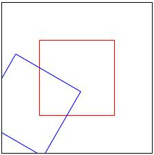  |     |
| transform属性设置scale缩放功能，同时配置transform-origin属性。</br>全局中心点值为图形元素右下角，如:'transform="scale(0.77)" transform-origin="150 150"'。 |     |      |
| transform属性设置skewX按x轴倾斜的功能，同时配置transform-origin属性。</br>全局中心点值为图形元素右下角，如:'transform="skewX(30)" transform-origin="150 150"'。 |  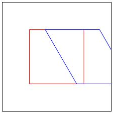   |      |
| transform属性设置skewY按y轴倾斜的功能，同时配置transform-origin属性。</br>全局中心点值为图形元素右下角，如:'transform="skewY(30)" transform-origin="150 150"'。 |     |      |
| transform属性设置translate平移功能，同时配置transform-origin属性。</br>全局中心点值为图形元素右下角，如:'transform="translate(30,30)" transform-origin="150 150"'。 |  | 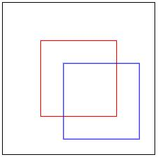 |
| transform属性链式调用多个功能，同时配置transform-origin属性。</br>全局中心点值为图形元素右下角，如:transform='"translate(10,10) rotate(10) scale(0.5) skewX(10)" transform-origin="150 150"'。 |   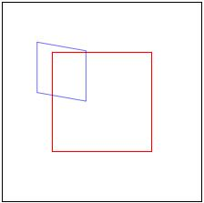   |       |

### 支持rotate旋转功能局部中心点配置

SVG新增支持解析rotate旋转的局部中心点功能，例如'rotate(30, -10, -10)'的'30'是旋转角度，后2个参数'-10, -10'是旋转的局部中心点坐标。支持rotate局部中心点前后效果对比如下表格说明。

>**说明：**
>
>SVG图片最终显示效果受Image组件的'objectFit'参数值影响，为了确保SVG图形完整且正确的显示，文档中用例图片都配置了'objectFit(ImageFit.Contain)'，开发者需要根据实际显示效果正确配置objectFit参数。

| SVG场景                                                         | 扩展前                                                | 扩展后                                                |
| :------------------------------------------------------------: | :------------------------------------------------------------: | :------------------------------------------------------------: |
| SVG基本图形同时配置两个属性：</br>局部中心点和transform-origin，如'transform="rotate(30, -10, -10)" transform-origin="150 150"'。 | 按照局部中心点：rotate功能的最后2个参数指定的坐标偏移(x,y)作为变换中心点进行旋转。</br>  | 按照全局中心点transform-origin属性指定的坐标偏移(x,y)加局部中心点坐标偏移的和作为变换中心点进行旋转。</br>  |

### 支持矩阵(matrix)转换

SVG新增支持解析transform属性的matrix矩阵转换能力。matrix允许对元素进行复杂的线性变换，包括平移、旋转、缩放和倾斜等，例如matrix(a, b, c, d, e, f)。其中各个字段的元素作用如下：a‌控制元素在x方向上的缩放，b‌控制元素在x方向上的倾斜，c‌控制元素在y方向上的倾斜‌，d‌控制元素在y方向上的缩放‌，e控制元素在x方向上的平移‌，f控制元素在y方向上的平移。

>**说明：**
>
>SVG图片最终显示效果受Image组件的'objectFit'参数值影响，为了确保SVG图形完整且正确的显示，文档中用例图片都配置了'objectFit(ImageFit.Contain)'，开发者需要根据实际显示效果正确配置objectFit参数。

| SVG场景                                                         | 扩展前                                                | 扩展后                                                |
| :------------------------------------------------------------: | :------------------------------------------------------------: | :------------------------------------------------------------: |
| transform属性设置matrix矩阵变换，同时配置transform-origin属性。</br>全局中心点值为图形元素右下角，如:'transform="matrix(0.812,0.278,0.139,0.763,5.000,5.000" transform-origin="150 150"')。 |  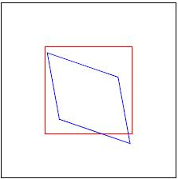  |     |

### 支持非法值校验

SVG新增支持校验transform属性非法值的能力。对于transform属性，当设置参数为非法值或者参数个数非法时，按如下表格说明处理：

>**说明：**
>
>SVG图片最终显示效果受Image组件的'objectFit'参数值影响，为了确保SVG图形完整且正确的显示，文档中用例图片都配置了'objectFit(ImageFit.Contain)'，开发者需要根据实际显示效果正确配置objectFit参数。

| SVG场景                                                         | 扩展前                                                | 扩展后                                                |
| :------------------------------------------------------------: | :------------------------------------------------------------: | :------------------------------------------------------------: |
| 当变形功能参数为非法值，如rotate旋转功能的角度参数为非法值：'transform="rotate(30deg)"'。 | 按照第一个参数可解析出的数值(30)作为旋转角度进行旋转。</br>  | 不做旋转。</br>  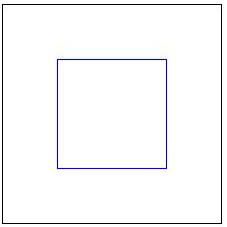 |
| 当变形功能参数为非法值，如rotate旋转功能的局部中心点参数为非法：'transform="rotate(30,abc,abc)"'。 | 按照SVG的ViewPort左上角坐标点(0,0)作为变换中心点，并根据旋转角度30度进行旋转。</br>   | 不做旋转。</br>   |
| 当变形功能参数数量为非法时，如scale功能的参数个数为非法：'transform="scale(0.5, 0.5, 0.5)"'。 | 取前2个合法参数作为x轴和y轴的缩放比例(0.5,0.5)缩放。</br>  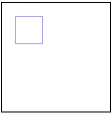 | 不做变形。</br>   |
| 当链式调用多个变形功能，其中某个功能参数为非法，如'transform="rotate(30) skewX(abc) scale(0.5, 0.5)"'。 | 不处理非法的变形功能skewX，处理合法的变形功能rotate和scale。</br>   | 所有的做变形功能均不处理。</br>  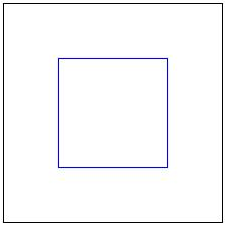 |

### 裁剪路径内支持仿射变换操作

支持clip-path裁剪路径内的transform仿射变换操作。

>**说明：**
>
>SVG图片最终显示效果受Image组件的'objectFit'参数值影响，为了确保SVG图形完整且正确的显示，文档中用例图片都配置了'objectFit(ImageFit.Contain)'，开发者需要根据实际显示效果正确配置objectFit参数。

```xml
<svg width="300" height="300" xmlns="http://www.w3.org/2000/svg">
  <!-- 定义一个ID为circleClip的clipPath，使用objectBoundingBox单位 -->
  <defs>
    <clipPath id="circleClip" clipPathUnits="objectBoundingBox">
      <!-- 圆心在对象中心，半径为0.5，即圆覆盖整个对象 -->
      <circle cx="50" cy="50" r="40" transform="translate(50 50)" />
    </clipPath>
  </defs>

  <!-- 应用clipPath到一个矩形上 -->
  <rect x="10" y="10" width="250" height="250" fill="blue"
        clip-path="url(#circleClip)" />
</svg>
```

| 扩展前                                                | 扩展后                                                |
| :------------------------------------------------------------: | :------------------------------------------------------------: |
|  |  |

### 组合场景支持仿射变换操作

支持多种元素组合场景的仿射变换操作。

>**说明：**
>
>SVG图片最终显示效果受Image组件的'objectFit'参数值影响，为了确保SVG图形完整且正确的显示，文档中用例图片都配置了'objectFit(ImageFit.Contain)'，开发者需要根据实际显示效果正确配置objectFit参数。

transform操作在use中，use对象也在相同的mask元素内。

```xml
<svg width="300" height="300" xmlns="http://www.w3.org/2000/svg" xmlns:xlink="http://www.w3.org/1999/xlink">
  <defs>
    <mask id="mask1"  width="1" height="1" maskContentUnits="objectBoundingBox">
	  <use xlink:href="#rect1" transform="translate(0.6, 0.000000) scale(0.5 0.5)" />
      <rect id="rect1" x="0" y="0" width="0.5" height="0.5" fill="red"  />
    </mask>
  </defs>
  <rect x="0" y="0" width="300" height="100" fill="red"  mask="url(#mask1)" />
  <rect x="0" y="0" width="300" height="100" fill="none"  stroke="black" stroke-width="2" />
</svg> 
```

| 扩展前                                                | 扩展后                                                |
| :------------------------------------------------------------: | :------------------------------------------------------------: |
|  |  |

transform操作在g标签中，且不包含scale操作。

```xml
<svg width="300" height="300" xmlns="http://www.w3.org/2000/svg" xmlns:xlink="http://www.w3.org/1999/xlink">
  <defs>
    <mask id="mask1"  width="1" height="1" maskContentUnits="objectBoundingBox">
    	<g transform="translate(0.6, 0.000000)">
      <rect id="rect1" x="0" y="0" width="0.5" height="0.5"  fill="red"  />
      </g>
    </mask>
  </defs>
  <rect x="0" y="0" width="300" height="100" fill="red"  mask="url(#mask1)" />
  <rect x="0" y="0" width="300" height="100" fill="none"  stroke="black" stroke-width="2" />
</svg> 
```

| 扩展前                                                | 扩展后                                                |
| :------------------------------------------------------------: | :------------------------------------------------------------: |
| 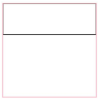 |  |

## SVG解析能力扩展

viewBox属性支持对齐和缩放规则可配置；支持裁剪路径单元的解析；支持渐变单元的解析；支持遮罩单元和遮罩内容单元的解析；支持图案单元和图案内容单元的解析；支持滤镜单元和原语单元解析。

### viewBox属性支持对齐和缩放规则可配置

viewBox主要用来控制在SVG动态拉伸效果，可以通过参数preserveAspectRatio来控制内容区显示的对齐和缩放规则。

>**说明：**
>
>SVG图片最终显示效果受Image组件的'objectFit'参数值影响，为了确保SVG图形完整且正确的显示，文档中用例图片都配置了'objectFit(ImageFit.Contain)'，开发者需要根据实际显示效果正确配置objectFit参数。

SVG包含“preserveAspectRatio”属性且值为“none”，示例图源和行为变更如下：

```xml
<svg width="200" height="100" viewBox="0 0 100 100" preserveAspectRatio="none" xmlns="http://www.w3.org/2000/svg">
  <circle cx="50" cy="20" r="20" fill="red"/>
  <line x1="0" y1="0" x2="0" y2="500" stroke="black" stroke-width="2" /> <!-- x 轴 -->
  <line x1="0" y1="0" x2="500" y2="0" stroke="black" stroke-width="2" /> <!-- y 轴 -->
</svg>
```

| 参数值 | 扩展前                                                | 扩展后                                                |
| ------ | ------------------------------------------------------------ | ------------------------------------------------------------ |
| none   | 按宽高比最小值进行统一缩放。<br/>同时将SVG元素的viewBox属性的X的中点值与视图的X的中点值对齐，<br/>将SVG元素的viewBox属性的Y的中点值与视图的Y的中点值对齐。<br/> | 缩放元素的图形内容，使元素的边界完全匹配视图矩形。<br/><br/><br/>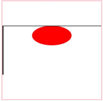 |

SVG包含“preserveAspectRatio”属性且值为“&lt;align&gt;  [&lt;meetOrSlice&gt;]”，示例图源和对齐方式、缩放比例变更如下：

```xml
<svg width="200" height="100" viewBox="0 0 100 100" preserveAspectRatio="xMinYMin meet" xmlns="http://www.w3.org/2000/svg">
  <circle cx="50" cy="20" r="20" fill="red"/>
  <line x1="0" y1="0" x2="0" y2="500" stroke="black" stroke-width="2" /> <!-- x 轴 -->
  <line x1="0" y1="0" x2="500" y2="0" stroke="black" stroke-width="2" /> <!-- y 轴 -->
</svg>
```

| 参数值         | 扩展前                                                | 扩展后                                                |
| -------------- | ------------------------------------------------------------ | ------------------------------------------------------------ |
| xMinYMin meet  | 按宽高比最小值进行统一缩放。<br/>SVG元素的viewBox属性的X的中点值与视图的X的中点值对齐，<br/>SVG元素的viewBox属性的Y的中点值与视图的Y的中点值对齐。<br/> | 按宽高比最小值进行统一缩放。<br/>SVG元素的viewBox属性的X的最小值与视图的X的最小值对齐，<br/>SVG元素的viewBox属性的Y的最小值与视图的Y的最小值对齐。<br/> |
| xMaxYMin meet  | 按宽高比最小值进行统一缩放。<br/>SVG元素的viewBox属性的X的中点值与视图的X的中点值对齐，<br/>SVG元素的viewBox属性的Y的中点值与视图的Y的中点值对齐。<br/> | 按宽高比最小值进行统一缩放。<br/>SVG元素的viewBox属性的X的最小值+元素的宽度与视图的X的最大值对齐，<br/>SVG元素的viewBox属性的Y的最小值与视图的Y的最小值对齐。<br/> |
| xMinYMid meet  | 按宽高比最小值进行统一缩放。<br/>SVG元素的viewBox属性的X的中点值与视图的X的中点值对齐，<br/>SVG元素的viewBox属性的Y的中点值与视图的Y的中点值对齐。<br/> | 按宽高比最小值进行统一缩放。<br/>SVG元素的viewBox属性的X的最小值与视图的X的最小值对齐，<br/>SVG元素的viewBox属性的Y的中点值与视图的Y的中点值对齐。<br/> |
| xMaxYMid meet  | 按宽高比最小值进行统一缩放。<br/>SVG元素的viewBox属性的X的中点值与视图的X的中点值对齐，<br/>SVG元素的viewBox属性的Y的中点值与视图的Y的中点值对齐。<br/> | 按宽高比最小值进行统一缩放。<br/>SVG元素的viewBox属性的X的最小值+元素的宽度与视图的X的最大值对齐，<br/>SVG元素的viewBox属性的Y的中点值与视图的Y的中点值对齐。<br/> |
| xMinYMax meet  | 按宽高比最小值进行统一缩放。<br/>SVG元素的viewBox属性的X的中点值与视图的X的中点值对齐，<br/>SVG元素的viewBox属性的Y的中点值与视图的Y的中点值对齐。<br/> | 按宽高比最小值进行统一缩放。<br/>SVG元素的viewBox属性的X的最小值与视图的X的最小值对齐，<br/>SVG元素的viewBox属性的Y的最小值+元素的高度与视图的Y的最大值对齐。<br/> |
| xMaxYMax meet  | 按宽高比最小值进行统一缩放。<br/>SVG元素的viewBox属性的X的中点值与视图的X的中点值对齐，<br/>SVG元素的viewBox属性的Y的中点值与视图的Y的中点值对齐。<br/> | 按宽高比最小值进行统一缩放。<br/>SVG元素的viewBox属性的X的最小值+元素的宽度与视图的X的最大值对齐，<br/>SVG元素的viewBox属性的Y的最小值+元素的高度与视图的Y的最大值对齐。<br/> |
| xMinYMin slice | 按宽高比最小值进行统一缩放。<br/>SVG元素的viewBox属性的X的中点值与视图的X的中点值对齐，<br/>SVG元素的viewBox属性的Y的中点值与视图的Y的中点值对齐。<br/> | 按宽高比最大值进行统一缩放。<br/>SVG元素的viewBox属性的X的最小值与视图的X的最小值对齐，<br/>SVG元素的viewBox属性的Y的最小值与视图的Y的最小值对齐。<br/>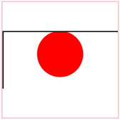 |
| xMidYMin slice | 按宽高比最小值进行统一缩放。<br/>SVG元素的viewBox属性的X的中点值与视图的X的中点值对齐，<br/>SVG元素的viewBox属性的Y的中点值与视图的Y的中点值对齐。<br/> | 按宽高比最大值进行统一缩放。<br/>SVG元素的viewBox属性的X的中点值与视图的X的中点值对齐，<br/>SVG元素的viewBox属性的Y的最小值与视图的Y的最小值对齐。<br/> |
| xMaxYMin slice | 按宽高比最小值进行统一缩放。<br/>SVG元素的viewBox属性的X的中点值与视图的X的中点值对齐，<br/>SVG元素的viewBox属性的Y的中点值与视图的Y的中点值对齐。<br/> | 按宽高比最大值进行统一缩放。<br/>SVG元素的viewBox属性的X的最小值+元素的宽度与视图的X的最大值对齐，<br/>SVG元素的viewBox属性的Y的最小值与视图的Y的最小值对齐。<br/> |
| xMinYMid slice | 按宽高比最小值进行统一缩放。<br/>SVG元素的viewBox属性的X的中点值与视图的X的中点值对齐，<br/>SVG元素的viewBox属性的Y的中点值与视图的Y的中点值对齐。<br/> | 按宽高比最大值进行统一缩放。<br/>SVG元素的viewBox属性的X的最小值与视图的X的最小值对齐，<br/>SVG元素的viewBox属性的Y的中点值与视图的Y的中点值对齐。<br/>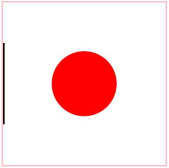 |
| xMidYMid slice | 按宽高比最小值进行统一缩放。<br/>SVG元素的viewBox属性的X的中点值与视图的X的中点值对齐，<br/>SVG元素的viewBox属性的Y的中点值与视图的Y的中点值对齐。<br/> | 按宽高比最大值进行统一缩放。<br/>SVG元素的viewBox属性的X的中点值与视图的X的中点值对齐，<br/>SVG元素的viewBox属性的Y的中点值与视图的Y的中点值对齐。<br/> |
| xMaxYMid slice | 按宽高比最小值进行统一缩放。<br/>SVG元素的viewBox属性的X的中点值与视图的X的中点值对齐，<br/>SVG元素的viewBox属性的Y的中点值与视图的Y的中点值对齐。<br/> | 按宽高比最大值进行统一缩放。<br/>SVG元素的viewBox属性的X的最小值+元素的宽度与视图的X的最大值对齐，<br/>SVG元素的viewBox属性的Y的中点值与视图的Y的中点值对齐。<br/> |
| xMinYMax slice | 按宽高比最小值进行统一缩放。<br/>SVG元素的viewBox属性的X的中点值与视图的X的中点值对齐，<br/>SVG元素的viewBox属性的Y的中点值与视图的Y的中点值对齐。<br/> | 按宽高比最大值进行统一缩放。<br/>SVG元素的viewBox属性的X的最小值与视图的X的最小值对齐，<br/>SVG元素的viewBox属性的Y的最小值+元素的高度与视图的Y的最大值对齐。<br/> |
| xMidYMax slice | 按宽高比最小值进行统一缩放。<br/>SVG元素的viewBox属性的X的中点值与视图的X的中点值对齐，<br/>SVG元素的viewBox属性的Y的中点值与视图的Y的中点值对齐。<br/> | 按宽高比最大值进行统一缩放。<br/>SVG元素的viewBox属性的X的中点值与视图的X的中点值对齐，<br/>SVG元素的viewBox属性的Y的最小值+元素的高度与视图的Y的最大值对齐。<br/>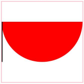 |
| xMaxYMax slice | 按宽高比最小值进行统一缩放。<br/>SVG元素的viewBox属性的X的中点值与视图的X的中点值对齐，<br/>SVG元素的viewBox属性的Y的中点值与视图的Y的中点值对齐。<br/> | 按宽高比最大值进行统一缩放。<br/>将SVG元素的viewBox属性的X的最小值+元素的宽度与视图的X的最大值对齐，<br/>SVG元素的viewBox属性的Y的最小值+元素的高度与视图的Y的最大值对齐。<br/> |

### 支持裁剪路径单元的解析

支持裁剪路径单元值clipPathUnits的解析，增加clipPathUnits为objectBoundingBox（被应用元素的边框作为基准的坐标系）场景的处理。

>**说明：**
>
>SVG图片最终显示效果受Image组件的'objectFit'参数值影响，为了确保SVG图形完整且正确的显示，文档中用例图片都配置了'objectFit(ImageFit.Contain)'，开发者需要根据实际显示效果正确配置objectFit参数。

下面图源示例当裁剪路径单元为"objectBoundingBox"时，长方形裁剪路径位于应用裁剪路径长方形图形左上角x,y乘以图形包围盒宽度和高度。尺寸为width乘以图形包围盒的宽度，height乘以图形包围盒的高度。

```xml
<svg width="200" height="200" xmlns="http://www.w3.org/2000/svg">
  <defs>
    <clipPath id="clip1" clipPathUnits="objectBoundingBox">
      <rect x="0.2" y="0.2" width="0.7" height="0.6" />
    </clipPath>
  </defs>
  <rect x="10" y="10" width="100" height="100" fill="blue" clip-path="url(#clip1)" />
</svg>
```

| 扩展前                                           | 扩展后                                          |
| ------------------------------------------------------- | ------------------------------------------------------ |
|  |  |

### 支持渐变单元的解析

支持裁剪路径单元值gradientUnits的解析，增加gradientUnits为objectBoundingBox（被应用元素的边框作为基准的坐标系）场景的处理。

>**说明：**
>
>SVG图片最终显示效果受Image组件的'objectFit'参数值影响，为了确保SVG图形完整且正确的显示，文档中用例图片都配置了'objectFit(ImageFit.Contain)'，开发者需要根据实际显示效果正确配置objectFit参数。

图源示例显示一个线性渐变从绝对坐标(10，10) 到 (180，180)的长方形范围内。

```xml
 <svg width="200" height="200" xmlns="http://www.w3.org/2000/svg">
  <defs>
    <linearGradient id="grad1" x1="10" y1="10" x2="180" y2="180"  gradientUnits="userSpaceOnUse">
      <stop offset="0%" style="stop-color:rgb(255,0,0);stop-opacity:1" />
      <stop offset="100%" style="stop-color:rgb(0,0,255);stop-opacity:1" />
    </linearGradient>
  </defs>
  <rect x="10" y="10" width="180" height="180" fill="url(#grad1)" />
</svg>
```

| 扩展前                                                | 扩展后                                               |
| ------------------------------------------------------------ | ----------------------------------------------------------- |
| 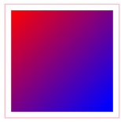 |  |

图源示例显示一个径向渐变从绝对坐标圆心 (100，90) 开始，半径为90的渐变效果。

```xml
<svg width="200" height="200" xmlns="http://www.w3.org/2000/svg">
  <defs>
     <radialGradient id="grad2" cx="100" cy="100" r="90" gradientUnits="userSpaceOnUse">
      <stop offset="0%" style="stop-color:rgb(255,0,0);stop-opacity:1" />
      <stop offset="100%" style="stop-color:rgb(0,0,255);stop-opacity:1" />
    </radialGradient>
  </defs>
  <circle cx="100" cy="100" r="90" fill="url(#grad2)" />
</svg>
```

| 扩展前                                                | 扩展后                                                |
| ------------------------------------------------------------ | ------------------------------------------------------------ |
|  |  |

### 支持遮罩单元和遮罩内容单元的解析

支持遮罩单元maskUnits和遮罩内容单元maskContentUnits的解析，增加maskContentUnits和maskUnits为objectBoundingBox（被应用元素的边框作为基准的坐标系）场景的处理。

>**说明：**
>
>SVG图片最终显示效果受Image组件的'objectFit'参数值影响，为了确保SVG图形完整且正确的显示，文档中用例图片都配置了'objectFit(ImageFit.Contain)'，开发者需要根据实际显示效果正确配置objectFit参数。

图源示例显示一个五角星遮罩范围从绝对坐标 (10，10)到(200，200)，遮罩内容相对于应用矩形左上角，水平尺寸乘以图形包围盒宽度，垂直尺寸乘以图形包围盒高度。

```xml
<svg width="220" height="220" xmlns="http://www.w3.org/2000/svg">
  <defs>
    <mask id="mask1" maskUnits="userSpaceOnUse" x="10" y="10" width="200" height="200" clip-rule="evenodd" maskContentUnits="objectBoundingBox">
		<path d="M 0.5,0.05 L 0.2,0.99 L 0.95,0.39 L 0.05,0.39 L 0.8,0.99 Z" fill="blue" fill-rule="nonzero"/>
    </mask>
  </defs>
  <rect x="10" y="10" width="200" height="200" fill="red" mask="url(#mask1)" />
</svg>
```

| 扩展前                                       | 扩展后                                      |
| --------------------------------------------------- | -------------------------------------------------- |
|  |  |

### 支持图案单元和图案内容单元的解析

支持图案单元patternUnits和图案内容单元patternContentUnits的解析，增加patternUnits和patternContentUnits为objectBoundingBox（被应用元素的边框作为基准的坐标系）场景的处理。

>**说明：**
>
>SVG图片最终显示效果受Image组件的'objectFit'参数值影响，为了确保SVG图形完整且正确的显示，文档中用例图片都配置了'objectFit(ImageFit.Contain)'，开发者需要根据实际显示效果正确配置objectFit参数。

示例图源图案单元位置尺寸为绝对坐标，图案内容位置、尺寸相对于应用图案的图形，横轴乘以图形包围盒宽度，纵轴乘以图形高度。

```xml
<svg width="220" height="220" xmlns="http://www.w3.org/2000/svg">
  <defs>
    <pattern id="pattern1" patternUnits="userSpaceOnUse" x="10" y="10" width="100" height="100" patternContentUnits="objectBoundingBox" >
      <rect x="0" y="0" width="0.25" height="0.25" fill="red" opacity="0.5" />
      <rect x="0.25" y="0.25" width="0.25" height="0.25" fill="blue" opacity="0.5" />
    </pattern>
  </defs>
  <rect x="10" y="10" width="200" height="200"  stroke="red" stroke-width="2" fill="url(#pattern1)"/>
</svg>
```

| 扩展前                                          | 扩展后                                         |
| ------------------------------------------------------ | ----------------------------------------------------- |
| 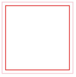 | 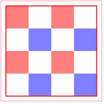 |

### 支持滤镜单元和原语单元解析

支持滤镜单元filterUnits和原语单元primitiveUnits的解析，增加filterUnits和primitiveUnits为objectBoundingBox（被应用元素的边框作为基准的坐标系）场景的处理。目前支持到的原语有feFlood,feOffset,feGaussianBlur,feBlood,feColorMatrix,feComposite。

>**说明：**
>
>SVG图片最终显示效果受Image组件的'objectFit'参数值影响，为了确保SVG图形完整且正确的显示，文档中用例图片都配置了'objectFit(ImageFit.Contain)'，开发者需要根据实际显示效果正确配置objectFit参数。

图源示例：原语值为"objectBoundingBox"时，feGaussianBlur的模糊标准差X，Y轴的stdDeviation数值分别需要乘以
应用滤镜图形包围盒的宽度和高度。滤镜原语子区间x，y坐标相对图形左上角分别乘以图形包围盒的宽度和高度，滤镜原语子区间尺寸的width，height参数分别乘以图形包围盒的宽度和高度。

```xml
 <svg width="400" height="400" xmlns="http://www.w3.org/2000/svg"> 
 <defs>
   <filter id="blend" primitiveUnits="objectBoundingBox">
     <feGaussianBlur in="SourceGraphic" stdDeviation="0.1, 0.1" x="25%" y="25%" width="50%" height="50%" />
   </filter>
 </defs>
 
 <g fill="none" stroke="blue" stroke-width="4">
    <rect width="200" height="200" fill="none"/>
    <line x2="200" y2="200"  stroke="blue" stroke-width="4" />
    <line x1="200" y2="200"  stroke="blue" stroke-width="4"/>
 </g>
 <circle fill="green" filter="url(#blend)" cx="100" cy="100" r="90"/>
 </svg>
```

| 扩展前                                                | 扩展后                                                |
| ------------------------------------------------------------ | ------------------------------------------------------------ |
|  |  |


## 显示效果扩展

分组标签g元素中透明度opacity对整个分组下的多层子元素生效；新增g标签内clip-path裁剪路径规则的处理；pattern新增平铺效果和偏移值处理；线性渐变和径向渐变新增平移和缩放效果；mask和filter的参数异常时默认效果变更。

### 分组标签中透明度

分组标签g元素中透明度opacity从对整个分组下的一层子元素生效到对整个分组下的多层子元素生效。

>**说明：**
>
>SVG图片最终显示效果受Image组件的'objectFit'参数值影响，为了确保SVG图形完整且正确的显示，文档中用例图片都配置了'objectFit(ImageFit.Contain)'，开发者需要根据实际显示效果正确配置objectFit参数。

示例图源有两层分组标签嵌套，被裁剪路径截取的半圆形的透明度为0.4。

```xml
<svg  width="200" height="200" viewBox = "0 0 200 200" xmlns="http://www.w3.org/2000/svg">
  <defs>
    <clipPath id="myClip" clipPathUnits="userSpaceOnUse">
      <rect x="25" y="0" width="60" height="60" />
    </clipPath>
  </defs>
  <g opacity="0.4" clip-path="url(#myClip)"  fill="red"  > 
    <g >
    <circle cx="25" cy="25" r="25"  />
    </g>
  </g>
</svg>
```

| 扩展前                                              | 扩展后                                             |
| ---------------------------------------------------------- | --------------------------------------------------------- |
|  | 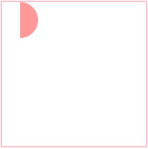 |

### 分组标签内引用裁剪路径规则

新增g标签内clip-path裁剪路径规则的处理。

>**说明：**
>
>SVG图片最终显示效果受Image组件的'objectFit'参数值影响，为了确保SVG图形完整且正确的显示，文档中用例图片都配置了'objectFit(ImageFit.Contain)'，开发者需要根据实际显示效果正确配置objectFit参数。

示例图源裁剪路径引用于g标签里，默认裁剪路径规则为"nonezero"，路径标签里的填充规则为"evenodd"，
左图实际的填充规则为"evenodd"，右图的填充规则为裁剪路径的默认规则，也就是"nonezero"。

```xml
<svg width="200" height="200" xmlns="http://www.w3.org/2000/svg">
  <!-- 定义五角星裁剪路径 -->
  <defs>
    <clipPath id="heartClipPath" >
   <path d="M 100,10 L 40,198 L 190,78 L 10,78 L 160,198 Z" fill-rule="evenodd" /> 
    </clipPath>
  </defs>

  <!-- 应用裁剪路径到矩形 -->
  <g opacity="0.4" clip-path="url(#heartClipPath)" >
  <rect x="0" y="0" width="200" height="200" fill="red"  />
  </g>
</svg>
```

| 扩展前                                                | 扩展后                                                |
| ------------------------------------------------------------ | ------------------------------------------------------------ |
|  | 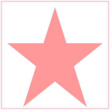 |

### pattern新增平铺效果

pattern图案新增重复平铺效果。

>**说明：**
>
>SVG图片最终显示效果受Image组件的'objectFit'参数值影响，为了确保SVG图形完整且正确的显示，文档中用例图片都配置了'objectFit(ImageFit.Contain)'，开发者需要根据实际显示效果正确配置objectFit参数。

示例图源如下：

```xml
  <svg width="210" height="210" xmlns="http://www.w3.org/2000/svg">
  <defs>
    <pattern id="pattern1"  x="0" y="0" width="0.5" height="0.5"  >
      <rect x="0" y="0" width="50" height="50" fill="red" />
      <rect x="50" y="50" width="50" height="50" fill="blue" />
    </pattern>
  </defs>
  <rect x="10" y="10" width="200" height="200" fill="url(#pattern1)" />
</svg>
```

| 扩展前                                                | 扩展后                                                |
| ------------------------------------------------------------ | ------------------------------------------------------------ |
| 图案不支持重复平铺。<br> 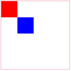 | 图案支持重复平铺<br>  |

### pattern偏移值处理

支持pattern图案在x，y参数非0时，从只显示平移后的部分图形变更为显示完整图形。

>**说明：**
>
>SVG图片最终显示效果受Image组件的'objectFit'参数值影响，为了确保SVG图形完整且正确的显示，文档中用例图片都配置了'objectFit(ImageFit.Contain)'，开发者需要根据实际显示效果正确配置objectFit参数。

```xml
<svg width="40" height="40" viewBox="0 0 40 40" fill="none" xmlns="http://www.w3.org/2000/svg" xmlns:xlink="http://www.w3.org/1999/xlink">
  <rect width="40" height="40" fill="url(#pattern0_0_37)"/>
  <defs>
    <pattern id="pattern0_0_37" patternContentUnits="objectBoundingBox" x="0.5" width="1" height="1">
      <use xlink:href="#image0_0_37" transform="scale(0.00833333)"/>
    </pattern>
    <image id="image0_0_37" width="120" height="120" xlink:href=""/>
  </defs>
</svg>
```

| 扩展前                                            | 扩展后                                           |
| :--------------------------------------------------------: | :-------------------------------------------------------: |
|  | 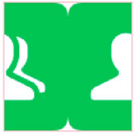 |

### 线性渐变

linearGradient线性渐变支持做平移和缩放。

>**说明：**
>
>SVG图片最终显示效果受Image组件的'objectFit'参数值影响，为了确保SVG图形完整且正确的显示，文档中用例图片都配置了'objectFit(ImageFit.Contain)'，开发者需要根据实际显示效果正确配置objectFit参数。

```xml
<svg xmlns="http://www.w3.org/2000/svg" version="1.1">
    <defs>
        <linearGradient id="grad1" x1="50%" y1="0%" x2="0%" y2="50%">
            <stop offset="0%" style="stop-color:rgb(255,255,0);stop-opacity:1" />
            <stop offset="100%" style="stop-color:rgb(255,0,0);stop-opacity:1" />
        </linearGradient>
    </defs>
    <rect x="115" y="15" width="170" height="110" fill="url(#grad1)" />
    <line x1="200" y1="15" x2="115" y2="70" stroke="black" />
</svg>
```

| 扩展前                                                | 扩展后                                                |
| ------------------------------------------------------------ | ------------------------------------------------------------ |
| 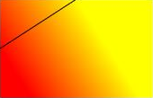 |  |

### 径向渐变

radialGradient径向渐变支持做平移和缩放。

>**说明：**
>
>SVG图片最终显示效果受Image组件的'objectFit'参数值影响，为了确保SVG图形完整且正确的显示，文档中用例图片都配置了'objectFit(ImageFit.Contain)'，开发者需要根据实际显示效果正确配置objectFit参数。

```xml
<svg xmlns="http://www.w3.org/2000/svg" version="1.1">
    <defs>
        <radialGradient id="grad1" cx = "50%" cy="50%" r= "50%" fx="40%" fy="40%"  >
            <stop offset="0%" style="stop-color:rgb(255,255,255);
      stop-opacity:0" />
            <stop offset="100%" style="stop-color:rgb(0,0,255);stop-opacity:1" />
        </radialGradient>
    </defs>
    <rect x="10" y="10" width="100" height="80" fill="url(#grad1)" />
</svg>
```

| 扩展前                                                | 扩展后                                                |
| ------------------------------------------------------------ | ------------------------------------------------------------ |
|  | 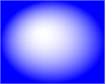 |

### mask参数异常时默认效果变更

mask遮罩的x、y、width、height等参数允许是数字、百分数、小数，当参数赋予错误类型时，从取0值变更为取默认值{-10%，-10%，120%，120%}。

>**说明：**
>
>SVG图片最终显示效果受Image组件的'objectFit'参数值影响，为了确保SVG图形完整且正确的显示，文档中用例图片都配置了'objectFit(ImageFit.Contain)'，开发者需要根据实际显示效果正确配置objectFit参数。

```xml
<svg width="200" height="200" xmlns="http://www.w3.org/2000/svg">
  <defs>
    <mask id="mask1" x="0%” y=“0%" width="100" height="100" maskUnits="userSpaceOnUse" maskContentUnits="userSpaceOnUse">
      <circle cx="50" cy="50" r="50" fill="red" />
    </mask>
  </defs>
  <rect x="0" y="0" width="200" height="200" fill="blue" mask="url(#mask1)"/>
</svg>

```

| 扩展前                                             | 扩展后                                            |
| :---------------------------------------------------------: | :--------------------------------------------------------: |
| 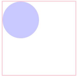 |  |

### filter参数异常时默认效果变更

filter滤镜的x、y、width、height等参数允许是数字、百分数、小数，当参数赋予错误类型时，从取0值变更为取默认值{-10%，-10%，120%，120%}。

>**说明：**
>
>SVG图片最终显示效果受Image组件的'objectFit'参数值影响，为了确保SVG图形完整且正确的显示，文档中用例图片都配置了'objectFit(ImageFit.Contain)'，开发者需要根据实际显示效果正确配置objectFit参数。

```xml
<svg viewBox="0 0 300 300" xmlns="http://www.w3.org/2000/svg" width="300" height="300">
  <defs>
    <filter id="blurMe" x="0%” y=“0%" width="100%" height="100%">
      <feColorMatrix in="SourceGraphic" type = "hueRotate" values="180"/>
    </filter>
  </defs>
  <circle cx="60" cy="60" r="50" fill="blue" filter="url(#blurMe)"/>
</svg>
```

| 扩展前                                               | 扩展后                                              |
| :-----------------------------------------------------------: | :----------------------------------------------------------: |
| 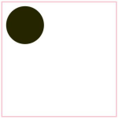 |  |
