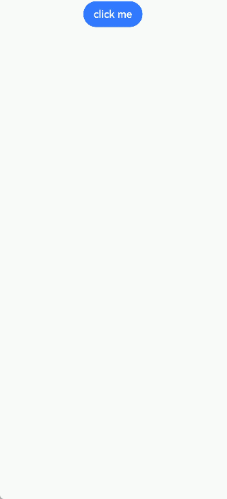
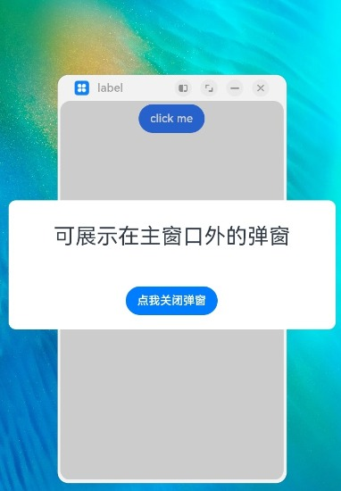
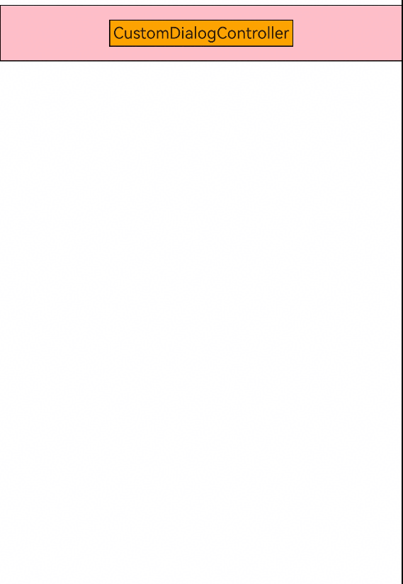
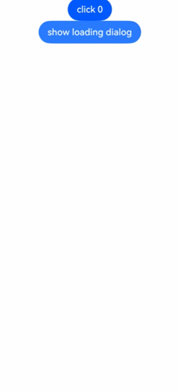
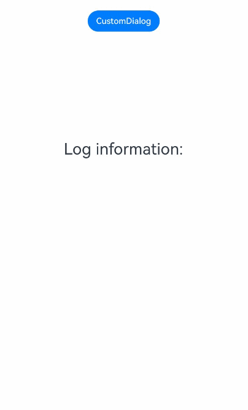
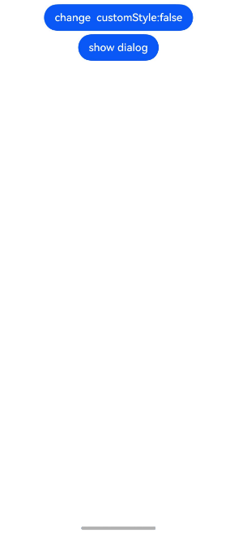
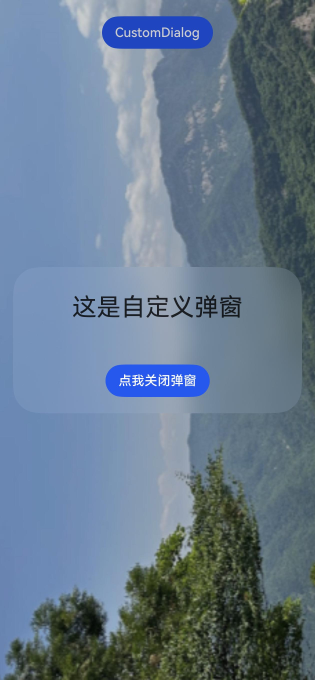
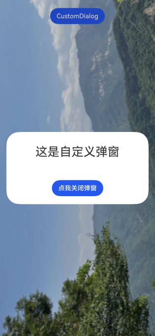
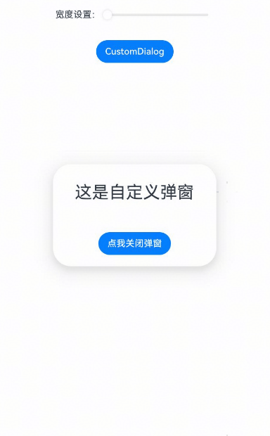

# 自定义弹窗 (CustomDialog)
<!--Kit: ArkUI-->
<!--Subsystem: ArkUI-->
<!--Owner: @houguobiao-->
<!--Designer: @houguobiao-->
<!--Tester: @lxl007-->
<!--Adviser: @Brilliantry_Rui-->

通过CustomDialogController类显示自定义弹窗。使用弹窗组件时，优先考虑自定义弹窗，便于弹窗样式与内容的自定义。

> **说明：**
>
> - 本模块同时支持ArkTS-Dyn、ArkTS-Sta。
>
> - 从API version 7开始支持。后续版本如有新增内容，则采用上角标单独标记该内容的起始版本。

## CustomDialogController

自定义弹窗的控制器。

**原子化服务API（仅ArkTS-Dyn）：** 从API version 11开始，该接口支持在原子化服务中使用。

**系统能力：** SystemCapability.ArkUI.ArkUI.Full

**ArkTS-Dyn起始版本：** 7

**ArkTS-Sta起始版本：** 23

### 导入对象

```ts
dialogController : CustomDialogController | null = new CustomDialogController(CustomDialogControllerOptions)
```
> **说明：** 
>
> - CustomDialogController仅在作为@CustomDialog和[@Component](./ts-custom-component-decorator-component.md#component) struct成员变量，且在@Component struct内部定义时赋值才有效，具体用法可参考下方示例。
>
> - 若尝试在CustomDialog中传入多个其他的Controller，以实现在CustomDialog中打开另一个或另一些CustomDialog，那么此处需要将指向自己的controller放在所有controller的后面。详细用法可参考[示例1（弹出嵌套弹窗）](#示例1弹出嵌套弹窗)。

### constructor

constructor(value: CustomDialogControllerOptions)

自定义弹窗的构造器。

> **说明：**
>
> 自定义弹窗的所有参数，不支持动态刷新，但可以通过设置customStyle为true，并在自定义组件上设置[backgroundColor](ts-universal-attributes-background.md#backgroundcolor)、[backgroundBlurStyle](ts-universal-attributes-background.md#backgroundblurstyle9)、[尺寸设置](ts-universal-attributes-size.md)等属性，通过属性绑定的状态变量来实现动态刷新的效果。
>
> 在CustomDialogController作为全局变量以实现全局自定义弹窗的场景下，若对controller重新赋值，则无法通过其关闭之前的弹窗。建议在重新赋值前先关闭弹窗。
>
> 在自定义弹窗内拉起另一个自定义弹窗时，不建议直接关闭拉起方。

**原子化服务API（仅ArkTS-Dyn）：** 从API version 11开始，该接口支持在原子化服务中使用。

**系统能力：** SystemCapability.ArkUI.ArkUI.Full

**ArkTS-Dyn起始版本：** 7

**ArkTS-Sta起始版本：** 23

**参数：**

| 参数名 | 类型                                                         | 必填 | 说明                   |
| ------ | ------------------------------------------------------------ | ---- | ---------------------- |
| value  | [CustomDialogControllerOptions](#customdialogcontrolleroptions对象说明) | 是   | 配置自定义弹窗的参数。 |

### open

ArkTS-Dyn: open()

ArkTS-Sta: open(): void

显示自定义弹窗内容，允许多次使用。如果弹框为SubWindow模式，弹窗可以显示在主窗口之外，此时弹框不允许再弹出SubWindow弹框。

>  **说明：**
>
>  不支持在输入法类型窗口中使用子窗（showInSubwindow为true）的CustomDialog，详情见输入法框架的约束与限制说明[createPanel](../../apis-ime-kit/js-apis-inputmethodengine.md#createpanel10-1)。

**原子化服务API（仅ArkTS-Dyn）：** 从API version 11开始，该接口支持在原子化服务中使用。

**系统能力：** SystemCapability.ArkUI.ArkUI.Full

**ArkTS-Dyn起始版本：** 7

**ArkTS-Sta起始版本：** 23


### close

ArkTS-Dyn: close()

ArkTS-Sta: close(): void

**原子化服务API（仅ArkTS-Dyn）：** 从API version 11开始，该接口支持在原子化服务中使用。

**系统能力：** SystemCapability.ArkUI.ArkUI.Full

**ArkTS-Dyn起始版本：** 7

**ArkTS-Sta起始版本：** 23


关闭显示的自定义弹窗，若已关闭，则不生效。

### getState<sup>20+</sup>

getState(): PromptActionCommonState

获取自定义弹窗的状态。

**原子化服务API（仅ArkTS-Dyn）：** 从API version 20开始，该接口支持在原子化服务中使用。

**模型约束：** 此接口仅可在Stage模型下使用。

**系统能力：** SystemCapability.ArkUI.ArkUI.Full

**ArkTS-Dyn起始版本：** 20

**ArkTS-Sta起始版本：** 23

**返回值：**

| 类型 | 说明 |
| -------- | -------- |
| [PromptActionCommonState](#promptactioncommonstate20) | 返回对应的弹窗状态。 |

### getExternalOptions<sup>23+</sup>

getExternalOptions(): CustomDialogControllerExternalOptions

获取自定义弹窗的外部选项。

**系统能力：** SystemCapability.ArkUI.ArkUI.Full

**ArkTS模式：** 该接口仅适用于ArkTS-Sta。

**ArkTS-Sta起始版本：** 23

**返回值：**

| 类型 | 说明 |
| -------- | -------- |
| [CustomDialogControllerExternalOptions](#customdialogcontrollerexternaloptions23) | 返回自定义弹窗的外部选项。 |

## CustomDialogControllerExternalOptions<sup>23+</sup>

自定义弹窗的外部选项。

**系统能力：** SystemCapability.ArkUI.ArkUI.Full

**ArkTS模式：** 该接口仅适用于ArkTS-Sta。

**ArkTS-Sta起始版本：** 23

| 名称 | 类型 | 只读 | 可选 | 说明 |
| -------- | -------- | -------- | -------- | -------- |
| customStyle | boolean | 否 | 是 | 是否使用自定义样式。<br/>默认值：false |

## PromptActionCommonState<sup>20+</sup>

type PromptActionCommonState = import('../api/@ohos.promptAction').promptAction.CommonState

自定义弹窗的状态。

**原子化服务API（仅ArkTS-Dyn）：** 从API version 20开始，该接口支持在原子化服务中使用。

**模型约束：** 此接口仅可在Stage模型下使用。

**系统能力：** SystemCapability.ArkUI.ArkUI.Full

**ArkTS-Dyn起始版本：** 20

**ArkTS-Sta起始版本：** 23

**返回值：**

| 类型 | 说明 |
| -------- | -------- |
| import('../api/@ohos.promptAction').[promptAction.CommonState](../js-apis-promptAction.md#commonstate20) | 返回对应的弹窗状态。 |

## CustomDialogControllerOptions对象说明

自定义弹窗的样式。

**系统能力：** SystemCapability.ArkUI.ArkUI.Full

<!--Table: 20%; 20%; 8%; 8%; 44%-->
| 名称                           | 类型                                     | 只读 | 可选 | 说明                                     |
| ----------------------------- | ---------------------------------------- | ---- | ---------------------------------------- | ---------------------------------------- |
| builder                       | [CustomDialog](../../../ui/arkts-common-components-custom-dialog.md) | 否   | 否   | 自定义弹窗内容构造器。<br/>**说明：** <br/>若builder构造器使用回调函数作为入参，请注意使用this绑定问题，如builder: custombuilder({ callback: ()=> {...}})。<br/>若在builder中监听数据变化可以使用[@Link](../../../ui/state-management/arkts-link.md)或[@Consume](../../../ui/state-management/arkts-provide-and-consume.md)，而其他方式如[@Prop](ts-state-management-prop.md)、[@ObjectLink](ts-state-management-objectlink.md)不适用此场景。<br/>**原子化服务API（仅ArkTS-Dyn）：** 从API version 11开始，该接口支持在原子化服务中使用。 <br/> **ArkTS-Dyn起始版本：** 7 <br/> **ArkTS-Sta起始版本：** 23|
| cancel                        | ()&nbsp;=&gt;&nbsp;void                  | 否    | 是   | 返回、ESC键和点击遮罩层弹窗退出时的回调。<br/>**原子化服务API（仅ArkTS-Dyn）：** 从API version 11开始，该接口支持在原子化服务中使用。 <br/> **ArkTS-Dyn起始版本：** 7 <br/> **ArkTS-Sta起始版本：** 23|
| autoCancel                    | boolean                                  | 否    | 是   | 是否允许点击遮罩层退出，true表示关闭弹窗。false表示不关闭弹窗。<br>默认值：true<br/>**原子化服务API（仅ArkTS-Dyn）：** 从API version 11开始，该接口支持在原子化服务中使用。 <br/> **ArkTS-Dyn起始版本：** 7 <br/> **ArkTS-Sta起始版本：** 23|
| alignment                     | [DialogAlignment](ts-methods-alert-dialog-box.md#dialogalignment枚举说明) | 否    | 是   | 弹窗在竖直方向上的对齐方式。<br>默认值：DialogAlignment.Default<br/>**原子化服务API（仅ArkTS-Dyn）：** 从API version 11开始，该接口支持在原子化服务中使用。 <br/> **ArkTS-Dyn起始版本：** 7 <br/> **ArkTS-Sta起始版本：** 23|
| offset                        | [Offset](ts-types.md#offset)             | 否    | 是   | 弹窗相对alignment所在位置的偏移量。<br/>默认值：{ dx: 0, dy: 0 }<br/>**原子化服务API（仅ArkTS-Dyn）：** 从API version 11开始，该接口支持在原子化服务中使用。 <br/> **ArkTS-Dyn起始版本：** 7 <br/> **ArkTS-Sta起始版本：** 23|
| customStyle                   | boolean                                  | 否    | 是   | 弹窗容器样式是否自定义。值为true表示弹窗容器使用自定义样式，值为false表示弹窗使用默认容器样式。<br/>默认值：false<br/>设置为false时：<br/>1. 默认圆角为32vp。<br/>2. 未设置弹窗宽度高度：弹窗容器的宽度根据栅格系统自适应。高度自适应自定义的内容节点。<br/>3. 设置弹窗宽度高度：弹窗容器的宽度不超过默认样式下的最大宽度（自定义节点设置100%的宽度），弹窗容器的高度不超过默认样式下的最大高度（自定义节点设置100%的高度）。<br/>4. 受安全区域的影响，弹窗显示区域将排除安全区域。例如在PC/2in1设备上避让屏幕边缘以及窗口标题栏。<br/>设置为true时：<br/>1. 圆角为0，弹窗背景色为透明色，并且弹窗的系统材质不生效。<br/>2. 不支持设置弹窗宽度、高度、边框宽度、边框样式、边框颜色以及阴影宽度。<br/>3. 弹窗显示区域为屏幕。<br/>**原子化服务API（仅ArkTS-Dyn）：** 从API version 11开始，该接口支持在原子化服务中使用。 <br/> **ArkTS-Dyn起始版本：** 7 <br/> **ArkTS-Sta起始版本：** 23|
| gridCount<sup>8+</sup>        | ArkTS-Dyn: number <br> ArkTS-Sta: int      | 否    | 是   | 弹窗宽度占[栅格宽度](../../../ui/arkts-layout-development-grid-layout.md)的个数。<br>默认为按照窗口大小自适应，异常值按默认值处理，最大栅格数为系统最大栅格数。<br/>取值范围：大于等于0的整数。<br/>**原子化服务API（仅ArkTS-Dyn）：** 从API version 11开始，该接口支持在原子化服务中使用。 <br/> **ArkTS-Dyn起始版本：** 8 <br/> **ArkTS-Sta起始版本：** 23 |
| maskColor<sup>10+</sup>       | [ResourceColor](ts-types.md#resourcecolor) | 否    | 是   | 自定义遮罩颜色。<br>默认值：0x33000000<br/>**原子化服务API（仅ArkTS-Dyn）：** 从API version 11开始，该接口支持在原子化服务中使用。 <br/>**模型约束：** 此接口仅可在Stage模型下使用。<br/> **ArkTS-Dyn起始版本：** 10 <br/> **ArkTS-Sta起始版本：** 23|
| maskRect<sup>10+</sup>        | [Rectangle](ts-methods-alert-dialog-box.md#rectangle8类型说明) | 否     | 是    | 弹窗遮罩层区域，在遮罩层区域内的事件不透传，在遮罩层区域外的事件透传。<br/>默认值：{ x: 0, y: 0, width: '100%', height: '100%' } <br/>**说明：**<br/>showInSubWindow为true时，maskRect不生效。<br/>**原子化服务API（仅ArkTS-Dyn）：** 从API version 11开始，该接口支持在原子化服务中使用。 <br/>**模型约束：** 此接口仅可在Stage模型下使用。<br/> **ArkTS-Dyn起始版本：** 10 <br/> **ArkTS-Sta起始版本：** 23|
| openAnimation<sup>10+</sup>   | [AnimateParam](ts-explicit-animation.md#animateparam对象说明) | 否    | 是   | 自定义设置弹窗弹出的动画效果相关参数。<br>**说明**：<br>tempo默认值为1，当设置小于等于0的值时按默认值处理。<br/>iterations默认值为1，默认播放一次，设置为其他数值时按默认值处理。<br>playMode控制动画播放模式，默认值为PlayMode.Normal，设置为其他数值时按照默认值处理。<br/>**原子化服务API（仅ArkTS-Dyn）：** 从API version 11开始，该接口支持在原子化服务中使用。 <br/>**模型约束：** 此接口仅可在Stage模型下使用。<br/> **ArkTS-Dyn起始版本：** 10 <br/> **ArkTS-Sta起始版本：** 23|
| closeAnimation<sup>10+</sup>  | [AnimateParam](ts-explicit-animation.md#animateparam对象说明) | 否    | 是   | 自定义设置弹窗关闭的动画效果相关参数。<br>**说明**：<br>tempo默认值为1，当设置小于等于0的值时按默认值处理。<br/>iterations默认值为1，默认播放一次，设置为其他数值时按默认值处理。<br>playMode控制动画播放模式，默认值为PlayMode.Normal，设置为其他数值时按照默认值处理。<br/>页面转场切换时，建议使用默认关闭动效。<br/>**原子化服务API（仅ArkTS-Dyn）：** 从API version 11开始，该接口支持在原子化服务中使用。 <br/>**模型约束：** 此接口仅可在Stage模型下使用。<br/> **ArkTS-Dyn起始版本：** 10 <br/> **ArkTS-Sta起始版本：** 23|
| showInSubWindow<sup>10+</sup> | boolean                                  | 否    | 是   | 弹窗需要显示在主窗口之外时，是否在子窗口显示此弹窗。值为true表示在子窗口显示弹窗。<br>默认值：false，弹窗显示在应用内，而非独立子窗口。<br>**说明**：showInSubWindow为true的弹窗无法触发显示另一个showInSubWindow为true的弹窗。不建议在showInSubWindow为true的弹窗中使用CalendarPicker、CalendarPickerDialog、DatePickerDialog、TextPickerDialog、TimePickerDialog、Toast组件，弹窗会影响上述组件行为。<br/>**原子化服务API（仅ArkTS-Dyn）：** 从API version 11开始，该接口支持在原子化服务中使用。 <br/>**模型约束：** 此接口仅可在Stage模型下使用。<br/> **ArkTS-Dyn起始版本：** 10 <br/> **ArkTS-Sta起始版本：** 23|
| backgroundColor<sup>10+</sup> | [ResourceColor](ts-types.md#resourcecolor)      | 否   | 是  | 设置弹窗背板填充。<br/>默认值：Color.Transparent<br />**说明：** 如果同时设置了内容构造器的背景色，则backgroundColor会被内容构造器的背景色覆盖。<br/>backgroundColor会与模糊属性backgroundBlurStyle叠加产生效果，如果不符合预期，可将backgroundBlurStyle设置为BlurStyle.NONE，即可取消模糊。<br/>**原子化服务API（仅ArkTS-Dyn）：** 从API version 11开始，该接口支持在原子化服务中使用。 <br/>**模型约束：** 此接口仅可在Stage模型下使用。<br/> **ArkTS-Dyn起始版本：** 10 <br/> **ArkTS-Sta起始版本：** 23|
| cornerRadius<sup>10+</sup>    | [Dimension](ts-types.md#dimension10)&nbsp;\|&nbsp;[BorderRadiuses](ts-types.md#borderradiuses9) | 否   | 是  | 设置背板的圆角半径。<br />可分别设置4个圆角的半径。<br />默认值：{ topLeft: '32vp', topRight: '32vp', bottomLeft: '32vp', bottomRight: '32vp' }<br />**说明**：自定义弹窗默认的背板圆角半径为32vp，如果需要使用cornerRadius属性，请和[borderRadius](ts-universal-attributes-border.md#borderradius)属性一起使用。<br/>**原子化服务API（仅ArkTS-Dyn）：** 从API version 11开始，该接口支持在原子化服务中使用。 <br/>**模型约束：** 此接口仅可在Stage模型下使用。<br/> **ArkTS-Dyn起始版本：** 10 <br/> **ArkTS-Sta起始版本：** 23|
| isModal<sup>11+</sup> | boolean | 否 | 是 | 弹窗是否为模态窗口。值为true表示为模态窗口且有遮罩层，不可与弹窗周围其他控件进行交互，即遮罩层区域无法事件透传。值为false表示为非模态窗口且无遮罩层，可以与弹窗周围其他控件进行交互。<br/>默认值：true<br/>**原子化服务API（仅ArkTS-Dyn）：** 从API version 12开始，该接口支持在原子化服务中使用。 <br/>**模型约束：** 此接口仅可在Stage模型下使用。<br/> **ArkTS-Dyn起始版本：** 11 <br/> **ArkTS-Sta起始版本：** 23|
| onWillDismiss<sup>12+</sup> | [Callback](ts-types.md#callback12)<[DismissDialogAction](#dismissdialogaction12)> | 否 | 是 | 交互式关闭回调函数。<br/>**说明：**<br/>1.当用户执行点击遮罩层关闭、侧滑（左滑/右滑）、三键back、键盘ESC关闭交互操作时，如果注册该回调函数，则不会立刻关闭弹窗。在回调函数中可以通过reason得到阻拦关闭弹窗的操作类型，从而根据原因选择是否能关闭弹窗。当前组件返回的reason中，暂不支持CLOSE_BUTTON的枚举值。<br/>2.在onWillDismiss回调中，不能再做onWillDismiss拦截。 <br/>**原子化服务API（仅ArkTS-Dyn）：** 从API version 12开始，该接口支持在原子化服务中使用。 <br/>**模型约束：** 此接口仅可在Stage模型下使用。<br/> **ArkTS-Dyn起始版本：** 12 <br/> **ArkTS-Sta起始版本：** 23|
| borderWidth<sup>12+</sup> | [Dimension](ts-types.md#dimension10)&nbsp;\|&nbsp;[EdgeWidths](ts-types.md#edgewidths9)  | 否 | 是 | 设置弹窗背板的边框宽度。<br />可分别设置4个边框宽度。<br />默认值：0。<br /> 百分比参数方式：以父元素弹窗宽的百分比来设置弹窗的边框宽度。<br />当弹窗左边框和右边框大于弹窗宽度，弹窗上边框和下边框大于弹窗高度，显示可能不符合预期。<br/>**原子化服务API（仅ArkTS-Dyn）：** 从API version 12开始，该接口支持在原子化服务中使用。 <br/>**模型约束：** 此接口仅可在Stage模型下使用。<br/> **ArkTS-Dyn起始版本：** 12 <br/> **ArkTS-Sta起始版本：** 23|
| borderColor<sup>12+</sup> | [ResourceColor](ts-types.md#resourcecolor)&nbsp;\|&nbsp;[EdgeColors](ts-types.md#edgecolors9)  | 否 | 是 | 设置弹窗背板的边框颜色。<br/>默认值：Color.Black<br/>如果使用borderColor属性，需要和borderWidth属性一起使用。 <br/>**原子化服务API（仅ArkTS-Dyn）：** 从API version 12开始，该接口支持在原子化服务中使用。 <br/>**模型约束：** 此接口仅可在Stage模型下使用。<br/> **ArkTS-Dyn起始版本：** 12 <br/> **ArkTS-Sta起始版本：** 23|
| borderStyle<sup>12+</sup> | [BorderStyle](ts-appendix-enums.md#borderstyle)&nbsp;\|&nbsp;[EdgeStyles](ts-types.md#edgestyles9)  | 否 | 是 | 设置弹窗背板的边框样式。<br/>默认值：BorderStyle.Solid<br/>如果使用borderStyle属性，需要和borderWidth属性一起使用。 <br/>**原子化服务API（仅ArkTS-Dyn）：** 从API version 12开始，该接口支持在原子化服务中使用。 <br/>**模型约束：** 此接口仅可在Stage模型下使用。<br/> **ArkTS-Dyn起始版本：** 12 <br/> **ArkTS-Sta起始版本：** 23|
| width<sup>12+</sup> | [Dimension](ts-types.md#dimension10) | 否   | 是  | 设置弹窗背板的宽度。<br />**说明：**<br>- 弹窗宽度默认最大值：400vp。<br />- 百分比参数方式：弹窗参考宽度为所在窗口的宽度，在此基础上调小或调大。<br/>**原子化服务API（仅ArkTS-Dyn）：** 从API version 12开始，该接口支持在原子化服务中使用。 <br/>**模型约束：** 此接口仅可在Stage模型下使用。<br/> **ArkTS-Dyn起始版本：** 12 <br/> **ArkTS-Sta起始版本：** 23|
| height<sup>12+</sup> | [Dimension](ts-types.md#dimension10)   | 否 | 是 | 设置弹窗背板的高度。<br />**说明：**<br />- 弹窗高度默认最大值：0.9 *（窗口高度 - 安全区域）。<br />- 百分比参数方式：弹窗参考高度为（窗口高度 - 安全区域），在此基础上调小或调大。<br/>**原子化服务API（仅ArkTS-Dyn）：** 从API version 12开始，该接口支持在原子化服务中使用。 <br/>**模型约束：** 此接口仅可在Stage模型下使用。<br/> **ArkTS-Dyn起始版本：** 12 <br/> **ArkTS-Sta起始版本：** 23|
| shadow<sup>12+</sup> | [ShadowOptions](ts-universal-attributes-image-effect.md#shadowoptions对象说明)&nbsp;\|&nbsp;[ShadowStyle](ts-universal-attributes-image-effect.md#shadowstyle10枚举说明)   | 否 | 是 | 设置弹窗背板的阴影。 <br /> 当设备为2in1时，默认场景下获焦阴影值为ShadowStyle.OUTER_FLOATING_MD，失焦为ShadowStyle.OUTER_FLOATING_SM。其他设备默认无阴影。<br/>**原子化服务API（仅ArkTS-Dyn）：** 从API version 12开始，该接口支持在原子化服务中使用。 <br/>**模型约束：** 此接口仅可在Stage模型下使用。<br/> **ArkTS-Dyn起始版本：** 12 <br/> **ArkTS-Sta起始版本：** 23|
| backgroundBlurStyle<sup>12+</sup> | [BlurStyle](ts-universal-attributes-background.md#blurstyle9)                 | 否   | 是  | 弹窗背板模糊材质。<br/>默认值：从API版本26.0.0开始，为BlurStyle.NONE，API版本26.0.0之前，为BlurStyle.COMPONENT_ULTRA_THICK。 <br/>**说明：** <br/>设置为BlurStyle.NONE即可关闭背景虚化。当设置了backgroundBlurStyle为非NONE值时，则不要设置backgroundColor，否则颜色显示将不符合预期效果。<br/>**原子化服务API（仅ArkTS-Dyn）：** 从API version 12开始，该接口支持在原子化服务中使用。 <br/>**模型约束：** 此接口仅可在Stage模型下使用。<br/> **ArkTS-Dyn起始版本：** 12 <br/> **ArkTS-Sta起始版本：** 23|
| backgroundBlurStyleOptions<sup>19+</sup> | [BackgroundBlurStyleOptions](ts-universal-attributes-background.md#backgroundblurstyleoptions10对象说明) | 否 | 是 | 背景模糊效果。默认值请参考BackgroundBlurStyleOptions类型说明。<br />**原子化服务API（仅ArkTS-Dyn）：** 从API version 19开始，该接口支持在原子化服务中使用。 <br/>**模型约束：** 此接口仅可在Stage模型下使用。<br/> **ArkTS-Dyn起始版本：** 19 <br/> **ArkTS-Sta起始版本：** 23|
| backgroundEffect<sup>19+</sup> | [BackgroundEffectOptions](ts-universal-attributes-background.md#backgroundeffectoptions11) | 否 | 是 | 背景效果参数。默认值请参考BackgroundEffectOptions类型说明。<br />**原子化服务API（仅ArkTS-Dyn）：** 从API version 19开始，该接口支持在原子化服务中使用。 <br/>**模型约束：** 此接口仅可在Stage模型下使用。<br/> **ArkTS-Dyn起始版本：** 19 <br/> **ArkTS-Sta起始版本：** 23|
| keyboardAvoidMode<sup>12+</sup> | [KeyboardAvoidMode](ts-universal-attributes-popup.md#keyboardavoidmode12枚举说明) | 否 | 是 | 用于设置弹窗是否在拉起软键盘时进行自动避让。<br/>默认值：KeyboardAvoidMode.DEFAULT<br/>**原子化服务API（仅ArkTS-Dyn）：** 从API version 12开始，该接口支持在原子化服务中使用。 <br/>**模型约束：** 此接口仅可在Stage模型下使用。<br/> **ArkTS-Dyn起始版本：** 12 <br/> **ArkTS-Sta起始版本：** 23|
| enableHoverMode<sup>14+</sup>     | boolean | 否   | 是  | 是否响应悬停态，值为true时，响应悬停态。<br />默认值：false，默认不响应。<br />**说明：**<br />PC/2in1设备弹窗默认显示在上半屏，在enableHoverMode设置为true时，可以通过设置hoverModeArea参数显示在下半屏。其他设备弹窗在enableHoverMode设置为true时默认显示在下半屏，可以通过设置hoverModeArea参数显示在上半屏。<br/>**原子化服务API（仅ArkTS-Dyn）：** 从API version 14开始，该接口支持在原子化服务中使用。 <br/>**模型约束：** 此接口仅可在Stage模型下使用。<br/> **ArkTS-Dyn起始版本：** 14 <br/> **ArkTS-Sta起始版本：** 23|
| hoverModeArea<sup>14+</sup>       | [HoverModeAreaType](ts-universal-attributes-sheet-transition.md#hovermodeareatype14) | 否   | 是  | 悬停态下弹窗默认展示区域。<br />默认值：HoverModeAreaType.BOTTOM_SCREEN。<br/>**原子化服务API（仅ArkTS-Dyn）：** 从API version 14开始，该接口支持在原子化服务中使用。 <br/>**模型约束：** 此接口仅可在Stage模型下使用。<br/> **ArkTS-Dyn起始版本：** 14 <br/> **ArkTS-Sta起始版本：** 23|
| onWillAppear<sup>19+</sup> | [Callback](ts-types.md#voidcallback12)&lt;void&gt; | 否 | 是 | 弹窗显示动效前的事件回调。<br />**说明：**<br />1.正常时序依次为：onWillAppear>>onDidAppear>>onWillDisappear>>onDidDisappear。<br />2.在onWillAppear内设置改变弹窗显示效果的回调事件，二次弹出生效。 <br/>**原子化服务API（仅ArkTS-Dyn）：** 从API version 19开始，该接口支持在原子化服务中使用。 <br/>**模型约束：** 此接口仅可在Stage模型下使用。<br/> **ArkTS-Dyn起始版本：** 19 <br/> **ArkTS-Sta起始版本：** 23|
| onDidAppear<sup>19+</sup> | [Callback](ts-types.md#voidcallback12)&lt;void&gt; | 否 | 是 | 弹窗弹出后的事件回调。<br />**说明：**<br />1.正常时序依次为：onWillAppear>>onDidAppear>>onWillDisappear>>onDidDisappear。<br />2.在onDidAppear内设置改变弹窗显示效果的回调事件，二次弹出生效。<br />3.快速点击弹出，关闭弹窗时，onWillDisappear在onDidAppear前生效。<br/>4.弹窗入场动效未完成时彻底关闭弹窗，动效打断，onDidAppear不会触发。<br/>**原子化服务API（仅ArkTS-Dyn）：** 从API version 19开始，该接口支持在原子化服务中使用。 <br/>**模型约束：** 此接口仅可在Stage模型下使用。<br/> **ArkTS-Dyn起始版本：** 19 <br/> **ArkTS-Sta起始版本：** 23|
| onWillDisappear<sup>19+</sup> | [Callback](ts-types.md#voidcallback12)&lt;void&gt; | 否 | 是 | 弹窗退出动效前的事件回调。<br />**说明：**<br />1.正常时序依次为：onWillAppear>>onDidAppear>>onWillDisappear>>onDidDisappear。<br /> **原子化服务API（仅ArkTS-Dyn）：** 从API version 19开始，该接口支持在原子化服务中使用。 <br/>**模型约束：** 此接口仅可在Stage模型下使用。<br/> **ArkTS-Dyn起始版本：** 19 <br/> **ArkTS-Sta起始版本：** 23|
| onDidDisappear<sup>19+</sup> | [Callback](ts-types.md#voidcallback12)&lt;void&gt; | 否 | 是 | 弹窗消失后的事件回调。<br />**说明：**<br />1.正常时序依次为：onWillAppear>>onDidAppear>>onWillDisappear>>onDidDisappear。<br/>**原子化服务API（仅ArkTS-Dyn）：** 从API version 19开始，该接口支持在原子化服务中使用。 <br/>**模型约束：** 此接口仅可在Stage模型下使用。<br/> **ArkTS-Dyn起始版本：** 19 <br/> **ArkTS-Sta起始版本：** 23|
| keyboardAvoidDistance<sup>15+</sup>       | [LengthMetrics](../js-apis-arkui-graphics.md#lengthmetrics12) | 否   | 是  | 弹窗避让键盘后，和键盘之间的距离。<br />**说明：**<br />- 默认值：16vp。<br />- 默认单位：vp。<br />- 当且仅当keyboardAvoidMode属性设置为DEFAULT时生效。<br/>**原子化服务API（仅ArkTS-Dyn）：** 从API version 15开始，该接口支持在原子化服务中使用。 <br/>**模型约束：** 此接口仅可在Stage模型下使用。<br/> **ArkTS-Dyn起始版本：** 15 <br/> **ArkTS-Sta起始版本：** 23|
| levelMode<sup>15+</sup>       | [LevelMode](../js-apis-promptAction.md#levelmode15) | 否   | 是  | 设置弹窗显示层级。<br />**说明：**<br />- 默认值：LevelMode.OVERLAY。<br />- 当且仅当showInSubWindow属性设置为false时生效。<br/>**原子化服务API（仅ArkTS-Dyn）：** 从API version 15开始，该接口支持在原子化服务中使用。 <br/>**模型约束：** 此接口仅可在Stage模型下使用。<br/> **ArkTS-Dyn起始版本：** 15 <br/> **ArkTS-Sta起始版本：** 23|
| levelUniqueId<sup>15+</sup>       | ArkTS-Dyn: number <br> ArkTS-Sta: int | 否   | 是  | 设置页面级弹窗需要显示的层级下的[getUniqueId](../js-apis-arkui-frameNode.md#getuniqueid12)。<br/>取值范围：大于等于0的数字。<br />**说明：**<br />- 当且仅当levelMode属性设置为LevelMode.EMBEDDED时生效。<br/>**原子化服务API（仅ArkTS-Dyn）：** 从API version 15开始，该接口支持在原子化服务中使用。 <br/>**模型约束：** 此接口仅可在Stage模型下使用。<br/> **ArkTS-Dyn起始版本：** 15 <br/> **ArkTS-Sta起始版本：** 23|
| immersiveMode<sup>15+</sup>       | [ImmersiveMode](../js-apis-promptAction.md#immersivemode15) | 否   | 是  | 设置页面内弹窗蒙层效果。<br />**说明：**<br />- 默认值：ImmersiveMode.DEFAULT <br />- 当且仅当levelMode属性设置为LevelMode.EMBEDDED时生效。<br/>**原子化服务API（仅ArkTS-Dyn）：** 从API version 15开始，该接口支持在原子化服务中使用。 <br/>**模型约束：** 此接口仅可在Stage模型下使用。<br/> **ArkTS-Dyn起始版本：** 15 <br/> **ArkTS-Sta起始版本：** 23|
| levelOrder<sup>18+</sup>       | [LevelOrder](../js-apis-promptAction.md#levelorder18) | 否   | 是  | 设置弹窗显示的顺序。<br />**说明：**<br />- 默认值：LevelOrder.clamp(0) <br />- 不支持动态刷新顺序。<br/>**原子化服务API（仅ArkTS-Dyn）：** 从API version 18开始，该接口支持在原子化服务中使用。 <br/>**模型约束：** 此接口仅可在Stage模型下使用。<br/> **ArkTS-Dyn起始版本：** 18 <br/> **ArkTS-Sta起始版本：** 23|
| focusable<sup>19+</sup>       | boolean | 否   | 是  | 设置弹窗是否获取焦点。值为true表示获取焦点，值为false表示不获取焦点。<br />默认值：true <br />**说明：**<br />只有弹出覆盖在当前窗口之上的弹窗才可以获取焦点。<br/>**原子化服务API（仅ArkTS-Dyn）：** 从API version 19开始，该接口支持在原子化服务中使用。 <br/>**模型约束：** 此接口仅可在Stage模型下使用。<br/> **ArkTS-Dyn起始版本：** 19 <br/> **ArkTS-Sta起始版本：** 23|
| systemMaterial  | SystemUiMaterial | 否 | 是 | 设置弹窗的系统材质。<br/>**说明：**<br/>- 默认值：ImmersiveOptions的style为ImmersiveStyle.ULTRA_THICK的ImmersiveMaterial对象。设置undefined时与默认值保持一致。<br/>- 不同的材质具有不同的效果，该接口影响背景色[backgroundColor](ts-universal-attributes-background.md#backgroundcolor)、背景模糊[backgroundBlurStyle](ts-universal-attributes-background.md#backgroundblurstyle9)、背景效果[backgroundEffect](ts-universal-attributes-background.md#backgroundeffect11)、边框颜色[borderColor](ts-universal-attributes-border.md#bordercolor)、边框宽度[borderWidth](ts-universal-attributes-border.md#borderwidth)、阴影[shadow](ts-universal-attributes-image-effect.md#shadow)，不建议与上述接口一起使用。<br/>**起始版本：** 26.0.0<br/>**模型约束：** 此接口仅可在Stage模型下使用。<br/>**原子化服务API（仅ArkTS-Dyn）：** 从API版本26.0.0开始，该接口支持在原子化服务中使用。|

> **说明：**
>
> - 按下返回键和ESC键时会让弹窗退出。
> - 弹窗在避让软键盘时到达极限高度之后会压缩高度。
>   需要注意：高度压缩生效在外层容器上，如果容器根节点中的子组件设置了较大的固定高度，由于容器默认不裁剪，依然可能存在超出屏幕显示的情况。
> - 自定义弹窗仅适用于简单提示场景，不能替代页面使用。弹窗避让软键盘时，与软键盘之间存在16vp的安全间距。
> - 为了达成良好的视觉体验，弹窗的显示和关闭存在默认动画，动画时长不同设备间可能存在差异。
>   需要注意：在动画播放过程中，页面不响应触摸、滑动、点击操作。关闭默认弹窗动画效果可设置openAnimation和closeAnimation的duration为0。
> - 当前，ArkUI弹出框默认为非页面级弹出框，在页面路由跳转时，如果开发者未调用close方法将其关闭，弹出框将不会自动关闭。若需实现在跳转页面时覆盖弹出框的场景，可以使用[组件导航子页面显示类型的弹窗类型](../../../ui/arkts-navigation-navdestination.md#页面显示类型)或者[页面级弹出框](../../../ui/arkts-embedded-dialog.md)。

## DismissDialogAction<sup>12+</sup>

弹窗关闭的信息。

**ArkTS模式：** 该接口仅适用于ArkTS-Dyn。

**原子化服务API（仅ArkTS-Dyn）：** 从API version 12开始，该接口支持在原子化服务中使用。

**模型约束：** 此接口仅可在Stage模型下使用。

**系统能力：** SystemCapability.ArkUI.ArkUI.Full

**ArkTS-Dyn起始版本：** 12

### 属性

**原子化服务API（仅ArkTS-Dyn）：** 从API version 12开始，该接口支持在原子化服务中使用。

**系统能力：** SystemCapability.ArkUI.ArkUI.Full

**ArkTS-Dyn起始版本：** 12

| 名称    | 类型                                                         | 只读 | 可选 | 说明                                                         |
| ------- | ------------------------------------------------------------ | ---- | ---- | ------------------------------------------------------------ |
| dismiss | [Callback](ts-types.md#voidcallback12)&lt;void&gt;                                         | 否   | 否   | 弹窗关闭回调函数。开发者需要退出时调用，不需要退出时无需调用此函数。 |
| reason  | [DismissReason](ts-universal-attributes-popup.md#dismissreason12枚举说明) | 否   | 是   | 关闭原因，返回本次拦截弹窗关闭的事件原因。开发者可根据不同操作选择是否关闭弹窗。 |

## 示例

### 示例1（弹出嵌套弹窗）

该示例实现了在CustomDialog中打开另一个或另一些CustomDialog。

ArkTS-Dyn示例：

```ts
// xxx.ets
/**
 * 示例1：弹出嵌套弹窗
 * 本示例展示如何在CustomDialog中打开另一个CustomDialog，实现弹窗嵌套
 * 演示了CustomDialogController的嵌套使用和多个Controller的管理
 */
@CustomDialog
struct CustomDialogExampleTwo {
  controllerTwo?: CustomDialogController;                            // 第二个弹窗的控制器
  build() {
    Column() {
      Text('我是第二个弹窗')
        .fontSize(30)
        .height(100)
      Button('点我关闭第二个弹窗')
        .onClick(() => {
          if (this.controllerTwo != undefined) {
            this.controllerTwo.close();                              // 关闭第二个弹窗
          }
        })
        .margin(20)
    }
  }
}
@CustomDialog
@Component
struct CustomDialogExample {
  @Link textValue: string;                                           // 文本输入值，与父组件双向绑定
  @Link inputValue: string;                                          // 输入值，与父组件双向绑定
  dialogControllerTwo: CustomDialogController | null = new CustomDialogController({
    builder: CustomDialogExampleTwo(),                               // 第二个弹窗的内容构造器
    alignment: DialogAlignment.Bottom,                               // 弹窗底部对齐
    onWillDismiss:(dismissDialogAction: DismissDialogAction)=> {     // 交互式关闭回调
      console.info(`reason= ${dismissDialogAction.reason}`);
      console.info('dialog onWillDismiss');
      if (dismissDialogAction.reason == DismissReason.PRESS_BACK) {  // 按返回键时关闭
        dismissDialogAction.dismiss();
      }
      if (dismissDialogAction.reason == DismissReason.TOUCH_OUTSIDE) { // 点击遮罩层时关闭
        dismissDialogAction.dismiss();
      }
    },
    offset: { dx: 0, dy: -25 } })                                      // 弹窗偏移：向上偏移25vp
    controller?: CustomDialogController;
    // 若尝试在CustomDialog中传入多个其他的Controller，以实现在CustomDialog中打开另一个或另一些CustomDialog，那么此处需要将指向自己的controller放在所有controller的后面
    cancel: () => void = () => {                                       // 取消按钮回调
    }
    confirm: () => void = () => {                                      // 确认按钮回调
    }

  build() {
    Column() {
      Text('Change text').fontSize(20).margin({ top: 10, bottom: 10 })
      TextInput({ placeholder: '', text: this.textValue }).height(60).width('90%')
        .onChange((value: string) => {                              // 输入内容变化回调
          this.textValue = value;
        })
      Text('Whether to change a text?').fontSize(16).margin({ bottom: 10 })
      Flex({ justifyContent: FlexAlign.SpaceAround }) {
        Button('cancel')
          .onClick(() => {
            if (this.controller != undefined) {
              this.controller.close();                              // 关闭弹窗
              this.cancel();                                        // 触发取消回调
            }
          }).backgroundColor(0xffffff).fontColor(Color.Black)
        Button('confirm')
          .onClick(() => {
            if (this.controller != undefined) {
              this.inputValue = this.textValue;                     // 更新输入值
              this.controller.close();                              // 关闭弹窗
              this.confirm();                                       // 触发确认回调
            }
          }).backgroundColor(0xffffff).fontColor(Color.Red)
      }.margin({ bottom: 10 })

      Button('点我打开第二个弹窗')
        .onClick(() => {
          if (this.dialogControllerTwo != null) {
            this.dialogControllerTwo.open();                        // 打开第二个弹窗
          }
        })
        .margin(20)
    }.borderRadius(10)
    // 如果需要使用border属性或cornerRadius属性，请和borderRadius属性一起使用。
  }
}
@Entry
@Component
struct CustomDialogUser {
  @State textValue: string = ''                                     // 文本值状态
  @State inputValue: string = 'click me'                            // 输入值状态
  dialogController: CustomDialogController | null = new CustomDialogController({
    builder: CustomDialogExample({                                  // 弹窗内容构造器
      cancel: ()=> { this.onCancel(); },                            // 取消回调
      confirm: ()=> { this.onAccept(); },                           // 确认回调
      textValue: this.textValue,                                    // 传递文本值
      inputValue: this.inputValue                                   // 传递输入值
    }),
    cancel: this.exitApp,                                           // 点击遮罩层关闭时的回调
    autoCancel: true,                                               // 允许点击遮罩层关闭
    onWillDismiss:(dismissDialogAction: DismissDialogAction)=> {   // 交互式关闭回调
      console.info(`reason= ${dismissDialogAction.reason}`);
      console.info('dialog onWillDismiss');
      if (dismissDialogAction.reason == DismissReason.PRESS_BACK) { // 按返回键时关闭
        dismissDialogAction.dismiss();
      }
      if (dismissDialogAction.reason == DismissReason.TOUCH_OUTSIDE) { // 点击遮罩层时关闭
        dismissDialogAction.dismiss();
      }
    },
    alignment: DialogAlignment.Bottom,                               // 弹窗底部对齐
    offset: { dx: 0, dy: -20 },                                     // 弹窗偏移：向上偏移20vp
    gridCount: 4,                                                   // 弹窗宽度占用栅格数
    customStyle: false,                                             // 使用默认弹窗容器样式
    cornerRadius: 10,                                               // 圆角半径10vp
  })

  // 在自定义组件即将析构销毁时将dialogController置空
  aboutToDisappear() {
    this.dialogController = null;                                   // 将dialogController置空
  }

  onCancel() {
    console.info('Callback when the first button is clicked');
  }

  onAccept() {
    console.info('Callback when the second button is clicked');
  }

  exitApp() {
    console.info('Click the callback in the blank area');
  }
  build() {
    Column() {
      Button(this.inputValue)
        .onClick(() => {
          if (this.dialogController != null) {
            this.dialogController.open();                            // 打开弹窗
          }
        }).backgroundColor(0x317aff)
    }.width('100%').margin({ top: 5 })
  }
}
```

ArkTS-Sta示例：

```ts
// xxx.ets
/**
 * 示例1：弹出嵌套弹窗（ArkTS-Sta版本）
 * 本示例展示如何在CustomDialog中打开另一个CustomDialog，实现弹窗嵌套
 * 演示了CustomDialogController的嵌套使用和多个Controller的管理
 */
import { Entry, Component, Column, ColumnOptions, Button, Text, TextInput, Flex, FlexAlign, CustomDialog,
  CustomDialogController, DialogAlignment, DismissDialogAction, DismissReason, Link } from '@kit.ArkUI';

@CustomDialog
struct CustomDialogExampleTwo {
  controllerTwo?: CustomDialogController                            // 第二个弹窗的控制器
  build(): void {
    Column() {
      Text('我是第二个弹窗')
        .fontSize(30)
        .height(100)
      Button('点我关闭第二个弹窗')
        .onClick(() => {
          if (this.controllerTwo != undefined) {
            this.controllerTwo.close()                              // 关闭第二个弹窗
          }
        })
        .margin(20)
    }
  }
}

@CustomDialog
@Component
struct CustomDialogExample {
  @Link textValue: string                                           // 文本输入值，与父组件双向绑定
  @Link inputValue: string                                          // 输入值，与父组件双向绑定
  dialogControllerTwo: CustomDialogController | null = new CustomDialogController({
    builder: CustomDialogExampleTwo(),                              // 第二个弹窗的内容构造器
    alignment: DialogAlignment.Bottom,                              // 弹窗底部对齐
    onWillDismiss:(dismissDialogAction: DismissDialogAction): void => { // 交互式关闭回调
      console.info('reason= ', dismissDialogAction.reason)
      console.info('dialog onWillDismiss')
      if (dismissDialogAction.reason == DismissReason.PRESS_BACK) { // 按返回键时关闭
        dismissDialogAction.dismiss()
      }
      if (dismissDialogAction.reason == DismissReason.TOUCH_OUTSIDE) { // 点击遮罩层时关闭
        dismissDialogAction.dismiss()
      }
    },
    offset: { dx: 0, dy: -25 } as Offset                            // 弹窗偏移：向上偏移25vp
  }) as CustomDialogController | null
  controller?: CustomDialogController
  cancel: () => void = (): void => {                                // 取消按钮回调
  }
  confirm: () => void = (): void => {                               // 确认按钮回调
  }

  build(): void {
    Column() {
      Text('Change text').fontSize(20).margin({ top: 10, bottom: 10 })
      TextInput({ placeholder: '', text: this.textValue }).height(60).width('90%')
        .onChange((value: string): void => {                         // 输入内容变化回调
          this.textValue = value
        })
      Text('Whether to change a text?').fontSize(16).margin({ bottom: 10 })
      Flex({ justifyContent: FlexAlign.SpaceAround }) {
        Button('cancel')
          .onClick(() => {
            if (this.controller != undefined) {
              this.controller.close()                                // 关闭弹窗
              this.cancel()                                          // 触发取消回调
            }
          }).backgroundColor(0xffffff).fontColor(Color.Black)
        Button('confirm')
          .onClick(() => {
            if (this.controller != undefined) {
              this.inputValue = this.textValue                       // 更新输入值
              this.controller.close()                                // 关闭弹窗
              this.confirm()                                         // 触发确认回调
            }
          }).backgroundColor(0xffffff).fontColor(Color.Red)
      }.margin({ bottom: 10 })

      Button('点我打开第二个弹窗')
        .onClick(() => {
          if (this.dialogControllerTwo != null) {
            this.dialogControllerTwo.open()                          // 打开第二个弹窗
          }
        })
        .margin(20)
    }.borderRadius(10)
  }
}

@Entry
@Component
struct CustomDialogUser {
  @State textValue: string = ''                                     // 文本值状态
  @State inputValue: string = 'click me'                            // 输入值状态
  dialogController: CustomDialogController | null = new CustomDialogController({
    builder: CustomDialogExample({                                  // 弹窗内容构造器
      cancel: (): void => { this.onCancel() },                      // 取消回调
      confirm: (): void => { this.onAccept() },                     // 确认回调
      textValue: this.textValue,                                    // 传递文本值
      inputValue: this.inputValue                                   // 传递输入值
    }),
    cancel: this.exitApp,                                           // 点击遮罩层关闭时的回调
    autoCancel: true,                                               // 允许点击遮罩层关闭
    onWillDismiss:(dismissDialogAction: DismissDialogAction): void => { // 交互式关闭回调
      console.info('reason= ', dismissDialogAction.reason)
      console.info('dialog onWillDismiss')
      if (dismissDialogAction.reason == DismissReason.PRESS_BACK) { // 按返回键时关闭
        dismissDialogAction.dismiss()
      }
      if (dismissDialogAction.reason == DismissReason.TOUCH_OUTSIDE) { // 点击遮罩层时关闭
        dismissDialogAction.dismiss()
      }
    },
    alignment: DialogAlignment.Bottom,                               // 弹窗底部对齐
    offset: { dx: 0, dy: -20 } as Offset,                           // 弹窗偏移：向上偏移20vp
    gridCount: 4,                                                   // 弹窗宽度占用栅格数
    customStyle: false,                                             // 使用默认弹窗容器样式
    cornerRadius: 10,                                               // 圆角半径10vp
  }) as CustomDialogController | null

  aboutToDisappear(): void {
    this.dialogController = null                                    // 将dialogController置空
  }

  onCancel(): void {
    console.info('Callback when the first button is clicked')
  }

  onAccept(): void {
    console.info('Callback when the second button is clicked')
  }

  exitApp(): void {
    console.info('Click the callback in the blank area')
  }

  build(): void {
    Column() {
      Button(this.inputValue)
        .onClick(() => {
          if (this.dialogController != null) {
            this.dialogController.open()                             // 打开弹窗
          }
        }).backgroundColor(0x317aff)
    }.width('100%').margin({ top: 5 })
  }
}
```



### 示例2（可在主窗外弹出的弹窗）

在2in1设备上设置[showInSubWindow](#customdialogcontrolleroptions对象说明)为true时，可以弹出在主窗外显示的弹窗。

ArkTS-Dyn示例：

```ts
// xxx.ets
/**
 * 示例2：可在主窗外弹出的弹窗
 * 本示例展示如何设置showInSubWindow为true，使弹窗可以在主窗口外显示
 * 适用于2in1设备，弹窗可以超出主窗口边界显示
 */
@CustomDialog
struct CustomDialogExample {
  controller?: CustomDialogController;                               // 弹窗控制器
  cancel: () => void = () => {                                      // 取消按钮回调
  }
  confirm: () => void = () => {                                     // 确认按钮回调
  }
  build() {
    Column() {
      Text('可展示在主窗口外的弹窗')
        .fontSize(30)
        .height(100)
      Button('点我关闭弹窗')
        .onClick(() => {
          if (this.controller != undefined) {
            this.controller.close();                                // 关闭弹窗
          }
        })
        .margin(20)
    }
  }
}
@Entry
@Component
struct CustomDialogUser {
  dialogController: CustomDialogController | null = new CustomDialogController({
    builder: CustomDialogExample({                                  // 弹窗内容构造器
      cancel: ()=> { this.onCancel(); },                            // 取消回调
      confirm: ()=> { this.onAccept(); }                            // 确认回调
    }),
    cancel: this.existApp,                                          // 点击遮罩层关闭时的回调
    autoCancel: true,                                               // 允许点击遮罩层关闭
    onWillDismiss:(dismissDialogAction: DismissDialogAction)=> {   // 交互式关闭回调
      console.info(`reason= ${dismissDialogAction.reason}`);
      console.info('dialog onWillDismiss');
      if (dismissDialogAction.reason == DismissReason.PRESS_BACK) { // 按返回键时关闭
        dismissDialogAction.dismiss();
      }
      if (dismissDialogAction.reason == DismissReason.TOUCH_OUTSIDE) { // 点击遮罩层时关闭
        dismissDialogAction.dismiss();
      }
    },
    alignment: DialogAlignment.Center,                               // 弹窗居中对齐
    offset: { dx: 0, dy: -20 },                                     // 弹窗偏移：向上偏移20vp
    gridCount: 4,                                                   // 弹窗宽度占用栅格数
    showInSubWindow: true,                                          // 在子窗口显示弹窗，可超出主窗口
    isModal: true,                                                  // 模态窗口，有遮罩层
    customStyle: false,                                             // 使用默认弹窗容器样式
    cornerRadius: 10,                                               // 圆角半径10vp
    focusable: true                                                 // 弹窗可获取焦点
  })
  // 在自定义组件即将析构销毁时将dialogController置空
  aboutToDisappear() {
    this.dialogController = null;                                   // 将dialogController置空
  }

  onCancel() {
    console.info('Callback when the first button is clicked');
  }

  onAccept() {
    console.info('Callback when the second button is clicked');
  }

  existApp() {
    console.info('Click the callback in the blank area');
  }

  build() {
    Column() {
      Button('click me')
        .onClick(() => {
          if (this.dialogController != null) {
            this.dialogController.open();                            // 打开弹窗
          }
        }).backgroundColor(0x317aff)
    }.width('100%').margin({ top: 5 })
  }
}
```

ArkTS-Sta示例：

```ts
// xxx.ets
/**
 * 示例2：可在主窗外弹出的弹窗（ArkTS-Sta版本）
 * 本示例展示如何设置showInSubWindow为true，使弹窗可以在主窗口外显示
 * 适用于2in1设备，弹窗可以超出主窗口边界显示
 */
import { Entry, Component, Column, ColumnOptions, Button, Text, CustomDialog, CustomDialogController, DialogAlignment, DismissDialogAction, DismissReason } from '@kit.ArkUI';

@CustomDialog
struct CustomDialogExample {
  controller?: CustomDialogController                                // 弹窗控制器
  cancel: () => void = (): void => {                                // 取消按钮回调
  }
  confirm: () => void = (): void => {                               // 确认按钮回调
  }
  build(): void {
    Column() {
      Text('可展示在主窗口外的弹窗')
        .fontSize(30)
        .height(100)
      Button('点我关闭弹窗')
        .onClick(() => {
          if (this.controller != undefined) {
            this.controller.close()                                 // 关闭弹窗
          }
        })
        .margin(20)
    }
  }
}

@Entry
@Component
struct CustomDialogUser {
  dialogController: CustomDialogController | null = new CustomDialogController({
    builder: CustomDialogExample({                                  // 弹窗内容构造器
      cancel: (): void => { this.onCancel() },                      // 取消回调
      confirm: (): void => { this.onAccept() }                      // 确认回调
    }),
    cancel: this.existApp,                                          // 点击遮罩层关闭时的回调
    autoCancel: true,                                               // 允许点击遮罩层关闭
    onWillDismiss:(dismissDialogAction: DismissDialogAction): void => { // 交互式关闭回调
      console.info('reason= ', dismissDialogAction.reason)
      console.info('dialog onWillDismiss')
      if (dismissDialogAction.reason == DismissReason.PRESS_BACK) { // 按返回键时关闭
        dismissDialogAction.dismiss()
      }
      if (dismissDialogAction.reason == DismissReason.TOUCH_OUTSIDE) { // 点击遮罩层时关闭
        dismissDialogAction.dismiss()
      }
    },
    alignment: DialogAlignment.Center,                               // 弹窗居中对齐
    offset: { dx: 0, dy: -20 } as Offset,                           // 弹窗偏移：向上偏移20vp
    gridCount: 4,                                                   // 弹窗宽度占用栅格数
    showInSubWindow: true,                                          // 在子窗口显示弹窗，可超出主窗口
    isModal: true,                                                  // 模态窗口，有遮罩层
    customStyle: false,                                             // 使用默认弹窗容器样式
    cornerRadius: 10,                                               // 圆角半径10vp
    focusable: true                                                 // 弹窗可获取焦点
  }) as CustomDialogController | null

  aboutToDisappear(): void {
    this.dialogController = null                                    // 将dialogController置空
  }

  onCancel(): void {
    console.info('Callback when the first button is clicked')
  }

  onAccept(): void {
    console.info('Callback when the second button is clicked')
  }

  existApp(): void {
    console.info('Click the callback in the blank area')
  }

  build(): void {
    Column() {
      Button('click me')
        .onClick(() => {
          if (this.dialogController != null) {
            this.dialogController.open()                             // 打开弹窗
          }
        }).backgroundColor(0x317aff)
    }.width('100%').margin({ top: 5 })
  }
}
```



### 示例3（设置弹窗的样式）
该示例定义了CustomDialog的样式，包括宽度、高度、背景色、阴影等。

ArkTS-Dyn示例：

```ts
// xxx.ets
/**
 * 示例3：设置弹窗的样式
 * 本示例展示如何自定义弹窗的样式，包括宽度、高度、背景色、阴影等
 * 演示了width、height、backgroundColor、shadow等样式属性的使用
 */
@CustomDialog
struct CustomDialogExample {
  controller?: CustomDialogController;                               // 弹窗控制器
  cancel: () => void = () => {                                      // 取消按钮回调
  }
  confirm: () => void = () => {                                     // 确认按钮回调
  }
  build() {
    Column() {
      Text('这是自定义弹窗')
        .fontSize(30)
        .height(100)
      Button('点我关闭弹窗')
        .onClick(() => {
          if (this.controller != undefined) {
            this.controller.close();                                // 关闭弹窗
          }
        })
        .margin(20)
    }
  }
}
@Entry
@Component
struct CustomDialogUser {
  dialogController: CustomDialogController | null = new CustomDialogController({
    builder: CustomDialogExample({                                  // 弹窗内容构造器
      cancel: ()=> { this.onCancel(); },                            // 取消回调
      confirm: ()=> { this.onAccept(); }                            // 确认回调
    }),
    cancel: this.existApp,                                          // 点击遮罩层关闭时的回调
    autoCancel: true,                                               // 允许点击遮罩层关闭
    onWillDismiss:(dismissDialogAction: DismissDialogAction)=> {   // 交互式关闭回调
      console.info(`reason= ${dismissDialogAction.reason}`);
      console.info('dialog onWillDismiss');
      if (dismissDialogAction.reason == DismissReason.PRESS_BACK) { // 按返回键时关闭
        dismissDialogAction.dismiss();
      }
      if (dismissDialogAction.reason == DismissReason.TOUCH_OUTSIDE) { // 点击遮罩层时关闭
        dismissDialogAction.dismiss();
      }
    },
    alignment: DialogAlignment.Center,                               // 弹窗居中对齐
    offset: { dx: 0, dy: -20 },                                     // 弹窗偏移：向上偏移20vp
    customStyle: false,                                             // 使用默认弹窗容器样式
    cornerRadius: 20,                                               // 圆角半径20vp
    width: 300,                                                     // 弹窗宽度300vp
    height: 200,                                                    // 弹窗高度200vp
    borderWidth: 1,                                                 // 边框宽度1vp
    borderStyle: BorderStyle.Dashed,                                // 边框样式：虚线
    borderColor: Color.Blue,                                        // 边框颜色：蓝色
    backgroundColor: Color.White,                                   // 背景色：白色
    shadow: ({ radius: 20, color: Color.Grey, offsetX: 50, offsetY: 0}), // 阴影效果
  })
  // 在自定义组件即将析构销毁时将dialogController置空
  aboutToDisappear() {
    this.dialogController = null;                                   // 将dialogController置空
  }

  onCancel() {
    console.info('Callback when the first button is clicked');
  }

  onAccept() {
    console.info('Callback when the second button is clicked');
  }

  existApp() {
    console.info('Click the callback in the blank area');
  }

  build() {
    Column() {
      Button('click me')
        .onClick(() => {
          if (this.dialogController != null) {
            this.dialogController.open();                            // 打开弹窗
          }
        }).backgroundColor(0x317aff)
    }.width('100%').margin({ top: 5 })
  }
}
```

ArkTS-Sta示例：

```ts
// xxx.ets
/**
 * 示例3：设置弹窗的样式（ArkTS-Sta版本）
 * 本示例展示如何自定义弹窗的样式，包括宽度、高度、背景色、阴影等
 * 演示了width、height、backgroundColor、shadow等样式属性的使用
 */
import { Entry, Component, Column, ColumnOptions, Button, Text, CustomDialog, CustomDialogController, DialogAlignment, DismissDialogAction, DismissReason, BorderStyle, Color, ShadowOptions } from '@kit.ArkUI';

@CustomDialog
struct CustomDialogExample {
  controller?: CustomDialogController                                // 弹窗控制器
  cancel: () => void = (): void => {                                // 取消按钮回调
  }
  confirm: () => void = (): void => {                               // 确认按钮回调
  }
  build(): void {
    Column() {
      Text('这是自定义弹窗')
        .fontSize(30)
        .height(100)
      Button('点我关闭弹窗')
        .onClick(() => {
          if (this.controller != undefined) {
            this.controller.close()                                 // 关闭弹窗
          }
        })
        .margin(20)
    }
  }
}

@Entry
@Component
struct CustomDialogUser {
  dialogController: CustomDialogController | null = new CustomDialogController({
    builder: CustomDialogExample({                                  // 弹窗内容构造器
      cancel: (): void => { this.onCancel() },                      // 取消回调
      confirm: (): void => { this.onAccept() }                      // 确认回调
    }),
    cancel: this.existApp,                                          // 点击遮罩层关闭时的回调
    autoCancel: true,                                               // 允许点击遮罩层关闭
    onWillDismiss:(dismissDialogAction: DismissDialogAction): void => { // 交互式关闭回调
      console.info('reason= ', dismissDialogAction.reason)
      console.info('dialog onWillDismiss')
      if (dismissDialogAction.reason == DismissReason.PRESS_BACK) { // 按返回键时关闭
        dismissDialogAction.dismiss()
      }
      if (dismissDialogAction.reason == DismissReason.TOUCH_OUTSIDE) { // 点击遮罩层时关闭
        dismissDialogAction.dismiss()
      }
    },
    alignment: DialogAlignment.Center,                               // 弹窗居中对齐
    offset: { dx: 0, dy: -20 } as Offset,                           // 弹窗偏移：向上偏移20vp
    customStyle: false,                                             // 使用默认弹窗容器样式
    cornerRadius: 20,                                               // 圆角半径20vp
    width: 300,                                                     // 弹窗宽度300vp
    height: 200,                                                    // 弹窗高度200vp
    borderWidth: 1,                                                 // 边框宽度1vp
    borderStyle: BorderStyle.Dashed,                                // 边框样式：虚线
    borderColor: Color.Blue,                                        // 边框颜色：蓝色
    backgroundColor: Color.White,                                   // 背景色：白色
    shadow: ({ radius: 20, color: Color.Grey, offsetX: 50, offsetY: 0} as ShadowOptions), // 阴影效果
  }) as CustomDialogController | null

  aboutToDisappear(): void {
    this.dialogController = null                                    // 将dialogController置空
  }

  onCancel(): void {
    console.info('Callback when the first button is clicked')
  }

  onAccept(): void {
    console.info('Callback when the second button is clicked')
  }

  existApp(): void {
    console.info('Click the callback in the blank area')
  }

  build(): void {
    Column() {
      Button('click me')
        .onClick(() => {
          if (this.dialogController != null) {
            this.dialogController.open()                             // 打开弹窗
          }
        }).backgroundColor(0x317aff)
    }.width('100%').margin({ top: 5 })
  }
}
```


### 示例4（悬停态弹窗）

<!--RP1-->该示例展示了在悬停态下设置dialog布局区域的效果。<!--RP1End-->

ArkTS-Dyn示例：

```ts
/**
 * 示例4：悬停态弹窗
 * 本示例展示如何设置enableHoverMode和hoverModeArea属性
 * 在悬停态下控制弹窗的显示区域（上半屏或下半屏）
 */
@CustomDialog
@Component
struct CustomDialogExample {
  @Link textValue: string;                                          // 文本输入值，与父组件双向绑定
  @Link inputValue: string;                                         // 输入值，与父组件双向绑定
  controller?: CustomDialogController;                              // 弹窗控制器

  build() {
    Column() {
      Text('Change text').fontSize(20).margin({ top: 10, bottom: 10 })
      TextInput({ placeholder: '', text: this.textValue }).height(60).width('90%')
        .onChange((value: string) => {                              // 输入内容变化回调
          this.textValue = value;
        })
      Text('Whether to change a text?').fontSize(16).margin({ bottom: 10 })
      Flex({ justifyContent: FlexAlign.SpaceAround }) {
        Button('cancel')
          .onClick(() => {
            if (this.controller != undefined) {
              this.controller.close();                              // 关闭弹窗
            }
          }).backgroundColor(0xffffff).fontColor(Color.Black)
        Button('confirm')
          .onClick(() => {
            if (this.controller != undefined) {
              this.inputValue = this.textValue;                     // 更新输入值
              this.controller.close();                              // 关闭弹窗
            }
          }).backgroundColor(0xffffff).fontColor(Color.Red)
      }.margin({ bottom: 10 })
    }.borderRadius(10)
    // 如果需要使用border属性或cornerRadius属性，请和borderRadius属性一起使用。
  }
}
@Entry
@Component
struct CustomDialogUser {
  @State textValue: string = '';                                    // 文本值状态
  @State inputValue: string = 'click me';                           // 输入值状态
  dialogController: CustomDialogController | null = new CustomDialogController({
    builder: CustomDialogExample({                                  // 弹窗内容构造器
      textValue: this.textValue,                                    // 传递文本值
      inputValue: this.inputValue                                   // 传递输入值
    }),
    cancel: this.exitApp,                                           // 点击遮罩层关闭时的回调
    autoCancel: true,                                               // 允许点击遮罩层关闭
    onWillDismiss: (dismissDialogAction: DismissDialogAction)=> {   // 交互式关闭回调
      console.info(`reason= ${dismissDialogAction.reason}`);
      console.info('dialog onWillDismiss');
      if (dismissDialogAction.reason == DismissReason.PRESS_BACK) { // 按返回键时关闭
        dismissDialogAction.dismiss();
      }
      if (dismissDialogAction.reason == DismissReason.TOUCH_OUTSIDE) { // 点击遮罩层时关闭
        dismissDialogAction.dismiss();
      }
    },
    alignment: DialogAlignment.Bottom,                               // 弹窗底部对齐
    offset: { dx: 0, dy: -20 },                                     // 弹窗偏移：向上偏移20vp
    gridCount: 4,                                                   // 弹窗宽度占用栅格数
    customStyle: false,                                             // 使用默认弹窗容器样式
    cornerRadius: 10,                                               // 圆角半径10vp
    enableHoverMode: true,                                          // 启用悬停态
    hoverModeArea: HoverModeAreaType.TOP_SCREEN                     // 悬停态下显示在上半屏
  })

  // 在自定义组件即将析构销毁时将dialogController置空
  aboutToDisappear() {
    this.dialogController = null;                                   // 将dialogController置空
  }

  exitApp() {
    console.info('Click the callback in the blank area');
  }

  build() {
    Column() {
      Button(this.inputValue)
        .onClick(() => {
          if (this.dialogController != null) {
            this.dialogController.open();                            // 打开弹窗
          }
        }).backgroundColor(0x317aff)
    }.width('100%').margin({ top: 5 })
  }
}
```

ArkTS-Sta示例：

```ts
/**
 * 示例4：悬停态弹窗（ArkTS-Sta版本）
 * 本示例展示如何设置enableHoverMode和hoverModeArea属性
 * 在悬停态下控制弹窗的显示区域（上半屏或下半屏）
 */
import { Entry, Component, Column, ColumnOptions, Button, Text, TextInput, Flex, FlexAlign, CustomDialog, CustomDialogController, DialogAlignment, DismissDialogAction, DismissReason, Color, HoverModeAreaType, Link, State } from '@kit.ArkUI';

@CustomDialog
@Component
struct CustomDialogExample {
  @Link textValue: string                                           // 文本输入值，与父组件双向绑定
  @Link inputValue: string                                          // 输入值，与父组件双向绑定
  controller?: CustomDialogController                               // 弹窗控制器

  build(): void {
    Column() {
      Text('Change text').fontSize(20).margin({ top: 10, bottom: 10 })
      TextInput({ placeholder: '', text: this.textValue }).height(60).width('90%')
        .onChange((value: string): void => {                         // 输入内容变化回调
          this.textValue = value
        })
      Text('Whether to change a text?').fontSize(16).margin({ bottom: 10 })
      Flex({ justifyContent: FlexAlign.SpaceAround }) {
        Button('cancel')
          .onClick(() => {
            if (this.controller != undefined) {
              this.controller.close()                                // 关闭弹窗
            }
          }).backgroundColor(0xffffff).fontColor(Color.Black)
        Button('confirm')
          .onClick(() => {
            if (this.controller != undefined) {
              this.inputValue = this.textValue                       // 更新输入值
              this.controller.close()                                // 关闭弹窗
            }
          }).backgroundColor(0xffffff).fontColor(Color.Red)
      }.margin({ bottom: 10 })
    }.borderRadius(10)
  }
}

@Entry
@Component
struct CustomDialogUser {
  @State textValue: string = ''                                     // 文本值状态
  @State inputValue: string = 'click me'                            // 输入值状态
  dialogController: CustomDialogController | null = new CustomDialogController({
    builder: CustomDialogExample({                                  // 弹窗内容构造器
      textValue: this.textValue,                                    // 传递文本值
      inputValue: this.inputValue                                   // 传递输入值
    }),
    cancel: this.exitApp,                                           // 点击遮罩层关闭时的回调
    autoCancel: true,                                               // 允许点击遮罩层关闭
    onWillDismiss: (dismissDialogAction: DismissDialogAction): void => { // 交互式关闭回调
      console.info('reason= ', dismissDialogAction.reason)
      console.info('dialog onWillDismiss')
      if (dismissDialogAction.reason == DismissReason.PRESS_BACK) { // 按返回键时关闭
        dismissDialogAction.dismiss()
      }
      if (dismissDialogAction.reason == DismissReason.TOUCH_OUTSIDE) { // 点击遮罩层时关闭
        dismissDialogAction.dismiss()
      }
    },
    alignment: DialogAlignment.Bottom,                               // 弹窗底部对齐
    offset: { dx: 0, dy: -20 } as Offset,                           // 弹窗偏移：向上偏移20vp
    gridCount: 4,                                                   // 弹窗宽度占用栅格数
    customStyle: false,                                             // 使用默认弹窗容器样式
    cornerRadius: 10,                                               // 圆角半径10vp
    enableHoverMode: true,                                          // 启用悬停态
    hoverModeArea: HoverModeAreaType.TOP_SCREEN                     // 悬停态下显示在上半屏
  }) as CustomDialogController | null

  aboutToDisappear(): void {
    this.dialogController = null                                    // 将dialogController置空
  }

  exitApp(): void {
    console.info('Click the callback in the blank area')
  }

  build(): void {
    Column() {
      Button(this.inputValue)
        .onClick(() => {
          if (this.dialogController != null) {
            this.dialogController.open()                             // 打开弹窗
          }
        }).backgroundColor(0x317aff)
    }.width('100%').margin({ top: 5 })
  }
}
```

<!--RP2--><!--RP2End-->

### 示例5（获取弹窗的状态）

该示例实现了在[CustomDialogController](#customdialogcontroller)中调用[getState](#getstate20)获取弹窗当前状态。

从API version 20开始，在CustomDialogController中新增了getState接口。

ArkTS-Dyn示例：

```ts
// xxx.ets
/**
 * 示例5：获取弹窗的状态
 * 本示例展示如何使用getState接口获取弹窗的当前状态
 * 演示了通过自定义组件自带的controller和CustomDialogController两种方式获取状态
 */
@CustomDialog
struct CustomDialogExample {
  controller?: CustomDialogController                                // 弹窗控制器

  build() {
    Column() {
      Button("点我查询弹窗状态:通过自定义组件自带controller")
        .onClick(() => {
          if (this.getDialogController() != undefined) {
            console.info('state:' + this.getDialogController().getState()) // 通过自带controller获取状态
          } else {
            console.info('state: no exist')
          }
        }).margin(20)
      Button('点我查询弹窗状态:通过CustomDialogController ')
        .onClick(() => {
          console.info('state:' + this.controller?.getState())      // 通过传入的controller获取状态
        }).margin(20)
      Button('点我关闭弹窗')
        .onClick(() => {
          if (this.getDialogController() != undefined) {
            this.getDialogController().close()                      // 关闭弹窗
          }
        }).margin(20)
      
    }
  }
}

@Entry
@Component
struct CustomDialogUser {
  @State bg: ResourceColor = Color.Green                             // 背景色状态
  dialogController: CustomDialogController | null = new CustomDialogController({
    builder: CustomDialogExample({                                  // 弹窗内容构造器
    }),
    autoCancel: false                                               // 不允许点击遮罩层关闭
  })

  build() {
    Column() {
      Button('click me')
        .onClick(() => {
          if (this.dialogController != null) {
            this.dialogController.open()                             // 打开弹窗
          }
        }).backgroundColor(0x317aff)
    }.width('100%').margin({ top: 5 })
    .backgroundColor(this.bg)
  }
}
```

ArkTS-Sta示例：

```ts
// xxx.ets
/**
 * 示例5：获取弹窗的状态（ArkTS-Sta版本）
 * 本示例展示如何使用getState接口获取弹窗的当前状态
 * 演示了通过自定义组件自带的controller和CustomDialogController两种方式获取状态
 */
import { Entry, Component, ClickEvent, BusinessError, Column, ColumnOptions, Button, Text, Color, Image, CustomDialog, wrapBuilder, CustomDialogController, State } from '@kit.ArkUI';

@CustomDialog
struct CustomDialogExample {
  controller?: CustomDialogController                                // 弹窗控制器

  build() {
    Column() {
      Button("点我查询弹窗状态:通过自定义组件自带controller")
        .onClick(() => {
          let controller = this.getDialogController()
          if (controller != undefined) {
            console.info('state: ', controller.getState())         // 通过自带controller获取状态
          } else {
            console.info('state: no exist')
          }
        }).margin(20)
      Button('点我查询弹窗状态:通过CustomDialogController')
        .onClick(() => {
          let controller = this.controller
          if (controller != undefined) {
            console.info('state: ', controller.getState())         // 通过传入的controller获取状态
          } else {
            console.info('state: no exist')
          }
        }).margin(20)
      Button('点我关闭弹窗')
        .onClick(() => {
          let controller = this.getDialogController()
          if (controller != undefined) {
            controller.close()                                      // 关闭弹窗
          } else {
            console.info('state: no exist')
          }
        }).margin(20)
    }
  }
}

@Entry
@Component
struct MyStateSample {
  dialogController: CustomDialogController = new CustomDialogController({
    builder: CustomDialogExample(),                                 // 弹窗内容构造器
  }) as CustomDialogController

  build() {
    Column() {
      Text(`CustomDialogController`)
        .fontSize(15)
        .backgroundColor(Color.Orange)
        .margin(3)
        .padding(3)
        .borderWidth(1.0)
        .onClick(() => {
          setTimeout(() => {
            this.dialogController.open()                             // 打开弹窗
          });
        })
    }.borderWidth(1.0)
    .padding(10)
    .width("100%")
    .backgroundColor(Color.Pink)
  }
}
```



### 示例6（使用@Link和@Consume监听数据变化）

该示例使用[@Link](../../../ui/state-management/arkts-link.md)和[@Consume](../../../ui/state-management/arkts-provide-and-consume.md)实现页面与弹窗内数据的双向绑定。

ArkTS-Dyn示例：

```ts
/**
 * 示例6：使用@Link和@Consume监听数据变化
 * 本示例展示如何使用@Link和@Consume实现页面与弹窗内数据的双向绑定
 * 演示了状态管理装饰器在自定义弹窗中的应用
 */
@CustomDialog
@Component
struct CustomDialogExample {
  @Link textValue: string;                                          // 文本输入值，@Link双向绑定
  @Consume inputValue: string;                                      // 输入值，@Consume从上层提供者获取
  controller?: CustomDialogController;                              // 弹窗控制器

  cancel: () => void = () => {                                      // 取消按钮回调
  }
  confirm: () => void = () => {                                     // 确认按钮回调
  }

  build() {
    Column() {
      Text('Change text').fontSize(20).margin({ top: 10, bottom: 10 })
      TextInput({ placeholder: '', text: this.textValue }).height(60).width('90%')
        .onChange((value: string) => {                              // 输入内容变化回调
          this.textValue = value;
        })
      Text('Whether to change a text?').fontSize(16).margin({ bottom: 10 })
      Flex({ justifyContent: FlexAlign.SpaceAround }) {
        Button('cancel')
          .onClick(() => {
            if (this.controller != undefined) {
              this.controller.close();                              // 关闭弹窗
              this.cancel();                                        // 触发取消回调
            }
          }).backgroundColor(0xffffff).fontColor(Color.Black)
        Button('confirm')
          .onClick(() => {
            if (this.controller != undefined) {
              this.inputValue = this.textValue;                     // 更新输入值，自动同步到页面
              this.controller.close();                              // 关闭弹窗
              this.confirm();                                       // 触发确认回调
            }
          }).backgroundColor(0xffffff).fontColor(Color.Red)
      }.margin({ bottom: 10 })
    }.borderRadius(10)
  }
}
@Entry
@Component
struct CustomDialogUser {
  @State textValue: string = ''                                     // 文本值状态
  @Provide inputValue: string = 'click me'                          // 使用@Provide提供inputValue给子组件
  dialogController: CustomDialogController | null = new CustomDialogController({
    builder: CustomDialogExample({                                  // 弹窗内容构造器
      cancel: ()=> { this.onCancel(); },                            // 取消回调
      confirm: ()=> { this.onAccept(); },                           // 确认回调
      textValue: this.textValue                                     // 传递文本值
    }),
    cancel: this.exitApp,                                           // 点击遮罩层关闭时的回调
    autoCancel: true,                                               // 允许点击遮罩层关闭
    onWillDismiss:(dismissDialogAction: DismissDialogAction)=> {   // 交互式关闭回调
      if (dismissDialogAction.reason == DismissReason.PRESS_BACK) { // 按返回键时关闭
        dismissDialogAction.dismiss();
      }
      if (dismissDialogAction.reason == DismissReason.TOUCH_OUTSIDE) { // 点击遮罩层时关闭
        dismissDialogAction.dismiss();
      }
    },
    alignment: DialogAlignment.Center,                               // 弹窗居中对齐
    offset: { dx: 0, dy: -20 },                                     // 弹窗偏移：向上偏移20vp
    gridCount: 4,                                                   // 弹窗宽度占用栅格数
    customStyle: false,                                             // 使用默认弹窗容器样式
    cornerRadius: 10,                                               // 圆角半径10vp
  })

  // 在自定义组件即将析构销毁时将dialogController置空
  aboutToDisappear() {
    this.dialogController = null;                                   // 将dialogController置空
  }

  onCancel() {
    console.info('Callback when the first button is clicked');
  }

  onAccept() {
    console.info('Callback when the second button is clicked');
  }

  exitApp() {
    console.info('Click the callback in the blank area');
  }
  build() {
    Column() {
      Button(this.inputValue)
        .onClick(() => {
          if (this.dialogController != null) {
            this.dialogController.open();                            // 打开弹窗
          }
        }).backgroundColor(0x317aff)
    }.width('100%').margin({ top: 5 })
  }
}
```

ArkTS-Sta示例：

```ts
/**
 * 示例6：使用@Link和@Consume监听数据变化（ArkTS-Sta版本）
 * 本示例展示如何使用@Link和@Consume实现页面与弹窗内数据的双向绑定
 * 演示了状态管理装饰器在自定义弹窗中的应用
 */
import { Entry, Component, Column, ColumnOptions, Button, Text, TextInput, Flex, FlexAlign, CustomDialog, CustomDialogController, DialogAlignment, DismissDialogAction, DismissReason, Color, Link, Consume, Provide, State } from '@kit.ArkUI';

@CustomDialog
@Component
struct CustomDialogExample {
  @Link textValue: string                                           // 文本输入值，@Link双向绑定
  @Consume inputValue: string                                       // 输入值，@Consume从上层提供者获取
  controller?: CustomDialogController                               // 弹窗控制器

  cancel: () => void = (): void => {                                // 取消按钮回调
  }
  confirm: () => void = (): void => {                               // 确认按钮回调
  }

  build(): void {
    Column() {
      Text('Change text').fontSize(20).margin({ top: 10, bottom: 10 })
      TextInput({ placeholder: '', text: this.textValue }).height(60).width('90%')
        .onChange((value: string): void => {                         // 输入内容变化回调
          this.textValue = value
        })
      Text('Whether to change a text?').fontSize(16).margin({ bottom: 10 })
      Flex({ justifyContent: FlexAlign.SpaceAround }) {
        Button('cancel')
          .onClick(() => {
            if (this.controller != undefined) {
              this.controller.close()                                // 关闭弹窗
              this.cancel()                                          // 触发取消回调
            }
          }).backgroundColor(0xffffff).fontColor(Color.Black)
        Button('confirm')
          .onClick(() => {
            if (this.controller != undefined) {
              this.inputValue = this.textValue                       // 更新输入值，自动同步到页面
              this.controller.close()                                // 关闭弹窗
              this.confirm()                                         // 触发确认回调
            }
          }).backgroundColor(0xffffff).fontColor(Color.Red)
      }.margin({ bottom: 10 })
    }.borderRadius(10)
  }
}

@Entry
@Component
struct CustomDialogUser {
  @State textValue: string = ''                                     // 文本值状态
  @Provide inputValue: string = 'click me'                          // 使用@Provide提供inputValue给子组件
  dialogController: CustomDialogController | null = new CustomDialogController({
    builder: CustomDialogExample({                                  // 弹窗内容构造器
      cancel: (): void => { this.onCancel() },                      // 取消回调
      confirm: (): void => { this.onAccept() },                     // 确认回调
      textValue: this.textValue                                     // 传递文本值
    }),
    cancel: this.exitApp,                                           // 点击遮罩层关闭时的回调
    autoCancel: true,                                               // 允许点击遮罩层关闭
    onWillDismiss:(dismissDialogAction: DismissDialogAction): void => { // 交互式关闭回调
      if (dismissDialogAction.reason == DismissReason.PRESS_BACK) { // 按返回键时关闭
        dismissDialogAction.dismiss()
      }
      if (dismissDialogAction.reason == DismissReason.TOUCH_OUTSIDE) { // 点击遮罩层时关闭
        dismissDialogAction.dismiss()
      }
    },
    alignment: DialogAlignment.Center,                               // 弹窗居中对齐
    offset: { dx: 0, dy: -20 } as Offset,                           // 弹窗偏移：向上偏移20vp
    gridCount: 4,                                                   // 弹窗宽度占用栅格数
    customStyle: false,                                             // 使用默认弹窗容器样式
    cornerRadius: 10,                                               // 圆角半径10vp
  }) as CustomDialogController | null

  aboutToDisappear(): void {
    this.dialogController = null                                    // 将dialogController置空
  }

  onCancel(): void {
    console.info('Callback when the first button is clicked')
  }

  onAccept(): void {
    console.info('Callback when the second button is clicked')
  }

  exitApp(): void {
    console.info('Click the callback in the blank area')
  }

  build(): void {
    Column() {
      Button(this.inputValue)
        .onClick(() => {
          if (this.dialogController != null) {
            this.dialogController.open()                             // 打开弹窗
          }
        }).backgroundColor(0x317aff)
    }.width('100%').margin({ top: 5 })
  }
}
```


### 示例7（自定义带loading的弹窗）

该示例使用[maskColor](#customdialogcontrolleroptions对象说明)，[maskRect](#customdialogcontrolleroptions对象说明)和[LoadingProgress](ts-basic-components-loadingprogress.md)，实现带loading的弹窗，并展示不在maskRect区域的事件透传效果。

ArkTS-Dyn示例：

```ts
/**
 * 示例7：自定义带loading的弹窗
 * 本示例展示如何使用maskColor、maskRect和LoadingProgress实现带loading的弹窗
 * 演示了遮罩层区域外事件透传的效果
 */
import { window } from '@kit.ArkUI';

@CustomDialog
@Component
struct LoadingDialogExample {
  controller?: CustomDialogController;                               // 弹窗控制器
  cancel: () => void = () => {                                      // 取消按钮回调
  }
  confirm: () => void = () => {                                     // 确认按钮回调
  }

  build() {
    Column() {
      LoadingProgress().color(Color.Blue).layoutWeight(1)           // 加载进度指示器
    }.borderRadius(10).width(100).height(100)
  }
}

@Entry
@Component
struct CustomDialogUser {
  @State number: number = 0;                                        // 计数器状态
  dialogController: CustomDialogController | null = null;

  // 在自定义组件即将析构销毁时将dialogController置空
  aboutToDisappear() {
    this.dialogController = null;                                   // 将dialogController置空
  }

  onCancel() {
    console.info('Callback when the first button is clicked');
  }

  onAccept() {
    console.info('Callback when the second button is clicked');
  }

  exitApp() {
    console.info('Click the callback in the blank area');
  }

  build() {
    Column() {
      Button("click " + this.number).onClick(() => {                // 该按钮在maskRect区域外，事件可透传
        this.number++;
      })
      Button("show loading dialog").onClick(() => {
        // 获取窗口对象
        let windowClass = window.getLastWindow(this.getUIContext().getHostContext());
        windowClass.then(window => {
          // 获取窗口信息，设置maskRect
          try {
            let properties = window.getWindowProperties();
            let maskRect = {                                        // 设置遮罩层区域
              x: this.getUIContext().px2vp(properties.windowRect.left + 150),
              y: this.getUIContext().px2vp(properties.windowRect.top + 350),
              width: this.getUIContext().px2vp(properties.windowRect.width - 300),
              height: this.getUIContext().px2vp(properties.windowRect.height - 700)
            } as Rectangle
            if (this.dialogController == null) {
              this.dialogController = new CustomDialogController({
                builder: LoadingDialogExample({                     // 弹窗内容构造器
                  cancel: () => {
                    this.onCancel();
                  },
                  confirm: () => {
                    this.onAccept();
                  },
                }),
                cancel: this.exitApp,                               // 点击遮罩层关闭时的回调
                maskRect: maskRect,                                 // 设置遮罩层区域，区域外事件可透传
                autoCancel: false,                                  // 不允许点击遮罩层关闭
                maskColor: "#33AA0000",                             // 自定义遮罩颜色
                showInSubWindow: false,                             // 不在子窗口显示
                backgroundBlurStyle: BlurStyle.NONE,                // 无背景模糊
                onWillDismiss: (dismissDialogAction: DismissDialogAction) => {
                  if (dismissDialogAction.reason == DismissReason.PRESS_BACK) { // 按返回键时关闭
                    dismissDialogAction.dismiss();
                  }
                  if (dismissDialogAction.reason == DismissReason.TOUCH_OUTSIDE) { // 点击遮罩层时关闭
                    dismissDialogAction.dismiss();
                  }
                },
                alignment: DialogAlignment.Center,                   // 弹窗居中对齐
                customStyle: false,                                 // 使用默认弹窗容器样式
                cornerRadius: 10,                                   // 圆角半径10vp
                openAnimation: { duration: 0, tempo: 0 },           // 无打开动画
                closeAnimation: { duration: 0, tempo: 0 }           // 无关闭动画
              })
            }
            this.dialogController.close();
            this.dialogController.open();                            // 打开弹窗
          } catch (error) {
            console.error('error is ' + error)
          }
        })
      }).backgroundColor(0x317aff)
    }.width('100%').margin({ top: 5 })
  }
}
```

ArkTS-Sta示例：

```ts
/**
 * 示例7：自定义带loading的弹窗（ArkTS-Sta版本）
 * 本示例展示如何使用maskColor、maskRect和LoadingProgress实现带loading的弹窗
 * 演示了遮罩层区域外事件透传的效果
 */
import { Entry, Component, Column, ColumnOptions, Button, Text, LoadingProgress, CustomDialog, CustomDialogController, Color, BlurStyle, Rectangle, DialogAlignment, DismissDialogAction, DismissReason, window } from '@kit.ArkUI';

@CustomDialog
@Component
struct LoadingDialogExample {
  controller?: CustomDialogController                                // 弹窗控制器
  cancel: () => void = (): void => {                                // 取消按钮回调
  }
  confirm: () => void = (): void => {                               // 确认按钮回调
  }

  build(): void {
    Column() {
      LoadingProgress().color(Color.Blue).layoutWeight(1)           // 加载进度指示器
    }.borderRadius(10).width(100).height(100)
  }
}

@Entry
@Component
struct CustomDialogUser {
  @State number: number = 0                                         // 计数器状态
  dialogController: CustomDialogController | null = null

  aboutToDisappear(): void {
    this.dialogController = null                                    // 将dialogController置空
  }

  onCancel(): void {
    console.info('Callback when the first button is clicked')
  }

  onAccept(): void {
    console.info('Callback when the second button is clicked')
  }

  exitApp(): void {
    console.info('Click the callback in the blank area')
  }

  build(): void {
    Column() {
      Button("click " + this.number).onClick(() => {                // 该按钮在maskRect区域外，事件可透传
        this.number++
      })
      Button("show loading dialog").onClick(() => {
        let windowClass = window.getLastWindow(this.getUIContext().getHostContext())
        windowClass.then((win: window.Window): void => {
          try {
            let properties = win.getWindowProperties()
            let maskRect = {                                        // 设置遮罩层区域
              x: this.getUIContext().px2vp(properties.windowRect.left + 150),
              y: this.getUIContext().px2vp(properties.windowRect.top + 350),
              width: this.getUIContext().px2vp(properties.windowRect.width - 300),
              height: this.getUIContext().px2vp(properties.windowRect.height - 700)
            } as Rectangle
            if (this.dialogController == null) {
              this.dialogController = new CustomDialogController({
                builder: LoadingDialogExample({                     // 弹窗内容构造器
                  cancel: (): void => {
                    this.onCancel()
                  },
                  confirm: (): void => {
                    this.onAccept()
                  },
                }),
                cancel: this.exitApp,                               // 点击遮罩层关闭时的回调
                maskRect: maskRect,                                 // 设置遮罩层区域，区域外事件可透传
                autoCancel: false,                                  // 不允许点击遮罩层关闭
                maskColor: "#33AA0000",                             // 自定义遮罩颜色
                showInSubWindow: false,                             // 不在子窗口显示
                backgroundBlurStyle: BlurStyle.NONE,                // 无背景模糊
                onWillDismiss: (dismissDialogAction: DismissDialogAction): void => {
                  if (dismissDialogAction.reason == DismissReason.PRESS_BACK) { // 按返回键时关闭
                    dismissDialogAction.dismiss()
                  }
                  if (dismissDialogAction.reason == DismissReason.TOUCH_OUTSIDE) { // 点击遮罩层时关闭
                    dismissDialogAction.dismiss()
                  }
                },
                alignment: DialogAlignment.Center,                   // 弹窗居中对齐
                customStyle: false,                                 // 使用默认弹窗容器样式
                cornerRadius: 10,                                   // 圆角半径10vp
                openAnimation: { duration: 0, tempo: 0 },           // 无打开动画
                closeAnimation: { duration: 0, tempo: 0 }           // 无关闭动画
              }) as CustomDialogController | null
            }
            this.dialogController.close()
            this.dialogController.open()                             // 打开弹窗
          } catch (error) {
            console.error('error is ', error)
          }
        })
      }).backgroundColor(0x317aff)
    }.width('100%').margin({ top: 5 })
  }
}
```



### 示例8（不使用keyboardAvoidDistance调整弹窗与软键盘的间距）

该示例通过监听键盘变化，调整布局[margin](ts-universal-attributes-size.md#margin)的[bottom](ts-types.md#padding)，实现与使用[keyboardAvoidDistance](#customdialogcontrolleroptions对象说明)调整弹窗与软键盘的间距一样的效果。

从API version 15开始，在CustomDialogControllerOptions中新增了keyboardAvoidDistance属性。

ArkTS-Dyn示例：

```ts
/**
 * 示例8：不使用keyboardAvoidDistance调整弹窗与软键盘的间距
 * 本示例展示如何通过监听键盘变化，手动调整弹窗与软键盘的间距
 * 演示了使用margin实现键盘避让效果
 */
import { window } from '@kit.ArkUI';

@CustomDialog
@Component
struct CustomDialogExample {
  @Link textValue: string;                                          // 文本输入值，与父组件双向绑定
  @Link inputValue: string;                                         // 输入值，与父组件双向绑定
  @Link isKeyboardShow: boolean                                     // 键盘显示状态
  @Link navigationBarHeight: number                                 // 导航栏高度
  controller?: CustomDialogController;                              // 弹窗控制器
  cancel: () => void = () => {                                      // 取消按钮回调
  }
  confirm: () => void = () => {                                     // 确认按钮回调
  }

  build() {
    Column() {
      Text('Change text').fontSize(20).margin({ top: 10, bottom: 10 })
      TextInput({ placeholder: '', text: this.textValue }).height(60).width('90%')
        .onChange((value: string) => {                              // 输入内容变化回调
          this.textValue = value;
        })
      Text('Whether to change a text?').fontSize(16).margin({ bottom: 10 })
      Flex({ justifyContent: FlexAlign.SpaceAround }) {
        Button('cancel')
          .onClick(() => {
            if (this.controller != undefined) {
              this.controller.close();                              // 关闭弹窗
              this.cancel();                                        // 触发取消回调
            }
          }).backgroundColor(0xffffff).fontColor(Color.Black)
        Button('confirm')
          .onClick(() => {
            if (this.controller != undefined) {
              this.inputValue = this.textValue;                     // 更新输入值
              this.controller.close();                              // 关闭弹窗
              this.confirm();                                       // 触发确认回调
            }
          }).backgroundColor(0xffffff).fontColor(Color.Red)
      }.margin({ bottom: 10 })
    }.borderRadius(10)
    .margin({
      // 通过键盘显隐调整间距（键盘与弹窗间距为16vp）
      bottom: this.isKeyboardShow ? -16 : this.navigationBarHeight  // 根据键盘状态动态调整底部间距
    }).backgroundColor(Color.White)
  }
}

@Entry
@Component
struct CustomDialogUser {
  @State textValue: string = ''                                     // 文本值状态
  @State inputValue: string = 'click me'                            // 输入值状态
  @State isKeyboardShow: boolean = false                            // 键盘显示状态
  @State navigationBarHeight: number = 0                            // 导航栏高度
  windowClass: window.Window | null = null
  dialogController: CustomDialogController | null = new CustomDialogController({
    builder: CustomDialogExample({                                  // 弹窗内容构造器
      cancel: () => {
        this.onCancel();
      },
      confirm: () => {
        this.onAccept();
      },
      textValue: this.textValue,                                    // 传递文本值
      inputValue: this.inputValue,                                  // 传递输入值
      isKeyboardShow: this.isKeyboardShow,                          // 传递键盘显示状态
      navigationBarHeight: this.navigationBarHeight                 // 传递导航栏高度
    }),
    cancel: this.exitApp,                                           // 点击遮罩层关闭时的回调
    autoCancel: true,                                               // 允许点击遮罩层关闭
    onWillDismiss: (dismissDialogAction: DismissDialogAction) => {
      if (dismissDialogAction.reason == DismissReason.PRESS_BACK) { // 按返回键时关闭
        dismissDialogAction.dismiss();
      }
      if (dismissDialogAction.reason == DismissReason.TOUCH_OUTSIDE) { // 点击遮罩层时关闭
        dismissDialogAction.dismiss();
      }
    },
    alignment: DialogAlignment.Bottom,                               // 弹窗底部对齐
    customStyle: true,                                              // 使用自定义样式
    cornerRadius: 10,                                               // 圆角半径10vp
  })

  aboutToAppear(): void {
    let windowClass = window.getLastWindow(this.getUIContext().getHostContext());
    windowClass.then(win => {
      this.windowClass = win;
      // 获取底部导航栏高度
      try {
        let navigationArea = this.windowClass?.getWindowAvoidArea(window.AvoidAreaType.TYPE_NAVIGATION_INDICATOR);
        this.navigationBarHeight = navigationArea.bottomRect.height;
        this.windowClass?.on('avoidAreaChange', (data) => {         // 监听避让区域变化
          if (data.type == window.AvoidAreaType.TYPE_KEYBOARD) {
            this.isKeyboardShow = data.area.bottomRect.height > 0;  // 键盘显示状态
          }
        })
      } catch (error) {
        console.error('error is ' + error)
      }
    });
  }

  // 在自定义组件即将析构销毁时将dialogController置空
  aboutToDisappear() {
    this.dialogController = null;                                   // 将dialogController置空
    this.windowClass?.off('avoidAreaChange')
  }

  onCancel() {
    console.info('Callback when the first button is clicked');
  }

  onAccept() {
    console.info('Callback when the second button is clicked');
  }

  exitApp() {
    console.info('Click the callback in the blank area');
  }

  build() {
    Column() {
      Button(this.inputValue)
        .onClick(() => {
          if (this.dialogController != null) {
            this.dialogController.open();                            // 打开弹窗
          }
        }).backgroundColor(0x317aff)
    }.width('100%').margin({ top: 5 })
  }
}
```

ArkTS-Sta示例：

```ts
/**
 * 示例8：不使用keyboardAvoidDistance调整弹窗与软键盘的间距（ArkTS-Sta版本）
 * 本示例展示如何通过监听键盘变化，手动调整弹窗与软键盘的间距
 * 演示了使用margin实现键盘避让效果
 */
import { Entry, Component, Column, ColumnOptions, Button, Text, TextInput, Flex, FlexAlign, CustomDialog, CustomDialogController, DialogAlignment, DismissDialogAction, DismissReason, Color, Link, State, window } from '@kit.ArkUI';

@CustomDialog
@Component
struct CustomDialogExample {
  @Link textValue: string                                           // 文本输入值，与父组件双向绑定
  @Link inputValue: string                                          // 输入值，与父组件双向绑定
  @Link isKeyboardShow: boolean                                     // 键盘显示状态
  @Link navigationBarHeight: number                                 // 导航栏高度
  controller?: CustomDialogController                               // 弹窗控制器
  cancel: () => void = (): void => {                                // 取消按钮回调
  }
  confirm: () => void = (): void => {                               // 确认按钮回调
  }

  build(): void {
    Column() {
      Text('Change text').fontSize(20).margin({ top: 10, bottom: 10 })
      TextInput({ placeholder: '', text: this.textValue }).height(60).width('90%')
        .onChange((value: string): void => {                         // 输入内容变化回调
          this.textValue = value
        })
      Text('Whether to change a text?').fontSize(16).margin({ bottom: 10 })
      Flex({ justifyContent: FlexAlign.SpaceAround }) {
        Button('cancel')
          .onClick(() => {
            if (this.controller != undefined) {
              this.controller.close()                                // 关闭弹窗
              this.cancel()                                          // 触发取消回调
            }
          }).backgroundColor(0xffffff).fontColor(Color.Black)
        Button('confirm')
          .onClick(() => {
            if (this.controller != undefined) {
              this.inputValue = this.textValue                       // 更新输入值
              this.controller.close()                                // 关闭弹窗
              this.confirm()                                         // 触发确认回调
            }
          }).backgroundColor(0xffffff).fontColor(Color.Red)
      }.margin({ bottom: 10 })
    }.borderRadius(10)
    .margin({
      bottom: this.isKeyboardShow ? -16 : this.navigationBarHeight  // 根据键盘状态动态调整底部间距
    }).backgroundColor(Color.White)
  }
}

@Entry
@Component
struct CustomDialogUser {
  @State textValue: string = ''                                     // 文本值状态
  @State inputValue: string = 'click me'                            // 输入值状态
  @State isKeyboardShow: boolean = false                            // 键盘显示状态
  @State navigationBarHeight: number = 0                            // 导航栏高度
  windowClass: window.Window | null = null
  dialogController: CustomDialogController | null = new CustomDialogController({
    builder: CustomDialogExample({                                  // 弹窗内容构造器
      cancel: (): void => {
        this.onCancel()
      },
      confirm: (): void => {
        this.onAccept()
      },
      textValue: this.textValue,                                    // 传递文本值
      inputValue: this.inputValue,                                  // 传递输入值
      isKeyboardShow: this.isKeyboardShow,                          // 传递键盘显示状态
      navigationBarHeight: this.navigationBarHeight                 // 传递导航栏高度
    }),
    cancel: this.exitApp,                                           // 点击遮罩层关闭时的回调
    autoCancel: true,                                               // 允许点击遮罩层关闭
    onWillDismiss: (dismissDialogAction: DismissDialogAction): void => {
      if (dismissDialogAction.reason == DismissReason.PRESS_BACK) { // 按返回键时关闭
        dismissDialogAction.dismiss()
      }
      if (dismissDialogAction.reason == DismissReason.TOUCH_OUTSIDE) { // 点击遮罩层时关闭
        dismissDialogAction.dismiss()
      }
    },
    alignment: DialogAlignment.Bottom,                               // 弹窗底部对齐
    customStyle: true,                                              // 使用自定义样式
    cornerRadius: 10,                                               // 圆角半径10vp
  }) as CustomDialogController | null

  aboutToAppear(): void {
    let windowClass = window.getLastWindow(this.getUIContext().getHostContext())
    windowClass.then((win: window.Window): void => {
      this.windowClass = win
      try {
        let navigationArea = this.windowClass?.getWindowAvoidArea(window.AvoidAreaType.TYPE_NAVIGATION_INDICATOR)
        this.navigationBarHeight = navigationArea.bottomRect.height
        this.windowClass?.on('avoidAreaChange', (data): void => {   // 监听避让区域变化
          if (data.type == window.AvoidAreaType.TYPE_KEYBOARD) {
            this.isKeyboardShow = data.area.bottomRect.height > 0   // 键盘显示状态
          }
        })
      } catch (error) {
        console.error('error is ', error)
      }
    })
  }

  aboutToDisappear(): void {
    this.dialogController = null                                    // 将dialogController置空
    this.windowClass?.off('avoidAreaChange')
  }

  onCancel(): void {
    console.info('Callback when the first button is clicked')
  }

  onAccept(): void {
    console.info('Callback when the second button is clicked')
  }

  exitApp(): void {
    console.info('Click the callback in the blank area')
  }

  build(): void {
    Column() {
      Button(this.inputValue)
        .onClick(() => {
          if (this.dialogController != null) {
            this.dialogController.open()                             // 打开弹窗
          }
        }).backgroundColor(0x317aff)
    }.width('100%').margin({ top: 5 })
  }
}
```


### 示例9（弹窗生命周期）

该示例为弹窗配置生命周期回调。

从API version 19开始，在[CustomDialogControllerOptions](#customdialogcontrolleroptions对象说明)中新增了onDidAppear、onDidDisappear、onWillAppear和onWillDisappear属性。

ArkTS-Dyn示例：

```ts
// xxx.ets
/**
 * 示例9：弹窗生命周期
 * 本示例展示如何配置弹窗的生命周期回调
 * 演示了onWillAppear、onDidAppear、onWillDisappear、onDidDisappear的使用
 */
@CustomDialog
struct CustomDialogExample1 {
  controller?: CustomDialogController                                // 弹窗控制器
  cancel: () => void = () => {                                      // 取消按钮回调
  }
  confirm: () => void = () => {                                     // 确认按钮回调
  }
  build() {
    Column() {
      Text('允许访问相机？')
        .fontSize(30)
        .height(100)
      Button('点我关闭弹窗')
        .onClick(() => {
          if (this.controller != undefined) {
            this.controller.close();                                // 关闭弹窗
          }
        })
        .margin(20)
    }
  }
}

@Entry
@Component
struct Example3 {
  @State log: string = 'Log information:';                          // 日志信息状态
  dialogController: CustomDialogController | null = new CustomDialogController({
    builder: CustomDialogExample1({                                 // 弹窗内容构造器
      cancel: ()=> { this.onCancel(); },                            // 取消回调
      confirm: ()=> { this.onAccept(); }                            // 确认回调
    }),
    cancel: this.existApp,                                          // 点击遮罩层关闭时的回调
    autoCancel: true,                                               // 允许点击遮罩层关闭
    alignment: DialogAlignment.Bottom,                               // 弹窗底部对齐
    onWillDismiss:(dismissDialogAction: DismissDialogAction)=> {   // 交互式关闭回调
      console.info(`reason= ${dismissDialogAction.reason}`);
      console.info('dialog onWillDismiss');
      if (dismissDialogAction.reason == DismissReason.PRESS_BACK) { // 按返回键时关闭
        dismissDialogAction.dismiss();
      }
      if (dismissDialogAction.reason == DismissReason.TOUCH_OUTSIDE) { // 点击遮罩层时关闭
        dismissDialogAction.dismiss();
      }
    },
    onDidAppear: () => {                                            // 弹窗显示后的回调
      this.log += '# onDidAppear';
      console.info('CustomDialog,is onDidAppear!');
    },
    onDidDisappear: () => {                                         // 弹窗消失后的回调
      this.log += '# onDidDisappear';
      console.info('CustomDialog,is onDidDisappear!');
    },
    onWillAppear: () => {                                           // 弹窗显示前的回调
      this.log = 'Log information:onWillAppear';
      console.info('CustomDialog,is onWillAppear!');
    },
    onWillDisappear: () => {                                        // 弹窗消失前的回调
      this.log += '# onWillDisappear';
      console.info('CustomDialog,is onWillDisappear!');
    },
    offset: { dx: 0, dy: -20 },                                     // 弹窗偏移：向上偏移20vp
    customStyle: false,                                             // 使用默认弹窗容器样式
  })
  onCancel() {
    console.info('CustomDialog Callback when the first button is clicked');
  }

  onAccept() {
    console.info('CustomDialog Callback when the second button is clicked');
  }

  existApp() {
    console.info('CustomDialog Click the callback in the blank area');
  }
  build() {
    Column({ space: 5 }) {
      Button('CustomDialog')
        .onClick(() => {
          this.dialogController?.open();                             // 打开弹窗
        })
      Text(this.log).fontSize(30).margin({ top: 200 })
    }.width('100%').margin({ top: 5 })
  }
}
```

ArkTS-Sta示例：

```ts
// xxx.ets
/**
 * 示例9：弹窗生命周期（ArkTS-Sta版本）
 * 本示例展示如何配置弹窗的生命周期回调
 * 演示了onWillAppear、onDidAppear、onWillDisappear、onDidDisappear的使用
 */
import { Entry, Component, Column, ColumnOptions, Button, Text, CustomDialog, CustomDialogController, DialogAlignment, DismissDialogAction, DismissReason, State } from '@kit.ArkUI';

@CustomDialog
struct CustomDialogExample1 {
  controller?: CustomDialogController                                // 弹窗控制器
  cancel: () => void = (): void => {                                // 取消按钮回调
  }
  confirm: () => void = (): void => {                               // 确认按钮回调
  }
  build(): void {
    Column() {
      Text('允许访问相机？')
        .fontSize(30)
        .height(100)
      Button('点我关闭弹窗')
        .onClick(() => {
          if (this.controller != undefined) {
            this.controller.close()                                 // 关闭弹窗
          }
        })
        .margin(20)
    }
  }
}

@Entry
@Component
struct Example3 {
  @State log: string = 'Log information:'                           // 日志信息状态
  dialogController: CustomDialogController | null = new CustomDialogController({
    builder: CustomDialogExample1({                                 // 弹窗内容构造器
      cancel: (): void => { this.onCancel() },                      // 取消回调
      confirm: (): void => { this.onAccept() }                      // 确认回调
    }),
    cancel: this.existApp,                                          // 点击遮罩层关闭时的回调
    autoCancel: true,                                               // 允许点击遮罩层关闭
    alignment: DialogAlignment.Bottom,                               // 弹窗底部对齐
    onWillDismiss:(dismissDialogAction: DismissDialogAction): void => { // 交互式关闭回调
      console.info('reason= ', dismissDialogAction.reason)
      console.info('dialog onWillDismiss')
      if (dismissDialogAction.reason == DismissReason.PRESS_BACK) { // 按返回键时关闭
        dismissDialogAction.dismiss()
      }
      if (dismissDialogAction.reason == DismissReason.TOUCH_OUTSIDE) { // 点击遮罩层时关闭
        dismissDialogAction.dismiss()
      }
    },
    onDidAppear: (): void => {                                      // 弹窗显示后的回调
      this.log += '# onDidAppear'
      console.info('CustomDialog,is onDidAppear!')
    },
    onDidDisappear: (): void => {                                   // 弹窗消失后的回调
      this.log += '# onDidDisappear'
      console.info('CustomDialog,is onDidDisappear!')
    },
    onWillAppear: (): void => {                                     // 弹窗显示前的回调
      this.log = 'Log information:onWillAppear'
      console.info('CustomDialog,is onWillAppear!')
    },
    onWillDisappear: (): void => {                                  // 弹窗消失前的回调
      this.log += '# onWillDisappear'
      console.info('CustomDialog,is onWillDisappear!')
    },
    offset: { dx: 0, dy: -20 } as Offset,                           // 弹窗偏移：向上偏移20vp
    customStyle: false,                                             // 使用默认弹窗容器样式
  }) as CustomDialogController | null

  onCancel(): void {
    console.info('CustomDialog Callback when the first button is clicked')
  }

  onAccept(): void {
    console.info('CustomDialog Callback when the second button is clicked')
  }

  existApp(): void {
    console.info('CustomDialog Click the callback in the blank area')
  }

  build(): void {
    Column({ space: 5 }) {
      Button('CustomDialog')
        .onClick(() => {
          this.dialogController?.open()                              // 打开弹窗
        })
      Text(this.log).fontSize(30).margin({ top: 200 })
    }.width('100%').margin({ top: 5 })
  }
}
```



### 示例10（不同customStyle下的弹窗示例）

该示例是在[alignment](#customdialogcontrolleroptions对象说明)的对齐方式为DialogAlignment.Bottom时，展示[customStyle](#customdialogcontrolleroptions对象说明)不同值下，弹窗内容与安全区域的效果。

ArkTS-Dyn示例：

```ts
/**
 * 示例10：不同customStyle下的弹窗示例
 * 本示例展示customStyle属性为true和false时弹窗的不同表现
 * 演示了弹窗内容与安全区域的关系
 */
@CustomDialog
@Component
struct CustomStyleDialogExample {
  controller?: CustomDialogController;                               // 弹窗控制器
  cancel: () => void = () => {                                      // 取消按钮回调
  }
  confirm: () => void = () => {                                     // 确认按钮回调
  }

  build() {
    Column().borderRadius(10).width(110).height(110).backgroundColor("#2787d9")
  }
}

@Entry
@Component
struct CustomDialogUser {
  @State customStyle: boolean = false;                              // customStyle状态，默认false
  dialogController: CustomDialogController | null = null;

  // 在自定义组件即将析构销毁时将dialogController置空
  aboutToDisappear() {
    this.dialogController = null;                                   // 将dialogController置空
  }

  onCancel() {
    console.info('Callback when the first button is clicked');
  }

  onAccept() {
    console.info('Callback when the second button is clicked');
  }

  exitApp() {
    console.info('Click the callback in the blank area');
  }

  build() {
    Column() {
      Button('change  customStyle:' + this.customStyle).onClick(() => {
        this.customStyle = !this.customStyle;                       // 切换customStyle值
      })
      Button('show dialog').onClick(() => {
        if (this.dialogController != null) {
          this.dialogController.close();
        }
        this.dialogController = new CustomDialogController({
          builder: CustomStyleDialogExample({                       // 弹窗内容构造器
            cancel: () => {
              this.onCancel();
            },
            confirm: () => {
              this.onAccept();
            },
          }),
          cancel: this.exitApp,                                     // 点击遮罩层关闭时的回调
          autoCancel: true,                                         // 允许点击遮罩层关闭
          showInSubWindow: false,                                   // 不在子窗口显示
          onWillDismiss: (dismissDialogAction: DismissDialogAction) => {
            if (dismissDialogAction.reason == DismissReason.PRESS_BACK) { // 按返回键时关闭
              dismissDialogAction.dismiss();
            }
            if (dismissDialogAction.reason == DismissReason.TOUCH_OUTSIDE) { // 点击遮罩层时关闭
              dismissDialogAction.dismiss();
            }
          },
          alignment: DialogAlignment.Bottom,                         // 弹窗底部对齐
          customStyle: this.customStyle,                            // 是否使用自定义样式
          cornerRadius: 10,                                         // 圆角半径10vp
          openAnimation: { duration: 0, tempo: 0 },                 // 无打开动画
          closeAnimation: { duration: 0, tempo: 0 }                 // 无关闭动画
        })
        this.dialogController.open();                                // 打开弹窗
      }).margin({ top: 5 })
    }.width('100%').margin({ top: 5 })
  }
}
```

ArkTS-Sta示例：

```ts
/**
 * 示例10：不同customStyle下的弹窗示例（ArkTS-Sta版本）
 * 本示例展示customStyle属性为true和false时弹窗的不同表现
 * 演示了弹窗内容与安全区域的关系
 */
import { Entry, Component, Column, ColumnOptions, Button, CustomDialog, CustomDialogController, DialogAlignment, DismissDialogAction, DismissReason, State } from '@kit.ArkUI';

@CustomDialog
@Component
struct CustomStyleDialogExample {
  controller?: CustomDialogController                                // 弹窗控制器
  cancel: () => void = (): void => {                                // 取消按钮回调
  }
  confirm: () => void = (): void => {                               // 确认按钮回调
  }

  build(): void {
    Column().borderRadius(10).width(110).height(110).backgroundColor("#2787d9")
  }
}

@Entry
@Component
struct CustomDialogUser {
  @State customStyle: boolean = false                               // customStyle状态，默认false
  dialogController: CustomDialogController | null = null

  aboutToDisappear(): void {
    this.dialogController = null                                    // 将dialogController置空
  }

  onCancel(): void {
    console.info('Callback when the first button is clicked')
  }

  onAccept(): void {
    console.info('Callback when the second button is clicked')
  }

  exitApp(): void {
    console.info('Click the callback in the blank area')
  }

  build(): void {
    Column() {
      Button('change  customStyle:' + this.customStyle).onClick(() => {
        this.customStyle = !this.customStyle                        // 切换customStyle值
      })
      Button('show dialog').onClick(() => {
        if (this.dialogController != null) {
          this.dialogController.close()
        }
        this.dialogController = new CustomDialogController({
          builder: CustomStyleDialogExample({                       // 弹窗内容构造器
            cancel: (): void => {
              this.onCancel()
            },
            confirm: (): void => {
              this.onAccept()
            },
          }),
          cancel: this.exitApp,                                     // 点击遮罩层关闭时的回调
          autoCancel: true,                                         // 允许点击遮罩层关闭
          showInSubWindow: false,                                   // 不在子窗口显示
          onWillDismiss: (dismissDialogAction: DismissDialogAction): void => {
            if (dismissDialogAction.reason == DismissReason.PRESS_BACK) { // 按返回键时关闭
              dismissDialogAction.dismiss()
            }
            if (dismissDialogAction.reason == DismissReason.TOUCH_OUTSIDE) { // 点击遮罩层时关闭
              dismissDialogAction.dismiss()
            }
          },
          alignment: DialogAlignment.Bottom,                         // 弹窗底部对齐
          customStyle: this.customStyle,                            // 是否使用自定义样式
          cornerRadius: 10,                                         // 圆角半径10vp
          openAnimation: { duration: 0, tempo: 0 },                 // 无打开动画
          closeAnimation: { duration: 0, tempo: 0 }                 // 无关闭动画
        }) as CustomDialogController | null
        this.dialogController.open()                                 // 打开弹窗
      }).margin({ top: 5 })
    }.width('100%').margin({ top: 5 })
  }
}
```



### 示例11（自定义背景模糊效果参数）

该示例通过配置[backgroundBlurStyleOptions](#customdialogcontrolleroptions对象说明)，实现自定义背景模糊效果。

从API version 19开始，在[CustomDialogControllerOptions](#customdialogcontrolleroptions对象说明)中新增了backgroundBlurStyleOptions属性。

ArkTS-Dyn示例：

```ts
/**
 * 示例11：自定义背景模糊效果参数
 * 本示例展示如何使用backgroundBlurStyleOptions自定义背景模糊效果
 * 演示了colorMode、adaptiveColor、scale、blurOptions等参数的配置
 */
@CustomDialog
struct CustomDialogExample {
  controller?: CustomDialogController;                               // 弹窗控制器

  build() {
    Column() {
      Text('这是自定义弹窗')
        .fontSize(30)
        .height(100)
      Button('点我关闭弹窗')
        .onClick(() => {
          if (this.controller != undefined) {
            this.controller.close();                                // 关闭弹窗
          }
        })
        .margin(20)
    }
  }
}

@Entry
@Component
struct CustomDialogUser {
  dialogController: CustomDialogController | null = new CustomDialogController({
    builder: CustomDialogExample(),                                 // 弹窗内容构造器
    backgroundColor: undefined,                                     // 背景色未定义
    backgroundBlurStyle: BlurStyle.Thin,                            // 背景模糊样式：薄
    backgroundBlurStyleOptions: {                                   // 背景模糊效果选项
      colorMode: ThemeColorMode.LIGHT,                              // 主题颜色模式：浅色
      adaptiveColor: AdaptiveColor.AVERAGE,                         // 自适应颜色：平均
      scale: 1,                                                     // 缩放比例
      blurOptions: { grayscale: [20, 20] },                        // 模糊选项
    },
  })

  build() {
    Stack({ alignContent: Alignment.Top }) {
      // $r('app.media.bg')需要替换为开发者所需的图像资源文件。
      Image($r('app.media.bg'))
      Column() {
        Button('CustomDialog')
          .margin(20)
          .onClick(() => {
            if (this.dialogController != null) {
              this.dialogController.open();                          // 打开弹窗
            }
          })
      }.width('100%')
    }
  }
}
```

ArkTS-Sta示例：

```ts
/**
 * 示例11：自定义背景模糊效果参数（ArkTS-Sta版本）
 * 本示例展示如何使用backgroundBlurStyleOptions自定义背景模糊效果
 * 演示了colorMode、adaptiveColor、scale、blurOptions等参数的配置
 */
import { Entry, Component, Column, ColumnOptions, Button, Text, Stack, Alignment, CustomDialog, CustomDialogController, Image, BlurStyle, ThemeColorMode, AdaptiveColor } from '@kit.ArkUI';

@CustomDialog
struct CustomDialogExample {
  controller?: CustomDialogController                                // 弹窗控制器

  build(): void {
    Column() {
      Text('这是自定义弹窗')
        .fontSize(30)
        .height(100)
      Button('点我关闭弹窗')
        .onClick(() => {
          if (this.controller != undefined) {
            this.controller.close()                                 // 关闭弹窗
          }
        })
        .margin(20)
    }
  }
}

@Entry
@Component
struct CustomDialogUser {
  dialogController: CustomDialogController | null = new CustomDialogController({
    builder: CustomDialogExample(),                                 // 弹窗内容构造器
    backgroundColor: undefined,                                     // 背景色未定义
    backgroundBlurStyle: BlurStyle.Thin,                            // 背景模糊样式：薄
    backgroundBlurStyleOptions: {                                   // 背景模糊效果选项
      colorMode: ThemeColorMode.LIGHT,                              // 主题颜色模式：浅色
      adaptiveColor: AdaptiveColor.AVERAGE,                         // 自适应颜色：平均
      scale: 1,                                                     // 缩放比例
      blurOptions: { grayscale: [20, 20] },                        // 模糊选项
    } as BackgroundBlurStyleOptions,
  }) as CustomDialogController | null

  build(): void {
    Stack({ alignContent: Alignment.Top }) {
      Image($r('app.media.bg'))
      Column() {
        Button('CustomDialog')
          .margin(20)
          .onClick(() => {
            if (this.dialogController != null) {
              this.dialogController.open()                           // 打开弹窗
            }
          })
      }.width('100%')
    }
  }
}
```



### 示例12（自定义背景效果参数）

该示例通过配置[backgroundEffect](#customdialogcontrolleroptions对象说明)，实现自定义背景效果。

从API version 19开始，在[CustomDialogControllerOptions](#customdialogcontrolleroptions对象说明)中新增了backgroundEffect属性。

ArkTS-Dyn示例：

```ts
/**
 * 示例12：自定义背景效果参数
 * 本示例展示如何使用backgroundEffect自定义背景效果
 * 演示了radius、saturation、brightness、color等参数的配置
 */
@CustomDialog
struct CustomDialogExample {
  controller?: CustomDialogController;                               // 弹窗控制器

  build() {
    Column() {
      Text('这是自定义弹窗')
        .fontSize(30)
        .height(100)
      Button('点我关闭弹窗')
        .onClick(() => {
          if (this.controller != undefined) {
            this.controller.close();                                // 关闭弹窗
          }
        })
        .margin(20)
    }
  }
}

@Entry
@Component
struct CustomDialogUser {
  dialogController: CustomDialogController | null = new CustomDialogController({
    builder: CustomDialogExample(),                                 // 弹窗内容构造器
    backgroundColor: undefined,                                     // 背景色未定义
    backgroundBlurStyle: BlurStyle.Thin,                            // 背景模糊样式：薄
    backgroundEffect: {                                             // 背景效果参数
      radius: 60,                                                   // 模糊半径
      saturation: 0,                                                // 饱和度
      brightness: 1,                                                // 亮度
      color: Color.White,                                           // 背景颜色
      blurOptions: { grayscale: [20, 20] }                         // 模糊选项
    },
  })

  build() {
    Stack({ alignContent: Alignment.Top }) {
      // $r('app.media.bg')需要替换为开发者所需的图像资源文件。
      Image($r('app.media.bg'))
      Column() {
        Button('CustomDialog')
          .margin(20)
          .onClick(() => {
            if (this.dialogController != null) {
              this.dialogController.open();                          // 打开弹窗
            }
          })
      }.width('100%')
    }
  }
}
```

ArkTS-Sta示例：

```ts
/**
 * 示例12：自定义背景效果参数（ArkTS-Sta版本）
 * 本示例展示如何使用backgroundEffect自定义背景效果
 * 演示了radius、saturation、brightness、color等参数的配置
 */
import { Entry, Component, Column, ColumnOptions, Button, Text, Stack, Alignment, CustomDialog, CustomDialogController, Image, BlurStyle, Color } from '@kit.ArkUI';

@CustomDialog
struct CustomDialogExample {
  controller?: CustomDialogController                                // 弹窗控制器

  build(): void {
    Column() {
      Text('这是自定义弹窗')
        .fontSize(30)
        .height(100)
      Button('点我关闭弹窗')
        .onClick(() => {
          if (this.controller != undefined) {
            this.controller.close()                                 // 关闭弹窗
          }
        })
        .margin(20)
    }
  }
}

@Entry
@Component
struct CustomDialogUser {
  dialogController: CustomDialogController | null = new CustomDialogController({
    builder: CustomDialogExample(),                                 // 弹窗内容构造器
    backgroundColor: undefined,                                     // 背景色未定义
    backgroundBlurStyle: BlurStyle.Thin,                            // 背景模糊样式：薄
    backgroundEffect: {                                             // 背景效果参数
      radius: 60,                                                   // 模糊半径
      saturation: 0,                                                // 饱和度
      brightness: 1,                                                // 亮度
      color: Color.White,                                           // 背景颜色
      blurOptions: { grayscale: [20, 20] }                         // 模糊选项
    } as BackgroundEffectOptions,
  }) as CustomDialogController | null

  build(): void {
    Stack({ alignContent: Alignment.Top }) {
      Image($r('app.media.bg'))
      Column() {
        Button('CustomDialog')
          .margin(20)
          .onClick(() => {
            if (this.dialogController != null) {
              this.dialogController.open()                           // 打开弹窗
            }
          })
      }.width('100%')
    }
  }
}
```



### 示例13（自定义弹窗动态刷新宽度）

该示例通过状态变量同步自定义组件的宽度，实现自定义弹窗宽度动态切换。

ArkTS-Dyn示例：

```ts
/**
 * 示例13：自定义弹窗动态刷新宽度
 * 本示例展示如何通过状态变量动态刷新自定义弹窗的宽度
 * 演示了customStyle为true时通过属性绑定实现动态刷新效果
 */
@CustomDialog
struct CustomDialogExample {
  controller?: CustomDialogController;                               // 弹窗控制器
  @Link currentWidth: number;                                       // 当前宽度百分比，与父组件双向绑定

  build() {
    Column() {
      Text('这是自定义弹窗')
        .fontSize(30)
        .height(100)
      Button('点我关闭弹窗')
        .onClick(() => {
          if (this.controller != undefined) {
            this.controller.close();                                // 关闭弹窗
          }
        })
        .margin(20)
    }
    .borderRadius(32)
    .backgroundColor(Color.White)
    .shadow(ShadowStyle.OUTER_DEFAULT_SM)
    .width(this.currentWidth + "%")                                 // 宽度根据状态变量动态调整
  }
}

@Entry
@Component
struct CustomDialogUser {
  @State currentWidth: number = 0                                   // 当前宽度百分比状态
  dialogController: CustomDialogController | null = new CustomDialogController({
    builder: CustomDialogExample({ currentWidth: this.currentWidth }), // 弹窗内容构造器，传递宽度值
    customStyle: true,                                              // 使用自定义样式，才能动态刷新
    isModal: false,                                                 // 非模态窗口
  })

  build() {
    Column() {

      Row() {
        Text("宽度设置：")
          .height(50)
        Slider({ min: 60, max: 100, step: 5 })                      // 滑块控制器，调整宽度
          .showTips(true, this.currentWidth + '%')
          .onChange((value: number, mode: SliderChangeMode) => {    // 滑块值变化回调
            this.currentWidth = value;                              // 更新宽度值
          }).width(200)
      }

      Button('CustomDialog')
        .margin(20)
        .onClick(() => {
          if (this.dialogController != null) {
            this.dialogController.open();                            // 打开弹窗
          }
        })
    }.width('100%')
  }
}
```

ArkTS-Sta示例：

```ts
/**
 * 示例13：自定义弹窗动态刷新宽度（ArkTS-Sta版本）
 * 本示例展示如何通过状态变量动态刷新自定义弹窗的宽度
 * 演示了customStyle为true时通过属性绑定实现动态刷新效果
 */
import { Entry, Component, Column, ColumnOptions, Button, Text, Row, Slider, SliderChangeMode, CustomDialog, CustomDialogController, Color, ShadowStyle, Link, State } from '@kit.ArkUI';

@CustomDialog
struct CustomDialogExample {
  controller?: CustomDialogController                                // 弹窗控制器
  @Link currentWidth: number                                        // 当前宽度百分比，与父组件双向绑定

  build(): void {
    Column() {
      Text('这是自定义弹窗')
        .fontSize(30)
        .height(100)
      Button('点我关闭弹窗')
        .onClick(() => {
          if (this.controller != undefined) {
            this.controller.close()                                 // 关闭弹窗
          }
        })
        .margin(20)
    }
    .borderRadius(32)
    .backgroundColor(Color.White)
    .shadow(ShadowStyle.OUTER_DEFAULT_SM)
    .width(this.currentWidth + "%")                                 // 宽度根据状态变量动态调整
  }
}

@Entry
@Component
struct CustomDialogUser {
  @State currentWidth: number = 0                                   // 当前宽度百分比状态
  dialogController: CustomDialogController | null = new CustomDialogController({
    builder: CustomDialogExample({ currentWidth: this.currentWidth }), // 弹窗内容构造器，传递宽度值
    customStyle: true,                                              // 使用自定义样式，才能动态刷新
    isModal: false,                                                 // 非模态窗口
  }) as CustomDialogController | null

  build(): void {
    Column() {

      Row() {
        Text("宽度设置：")
          .height(50)
        Slider({ min: 60, max: 100, step: 5 })                      // 滑块控制器，调整宽度
          .showTips(true, this.currentWidth + '%')
          .onChange((value: number, mode: SliderChangeMode): void => { // 滑块值变化回调
            this.currentWidth = value                               // 更新宽度值
          }).width(200)
      }

      Button('CustomDialog')
        .margin(20)
        .onClick(() => {
          if (this.dialogController != null) {
            this.dialogController.open()                             // 打开弹窗
          }
        })
    }.width('100%')
  }
}
```



