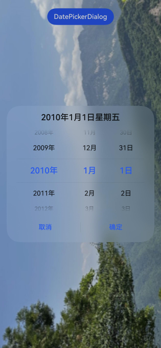
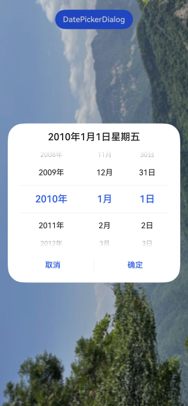

# 日期滑动选择器弹窗 (DatePickerDialog)
<!--Kit: ArkUI-->
<!--Subsystem: ArkUI-->
<!--Owner: @luoying_ace_admin-->
<!--Designer: @weixin_52725220-->
<!--Tester: @xiong0104-->
<!--Adviser: @HelloCrease-->

根据指定的日期范围创建日期滑动选择器并展示在弹窗上。

>  **说明：**
>
> - 该组件从API version 8开始支持。后续版本如有新增内容，则采用上角标单独标记该内容的起始版本。
>
> - 本模块功能依赖UI的执行上下文，不可在[UI上下文不明确](../../../ui/arkts-global-interface.md#ui上下文不明确)的地方使用，参见[UIContext](../arkts-apis-uicontext-uicontext.md)说明。
>
> - 本模块不支持深浅色模式热更新，如果需要进行深浅色模式切换，请重新打开弹窗。

## DatePickerDialog

### show<sup>(deprecated)</sup>

static show(options?: DatePickerDialogOptions)

定义日期滑动选择器弹窗并弹出。

> **说明：**
> 
> 从API version 18开始废弃。建议使用[UIContext](../arkts-apis-uicontext-uicontext.md)中的[showDatePickerDialog](../arkts-apis-uicontext-uicontext.md#showdatepickerdialog)替代。
>
> 从API version 10开始，可以通过使用[UIContext](../arkts-apis-uicontext-uicontext.md)中的[showDatePickerDialog](../arkts-apis-uicontext-uicontext.md#showdatepickerdialog)来明确UI的执行上下文。

**原子化服务API：** 从API version 11开始，该接口支持在原子化服务中使用。

**系统能力：** SystemCapability.ArkUI.ArkUI.Full

**设备行为差异：** 该接口在Wearable设备上使用时，应用程序运行异常，异常信息中提示接口未定义，在其他设备中可正常调用。

**参数：**

| 参数名  | 类型                                                        | 必填 | 说明                       |
| ------- | ----------------------------------------------------------- | ---- | -------------------------- |
| options | [DatePickerDialogOptions](#datepickerdialogoptions对象说明) | 否   | 配置日期选择器弹窗的参数。 |

## DatePickerDialogOptions对象说明

日期选择器弹窗选项。

继承自[DatePickerOptions](ts-basic-components-datepicker.md#datepickeroptions对象说明)。

**系统能力：** SystemCapability.ArkUI.ArkUI.Full

| 名称 | 类型 | 只读 | 可选 | 说明 |
| -------- | -------- | -------- | -------- | -------- |
| lunar | boolean | 否 | 是 | 日期是否显示为农历，true表示显示农历，false表示不显示农历。<br/>默认值：false<br/>**原子化服务API：** 从API version 11开始，该接口支持在原子化服务中使用。 |
| showTime<sup>10+</sup> | boolean | 否 | 是 | 是否展示时间项，true表示显示时间，false表示不显示时间。<br/>默认值：false<br/>当showTime=true时，mode参数不生效，显示默认年月日三列。<br/>**原子化服务API：** 从API version 11开始，该接口支持在原子化服务中使用。 |
| useMilitaryTime<sup>10+</sup> | boolean | 否 | 是 | 展示时间是否为24小时制，true表示显示24小时制，false表示显示12小时制。<br/>默认值：false<br />**说明：** <br/>当展示时间为12小时制时，上下午与小时无联动关系。<br/>**原子化服务API：** 从API version 11开始，该接口支持在原子化服务中使用。 |
| lunarSwitch<sup>10+</sup> | boolean | 否 | 是 | 是否展示切换农历的开关，true表示展示开关，false表示不展示开关。<br/>默认值：false<br/>**原子化服务API：** 从API version 11开始，该接口支持在原子化服务中使用。 |
| lunarSwitchStyle<sup>14+</sup> | [LunarSwitchStyle](#lunarswitchstyle14类型说明) | 否 | 是 | 设置农历开关颜色样式。<br/>默认值：{ selectedColor: `$r('sys.color.ohos_id_color_text_primary_actived')`, unselectedColor: `$r('sys.color.ohos_id_color_switch_outline_off')`, strokeColor: Color.White }<br/>**原子化服务API：** 从API version 14开始，该接口支持在原子化服务中使用。 |
| disappearTextStyle<sup>10+</sup> | [PickerTextStyle](ts-picker-common.md#pickertextstyle类型说明) | 否 | 是 | 设置过渡项（以选中项为基准向上或向下的第二项）的文本颜色、字号、字体粗细。<br/>默认值：<br/>{<br/>color: '#ff182431',<br/>font: {<br/>size: '14fp', <br/>weight: FontWeight.Regular<br/>}<br/>}<br/>**原子化服务API：** 从API version 11开始，该接口支持在原子化服务中使用。 |
| textStyle<sup>10+</sup> | [PickerTextStyle](ts-picker-common.md#pickertextstyle类型说明) | 否 | 是 | 设置一般项（以选中项为基准向上或向下的第一项）的文本颜色、字号、字体粗细。<br/>默认值：<br/>{<br/>color: '#ff182431',<br/>font: {<br/>size: '16fp', <br/>weight: FontWeight.Regular<br/>}<br/>}<br/>**原子化服务API：** 从API version 11开始，该接口支持在原子化服务中使用。 |
| selectedTextStyle<sup>10+</sup> | [PickerTextStyle](ts-picker-common.md#pickertextstyle类型说明) | 否 | 是 | 设置选中项的文本颜色、字号、字体粗细。<br/>默认值：<br/>{<br/>color: '#ff007dff',<br/>font: {<br/>size: '20fp', <br/>weight: FontWeight.Medium<br/>}<br/>} <br/>**原子化服务API：** 从API version 11开始，该接口支持在原子化服务中使用。|
| acceptButtonStyle<sup>12+</sup> | [PickerDialogButtonStyle](ts-picker-common.md#pickerdialogbuttonstyle12类型说明) | 否 | 是 | 设置确认按钮显示样式、样式和重要程度、角色、背景色、圆角、文本颜色、字号、字体粗细、字体样式、字体列表、按钮是否默认响应Enter键。<br />**说明：**<br/>1.acceptButtonStyle与cancelButtonStyle中最多只能有一个primary字段配置为true，如果同时设置为true，则primary字段不生效，保持默认值false。<br/>2.按钮高度默认40vp，在关怀模式-大字体场景下高度不变，即使按钮样式设置为圆角矩形[ROUNDED_RECTANGLE](ts-basic-components-button.md#buttontype枚举说明)，呈现效果依然是胶囊型按钮[Capsule](ts-basic-components-button.md#buttontype枚举说明)。<br/>**原子化服务API：** 从API version 12开始，该接口支持在原子化服务中使用。|
| cancelButtonStyle<sup>12+</sup> | [PickerDialogButtonStyle](ts-picker-common.md#pickerdialogbuttonstyle12类型说明) | 否 | 是 | 设置取消按钮显示样式、样式和重要程度、角色、背景色、圆角、文本颜色、字号、字体粗细、字体样式、字体列表、按钮是否默认响应Enter键。<br />**说明：**<br/>1.acceptButtonStyle与cancelButtonStyle中最多只能有一个primary字段配置为true，如果同时设置为true，则primary字段不生效，保持默认值false。<br/>2.按钮高度默认40vp，在关怀模式-大字体场景下高度不变，即使按钮样式设置为圆角矩形[ROUNDED_RECTANGLE](ts-basic-components-button.md#buttontype枚举说明)，呈现效果依然是胶囊型按钮[Capsule](ts-basic-components-button.md#buttontype枚举说明)。<br/>**原子化服务API：** 从API version 12开始，该接口支持在原子化服务中使用。|
| alignment<sup>10+</sup>  | [DialogAlignment](ts-methods-alert-dialog-box.md#dialogalignment枚举说明) | 否  | 是  | 弹窗在竖直方向上的对齐方式。<br>默认值：DialogAlignment.Default<br/>**原子化服务API：** 从API version 11开始，该接口支持在原子化服务中使用。 |
| offset<sup>10+</sup>     | [Offset](ts-types.md#offset) | 否    | 是    | 弹窗相对alignment所在位置的偏移量。<br/>默认值：{&nbsp;dx:&nbsp;0&nbsp;,&nbsp;dy:&nbsp;0&nbsp;}<br/>**原子化服务API：** 从API version 11开始，该接口支持在原子化服务中使用。|
| maskRect<sup>10+</sup>| [Rectangle](ts-methods-alert-dialog-box.md#rectangle8类型说明) | 否    | 是    | 弹窗遮蔽层区域，在遮蔽层区域内的事件不透传，在遮蔽层区域外的事件透传。<br/>默认值：{ x: 0, y: 0, width: '100%', height: '100%' }<br/>**原子化服务API：** 从API version 11开始，该接口支持在原子化服务中使用。 |
| onAccept<sup>(deprecated)</sup> | (value: [DatePickerResult](ts-basic-components-datepicker.md#datepickerresult对象说明)) => void | 否 | 是 | 点击弹窗中的“确定”按钮时触发该回调。<br />**说明：**<br />从API version 8 开始支持，从 API version 10 开始废弃。建议使用onDateAccept。 |
| onCancel | [VoidCallback](ts-types.md#voidcallback12) | 否 | 是 | 点击弹窗中的“取消”按钮时触发该回调。<br/>**原子化服务API：** 从API version 11开始，该接口支持在原子化服务中使用。 |
| onChange<sup>(deprecated)</sup> | (value: [DatePickerResult](ts-basic-components-datepicker.md#datepickerresult对象说明)) => void | 否 | 是 | 滑动弹窗中的滑动选择器使当前选中项改变时触发该回调。<br />**说明：**<br />从API version 8 开始支持，从 API version 10 开始废弃。建议使用onDateChange。 |
| onDateAccept<sup>10+</sup> | [Callback](ts-types.md#callback12)\<Date> | 否 | 是 | 点击弹窗中的“确定”按钮时触发该回调。<br />**说明：**<br />当showTime设置为true时，回调接口返回值value中时和分为选择器选择的时和分。否则，返回值value中时和分为系统时间的时和分。<br/>**原子化服务API：** 从API version 11开始，该接口支持在原子化服务中使用。 |
| onDateChange<sup>10+</sup> | [Callback](ts-types.md#callback12)\<Date> | 否 | 是 | 滑动弹窗中的滑动选择器使当前选中项改变时触发该回调。<br />**说明：**<br />当showTime设置为true时，回调接口返回值value中时和分为选择器选择的时和分。否则，返回值value中时和分为系统时间的时和分。<br/>**原子化服务API：** 从API version 11开始，该接口支持在原子化服务中使用。 |
| backgroundColor<sup>11+</sup> | [ResourceColor](ts-types.md#resourcecolor)  | 否 | 是 | 弹窗背板颜色。<br/>默认值：Color.Transparent<br/>**说明：** <br/>当设置了backgroundColor为非透明色时，backgroundBlurStyle需要设置为BlurStyle.NONE，否则颜色显示将不符合预期效果。<br/>**原子化服务API：** 从API version 12开始，该接口支持在原子化服务中使用。 |
| backgroundBlurStyle<sup>11+</sup> | [BlurStyle](ts-universal-attributes-background.md#blurstyle9) | 否 | 是 | 弹窗背板模糊材质。<br/>默认值：BlurStyle.COMPONENT_ULTRA_THICK<br/>**说明：** <br/>设置为BlurStyle.NONE关闭背景虚化。设置backgroundBlurStyle为非NONE值时，不要设置backgroundColor，否则颜色显示将不符合预期效果。<br/>**原子化服务API：** 从API version 12开始，该接口支持在原子化服务中使用。 |
| backgroundBlurStyleOptions<sup>19+</sup> | [BackgroundBlurStyleOptions](ts-universal-attributes-background.md#backgroundblurstyleoptions10对象说明) | 否 | 是 | 背景模糊效果。<br />**原子化服务API：** 从API version 19开始，该接口支持在原子化服务中使用。 |
| backgroundEffect<sup>19+</sup> | [BackgroundEffectOptions](ts-universal-attributes-background.md#backgroundeffectoptions11) | 否 | 是 | 背景效果参数。<br />**原子化服务API：** 从API version 19开始，该接口支持在原子化服务中使用。 |
| onDidAppear<sup>12+</sup> | [VoidCallback](ts-types.md#voidcallback12) | 否 | 是 | 弹窗弹出时的事件回调。<br />**说明：**<br />1.正常时序为：onWillAppear>>onDidAppear>>(onDateAccept/onCancel/onDateChange)>>onWillDisappear>>onDidDisappear。<br />2.在onDidAppear内设置改变弹窗显示效果的回调事件。二次弹出生效。<br />3.快速点击弹出，消失弹窗时，存在onWillDisappear在onDidAppear前生效。<br />4. 当弹窗入场动效未完成时关闭弹窗，该回调不会触发。<br/>**原子化服务API：** 从API version 12开始，该接口支持在原子化服务中使用。 |
| onDidDisappear<sup>12+</sup> | [VoidCallback](ts-types.md#voidcallback12) | 否 | 是 | 弹窗消失时的事件回调。<br />**说明：**<br />1.正常时序为：onWillAppear>>onDidAppear>>(onDateAccept/onCancel/onDateChange)>>onWillDisappear>>onDidDisappear。<br/>**原子化服务API：** 从API version 12开始，该接口支持在原子化服务中使用。 |
| onWillAppear<sup>12+</sup> | [VoidCallback](ts-types.md#voidcallback12) | 否 | 是 | 弹窗显示动效前的事件回调。<br />**说明：**<br />1.正常时序为：onWillAppear>>onDidAppear>>(onDateAccept/onCancel/onDateChange)>>onWillDisappear>>onDidDisappear。<br />2.在onWillAppear内设置改变弹窗显示效果的回调事件。二次弹出生效。 <br/>**原子化服务API：** 从API version 12开始，该接口支持在原子化服务中使用。|
| onWillDisappear<sup>12+</sup> | [VoidCallback](ts-types.md#voidcallback12) | 否 | 是 | 弹窗退出动效前的事件回调。<br />**说明：**<br />1.正常时序为：onWillAppear>>onDidAppear>>(onDateAccept/onCancel/onDateChange)>>onWillDisappear>>onDidDisappear。<br />2.快速点击弹出，消失弹窗时，存在onWillDisappear在onDidAppear前生效。 <br/>**原子化服务API：** 从API version 12开始，该接口支持在原子化服务中使用。|
| shadow<sup>12+</sup>              | [ShadowOptions](ts-universal-attributes-image-effect.md#shadowoptions对象说明)&nbsp;\|&nbsp;[ShadowStyle](ts-universal-attributes-image-effect.md#shadowstyle10枚举说明) | 否  | 是  | 设置弹窗背板的阴影。<br /> 当设备为2in1时，默认场景下获焦阴影值为ShadowStyle.OUTER_FLOATING_MD，失焦为ShadowStyle.OUTER_FLOATING_SM。                 <br/>**原子化服务API：** 从API version 12开始，该接口支持在原子化服务中使用。|
| dateTimeOptions<sup>12+</sup> | [DateTimeOptions](../../apis-localization-kit/js-apis-intl.md#datetimeoptionsdeprecated) | 否 | 是 | 设置时分是否显示前导0，支持设置hour和minute参数。<br/>默认值：<br/>hour: 24小时制默认为"2-digit"，设置hour是否按照2位数字显示，如果实际数值小于10，则会补充前导0并显示，即为"0X"；12小时制默认为"numeric"，即没有前导0。<br/>minute: 默认为"2-digit"，设置minute是否按照2位数字显示，如果实际数值小于10，则会补充前导0并显示，即为"0X"。<br/>**原子化服务API：** 从API version 12开始，该接口支持在原子化服务中使用。|
| enableHoverMode<sup>14+</sup>     | boolean | 否  | 是  | 是否响应悬停态。<br />默认值：false。false表示不响应悬停，true表示响应悬停。<br/>**原子化服务API：** 从API version 14开始，该接口支持在原子化服务中使用。|
| hoverModeArea<sup>14+</sup>       | [HoverModeAreaType](ts-appendix-enums.md#hovermodeareatype14) | 否  | 是  | 悬停态下弹窗默认展示区域。<br />默认值：HoverModeAreaType.BOTTOM_SCREEN <br/>**原子化服务API：** 从API version 14开始，该接口支持在原子化服务中使用。|
| enableHapticFeedback<sup>18+</sup> | boolean | 否  | 是  | 设置是否开启触控反馈。<br />默认值：true，true表示开启触控反馈，false表示不开启触控反馈。<br />**原子化服务API**： 从API version 18开始，该接口支持在原子化服务中使用。<br />**说明**：<br />开启触控反馈时，需要在工程的module.json5中配置requestPermissions字段开启振动权限，配置如下：<br />"requestPermissions": [{"name": "ohos.permission.VIBRATE"}]|
| canLoop<sup>20+</sup> | boolean | 否 | 是 | 设置是否可循环滚动。<br/>默认值：true<br/>**说明：**<br/>true：可循环，年份随着月份的循环滚动进行联动加减，月份随着日的循环滚动进行联动加减。<br/>false：不可循环，年/月/日到达本列的顶部或底部时，无法再进行滚动，年/月/日之间也无法再联动加减。<br/>**原子化服务API：** 从API version 20开始，该接口支持在原子化服务中使用。 |

## LunarSwitchStyle<sup>14+</sup>类型说明

定义了DatePickerDialog组件中农历切换开关的样式。

**原子化服务API：** 从API version 14开始，该接口支持在原子化服务中使用。

**系统能力：** SystemCapability.ArkUI.ArkUI.Full

|  名称  | 类型                 | 只读 | 可选 | 说明       |
| ------ |-------------------|-----|----------|----------|
| selectedColor| [ResourceColor](ts-types.md#resourcecolor) | 否  | 是  | 设置开关开启时开关的背景颜色。<br/>默认值：$r('sys.color.ohos_id_color_text_primary_actived')。 |
| unselectedColor | [ResourceColor](ts-types.md#resourcecolor) | 否  | 是  | 设置开关未开启时开关的边框颜色。<br/>默认值：$r('sys.color.ohos_id_color_switch_outline_off')。 |
| strokeColor     | [ResourceColor](ts-types.md#resourcecolor) | 否  | 是  | 设置开关内部图标颜色。<br/>默认值：Color.White。 |

**异常情形说明:**

| 异常情形   | 对应结果  |
| -------- |  ------------------------------------------------------------ |
| 起始日期晚于结束日期，选中日期未设置    | 起始日期、结束日期和选中日期都为默认值  |
| 起始日期晚于结束日期，选中日期早于起始日期默认值    | 起始日期、结束日期都为默认值，选中日期为起始日期默认值  |
| 起始日期晚于结束日期，选中日期晚于结束日期默认值    | 起始日期、结束日期都为默认值，选中日期为结束日期默认值  |
| 起始日期晚于结束日期，选中日期在起始日期与结束日期默认值范围内    | 起始日期、结束日期都为默认值，选中日期为设置的值 |
| 选中日期早于起始日期    | 选中日期为起始日期  |
| 选中日期晚于结束日期    | 选中日期为结束日期  |
| 起始日期晚于当前系统日期，选中日期未设置    | 选中日期为起始日期  |
| 结束日期早于当前系统日期，选中日期未设置    | 选中日期为结束日期  |
| 日期格式不符合规范，如‘1999-13-32’   | 取默认值  |
| 起始日期或结束日期早于系统有效范围    | 起始日期或结束日期取系统有效范围最早日期  |
| 起始日期或结束日期晚于系统有效范围    | 起始日期或结束日期取系统有效范围最晚日期  |

系统日期范围：1900-1-31 ~ 2100-12-31

选中日期会在起始日期与结束日期异常处理完成后再进行异常情形判断处理

## 示例

>  **说明：**
>
> 推荐通过使用[UIContext](../arkts-apis-uicontext-uicontext.md)中的[showDatePickerDialog](../arkts-apis-uicontext-uicontext.md#showdatepickerdialog)来明确UI的执行上下文。

### 示例1（设置显示时间）

该示例通过showTime、useMilitaryTime、dateTimeOptions设置显示时间。

```ts
// xxx.ets
@Entry
@Component
struct DatePickerDialogExample {
  selectedDate: Date = new Date("2010-1-1");

  build() {
    Column() {
      Button("DatePickerDialog")
        .margin(20)
        .onClick(() => {
          this.getUIContext().showDatePickerDialog({
            start: new Date("2000-1-1"),
            end: new Date("2100-12-31"),
            selected: this.selectedDate,
            showTime: true,
            useMilitaryTime: false,
            dateTimeOptions: { hour: "numeric", minute: "2-digit" },
            onDateAccept: (value: Date) => {
              // 通过Date的setFullYear方法设置按下确定按钮时的日期，这样当弹窗再次弹出时显示选中的是上一次确定的日期
              this.selectedDate = value;
              console.info("DatePickerDialog:onDateAccept()" + value.toString());
            },
            onCancel: () => {
              console.info("DatePickerDialog:onCancel()");
            },
            onDateChange: (value: Date) => {
              console.info("DatePickerDialog:onDateChange()" + value.toString());
            },
            onDidAppear: () => {
              console.info("DatePickerDialog:onDidAppear()");
            },
            onDidDisappear: () => {
              console.info("DatePickerDialog:onDidDisappear()");
            },
            onWillAppear: () => {
              console.info("DatePickerDialog:onWillAppear()");
            },
            onWillDisappear: () => {
              console.info("DatePickerDialog:onWillDisappear()");
            }
          })
        })
    }.width('100%')
  }
}
```


### 示例2（自定义样式）

该示例通过配置disappearTextStyle、textStyle、selectedTextStyle、acceptButtonStyle、cancelButtonStyle实现了自定义文本以及按钮样式。

```ts
// xxx.ets
@Entry
@Component
struct DatePickerDialogExample {
  selectedDate: Date = new Date("2010-1-1");

  build() {
    Column() {
      Button("DatePickerDialog")
        .margin(20)
        .onClick(() => {
          this.getUIContext().showDatePickerDialog({
            start: new Date("2000-1-1"),
            end: new Date("2100-12-31"),
            selected: this.selectedDate,
            disappearTextStyle: { color: '#297bec', font: { size: '20fp', weight: FontWeight.Bold } },
            textStyle: { color: Color.Black, font: { size: '18fp', weight: FontWeight.Normal } },
            selectedTextStyle: { color: Color.Blue, font: { size: '26fp', weight: FontWeight.Regular } },
            acceptButtonStyle: {
              type: ButtonType.Normal,
              style: ButtonStyleMode.NORMAL,
              role: ButtonRole.NORMAL,
              fontColor: 'rgb(81, 81, 216)',
              fontSize: '26fp',
              fontWeight: FontWeight.Bolder,
              fontStyle: FontStyle.Normal,
              fontFamily: 'sans-serif',
              backgroundColor: '#A6ACAF',
              borderRadius: 20
            },
            cancelButtonStyle: {
              type: ButtonType.Normal,
              style: ButtonStyleMode.NORMAL,
              role: ButtonRole.NORMAL,
              fontColor: Color.Blue,
              fontSize: '16fp',
              fontWeight: FontWeight.Normal,
              fontStyle: FontStyle.Italic,
              fontFamily: 'sans-serif',
              backgroundColor: '#50182431',
              borderRadius: 10
            },
            onDateAccept: (value: Date) => {
              // 通过Date的setFullYear方法设置按下确定按钮时的日期，这样当弹窗再次弹出时显示选中的是上一次确定的日期
              this.selectedDate = value;
              console.info("DatePickerDialog:onDateAccept()" + value.toString());
            },
            onCancel: () => {
              console.info("DatePickerDialog:onCancel()");
            },
            onDateChange: (value: Date) => {
              console.info("DatePickerDialog:onDateChange()" + value.toString());
            },
            onDidAppear: () => {
              console.info("DatePickerDialog:onDidAppear()");
            },
            onDidDisappear: () => {
              console.info("DatePickerDialog:onDidDisappear()");
            },
            onWillAppear: () => {
              console.info("DatePickerDialog:onWillAppear()");
            },
            onWillDisappear: () => {
              console.info("DatePickerDialog:onWillDisappear()");
            }
          });
        })
    }.width('100%')
  }
}
```


> **说明：**
>
> 如需完全自定义实现日期滑动选择器弹窗，可以通过先使用[自定义弹窗 (CustomDialog)](ts-methods-custom-dialog-box.md)，然后使用[DatePicker](ts-basic-components-datepicker.md)组件来实现。

### 示例3（悬停态弹窗）

该示例展示了在折叠屏悬停态下设置dialog布局区域的效果。

```ts
@Entry
@Component
struct DatePickerDialogExample {
  selectedDate: Date = new Date("2010-1-1");

  build() {
    Column() {
      Button("DatePickerDialog")
        .margin(20)
        .onClick(() => {
          this.getUIContext().showDatePickerDialog({
            start: new Date("2000-1-1"),
            end: new Date("2100-12-31"),
            selected: this.selectedDate,
            showTime: true,
            useMilitaryTime: false,
            disappearTextStyle: { color: Color.Pink, font: { size: '22fp', weight: FontWeight.Bold }},
            textStyle: { color: '#ff00ff00', font: { size: '18fp', weight: FontWeight.Normal }},
            selectedTextStyle: { color: '#ff182431', font: { size: '14fp', weight: FontWeight.Regular }},
            onDateAccept: (value: Date) => {
              // 通过Date的setFullYear方法设置按下确定按钮时的日期，这样当弹窗再次弹出时显示选中的是上一次确定的日期
              this.selectedDate = value;
              console.info("DatePickerDialog:onDateAccept()" + value.toString());
            },
            onCancel: () => {
              console.info("DatePickerDialog:onCancel()");
            },
            onDateChange: (value: Date) => {
              console.info("DatePickerDialog:onDateChange()" + value.toString());
            },
            onDidAppear: () => {
              console.info("DatePickerDialog:onDidAppear()");
            },
            onDidDisappear: () => {
              console.info("DatePickerDialog:onDidDisappear()");
            },
            onWillAppear: () => {
              console.info("DatePickerDialog:onWillAppear()");
            },
            onWillDisappear: () => {
              console.info("DatePickerDialog:onWillDisappear()");
            },
            enableHoverMode: true,
            hoverModeArea: HoverModeAreaType.TOP_SCREEN
          });
        })
    }.width('100%')
  }
}
```


### 示例4（设置弹窗位置）

该示例通过alignment、offset设置弹窗的位置。

```ts
// xxx.ets
@Entry
@Component
struct DatePickerDialogExample {
  selectedDate: Date = new Date("2010-1-1");

  build() {
    Column() {
      Button("DatePickerDialog")
        .margin(20)
        .onClick(() => {
          this.getUIContext().showDatePickerDialog({
            start: new Date("2000-1-1"),
            end: new Date("2100-12-31"),
            selected: this.selectedDate,
            alignment: DialogAlignment.Center,
            offset: { dx: 20, dy: 0 },
            onDateAccept: (value: Date) => {
              // 通过Date的setFullYear方法设置按下确定按钮时的日期，这样当弹窗再次弹出时显示选中的是上一次确定的日期
              this.selectedDate = value;
              console.info("DatePickerDialog:onDateAccept()" + value.toString());
            }
          });
        })
    }.width('100%')
  }
}
```


### 示例5（设置遮蔽区）

该示例通过maskRect设置遮蔽区。

```ts
// xxx.ets
@Entry
@Component
struct DatePickerDialogExample {
  selectedDate: Date = new Date("2010-1-1");

  build() {
    Column() {
      Button("DatePickerDialog")
        .margin(20)
        .onClick(() => {
          this.getUIContext().showDatePickerDialog({
            start: new Date("2000-1-1"),
            end: new Date("2100-12-31"),
            selected: this.selectedDate,
            maskRect: {
              x: 30,
              y: 60,
              width: '100%',
              height: '60%'
            },
            onDateAccept: (value: Date) => {
              // 通过Date的setFullYear方法设置按下确定按钮时的日期，这样当弹窗再次弹出时显示选中的是上一次确定的日期
              this.selectedDate = value;
              console.info("DatePickerDialog:onDateAccept()" + value.toString());
            }
          });
        })
    }.width('100%')
  }
}
```


### 示例6（设置弹窗背板）

该示例通过backgroundColor、backgroundBlurStyle、shadow设置弹窗背板。

```ts
// xxx.ets
@Entry
@Component
struct DatePickerDialogExample {
  selectedDate: Date = new Date("2010-1-1");

  build() {
    Column() {
      Button("DatePickerDialog")
        .margin(20)
        .onClick(() => {
          this.getUIContext().showDatePickerDialog({
            start: new Date("2000-1-1"),
            end: new Date("2100-12-31"),
            selected: this.selectedDate,
            backgroundColor: 'rgb(204, 226, 251)',
            backgroundBlurStyle: BlurStyle.NONE,
            shadow: ShadowStyle.OUTER_FLOATING_SM,
            onDateAccept: (value: Date) => {
              // 通过Date的setFullYear方法设置按下确定按钮时的日期，这样当弹窗再次弹出时显示选中的是上一次确定的日期
              this.selectedDate = value;
              console.info("DatePickerDialog:onDateAccept()" + value.toString());
            }
          });
        })
    }.width('100%')
  }
}
```


### 示例7（设置公历农历）

该示例通过lunar、lunarSwitch设置弹窗显示公历或农历。

```ts
// xxx.ets
@Entry
@Component
struct DatePickerDialogExample {
  selectedDate: Date = new Date("2010-1-1");

  build() {
    Column() {
      Button("DatePickerDialog")
        .margin(20)
        .onClick(() => {
          this.getUIContext().showDatePickerDialog({
            start: new Date("2000-1-1"),
            end: new Date("2100-12-31"),
            selected: this.selectedDate,
            lunar: false,
            onDateAccept: (value: Date) => {
              // 通过Date的setFullYear方法设置按下确定按钮时的日期，这样当弹窗再次弹出时显示选中的是上一次确定的日期
              this.selectedDate = value;
              console.info("DatePickerDialog:onDateAccept()" + value.toString());
            }
          });
        })

      Button("Lunar DatePickerDialog")
        .margin(20)
        .onClick(() => {
          this.getUIContext().showDatePickerDialog({
            start: new Date("2000-1-1"),
            end: new Date("2100-12-31"),
            selected: this.selectedDate,
            lunar: true,
            lunarSwitch: true,
            onDateAccept: (value: Date) => {
              this.selectedDate = value;
              console.info("DatePickerDialog:onDateAccept()" + value.toString());
            }
          });
        })
    }.width('100%')
  }
}
```


### 示例8（设置显示月、日列）

该示例通过配置mode参数实现显示月、日两列。

```ts
// xxx.ets
@Entry
@Component
struct DatePickerDialogExample {
  selectedDate: Date = new Date("2010-1-1");

  build() {
    Column() {
      Button("DatePickerDialog")
        .margin(20)
        .onClick(() => {
          this.getUIContext().showDatePickerDialog({
            start: new Date("2000-1-1"),
            end: new Date("2100-12-31"),
            selected: this.selectedDate,
            mode: DatePickerMode.MONTH_AND_DAY,
            onDateAccept: (value: Date) => {
              // 通过Date的setFullYear方法设置按下确定按钮时的日期，这样当弹窗再次弹出时显示选中的是上一次确定的日期
              this.selectedDate = value;
              console.info("DatePickerDialog:onDateAccept()" + value.toString());
            }
          });
        })
    }.width('100%')
  }
}
```


### 示例9（设置循环滚动）

该示例使用canLoop设置是否循环滚动。

```ts
// xxx.ets
@Entry
@Component
struct DatePickerDialogExample {
  @State isLoop: boolean = true;
  selectedDate: Date = new Date("2010-1-1");

  build() {
    Column() {
      Button("DatePickerDialog")
        .margin(20)
        .onClick(() => {
          this.getUIContext().showDatePickerDialog({
            start: new Date("2000-1-1"),
            end: new Date("2100-12-31"),
            selected: this.selectedDate,
            canLoop: this.isLoop,
            onDateAccept: (value: Date) => {
              // 通过Date的setFullYear方法设置按下确定按钮时的日期，这样当弹窗再次弹出时显示选中的是上一次确定的日期
              this.selectedDate = value;
              console.info("DatePickerDialog:onDateAccept()" + value.toString());
            }
          });
        })

      Row() {
        Text('循环滚动').fontSize(20)
        Toggle({ type: ToggleType.Switch, isOn: true })
          .onChange((isOn: boolean) => {
            this.isLoop = isOn;
          })
      }.position({ x: '60%', y: '40%' })
    }.width('100%')
  }
}
```


### 示例10（自定义背景模糊效果参数）

从API version 19开始，该示例通过配置[backgroundBlurStyleOptions](#datepickerdialogoptions对象说明)，实现自定义背景模糊效果。

```ts
@Entry
@Component
struct DatePickerDialogExample {
  selectedDate: Date = new Date("2010-1-1");

  build() {
    Stack({ alignContent: Alignment.Top }) {
      Image($r('app.media.bg'))
      Column() {
        Button("DatePickerDialog")
          .margin(20)
          .onClick(() => {
            this.getUIContext().showDatePickerDialog({
              start: new Date("2000-1-1"),
              end: new Date("2100-12-31"),
              selected: this.selectedDate,
              backgroundColor: undefined,
              backgroundBlurStyle: BlurStyle.Thin,
              backgroundBlurStyleOptions: {
                colorMode: ThemeColorMode.LIGHT,
                adaptiveColor: AdaptiveColor.AVERAGE,
                scale: 1,
                blurOptions: { grayscale: [20, 20] },
              },
            });
          })
      }.width('100%')
    }
  }
}
```



### 示例11（自定义背景效果参数）

从API version 19开始，该示例通过配置[backgroundEffect](#datepickerdialogoptions对象说明)，实现自定义背景效果。

```ts
@Entry
@Component
struct DatePickerDialogExample {
  selectedDate: Date = new Date("2010-1-1");

  build() {
    Stack({ alignContent: Alignment.Top }) {
      Image($r('app.media.bg'))
      Column() {
        Button("DatePickerDialog")
          .margin(20)
          .onClick(() => {
            this.getUIContext().showDatePickerDialog({
              start: new Date("2000-1-1"),
              end: new Date("2100-12-31"),
              selected: this.selectedDate,
              backgroundColor: undefined,
              backgroundBlurStyle: BlurStyle.Thin,
              backgroundEffect: {
                radius: 60,
                saturation: 0,
                brightness: 1,
                color: Color.White,
                blurOptions: { grayscale: [20, 20] }
              },
            });
          })
      }.width('100%')
    }
  }
}
```

