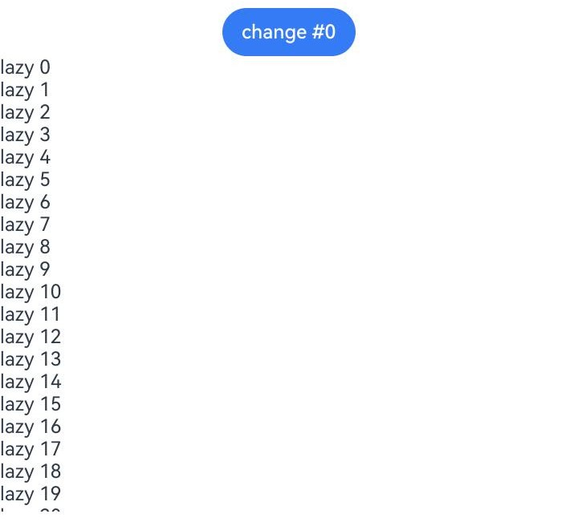

# LazyForEach (ArkTS-Sta)

> **说明**
>
> 本模块首批接口从API version 23开始支持。后续版本的新增接口，采用上角标单独标记接口的起始版本。

开发者指南见：[ArkTS-Dyn LazyForEach开发者指南](../../../ui/state-management/arkts-rendering-control-lazyforeach.md)。
在大量子组件的场景下，LazyForEach与缓存列表项、动态预加载、组件复用等方法配合使用，可以进一步提升滑动帧率并降低应用内存占用。最佳实践请参考[优化长列表加载慢丢帧问题](https://developer.huawei.com/consumer/cn/doc/best-practices/bpta-best-practices-long-list)。

## 导入模块

```ts
import { LazyForEach, IDataSource, DataChangeListener } from '@ohos.arkui.component';
// 如果使用listener.onDatasetChange()进行批量数据修改，按需import以下DataOperation
import { DataOperation, DataOperationType, DataAddOperation, DataDeleteOperation, DataChangeOperation, DataMoveOperation, DataExchangeOperation, DataReloadOperation } from '@ohos.arkui.component';
```

## 接口

LazyForEach\<T\>(dataSource: IDataSource, itemGenerator: (item: T, index: int) => void, keyGenerator?: (item: T, index: int) => string)

LazyForEach从提供的数据源中按需迭代数据，并在每次迭代过程中创建相应的组件。在滚动容器中使用了LazyForEach时，框架会根据滚动容器可视区域按需创建组件，当组件滑出可视区域外时，框架会进行组件销毁回收以降低内存占用。

**系统能力：** SystemCapability.ArkUI.ArkUI.Full

**参数：**

| 参数名        | 类型                                                      | 必填 | 说明                                                         |
| ------------- | --------------------------------------------------------- | ---- | ------------------------------------------------------------ |
| dataSource    | [IDataSource](#idatasource)                       | 是   | LazyForEach数据源，需要开发者实现相关接口。                  |
| itemGenerator | (item: T, index: int)&nbsp;=&gt;&nbsp;void   | 是   | 子组件生成函数，为数组中的每一个数据项创建一个子组件。<br/>**说明：**<br/>- item是当前数据项，index是数据项索引值。<br/>- itemGenerator的函数体必须使用大括号{...}。<br />- itemGenerator每次迭代只能并且必须生成一个子组件。<br />- itemGenerator中可以使用if语句，但是必须保证if语句每个分支都会创建一个相同类型的子组件。 |
| keyGenerator  | (item: T, index: int)&nbsp;=&gt;&nbsp;string | 否   | 键值生成函数，用于给数据源中的每一个数据项生成唯一且固定的键值。修改数据源中的一个数据项若不影响其生成的键值，则对应组件不会被更新，否则此处组件就会被重建更新。`keyGenerator`参数是可选的，但是，为了使开发框架能够更好地识别数组更改并正确更新组件，建议提供。<br/>**说明：**<br/>- item是当前数据项，index是数据项索引值。<br/>- 数据源中的每一个数据项生成的键值不能重复。<br/>- `keyGenerator`缺省时，使用默认的键值生成函数，即`(item: T, index: int) => { return viewId + '-' + index.toString(); }`，生成键值仅受索引值index影响。 |

> **说明：** 
>
> 应避免在`keyGenerator`和`itemGenerator`函数中执行耗时操作，以减少应用滑动时卡顿丢帧问题，最佳实践请参考[主线程耗时操作优化-循环渲染](https://developer.huawei.com/consumer/cn/doc/best-practices/bpta-time-optimization-of-the-main-thread#section4551193714439)。
> 避免使用JSON.stringify函数。在复杂的业务场景中，使用JSON.stringify会对item对象进行序列化，该过程会消耗大量时间与计算资源，从而降低页面性能，最佳实践请参考[懒加载优化性能-键值生成规则](https://developer.huawei.com/consumer/cn/doc/best-practices/bpta-lazyforeach-optimization#section68711519072)。

## IDataSource

**系统能力：** SystemCapability.ArkUI.ArkUI.Full

ArkTS-Sta中IDataSource强制要求声明`<T>`类型。

### totalCount

totalCount(): int

获得数据总数。

**系统能力：** SystemCapability.ArkUI.ArkUI.Full

**返回值：**

| 类型                | 说明        |
| ------------------- | --------- |
| int | 获得数据总数，由数据源决定实际大小。 |

### getData

getData(index: int): T

获取索引值index对应的数据。

**系统能力：** SystemCapability.ArkUI.ArkUI.Full

**参数：**

| 参数名 | 类型   | 必填 | 说明                 |
| ------ | ------ | ---- | -------------------- |
| index  | int | 是   | 获取数据对应的索引值。取值范围是[0, 数据源长度-1]。 |

**返回值：**

| 类型                | 说明        |
| ------------------- | --------- |
| T | 获取索引值index对应的数据，由数据源决定具体类型。 |

> **说明：** 
>
> 应避免在`getData`函数中执行耗时操作，以此来减少应用滑动时卡顿丢帧问题，最佳实践请参考[主线程耗时操作优化-循环渲染](https://developer.huawei.com/consumer/cn/doc/best-practices/bpta-time-optimization-of-the-main-thread#section4551193714439)。

### registerDataChangeListener

registerDataChangeListener(listener: DataChangeListener): void

注册数据改变的监听器。

**系统能力：** SystemCapability.ArkUI.ArkUI.Full

**参数：**

| 参数名   | 类型                                        | 必填 | 说明           |
| -------- | ------------------------------------------- | ---- | -------------- |
| listener | [DataChangeListener](#datachangelistener) | 是   | 数据变化监听器。 |

### unregisterDataChangeListener

unregisterDataChangeListener(listener: DataChangeListener): void

注销数据改变的监听器。

**系统能力：** SystemCapability.ArkUI.ArkUI.Full

**参数：**

| 参数名   | 类型                                        | 必填 | 说明           |
| -------- | ------------------------------------------- | ---- | -------------- |
| listener | [DataChangeListener](#datachangelistener) | 是   | 数据变化监听器。 |

## DataChangeListener

数据变化监听器。

> **说明：** 
>
> DataChangeListener除onDatasetChange以外的方法中，当参数包含index且值为负数时，会默认用0来替换。onDatasetChange中，当单个DataOperation参数包含index且值在数据源索引范围之外（DataAddOperation中index可以等于数据源长度），则对应DataOperation不会生效。

**系统能力：** SystemCapability.ArkUI.ArkUI.Full

### onDataReloaded

onDataReloaded(): void

通知组件重新加载所有数据。键值没有变化的数据项会使用原先的子组件，键值发生变化的会重建子组件。重新加载数据完成后调用。

**系统能力：** SystemCapability.ArkUI.ArkUI.Full

### onDataAdd

onDataAdd(index: int): void

通知组件index的位置有数据添加。添加数据完成后调用

**系统能力：** SystemCapability.ArkUI.ArkUI.Full

**参数：**

| 参数名 | 类型   | 必填 | 说明           |
| ------ | ------ | ---- | -------------- |
| index  | int | 是   | 数据添加位置的索引值。取值范围是[0, 数据源长度-1]。 |

### onDataMove

onDataMove(from: int, to: int): void

通知组件数据有移动。将from和to位置的数据进行交换。数据移动起始位置与数据移动目标位置交换完成后调用。

> **说明：** 
>
> 数据移动前后键值要保持不变，如果键值有变化，应使用删除数据和新增数据接口。

**系统能力：** SystemCapability.ArkUI.ArkUI.Full

**参数：**

| 参数名 | 类型   | 必填 | 说明             |
| ------ | ------ | ---- | ---------------- |
| from   | int | 是   | 数据移动起始位置。取值范围是[0, 数据源长度-1]。 |
| to     | int | 是   | 数据移动目标位置。取值范围是[0, 数据源长度-1]。 |

### onDataDelete

onDataDelete(index: int): void

通知组件删除index位置的数据并重新加载LazyForEach的展示内容。删除数据完成后调用。

> **说明：** 
>
> 需要保证dataSource中的对应数据已经在调用onDataDelete前删除，否则页面渲染将出现未定义的行为。

**系统能力：** SystemCapability.ArkUI.ArkUI.Full

**参数：**

| 参数名 | 类型   | 必填 | 说明                 |
| ------ | ------ | ---- | -------------------- |
| index  | int | 是   | 数据删除位置的索引值。取值范围是[0, 数据源长度-1]。 |

### onDataChange

onDataChange(index: int): void

通知组件index的位置有数据有变化。改变数据完成后调用。

**系统能力：** SystemCapability.ArkUI.ArkUI.Full

**参数：**

| 参数名 | 类型   | 必填 | 说明                 |
| ------ | ------ | ---- | -------------------- |
| index  | int | 是   | 数据变化位置的索引值。取值范围是[0, 数据源长度-1]。 |

### onDatasetChange

onDatasetChange(dataOperations: DataOperation[]): void

批量数据处理后，调用onDatasetChange接口，通知组件按照dataOperations刷新。

> **说明：** 
>
> onDatasetChange接口不能与其他DataChangeListener的更新接口混用。如在同一个LazyForEach中，调用过onDataAdd接口后，不能再调用onDatasetChange接口；反之，调用过onDatasetChange接口后，也不能调用onDataAdd等其他更新接口。页面中不同LazyForEach之间互不影响。

使用`onDatasetChange()`进行批量数据修改时，`DataOperation`每一个数组项需要转换为对应的类型，见[批量数据修改场景](../../../ui/state-management/arkts-sta-rendering-control-lazyforeach.md#批量数据修改场景)。

**系统能力：** SystemCapability.ArkUI.ArkUI.Full

**参数：**

| 参数名         | 类型                | 必填 | 说明               |
| -------------- | ------------------- | ---- | ------------------ |
| dataOperations | [DataOperation](#dataoperation)[] | 是   | 一次处理数据的操作。 |

## DataOperation

**系统能力：** SystemCapability.ArkUI.ArkUI.Full

### DataAddOperation

添加单个数据。

**系统能力：** SystemCapability.ArkUI.ArkUI.Full

**参数：**

| 参数名 | 类型                      | 必填 | 说明                 |
| ------ | ------------------------- | ---- | -------------------- |
| type   | [DataOperationType](#dataoperationtype枚举说明).ADD     | 是   | 数据添加类型。         |
| index  | int                    | 是   | 插入数据索引值。取值范围是[0, 数据源长度-1]。 |
| count  | int                    | 否   | 插入数量，默认为1。   |
| key    | string \| Array\<string\> | 否   | 为插入的数据分配键值。 |

### DataDeleteOperation

删除单个数据。

**系统能力：** SystemCapability.ArkUI.ArkUI.Full

**参数：**

| 参数名 | 类型                      | 必填 | 说明                 |
| ------ | ------------------------- | ---- | -------------------- |
| type   | [DataOperationType](#dataoperationtype枚举说明).DELETE     | 是   | 数据删除类型。         |
| index  | int                    | 是   | 起始删除位置索引值。取值范围是[0, 数据源长度-1]。|
| count  | int                    | 否   | 删除数据数量，默认为1。    |

### DataChangeOperation

执行单个数据的插入、更新或删除。

**系统能力：** SystemCapability.ArkUI.ArkUI.Full

**参数：**

| 参数名 | 类型                      | 必填 | 说明                 |
| ------ | ------------------------- | ---- | -------------------- |
| type   | [DataOperationType](#dataoperationtype枚举说明).CHANGE     | 是   | 数据改变类型。         |
| index  | int                    | 是   | 改变的数据的索引值。取值范围是[0, 数据源长度-1]。|
| key  | string                    | 否   | 为改变的数据分配新的键值，默认使用原键值。    |

### DataMoveOperation

移动单个数据。

**系统能力：** SystemCapability.ArkUI.ArkUI.Full

**参数：**

| 参数名 | 类型                      | 必填 | 说明                 |
| ------ | ------------------------- | ---- | -------------------- |
| type   | [DataOperationType](#dataoperationtype枚举说明).MOVE     | 是   | 数据移动类型。 |
| index  | [MoveIndex](#moveindex)        | 是   | 移动位置。取值范围是[0, 数据源长度-1]。|
| key | string              | 否   | 为被移动的数据分配新的键值，默认使用原键值。 |

#### MoveIndex

**系统能力：** SystemCapability.ArkUI.ArkUI.Full

**参数：**

| 参数名 | 类型                       | 必填 | 说明            |
| ------ | --------------- | ---- | ------- |
| from   | int | 是   | 起始移动位置。取值范围是[0, 数据源长度-1]。|
| to  | int           | 是   | 目的移动位置。取值范围是[0, 数据源长度-1]。|

### DataExchangeOperation

交换单个数据。

**系统能力：** SystemCapability.ArkUI.ArkUI.Full

**参数：**

| 参数名 | 类型                       | 必填 | 说明                         |
| ------ | -------------------------- | ---- | ---------------------------- |
| type   | [DataOperationType](#dataoperationtype枚举说明).EXCHANGE | 是   | 数据交换类型。                 |
| index  | [ExchangeIndex](#exchangeindex)            | 是   | 交换位置。取值范围是[0, 数据源长度-1]。|
| key    | [ExchangeKey](#exchangekey)              | 否   | 分配新的键值，默认使用原键值。 |

#### ExchangeIndex

**系统能力：** SystemCapability.ArkUI.ArkUI.Full

**参数：**

| 参数名 | 类型                       | 必填 | 说明            |
| ------ | --------------- | ---- | ------- |
| start   | int | 是   | 第一个交换位置。取值范围是[0, 数据源长度-1]。|
| end  | int           | 是   | 第二个交换位置。取值范围是[0, 数据源长度-1]。|

#### ExchangeKey

**系统能力：** SystemCapability.ArkUI.ArkUI.Full

**参数：**

| 参数名 | 类型                       | 必填 | 说明            |
| ------ | --------------- | ---- | ------- |
| start   | string | 是   | 为第一个交换的位置分配新的键值，默认使用原键值。        |
| end  | string   | 是   | 为第二个交换的位置分配新的键值，默认使用原键值。           |

### DataReloadOperation

重载所有数据操作。当onDatasetChange含有DataOperationType.RELOAD操作时，其余操作全部失效，框架会自己调用keyGenerator进行键值比对。

**系统能力：** SystemCapability.ArkUI.ArkUI.Full

**参数：**

| 参数名 | 类型                     | 必填 | 说明             |
| ------ | ------------------------ | ---- | ---------------- |
| type   | [DataOperationType](#dataoperationtype枚举说明).RELOAD | 是   | 数据全部重载类型。 |

### DataOperationType枚举说明

枚举类型，数据操作说明。

**系统能力：** SystemCapability.ArkUI.ArkUI.Full

| 名称 | 值                    | 说明                 |
| ------ | ------------------- | -------------------- |
| ADD   |   add       | 数据添加。   |
| DELETE  | delete    | 数据删除。    |
| CHANGE  | change     | 数据改变。    |
| MOVE | move | 数据移动。 |
| EXCHANGE | exchange | 数据交换。 |
| RELOAD | reload | 全部数据重载。 |

## ArkTS-Sta的写法示例

LazyForEach长列表渲染示例代码：

```ts
'use static'

import { Entry, Component, Column, Text, List, ListItem, LazyForEach, IDataSource, DataChangeListener, Button, ClickEvent } from '@ohos.arkui.component';
import { State } from '@ohos.arkui.stateManagement';

class BasicDataSource implements IDataSource<string> { // IDataSource强制要求声明<T>类型
  private listeners: Array<DataChangeListener> = [];
  private originDataArray: Array<string> = [];

  public totalCount(): int {
    return this.originDataArray.length;
  }

  public getData(index: int): string {
    return this.originDataArray[index];
  }

  notifyDataChange(index: int): void {
    this.listeners.forEach(listener => {
      listener.onDataChange(index);
    })
  }

  registerDataChangeListener(listener: DataChangeListener): void {
    if (this.listeners.indexOf(listener) < 0) {
      this.listeners.push(listener);
    }
  }

  unregisterDataChangeListener(listener: DataChangeListener): void {
    const pos = this.listeners.indexOf(listener);
    if (pos >= 0) {
      this.listeners.splice(pos, 1);
    }
  }
}

class TestDataSource extends BasicDataSource {
  private dataArray: Array<string> = [];

  public totalCount(): int {
    return this.dataArray.length;
  }

  public getData(index: int): string {
    return this.dataArray[index];
  }

  public pushData(data: string): void {
    this.dataArray.push(data);
  }

  public changeData(index: int, data: string): void {
    this.dataArray[index] = data;
    this.notifyDataChange(index);
  }
}

@Entry
@Component
struct LazyForEachPage {
  @State data: TestDataSource = new TestDataSource();

  aboutToAppear() {
    for (let i = 0; i < 5000; i++) {
      this.data.pushData(`lazy ${i}`);
    }
  }

  build() {
    Column() {
      Button('change #0').onClick((e: ClickEvent) => { // onClick必须声明参数
        this.data.changeData(0, 'new_value');
      })

      List() {
        LazyForEach(this.data, (item: string, index: int) => {
          ListItem() {
            Text(item)
          }
        }, (item: string, index: int) => `__${item}`)
      }.height('50%')
    }
  }
}
```

运行效果：



批量数据修改场景。开发者在使用`onDatasetChange()`批量修改数据源时，单次`DataOperation`需要转换为具体的类型。见如下代码片段：

```ts
'use static'

import { LazyForEach, IDataSource, DataChangeListener } from '@ohos.arkui.component';
// 如果需要使用listener.onDatasetChange()进行批量数据修改，可以按需import下列DataOperation
import { DataOperation, DataOperationType, DataAddOperation, DataDeleteOperation, DataChangeOperation, DataMoveOperation, DataExchangeOperation, DataReloadOperation } from '@ohos.arkui.component';

/** 省略中间代码 */

class MyDataSource extends BasicDataSource {
  // ...

  public operateData(): void { // 数组批量操作
    this.dataArray.splice(4, 0, this.dataArray[1]);
    this.dataArray.splice(1, 1);
    let temp = this.dataArray[4];
    this.dataArray[4] = this.dataArray[6];
    this.dataArray[6] = temp;
    this.dataArray.splice(8, 0, 'Hello 1', 'Hello 2');
    this.dataArray.splice(12, 2);
    // 数组批量操作结束
    this.notifyDatasetChange([ // 调用listener方法通知LazyForEach数据变化
      { type: DataOperationType.MOVE, index: { from: 1, to: 3 } } as DataMoveOperation, // 将单次DataOperation转换为对应的类型，下同
      { type: DataOperationType.EXCHANGE, index: { start: 4, end: 6 } } as DataExchangeOperation,
      { type: DataOperationType.ADD, index: 8, count: 2 } as DataAddOperation,
      { type: DataOperationType.DELETE, index: 10, count: 2 } as DataDeleteOperation
    ]);
  }

  public init(): void { // 数组初始化
    this.dataArray.splice(0, 0, 'Hello a', 'Hello b', 'Hello c', 'Hello d', 'Hello e', 'Hello f', 'Hello g', 'Hello h',
      'Hello i', 'Hello j', 'Hello k', 'Hello l', 'Hello m', 'Hello n', 'Hello o', 'Hello p', 'Hello q', 'Hello r');
  }
}

// ...
```
