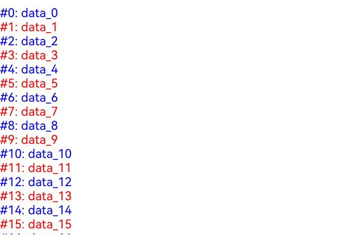

# Repeat (ArkTS-Sta)

> **说明：**
> 
> 本模块首批接口从API version 23开始支持。后续版本的新增接口，采用上角标单独标记接口的起始版本。

Repeat基于数组类型数据来进行循环渲染，一般与容器组件配合使用。

本文档仅为API参数说明。组件描述和使用说明见[ArkTS-Dyn Repeat开发者指南](../../../ui/state-management/arkts-new-rendering-control-repeat.md)。

## 导入模块

```ts
import { Repeat, RepeatItem } from '@ohos.arkui.component';
```

## 接口

Repeat\<T\>(arr: RepeatArray\<T\>)

**系统能力：** SystemCapability.ArkUI.ArkUI.Full

**参数：**

| 参数名 | 类型       | 必填 | 说明      |
| ------ | ---------- | -------- | -------- |
| arr    | [RepeatArray\<T\>](#repeatarrayt) | 是 | 数据源，为`RepeatArray<T>`类型的数组，由开发者决定数据类型。 |

ArkTS-Sta中Repeat()强制要求声明数组类型`<T>`。

**示例：**
```ts
// arr是Array<string>类型的数组，以arr为数据源创建Repeat组件
Repeat<string>(this.arr)
```

## 属性

**系统能力：** SystemCapability.ArkUI.ArkUI.Full

### each

each(itemGenerator: (repeatItem: RepeatItem\<T\>) => void)

组件生成函数。当所有`.template()`的type和`.templateId()`返回值不匹配时，将使用`.each()`处理数据项。

> **说明**
>
> `each`属性必须有，否则运行时会报错。
> `itemGenerator`的参数为`RepeatItem`，该参数将`item`和`index`结合到了一起，请勿将`RepeatItem`参数拆开使用。

**系统能力：** SystemCapability.ArkUI.ArkUI.Full

**参数：**

| 参数名 | 类型   | 必填 | 说明 |
| ------ | ---------- | -------- | -------- |
| repeatItem  | [RepeatItem](#repeatitemt)\<T\> | 是 | repeat数据项。 |

**示例：**
```ts
// arr是Array<string>类型的数组，为每个数据创建一个Text组件
Repeat<string>(this.arr)
  .each((obj: RepeatItem<string>) => { Text(obj.item) })
```

### key

key(keyGenerator: (item: T, index: int) => string)

键值生成函数。

**系统能力：** SystemCapability.ArkUI.ArkUI.Full

**参数：**

| 参数名 | 类型   | 必填 | 说明  |
| ------ | ---------- | -------- | -------- |
| item  | T | 是 | `arr`数组中的数据项。 |
| index  | int | 是 | `arr`数组中的数据项索引。 |

**示例：**
```ts
// arr是Array<string>类型的数组，为每个数据创建一个Text组件
// 并将字符串的值作为其键值
Repeat<string>(this.arr)
  .each((obj: RepeatItem<string>) => { Text(obj.item) })
  .key((obj: string) => obj)
```

### virtualScroll

virtualScroll(virtualScrollOptions?: VirtualScrollOptions)

`Repeat`开启虚拟滚动。

**系统能力：** SystemCapability.ArkUI.ArkUI.Full

**参数：**

| 参数名 | 类型   | 必填 | 说明  |
| ------ | ---------- | -------- | -------- |
| virtualScrollOptions  | [VirtualScrollOptions](#virtualscrolloptions对象说明)  | 否 | 虚拟滚动配置项。 |

**示例：**
```ts
// arr是Array<string>类型的数组，为每个数据创建一个Text组件
// 在List容器组件中使用Repeat，并打开virtualScroll
List() {
  Repeat<string>(this.arr)
    .each((obj: RepeatItem<string>) => { ListItem() { Text(obj.item) }})
    .virtualScroll()
}
```

### template

template(type: string, itemBuilder: RepeatItemBuilder\<T\>, templateOptions?: TemplateOptions)

由template type渲染对应的template子组件。

**系统能力：** SystemCapability.ArkUI.ArkUI.Full

**参数：**

| 参数名 | 类型   | 必填 | 说明  |
| ------ | ---------- | -------- | -------- |
| type | string | 是 | 当前模板类型。 |
| itemBuilder  | [RepeatItemBuilder](#repeatitembuildert)\<T\> | 是 | 组件生成函数。 |
| templateOptions | [TemplateOptions](#templateoptions对象说明) | 否 | 当前模板配置项。 |

**示例：**
```ts
// arr是Array<string>类型的数组
// 在List容器组件中使用Repeat，并打开virtualScroll
// 创建模板temp，该模板为数据创建Text组件
List() {
  Repeat<string>(this.arr)
    .each((obj: RepeatItem<string>) => {})
    .virtualScroll()
    .template('temp', (obj: RepeatItem<string>) => { ListItem() { Text(obj.item) }})
}
```

### templateId

templateId(typedFunc: TemplateTypedFunc\<T\>)

为当前数据项分配template type。

**系统能力：** SystemCapability.ArkUI.ArkUI.Full

**参数：**

| 参数名 | 类型   | 必填 | 说明  |
| ------ | ---------- | -------- | -------- |
| typedFunc | [TemplateTypedFunc](#templatetypedfunct)\<T\> | 是 | 生成当前数据项对应的template type。 |

**示例：**
```ts
// arr是Array<string>类型的数组
// 在List容器组件中使用Repeat，并打开virtualScroll
// 创建模板temp，该模板为数据创建Text组件
// 所有数据项都使用temp模板
List() {
  Repeat<string>(this.arr)
    .each((obj: RepeatItem<string>) => {})
    .virtualScroll()
    .template('temp', (obj: RepeatItem<string>) => { ListItem() { Text(obj.item) }})
    .templateId((item: string, index: int) => { return 'temp' })
}
```

## RepeatArray\<T\>

type RepeatArray\<T\> = Array\<T\> | ReadonlyArray\<T\> | Readonly\<Array\<T\>\>

Repeat数据源参数联合类型。

**系统能力：** SystemCapability.ArkUI.ArkUI.Full

|  类型       | 说明      |
| -------- | -------- |
| Array\<T\> | 常规数组类型。 |
| ReadonlyArray\<T\> | 只读数组类型，不允许数组对象变更。 |
| Readonly\<Array\<T\>> | 只读数组类型，不允许数组对象变更。 |

## RepeatItem\<T\>

**系统能力：** SystemCapability.ArkUI.ArkUI.Full

| 名称 | 类型   | 必填 | 说明                                         |
| ------ | ------ | ---- | -------------------------------------------- |
| item   | T      | 是   | arr中每一个数据项。T为开发者传入的数据类型。 |
| index  | int | 是   | 当前数据项对应的索引。                       |

## VirtualScrollOptions

配置懒加载模式下期望加载的数据项总数、复用能力、数据精准懒加载能力。

### 属性

**系统能力：** SystemCapability.ArkUI.ArkUI.Full

| 名称     | 类型   | 只读 | 可选 | 说明                                                         |
| ---------- | ------ | ---- | ---- | ------------------------------------------------------------ |
| totalCount | int | 否 | 是  | 期望加载的数据项总数，可以不等于数据源长度（实际传入Repeat的数组的长度）。<br>取值范围：自然数。<br>totalCount缺省或超出取值范围时，totalCount取值为数据源长度，列表正常滚动。<br>totalCount = 0时，不加载数据。<br>0 < totalCount <= 数据源长度时，界面中只渲染区间[0, totalCount - 1]范围内的数据。<br>totalCount > 数据源长度时，Repeat将渲染区间[0, totalCount - 1]范围内的数据，容器组件滚动条样式根据totalCount值变化。在容器组件滚动过程中，应用需要保证在列表即将滑动到数据源末尾时请求后续数据。开发者需要对数据请求的错误场景（如网络延迟）进行保护操作，直到数据源全部加载完成，否则列表滑动过程中会出现滚动效果异常。建议配合使用[onLazyLoading](#onlazyloading)实现数据懒加载。<br>除totalCount属性外，开发者也可以通过[onTotalCount](#ontotalcount)方法设置自定义方法，计算期望加载的数据项总数。 |
| reusable | boolean | 否 | 是  | 是否开启复用功能。<br>true：开启复用。<br>false：关闭复用。<br>默认值：true |
| disableVirtualScroll | boolean | 否 | 是 | 是否关闭懒加载模式。<br>true：关闭懒加载模式，列表节点全部加载。<br>false：使用懒加载模式。<br>默认值：false<br>该接口仅适用于ArkTS-Sta。 |

**示例**

```ts
// arr是Array<string>类型的数组，在List容器组件中使用Repeat，并打开virtualScroll
// 将加载的数据项总数设为数据源的长度，并开启复用功能
List() {
  Repeat<string>(this.arr)
    .each((obj: RepeatItem<string>) => { ListItem() { Text(obj.item) }})
    .virtualScroll( { totalCount: this.arr.length, reusable: true } )
}
```

### onTotalCount

onTotalCount?(): int

可选方法，计算期望加载的数据项总数。需要开发者给定计算方法，其返回值可以不等于数据源长度（实际传入Repeat的数组的长度）。

[totalCount](#virtualscrolloptions)和onTotalCount()的返回值都表示期望加载的数据项总数。开发者可直接设置totolCount属性，给出期望加载的数据项总数，也可以通过onTotalCount()设定自定义方法，计算期望加载的数据项总数。totalCount与onTotalCount()最多设置一个。如果均未设置，则采用默认值：数据源长度；如果同时设置，则忽略totalCount。

onTotalCount()不同返回值的数据加载处理规则与totalCount一致，具体如下：

- onTotalCount()返回值 = 0时，不加载数据。
- 0 < onTotalCount()返回值 <= 数据源长度时，只加载区间[0, onTotalCount()返回值 - 1]索引范围内的数据。
- onTotalCount()返回值 > 数据源长度时，代表Repeat期望加载区间[0, onTotalCount()返回值 - 1]索引范围内的数据，容器组件滚动条样式根据totalCount值变化。在容器组件滚动过程中，应用需要保证在列表即将滑动到数据源末尾时请求后续数据。开发者需要对数据请求的错误场景（如网络延迟）进行保护操作，直到数据源全部加载完成，否则列表滑动过程中会出现滚动效果异常。建议配合使用[onLazyLoading](#onlazyloading)实现数据懒加载。
- onTotalCount()返回值是非自然数时，由数据源长度取代其返回值。

**系统能力：** SystemCapability.ArkUI.ArkUI.Full

**返回值：**

|    类型   | 说明 |
| ------ | ---------- |
|  int |  期望加载的数据项总数。<br>取值范围：自然数。 |

### onLazyLoading

onLazyLoading?(index: int): void

可选方法，懒加载指定索引的数据。需要开发者给定数据加载方法。

onLazyLoading方法需在懒加载场景下使用。开发者可设置自定义方法，用于向指定的数据源index中写入数据。以下为onLazyLoading的处理规则：

- Repeat读取数据源中index对应的数据之前，会先检查index处是否存在数据。
- 如果不存在数据，但开发者提供了onLazyLoading方法，Repeat将调用此方法。
- 由于ArkTS-Sta的数组不支持稀疏特性，即超出数组长度的set赋值方式会报越界错误。详细写法见下面示例代码。
- onLazyLoading方法执行完成后，若指定index中仍无数据，将导致当前index和后续索引对应的组件无法加载。
- 精准懒加载能力为可选配置项。当onLazyLoading缺省，并且totalCount或onTotalCount的返回值大于数据源长度时，Repeat不负责列表滚动到底部的渲染效果。
- onLazyLoading方法中应避免高耗时操作。若数据加载耗时较长，建议先在onLazyLoading方法中为此数据创建占位符，再创建异步任务加载数据。

**系统能力：** SystemCapability.ArkUI.ArkUI.Full

**参数：**

| 参数名 | 类型   | 必填 | 说明 |
| ------ | ---------- | -------- | -------- |
| index  | int | 是 | 需要加载的数据项对应的索引。<br>取值范围：自然数。 |

**示例**

```ts
// 假设数据项总数为100，首屏渲染需3项数据
// 初始数组提供前3项数据（arr = ['No.0', 'No.1', 'No.2']），并开启数据懒加载功能
List() {
  Repeat<string>(this.arr)
    .each((obj: RepeatItem<string>) => { ListItem() { Text(obj.item) }})
    .virtualScroll({ 
      onTotalCount: () => { return 100; },
      // ArkTS-Sta的数组不支持稀疏特性，应采用push()添加数据
      onLazyLoading: (index: int) => {
        if (index >= this.arr.length) {
          this.arr.push(`No.${index}`);
        }
      }
    })
}
```

### 默认懒加载说明

当Repeat属性`.virtualScroll()`缺省时：<br>
1）ArkTS-Dyn中，默认渲染方式为全量加载，若要开启懒加载，需要设置`.virtualScroll()`属性。<br>
2）ArkTS-Sta中，默认渲染方式为懒加载。若要关闭懒加载，需要设置`.virtualScroll({ disableVirtualScroll: true })`。

> **说明：**
>
> 关闭懒加载后，Repeat仅有`.each()`和`.key()`属性生效，其他懒加载特有的功能（如template、totalCount、onLazyLoading等）不生效。

## RepeatItemBuilder\<T\>

type RepeatItemBuilder\<T\> = (repeatItem: RepeatItem\<T\>) => void

**系统能力：** SystemCapability.ArkUI.ArkUI.Full

**参数：**

| 参数名     | 类型          | 必填      | 说明                                    |
| ---------- | ------------- | --------------------------------------- | --------------------------------------- |
| repeatItem | [RepeatItem](#repeatitemt)\<T\> | 是 | 将item和index结合到一起的一个状态变量。 |

## TemplateOptions

**系统能力：** SystemCapability.ArkUI.ArkUI.Full

| 名称      | 类型   | 必填 | 说明                                                         |
| ----------- | ------ | ---- | ------------------------------------------------------------ |
| cachedCount | int | 否   | 当前template的缓存池中可缓存子组件节点的最大数量。取值范围是[0, +∞)。默认值为屏上节点与预加载节点的个数之和。当屏上节点与预加载节点的个数之和增多时，cachedCount也会对应增长。需要注意cachedCount数量不会减少。|

当cachedCount值被设置为当前template在屏上显示的最大节点数量时，Repeat会做到最大程度的复用。然而当屏上没有当前template的节点时，缓存池不会释放的同时应用内存增大。需要开发者根据具体情况自行把控。

- 当cachedCount缺省时，框架会分别对不同template，根据屏上节点+预加载节点的个数之和来计算cachedCount。当屏上节点+预加载节点的个数之和增多时，cachedCount也会对应增长。需要注意cachedCount数量不会减少。
- 显式指定cachedCount，推荐设置成和屏幕上节点个数一致。需要注意，设置cachedCount小于2会导致在快速滑动场景下创建新的节点，可能造成性能劣化。

> **注意：**
> 
> 滚动容器组件属性`.cachedCount()`和Repeat组件属性`.template()`的参数`cachedCount`都是为了平衡性能和内存，但是含义是不同的。
> - 滚动容器组件`.cachedCount()`：是指在可见范围外预加载的节点，这些节点会位于组件树上，但不是可见范围内。List/Grid等容器组件会额外渲染这些可见范围外的节点，从而达到其性能收益。Repeat会将这些节点视为“可见”的。
> - `.template()`中的`cachedCount`: 是指Repeat视其为“不可见”的节点，这些空闲的节点框架会暂时保存，在需要使用时进行更新，从而实现复用。

**示例：**
```ts
// arr是Array<string>类型的数组，在List容器组件中使用Repeat，并打开virtualScroll
// 创建模板temp，该模板为数据创建Text组件，所有数据项都使用temp模板
// 将temp模板的最大缓存节点数量设为2
List() {
  Repeat<string>(this.arr)
    .each((obj: RepeatItem<string>) => {})
    .virtualScroll()
    .template('temp', (obj: RepeatItem<string>) => { ListItem() { Text(obj.item) }}, { cachedCount: 2 })
    .templateId((item: string, index: int) => { return 'temp' })
}
```

## TemplateTypedFunc\<T\>

type TemplateTypedFunc\<T\> = (item: T, index: int) => string

**系统能力：** SystemCapability.ArkUI.ArkUI.Full

**参数：**

| 参数名 | 类型   | 必填 | 说明                                         |
| ------ | ------ | ---- | -------------------------------------------- |
| item   | T      | 是   | arr中每一个数据项。T为开发者传入的数据类型。 |
| index  | int | 是   | 当前数据项对应的索引。                       |

## ArkTS-Sta的写法示例

**1. 全量加载模式**

```ts
'use static'

import { Entry, Component, Column, Text, Repeat, RepeatItem } from '@ohos.arkui.component';
import { State } from '@ohos.arkui.stateManagement';

@Entry
@Component
struct Repeat_1_2 {
  @State simpleList: Array<string> = ['one', 'two', 'three'];

  build() {
    Column() {
      Repeat<string>(this.simpleList) // 必须声明数据类型<T>
        .each((ri: RepeatItem<string>) => { // RepeatItem可以省略
          Text(`#${ri.index}: ${ri.item}`)
        })
        .key((item: string) => item)
        .virtualScroll({
          disableVirtualScroll: true // 关闭懒加载
        })
    }
  }
}
```

运行效果：


**2. 懒加载模式**

```ts
'use static'

import { Entry, Component, Column, Text, Color, Repeat, RepeatItem, List, ListItem } from '@ohos.arkui.component';
import { State } from '@ohos.arkui.stateManagement';

@Entry
@Component
struct Repeat_Virtual_1_2 {
  @State simpleList: Array<string> = new Array<string>();

  aboutToAppear(): void {
    for (let i = 0; i < 50; i++) {
      this.simpleList.push(`data_${i}`); // 向数组中添加一些数据
    }
  }

  build() {
    Column() {
      List() {
        Repeat<string>(this.simpleList) // 必须声明数据类型<T>
          .each((ri: RepeatItem<string>) => { // RepeatItem可以省略
            ListItem() {
              Text(`#${ri.index}: ${ri.item}`).fontColor(Color.Red)
            }
          })
          .key((item: string) => item)
          .virtualScroll() // 可以省略
          .template('ttype_a', (ri: RepeatItem<string>) => { // RepeatItem可以省略
            ListItem() {
              Text(`#${ri.index}: ${ri.item}`).fontColor(Color.Blue)
            }
          }, { cachedCount: 1 })
          .templateId((item: string, index: int) => index % 2 === 0 ? 'ttype_a' : '')
      }.height('40%')
    }
  }
}
```

运行效果：


