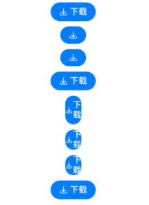
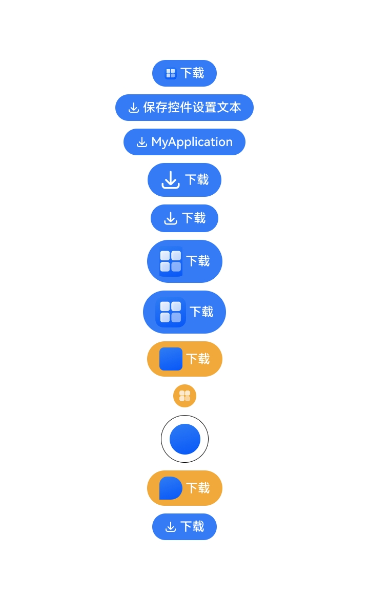
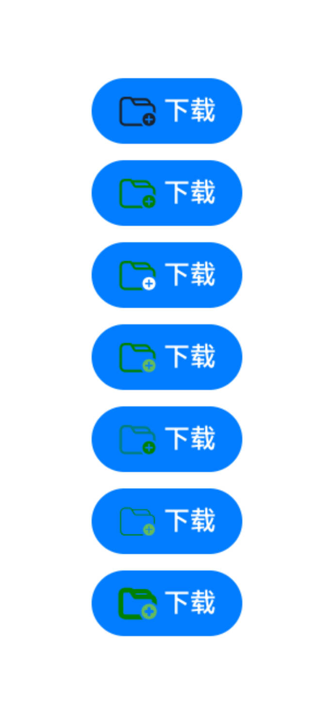

# SaveButton

<!--Kit: ArkUI-->
<!--Subsystem: Security-->
<!--Owner: @harylee-->
<!--Designer: @linshuqing; @hehehe-li-->
<!--Tester: @leiyuqian-->
<!--Adviser: @zengyawen-->

安全控件的保存控件系统接口，适用于应用需要临时获取媒体库访问权限以保存图片或视频的场景，例如图片保存到相册、媒体内容导出等。

应用集成保存控件后，用户首次使用该控件时，保存控件会展示弹窗供用户确认。用户点击允许后，应用获取访问媒体库接口的临时授权，相关接口请参见[Interface (PhotoAccessHelper)](../../apis-media-library-kit/arkts-apis-photoAccessHelper-PhotoAccessHelper.md)；用户拒绝或关闭弹窗时，本次不授权，应用不会获得媒体库接口访问权限。后续使用无需弹窗授权。

在API version 19及之前的版本中，授权持续时间为10秒；在API version 20及之后的版本中，授权持续时间为1分钟。

开发者应在授权有效期内调用媒体库接口获取文件句柄，并完成创建媒体资源等需要临时授权的操作。授权到期后，已通过授权获取的文件句柄仍可继续进行读写操作，不受授权时间限制。

> **说明：**
>
> 该组件从API version 10开始支持。后续版本如有新增内容，则采用上角标单独标记该内容的起始版本。

## 关键Class/Interface介绍

### 核心枚举类型

- **[SaveIconStyle](#saveiconstyle)：** 保存控件图标风格枚举，用于指定控件展示的图标风格。
- **[SaveDescription](#savedescription)：** 保存控件文本描述枚举，用于指定控件展示的文本描述。
- **[SaveButtonOnClickResult](#savebuttononclickresult)：** 保存控件点击结果枚举，用于表示点击后授权是否成功。

### 核心接口类型

- **[SaveButtonOptions](#savebuttonoptions)：** 保存控件配置对象，用于指定图标、文字和按钮类型等元素属性。
- **[SaveButtonCallback](#savebuttoncallback18)：** 保存控件点击回调类型，用于返回点击事件、授权结果和错误信息。

## 子组件

不支持。

## 接口

### SaveButton

SaveButton()

默认创建带有图标、文本、背景的保存控件。用户首次使用保存控件时会展示弹窗，在点击允许后自动授权，应用会获取访问媒体库接口的临时授权。后续使用无需弹窗授权。

在API version 19及之前的版本中，授权持续时间为10秒。授权到期后，已通过授权获取的文件句柄仍可继续进行读写操作，不受授权时间限制。

在API version 20及之后的版本中，授权持续时间为1分钟。授权到期后，已通过授权获取的文件句柄仍可继续进行读写操作，不受授权时间限制。

为避免控件样式不合法导致授权失败，请开发者先了解安全控件样式的[约束与限制](../../../security/AccessToken/security-component-overview.md#约束与限制)。

**模型约束：** 此接口仅可在Stage模型下使用。

**原子化服务API：** 从API version 11开始，该接口支持在原子化服务中使用。

**系统能力：** SystemCapability.ArkUI.ArkUI.Full

### SaveButton

SaveButton(options: SaveButtonOptions)

创建包含指定图标、文本或按钮类型的保存控件。用户首次使用保存控件时会展示弹窗，在点击允许后自动授权，应用会获取访问媒体库接口的临时授权。后续使用无需弹窗授权。

在API version 19及之前的版本中，授权持续时间为10秒。授权到期后，已通过授权获取的文件句柄仍可继续进行读写操作，不受授权时间限制。

在API version 20及之后的版本中，授权持续时间为1分钟。授权到期后，已通过授权获取的文件句柄仍可继续进行读写操作，不受授权时间限制。

为避免控件样式不合法导致授权失败，请开发者先了解安全控件样式的[约束与限制](../../../security/AccessToken/security-component-overview.md#约束与限制)。

**模型约束：** 此接口仅可在Stage模型下使用。

**原子化服务API：** 从API version 11开始，该接口支持在原子化服务中使用。

**系统能力：** SystemCapability.ArkUI.ArkUI.Full

**参数：**

| 参数名 | 类型 | 必填 | 说明 |
| -------- | -------- | -------- | -------- |
| options | [SaveButtonOptions](#savebuttonoptions) | 是 | 保存控件的配置选项，用于指定图标、文本和按钮类型等元素属性。<br/>建议至少显式设置 icon 或 text 中的一项，以确保用户能明确理解控件用途；若两者都不传，控件显示为默认样式。 |

## SaveButtonOptions

用于设置保存控件的图标、文本、按钮类型等属性。

> **说明：**
>
> - 建议icon或text至少传入一个。<br/>
> - 如果icon、text都不传入，SaveButton将使用默认样式创建，默认样式：
>
>     - SaveIconStyle默认样式为FULL_FILLED。
>
>     - SaveDescription默认样式为DOWNLOAD。
>
>     - ButtonType默认样式为Capsule。
> - icon、text和buttonType不支持动态修改。

**模型约束：** 此接口仅可在Stage模型下使用。

**原子化服务API：** 从API version 11开始，该接口支持在原子化服务中使用。

**系统能力：** SystemCapability.ArkUI.ArkUI.Full

| 名称 | 类型 | 只读 | 可选 | 说明 |
| -------- | -------- | -------- | -------- | -------- |
| icon | [SaveIconStyle](#saveiconstyle) | 否 | 是 | 设置保存控件的图标风格。<br/>不传入该参数表示不显示图标；若同时也不传text，整体配置将显示为默认样式。 |
| text | [SaveDescription](#savedescription) | 否 | 是 | 设置保存控件的文本描述。<br/>不传入该参数表示不显示文本描述；若同时也不传icon，整体配置将显示为默认样式。 |
| buttonType | [ButtonType](ts-securitycomponent-attributes.md#buttontype) | 否 | 是 | 设置保存控件的背景样式。<br/>默认值：ButtonType.Capsule。 |

## SaveIconStyle

保存控件的图标风格。

**模型约束：** 此接口仅可在Stage模型下使用。

**原子化服务API：** 从API version 11开始，该接口支持在原子化服务中使用。

**系统能力：** SystemCapability.ArkUI.ArkUI.Full

| 名称 | 值 | 说明 |
| -------- | -------- | -------- |
| FULL_FILLED | 0 | 保存控件展示填充样式图标。 |
| LINES | 1 | 保存控件展示线条样式图标。 |

## SaveDescription

保存控件的文本描述。

**模型约束：** 此接口仅可在Stage模型下使用。

**系统能力：** SystemCapability.ArkUI.ArkUI.Full

| 名称 | 值 | 说明 |
| -------- | -------- | -------- |
| DOWNLOAD | 0 | 保存控件的文字描述为“下载”。 <br/>**原子化服务API：** 从API version 11开始，该接口支持在原子化服务中使用。|
| DOWNLOAD_FILE | 1 | 保存控件的文字描述为“下载文件”。 <br/>**原子化服务API：** 从API version 11开始，该接口支持在原子化服务中使用。|
| SAVE | 2 | 保存控件的文字描述为“保存”。 <br/>**原子化服务API：** 从API version 11开始，该接口支持在原子化服务中使用。|
| SAVE_IMAGE | 3 | 保存控件的文字描述为“保存图片”。 <br/>**原子化服务API：** 从API version 11开始，该接口支持在原子化服务中使用。|
| SAVE_FILE | 4 | 保存控件的文字描述为“保存文件”。 <br/>**原子化服务API：** 从API version 11开始，该接口支持在原子化服务中使用。|
| DOWNLOAD_AND_SHARE | 5 | 保存控件的文字描述为“下载分享”。 <br/>**原子化服务API：** 从API version 11开始，该接口支持在原子化服务中使用。|
| RECEIVE | 6 | 保存控件的文字描述为“接收”。 <br/>**原子化服务API：** 从API version 11开始，该接口支持在原子化服务中使用。|
| CONTINUE_TO_RECEIVE | 7 | 保存控件的文字描述为“继续接收”。 <br/>**原子化服务API：** 从API version 11开始，该接口支持在原子化服务中使用。|
| SAVE_TO_GALLERY<sup>12+</sup> | 8 | 保存控件的文字描述为“保存至图库”。 <br/>**原子化服务API：** 从API version 12开始，该接口支持在原子化服务中使用。|
| EXPORT_TO_GALLERY<sup>12+</sup> | 9 | 保存控件的文字描述为“导出”。 <br/>**原子化服务API：** 从API version 12开始，该接口支持在原子化服务中使用。|
| QUICK_SAVE_TO_GALLERY<sup>12+</sup> | 10 | 保存控件的文字描述为“快速保存图片”。 <br/>**原子化服务API：** 从API version 12开始，该接口支持在原子化服务中使用。|
| RESAVE_TO_GALLERY<sup>12+</sup> | 11 | 保存控件的文字描述为“重新保存”。 <br/>**原子化服务API：** 从API version 12开始，该接口支持在原子化服务中使用。|
| SAVE_ALL<sup>18+</sup> | 12 | 保存控件的文字描述为“全部保存”。 <br/>**原子化服务API：** 从API version 18开始，该接口支持在原子化服务中使用。 |

## SaveButtonOnClickResult

保存控件点击后的授权结果。

**模型约束：** 此接口仅可在Stage模型下使用。

**系统能力：** SystemCapability.ArkUI.ArkUI.Full

| 名称 | 值 | 说明 |
| -------- | -------- | -------- |
| SUCCESS | 0 | 保存控件点击后权限授权成功。 <br/>**原子化服务API：** 从API version 11开始，该接口支持在原子化服务中使用。 |
| TEMPORARY_AUTHORIZATION_FAILED | 1 | 保存控件点击后权限授权失败。 <br/>**原子化服务API：** 从API version 11开始，该接口支持在原子化服务中使用。 |
| CANCELED_BY_USER<sup>21+</sup>  | 2 | 保存控件点击后，弹窗中用户取消授权。仅在调用[userCancelEvent](#usercancelevent21)并设置参数为true时，回调结果中才会返回该值。 <br/>**原子化服务API：** 从API version 21开始，该接口支持在原子化服务中使用。 |

## SaveButtonCallback<sup>18+</sup>

type SaveButtonCallback = (event: ClickEvent, result: SaveButtonOnClickResult, error?: BusinessError&lt;void&gt;) =&gt; void

点击保存控件触发该回调。

**模型约束：** 此接口仅可在Stage模型下使用。

**原子化服务API：** 从API version 18开始，该接口支持在原子化服务中使用。

**系统能力：** SystemCapability.ArkUI.ArkUI.Full

**参数：**

| 参数名 | 类型                   | 必填 | 说明                   |
|------------|------|-------|---------|
| event | [ClickEvent](ts-universal-events-click.md#clickevent) | 是 | 点击事件对象，包含点击的位置、时间戳、输入设备等信息。 |
| result | [SaveButtonOnClickResult](#savebuttononclickresult)| 是 | 授权结果。返回SUCCESS表示当前保存动作已获得临时授权，可继续访问媒体库接口；返回TEMPORARY_AUTHORIZATION_FAILED时，不应继续执行后续保存动作。返回CANCELED_BY_USER时，表示用户在授权弹窗中主动取消授权，该结果仅在调用[userCancelEvent](#usercancelevent21)并设置参数为true时才会返回；若未设置userCancelEvent(true)，用户取消授权时将返回TEMPORARY_AUTHORIZATION_FAILED。|
| error | [BusinessError&lt;void&gt;](../../apis-basic-services-kit/js-apis-base.md#businesserror) | 否 | 点击按钮时的错误码和错误信息。不传入该参数时为undefined。授权结果需通过result参数判断。<br/>错误码1表示系统内部错误，可能原因和处理建议如下：<br/>1. IPC（Inter-Process Communication，进程间通信）通信失败。请检查系统状态后重试。<br/>2. 安全控件弹窗失败。请检查保存控件是否被遮挡或是否满足安全控件样式约束，修正后重试。<br/>错误码2表示属性设置错误，具体包括以下情况：<br/>1. 字体或图标设置过小。<br/>2. 字体或图标与背景颜色相近。<br/>3. 字体或图标颜色过于透明。<br/>4. padding为负值。<br/>5. 按钮被其他组件或窗口遮挡。<br/>6. 文本超出控件背景范围。<br/>7. 按钮超出窗口或屏幕。<br/>8. 按钮整体尺寸过大。<br/>9. 按钮文本被截断，显示不全。<br/>10. 其他属性设置不当影响安全控件显示。 |


## 属性

不支持通用属性，除了继承[安全控件通用属性](ts-securitycomponent-attributes.md)，还支持以下属性。

### setIcon<sup>20+</sup>

setIcon(icon: Resource)

设置保存控件的图标。

**模型约束：** 此接口仅可在Stage模型下使用。

**需要权限：** ohos.permission.CUSTOMIZE_SAVE_BUTTON

**原子化服务API：** 从API version 20开始，该接口支持在原子化服务中使用。

**系统能力：** SystemCapability.ArkUI.ArkUI.Full

**参数：**

| 参数名 | 类型                   | 必填 | 说明                   |
|------------|------|-------|---------|
| icon | [Resource](ts-types.md#resource) | 是 | 自定义图标资源信息，仅支持Resource类型的数据源。<br/>可支持的图片格式：png、jpg、jpeg、bmp、svg、webp、gif和heif等，支持的图片格式范围见[Image](ts-basic-components-image.md)。当资源为非图片资源或不支持的格式时，图标显示为空白。<br/>从API版本26.0.0开始，支持Symbol格式的Resource类型的数据源。<br/>若应用不具备ohos.permission.CUSTOMIZE_SAVE_BUTTON权限，则自定义图标设置不生效，保存控件保持默认样式。 |

### setText<sup>20+</sup>

setText(text: string | Resource)

设置保存控件的文本。

**模型约束：** 此接口仅可在Stage模型下使用。

**需要权限：** ohos.permission.CUSTOMIZE_SAVE_BUTTON

**原子化服务API：** 从API version 20开始，该接口支持在原子化服务中使用。

**系统能力：** SystemCapability.ArkUI.ArkUI.Full

**参数：**

| 参数名 | 类型                   | 必填 | 说明                   |
|------------|------|-------|---------|
| text | string \| [Resource](ts-types.md#resource) | 是 | 自定义文本信息。适用于需要使用与业务强相关的文本替代系统预置描述的场景。传入字符串时直接使用文本内容；传入Resource时，可配合资源管理实现多语言文本。<br/>若应用不具备ohos.permission.CUSTOMIZE_SAVE_BUTTON权限，则该设置不生效，保存控件保持默认样式。 |

### iconSize<sup>20+</sup>

iconSize(size: Dimension | SizeOptions)

设置保存控件的图标尺寸。

**模型约束：** 此接口仅可在Stage模型下使用。

**原子化服务API：** 从API version 20开始，该接口支持在原子化服务中使用。

**系统能力：** SystemCapability.ArkUI.ArkUI.Full

**参数：**

| 参数名 | 类型                   | 必填 | 说明                   |
|------------|------|-------|---------|
| size | [Dimension](ts-types.md#dimension10) \| [SizeOptions](ts-types.md#sizeoptions) | 是 | 图标尺寸，支持像素单位（vp、px等）。默认值：宽高均为16vp。<br/>不支持设置百分比字符串。若设置Dimension类型入参的百分比字符串，则图标尺寸显示为默认值；若设置SizeOptions类型入参的width或height属性为百分比字符串，则图标尺寸显示为0vp。<br/>对于保存控件提供的系统图标：<br/>- 使用Dimension类型入参时，宽、高相等，均为设定值。<br/>- 使用SizeOptions类型入参时，若宽、高设定值不一致，则宽、高相等取两者较小值；若仅设定其中一个值，则取该值作为宽、高值。系统提供图标采用此规则是为保证图标的正方形显示和视觉一致性。<br/>对于自定义图标：<br/>- 使用Dimension类型入参时，宽、高相等，均为设定值。<br/>- 使用SizeOptions类型入参时，建议同时设定宽和高，此时按照指定宽、高生效；若仅设定其中一个值，则宽高均显示为该设定值。自定义图标允许灵活设定尺寸以适应不同图片比例。<br/>- 当设定的宽高与自定义图标的宽高比例不一致时，图片按[ImageFit.Cover](ts-appendix-enums.md#imagefit)的方式填充显示区域。 |

### iconBorderRadius<sup>20+</sup>

iconBorderRadius(radius: Dimension | BorderRadiuses)

设置保存控件图标的边框圆角半径。

**模型约束：** 此接口仅可在Stage模型下使用。

**需要权限：** ohos.permission.CUSTOMIZE_SAVE_BUTTON

**原子化服务API：** 从API version 20开始，该接口支持在原子化服务中使用。

**系统能力：** SystemCapability.ArkUI.ArkUI.Full

**参数：**

| 参数名 | 类型                   | 必填 | 说明                   |
|------------|------|-------|---------|
| radius | [Dimension](ts-types.md#dimension10) \| [BorderRadiuses](ts-types.md#borderradiuses9) | 是 | 保存控件图标的圆角半径，支持设置四个圆角。<br/>默认值：四个圆角均为0vp。支持像素单位（vp、px等），取值范围≥0。传入负值时自动修正为0。<br/>若应用不具备ohos.permission.CUSTOMIZE_SAVE_BUTTON权限，则图标的圆角半径设置不生效。 |

### stateEffect<sup>20+</sup>

stateEffect(enabled: boolean)

设置保存控件的按压效果。

**模型约束：** 此接口仅可在Stage模型下使用。

**需要权限：** ohos.permission.CUSTOMIZE_SAVE_BUTTON

**原子化服务API：** 从API version 20开始，该接口支持在原子化服务中使用。

**系统能力：** SystemCapability.ArkUI.ArkUI.Full

**参数：**

| 参数名 | 类型                   | 必填 | 说明                   |
|------------|------|-------|---------|
| enabled | boolean | 是 | 表示是否开启按压效果，true表示保存控件按压时显示按压效果，false表示保存控件按压时不显示按压效果。<br/>默认值：true。<br/>若应用不具备ohos.permission.CUSTOMIZE_SAVE_BUTTON权限，按压效果设置不生效。 |

### userCancelEvent<sup>21+</sup>

userCancelEvent(enabled: boolean)

设置接收保存控件的用户取消授权事件。适用于需要区分用户主动取消授权和授权失败的场景，以便进行不同的业务处理，例如记录用户行为、提供重试提示等。

**模型约束：** 此接口仅可在Stage模型下使用。

**原子化服务API：** 从API version 21开始，该接口支持在原子化服务中使用。

**系统能力：** SystemCapability.ArkUI.ArkUI.Full

**参数：**

| 参数名 | 类型                   | 必填 | 说明                   |
|------------|------|-------|---------|
| enabled | boolean | 是 | 表示是否接收保存控件的用户取消授权事件。true表示当用户在授权弹窗中主动取消时，会通过回调将结果区分为CANCELED_BY_USER；false表示不单独区分此类场景。<br/>默认值：false。<br/>当业务需要区分“用户取消”和“系统错误/授权失败”时，建议开启该参数。 |

### symbolIconColor

symbolIconColor(color: Array&lt;ResourceColor&gt;)

设置保存控件Symbol图标颜色。
- 调用本方法前，需先调用[setIcon](#seticon20)设置Symbol格式的图标资源（如$r('sys.symbol.xxx')），本方法才会生效。
- 若未设置Symbol图标，该方法设置的颜色不会生效。
- 建议与[symbolRenderingStrategy](#symbolrenderingstrategy)配合使用，以实现不同的渲染效果。

**起始版本：** 26.0.0

**模型约束：** 此接口仅可在Stage模型下使用。

**需要权限：** ohos.permission.CUSTOMIZE_SAVE_BUTTON

**原子化服务API：** 从API版本26.0.0开始，该接口支持在原子化服务中使用。

**系统能力：** SystemCapability.ArkUI.ArkUI.Full

**参数：**

| 参数名 | 类型 | 必填 | 说明  |
| ------ | ---- | ---- | ----- |
| color  | Array\<[ResourceColor](ts-types.md#resourcecolor)\> | 是   | 设置保存控件Symbol图标颜色。适用于Symbol图标需要与业务视觉风格保持一致的场景。<br/>默认值：随[symbolrenderingstrategy](#symbolrenderingstrategy)不同而变化。<br/>若应用不具备ohos.permission.CUSTOMIZE_SAVE_BUTTON权限，则该设置不生效。 |

### symbolFontWeight

symbolFontWeight(fontWeight: number | FontWeight | string | Resource)

设置保存控件Symbol图标粗细。
- 调用本方法前，需先调用[setIcon](#seticon20)设置Symbol格式的图标资源（如$r('sys.symbol.xxx')），本方法才会生效。
- 若未设置Symbol图标，该方法设置的粗细不会生效。

**起始版本：** 26.0.0

**模型约束：** 此接口仅可在Stage模型下使用。

**需要权限：** ohos.permission.CUSTOMIZE_SAVE_BUTTON

**原子化服务API：** 从API版本26.0.0开始，该接口支持在原子化服务中使用。

**系统能力：** SystemCapability.ArkUI.ArkUI.Full

**参数：**

| 参数名 | 类型                                                         | 必填 | 说明                                                |
| ------ | ------------------------------------------------------------ | ---- | --------------------------------------------------- |
| fontWeight  | number \| [FontWeight](ts-appendix-enums.md#fontweight) \| string \| [Resource](ts-types.md#resource) | 是   | 设置保存控件Symbol图标粗细。<br/>支持number类型：取值范围为[100, 900]，取值间隔为100，数值越大字体越粗。<br/>支持string类型：可传入number类型的数字字符串（如"400"），或[FontWeight](ts-appendix-enums.md#fontweight)的枚举值的小写字符串（如"normal"）。<br/>默认值：FontWeight.Normal（对应数值400）。<br/>若应用不具备ohos.permission.CUSTOMIZE_SAVE_BUTTON权限，则该设置不生效。 |

### symbolRenderingStrategy

symbolRenderingStrategy(strategy: SymbolRenderingStrategy)

设置保存控件Symbol图标渲染策略。
- 调用本方法前，需先调用[setIcon](#seticon20)设置Symbol格式的图标资源（如$r('sys.symbol.xxx')），本方法才会生效。
- 若未设置Symbol图标，该方法设置的渲染策略不会生效。
- 与[symbolIconColor](#symboliconcolor)配合使用时，渲染策略会影响颜色数组的作用方式。

**起始版本：** 26.0.0

**模型约束：** 此接口仅可在Stage模型下使用。

**需要权限：** ohos.permission.CUSTOMIZE_SAVE_BUTTON

**原子化服务API：** 从API版本26.0.0开始，该接口支持在原子化服务中使用。

**系统能力：** SystemCapability.ArkUI.ArkUI.Full

**参数：**

| 参数名 | 类型 | 必填 | 说明  |
| ------ | ---- | ---- | ----- |
| strategy  | [SymbolRenderingStrategy](ts-basic-components-symbolGlyph.md#symbolrenderingstrategy11枚举说明) | 是   | 保存控件Symbol图标渲染策略，用于控制Symbol图标的渲染方式。<br/>默认值：SymbolRenderingStrategy.SINGLE。<br/>若应用不具备ohos.permission.CUSTOMIZE_SAVE_BUTTON权限，则该设置不生效。 |

不同渲染策略效果可参考以下示意图。


## 事件

不支持通用事件，仅支持以下事件：

### onClick

onClick(event: SaveButtonCallback)

点击保存控件触发该回调。用户首次点击保存控件时会展示授权弹窗，点击允许后授权成功，应用会获取访问媒体库接口的临时授权（授权持续时间见[SaveButton](#savebutton-1)构造函数说明）；点击拒绝或关闭弹窗则授权失败。

**模型约束：** 此接口仅可在Stage模型下使用。

**原子化服务API：** 从API version 11开始，该接口支持在原子化服务中使用。

**系统能力：** SystemCapability.ArkUI.ArkUI.Full

**参数：**

| 参数名 | 类型                   | 必填 | 说明                   |
|------------|------|-------|---------|
| event | [SaveButtonCallback](#savebuttoncallback18) | 是 | 点击事件的回调对象，包含点击事件信息、授权结果和错误信息。在API version 10-17时，参数类型为(event: [ClickEvent](ts-universal-events-click.md#clickevent), result: [SaveButtonOnClickResult](#savebuttononclickresult)) => void；从API version 18开始，统一使用SaveButtonCallback，可额外获取error信息。 |

## 示例1

```ts
// xxx.ets
import { photoAccessHelper } from '@kit.MediaLibraryKit';
import { fileIo } from '@kit.CoreFileKit';
import { BusinessError } from '@kit.BasicServicesKit';

@Entry
@Component
struct Index {
  handleSaveButtonClick: SaveButtonCallback =
    async (event: ClickEvent, result: SaveButtonOnClickResult, error?: BusinessError) => {
      if (result === SaveButtonOnClickResult.SUCCESS) {
        try {
          // 获取应用上下文。
          const context = this.getUIContext().getHostContext();
          // 创建图片访问助手实例。
          let helper = photoAccessHelper.getPhotoAccessHelper(context);
          // 创建图片资源并获取URI。
          let uri = await helper.createAsset(photoAccessHelper.PhotoType.IMAGE, 'png');
          // 使用uri打开文件，可以持续写入内容，写入过程不受时间限制。
          let file = await fileIo.open(uri, fileIo.OpenMode.READ_WRITE | fileIo.OpenMode.CREATE);
          // 写入文件
          await fileIo.write(file.fd, "context");
          // 关闭文件
          await fileIo.close(file.fd);
        } catch (err) {
          console.error(`errCode: ${err.code}, errMessage: ${err.message}`);
        }
      } else if (result === SaveButtonOnClickResult.CANCELED_BY_USER) {
        console.info("errCode: " + error?.code);
        console.info("errMessage: " + error?.message);
      } else {
        console.error(`errCode: ${error.code}, errMessage: ${error.message}`);
      }
    };

  build() {
    Row() {
      Column({ space: 10 }) {
        // 默认参数下，图标、文字、背景都存在。
        SaveButton().onClick((this.handleSaveButtonClick))
        // 传入参数即表示元素存在，不传入的参数表示元素不存在，如果不传入buttonType，会默认添加ButtonType.Capsule配置，显示图标+背景。
        SaveButton({ icon: SaveIconStyle.FULL_FILLED })
        // 只显示图标+背景，如果设置背景色高八位的α值低于0x1a，则会被系统强制调整为0xff。
        SaveButton({ icon: SaveIconStyle.FULL_FILLED, buttonType: ButtonType.Capsule })
          .backgroundColor(0x10007dff)
        // 图标、文字、背景都存在，如果设置背景色高八位的α值低于0x1a，则会被系统强制调整为0xff。
        SaveButton({ icon: SaveIconStyle.FULL_FILLED, text: SaveDescription.DOWNLOAD, buttonType: ButtonType.Capsule })
        // 图标、文字、背景都存在，如果设置宽度小于当前属性组合下允许的最小宽度时，宽度仍为设置值，此时按钮文本信息会自动换行，以保证安全控件显示的完整性。
        SaveButton({ icon: SaveIconStyle.FULL_FILLED, text: SaveDescription.DOWNLOAD, buttonType: ButtonType.Capsule })
          .fontSize(16)
          .width(30)
        // 图标、文字、背景都存在，如果设置宽度小于当前属性组合下允许的最小宽度时，宽度仍为设置值，此时按钮文本信息会自动换行，以保证安全控件显示的完整性。
        SaveButton({ icon: SaveIconStyle.FULL_FILLED, text: SaveDescription.DOWNLOAD, buttonType: ButtonType.Capsule })
          .fontSize(16)
          .size({ width: 30, height: 30 })
        // 图标、文字、背景都存在，如果设置宽度小于当前属性组合下允许的最小宽度时，宽度仍为设置值，此时按钮文本信息会自动换行，以保证安全控件显示的完整性。
        SaveButton({ icon: SaveIconStyle.FULL_FILLED, text: SaveDescription.DOWNLOAD, buttonType: ButtonType.Capsule })
          .fontSize(16)
          .constraintSize({
            minWidth: 0,
            maxWidth: 30,
            minHeight: 0,
            maxHeight: 30
          })
        // 设置保存控件接收用户取消授权事件。
        SaveButton({ icon: SaveIconStyle.FULL_FILLED, text: SaveDescription.DOWNLOAD })
          .onClick((this.handleSaveButtonClick))
          .userCancelEvent(true)
      }.width('100%')
    }.height('100%')
  }
}
```



## 示例2

应用需要申请权限：ohos.permission.CUSTOMIZE_SAVE_BUTTON

```ts
// xxx.ets
@Entry
@Component
struct SetIcon {
  build() {
    Row() {
      Column({ space: 10 }) {
        // 设置图标为resource类型，有权限时显示设置的图标。
        SaveButton({ icon: SaveIconStyle.FULL_FILLED, text: SaveDescription.DOWNLOAD })
          .setIcon($r('app.media.startIcon'))
        // 设置文本为string类型，有权限时显示设置的文本。
        SaveButton({ icon: SaveIconStyle.FULL_FILLED, text: SaveDescription.DOWNLOAD })
          .setText("保存控件设置文本")
        // 设置文本为resource类型，有权限时显示设置的资源文本。
        SaveButton({ icon: SaveIconStyle.FULL_FILLED, text: SaveDescription.DOWNLOAD })
          .setText($r('app.string.app_name'))
        // 设置保存控件图标大小，入参为Dimension类型。
        SaveButton({ icon: SaveIconStyle.FULL_FILLED, text: SaveDescription.DOWNLOAD })
          .iconSize(28)
        // 设置保存控件的默认图标大小，入参为SizeOptions类型。将默认图标设置为宽高中的较小值。
        SaveButton({ icon: SaveIconStyle.FULL_FILLED, text: SaveDescription.DOWNLOAD })
          .iconSize({ width: 20, height: 40 })
        // 设置保存控件的自定义图标大小，入参为SizeOptions类型。图片按设置的宽高显示。
        SaveButton({ icon: SaveIconStyle.FULL_FILLED, text: SaveDescription.DOWNLOAD })
          .setIcon($r('app.media.startIcon'))
          .iconSize({ width: 30, height: 40 })
        // 设置保存控件的自定义图标大小，入参为SizeOptions类型且只设置一个值。图片宽高均显示为设置值。
        SaveButton({ icon: SaveIconStyle.FULL_FILLED, text: SaveDescription.DOWNLOAD })
          .setIcon($r('app.media.startIcon'))
          .iconSize({ width: 40 })
        // 设置保存控件的图标圆角，入参为Dimension类型。图片四个圆角的半径均为入参大小。
        SaveButton({ icon: SaveIconStyle.FULL_FILLED, text: SaveDescription.DOWNLOAD })
          .backgroundColor(Color.Orange)
          .setIcon($r('app.media.background'))
          .iconSize(30)
          .iconBorderRadius(6)
        // 设置正方形图标圆角大于边长一半时图标显示为圆形。
        SaveButton({ icon: SaveIconStyle.FULL_FILLED, buttonType: ButtonType.Circle })
          .backgroundColor(Color.Orange)
          .setIcon($r('app.media.foreground'))
          .iconSize(30)
          .iconBorderRadius(30)
          .padding(0)
        // 自定义图标通过iconBorderRadius设置为圆形，背景设置为透明色并设置边框。
        SaveButton({ icon: SaveIconStyle.FULL_FILLED, buttonType: ButtonType.Circle })
          .setIcon($r('app.media.background'))
          .backgroundColor(Color.Transparent)
          .iconSize(40)
          .iconBorderRadius(30)
          .borderWidth(1)
          .borderColor(Color.Black)
          .borderStyle(BorderStyle.Solid)
          .padding(10)
        // 设置保存控件的图标圆角，入参为BorderRadiuses类型。图片四个圆角的半径分别为对应入参大小，未设置的无圆角。
        SaveButton({ icon: SaveIconStyle.FULL_FILLED, text: SaveDescription.DOWNLOAD })
          .backgroundColor(Color.Orange)
          .setIcon($r('app.media.background'))
          .iconSize(30)
          .iconBorderRadius({ topLeft: 10, topRight: 16, bottomRight: 20 })
        // 设置保存控件的按压特效为无按压特效。
        SaveButton({ icon: SaveIconStyle.FULL_FILLED, text: SaveDescription.DOWNLOAD })
          .stateEffect(false)
      }.width('100%')
    }.height('100%')
  }
}
```


## 示例3

应用需要申请权限：ohos.permission.CUSTOMIZE_SAVE_BUTTON

```ts
// xxx.ets
@Entry
@Component
struct Index {

  build() {
    Row() {
      Column({ space: 10 }) {
        // 设置保存控件的图标为Symbol。
        SaveButton()
          .setIcon($r('sys.symbol.ohos_folder_badge_plus'))

        // 设置保存控件的Symbol颜色为绿色和白色，渲染策略为单色。
        SaveButton()
          .setIcon($r('sys.symbol.ohos_folder_badge_plus'))
          .symbolIconColor([Color.Green, Color.White])
          .symbolRenderingStrategy(SymbolRenderingStrategy.SINGLE)

        // 设置保存控件的Symbol颜色为绿色和白色，渲染策略为多色。
        SaveButton()
          .setIcon($r('sys.symbol.ohos_folder_badge_plus'))
          .symbolIconColor([Color.Green, Color.White])
          .symbolRenderingStrategy(SymbolRenderingStrategy.MULTIPLE_COLOR)

        // 设置保存控件的Symbol颜色为绿色，渲染策略为多色。
        SaveButton()
          .setIcon($r('sys.symbol.ohos_folder_badge_plus'))
          .symbolIconColor([Color.Green])
          .symbolRenderingStrategy(SymbolRenderingStrategy.MULTIPLE_COLOR)

        // 设置保存控件的Symbol颜色为绿色和白色，渲染策略为分层。
        SaveButton()
          .setIcon($r('sys.symbol.ohos_folder_badge_plus'))
          .symbolIconColor([Color.Green, Color.White])
          .symbolRenderingStrategy(SymbolRenderingStrategy.MULTIPLE_OPACITY)

        // 设置保存控件的Symbol粗细为Lighter。
        SaveButton()
          .setIcon($r('sys.symbol.ohos_folder_badge_plus'))
          .symbolIconColor([Color.Green])
          .symbolRenderingStrategy(SymbolRenderingStrategy.MULTIPLE_COLOR)
          .symbolFontWeight(FontWeight.Lighter)

        // 设置保存控件的Symbol粗细为Bolder。
        SaveButton()
          .setIcon($r('sys.symbol.ohos_folder_badge_plus'))
          .symbolIconColor([Color.Green])
          .symbolRenderingStrategy(SymbolRenderingStrategy.MULTIPLE_COLOR)
          .symbolFontWeight(FontWeight.Bolder)
      }
      .width('100%')
    }
    .height('100%')
  }
}
```

