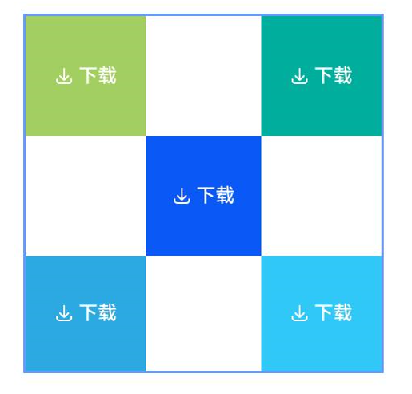
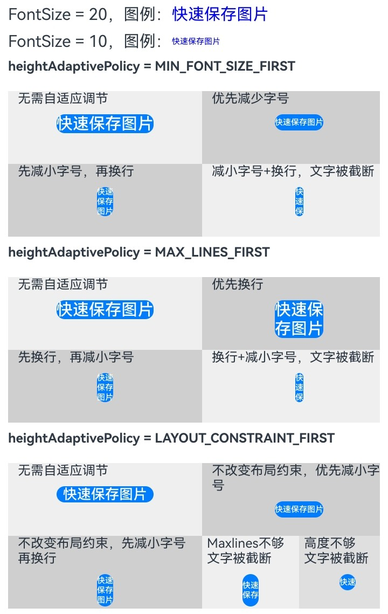
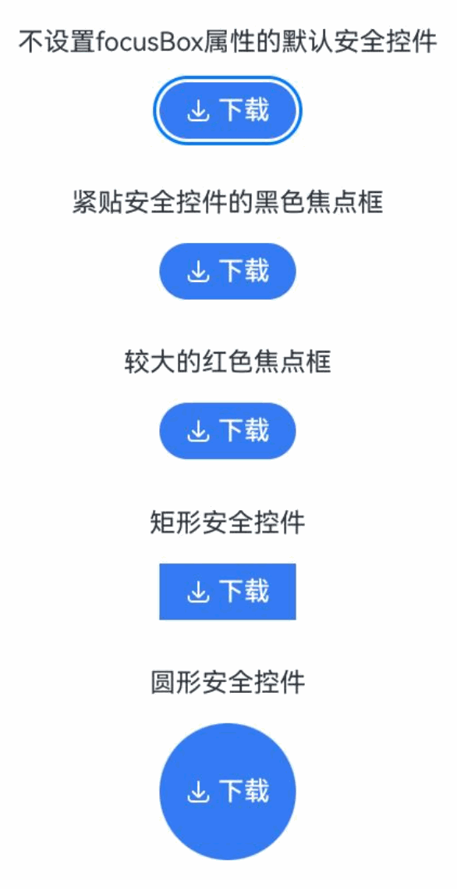

# 安全控件通用属性

<!--Kit: ArkUI-->
<!--Subsystem: Security-->
<!--Owner: @harylee-->
<!--Designer: @linshuqing; @hehehe-li-->
<!--Tester: @leiyuqian-->
<!--Adviser: @zengyawen-->

## 模块简介

安全控件通用属性模块，提供安全控件的布局、尺寸、文字、图标、颜色、边框和交互等通用属性的统一配置能力。

该模块主要用于以下场景：

- 为[PasteButton](ts-security-components-pastebutton.md#pastebutton-1)、[SaveButton](ts-security-components-savebutton.md#savebutton-1)等安全控件统一设置布局、尺寸、文字、图标、边框和交互相关属性。
- 在满足安全控件规范的前提下，调整安全控件显示效果和交互体验。具体约束请参见[约束与限制](../../../security/AccessToken/security-component-overview.md#约束与限制)。
- 通过链式调用方式复用安全控件通用属性能力。

> **说明：**
>
> 该组件从API version 10开始支持。后续版本如有新增内容，则采用上角标单独标记该内容的起始版本。

## 关键Class/Interface介绍

### 核心枚举类型

- **[SecurityComponentLayoutDirection](#securitycomponentlayoutdirection)：** 安全控件图标和文字排列方向枚举，用于指定横向或纵向布局。
- **[ButtonType](#buttontype)：** 安全控件按钮样式枚举，用于指定胶囊、圆形、圆角矩形或普通按钮样式。

### 核心接口类型

- **SecurityComponentMethod&lt;T&gt;：** 安全控件通用属性方法集合，用于为具体安全控件配置布局、尺寸、文字、图标、颜色、边框和交互属性。

## iconSize

iconSize(value: Dimension): T

设置安全控件图标的尺寸。

**原子化服务API：** 从API version 11开始，该接口支持在原子化服务中使用。

**系统能力：** SystemCapability.ArkUI.ArkUI.Full

**参数：**

| 参数名 | 类型 | 必填 | 说明                   |
|------------|------|-------|---------|
| value | [Dimension](ts-types.md#dimension10) | 是 | 安全控件上图标的尺寸。未显式指定单位时，单位为vp。<br/>默认值：16vp。<br/>该参数不支持百分比字符串。<br/>若传入异常值或无效单位，属性不生效，控件按照默认值显示。 |

**返回值：**

| 类型 | 说明 |
| -------- | -------- |
| T | 返回安全控件的属性。 |

## layoutDirection

layoutDirection(value: SecurityComponentLayoutDirection): T

设置安全控件图标和文字分布的方向。

**原子化服务API：** 从API version 11开始，该接口支持在原子化服务中使用。

**系统能力：** SystemCapability.ArkUI.ArkUI.Full

**参数：**

| 参数名 | 类型 | 必填 | 说明                   |
|------------|------|-------|---------|
| value | [SecurityComponentLayoutDirection](#securitycomponentlayoutdirection) | 是 | 安全控件上图标和文字分布的方向。<br/>默认值：SecurityComponentLayoutDirection.HORIZONTAL。 |

**返回值：**

| 类型 | 说明 |
| -------- | -------- |
| T | 返回安全控件的属性。 |

## position

position(value: Position): T

设置绝对定位，即安全控件的左上角相对于父容器左上角的偏移位置。

**原子化服务API：** 从API version 11开始，该接口支持在原子化服务中使用。

**系统能力：** SystemCapability.ArkUI.ArkUI.Full

**参数：**

| 参数名 | 类型 | 必填 | 说明                   |
|------------|------|-------|---------|
| value | [Position](ts-types.md#position) | 是 | 安全控件左上角相对于父容器左上角的偏移位置。适用于通过绝对定位将安全控件放置到页面固定区域的场景。<br/>x和y建议均传入数值型坐标。<br/>若参数为undefined、null，或x、y为非数字类型时，该属性不生效，异常坐标会按0处理。 |

**返回值：**

| 类型 | 说明 |
| -------- | -------- |
| T | 返回安全控件的属性。 |

## markAnchor

markAnchor(value: Position): T

设置安全控件在位置定位时的锚点，以控件左上角作为基准点进行偏移。

**原子化服务API：** 从API version 11开始，该接口支持在原子化服务中使用。

**系统能力：** SystemCapability.ArkUI.ArkUI.Full

**参数：**

| 参数名 | 类型                   | 必填 | 说明                   |
|------------|------|-------|---------|
| value | [Position](ts-types.md#position) | 是 | 安全控件在位置定位时的锚点，以控件左上角作为基准点进行偏移。通常与position()、offset()配合使用，用于更精细地设置控件展示位置。<br/>无默认值。<br/>传入异常值时该属性不生效。 |

**返回值：**

| 类型 | 说明 |
| -------- | -------- |
| T | 返回安全控件的属性。 |

## offset

offset(value: Position | Edges | LocalizedEdges): T

设置安全控件相对于自身布局位置的坐标偏移。

**原子化服务API：** 从API version 11开始，该接口支持在原子化服务中使用。

**系统能力：** SystemCapability.ArkUI.ArkUI.Full

**参数：**

| 参数名 | 类型                   | 必填 | 说明                   |
|------------|------|-------|---------|
| value | [Position](ts-types.md#position) \| [Edges<sup>12+</sup>](ts-types.md#edges12) \| [LocalizedEdges<sup>12+</sup>](ts-types.md#localizededges12) | 是 | 安全控件相对于自身布局位置的坐标偏移。设置后不会影响父容器布局，仅在绘制阶段调整控件显示位置。<br/>无默认值。<br/>当入参异常时，该属性不生效。 |

**返回值：**

| 类型 | 说明 |
| -------- | -------- |
| T | 返回安全控件的属性。 |

## fontSize

fontSize(value: Dimension): T

设置安全控件文字的尺寸。

**原子化服务API：** 从API version 11开始，该接口支持在原子化服务中使用。

**系统能力：** SystemCapability.ArkUI.ArkUI.Full

**参数：**

| 参数名 | 类型                   | 必填 | 说明                   |
|------------|------|-------|---------|
| value | [Dimension](ts-types.md#dimension10) | 是 | 安全控件上文字的尺寸。未显式指定单位时，单位为fp。<br/>默认值：$r('sys.float.ohos_id_text_size_button1')。<br/>该参数不支持百分比字符串。<br/>设置异常值时该属性不生效。<br/>**说明：** 安全控件文本未完全显示时，点击不授权。fontSize的设置会影响文本是否能完整显示，进而影响安全控件的授权行为。 |

**返回值：**

| 类型 | 说明 |
| -------- | -------- |
| T | 返回安全控件的属性。 |

## fontStyle

fontStyle(value: FontStyle): T

设置安全控件文字的样式。

**原子化服务API：** 从API version 11开始，该接口支持在原子化服务中使用。

**系统能力：** SystemCapability.ArkUI.ArkUI.Full

**参数：**

| 参数名 | 类型                   | 必填 | 说明                   |
|------------|------|-------|---------|
| value | [FontStyle](ts-appendix-enums.md#fontstyle) | 是 | 安全控件上文字的样式。<br/>默认值：FontStyle.Normal。 |

**返回值：**

| 类型 | 说明 |
| -------- | -------- |
| T | 返回安全控件的属性。 |

## fontWeight

fontWeight(value: number | FontWeight | string | Resource): T

设置安全控件文字的粗细。

**原子化服务API：** 从API version 11开始，该接口支持在原子化服务中使用。

**系统能力：** SystemCapability.ArkUI.ArkUI.Full

**参数：**

| 参数名 | 类型                   | 必填 | 说明                   |
|------------|------|-------|---------|
| value | number \| [FontWeight](ts-appendix-enums.md#fontweight) \| string \| [Resource](ts-types.md#resource)<sup>20+</sup> | 是 | 安全控件上文字粗细。<br/>number类型取值[100, 900]，取值间隔为100，取值越大，字体越粗。<br/>string类型支持使用数字字符串（如'400'），以及FontWeight中的枚举值对应的字符串（如'bold'、'bolder'、'lighter'、'regular'、'medium'）。<br/>从API version 20开始，支持Resource类型。Resource类型仅支持'integer'和'string'，当类型为'integer'时，取值参考前述number类型；当类型为'string'时，取值参考前述string类型。<br/>如果控件未设置fontWeight，文字粗细将默认设置为FontWeight.Medium。如果value入参为undefined、null，或number类型不在[100, 900]范围内，或string类型不符合FontWeight枚举值对应的字符串格式，文字粗细将被设置为FontWeight.Normal。 |

**返回值：**

| 类型 | 说明 |
| -------- | -------- |
| T | 返回安全控件的属性。 |

## fontFamily

fontFamily(value: string | Resource): T

设置安全控件文字的字体。

**原子化服务API：** 从API version 11开始，该接口支持在原子化服务中使用。

**系统能力：** SystemCapability.ArkUI.ArkUI.Full

**参数：**

| 参数名 | 类型                   | 必填 | 说明                   |
|------------|------|-------|---------|
| value | string \| [Resource](ts-types.md#resource) | 是 | 安全控件上文字的字体。<br/>默认字体：'HarmonyOS Sans'。|

**返回值：**

| 类型 | 说明 |
| -------- | -------- |
| T | 返回安全控件的属性。 |

## fontColor

fontColor(value: ResourceColor): T

设置安全控件文字的颜色。

**原子化服务API：** 从API version 11开始，该接口支持在原子化服务中使用。

**系统能力：** SystemCapability.ArkUI.ArkUI.Full

**参数：**

| 参数名 | 类型                   | 必填 | 说明                   |
|------------|------|-------|---------|
| value | [ResourceColor](ts-types.md#resourcecolor) | 是 | 安全控件上文字的颜色。<br/>默认值：$r('sys.color.font_on_primary')。|

**返回值：**

| 类型 | 说明 |
| -------- | -------- |
| T | 返回安全控件的属性。 |

## iconColor

iconColor(value: ResourceColor): T

设置安全控件图标的颜色。

**原子化服务API：** 从API version 11开始，该接口支持在原子化服务中使用。

**系统能力：** SystemCapability.ArkUI.ArkUI.Full

**参数：**

| 参数名 | 类型                   | 必填 | 说明                   |
|------------|------|-------|---------|
| value | [ResourceColor](ts-types.md#resourcecolor) | 是 | 安全控件上图标的颜色。<br/>默认值：$r('sys.color.icon_on_primary')。|

**返回值：**

| 类型 | 说明 |
| -------- | -------- |
| T | 返回安全控件的属性。 |

## backgroundColor

backgroundColor(value: ResourceColor): T

设置安全控件的背景颜色。

**原子化服务API：** 从API version 11开始，该接口支持在原子化服务中使用。

**系统能力：** SystemCapability.ArkUI.ArkUI.Full

**参数：**

| 参数名 | 类型                   | 必填 | 说明                   |
|------------|------|-------|---------|
| value | [ResourceColor](ts-types.md#resourcecolor) | 是 | 安全控件的背景颜色。安全控件按钮背景色高八位的α值低于0x1a（例如0x1800ff00）时，会被系统强制调整为0xff，以确保安全控件具有足够的可见性，防止因控件过于透明导致用户在不知情的情况下触发授权。<br/>默认值：$r('sys.color.icon_emphasize')。|

**返回值：**

| 类型 | 说明 |
| -------- | -------- |
| T | 返回安全控件的属性。 |

## borderStyle

borderStyle(value: BorderStyle): T

设置安全控件边框的样式。

**原子化服务API：** 从API version 11开始，该接口支持在原子化服务中使用。

**系统能力：** SystemCapability.ArkUI.ArkUI.Full

**参数：**

| 参数名 | 类型                   | 必填 | 说明                   |
|------------|------|-------|---------|
| value | [BorderStyle](ts-appendix-enums.md#borderstyle) | 是 | 安全控件边框的样式。<br/>默认不设置边框样式。|

**返回值：**

| 类型 | 说明 |
| -------- | -------- |
| T | 返回安全控件的属性。 |

## borderWidth

borderWidth(value: Dimension): T

设置安全控件的边框宽度。

**原子化服务API：** 从API version 11开始，该接口支持在原子化服务中使用。

**系统能力：** SystemCapability.ArkUI.ArkUI.Full

**参数：**

| 参数名 | 类型                   | 必填 | 说明                   |
|------------|------|-------|---------|
| value | [Dimension](ts-types.md#dimension10) | 是 | 安全控件的边框宽度。<br/>默认不设置边框宽度。未显式指定单位时，单位为vp。<br/>不支持设置百分比字符串。设置异常值时该属性不生效。|

**返回值：**

| 类型 | 说明 |
| -------- | -------- |
| T | 返回安全控件的属性。 |

## borderColor

borderColor(value: ResourceColor): T

设置安全控件的边框颜色。

**原子化服务API：** 从API version 11开始，该接口支持在原子化服务中使用。

**系统能力：** SystemCapability.ArkUI.ArkUI.Full

**参数：**

| 参数名 | 类型                   | 必填 | 说明                   |
|------------|------|-------|---------|
| value | [ResourceColor](ts-types.md#resourcecolor) | 是 | 安全控件的边框颜色。<br/>默认不设置边框颜色。|

**返回值：**

| 类型 | 说明 |
| -------- | -------- |
| T | 返回安全控件的属性。 |

## borderRadius

borderRadius(value: Dimension): T

设置安全控件的边框圆角半径。

borderRadius的设置效果受ButtonType影响。当按钮类型为Capsule或Circle时，borderRadius设置不生效，按钮圆角半径由按钮类型自动确定；当按钮类型为Normal或ROUNDED_RECTANGLE时，borderRadius设置生效。具体影响请参见[ButtonType](#buttontype)。

**原子化服务API：** 从API version 11开始，该接口支持在原子化服务中使用。

**系统能力：** SystemCapability.ArkUI.ArkUI.Full

**参数：**

| 参数名 | 类型                   | 必填 | 说明                   |
|------------|------|-------|---------|
| value |  [Dimension](ts-types.md#dimension10) | 是 | 安全控件的边框圆角半径。未显式指定单位时，单位为vp。<br/>默认值：0vp。<br/>不支持设置百分比字符串。圆角半径受组件尺寸限制，最小值为0，最大值为宽高中较小值的一半。设置异常值时该属性不生效。|

**返回值：**

| 类型 | 说明 |
| -------- | -------- |
| T | 返回安全控件的属性。 |

## borderRadius<sup>15+</sup>

borderRadius(radius: Dimension | BorderRadiuses): T

设置安全控件的边框圆角半径，支持分别设置四个圆角的半径。

borderRadius的设置效果受ButtonType影响。当按钮类型为Capsule或Circle时，borderRadius设置不生效，按钮圆角半径由按钮类型自动确定；当按钮类型为Normal或ROUNDED_RECTANGLE时，borderRadius设置生效。具体影响请参见[ButtonType](#buttontype)。

**原子化服务API：** 从API version 15开始，该接口支持在原子化服务中使用。

**系统能力：** SystemCapability.ArkUI.ArkUI.Full

**参数：**

| 参数名 | 类型                   | 必填 | 说明                   |
|------------|------|-------|---------|
| radius |  [Dimension](ts-types.md#dimension10) \| [BorderRadiuses](ts-types.md#borderradiuses9) | 是 | 安全控件的边框圆角半径。未显式指定单位时，单位为vp。<br/>默认值：0vp。<br/>Dimension类型不支持设置百分比字符串。圆角半径受组件尺寸限制，最小值为0，最大值为宽高中较小值的一半。设置异常值时该属性不生效。|

**返回值：**

| 类型 | 说明 |
| -------- | -------- |
| T | 返回安全控件的属性。 |

## padding

padding(value: Padding | Dimension): T

设置安全控件的内边距。

**原子化服务API：** 从API version 11开始，该接口支持在原子化服务中使用。

**系统能力：** SystemCapability.ArkUI.ArkUI.Full

**参数：**

| 参数名 | 类型                   | 必填 | 说明                   |
|------------|------|-------|---------|
| value | [Padding](ts-types.md#padding) \| [Dimension](ts-types.md#dimension10) | 是 | 安全控件的内边距。未显式指定单位时，单位为vp。<br/>默认值：上下8vp，左右16vp。<br/>**说明：** 本参数不支持设置百分比字符串数据类型。若设置百分比字符串，则对应内边距显示为0。|

**返回值：**

| 类型 | 说明 |
| -------- | -------- |
| T | 返回安全控件的属性。 |

## align<sup>15+</sup>

align(alignType: Alignment): T

设置安全控件图标文本的对齐方式。

**原子化服务API：** 从API version 15开始，该接口支持在原子化服务中使用。

**系统能力：** SystemCapability.ArkUI.ArkUI.Full

**参数：**

| 参数名 | 类型                   | 必填 | 说明                   |
|------------|------|-------|---------|
| alignType | [Alignment](ts-appendix-enums.md#alignment) | 是 | 安全控件图标文本的对齐方式。图标文本作为整体在控件背景范围内进行对齐，显示效果受[padding](ts-securitycomponent-attributes.md#padding)影响，在padding生效的基础上按照alignType参数指定的对齐方式进行对齐。<br/>默认值：Alignment.Center。|

**返回值：**

| 类型 | 说明 |
| -------- | -------- |
| T | 返回安全控件的属性。 |

## textIconSpace

textIconSpace(value: Dimension): T

设置安全控件中图标和文字的间距。

**原子化服务API：** 从API version 11开始，该接口支持在原子化服务中使用。

**系统能力：** SystemCapability.ArkUI.ArkUI.Full

**参数：**

| 参数名 | 类型                   | 必填 | 说明                   |
|------------|------|-------|---------|
| value | [Dimension](ts-types.md#dimension10) | 是 | 安全控件中图标和文字的间距。未显式指定单位时，单位为vp。<br/>默认值：4vp。<br/>**说明：** 本参数不支持设置百分比字符串数据类型，若设置百分比字符串，则图标和文字的间距显示为0；从API version 14开始，若设置值为负值，则使用默认值。|

**返回值：**

| 类型 | 说明 |
| -------- | -------- |
| T | 返回安全控件的属性。 |

## width<sup>11+</sup>

width(value: Length): T

设置安全控件自身的宽度，缺省时将根据元素内容自适配宽度。

**原子化服务API：** 从API version 12开始，该接口支持在原子化服务中使用。

**系统能力：** SystemCapability.ArkUI.ArkUI.Full

**参数：**

| 参数名 | 类型                   | 必填 | 说明                   |
|------------|------|-------|---------|
| value | [Length](ts-types.md#length) | 是 | 安全控件自身的宽度，缺省时将根据元素内容自适配宽度。未显式指定单位时，单位为vp。<br/>使用自适应字号相关属性时，安全控件文本未完全显示将导致点击不授权。width的设置会影响文本是否能完整显示。|

**返回值：**

| 类型 | 说明 |
| -------- | -------- |
| T | 返回安全控件的属性。 |

## height<sup>11+</sup>

height(value: Length): T

设置安全控件自身的高度，缺省时将根据元素内容自适配高度。

**原子化服务API：** 从API version 12开始，该接口支持在原子化服务中使用。

**系统能力：** SystemCapability.ArkUI.ArkUI.Full

**参数：**

| 参数名 | 类型                   | 必填 | 说明                   |
|------------|------|-------|---------|
| value | [Length](ts-types.md#length) | 是 | 安全控件自身的高度，缺省时将根据元素内容自适配高度。未显式指定单位时，单位为vp。<br/>使用自适应字号相关属性时，安全控件文本未完全显示将导致点击不授权。height的设置会影响文本是否能完整显示。|

**返回值：**

| 类型 | 说明 |
| -------- | -------- |
| T | 返回安全控件的属性。 |

## size<sup>11+</sup>

size(value: SizeOptions): T

设置宽高尺寸，缺省时将根据元素内容自适配宽高尺寸。

**原子化服务API：** 从API version 12开始，该接口支持在原子化服务中使用。

**系统能力：** SystemCapability.ArkUI.ArkUI.Full

**参数：**

| 参数名 | 类型                   | 必填 | 说明                   |
|------------|------|-------|---------|
| value | [SizeOptions](ts-types.md#sizeoptions) | 是 | 宽高尺寸，缺省时将根据元素内容自适配宽高尺寸。未显式指定单位时，单位为vp。<br/>使用自适应字号相关属性时，安全控件文本未完全显示将导致点击不授权。size的设置会影响文本是否能完整显示。|

**返回值：**

| 类型 | 说明 |
| -------- | -------- |
| T | 返回安全控件的属性。 |

## constraintSize<sup>11+</sup>

constraintSize(value: ConstraintSizeOptions): T

设置约束尺寸，组件布局时限制尺寸范围。

**原子化服务API：** 从API version 12开始，该接口支持在原子化服务中使用。

**系统能力：** SystemCapability.ArkUI.ArkUI.Full

**参数：**

| 参数名 | 类型                   | 必填 | 说明                   |
|------------|------|-------|---------|
| value | [ConstraintSizeOptions](ts-types.md#constraintsizeoptions) | 是 | 约束尺寸，组件布局时，进行尺寸范围限制。未显式指定单位时，单位为vp。constraintSize的优先级高于width和height。使用自适应字号相关属性时，安全控件文本未完全显示将导致点击不授权。constraintSize的设置会影响文本是否能完整显示。取值结果参考[constraintSize取值对width/height影响](ts-universal-attributes-size.md#constraintsize)。<br>默认值：<br>{<br/>minWidth:&nbsp;0,<br/>maxWidth:&nbsp;Infinity,<br/>minHeight:&nbsp;0,<br/>maxHeight:&nbsp;Infinity<br/>}。|

**返回值：**

| 类型 | 说明 |
| -------- | -------- |
| T | 返回安全控件的属性。 |

## alignRules<sup>15+</sup>

alignRules(alignRule: AlignRuleOption): T

设置在相对容器中子组件的对齐规则，仅当父容器为[RelativeContainer](ts-container-relativecontainer.md)时生效。

**原子化服务API：** 从API version 15开始，该接口支持在原子化服务中使用。

**系统能力：** SystemCapability.ArkUI.ArkUI.Full

**参数：**

| 参数名 | 类型                                        | 必填 | 说明                     |
| ------ | ------------------------------------------- | ---- | ------------------------ |
| alignRule | [AlignRuleOption](ts-universal-attributes-location.md#alignruleoption9对象说明) | 是   | 对齐规则配置对象，包含top、bottom、left、right、center等锚点对齐配置，用于指定安全控件在[RelativeContainer](ts-container-relativecontainer.md)中的对齐位置和方式。 |

**返回值：**

| 类型 | 说明 |
| -------- | -------- |
| T | 返回安全控件的属性。 |

## alignRules<sup>15+</sup>

alignRules(alignRule: LocalizedAlignRuleOptions): T

设置在相对容器中子组件的对齐规则，仅当父容器为[RelativeContainer](ts-container-relativecontainer.md)时生效。该方法水平方向上以start和end分别替代上述[alignRules](#alignrules15)的left和right，以便在RTL模式下能镜像显示，建议优先使用该方法。

**原子化服务API：** 从API version 15开始，该接口支持在原子化服务中使用。

**系统能力：** SystemCapability.ArkUI.ArkUI.Full

**参数：**

| 参数名 | 类型                                        | 必填 | 说明                     |
| ------ | ------------------------------------------- | ---- | ------------------------ |
| alignRule | [LocalizedAlignRuleOptions](ts-universal-attributes-location.md#localizedalignruleoptions12对象说明) | 是   | 对齐规则配置对象，使用start/end替代left/right以支持RTL布局镜像。包含top、bottom、start、end、center等锚点对齐配置，用于指定安全控件在[RelativeContainer](ts-container-relativecontainer.md)中的对齐位置和方式。 |

**返回值：**

| 类型 | 说明 |
| -------- | -------- |
| T | 返回安全控件的属性。 |

## id<sup>15+</sup>

id(id: string): T

组件的唯一标识，唯一性由使用者保证。

**原子化服务API：** 从API version 15开始，该接口支持在原子化服务中使用。

**系统能力：** SystemCapability.ArkUI.ArkUI.Full

**参数：**

| 参数名   | 类型      | 必填 | 说明                       |
| ------ | -------- | -----|---------------------- |
| id | string   |  是  | 组件的唯一标识，唯一性由使用者保证。<br>默认值：''。<br/> |

**返回值：**

| 类型 | 说明 |
| -------- | -------- |
| T | 返回安全控件的属性。 |

## chainMode<sup>15+</sup>

chainMode(direction: Axis, style: ChainStyle): T

设置以该组件为链头所构成的链式布局的参数（包括链的方向和样式），仅当父容器为[RelativeContainer](ts-container-relativecontainer.md)时生效。

**原子化服务API：** 从API version 15开始，该接口支持在原子化服务中使用。

**系统能力：** SystemCapability.ArkUI.ArkUI.Full

**参数：**

| 参数名 | 类型                                        | 必填 | 说明                     |
| ------ | ------------------------------------------- | ---- | ------------------------ |
| direction | [Axis](ts-appendix-enums.md#axis) | 是   | 链式布局的方向，用于指定以该组件为链头的链在[RelativeContainer](ts-container-relativecontainer.md)中的排列方向。 |
| style | [ChainStyle](ts-universal-attributes-location.md#chainstyle12) | 是   | 链式布局的样式，用于控制链内子组件的分布方式，如均匀分布、两端对齐或紧凑排列等，具体取值及效果请参考[ChainStyle](ts-universal-attributes-location.md#chainstyle12)。 |

**返回值：**

| 类型 | 说明 |
| -------- | -------- |
| T | 返回安全控件的属性。 |

## minFontScale<sup>18+</sup>

minFontScale(scale: number | Resource): T

设置文本最小的字体缩小倍数。调用后，当系统字体缩放使文本缩小时，文本缩小倍数不会低于设定的最小缩小倍数。

与[maxFontScale](#maxfontscale18)可配合使用，minFontScale控制缩小倍数的下限，maxFontScale控制放大倍数的上限。两者可独立设置，也可同时设置以精确控制字体缩放范围。

**原子化服务API：** 从API version 18开始，该接口支持在原子化服务中使用。

**系统能力：** SystemCapability.ArkUI.ArkUI.Full

**参数：**

| 参数名 | 类型                                          | 必填 | 说明                                          |
| ------ | --------------------------------------------- | ---- | --------------------------------------------- |
| scale  | number \| [Resource](ts-types.md#resource) | 是   | 文本最小的字体缩小倍数。<br/>取值范围：[0, 1]。<br/>**说明：** <br/>设置的值小于0时，按值为0处理，即允许缩小到任意倍数；设置的值大于1时，按值为1处理，即不允许缩小字体；设置的值为undefined或null等非法值时，属性不生效。 |

**返回值：**

| 类型 | 说明 |
| -------- | -------- |
| T | 返回安全控件的属性。 |

## maxFontScale<sup>18+</sup>

maxFontScale(scale: number | Resource): T

设置文本最大的字体放大倍数。调用后，当系统字体缩放使文本放大时，文本放大倍数不会超过设定的最大放大倍数。

与[minFontScale](#minfontscale18)可配合使用，maxFontScale控制放大倍数的上限，minFontScale控制缩小倍数的下限。两者可独立设置，也可同时设置以精确控制字体缩放范围。

**原子化服务API：** 从API version 18开始，该接口支持在原子化服务中使用。

**系统能力：** SystemCapability.ArkUI.ArkUI.Full

**参数：**

| 参数名 | 类型                                          | 必填 | 说明                                          |
| ------ | --------------------------------------------- | ---- | --------------------------------------------- |
| scale  | number \| [Resource](ts-types.md#resource) | 是   | 文本最大的字体放大倍数。<br/>取值范围：[1, +∞)。<br/>**说明：** <br/>设置的值小于1时，按值为1处理；设置的值为undefined或null等非法值时，属性不生效。 |

**返回值：**

| 类型 | 说明 |
| -------- | -------- |
| T | 返回安全控件的属性。 |

## minFontSize<sup>18+</sup>

minFontSize(minSize: number | string | Resource): T

设置文本最小显示字号。
- 配合[maxFontSize](#maxfontsize18)以及[maxLines](#maxlines18)或布局大小限制使用，可实现自适应字号，单独设置不生效。
- minFontSize应小于maxFontSize，若设置值大于maxFontSize，将按maxFontSize处理。
- minFontSize小于或等于0时，自适应字号不生效。
- 自适应字号生效时，fontSize设置不生效。
- 安全控件文本未完全显示时，点击不授权。minFontSize的设置会影响文本是否能完整显示，进而影响安全控件的授权行为。

**原子化服务API：** 从API version 18开始，该接口支持在原子化服务中使用。

**系统能力：** SystemCapability.ArkUI.ArkUI.Full

**参数：**

| 参数名 | 类型                                                         | 必填 | 说明               |
| ------ | ------------------------------------------------------------ | ---- | ------------------ |
| minSize  | number&nbsp;\|&nbsp;string&nbsp;\|&nbsp;[Resource](ts-types.md#resource) | 是   | 文本最小显示字号。未显式指定单位时，单位为fp。<br/>取值范围：(0, +∞)。minFontSize应小于maxFontSize，若设置值大于maxFontSize，将按maxFontSize处理；小于或等于0时，自适应字号不生效。 |

**返回值：**

| 类型 | 说明 |
| -------- | -------- |
| T | 返回安全控件的属性。 |

## maxFontSize<sup>18+</sup>

maxFontSize(maxSize: number | string | Resource): T

设置文本最大显示字号。
- 配合[minFontSize](#minfontsize18)以及[maxLines](#maxlines18)或布局大小限制使用，可实现自适应字号，单独设置不生效。
- maxFontSize应大于minFontSize，若maxFontSize小于minFontSize，minFontSize将按maxFontSize处理。
- 当自适应字号生效时，设置的fontSize将不生效。
- 安全控件文本未完全显示时，点击不授权。maxFontSize的设置会影响文本是否能完整显示，进而影响安全控件的授权行为。

**原子化服务API：** 从API version 18开始，该接口支持在原子化服务中使用。

**系统能力：** SystemCapability.ArkUI.ArkUI.Full

**参数：**

| 参数名 | 类型                                                         | 必填 | 说明               |
| ------ | ------------------------------------------------------------ | ---- | ------------------ |
| maxSize  | number&nbsp;\|&nbsp;string&nbsp;\|&nbsp;[Resource](ts-types.md#resource) | 是   | 文本最大显示字号。未显式指定单位时，单位为fp。<br/>取值范围：(0, +∞)。<br/>**说明：**<br/>设置的值小于或等于0时，自适应字号不生效；设置异常值时该属性不生效。 |

**返回值：**

| 类型 | 说明 |
| -------- | -------- |
| T | 返回安全控件的属性。 |

## maxLines<sup>18+</sup>

maxLines(line: number | Resource): T

设置文本的最大行数。默认情况下，文本自动换行，指定此属性后，文本的最大显示行数不会超过指定值。配合[minFontSize](#minfontsize18)、[maxFontSize](#maxfontsize18)以及[heightAdaptivePolicy](#heightadaptivepolicy18)使用时，安全控件文本未完全显示将导致点击不授权。maxLines的设置会影响文本是否能完整显示，进而影响安全控件的授权行为。

**原子化服务API：** 从API version 18开始，该接口支持在原子化服务中使用。

**系统能力：** SystemCapability.ArkUI.ArkUI.Full

**参数：**

| 参数名 | 类型   | 必填 | 说明             |
| ------ | ------ | ---- | ---------------- |
| line  | number \| [Resource](ts-types.md#resource)<sup>20+</sup> | 是   | 文本的最大行数。<br/>number类型入参的取值范围：[1, +∞)。从API version 20开始，支持Resource类型。Resource类型仅支持'integer'，取值范围为[1, +∞)。<br/>**说明：** <br/>设置的值小于1时，按默认值1000000处理。 |

**返回值：**

| 类型 | 说明 |
| -------- | -------- |
| T | 返回安全控件的属性。 |

## heightAdaptivePolicy<sup>18+</sup>

heightAdaptivePolicy(policy: TextHeightAdaptivePolicy): T

设置文本自适应高度的方式。适用于安全控件在不同尺寸或不同语言环境下，需要动态调整文本显示以保证文本完整显示的场景。

安全控件文本以[maxFontSize](#maxfontsize18)的值进行布局，如果可以完整显示文本，则无需进行自适应调节，该接口设置不生效，否则按指定文本自适应高度的方式进行调节，具体自适应调节规格如下：

当设置为TextHeightAdaptivePolicy.MAX_LINES_FIRST时，优先使用[maxLines](#maxlines18)属性来调整文本高度。如果使用maxLines属性的布局大小超过了布局约束，则尝试在[minFontSize](#minfontsize18)和[maxFontSize](#maxfontsize18)的范围内缩小字体以显示更多文本，如果此时仍不能完整显示文本信息，安全控件会自适应调整高度以使得文本完整显示。

当设置为TextHeightAdaptivePolicy.MIN_FONT_SIZE_FIRST时，优先使用[minFontSize](#minfontsize18)属性来调整文本高度。如果使用minFontSize属性可以将文本布局在一行中，则尝试在minFontSize和[maxFontSize](#maxfontsize18)的范围内增大字体并使用最大可能的字体大小；如果使用minFontSize属性无法将文本布局在一行中，则尝试使用[maxLines](#maxlines18)属性进行布局，如果此时仍不能完整显示文本信息，安全控件会自适应调整高度以使得文本完整显示。

当设置为TextHeightAdaptivePolicy.LAYOUT_CONSTRAINT_FIRST时，优先使用布局约束来调整文本高度。如果布局大小超过布局约束，则尝试在[minFontSize](#minfontsize18)和[maxFontSize](#maxfontsize18)的范围内缩小字体以满足布局约束。如果将字体大小缩小到minFontSize后，布局大小仍然超过布局约束，则删除超过布局约束的行；如果设置了[maxLines](#maxlines18)属性，布局后行数不超过maxLines值（可能存在横向截断）；如果未设置maxLines属性值，布局后的行数不限制。

安全控件文本未完全显示时，点击不授权。文本是否完全显示受heightAdaptivePolicy、minFontSize、maxFontSize、maxLines、width和height等属性影响。

具体效果请见[示例](#示例3)。

**原子化服务API：** 从API version 18开始，该接口支持在原子化服务中使用。

**系统能力：** SystemCapability.ArkUI.ArkUI.Full

**参数：**

| 参数名 | 类型                                                         | 必填 | 说明                                                         |
| ------ | ------------------------------------------------------------ | ---- | ------------------------------------------------------------ |
| policy  | [TextHeightAdaptivePolicy](ts-appendix-enums.md#textheightadaptivepolicy10) | 是   | 文本自适应高度的方式。<br/>默认值：TextHeightAdaptivePolicy.MAX_LINES_FIRST。 |

**返回值：**

| 类型 | 说明 |
| -------- | -------- |
| T | 返回安全控件的属性。 |

## enabled<sup>18+</sup>

enabled(respond: boolean): T

设置安全控件是否可交互。

**原子化服务API：** 从API version 18开始，该接口支持在原子化服务中使用。

**系统能力：** SystemCapability.ArkUI.ArkUI.Full

**参数：**

| 参数名 | 类型    | 必填 | 说明                                                         |
| ------ | ------- | ---- | ------------------------------------------------------------ |
| respond  | boolean | 是   | 值为true表示组件可交互，响应点击等操作。<br/>值为false表示组件不可交互，不响应点击等操作。<br/>默认值：true。 |

**返回值：**

| 类型 | 说明 |
| -------- | -------- |
| T | 返回安全控件的属性。 |

## focusBox<sup>22+</sup>

focusBox(style: FocusBoxStyle): T

设置安全控件系统焦点框样式。

**原子化服务API：** 从API version 22开始，该接口支持在原子化服务中使用。

**系统能力：** SystemCapability.ArkUI.ArkUI.Full

**参数：**

| 参数名 | 类型 | 必填 | 说明 |
| ---- | ---- | ---- | ---- |
| style  | [FocusBoxStyle](ts-universal-attributes-focus.md#focusboxstyle12对象说明) | 是   | 焦点框样式配置对象，包含margin（焦点框与控件的间距）和strokeColor（焦点框边框颜色）等属性，用于自定义系统焦点框的外观样式。 |

**返回值：**

| 类型 | 说明 |
| -------- | -------- |
| T | 返回安全控件的属性。 |

## fallbackLineSpacing

fallbackLineSpacing(enabled: boolean): T

针对多行文字叠加，支持行高基于文字实际高度自适应。

fallbackLineSpacing属性和[RichEditorTextStyle](ts-basic-components-richeditor.md#richeditortextstyle)的lineHeight属性强相关。当设置的 lineHeight 值小于文本在当前字号下的实际渲染高度时，将根据fallbackLineSpacing 属性值来确定行高是否要基于文字实际高度自适应。

**起始版本：** 26.0.0

**模型约束：** 此接口仅可在Stage模型下使用。

**原子化服务API：** 从API版本26.0.0开始，该接口支持在原子化服务中使用。

**系统能力：** SystemCapability.ArkUI.ArkUI.Full

**参数：**

| 参数名  | 类型                                                         | 必填 | 说明                                                         |
| ------- | ------------------------------------------------------------ | ---- | ------------------------------------------------------------ |
| enabled | boolean | 是   | 行高是否基于文字实际高度自适应。<br/>true表示行高基于文字实际高度自适应；false表示行高不基于文字实际高度自适应。 |

**返回值：**

| 类型 | 说明 |
| -------- | -------- |
| T | 返回安全控件的属性。 |

## accessibilityRole 

accessibilityRole(role: SecurityComponentRoleType): T

设置无障碍组件类型，特定组件类型有特定的朗读方式，可以根据应用诉求，修改组件类型，用于控制无障碍模式下对组件的朗读方式和朗读内容。

**起始版本：** 26.0.0

**模型约束：** 此接口仅可在Stage模型下使用。

**原子化服务API：** 从API版本26.0.0开始，该接口支持在原子化服务中使用。

**系统能力：** SystemCapability.ArkUI.ArkUI.Full

**参数：**

| 参数名   | 类型    | 必填 | 说明                                                         |
| -------- | ------- | ---- | ------------------------------------------------------------ |
| role | [SecurityComponentRoleType](#securitycomponentroletype) | 是   | 屏幕朗读播报的组件类型，如按钮、图表。具体类型可由开发者自定义。 |

**返回值：**

| 类型 | 说明 |
| -------- | -------- |
| T | 返回当前对象。 |

## accessibilityDefaultFocus

accessibilityDefaultFocus(focus: boolean): T

设置页面的屏幕朗读初始焦点，用于指定页面加载后屏幕朗读首次播报的焦点组件。

**起始版本：** 26.0.0

**模型约束：** 此接口仅可在Stage模型下使用。

**原子化服务API：** 从API版本26.0.0开始，该接口支持在原子化服务中使用。

**系统能力：** SystemCapability.ArkUI.ArkUI.Full

**参数：**

| 参数名 | 类型    | 必填 | 说明                                                         |
| ------ | ------- | ---- | ------------------------------------------------------------ |
| focus  | boolean | 是   | 为页面设置屏幕朗读初始焦点。值为true则表示该组件为当前页默认首焦点，值为false或其他值无效。 |

**返回值：**

| 类型 | 说明 |
| -------- | -------- |
| T | 返回当前对象。 |

## accessibilityNextFocusId

accessibilityNextFocusId(nextId: string): T

支持在屏幕朗读过程中，指定朗读的下一个焦点组件。

**起始版本：** 26.0.0

**模型约束：** 此接口仅可在Stage模型下使用。

**原子化服务API：** 从API版本26.0.0开始，该接口支持在原子化服务中使用。

**系统能力：** SystemCapability.ArkUI.ArkUI.Full

**参数：**

| 参数名 | 类型   | 必填 | 说明                                                         |
| ------ | ------ | ---- | ------------------------------------------------------------ |
| nextId | string | 是   | 下一个被指定聚焦组件的[唯一标识id](ts-universal-attributes-component-id.md#id)。若唯一标识id无对应组件，则设置无效。 |

**返回值：**

| 类型 | 说明 |
| -------- | -------- |
| T | 返回当前对象。 |

## accessibilityDescription

accessibilityDescription(description: string | Resource): T

该属性用于为控件提供无障碍描述。开发人员可通过设置详细的文字说明，帮助用户理解组件的功能及即将执行的操作。

**起始版本：** 26.0.0

**模型约束：** 此接口仅可在Stage模型下使用。

**原子化服务API：** 从API版本26.0.0开始，该接口支持在原子化服务中使用。

**系统能力：** SystemCapability.ArkUI.ArkUI.Full

**参数：**

| 参数名 | 类型   | 必填 | 说明                                                         |
| ------ | ------ | ---- | ------------------------------------------------------------ |
| description  | string \| [Resource](ts-types.md#resource) | 是   | 控件的无障碍说明。用于补充组件的详细操作解释，帮助用户理解当前操作的具体内容及其潜在后果。控件被选中时，若组件同时包含文本属性和无障碍说明，优先播报文本内容，再播报无障碍说明。该参数的默认值为空字符串。 |

**返回值：**

| 类型 | 说明 |
| -------- | -------- |
| T | 返回当前对象。 |


## SecurityComponentLayoutDirection

安全控件上图标和文字的排列方向。

**原子化服务API：** 从API version 11开始，该接口支持在原子化服务中使用。

**系统能力：** SystemCapability.ArkUI.ArkUI.Full

| 名称 | 值 | 说明 |
| -------- | -------- | -------- |
| HORIZONTAL | 0 | 安全控件上图标和文字分布的方向为水平排列。 |
| VERTICAL | 1 | 安全控件上图标和文字分布的方向为垂直排列。 |

## ButtonType

按钮类型。

不同的按钮类型将影响属性[borderRadius（边框圆角半径）](ts-securitycomponent-attributes.md#borderradius)的设置效果。影响如下：

- 当按钮类型为Capsule时，borderRadius设置不生效，按钮圆角半径始终为宽、高中较小值的一半。
- 当按钮类型为Circle时，borderRadius设置不生效：
  - 若同时设置了宽和高，按钮圆角半径为宽高中较小值的一半；
  - 若只设置宽、高中的一个，按钮圆角半径为所设宽或所设高值的一半；
  - 若未设置宽高或borderRadius的值为负数，按钮圆角半径将根据按钮的实际布局尺寸自动计算。适用于图标按钮，如音量控制、播放/暂停等场景。
- 当按钮类型为Normal时，按钮圆角半径可通过borderRadius设置，圆角大小受组件尺寸限制，最小值为0，最大值为组件宽高中较小值的一半。适用于需要自定义圆角大小或保持直角的按钮场景。
- 当按钮类型为ROUNDED_RECTANGLE时，若不设置borderRadius，圆角矩形按钮的圆角半径大小保持默认值20vp不变，不随按钮高度变化而变化。适用于需要统一圆角风格的按钮场景。

**原子化服务API：** 从API version 11开始，该接口支持在原子化服务中使用。

**系统能力：** SystemCapability.ArkUI.ArkUI.Full

| 名称      | 值 | 说明               |
| ------- | -------- | ------------------ |
| Normal  | 0 | 普通按钮（默认不带圆角）。      |
| Capsule | 1 | 胶囊型按钮（圆角半径默认为高度的一半）。 |
| Circle  | 2 | 圆形按钮。              |
| ROUNDED_RECTANGLE<sup>16+</sup> | 8 | 圆角矩形按钮（默认值：圆角半径大小20vp）。 |

## SecurityComponentRoleType 

定义组件的屏幕朗读功能角色类型。

**起始版本：** 26.0.0

**模型约束：** 此接口仅可在Stage模型下使用。

**原子化服务API：** 从API版本26.0.0开始，该接口支持在原子化服务中使用。

**系统能力：** SystemCapability.ArkUI.ArkUI.Full

| 名称 | 值  | 说明             |
| ---- | ---- | ------------------ |
| ROLE_NONE | 0 | NULL。 |
| BUTTON | 1 | 按钮。 |

## 示例

> **说明：**
> 为避免控件样式不合法导致授权失败，请开发者先了解安全控件样式的[约束与限制](../../../security/AccessToken/security-component-overview.md#约束与限制)。

### 示例1

设置SecurityComponent的基础属性，生成一个保存控件。

```ts
@Entry
@Component
struct Index {
  build() {
    Row() {
      Column({ space: 5 }) {
        // 生成一个保存控件，并设置它的SecurityComponent属性。
        SaveButton()
          .fontSize(35)
          .fontColor(Color.White)
          .iconSize(30)
          .layoutDirection(SecurityComponentLayoutDirection.HORIZONTAL)
          .borderWidth(1)
          .borderStyle(BorderStyle.Dashed)
          .borderColor(Color.Blue)
          .borderRadius(20)
          .fontWeight(100)
          .iconColor(Color.White)
          .padding({
            left: 50,
            top: 50,
            bottom: 50,
            right: 50
          })
          .textIconSpace(20)
          .backgroundColor(0x3282f6)
        // 生成一个保存控件，设置固定宽高。
        SaveButton().size({ width: 200, height: 100 })
        // 生成一个保存控件，设置固定宽高，并设置图标文本左对齐。
        SaveButton()
          .size({ width: 200, height: 100 })
          .align(Alignment.Start)
        // 生成一个Normal类型的保存控件，分别设置四个圆角半径。
        SaveButton({ icon: SaveIconStyle.FULL_FILLED, text: SaveDescription.DOWNLOAD, buttonType: ButtonType.Normal })
          .size({ width: 150, height: 80 })
          .borderRadius({
            topLeft: 20,
            topRight: 25,
            bottomRight: 30,
            bottomLeft: 35
          })
        // 生成一个保存控件，设置最大宽度约束。
        SaveButton().constraintSize({ maxWidth: 60 })
      }.width('100%')
    }.height('100%')
  }
}
```


### 示例2

以容器和容器内组件作为锚点进行布局。

```ts
@Entry
@Component
struct Index {
  build() {
    Row() {
      RelativeContainer() {
        // 以容器为锚点，定位到左上角，并设置id供其他组件引用。
        SaveButton({ icon: SaveIconStyle.FULL_FILLED, text: SaveDescription.DOWNLOAD, buttonType: ButtonType.Normal })
          .width(100)
          .height(100)
          .backgroundColor('#A3CF62')
          .alignRules({
            top: { anchor: '__container__', align: VerticalAlign.Top },
            left: { anchor: '__container__', align: HorizontalAlign.Start }
          })
          .id('row1')

        // 以容器为锚点，定位到右上角，并设置id供其他组件引用。
        SaveButton({ icon: SaveIconStyle.FULL_FILLED, text: SaveDescription.DOWNLOAD, buttonType: ButtonType.Normal })
          .width(100)
          .height(100)
          .backgroundColor('#00AE9D')
          .alignRules({
            top: { anchor: '__container__', align: VerticalAlign.Top },
            right: { anchor: '__container__', align: HorizontalAlign.End }
          })
          .id('row2')

        // 以row1和row2为锚点，定位到两者下方之间。
        SaveButton({ icon: SaveIconStyle.FULL_FILLED, text: SaveDescription.DOWNLOAD, buttonType: ButtonType.Normal })
          .height(100)
          .backgroundColor('#0A59F7')
          .alignRules({
            top: { anchor: 'row1', align: VerticalAlign.Bottom },
            left: { anchor: 'row1', align: HorizontalAlign.End },
            right: { anchor: 'row2', align: HorizontalAlign.Start }
          })
          .id('row3')

        // 以row3、容器和row1为锚点，约束控件在左下区域的布局范围。
        SaveButton({ icon: SaveIconStyle.FULL_FILLED, text: SaveDescription.DOWNLOAD, buttonType: ButtonType.Normal })
          .backgroundColor('#2CA9E0')
          .alignRules({
            top: { anchor: 'row3', align: VerticalAlign.Bottom },
            bottom: { anchor: '__container__', align: VerticalAlign.Bottom },
            left: { anchor: '__container__', align: HorizontalAlign.Start },
            right: { anchor: 'row1', align: HorizontalAlign.End }
          })
          .id('row4')

        // 以row3、row2和容器为锚点，约束控件在右下区域的布局范围。
        SaveButton({ icon: SaveIconStyle.FULL_FILLED, text: SaveDescription.DOWNLOAD, buttonType: ButtonType.Normal })
          .backgroundColor('#30C9F7')
          .alignRules({
            top: { anchor: 'row3', align: VerticalAlign.Bottom },
            bottom: { anchor: '__container__', align: VerticalAlign.Bottom },
            left: { anchor: 'row2', align: HorizontalAlign.Start },
            right: { anchor: '__container__', align: HorizontalAlign.End }
          })
          .id('row5')
      }
      .width(300).height(300)
      .margin({ left: 50 })
      .border({ width: 2, color: '#6699FF' })
    }
    .height('100%')
  }
}
```



### 示例3

安全控件文本高度自适应。

```ts
@Entry
@Component
struct Index {
  build() {
    Column() {
      Scroll() {
        Column({ space: 10 }) {
          Column({ space: 10 }) {
            Row() {
              Text('FontSize = 20，图例：').fontSize(20)
              Text('快速保存图片').fontSize(20).fontColor(Color.Blue)
            }.width('100%')

            Row() {
              Text('FontSize = 10，图例：').fontSize(20)
              Text('快速保存图片').fontSize(10).fontColor(Color.Blue)
            }.width('100%')
          }.width('100%')

          Flex({ wrap: FlexWrap.Wrap }) {
            Column() {
              Row() {
                Text('heightAdaptivePolicy = MIN_FONT_SIZE_FIRST').fontSize(16).fontWeight(FontWeight.Bold)
              }
            }.height(40)

            Column() {
              Column({ space: 10 }) {
                Row() {
                  Text('无需自适应调节')
                }.width('90%')

                // 当前布局无需调整即可完整显示文本，文本无需自适应调节。
                SaveButton({
                  text: SaveDescription.QUICK_SAVE_TO_GALLERY, buttonType: ButtonType.Normal
                })
                  .maxFontSize(20)
                  .minFontSize(10)
                  .maxLines(6)
                  .heightAdaptivePolicy(TextHeightAdaptivePolicy.MIN_FONT_SIZE_FIRST)
                  .width(120)
                  .height(20)
                  .padding(0)
                  .borderRadius(10)
              }
            }.width('50%').height(90).backgroundColor(0x10000000)

            Column() {
              Column({ space: 10 }) {
                Row() {
                  Text('优先减少字号')
                }.width('90%')

                // 当前布局无法完整显示文字，优先缩小fontSize，缩小后可以一行显示。
                SaveButton({
                  text: SaveDescription.QUICK_SAVE_TO_GALLERY, buttonType: ButtonType.Normal
                })
                  .maxFontSize(20)
                  .minFontSize(10)
                  .maxLines(6)
                  .heightAdaptivePolicy(TextHeightAdaptivePolicy.MIN_FONT_SIZE_FIRST)
                  .width(60)
                  .height(20)
                  .padding(0)
                  .borderRadius(10)
              }
            }.width('50%').height(90).backgroundColor(0x30000000)

            Column() {
              Column({ space: 10 }) {
                Row() {
                  Text('先减小字号，再换行')
                }.width('90%')

                // 当前布局无法完整显示文字，优先缩小fontSize，缩小后仍然无法完整显示，尝试使用maxLines属性换行布局。
                // 由于高度不足以完整显示，自动调整高度使文本完整显示。
                SaveButton({
                  text: SaveDescription.QUICK_SAVE_TO_GALLERY, buttonType: ButtonType.Normal
                })
                  .maxFontSize(20)
                  .minFontSize(10)
                  .maxLines(6)
                  .heightAdaptivePolicy(TextHeightAdaptivePolicy.MIN_FONT_SIZE_FIRST)
                  .width(20)
                  .height(20)
                  .padding(0)
                  .borderRadius(10)
              }
            }.width('50%').height(90).backgroundColor(0x30000000)

            Column() {
              Column({ space: 10 }) {
                Row() {
                  Text('减小字号+换行，文字被截断')
                }.width('90%')

                // 当前布局无法完整显示文字，优先缩小fontSize，缩小后仍然无法完整显示，尝试使用maxLines属性换行布局。
                // 由于maxLines属性为3，只能显示三行，所以文字被截断。
                // 由于高度不足以完整显示，自动调整高度使文本完整显示。
                SaveButton({
                  text: SaveDescription.QUICK_SAVE_TO_GALLERY, buttonType: ButtonType.Normal
                })
                  .maxFontSize(20)
                  .minFontSize(10)
                  .maxLines(3)
                  .heightAdaptivePolicy(TextHeightAdaptivePolicy.MIN_FONT_SIZE_FIRST)
                  .width(10)
                  .height(20)
                  .padding(0)
                  .borderRadius(10)
              }
            }.width('50%').height(90).backgroundColor(0x10000000)
          }.width('100%')

          Flex({ wrap: FlexWrap.Wrap }) {
            Column() {
              Row() {
                Text('heightAdaptivePolicy = MAX_LINES_FIRST').fontSize(16).fontWeight(FontWeight.Bold)
              }
            }.height(40)

            Column() {
              Column({ space: 10 }) {
                Row() {
                  Text('无需自适应调节')
                }.width('90%')

                // 当前布局无需调整即可完整显示文本，文本无需自适应调节。
                SaveButton({
                  text: SaveDescription.QUICK_SAVE_TO_GALLERY, buttonType: ButtonType.Normal
                })
                  .maxFontSize(20)
                  .minFontSize(10)
                  .maxLines(6)
                  .heightAdaptivePolicy(TextHeightAdaptivePolicy.MAX_LINES_FIRST)
                  .width(120)
                  .height(20)
                  .padding(0)
                  .borderRadius(10)
              }
            }.width('50%').height(90).backgroundColor(0x10000000)

            Column() {
              Column({ space: 10 }) {
                Row() {
                  Text('优先换行')
                }.width('90%')

                // 当前布局无法完整显示文字，优先使用maxLines属性换行布局，换行后可以完整显示。
                // 由于高度不足以完整显示，自动调整高度使文本完整显示。
                SaveButton({
                  text: SaveDescription.QUICK_SAVE_TO_GALLERY, buttonType: ButtonType.Normal
                })
                  .maxFontSize(20)
                  .minFontSize(10)
                  .maxLines(6)
                  .heightAdaptivePolicy(TextHeightAdaptivePolicy.MAX_LINES_FIRST)
                  .width(60)
                  .height(20)
                  .padding(0)
                  .borderRadius(10)
              }
            }.width('50%').height(90).backgroundColor(0x30000000)

            Column() {
              Column({ space: 10 }) {
                Row() {
                  Text('先换行，再减小字号')
                }.width('90%')

                // 当前布局无法完整显示文字，优先使用maxLines属性换行布局，换行后仍然无法完整显示，缩小fontSize尝试布局，缩小字体后可以完整显示。
                // 由于高度不足以完整显示，自动调整高度使文本完整显示。
                SaveButton({
                  text: SaveDescription.QUICK_SAVE_TO_GALLERY, buttonType: ButtonType.Normal
                })
                  .maxFontSize(20)
                  .minFontSize(10)
                  .maxLines(3)
                  .heightAdaptivePolicy(TextHeightAdaptivePolicy.MAX_LINES_FIRST)
                  .width(20)
                  .height(20)
                  .padding(0)
                  .borderRadius(10)
              }
            }.width('50%').height(90).backgroundColor(0x30000000)

            Column() {
              Column({ space: 10 }) {
                Row() {
                  Text('换行+减小字号，文字被截断')
                }.width('90%')

                // 当前布局无法完整显示文字，优先使用maxLines属性换行布局，换行后仍然无法完整显示，缩小fontSize尝试布局。
                // 由于minFontSize属性为10，每行只能显示一个字，所以文字被截断。
                // 由于高度不足以完整显示，自动调整高度使文本完整显示。
                SaveButton({
                  text: SaveDescription.QUICK_SAVE_TO_GALLERY, buttonType: ButtonType.Normal
                })
                  .maxFontSize(20)
                  .minFontSize(10)
                  .maxLines(3)
                  .heightAdaptivePolicy(TextHeightAdaptivePolicy.MAX_LINES_FIRST)
                  .width(10)
                  .height(20)
                  .padding(0)
                  .borderRadius(10)
              }
            }.width('50%').height(90).backgroundColor(0x10000000)
          }.width('100%')

          Flex({ wrap: FlexWrap.Wrap }) {

            Column() {
              Row() {
                Text('heightAdaptivePolicy = LAYOUT_CONSTRAINT_FIRST').fontSize(16).fontWeight(FontWeight.Bold)
              }
            }.height(40)

            Column() {
              Column({ space: 10 }) {
                Row() {
                  Text('无需自适应调节')
                }.width('90%')

                // 当前布局无需调整即可完整显示文本，文本无需自适应调节。
                SaveButton({
                  text: SaveDescription.QUICK_SAVE_TO_GALLERY, buttonType: ButtonType.Normal
                })
                  .maxFontSize(20)
                  .minFontSize(10)
                  .maxLines(6)
                  .heightAdaptivePolicy(TextHeightAdaptivePolicy.LAYOUT_CONSTRAINT_FIRST)
                  .width(120)
                  .height(20)
                  .padding(0)
                  .borderRadius(10)
              }
            }.width('50%').height(90).backgroundColor(0x10000000)

            Column() {
              Column({ space: 10 }) {
                Row() {
                  Text('不改变布局约束，优先减小字号')
                }.width('90%')

                // 当前布局无法完整显示文字，优先缩小fontSize，缩小后可以一行显示。
                SaveButton({
                  text: SaveDescription.QUICK_SAVE_TO_GALLERY, buttonType: ButtonType.Normal
                })
                  .maxFontSize(20)
                  .minFontSize(10)
                  .maxLines(6)
                  .heightAdaptivePolicy(TextHeightAdaptivePolicy.LAYOUT_CONSTRAINT_FIRST)
                  .width(60)
                  .height(20)
                  .padding(0)
                  .borderRadius(10)
              }
            }.width('50%').height(90).backgroundColor(0x30000000)

            Column() {
              Column({ space: 10 }) {
                Row() {
                  Text('不改变布局约束，先减小字号再换行')
                }.width('90%')

                // 当前布局无法完整显示文字，优先缩小fontSize，缩小后无法完整显示，使用maxLines属性进行换行布局。布局后可以完整显示。
                // LAYOUT_CONSTRAINT_FIRST模式下安全控件高度不支持自适应调整。
                SaveButton({
                  text: SaveDescription.QUICK_SAVE_TO_GALLERY, buttonType: ButtonType.Normal
                })
                  .maxFontSize(20)
                  .minFontSize(10)
                  .maxLines(6)
                  .heightAdaptivePolicy(TextHeightAdaptivePolicy.LAYOUT_CONSTRAINT_FIRST)
                  .width(20)
                  .height(40)
                  .padding(0)
                  .borderRadius(10)
              }
            }.width('50%').height(90).backgroundColor(0x30000000)

            Column() {
              Column({ space: 10 }) {
                Row() {
                  Text(`Maxlines不够\n文字被截断`)
                }.width('90%')

                // 当前布局无法完整显示文字，优先缩小fontSize，缩小后无法完整显示，但由于height只能显示一行，所以文字被截断。
                // LAYOUT_CONSTRAINT_FIRST模式下安全控件高度不支持自适应调整。
                SaveButton({
                  text: SaveDescription.QUICK_SAVE_TO_GALLERY, buttonType: ButtonType.Normal
                })
                  .maxFontSize(20)
                  .minFontSize(10)
                  .maxLines(2)
                  .heightAdaptivePolicy(TextHeightAdaptivePolicy.LAYOUT_CONSTRAINT_FIRST)
                  .width(20)
                  .height(40)
                  .padding(0)
                  .borderRadius(10)
              }
            }.width('25%').height(90).backgroundColor(0x10000000)

            Column() {
              Column({ space: 10 }) {
                Row() {
                  Text(`高度不够\n文字被截断`)
                }.width('90%')

                // 当前布局无法完整显示文字，优先缩小fontSize，缩小后无法完整显示，但由于height只能显示一行，所以文字被截断。
                // LAYOUT_CONSTRAINT_FIRST模式下安全控件高度不支持自适应调整。
                SaveButton({
                  text: SaveDescription.QUICK_SAVE_TO_GALLERY, buttonType: ButtonType.Normal
                })
                  .maxFontSize(20)
                  .minFontSize(10)
                  .maxLines(6)
                  .heightAdaptivePolicy(TextHeightAdaptivePolicy.LAYOUT_CONSTRAINT_FIRST)
                  .width(20)
                  .height(20)
                  .padding(0)
                  .borderRadius(10)
              }
            }.width('25%').height(90).backgroundColor(0x20000000)
          }.width('100%')

        }.width('100%')
      }.width('100%').margin({ top: 10, left: 10, right: 10 })
    }
  }
}
```



### 示例4

设置安全控件系统焦点框样式。

```ts
import { ColorMetrics, LengthMetrics } from '@kit.ArkUI';

@Entry
@Component
struct Index {
  build() {
    Row() {
      Column({ space: 30 }) {
        Column({ space: 15 }) {
          Text('不设置focusBox属性的默认安全控件')
          // 不设置focusBox属性，使用系统默认焦点框样式。
          SaveButton()
        }

        Column({ space: 15 }) {
          Text('紧贴安全控件的黑色焦点框')
          // 设置margin为0使焦点框紧贴控件，strokeColor设为黑色。
          SaveButton()
            .focusBox({
              margin: new LengthMetrics(0),
              strokeColor: ColorMetrics.rgba(0, 0, 0),
            })
        }

        Column({ space: 15 }) {
          Text('较大的红色焦点框')
          // 设置margin为10vp，strokeColor设为红色，strokeWidth设为10px。
          SaveButton()
            .focusBox({
              margin: new LengthMetrics(10),
              strokeColor: ColorMetrics.rgba(255, 0, 0),
              strokeWidth: LengthMetrics.px(10)
            })
        }

        Column({ space: 15 }) {
          Text('矩形安全控件')
          // 为Normal类型控件设置自定义焦点框，焦点框按矩形控件外轮廓显示。
          SaveButton({ icon: SaveIconStyle.FULL_FILLED, text: SaveDescription.DOWNLOAD, buttonType: ButtonType.Normal })
            .focusBox({
              margin: new LengthMetrics(10),
              strokeColor: ColorMetrics.rgba(255, 0, 0),
              strokeWidth: LengthMetrics.px(10)
            })
        }

        Column({ space: 15 }) {
          Text('圆形安全控件')
          // 为Circle类型控件设置自定义焦点框，焦点框按圆形控件外轮廓显示。
          SaveButton({ icon: SaveIconStyle.FULL_FILLED, text: SaveDescription.DOWNLOAD, buttonType: ButtonType.Circle })
            .focusBox({
              margin: new LengthMetrics(10),
              strokeColor: ColorMetrics.rgba(255, 0, 0),
              strokeWidth: LengthMetrics.px(10)
            })
        }
      }
      .width('100%')
    }
    .height('100%')
  }
}
```



### 示例5

设置安全控件是否支持文字实际高度自适应及屏幕朗读模式下相关表现。

```ts
@Entry
@Component
struct Index {
  build() {
    Row() {
      Column({ space: 10 }) {
        // 设置保存控件的fallbackLineSpacing为true。
        SaveButton()
          .fallbackLineSpacing(true)
          .id('btn1')

        // 设置该保存控件为页面设置屏幕朗读初始焦点。
        SaveButton()
          .accessibilityDefaultFocus(true)
          .id('btn2')

        // 指定屏幕朗读扫动走焦过程中该保存控件的下一个焦点为btn1。
        SaveButton()
          .accessibilityDefaultFocus(true)
          .id('btn3')
          .accessibilityNextFocusId('btn1')

        // 指定该保存控件的无障碍组件类型为null。
        SaveButton()
          .accessibilityRole(SecurityComponentRoleType.ROLE_NONE)
          .id('btn4')

        // 指定该保存控件的无障碍组件描述为测试文本。
        SaveButton()
          .accessibilityDescription("test text for description")
          .id('btn5')
      }
      .width('100%')
    }
    .height('100%')
  }
}
```