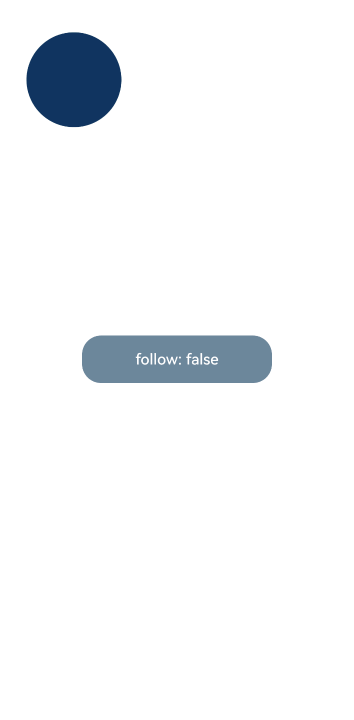

# 组件内隐式共享元素转场 (geometryTransition)
<!--Kit: ArkUI-->
<!--Subsystem: ArkUI-->
<!--Owner: @hehongyang3-->
<!--Designer: @chensiyi_CE-->
<!--Tester: @lxl007-->
<!--Adviser: @ge-yafang-->

在视图切换过程中提供丝滑的上下文衔接过渡。通用transition机制提供了opacity、scale等转场效果。geometryTransition通过安排绑定的in/out组件（in指新视图、out指旧视图）的frame、position，使得原本独立的transition动画在空间位置上发生联系，将视觉焦点由旧视图位置引导到新视图位置。in/out组件需要配合transition使用，以保证组件离场不被立即析构并提供转场效果；若不配合transition使用，out组件离场时将被立即析构，共享元素转场动画可能无法正常呈现。

> **说明：**
>
> 从API version 7开始支持，从API version 10开始生效。后续版本如有新增内容，则采用上角标单独标记该内容的起始版本。
>
[geometryTransition](ts-transition-animation-geometrytransition.md)必须配合[animateTo](../arkts-apis-uicontext-uicontext.md#animateto)使用才有动画效果，动效时长、曲线跟随[animateTo](../arkts-apis-uicontext-uicontext.md#animateto)中的配置。参与转场的组件需设置[transition](ts-transition-animation-component.md#transition)以保证组件离场时不会被立即析构，从而使共享元素转场动画能够正常播放。不支持[animation](ts-animatorproperty.md)动画。

## geometryTransition

geometryTransition(id: string): T

组件内隐式共享元素转场。必须配合[animateTo](../arkts-apis-uicontext-uicontext.md#animateto)使用才有动画效果，动效时长、曲线跟随[animateTo](../arkts-apis-uicontext-uicontext.md#animateto)中的配置，不支持[animation](ts-animatorproperty.md)动画。geometryTransition会同步圆角，但仅限于geometryTransition绑定处，不会操作容器内部子组件的borderRadius。

**系统能力：** SystemCapability.ArkUI.ArkUI.Full

**原子化服务API：** 从API version 11开始，该接口支持在原子化服务中使用。

**参数：**

| 参数名  | 类型                 | 必填 | 说明                                                     |
| ------- | ------------------------ | ---- | ------------------------------------------------------------ |
| id      | string                   | 是   | 用于设置绑定关系，id置空字符串清除绑定关系避免参与共享行为，id可更换重新建立绑定关系。同一个id只能有两个组件绑定，且分别作为in（新视图）和out（旧视图）两种不同类型角色，不能多个组件绑定同一个id。 |

**返回值：**

| 类型 | 说明 |
| -------- | -------- |
| T | 返回当前组件，用于链式调用。 |

## geometryTransition<sup>11+</sup>

geometryTransition(id: string, options?: GeometryTransitionOptions): T

组件内隐式共享元素转场。

**原子化服务API：** 从API version 12开始，该接口支持在原子化服务中使用。

**模型约束：** 此接口仅可在Stage模型下使用。

**系统能力：** SystemCapability.ArkUI.ArkUI.Full

**参数：**

| 参数名  | 类型                 | 必填 | 说明                                                     |
| ------- | ------------------------ | ---- | ------------------------------------------------------------ |
| id      | string                   | 是   | 用于设置绑定关系，id置空字符串清除绑定关系避免参与共享行为，id可更换重新建立绑定关系。同一个id只能有两个组件绑定，且分别作为in（新视图）和out（旧视图）两种不同类型角色，不能多个组件绑定同一个id。 |
| options | [GeometryTransitionOptions](#geometrytransitionoptions11) | 否   | 组件内隐式共享元素转场动画参数，需配合[animateTo](../arkts-apis-uicontext-uicontext.md#animateto)使用才有动画效果。<br>默认值为 { follow: false }。                                    |

**返回值：**

| 类型 | 说明 |
| -------- | -------- |
| T | 返回当前组件，用于链式调用。 |

## GeometryTransitionOptions<sup>11+</sup>

**原子化服务API：** 从API version 12开始，该接口支持在原子化服务中使用。

**模型约束：** 此接口仅可在Stage模型下使用。

**系统能力：** SystemCapability.ArkUI.ArkUI.Full

| 名称 | 类型 | 只读 | 可选 | 说明                                                   |
| ------ | -------- | -------- | ---- | ------------------------------------------------------------ |
| follow | boolean  | 否 | 是   | 仅用于if范式下标记始终在组件树上的组件是否跟随共享元素转场。if范式是指在build()方法中使用if条件语句控制组件显隐的声明式UI开发模式。true表示跟随共享元素转场，false表示不跟随共享元素转场。<br>默认值：false |

## 示例

### 示例1（if else范式下的共享元素实现）

该示例主要演示if else范式下的共享元素效果集成。

```ts
// xxx.ets
@Entry
@Component
struct Index {
  @State isShow: boolean = false;

  build() {
    Stack({ alignContent: Alignment.Center }) {
      if (this.isShow) {
        // 图片使用Resource资源，需用户自定义
        Image($r('app.media.pic'))
          .autoResize(false)
          .clip(true)
          .width(300)
          .height(400)
          .offset({ y: 100 })
          .geometryTransition('picture')
          .transition(TransitionEffect.OPACITY)
      } else {
        // geometryTransition此处绑定的是容器，那么容器内的子组件需设为相对布局跟随父容器变化，
        // 套多层容器为了说明相对布局约束传递
        Column() {
          Column() {
            // 图片使用Resource资源，需用户自定义
            Image($r('app.media.icon'))
              .width('100%').height('100%')
          }.width('100%').height('100%')
        }
        .width(80)
        .height(80)
        // geometryTransition会同步圆角，但仅限于geometryTransition绑定处，此处绑定的是容器
        // 则对容器本身有圆角同步而不会操作容器内部子组件的borderRadius
        .borderRadius(20)
        .clip(true)
        .geometryTransition('picture')
        // transition保证组件离场不被立即析构，可设置其他转场效果
        .transition(TransitionEffect.OPACITY)
      }
    }
    .onClick(() => {
      this.getUIContext().animateTo({ duration: 1000 }, () => {
        this.isShow = !this.isShow;
      });
    })
  }
}
```


### 示例2（if范式下使用follow实现跟随效果）

该示例主要演示if范式下使用follow参数实现不下树的组件的跟随效果。

```ts
// xxx.ets
const FOLLOW_TRUE_ID: string = 'follow_true_id';
const FOLLOW_FALSE_ID: string = 'follow_false_id';

@Entry
@Component
struct Index {
  @State isFollow: boolean = false;
  @State isShow: boolean = false;
  @State geometryId: string = '';

  @Builder
  myBuilder() {
    Column() {
      Column()
        .backgroundColor('#ff663399')
        .size({ width: 100, height: 100 })
        .position({ x: 200, y: 500 })
        .borderRadius(25)
        .clip(true)
        .geometryTransition(this.geometryId)
        .transition(TransitionEffect.OPACITY)
    }
    .size({ width: '100%', height: '100%' })
    .backgroundColor("#33000000")
    .transition(TransitionEffect.OPACITY)
  }

  build() {
    Stack() {
      if (this.isFollow) {
        Column()
          .backgroundColor('#ff103460')
          .size({ width: 100, height: 100 })
          .position({ x: 30, y: 30 })
          .borderRadius(50)
          // follow为true时，一镜到底转场期间该组件会下树做跟随效果
          .geometryTransition(FOLLOW_TRUE_ID, { follow: true })
          .transition(TransitionEffect.OPACITY)
      } else {
        Column()
          .backgroundColor('#ff103460')
          .size({ width: 100, height: 100 })
          .position({ x: 30, y: 30 })
          .borderRadius(50)
          // follow为false时，一镜到底转场期间该组件会留在原地不做跟随
          .geometryTransition(FOLLOW_FALSE_ID, { follow: false })
          .transition(TransitionEffect.OPACITY)
      }

      Button('follow: ' + (this.isFollow ? 'true' : 'false'))
        .onClick(() => {
          this.isFollow = !this.isFollow;
          this.geometryId = this.isFollow ? FOLLOW_TRUE_ID : FOLLOW_FALSE_ID;
        })
        .size({ width: 200, height: 50 })
        .backgroundColor('#ff6b879b')
    }
    .size({ width: '100%', height: '100%' })
    .bindContentCover(this.isShow, this.myBuilder(), {
      // 模态页面实现一镜到底动效时，需要设置modalTransition为ModalTransition.NONE
      modalTransition: ModalTransition.NONE,
      onWillDismiss: () => {
        // 侧滑关闭模态页面时，通过animateTo创造动画环境实现一镜到底动效
        this.getUIContext().animateTo({ duration: 350 }, () => {
          this.isShow = !this.isShow;
        });
      }
    })
    .onClick(() => {
      // 点击弹出模态页
      this.getUIContext().animateTo({ duration: 350 }, () => {
        this.isShow = !this.isShow;
      });
    })
  }
}
```

