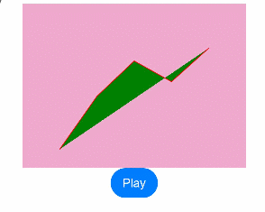

# \@AnimatableExtend装饰器：定义可动画属性

@AnimatableExtend装饰器用于自定义可动画的属性方法，在这个属性方法中修改组件不可动画的属性。开发指南见[\@AnimatableExtend](../../../ui/state-management/arkts-animatable-extend.md)。

> **说明：**
>
> - 该装饰器从API version 10开始支持。后续版本的新增接口，采用上角标单独标记接口的起始版本。

**原子化服务API：** 从API version 11开始，该接口支持在原子化服务中使用。

**系统能力：** SystemCapability.ArkUI.ArkUI.Full

**示例：**

```ts
@AnimatableExtend(Text)
function animatableWidth(width: number) {
  .width(width)
}

@Entry
@Component
struct AnimatablePropertyExample {
  @State textWidth: number = 80;

  build() {
    Column() {
      Text('AnimatableProperty')
        .animatableWidth(this.textWidth)
        .animation({ duration: 2000, curve: Curve.Ease })
      Button('Play')
        .onClick(() => {
          this.textWidth = this.textWidth == 80 ? 160 : 80;
        })
    }.width('100%')
    .padding(10)
  }
}
```

## AnimatableArithmetic\<T\>

该接口定义非number数据类型的动画运算规则。对非number类型的数据（如数组、结构体、颜色等）做动画，需要实现AnimatableArithmetic\<T\>接口中加法、减法、乘法和判断相等函数，
使得该数据能参与动画的插值运算和识别该数据是否发生改变。即定义它们为实现了AnimatableArithmetic\<T\>接口的类型。

**原子化服务API：** 从API version 11开始，该接口支持在原子化服务中使用。

**系统能力：** SystemCapability.ArkUI.ArkUI.Full

### plus

plus(rhs: AnimatableArithmetic\<T\>): AnimatableArithmetic\<T\>

定义数据类型的加法运算规则。

**原子化服务API：** 从API version 11开始，该接口支持在原子化服务中使用。

**系统能力：** SystemCapability.ArkUI.ArkUI.Full

**参数：**

| 参数名   | 类型                                | 必填 | 说明                                    |
| ----- | --------------------------------- | ---- | ------------------------------------- |
| rhs | [AnimatableArithmetic\<T\>](#animatablearithmetict) | 是    | 加法运算的对象。                           |

**返回值：**

| 类型                                       | 说明      |
| ---------------------------------------- | ------- |
| [AnimatableArithmetic\<T\>](#animatablearithmetict) | 加法运算的结果。  |

### subtract

subtract(rhs: AnimatableArithmetic\<T\>): AnimatableArithmetic\<T\>

定义该数据类型的减法运算规则。

**原子化服务API：** 从API version 11开始，该接口支持在原子化服务中使用。

**系统能力：** SystemCapability.ArkUI.ArkUI.Full

**参数：**

| 参数名   | 类型                                | 必填 | 说明                                    |
| ----- | --------------------------------- | ---- | ------------------------------------- |
| rhs | [AnimatableArithmetic\<T\>](#animatablearithmetict) | 是    | 减法运算的对象。                           |

**返回值：**

| 类型                                       | 说明      |
| ---------------------------------------- | ------- |
| [AnimatableArithmetic\<T\>](#animatablearithmetict) | 减法运算的结果。  |

### multiply

multiply(scale: number): AnimatableArithmetic\<T\>

定义该数据类型的乘法运算规则。

**原子化服务API：** 从API version 11开始，该接口支持在原子化服务中使用。

**系统能力：** SystemCapability.ArkUI.ArkUI.Full

**参数：**

| 参数名   | 类型                                | 必填 | 说明                                    |
| ----- | --------------------------------- | ---- | ------------------------------------- |
| scale | number | 是    | 乘法运算的系数。                           |

**返回值：**

| 类型                                       | 说明      |
| ---------------------------------------- | ------- |
| [AnimatableArithmetic\<T\>](#animatablearithmetict) | 乘法运算的结果。  |

### equals

equals(rhs: AnimatableArithmetic\<T\>): boolean

定义该数据类型的相等判断规则。

**原子化服务API：** 从API version 11开始，该接口支持在原子化服务中使用。

**系统能力：** SystemCapability.ArkUI.ArkUI.Full

**参数：**

| 参数名   | 类型                                | 必填 | 说明                                    |
| ----- | --------------------------------- | ---- | ------------------------------------- |
| rhs | [AnimatableArithmetic\<T\>](#animatablearithmetict) | 是    |  和自身比较相等的另一个数据对象。                          |

**返回值：**

| 类型                                       | 说明      |
| ---------------------------------------- | ------- |
| boolean | 是否相等。返回true表示相等，返回false表示不相等。  |

## 示例

### 示例1（逐帧布局的效果）

以下示例通过改变Text组件宽度实现逐帧布局的效果。

```ts
@AnimatableExtend(Text)
function animatableWidth(width: number) {
  .width(width)
}

@Entry
@Component
struct AnimatablePropertyExample {
  @State textWidth: number = 80;

  build() {
    Column() {
      Text('AnimatableProperty')
        .animatableWidth(this.textWidth)
        .animation({ duration: 2000, curve: Curve.Ease })
      Button('Play')
        .onClick(() => {
          this.textWidth = this.textWidth == 80 ? 160 : 80;
        })
    }.width('100%')
    .padding(10)
  }
}
```


### 示例2（折线的动画效果）

以下示例实现折线的动画效果。

```ts
class Point {
  x: number
  y: number

  constructor(x: number, y: number) {
    this.x = x
    this.y = y
  }

  plus(rhs: Point): Point {
    return new Point(this.x + rhs.x, this.y + rhs.y);
  }

  subtract(rhs: Point): Point {
    return new Point(this.x - rhs.x, this.y - rhs.y);
  }

  multiply(scale: number): Point {
    return new Point(this.x * scale, this.y * scale);
  }

  equals(rhs: Point): boolean {
    return this.x === rhs.x && this.y === rhs.y;
  }
}

// PointVector实现了AnimatableArithmetic<T>接口
class PointVector extends Array<Point> implements AnimatableArithmetic<PointVector> {
  constructor(value: Array<Point>) {
    super();
    value.forEach(p => this.push(p));
  }

  plus(rhs: PointVector): PointVector {
    let result = new PointVector([]);
    const len = Math.min(this.length, rhs.length);
    for (let i = 0; i < len; i++) {
      result.push((this as Array<Point>)[i].plus((rhs as Array<Point>)[i]));
    }
    return result;
  }

  subtract(rhs: PointVector): PointVector {
    let result = new PointVector([]);
    const len = Math.min(this.length, rhs.length);
    for (let i = 0; i < len; i++) {
      result.push((this as Array<Point>)[i].subtract((rhs as Array<Point>)[i]));
    }
    return result;
  }

  multiply(scale: number): PointVector {
    let result = new PointVector([]);
    for (let i = 0; i < this.length; i++) {
      result.push((this as Array<Point>)[i].multiply(scale));
    }
    return result;
  }

  equals(rhs: PointVector): boolean {
    if (this.length != rhs.length) {
      return false;
    }
    for (let i = 0; i < this.length; i++) {
      if (!(this as Array<Point>)[i].equals((rhs as Array<Point>)[i])) {
        return false;
      }
    }
    return true;
  }

  get(): Array<Object[]> {
    let result: Array<Object[]> = [];
    this.forEach(p => result.push([p.x, p.y]));
    return result;
  }
}

@AnimatableExtend(Polyline)
function animatablePoints(points: PointVector) {
  .points(points.get())
}

@Entry
@Component
struct AnimatablePropertyExample {
  @State points: PointVector = new PointVector([
    new Point(50, Math.random() * 200),
    new Point(100, Math.random() * 200),
    new Point(150, Math.random() * 200),
    new Point(200, Math.random() * 200),
    new Point(250, Math.random() * 200),
  ])

  build() {
    Column() {
      Polyline()
        .animatablePoints(this.points)
        .animation({ duration: 1000, curve: Curve.Ease })// 设置动画参数
        .size({ height: 220, width: 300 })
        .fill(Color.Green)
        .stroke(Color.Red)
        .backgroundColor('#eeaacc')
      Button('Play')
        .onClick(() => {
          // points是实现了可动画协议的数据类型，points在动画过程中可按照定义的运算规则、动画参数从之前的PointVector变为新的PointVector数据，产生每一帧的PointVector数据，进而产生动画
          this.points = new PointVector([
            new Point(50, Math.random() * 200),
            new Point(100, Math.random() * 200),
            new Point(150, Math.random() * 200),
            new Point(200, Math.random() * 200),
            new Point(250, Math.random() * 200),
          ]);
        })
    }.width('100%')
    .padding(10)
  }
}
```
