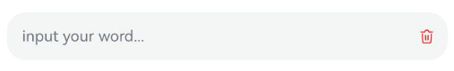

# 动态SymbolGlyphModifier属性设置

<!--Kit: ArkUI-->
<!--Subsystem: ArkUI-->
<!--Owner: @hddgzw-->
<!--Designer: @xiangyuan6-->
<!--Tester: @jiaoaozihao-->
<!--Adviser: @Brilliantry_Rui-->

SymbolGlyphModifier用于动态设置SymbolGlyph组件的属性和样式，支持使用if/else语句根据条件动态调整组件样式，适用于需要根据应用状态或用户交互动态改变图标外观的场景。[SymbolGlyph](./ts-basic-components-symbolGlyph.md)是一个用于展示图标符号的组件。

>  **说明：**
>
> - 从API version 12开始支持。后续版本的新增接口，采用上角标单独标记接口的起始版本。
>
> - 本模块接口仅可在Stage模型下使用。

## SymbolGlyphModifier

定义SymbolGlyphModifier。

**原子化服务API：** 从API version 12开始，该接口支持在原子化服务中使用。

**系统能力：** SystemCapability.ArkUI.ArkUI.Full

### constructor

constructor(src?: Resource)

SymbolGlyphModifier的构造函数。

**原子化服务API：** 从API version 12开始，该接口支持在原子化服务中使用。

**系统能力：** SystemCapability.ArkUI.ArkUI.Full

**参数：**

| 参数名  | 类型                              | 必填 | 说明   |
| ------- | --------------------------------- | ---- | --------------------------------- |
| src | [Resource](./ts-types.md#resource) | 否   | 设置SymbolGlyph组件要展示的符号图标资源。不传入时不加载任何资源。 |

### applyNormalAttribute

applyNormalAttribute?(instance: SymbolGlyphAttribute): void

组件在普通状态（即未被按下、未获得焦点等默认交互状态）下的样式设置。该方法为回调方法，在组件处于普通状态时由框架自动调用，开发者可在方法体内通过修改instance对象的属性来动态设置SymbolGlyph组件的样式。

**原子化服务API：** 从API version 12开始，该接口支持在原子化服务中使用。

**系统能力：** SystemCapability.ArkUI.ArkUI.Full

**参数：**

| 参数名  | 类型                              | 必填 | 说明   |
| ------- | --------------------------------- | ---- | --------------------------------- |
| instance | [SymbolGlyphAttribute](./ts-basic-components-symbolGlyph.md) | 是   | SymbolGlyphAttribute对象实例，用于动态设置SymbolGlyph组件的属性和样式。 |

## 示例

该示例通过[SymbolGlyphModifier](#symbolglyphmodifier)和TextInput组件的[cancelButton](./ts-basic-components-textinput.md#cancelbutton18)属性展示了自定义右侧symbol类型清除按钮样式的效果。

```ts
import { SymbolGlyphModifier } from '@kit.ArkUI';

// xxx.ets
@Entry
@Component
struct Index {
  @State text: string = '';
  symbolGlyphModifier: SymbolGlyphModifier =
    new SymbolGlyphModifier($r('sys.symbol.trash')).fontColor([Color.Red]).fontSize(16).fontWeight(FontWeight.Regular);

  build() {
    Column() {
      TextInput({ text: this.text, placeholder: 'input your word...' })
        .height(50)
        .cancelButton({
          style: CancelButtonStyle.CONSTANT,
          icon: this.symbolGlyphModifier // 从API version 18开始支持SymbolGlyph类型
        })
    }.margin(10)
  }
}
```

