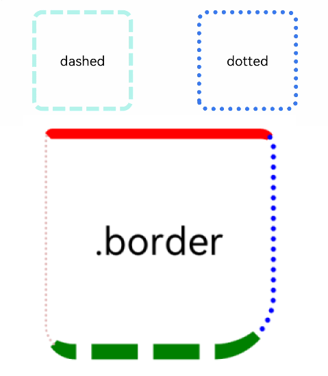
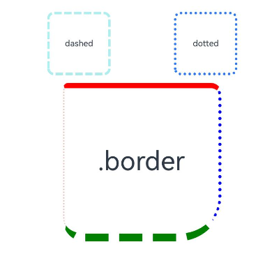
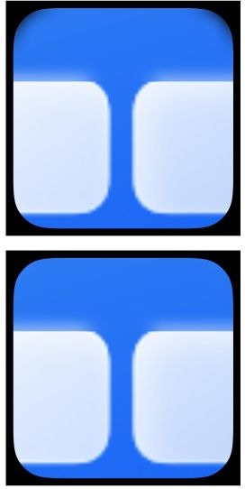

# 边框设置
<!--Kit: ArkUI-->
<!--Subsystem: ArkUI-->
<!--Owner: @zju_ljz-->
<!--Designer: @lanshouren-->
<!--Tester: @liuli0427-->
<!--Adviser: @Brilliantry_Rui-->

设置组件边框样式。

>  **说明：**
>
>  从API version 7开始支持。后续版本的新增接口，采用上角标单独标记接口的起始版本。
>

## border

border(value: BorderOptions): T

设置边框样式。

**卡片能力：** 从API version 9开始，该接口支持在ArkTS卡片中使用。

**原子化服务API：** 从API version 11开始，该接口支持在原子化服务中使用。

**系统能力：** SystemCapability.ArkUI.ArkUI.Full

**参数：** 

| 参数名 | 类型                                    | 必填 | 说明                                                         |
| ------ | --------------------------------------- | ---- | ------------------------------------------------------------ |
| value  | [BorderOptions](./ts-types.md#borderoptions) | 是   | 统一边框样式设置接口。<br>**说明：** <br>边框宽度默认值为0，即不显示边框。边框圆角半径默认值为0，即不显示圆角。边框颜色默认值为Color.Black。<br>从API version 9开始，父节点的border显示在子节点内容之上。<br>color、radius缺省时，为了保证[borderColor](#bordercolor)、[borderRadius](#borderradius)生效，需要将[borderColor](#bordercolor)、[borderRadius](#borderradius)设置在[border](#border)后。 |

**返回值：**

| 类型 | 说明 |
| --- | --- |
|  T | 返回当前组件，用于链式调用。 |


>  **说明：**
>
>  color、radius缺省时，为了保证[borderColor](#bordercolor)、[borderRadius](#borderradius)生效，需要将[borderColor](#bordercolor)、[borderRadius](#borderradius)设置在[border](#border)后。

## borderStyle

borderStyle(value: BorderStyle | EdgeStyles): T

设置元素的边框线条样式。

**卡片能力：** 从API version 9开始，该接口支持在ArkTS卡片中使用。

**原子化服务API：** 从API version 11开始，该接口支持在原子化服务中使用。

**系统能力：** SystemCapability.ArkUI.ArkUI.Full

**参数：** 

| 参数名 | 类型                                                         | 必填 | 说明                                               |
| ------ | ------------------------------------------------------------ | ---- | -------------------------------------------------- |
| value  | [BorderStyle](ts-appendix-enums.md#borderstyle)&nbsp;\|&nbsp;[EdgeStyles](./ts-types.md#edgestyles9)<sup>9+</sup> | 是   | 设置元素的边框样式。<br>默认值：BorderStyle.Solid |

**返回值：**

| 类型 | 说明 |
| --- | --- |
|  T | 返回当前组件，用于链式调用。 |

## borderWidth

borderWidth(value: Length | EdgeWidths | LocalizedEdgeWidths): T

设置边框的宽度。

**卡片能力：** 从API version 9开始，该接口支持在ArkTS卡片中使用。

**原子化服务API：** 从API version 11开始，该接口支持在原子化服务中使用。

**系统能力：** SystemCapability.ArkUI.ArkUI.Full

**参数：** 

| 参数名 | 类型                                                         | 必填 | 说明                               |
| ------ | ------------------------------------------------------------ | ---- | ---------------------------------- |
| value  | [Length](ts-types.md#length)&nbsp;\|&nbsp;[EdgeWidths](./ts-types.md#edgewidths9)<sup>9+</sup>&nbsp;\|&nbsp;[LocalizedEdgeWidths](./ts-types.md#localizededgewidths12)<sup>12+</sup> | 是   | 设置元素的边框宽度，不支持百分比。默认单位：vp。<br>默认值：0。<br>**说明：** 使用LocalizedEdgeWidths类型时，在不同语言方向下边框宽度设置会有差异，具体参见示例2。 |

**返回值：**

| 类型 | 说明 |
| --- | --- |
|  T | 返回当前组件，用于链式调用。 |

## borderColor

borderColor(value: ResourceColor | EdgeColors | LocalizedEdgeColors): T

设置边框的颜色。

> **说明：**
>
> 当使用border统一设置边框且color参数缺省时，需将borderColor设置在border之后调用才能生效。

**卡片能力：** 从API version 9开始，该接口支持在ArkTS卡片中使用。

**原子化服务API：** 从API version 11开始，该接口支持在原子化服务中使用。

**系统能力：** SystemCapability.ArkUI.ArkUI.Full

**参数：** 

| 参数名 | 类型                                                         | 必填 | 说明                                         |
| ------ | ------------------------------------------------------------ | ---- | -------------------------------------------- |
| value  | [ResourceColor](ts-types.md#resourcecolor)&nbsp;\|&nbsp;[EdgeColors](./ts-types.md#edgecolors9)<sup>9+</sup>&nbsp;\|&nbsp;[LocalizedEdgeColors](./ts-types.md#localizededgecolors12)<sup>12+</sup> | 是   | 设置元素的边框颜色，设置后边框显示为相应颜色。<br>默认值：Color.Black<br>**说明：** <br>使用LocalizedEdgeColors类型时，在不同语言方向下边框颜色设置会有差异，具体参见示例2。 |

**返回值：**

| 类型 | 说明 |
| --- | --- |
|  T | 返回当前组件，用于链式调用。 |

## borderRadius

borderRadius(value: Length | BorderRadiuses | LocalizedBorderRadiuses): T

设置边框的圆角半径。

> **说明：**
>
> 当使用border统一设置边框且radius参数缺省时，需将borderRadius设置在border之后调用才能生效。

**卡片能力：** 从API version 9开始，该接口支持在ArkTS卡片中使用。

**原子化服务API：** 从API version 11开始，该接口支持在原子化服务中使用。

**系统能力：** SystemCapability.ArkUI.ArkUI.Full

**参数：** 

| 参数名 | 类型                                                         | 必填 | 说明                                   |
| ------ | ------------------------------------------------------------ | ---- | -------------------------------------- |
| value  | [Length](ts-types.md#length)&nbsp;\|&nbsp;[BorderRadiuses](./ts-types.md#borderradiuses9)<sup>9+</sup>&nbsp;\|&nbsp;[LocalizedBorderRadiuses](./ts-types.md#localizedborderradiuses12)<sup>12+</sup> | 是   | 设置元素的边框圆角半径，支持百分比，百分比依据组件宽度，默认单位：vp。<br>默认值：0。设置圆角后，可搭配[clip](./ts-universal-attributes-sharp-clipping.md#clip12)属性进行裁剪，避免子组件超出组件自身。<br>**说明：** <br>使用LocalizedBorderRadiuses类型时，在不同语言方向下边框圆角半径设置会有差异，具体参见示例2。<br>设置四个不同圆角值，若某个圆角值超过高度和宽度中的最小值的一半时，按值的比例绘制异形圆角，效果参见示例4。|

**返回值：**

| 类型 | 说明 |
| --- | --- |
|  T | 返回当前组件，用于链式调用。 |

## borderRadius<sup>22+</sup>

borderRadius(value: Length | BorderRadiuses | LocalizedBorderRadiuses, type?: RenderStrategy): T

设置边框的圆角半径和绘制圆角的模式。

> **说明：**
>
> 当使用border统一设置边框且radius参数缺省时，需将borderRadius设置在border之后调用才能生效。

**卡片能力：** 从API version 22开始，该接口支持在ArkTS卡片中使用。

**原子化服务API：** 从API version 22开始，该接口支持在原子化服务中使用。

**模型约束：** 此接口仅可在Stage模型下使用。

**系统能力：** SystemCapability.ArkUI.ArkUI.Full

**参数：** 

| 参数名 | 类型                                                         | 必填 | 说明                                   |
| ------ | ------------------------------------------------------------ | ---- | -------------------------------------- |
| value  | [Length](ts-types.md#length)&nbsp;\|&nbsp;[BorderRadiuses](./ts-types.md#borderradiuses9)&nbsp;\|&nbsp;[LocalizedBorderRadiuses](./ts-types.md#localizedborderradiuses12) | 是   | 设置元素的边框圆角半径，支持百分比，百分比依据组件宽度，默认单位：vp。<br>默认值：0。设置圆角后，可搭配[clip](./ts-universal-attributes-sharp-clipping.md#clip12)属性进行裁剪，避免子组件超出组件自身。<br>**说明：** <br>使用LocalizedBorderRadiuses类型时，在不同语言方向下边框圆角半径设置会有差异，具体参见示例2。<br>设置四个不同圆角值，若某个圆角值超过高度和宽度中的最小值的一半时，按值的比例绘制异形圆角，效果参见示例4。|
| type  | [RenderStrategy](ts-appendix-enums.md#renderstrategy22) | 否   |设置组件绘制圆角的模式。<br>默认值：RenderStrategy.FAST。<br>可选值：<br>- RenderStrategy.FAST：快速绘制模式，适用于常规圆角场景，性能更优。若组件包含模糊等复杂视觉效果，使用该模式可能导致圆角裁剪异常。<br>- RenderStrategy.OFFSCREEN：离屏绘制模式，适用于包含模糊等复杂视觉效果的圆角场景，可正确渲染圆角但性能开销较大。|

**返回值：**

| 类型 | 说明 |
| --- | --- |
|  T | 返回当前组件，用于链式调用。 |

## 示例

### 示例1（基本样式用法）

设置边框的宽度、颜色、圆角半径以及点、线样式。

```ts
// xxx.ets
@Entry
@Component
struct BorderExample {
  build() {
    Column() {
      Flex({ justifyContent: FlexAlign.SpaceAround, alignItems: ItemAlign.Center }) {
        // 虚线
        Text('dashed')
          .borderStyle(BorderStyle.Dashed)
          .borderWidth(5)
          .borderColor(0xAFEEEE)
          .borderRadius(10)
          .width(120)
          .height(120)
          .textAlign(TextAlign.Center)
          .fontSize(16)
        // 点线
        Text('dotted')
          .border({
            width: 5,
            color: 0x317AF7,
            radius: 10,
            style: BorderStyle.Dotted
          })
          .width(120)
          .height(120)
          .textAlign(TextAlign.Center)
          .fontSize(16)
      }.width('100%').height(150)

      Text('.border')
        .fontSize(50)
        .width(300)
        .height(300)
        // 使用border属性分别设置左、右、上、下四边的宽度、颜色、圆角和样式
        .border({
          width: {
            left: 3,
            right: 6,
            top: 10,
            bottom: 15
          },
          color: {
            left: '#e3bbbb',
            right: Color.Blue,
            top: Color.Red,
            bottom: Color.Green
          },
          radius: {
            topLeft: 10,
            topRight: 20,
            bottomLeft: 40,
            bottomRight: 80
          },
          style: {
            left: BorderStyle.Dotted,
            right: BorderStyle.Dotted,
            top: BorderStyle.Solid,
            bottom: BorderStyle.Dashed
          }
        })
        .textAlign(TextAlign.Center)
    }
  }
}
```



### 示例2（边框宽度、圆角半径和颜色类型）

border属性的width、radius、color属性值分别使用LocalizedEdgeWidths类型、LocalizedBorderRadiuses类型和LocalizedEdgeColors类型。

```ts
// xxx.ets
import { LengthMetrics } from '@kit.ArkUI';

@Entry
@Component
struct BorderExample {
  build() {
    Column() {
      Flex({ justifyContent: FlexAlign.SpaceAround, alignItems: ItemAlign.Center }) {
        // 虚线
        Text('dashed')
          .borderStyle(BorderStyle.Dashed)
          .borderWidth(5)
          .borderColor(0xAFEEEE)
          .borderRadius(10)
          .width(120)
          .height(120)
          .textAlign(TextAlign.Center)
          .fontSize(16)
        // 点线
        Text('dotted')
          .border({
            width: 5,
            color: 0x317AF7,
            radius: 10,
            style: BorderStyle.Dotted
          })
          .width(120)
          .height(120)
          .textAlign(TextAlign.Center)
          .fontSize(16)
      }.width('100%').height(150)

      Text('.border')
        .fontSize(50)
        .width(300)
        .height(300)
        // 使用LocalizedEdgeWidths和LocalizedBorderRadiuses类型，start/end方向适配RTL/LTR布局
        .border({
          width: {
            start: LengthMetrics.vp(3),
            end: LengthMetrics.vp(6),
            top: LengthMetrics.vp(10),
            bottom: LengthMetrics.vp(15)
          },
          color: {
            start: '#e3bbbb',
            end: Color.Blue,
            top: Color.Red,
            bottom: Color.Green
          },
          radius: {
            topStart: LengthMetrics.vp(10),
            topEnd: LengthMetrics.vp(20),
            bottomStart: LengthMetrics.vp(40),
            bottomEnd: LengthMetrics.vp(80)
          },
          style: {
            left: BorderStyle.Dotted,
            right: BorderStyle.Dotted,
            top: BorderStyle.Solid,
            bottom: BorderStyle.Dashed
          }
        })
        .textAlign(TextAlign.Center)
    }
  }
}
```

从左至右（LTR）显示语言示例图



从右至左（RTL）显示语言示例图


### 示例3（设置离屏圆角）

从API version 22开始，该示例支持设置组件绘制圆角的模式。

```ts
// xxx.ets
@Entry
@Component
struct RenderStrategyExample {
  build() {
    NavDestination() {
      Column({ space: 20 }) {
        // 快速绘制模式：适用于常规圆角场景，性能更优
        Stack() {
          Column()
            .width(320)
            .height(320)
            .backgroundColor(Color.Black)

          Stack() {
            Stack() {
              Scroll(new Scroller()) {
                Image($r('app.media.startIcon'))
                  .width('100%')
                  .height('200%')
              }

              Column()
                .blur(50) // 设置模糊效果
                .width(300)
                .height(100)
                .position({ x: 0, y: 0 })
            }
          }
          .width(300)
          .height(300)
          .backgroundColor(Color.Pink)
          .borderRadius(50, RenderStrategy.FAST) // 设置快速绘制模式圆角
          .clip(true)
        }

        // 离屏绘制模式：适用于包含模糊效果的圆角场景，可避免裁剪异常
        Stack() {
          Column()
            .width(320)
            .height(320)
            .backgroundColor(Color.Black)

          Stack() {
            Stack() {
              Scroll(new Scroller()) {
                Image($r('app.media.startIcon'))
                  .width('100%')
                  .height('200%')
              }

              Column()
                .blur(50) // 设置模糊效果
                .width(300)
                .height(100)
                .position({ x: 0, y: 0 })
            }
          }
          .width(300)
          .height(300)
          .backgroundColor(Color.Pink)
          .borderRadius(50, RenderStrategy.OFFSCREEN) // 设置离屏绘制模式圆角
          .clip(true)
        }
      }
    }
    .width('100%')
    .height('100%')
  }
}
```

快速绘制模式（RenderStrategy.FAST）通过GPU硬件加速进行实时绘制，适用于普通圆角场景；离屏绘制模式（RenderStrategy.OFFSCREEN）将组件先绘制到离屏缓冲区再合成，适用于包含模糊、滚动等复杂内容的圆角场景，可避免圆角裁剪异常。设置在线绘制模式（上方）以及离屏绘制模式（下方）的示例图如下：



### 示例4（设置异形圆角）

该示例通过[borderRadius](#borderradius)设置四个不同圆角值。当其中一个圆角值超过高度或宽度最小值的一半时，按值的比例绘制异形圆角。

```ts
// xxx.ets
@Entry
@Component
struct BorderExample {
  build() {
    Column() {
      Flex({ justifyContent: FlexAlign.SpaceAround, alignItems: ItemAlign.Center }) {
        Text('Text')
          .borderWidth(5)
          .borderColor(0xAFEEEE)
          // topLeft: 2000超过最小值(100)的一半，按值的比例绘制异形圆角
          .borderRadius({
            topLeft: 2000,
            topRight: 10,
            bottomLeft: 30,
            bottomRight: 50
          })
          .width(100)
          .height(100)
          .textAlign(TextAlign.Center)
          .fontSize(16)
      }
    }
  }
}
```

