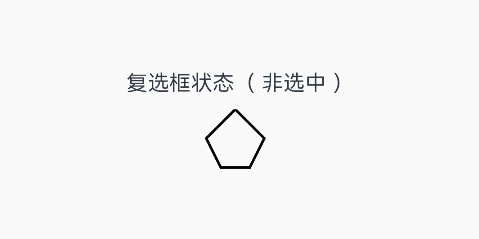

# 自定义内容
<!--Kit: ArkUI-->
<!--Subsystem: ArkUI-->
<!--Owner: @liyi0309; @liyujie43-->
<!--Designer: @liyi0309; @weixin_52725220-->
<!--Tester: @lxl007; @xiong0104-->
<!--Adviser: @Brilliantry_Rui-->

支持通过样式builder自定义特定组件的内容区。

> **说明：**
>
> - 本模块同时支持ArkTS-Dyn、ArkTS-Sta。
> - 从API version 12开始支持。后续版本如有新增内容，则采用上角标单独标记该内容的起始版本。

## ContentModifier\<T>

开发者需要自定义class实现ContentModifier接口。

### applyContent

ArkTS-Dyn: applyContent(): WrappedBuilder<[T]>

ArkTS-Sta: applyContent(): WrappedBuilder<CustomBuilderT\<T\>>

定制内容区的Builder。

**原子化服务API（仅ArkTS-Dyn）：** 从API version 12开始，该接口支持在原子化服务中使用。

**系统能力：** SystemCapability.ArkUI.ArkUI.Full

**ArkTS-Dyn起始版本：** 12

**ArkTS-Sta起始版本：** 23

**返回值：**

| 类型                                                         | 说明                                                         |
| ------------------------------------------------------------ | ------------------------------------------------------------ |
| ArkTS-Dyn: [WrappedBuilder](../../../ui/state-management/arkts-wrapBuilder.md)<[T]><br/>ArkTS-Sta: [WrappedBuilder](../../../ui/state-management/arkts-wrapBuilder.md)<[CustomBuilderT\<T\>](./ts-types.md#custombuildertt23)>  | 返回封装带参builder函数的WrappedBuilder对象 |

**T参数支持范围:**

ButtonConfiguration、CheckBoxConfiguration、CheckBoxGroupConfiguration、DataPanelConfiguration、TextClockConfiguration、TextTimerConfiguration、ToggleConfiguration、GaugeConfiguration、LoadingProgressConfiguration、MenuItemConfiguration、RadioConfiguration、ProgressConfiguration、RatingConfiguration、SliderConfiguration

**属性支持范围:**

支持通用属性enabled，contentModifier。
## CommonConfiguration\<T\><sup>12+</sup>对象说明

开发者需要自定义class实现ContentModifier接口。

**原子化服务API（仅ArkTS-Dyn）：** 从API version 12开始，该接口支持在原子化服务中使用。

**系统能力：** SystemCapability.ArkUI.ArkUI.Full

**ArkTS-Dyn起始版本：** 12

**ArkTS-Sta起始版本：** 23

| 名称 | 类型    | 只读  | 可选  | 说明              |
| ------ | ------ | ---------------- | ---------------- | ---------------- |
| enabled | boolean | 否 | 否 | 如果该值为true，则contentModifier可用，并且可以响应triggerChange等操作，如果设置为false，则不会响应triggerChange等操作。 |
| contentModifier | [ContentModifier\<T>](#contentmodifiert) | 否 | 否 | 用于将用户需要的组件信息发送到自定义内容区。 |


## 示例

通过ContentModifier实现自定义复选框样式的功能，用一个五边形复选框替换原本Checkbox的样式。如果选中，内部会出现红色三角图案，标题会显示选中字样；如果取消选中，红色三角图案消失，标题会显示非选中字样。

ArkTS-Dyn示例：
```ts
// xxx.ets
class MyCheckboxStyle implements ContentModifier<CheckBoxConfiguration> {
  selectedColor: Color = Color.White;

  constructor(selectedColor: Color) {
    this.selectedColor = selectedColor;
  }

  applyContent(): WrappedBuilder<[CheckBoxConfiguration]> {
    return wrapBuilder(buildCheckbox);
  }
}

@Builder
function buildCheckbox(config: CheckBoxConfiguration) {
  Column({ space: 10 }) {
    Text(config.name + (config.selected ? "（选中）" : "（非选中）"))
    Shape() {
      // 五边形复选框样式
      Path()
        .width(200)
        .height(60)
        .commands('M100 0 L0 100 L50 200 L150 200 L200 100 Z')
        .fillOpacity(0)
        .strokeWidth(3)
      // 红色三角图案样式
      Path()
        .width(10)
        .height(10)
        .commands('M50 0 L100 100 L0 100 Z')
        .visibility(config.selected ? Visibility.Visible : Visibility.Hidden)
        .fill(config.selected ? (config.contentModifier as MyCheckboxStyle).selectedColor : Color.Black)
        .stroke((config.contentModifier as MyCheckboxStyle).selectedColor)
        .margin({ left: 11, top: 10 })
    }
    .width(300)
    .height(200)
    .viewPort({
      x: 0,
      y: 0,
      width: 310,
      height: 310
    })
    .strokeLineJoin(LineJoinStyle.Miter)
    .strokeMiterLimit(5)
    .onClick(() => {
      // 点击后，触发复选框点击状态变化
      if (config.selected) {
        config.triggerChange(false);
      } else {
        config.triggerChange(true);
      }
    })
    .margin({ left: 150 })
  }
}

@Entry
@Component
struct Index {
  build() {
    Row() {
      Column() {
        Checkbox({ name: '复选框状态', group: 'checkboxGroup' })
          .select(true)
          .contentModifier(new MyCheckboxStyle(Color.Red))
          .onChange((value: boolean) => {
            console.info('Checkbox change is' + value);
          })
      }
      .width('100%')
    }
    .height('100%')
  }
}
```

ArkTS-Sta示例：
```ts
// xxx.ets

import { Text, Column, Component, Button, ClickEvent, Color, Checkbox, Entry, Builder, WrappedBuilder, ContentModifier, wrapBuilder, CheckBoxConfiguration,
  Shape, Path, LineJoinStyle, Row, Visibility } from '@ohos.arkui.component';
import { State } from '@ohos.arkui.stateManagement';

// 此处需要新声明一个类型
type CheckboxBuiler = @Builder (config: CheckBoxConfiguration) => void

class MyCheckboxStyle implements ContentModifier<CheckBoxConfiguration> {
  selectedColor: Color = Color.White;

  constructor(selectedColor: Color) {
    this.selectedColor = selectedColor;
  }

  applyContent(): WrappedBuilder<CheckboxBuiler> {
    return wrapBuilder(buildCheckbox);
  }
}

@Builder
function buildCheckbox(config: CheckBoxConfiguration) {
  Column(undefined) {
    Text(config.name + (config.selected ? '（选中）' : '（非选中）'))
    Shape() {
      Path()
        .width(200)
        .height(60)
        .commands('M100 0 L0 100 L50 200 L150 200 L200 100 Z')
        .fillOpacity(0)
        .strokeWidth(3)
      Path()
        .width(10)
        .height(10)
        .commands('M50 0 L100 100 L0 100 Z')
        .visibility(config.selected ? Visibility.Visible : Visibility.Hidden)
        .fill(config.selected ? (config.contentModifier as MyCheckboxStyle).selectedColor : Color.Black)
        .stroke((config.contentModifier as MyCheckboxStyle).selectedColor)
    }
    .width(300)
    .height(200)
    .viewPort({
      x: 0,
      y: 0,
      width: 310,
      height: 310
    })
    .strokeLineJoin(LineJoinStyle.Miter)
    .strokeMiterLimit(5)
    .onClick((e: ClickEvent) => {
      if (config.selected) {
        config.triggerChange(false);
      } else {
        config.triggerChange(true);
      }
    })
  }
}

@Entry
@Component
struct Index {
  build() {
    Row() {
      Column() {
        Checkbox({ name: '复选框状态', group: 'checkboxGroup' })
          .select(true)
          .contentModifier(new MyCheckboxStyle(Color.Red))
          .onChange((value: boolean) => {
            console.info('Checkbox change is' + value);
          })
      }
      .width('100%')
    }
    .height('100%')
  }
}

```


