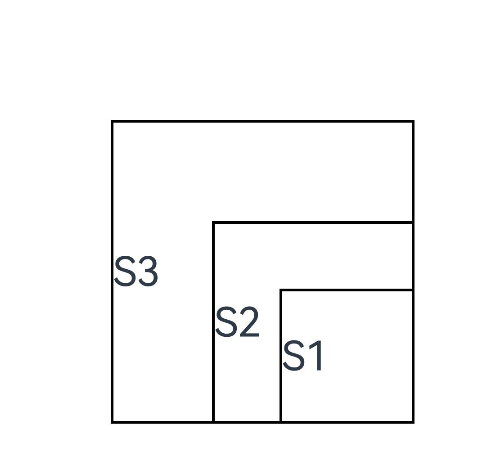

# 自定义属性设置
<!--Kit: ArkUI-->
<!--Subsystem: ArkUI-->
<!--Owner: @wangyang2022-->
<!--Designer: @wangyang2022; @jiyujia926-->
<!--Tester: @sally__; @songyanhong-->
<!--Adviser: @Brilliantry_Rui-->

当开发者希望在组件上设置自定义的属性时，可以使用自定义属性设置功能。这些自定义属性可以在其对应的FrameNode上获取，从而实现更自由的组件管理。

>  **说明：**
>
>  从API version 12开始支持。后续版本如有新增内容，则采用上角标单独标记该内容的起始版本。

## customProperty

ArkTS-Dyn: customProperty(name: string, value: Optional\<Object>): T

ArkTS-Sta: customProperty(name: string, value: CustomProperty): this

设置组件的自定义属性。

API版本26.0.0之前，[自定义组件](../../../ui/state-management/arkts-create-custom-components.md)不支持设置自定义属性。

从API版本26.0.0开始，自定义组件支持设置并读取自定义属性。

**原子化服务API：** 从API version 12开始，该接口支持在原子化服务中使用。

**系统能力：** SystemCapability.ArkUI.ArkUI.Full

**ArkTS-Dyn起始版本：** 12

**ArkTS-Sta起始版本：** 23

**参数：** 

| 参数名 | 类型                                                 | 必填 | 说明                                                         |
| ------ | ---------------------------------------------------- | ---- | ------------------------------------------------------------ |
| name  | string | 是   | 自定义属性的名称。 |
| value  | ArkTS-Dyn: [Optional](#optionalt)\<Object><br/>ArkTS-Sta: [CustomProperty](#customproperty23) | 是   | 自定义属性的值。 |

**返回值：**

| 类型 | 说明 |
| --- | --- |
| ArkTS-Dyn: T<br/>ArkTS-Sta: this | 返回当前组件。 |

## CustomProperty<sup>23+</sup>

type CustomProperty = undefined | null | Object | Record\<string, CustomProperty> | Array\<CustomProperty>

自定义属性的值。

**ArkTS模式：** 该接口仅适用于ArkTS-Sta。

**系统能力：** SystemCapability.ArkUI.ArkUI.Full

**ArkTS-Sta起始版本：** 23

| 类型 |说明   |
| ------ | ------------------- |
| Object | 自定义属性Object类型。|
| undefined \| null | 自定义属性值为undefined或null。 |
| Record\<string, CustomProperty> \| Array\<CustomProperty>| 自定义属性类型为`Record<string, CustomProperty>`，表示键为字符串、值为CustomProperty类型的对象。|

## Optional\<T>

type Optional\<T> = T | undefined

定义可选类型，其值可以是undefined。

**原子化服务API：** 从API version 12开始，该接口支持在原子化服务中使用。

**系统能力：** SystemCapability.ArkUI.ArkUI.Full

**卡片能力：** 从API version 12开始，该接口支持在ArkTS卡片中使用。

**ArkTS-Dyn起始版本：** 12

**ArkTS-Sta起始版本：** 23

| 类型 | 说明                       |
| ---- | -------------------------- |
| T | 表示该类型声明的对象是自定义类型。 |
| undefined | 表示该类型声明的对象是undefined。 |

## 示例

### 示例1（系统组件设置自定义属性）

在[Column](ts-container-column.md)组件上设置自定义属性，并在其对应的[FrameNode](../js-apis-arkui-frameNode.md#framenode-1)上获取所设置的自定义属性。

```ts
// xxx.ets
import { FrameNode, UIContext } from '@kit.ArkUI';

@Entry
@Component
struct CustomPropertyExample {
  build() {
    Column() {
      Text('text')
      Button('print').onClick(() => {
        // 获取Column对应的frameNode节点并查询设置的自定义属性
        const uiContext: UIContext = this.getUIContext();
        if (uiContext) {
          const node: FrameNode | null = uiContext.getFrameNodeById("Test_Column") || null;
          if (node) {
            for (let i = 1; i < 4; i++) {
              const key = 'customProperty' + i;
              const property = node.getCustomProperty(key);
              console.info(key, JSON.stringify(property));
            }
          }
        }
      })
    }
    .id('Test_Column')
    // 设置Column组件的自定义属性
    .customProperty('customProperty1', {
      'number': 10,
      'string': 'this is a string',
      'bool': true,
      'object': {
        'name': 'name',
        'value': 100
      }
    })
    .customProperty('customProperty2', {})
    .customProperty('customProperty3', undefined)
    .width('100%')
    .height('100%')
  }
}
```

### 示例2（自定义组件设置自定义属性）

从API版本26.0.0开始，自定义组件支持通过[customProperty](#customproperty)接口设置自定义属性。本示例以[自定义组件的自定义布局](../../../ui/state-management/arkts-page-custom-components-layout.md)场景为例，在自定义组件上设置自定义属性，并在其[onMeasureSize](ts-custom-component-layout.md#onmeasuresize10)回调中获取所设置的自定义属性。

```ts
// xxx.ets
@Entry
@Component
struct Index {
  build() {
    Column() {
      CustomLayout({ builder: columnChildren })
        .customProperty('width', 100) // 为自定义组件设置自定义属性
        .customProperty('height', 400)
    }
  }
}

// 通过builder的方式传递多个组件，作为自定义组件的一级子组件（即不包含容器组件，如Column）
@Builder
function columnChildren() {
  ForEach([1, 2, 3], (index: number) => {
    Text('S' + index)
      .fontSize(30)
      .width(100)
      .height(100)
      .borderWidth(2)
      .offset({ x: 10, y: 20 })
  })
}

@Component
struct CustomLayout {
  @Builder
  doNothingBuilder() {
  };

  @BuilderParam builder: () => void = this.doNothingBuilder;
  @State startSize: number = 100;
  result: SizeResult = {
    width: 0,
    height: 0
  };

  // 计算各子组件的大小
  onMeasureSize(selfLayoutInfo: GeometryInfo, children: Array<Measurable>, constraint: ConstraintSizeOptions) {
    let size = 100;
    children.forEach((child) => {
      let result: MeasureResult = child.measure({ minHeight: size, minWidth: size, maxWidth: size, maxHeight: size })
      size += result.width / 2;
    })
    let frameNode = this.getUIContext().getFrameNodeByUniqueId(this.getUniqueId());
    // 通过getCustomProperty获取设置的自定义属性
    // this.result在该用例中代表自定义组件本身的大小，onMeasureSize方法返回的是组件自身的尺寸
    this.result.width = (frameNode?.getCustomProperty('width') as number) ?? 50;
    this.result.height = (frameNode?.getCustomProperty('height') as number) ?? 50;
    return this.result;
  }
  // 放置各子组件的位置
  onPlaceChildren(selfLayoutInfo: GeometryInfo, children: Array<Layoutable>, constraint: ConstraintSizeOptions) {
    let startPos = 300;
    children.forEach((child) => {
      let pos = startPos - child.measureResult.height;
      child.layout({ x: pos, y: pos })
    })
  }

  build() {
    this.builder()
  }
}
```


