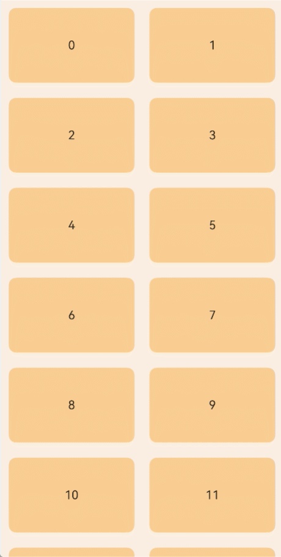
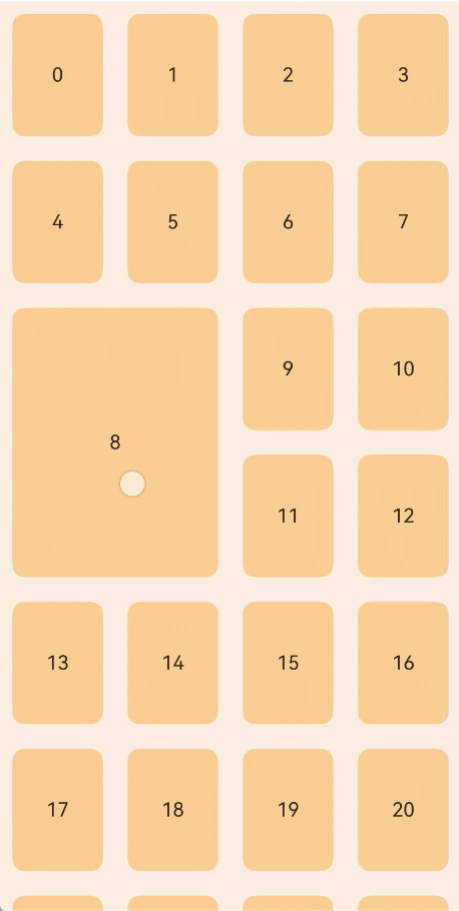
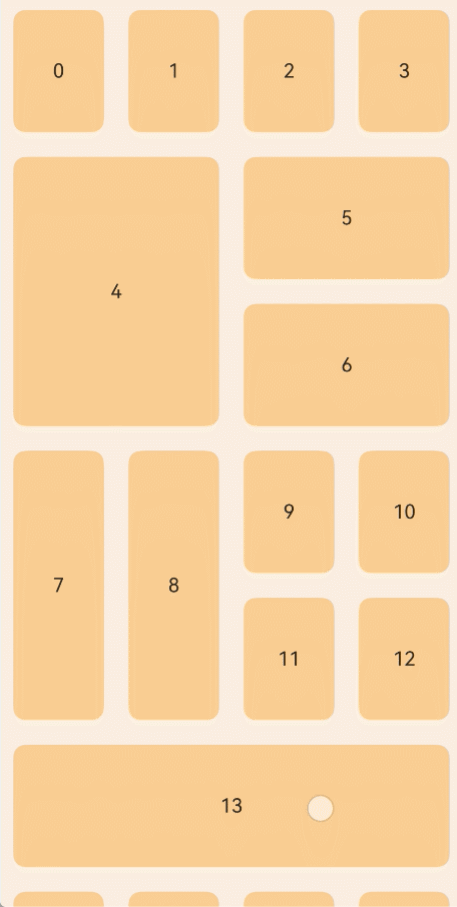
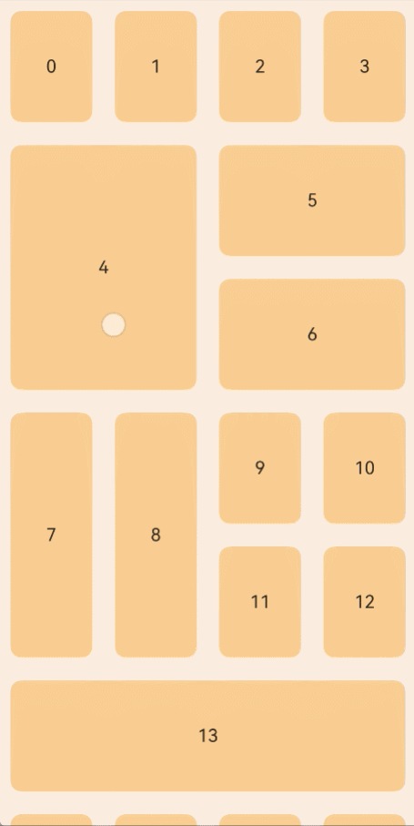

# 拖拽排序

<!--Kit: ArkUI-->
<!--Subsystem: ArkUI-->
<!--Owner: @yylong; @rongShao-Z; @wind_-->
<!--Designer: @yylong-->
<!--Tester: @leiyuqian-->
<!--Adviser: @Brilliantry_Rui-->

在List或Grid组件下使用ForEach/LazyForEach/Repeat，并设置onMove事件，每次迭代生成一个ListItem或GridItem时，可以使能拖拽排序。拖拽排序离手后，如果数据位置发生变化，将触发onMove事件，上报数据移动原始索引号和目标索引号。在onMove事件中，需要根据上报的起始索引号和目标索引号修改数据源。确保数据仅顺序发生变化，才能正常执行落位动画。

> **说明：**
> 
> - 本模块同时支持ArkTS-Dyn、ArkTS-Sta。
>
> - 从API version 12开始支持。后续版本如有新增内容，则采用上角标单独标记该内容的起始版本。
>
> - 从API版本26.0.0开始，Grid支持onMove拖拽排序。当前Grid仅在可滚动场景下支持onMove拖拽排序。当Grid存在跨行跨列GridItem时，如果下一个要放置的GridItem无法完全放下当前行时，会往下找一行，直到能放置为止。所以在Grid存在跨行跨列GridItem时进行拖拽排序，可能拖拽后的新布局会存在一些空隙，可重新拖拽调整GridItem位置，使之空隙填满。
>
> - Grid设置跨行跨列节点时应使用[GridLayoutOptions](ts-container-grid.md#gridlayoutoptions10对象说明)实现，在onMove事件里，应用侧应同步修改相应的不规则节点信息与拖拽后的新布局保持一致。具体可参考[示例4（Grid不规则布局使用ForEach的onMove进行拖拽，并设置拖拽事件回调）](#示例4grid不规则布局使用foreach的onmove进行拖拽并设置拖拽事件回调)、[示例5（Grid不规则布局使用LazyForEach的onMove进行拖拽，并设置拖拽事件回调）](#示例5grid不规则布局使用lazyforeach的onmove进行拖拽并设置拖拽事件回调)和[示例6（Grid不规则布局使用Repeat的onMove进行拖拽，并设置拖拽事件回调）](#示例6grid不规则布局使用repeat的onmove进行拖拽并设置拖拽事件回调)。
>
> - 本模块接口仅可在Stage模型下使用。

## onMove

ArkTS-Dyn: onMove(handler: Optional\<OnMoveHandler\>): T

ArkTS-Sta: onMove(handler: OnMoveHandler | undefined): this

拖拽排序数据移动回调。当父容器组件为[List](./ts-container-list.md)或[Grid](./ts-container-grid.md)，并且ForEach/LazyForEach/Repeat每次迭代都生成一个ListItem或GridItem组件时才生效。设置拖拽排序时可以定义不同的拖拽操作，并在响应事件发生时响应。

**原子化服务API：** 从API version 12开始，该接口支持在原子化服务中使用。

**系统能力：** SystemCapability.ArkUI.ArkUI.Full

**ArkTS-Dyn起始版本：** 12

**ArkTS-Sta起始版本：** 23

**参数：** 

| 参数名 | 类型      | 必填 | 说明       |
| ------ | --------- | ---- | ---------- |
| handler  | ArkTS-Dyn: Optional\<[OnMoveHandler](#onmovehandler)\> <br/>ArkTS-Sta: [OnMoveHandler](#onmovehandler) \| undefined | 是   | 拖拽动作。 |

**返回值：** 

| 类型      | 说明       |
| ------ | --------- |
|  ArkTS-Dyn: T<br/>ArkTS-Sta: this  | 返回当前组件。 |

## onMove<sup>20+</sup>

ArkTS-Dyn: onMove(handler: Optional\<OnMoveHandler\>, eventHandler: ItemDragEventHandler): T

ArkTS-Sta: onMove(handler: OnMoveHandler | undefined, eventHandler: ItemDragEventHandler): this

拖拽排序数据移动回调。当父容器组件为[List](./ts-container-list.md)或[Grid](./ts-container-grid.md)，并且ForEach/LazyForEach/Repeat每次迭代都生成一个ListItem或GridItem组件时才生效。设置拖拽排序时可以定义不同的拖拽操作，并在响应事件发生时响应。与[onMove](#onmove)相比，新增eventHandler参数，可以监听拖拽时上报的回调事件。

**原子化服务API：** 从API version 20开始，该接口支持在原子化服务中使用。

**系统能力：** SystemCapability.ArkUI.ArkUI.Full

**ArkTS-Dyn起始版本：** 20

**ArkTS-Sta起始版本：** 23

**参数：** 

| 参数名 | 类型      | 必填 | 说明       |
| ------ | --------- | ---- | ---------- |
| handler  | ArkTS-Dyn: [Optional](ts-universal-attributes-custom-property.md#optionalt)\<[OnMoveHandler](#onmovehandler)\> <br/>ArkTS-Sta: [OnMoveHandler](#onmovehandler) \| undefined | 是   | 拖拽动作。 |
| eventHandler  | [ItemDragEventHandler](#itemdrageventhandler20) | 是   | 拖拽发生时产生的回调。 |

**返回值：** 

| 类型      | 说明       |
| ------ | --------- |
| ArkTS-Dyn: T<br/>ArkTS-Sta: this  | 返回当前组件。 |

## OnMoveHandler

ArkTS-Dyn: type OnMoveHandler = (from: number, to: number) => void

ArkTS-Sta: type OnMoveHandler = (from: int, to: int) => void

定义数据源拖拽回调。

**原子化服务API：** 从API version 12开始，该接口支持在原子化服务中使用。

**系统能力：** SystemCapability.ArkUI.ArkUI.Full

**ArkTS-Dyn起始版本：** 12

**ArkTS-Sta起始版本：** 23

**参数：** 

| 参数名 | 类型      | 必填 | 说明       |
| ------ | --------- | ---- | ---------- |
| from  | ArkTS-Dyn: number<br/>ArkTS-Sta: int | 是   | 数据源拖拽起始索引号。取值范围是[0, 数据源长度-1]。 |
| to  | ArkTS-Dyn: number<br/>ArkTS-Sta: int | 是   | 数据源拖拽目标索引号。取值范围是[0, 数据源长度-1]。 |

## ItemDragEventHandler<sup>20+</sup>

定义数据源拖拽事件回调。用于响应不同的拖拽操作。

**原子化服务API：** 从API version 20开始，该接口支持在原子化服务中使用。

**系统能力：** SystemCapability.ArkUI.ArkUI.Full

**ArkTS-Dyn起始版本：** 20

**ArkTS-Sta起始版本：** 23

| 名称 | 类型   | 只读 | 可选 | 说明                 |
| ------ | ------ | ---- | ---- | -------------------- |
| onLongPress  |  ArkTS-Dyn: [Callback](../../apis-basic-services-kit/js-apis-base.md#callback)\<number\><br/>ArkTS-Sta: [Callback](../../apis-basic-services-kit/js-apis-base.md#callback)\<int\> | 否  | 是 | 长按时触发的回调。<br>- 参数index为长按时当前目标的索引号。 |
| onDragStart  | ArkTS-Dyn: [Callback](../../apis-basic-services-kit/js-apis-base.md#callback)\<number\><br/>ArkTS-Sta: [Callback](../../apis-basic-services-kit/js-apis-base.md#callback)\<int\> | 否   | 是 | 在页面跟手滑动开始时触发的回调。<br>- 参数index为拖拽开始时当前目标的索引号。 |
| onMoveThrough  | [OnMoveHandler](#onmovehandler) | 否   | 是 | 在页面跟手滑动过程中经过其他组件时触发的回调。 |
| onDrop  | ArkTS-Dyn: [Callback](../../apis-basic-services-kit/js-apis-base.md#callback)\<number\><br/>ArkTS-Sta: [Callback](../../apis-basic-services-kit/js-apis-base.md#callback)\<int\> | 否   | 是 | 在页面跟手滑动结束时触发的回调。<br>- 参数index为拖拽结束时当前目标的索引号。 |

## 示例

### 示例1（List使用OnMove进行拖拽）

以下示例展示了ForEach在List组件内使用时的拖拽效果。

```ts
@Entry
@Component
struct ForEachSort {
  @State arr: Array<string> = [];

  build() {
    Row() {
      List() {
        ForEach(this.arr, (item: string) => {
          ListItem() {
            Text(item.toString())
              .fontSize(16)
              .textAlign(TextAlign.Center)
              .size({height: 100, width: '100%'})
          }.margin(10)
          .borderRadius(10)
          .backgroundColor('#FFFFFFFF')
        }, (item: string) => item)
          .onMove((from:number, to:number) => {
            let tmp = this.arr.splice(from, 1);
            this.arr.splice(to, 0, tmp[0]);
          })
      }
      .width('100%')
      .height('100%')
      .backgroundColor('#FFDCDCDC')
    }
  }
  aboutToAppear(): void {
    for (let i = 0; i < 100; i++) {
      this.arr.push(i.toString());
    }
  }
}
```

### 示例2（List使用OnMove进行拖拽，并设置拖拽事件回调）

从API version 20开始，以下示例展示了ForEach在List组件设置拖拽效果后触发的回调事件。

```ts
// xxx.ets
@Entry
@Component
struct ListOnMoveExample {
  private arr: number[] = [0, 1, 2, 3, 4, 5, 6];

  build() {
    Column() {
      List({ space: 20, initialIndex: 0 }) {
        ForEach(this.arr, (item: number) => {
          ListItem() {
            Text('第一个List' + item)
              .width('100%')
              .height(80)
              .fontSize(16)
              .textAlign(TextAlign.Center)
              .borderRadius(10)
              .backgroundColor(0xFFFFFF)
          }
        }, (item: number) => item.toString())
          .onMove((from: number, to: number) => {
            let tmp = this.arr.splice(from, 1);
            this.arr.splice(to, 0, tmp[0]);
            console.info('List onMove From: ' + from);
            console.info('List onMove To: ' + to);
          },
            {
              onLongPress: (index: number) => {
                console.info('List onLongPress: ' + index);
              },
              onDrop: (index: number) => {
                console.info('List onDrop: ' + index);
              },
              onDragStart: (index: number) => {
                console.info('List onDragStart: ' + index);
              },
              onMoveThrough: (from: number, to: number) => {
                console.info('List onMoveThrough From: ' + from);
                console.info('List onMoveThrough To: ' + to);
              }
            }
          )
      }.width('90%')
      .scrollBar(BarState.Off)
    }.width('100%').height('100%').backgroundColor(0xDCDCDC).padding({ top: 5 })
  }
}
```

### 示例3（Grid规则布局使用ForEach的onMove进行拖拽，并设置拖拽事件回调）

从API版本26.0.0开始，以下示例展示了ForEach在Grid组件设置拖拽效果后触发的回调事件，Grid里全是规则的GridItem。

```ts
// xxx.ets
@Entry
@Component
struct GridOnMoveExample {
  private arr: Array<string> = [];

  build() {
    Row() {
      Grid() {
        ForEach(this.arr, (item: string) => {
          GridItem() {
            Text(item.toString())
              .fontSize(16)
              .textAlign(TextAlign.Center)
              .size({height: 100, width: '100%'})
          }.margin(10)
          .borderRadius(10)
          .backgroundColor(0xF9CF93)
        }, (item: string) => item)
          // 当拖拽松手时，被拖拽项落位位置与拖拽前不同时触发，from为起始索引，to为目标索引
          .onMove((from: number, to: number) => {
            let tmp = this.arr.splice(from, 1);  // 从原位置取出被拖拽元素
            this.arr.splice(to, 0, tmp[0]);      // 将取出的被拖拽元素插入到目标位置
            console.info('Grid onMove From: ' + from);
            console.info('Grid onMove To: ' + to);
          },
            {
              onLongPress: (index: number) => {
                // GridItem长按浮起时触发
                console.info('Grid onLongPress: ' + index);
              },
              onDrop: (index: number) => {
                // 拖拽的GridItem松手时触发
                console.info('Grid onDrop: ' + index);
              },
              onDragStart: (index: number) => {
                // GridItem长按浮起并开始拖拽时触发
                console.info('Grid onDragStart: ' + index);
              },
              onMoveThrough: (from: number, to: number) => {
                // GridItem拖拽过程中持续触发
                console.info('Grid onMoveThrough From: ' + from);
                console.info('Grid onMoveThrough To: ' + to);
              }
            }
          )
      }
      .columnsTemplate('1fr 1fr')  // 两列等宽布局
      .width('100%')
      .height('100%')
      .backgroundColor(0xFAEEE0)
    }
  }
  aboutToAppear(): void {
    // 初始化100条数据作为Grid内容
    for (let i = 0; i < 100; i++) {
      this.arr.push(i.toString())
    }
  }
}
```



### 示例4（Grid不规则布局使用ForEach的onMove进行拖拽，并设置拖拽事件回调）

从API版本26.0.0开始，以下示例展示了ForEach在Grid组件设置拖拽效果后触发的回调事件，Grid里存在不规则的GridItem。应用可通过[irregularIndexes](ts-container-grid.md#gridlayoutoptions10对象说明)设置哪些索引是不规则节点，通过修改对应索引的rectSize调整该GridItem所占的行列数。

```ts
// xxx.ets
class Rects {
  id: number = 0
  // rectSize表示该GridItem占用的[行, 列]数，默认[1, 1]为规则节点
  rectSize: [number, number] = [1, 1]
  constructor(id_: number) {
    this.id = id_
  }
}

@Entry
@Component
struct GridOnMoveExample {
  @State arr: Array<Rects> = [];

  // 网格布局选项（实际生效），声明不规则节点的索引及各自占用的行列数
  @State layoutOptions: GridLayoutOptions = {
    regularSize: [1, 1],
    irregularIndexes: [8],   // 索引为8的GridItem为不规则节点
    onGetIrregularSizeByIndex: (index: number) => {
      return this.arr[index].rectSize
    }
  };

  // 布局选项（备份），用于拖拽时通过整体赋值触发layoutOptions刷新
  layoutOptions_back: GridLayoutOptions = {
    regularSize: [1, 1],
    irregularIndexes: [8],   // 索引为8的GridItem为不规则节点
    onGetIrregularSizeByIndex: (index: number) => {
      return this.arr[index].rectSize
    }
  };

  build() {
    Row() {
      Grid(undefined, this.layoutOptions) {
        ForEach(this.arr, (item: Rects) => {
          GridItem() {
            Text(item.id.toString())
              .fontSize(16)
              .textAlign(TextAlign.Center)
              .size({ height: 100 * item.rectSize[0] + (item.rectSize[0] - 1) * 20, width: '100%'}) // 设置高度，跨行GridItem需额外增加外边距(规则GridItem的间距为2*10)用于界面对齐
          }.margin(10)
          .borderRadius(10)
          .backgroundColor(0xF9CF93)
        }, (item: Rects) => item.id.toString())
          // 当拖拽松手时，被拖拽项落位位置与拖拽前不同时触发，from为起始索引，to为目标索引
          .onMove((from:number, to:number) => {
            console.info("Grid onMove from " + from + " to " + to)
            // 更新this.arr数据源
            let tmp = this.arr.splice(from, 1);
            this.arr.splice(to, 0, tmp[0]);
            if (from < to) {  // 被拖拽项索引小于目标位置索引
              // 先保存被拖拽项在irregularIndexes数组中的位置，避免后续循环更新产生重复值后indexOf定位错误
              let from_idx = -1
              if (this.layoutOptions.irregularIndexes?.includes(from)) {
                from_idx = this.layoutOptions.irregularIndexes.indexOf(from)
              }

              // 被拖拽项与目标位置之间的元素整体前移一位（索引-1）
              if (this.layoutOptions.irregularIndexes != undefined) {
                let len = this.layoutOptions.irregularIndexes.length
                for (let i = len - 1; i >= 0; i --) {
                  let irregularIndex = this.layoutOptions.irregularIndexes[i]
                  if (irregularIndex > from && irregularIndex <= to) {
                    this.layoutOptions.irregularIndexes[i] --
                  }
                }
              }

              // 若被拖拽项本身为不规则节点，更新其索引到目标位置
              if (from_idx != -1 && this.layoutOptions.irregularIndexes != undefined) {
                this.layoutOptions.irregularIndexes[from_idx] = to
              }
            } else {  // 被拖拽项索引大于等于目标位置索引
              // 先保存被拖拽项在irregularIndexes数组中的位置，避免后续循环更新产生重复值后indexOf定位错误
              let from_idx = -1
              if (this.layoutOptions.irregularIndexes?.includes(from)) {
                from_idx = this.layoutOptions.irregularIndexes.indexOf(from)
              }

              // 目标位置至被拖拽项之间的元素整体后移一位（索引+1）
              if (this.layoutOptions.irregularIndexes != undefined) {
                let len = this.layoutOptions.irregularIndexes.length
                for (let i = 0; i < len; i ++) {
                  let irregularIndex = this.layoutOptions.irregularIndexes[i]
                  if (irregularIndex >= to && irregularIndex < from) {
                    this.layoutOptions.irregularIndexes[i] ++
                  }
                }
              }

              // 若被拖拽项本身为不规则节点，更新其索引到目标位置
              if (from_idx != -1 && this.layoutOptions.irregularIndexes != undefined) {
                this.layoutOptions.irregularIndexes[from_idx] = to
              }
            }
            // 通过备份对象整体赋值，强制layoutOptions刷新生效
            this.layoutOptions_back.irregularIndexes = this.layoutOptions.irregularIndexes
            this.layoutOptions = this.layoutOptions_back
            console.info("Grid this.layoutOptions.irregularIndexes " + this.layoutOptions.irregularIndexes)
          },
            {
              onLongPress: (index: number) => {
                // GridItem长按浮起时触发
                console.info('Grid onLongPress: ' + index);
              },
              onDrop: (index: number) => {
                // 拖拽的GridItem松手时触发
                console.info('Grid onDrop: ' + index);
              },
              onDragStart: (index: number) => {
                // GridItem长按浮起并开始拖拽时触发
                console.info('Grid onDragStart: ' + index);
              },
              onMoveThrough: (from: number, to: number) => {
                // GridItem拖拽过程中持续触发
                console.info('Grid onMoveThrough From: ' + from + ' to: ' + to);
              }
            })
      }
      .columnsTemplate('1fr 1fr 1fr 1fr')   // 四列等宽布局
      .width('100%')
      .height('100%')
      .backgroundColor(0xFAEEE0)
    }
  }
  aboutToAppear(): void {
    // 初始化100个矩形数据，并设置索引8为2x2的不规则节点
    for (let i = 0; i < 100; i++) {
      this.arr.push(new Rects(i));
    }
    this.arr[8].rectSize = [2, 2] // 2行2列
  }
}
```



### 示例5（Grid不规则布局使用LazyForEach的onMove进行拖拽，并设置拖拽事件回调）

从API版本26.0.0开始，以下示例展示了LazyForEach在Grid组件设置拖拽效果后触发的回调事件，Grid里存在不规则的GridItem。应用可通过irregularIndexes设置哪些索引是不规则节点，通过修改对应索引的rectSize调整该GridItem所占的行列数。

```ts
// RectGridDataSource.ets
export class Rects {
  id: number = 0
  // rectSize表示该GridItem占用的[行, 列]数，默认[1, 1]为规则节点
  rectSize: [number, number] = [1, 1]
  constructor(id_: number) {
    this.id = id_
  }
}

// LazyForEach的数据源，实现IDataSource接口，负责管理数据及通知UI刷新
export class RectGridDataSource implements IDataSource {
  private list: Array<Rects> = [];
  private listeners: DataChangeListener[] = [];

  constructor(list: Rects[]) {
    this.list = list;
  }

  // 返回数据总数
  totalCount(): number {
    return this.list.length;
  }

  // 根据索引获取对应的数据项
  getData(index: number): Rects {
    return this.list[index];
  }

  // 注册数据变更监听器
  registerDataChangeListener(listener: DataChangeListener): void {
    if (this.listeners.indexOf(listener) < 0) {
      this.listeners.push(listener);
    }
  }

  // 注销数据变更监听器
  unregisterDataChangeListener(listener: DataChangeListener): void {
    const pos = this.listeners.indexOf(listener);
    if (pos >= 0) {
      this.listeners.splice(pos, 1);
    }
  }

  // 通知控制器数据位置变化
  notifyDataMove(from: number, to: number): void {
    this.listeners.forEach(listener => {
      listener.onDataMove(from, to);
    })
  }

  // 重新加载所有数据
  notifyDataReload(): void {
    this.listeners.forEach(listener => {
      listener.onDataReloaded();
    })
  }

  // 将from位置的元素移动到to位置，并通知UI全部重载刷新
  public moveItem(from: number, to: number): void {
    let tmp = this.list.splice(from, 1);  // 先移除被拖拽项
    this.list.splice(to, 0, tmp[0]);      // 将被拖拽项插入到目标位置
    this.notifyDataReload()
  }
}
```

```ts
// xxx.ets
import { RectGridDataSource, Rects } from './RectGridDataSource';

@Entry
@Component
struct GridOnMoveExample {
  numbers: RectGridDataSource = new RectGridDataSource([]);

  // 网格布局选项（实际生效），声明不规则节点的索引及各自占用的行列数
  @State layoutOptions: GridLayoutOptions = {
    regularSize: [1, 1],
    irregularIndexes: [4, 5, 6, 7, 8, 13],   // 设置哪些索引对应的GridItem为不规则节点
    onGetIrregularSizeByIndex: (index: number) => {
      return this.numbers.getData(index).rectSize
    }
  };

  // 布局选项（备份），用于拖拽时通过整体赋值触发layoutOptions刷新
  layoutOptions_back: GridLayoutOptions = {
    regularSize: [1, 1],
    irregularIndexes: [4, 5, 6, 7, 8, 13],
    onGetIrregularSizeByIndex: (index: number) => {
      return this.numbers.getData(index).rectSize
    }
  };

  build() {
    Row() {
      Grid(undefined, this.layoutOptions) {
        LazyForEach(this.numbers, (item: Rects) => {
          GridItem() {
            Text(item.id.toString())
              .fontSize(16)
              .textAlign(TextAlign.Center)
              // 设置高度，跨行GridItem需额外增加外边距(规则GridItem的间距为2*10)用于界面对齐
              .size({ height: 100 * item.rectSize[0] + (item.rectSize[0] - 1) * 20, width: '100%'})
          }.margin(10)
          .borderRadius(10)
          .backgroundColor(0xF9CF93)
        }, (index: Rects) => index.id.toString())
          // 当拖拽松手时，被拖拽项落位位置与拖拽前不同时触发，from为起始索引，to为目标索引
          .onMove((from:number, to:number) => {
            console.info("Grid onMove from " + from + " to " + to)
            // 更新数据源
            this.numbers.moveItem(from, to)
            if (from < to) {  // 被拖拽项索引小于目标位置索引
              // 先保存被拖拽项在irregularIndexes数组中的位置，避免后续循环更新产生重复值后indexOf定位错误
              let from_idx = -1
              if (this.layoutOptions.irregularIndexes?.includes(from)) {
                from_idx = this.layoutOptions.irregularIndexes.indexOf(from)
              }

              // 被拖拽项与目标位置之间的元素整体前移一位（索引-1）
              if (this.layoutOptions.irregularIndexes != undefined) {
                let len = this.layoutOptions.irregularIndexes.length
                for (let i = len - 1; i >= 0; i --) {
                  let irregularIndex = this.layoutOptions.irregularIndexes[i]
                  if (irregularIndex > from && irregularIndex <= to) {
                    this.layoutOptions.irregularIndexes[i] --
                  }
                }
              }

              // 若被拖拽项本身为不规则节点，更新其索引到目标位置
              if (from_idx != -1 && this.layoutOptions.irregularIndexes != undefined) {
                this.layoutOptions.irregularIndexes[from_idx] = to
              }
            } else {  // 被拖拽项索引大于等于目标位置索引
              // 先保存被拖拽项在irregularIndexes数组中的位置，避免后续循环更新产生重复值后indexOf定位错误
              let from_idx = -1
              if (this.layoutOptions.irregularIndexes?.includes(from)) {
                from_idx = this.layoutOptions.irregularIndexes.indexOf(from)
              }

              // 目标位置至被拖拽项之间的元素整体后移一位（索引+1）
              if (this.layoutOptions.irregularIndexes != undefined) {
                let len = this.layoutOptions.irregularIndexes.length
                for (let i = 0; i < len; i ++) {
                  let irregularIndex = this.layoutOptions.irregularIndexes[i]
                  if (irregularIndex >= to && irregularIndex < from) {
                    this.layoutOptions.irregularIndexes[i] ++
                  }
                }
              }

              // 若被拖拽项本身为不规则节点，更新其索引到目标位置
              if (from_idx != -1 && this.layoutOptions.irregularIndexes != undefined) {
                this.layoutOptions.irregularIndexes[from_idx] = to
              }
            }
            // 通过备份对象整体赋值，强制layoutOptions刷新生效
            this.layoutOptions_back.irregularIndexes = this.layoutOptions.irregularIndexes
            this.layoutOptions = this.layoutOptions_back
            console.info("Grid this.layoutOptions.irregularIndexes " + this.layoutOptions.irregularIndexes)
          },
            {
              onLongPress: (index: number) => {
                // GridItem长按浮起时触发
                console.info('Grid onLongPress: ' + index);
              },
              onDrop: (index: number) => {
                // 拖拽的GridItem松手时触发
                console.info('Grid onDrop: ' + index);
              },
              onDragStart: (index: number) => {
                // GridItem长按浮起并开始拖拽时触发
                console.info('Grid onDragStart: ' + index);
              },
              onMoveThrough: (from: number, to: number) => {
                // GridItem拖拽过程中持续触发
                console.info('Grid onMoveThrough From: ' + from + ' to: ' + to);
              }
            })
      }
      .columnsTemplate('1fr 1fr 1fr 1fr')   // 四列等宽布局
      .width('100%')
      .height('100%')
      .backgroundColor(0xFAEEE0)
    }
  }

  aboutToAppear(): void {
    // 初始化100个矩形数据并设置各不规则节点的跨占尺寸
    let list: Rects[] = [];
    for (let i = 0; i < 100; i++) {
      list.push(new Rects(i));
    }
    list[4].rectSize = [2, 2] // 2行2列
    list[5].rectSize = [1, 2] // 1行2列
    list[6].rectSize = [1, 2] // 1行2列
    list[7].rectSize = [2, 1] // 2行1列
    list[8].rectSize = [2, 1] // 2行1列
    list[13].rectSize = [1, 4]  // 1行4列
    this.numbers = new RectGridDataSource(list);
  }
}
```



### 示例6（Grid不规则布局使用Repeat的onMove进行拖拽，并设置拖拽事件回调）

从API版本26.0.0开始，以下示例展示了Repeat在Grid组件设置拖拽效果后触发的回调事件，Grid里存在不规则的GridItem。应用可通过irregularIndexes设置哪些索引是不规则节点，通过修改对应索引的rectSize调整该GridItem所占的行列数。

```ts
// xxx.ets
class Rects {
  id: number = 0
  // rectSize表示该GridItem占用的[行, 列]数，默认[1, 1]为规则节点
  rectSize: [number, number] = [1, 1]
  constructor(id_: number) {
    this.id = id_
  }
}

@Entry
@ComponentV2
struct GridOnMoveExample {
  @Local arr: Array<Rects> = [];

  // 网格布局选项（实际生效），声明不规则节点的索引及各自占用的行列数
  @Local layoutOptions: GridLayoutOptions = {
    regularSize: [1, 1],
    irregularIndexes: [4, 5, 6, 7, 8, 13],   // 设置哪些索引对应的GridItem为不规则节点
    onGetIrregularSizeByIndex: (index: number) => {
      return this.arr[index].rectSize
    }
  };

  // 布局选项（备份），用于拖拽时通过整体赋值触发layoutOptions刷新
  layoutOptions_back: GridLayoutOptions = {
    regularSize: [1, 1],
    irregularIndexes: [4, 5, 6, 7, 8, 13],
    onGetIrregularSizeByIndex: (index: number) => {
      return this.arr[index].rectSize
    }
  };

  aboutToAppear(): void {
    // 初始化100个矩形数据
    for (let i = 0; i < 100; i++) {
      this.arr.push(new Rects(i));
    }
    // 设置各不规则节点的跨占尺寸
    this.arr[4].rectSize = [2, 2] // 2行2列
    this.arr[5].rectSize = [1, 2] // 1行2列
    this.arr[6].rectSize = [1, 2] // 1行2列
    this.arr[7].rectSize = [2, 1] // 2行1列
    this.arr[8].rectSize = [2, 1] // 2行1列
    this.arr[13].rectSize = [1, 4] // 1行4列
  }

  build() {
    Column() {
      Grid(undefined, this.layoutOptions) {
        Repeat<Rects>(this.arr)
        // 当拖拽松手时，被拖拽项落位位置与拖拽前不同时触发，from为起始索引，to为目标索引
          .onMove((from: number, to: number) => {
            if (from == to) {
              return
            }
            console.info("Grid onMove from " + from + " to " + to)
            // 更新this.arr数据源
            let tmp = this.arr.splice(from, 1);
            this.arr.splice(to, 0, tmp[0]);
            if (from < to) {  // 被拖拽项索引小于目标位置索引
              // 先保存被拖拽项在irregularIndexes数组中的位置，避免后续循环更新产生重复值后indexOf定位错误
              let from_idx = -1
              if (this.layoutOptions.irregularIndexes?.includes(from)) {
                from_idx = this.layoutOptions.irregularIndexes.indexOf(from)
              }

              // 被拖拽项与目标位置之间的元素整体前移一位（索引-1）
              if (this.layoutOptions.irregularIndexes != undefined) {
                let len = this.layoutOptions.irregularIndexes.length
                for (let i = len - 1; i >= 0; i --) {
                  let irregularIndex = this.layoutOptions.irregularIndexes[i]
                  if (irregularIndex > from && irregularIndex <= to) {
                    this.layoutOptions.irregularIndexes[i] --
                  }
                }
              }

              // 若被拖拽项本身为不规则节点，更新其索引到目标位置
              if (from_idx != -1 && this.layoutOptions.irregularIndexes != undefined) {
                this.layoutOptions.irregularIndexes[from_idx] = to
              }
            } else {  // 被拖拽项索引大于等于目标位置索引
              // 先保存被拖拽项在irregularIndexes数组中的位置，避免后续循环更新产生重复值后indexOf定位错误
              let from_idx = -1
              if (this.layoutOptions.irregularIndexes?.includes(from)) {
                from_idx = this.layoutOptions.irregularIndexes.indexOf(from)
              }

              // 目标位置至被拖拽项之间的元素整体后移一位（索引+1）
              if (this.layoutOptions.irregularIndexes != undefined) {
                let len = this.layoutOptions.irregularIndexes.length
                for (let i = 0; i < len; i ++) {
                  let irregularIndex = this.layoutOptions.irregularIndexes[i]
                  if (irregularIndex >= to && irregularIndex < from) {
                    this.layoutOptions.irregularIndexes[i] ++
                  }
                }
              }

              // 若被拖拽项本身为不规则节点，更新其索引到目标位置
              if (from_idx != -1 && this.layoutOptions.irregularIndexes != undefined) {
                this.layoutOptions.irregularIndexes[from_idx] = to
              }
            }
            // 通过备份对象整体赋值，强制layoutOptions刷新生效
            this.layoutOptions_back.irregularIndexes = this.layoutOptions.irregularIndexes
            this.layoutOptions = this.layoutOptions_back
            console.info("Grid this.layoutOptions.irregularIndexes " + this.layoutOptions.irregularIndexes)
          },
            {
              onLongPress: (index: number) => {
                // GridItem长按浮起时触发
                console.info('Grid onLongPress: ' + index);
              },
              onDrop: (index: number) => {
                // 拖拽的GridItem松手时触发
                console.info('Grid onDrop: ' + index);
              },
              onDragStart: (index: number) => {
                // GridItem长按浮起并开始拖拽时触发
                console.info('Grid onDragStart: ' + index);
              },
              onMoveThrough: (from: number, to: number) => {
                // GridItem拖拽过程中持续触发
                console.info('Grid onMoveThrough From: ' + from + ' to: ' + to);
              }
            })
          .each((obj: RepeatItem<Rects>) => {
            GridItem() {
              Text(obj.item.id.toString())
                .fontSize(16)
                .textAlign(TextAlign.Center)
                // 设置高度，跨行GridItem需额外增加外边距(规则GridItem的间距为2*10)用于界面对齐
                .size({ height: 100 * this.arr[obj.index].rectSize[0] + (this.arr[obj.index].rectSize[0] - 1) * 20, width: '100%' })
            }.margin(10)
            .borderRadius(10)
            .backgroundColor(0xF9CF93)
          })
          .key((item: Rects, index: number) => {
            return item.id.toString();
          })
          .virtualScroll({ totalCount: this.arr.length })   // 开启虚拟滚动，仅渲染可见项以提升性能
      }
      .columnsTemplate('1fr 1fr 1fr 1fr')   // 四列等宽布局
      .border({ width: 1 })
      .backgroundColor(0xFAEEE0)
      .width('100%')
      .height('100%')
    }
  }
}
```


