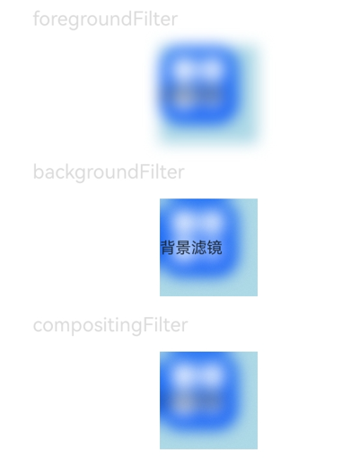

# 视效设置

本模块提供接口设置组件视觉效果，包括滤镜效果（如：模糊，像素扩展等）和非滤镜效果（如：点光源等）。

>  **说明：**
>
> - 本模块同时支持ArkTS-Dyn、ArkTS-Sta。
>
> - 从API version 12开始支持。后续版本如有新增内容，则采用上角标单独标记该内容的起始版本。

## visualEffect

ArkTS-Dyn: visualEffect(effect: VisualEffect): T

ArkTS-Sta: visualEffect(effect: VisualEffect | undefined): this

设置非滤镜视觉效果。

**原子化服务API：** 从API version 12开始，该接口支持在原子化服务中使用。

**系统能力：** SystemCapability.ArkUI.ArkUI.Full

**ArkTS-Dyn起始版本：** 12

**ArkTS-Sta起始版本：** 22

**参数：**

| 参数名 | 类型                                                         | 必填 | 说明                                                 |
| ------ | ------------------------------------------------------------ | ---- | ---------------------------------------------------- |
| effect | ArkTS-Dyn: [VisualEffect](../../apis-arkgraphics2d/js-apis-uiEffect.md#visualeffect) <br/>  ArkTS-Sta: [VisualEffect](../../apis-arkgraphics2d/js-apis-uiEffect.md#visualeffect) \| undefined| 是   | 非滤镜视觉效果。 |

**返回值：**

| 类型 | 说明 |
| -------- | -------- |
| ArkTS-Dyn: T<br/>ArkTS-Sta: this | 返回当前组件。 |

## backgroundFilter

ArkTS-Dyn: backgroundFilter(filter: Filter): T

ArkTS-Sta: backgroundFilter(filter: Filter | undefined): this

设置背景滤镜视觉效果。

**原子化服务API：** 从API version 12开始，该接口支持在原子化服务中使用。

**系统能力：** SystemCapability.ArkUI.ArkUI.Full

**ArkTS-Dyn起始版本：** 12

**ArkTS-Sta起始版本：** 22

**参数：**

| 参数名 | 类型                                                         | 必填 | 说明                                                 |
| ------ | ------------------------------------------------------------ | ---- | ---------------------------------------------------- |
| filter | ArkTS-Dyn: [Filter](../../apis-arkgraphics2d/js-apis-uiEffect.md#filter)<br/>  ArkTS-Sta: [Filter](../../apis-arkgraphics2d/js-apis-uiEffect.md#filter) \| undefined| 是   | 背景滤镜视觉效果。 |

**返回值：**

| 类型 | 说明 |
| -------- | -------- |
|  ArkTS-Dyn: T<br/>ArkTS-Sta: this  | 返回当前组件。 |

## foregroundFilter

ArkTS-Dyn: foregroundFilter(filter: Filter): T

ArkTS-Sta: foregroundFilter(filter: Filter | undefined): this

设置前景滤镜（内容）视觉效果。

**原子化服务API：** 从API version 12开始，该接口支持在原子化服务中使用。

**系统能力：** SystemCapability.ArkUI.ArkUI.Full

**ArkTS-Dyn起始版本：** 12

**ArkTS-Sta起始版本：** 22

**参数：**

| 参数名 | 类型                                                         | 必填 | 说明                                                 |
| ------ | ------------------------------------------------------------ | ---- | ---------------------------------------------------- |
| filter | ArkTS-Dyn: [Filter](../../apis-arkgraphics2d/js-apis-uiEffect.md#filter)<br/>  ArkTS-Sta: [Filter](../../apis-arkgraphics2d/js-apis-uiEffect.md#filter) \| undefined | 是   | 前景滤镜（内容）视觉效果。 |

**返回值：**

| 类型 | 说明 |
| -------- | -------- |
|  ArkTS-Dyn: T<br/>ArkTS-Sta: this | 返回当前组件。 |

## compositingFilter

ArkTS-Dyn: compositingFilter(filter: Filter): T

ArkTS-Sta: compositingFilter(filter: Filter | undefined): this

设置合成滤镜视觉效果。

**原子化服务API：** 从API version 12开始，该接口支持在原子化服务中使用。

**系统能力：** SystemCapability.ArkUI.ArkUI.Full

**ArkTS-Dyn起始版本：** 12

**ArkTS-Sta起始版本：** 22

**参数：**

| 参数名 | 类型                                                         | 必填 | 说明                                                 |
| ------ | ------------------------------------------------------------ | ---- | ---------------------------------------------------- |
| filter | ArkTS-Dyn: [Filter](../../apis-arkgraphics2d/js-apis-uiEffect.md#filter)<br/>  ArkTS-Sta: [Filter](../../apis-arkgraphics2d/js-apis-uiEffect.md#filter) \| undefined | 是   | 合成滤镜视觉效果。 |

**返回值：**

| 类型 | 说明 |
| -------- | -------- |
|  ArkTS-Dyn: T<br/>ArkTS-Sta: this  | 返回当前组件。 |

## 示例

该示例主要演示前景滤镜、背景滤镜和合成滤镜的模糊效果。

```ts
// xxx.ets
import { uiEffect } from '@kit.ArkGraphics2D';

@Entry
@Component
struct FilterEffectExample {
  @State filterTest1: uiEffect.Filter = uiEffect.createFilter().blur(10);
  @State filterTest2: uiEffect.Filter = uiEffect.createFilter().blur(10);
  @State filterTest3: uiEffect.Filter = uiEffect.createFilter().blur(10);

  build() {
    Column({ space: 15 }) {

      Text('foregroundFilter').fontSize(20).width('75%').fontColor('#DCDCDC')
      Text('前景滤镜')
        .width(100)
        .height(100)
        .backgroundColor('#ADD8E6')
        .backgroundImage($r("app.media.app_icon"))
        .backgroundImageSize({ width: 80, height: 80 })
        .foregroundFilter(this.filterTest1) // 通过 foregroundFilter 设置模糊效果

      Text('backgroundFilter').fontSize(20).width('75%').fontColor('#DCDCDC')
      Text('背景滤镜')
        .width(100)
        .height(100)
        .backgroundColor('#ADD8E6')
        .backgroundImage($r("app.media.app_icon"))
        .backgroundImageSize({ width: 80, height: 80 })
        .backgroundFilter(this.filterTest2) // 通过 backgroundFilter 设置模糊效果

      Text('compositingFilter').fontSize(20).width('75%').fontColor('#DCDCDC')
      Text('合成滤镜')
        .width(100)
        .height(100)
        .backgroundColor('#ADD8E6')
        .backgroundImage($r("app.media.app_icon"))
        .backgroundImageSize({ width: 80, height: 80 })
        .compositingFilter(this.filterTest3) // 通过 compositingFilter 设置模糊效果
    }
    .height('100%')
    .width('100%')
  }
}
```

