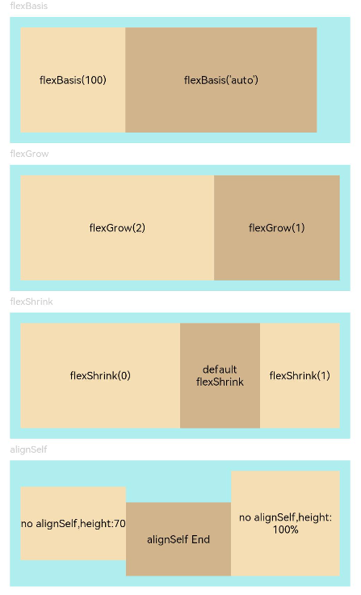

# Flex布局
<!--Kit: ArkUI-->
<!--Subsystem: ArkUI-->
<!--Owner: @camlostshi-->
<!--Designer: @lanshouren-->
<!--Tester: @liuli0427-->
<!--Adviser: @Brilliantry_Rui-->

Flex布局提供灵活的组件排列和对齐能力，可以动态分配容器内的子组件空间，使元素根据可用空间自动扩展或收缩。适用于响应式UI布局、动态内容布局、复杂布局实现等场景，能解决传统布局在多设备适配困难、内容变化导致布局错位、复杂对齐需求难以实现等问题。

>  **说明：**
>  - 从API version 7开始支持。后续版本的新增接口，采用上角标单独标记接口的起始版本。
>
>  - 仅[Flex](ts-container-flex.md)、[Column](ts-container-column.md)、[Row](ts-container-row.md)和[DynamicLayout](ts-container-dynamiclayout.md)支持下述四种属性，[GridRow](ts-container-gridrow.md)仅支持设置[alignSelf](#alignself)。

> **说明：**
>
> - **flexBasis**：设置组件的基准尺寸，作为布局的初始参考值，优先级高于width/height。
> - **flexGrow**：定义组件在父容器有剩余空间时的扩展比例，剩余空间按各组件flexGrow比例分配。
> - **flexShrink**：定义组件在父容器空间不足时的压缩比例，超出的尺寸按各组件flexShrink比例分摊。

flexBasis设定基准尺寸，flexGrow控制扩展行为，flexShrink控制压缩行为，三者可单独使用或组合使用。

## flexBasis

flexBasis(value: number | string): T

设置组件的基准尺寸。仅Flex、Column、Row和DynamicLayout容器支持此属性。设置后组件会以该基准尺寸作为初始尺寸参与布局计算。当父容器为Column、Row时，需设置主轴方向的尺寸。Column和Row在未设置主轴尺寸（width/height/size）时仍遵守默认布局行为，在主轴上自适应子组件尺寸，此时可能影响flexBasis的效果。

**卡片能力：** 从API version 9开始，该接口支持在ArkTS卡片中使用。

**原子化服务API：** 从API version 11开始，该接口支持在原子化服务中使用。

**系统能力：** SystemCapability.ArkUI.ArkUI.Full

**参数：** 

| 参数名 | 类型                       | 必填 | 说明                                                         |
| ------ | -------------------------- | ---- | ------------------------------------------------------------ |
| value  | number&nbsp;\|&nbsp;string | 是   | 设置组件在父容器主轴方向上的基准尺寸。<br>默认值：'auto'（表示组件在主轴方向上的基准尺寸为组件原本的大小）。<br>string类型：不允许设置百分比字符串。可选值：可以转化为数字的字符串（如'10'）、带长度单位的字符串（如'10px'）或'auto'。传入不符合要求的字符串时，按默认值'auto'处理。<br>number：取值范围(0,+∞)，单位为vp（virtual pixel，虚拟像素）。<br>设置异常值时，该属性按默认值'auto'处理。<br>[constraintSize](ts-universal-attributes-size.md#constraintsize)限制组件的尺寸范围，当flexBasis设置的基准尺寸超出constraintSize的限制范围时，会被constraintSize约束。 |

**返回值：**

| 类型 | 说明 |
| --- | --- |
|  T | 返回当前组件，用于链式调用。 |

## flexGrow

flexGrow(value: number): T

设置组件在父容器的剩余空间所占比例。仅Flex、Column、Row和DynamicLayout容器支持此属性。设置后组件会根据比例扩展占据剩余空间。当父容器为Column、Row时，需设置主轴方向的尺寸。Column和Row在未设置主轴尺寸（width/height/size）时仍遵守默认布局行为，在主轴上自适应子组件尺寸，此时可能影响flexGrow的剩余空间分配效果。

**卡片能力：** 从API version 9开始，该接口支持在ArkTS卡片中使用。

**原子化服务API：** 从API version 11开始，该接口支持在原子化服务中使用。

**系统能力：** SystemCapability.ArkUI.ArkUI.Full

**参数：** 

| 参数名 | 类型   | 必填 | 说明                                                         |
| ------ | ------ | ---- | ------------------------------------------------------------ |
| value  | number | 是   | 设置父容器在主轴方向（行布局为水平方向，列布局为垂直方向）上的剩余空间分配给此属性所在组件的比例。值为0表示不参与剩余空间分配，保持原有尺寸；值大于0时，按照比例分配父容器的剩余空间，值越大分配的空间越多。<br>取值范围：[0, +∞)<br>默认值：0<br>父容器为[Column](ts-container-column.md)、[Row](ts-container-row.md)时，需设置主轴方向的尺寸（[width](ts-universal-attributes-size.md#width)/[height](ts-universal-attributes-size.md#height)/[size](ts-universal-attributes-size.md#size)），否则可能影响flexGrow的剩余空间分配效果。<br>[constraintSize](ts-universal-attributes-size.md#constraintsize)限制组件的尺寸范围，当flexGrow扩展后的组件尺寸超出constraintSize的最大限制时，会被constraintSize约束。<br>设置异常值时，该属性为默认值。 |

**返回值：**

| 类型 | 说明 |
| --- | --- |
|  T | 返回当前组件，用于链式调用。 |

## flexShrink

flexShrink(value: number): T

设置父容器空间不足时，压缩尺寸分配给此属性所在组件的比例。仅Flex、Column、Row和DynamicLayout容器支持此属性。当父容器为Column、Row时，父容器需设置主轴方向的尺寸（即width/height/size），此时flexShrink才生效。Column和Row在未设置主轴尺寸（width/height/size）时仍遵守默认布局行为，在主轴上自适应子组件尺寸，此时flexShrink不生效。

>  **说明：**
>
>  使用[getInspectorByKey](ts-universal-attributes-component-id.md#getinspectorbykey9)获取flexShrink属性时，如果该节点未设置flexShrink属性，默认返回1（与Flex容器的默认值一致，与Column、Row容器的默认值0不同）。

**卡片能力：** 从API version 9开始，该接口支持在ArkTS卡片中使用。

**原子化服务API：** 从API version 11开始，该接口支持在原子化服务中使用。

**系统能力：** SystemCapability.ArkUI.ArkUI.Full

**参数：** 

<!--Table: auto; 10%; 10%; auto-->
| 参数名 | 类型   | 必填 | 说明                                                         |
| ------ | ------ | ---- | ------------------------------------------------------------ |
| value  | number | 是   | 设置父容器空间不足时，压缩尺寸分配给此属性所在组件的比例。值为0表示该组件不参与压缩；值大于0时，按照比例压缩，值越大压缩量越大。<br>父容器为[Column](ts-container-column.md)、[Row](ts-container-row.md)时，默认值：0，取值范围：[0, +∞)。<br>父容器为[Flex](ts-container-flex.md)时，默认值：1，取值范围：[0, +∞)。<br>[constraintSize](ts-universal-attributes-size.md#constraintsize)限制组件的尺寸范围。[Column](ts-container-column.md)和[Row](ts-container-row.md)即使设置了[constraintSize](ts-universal-attributes-size.md#constraintsize)，在父容器未设置主轴尺寸（[width](ts-universal-attributes-size.md#width)/[height](ts-universal-attributes-size.md#height)/[size](ts-universal-attributes-size.md#size)）时仍遵守默认布局行为，在主轴上自适应子组件尺寸，此时flexShrink不生效。<br>设置异常值时，该属性为默认值。|

**返回值：**

| 类型 | 说明 |
| --- | --- |
|  T | 返回当前组件，用于链式调用。 |

## alignSelf

alignSelf(value: ItemAlign): T

子组件在父容器交叉轴（与主轴垂直的方向）的对齐格式，设置后会覆盖父容器的alignItems设置。仅Flex、Column、Row、DynamicLayout和GridRow容器支持此属性。

**卡片能力：** 从API version 9开始，该接口支持在ArkTS卡片中使用。

**原子化服务API：** 从API version 11开始，该接口支持在原子化服务中使用。

**系统能力：** SystemCapability.ArkUI.ArkUI.Full

**参数：** 

| 参数名 | 类型                                        | 必填 | 说明                                                         |
| ------ | ------------------------------------------- | ---- | ------------------------------------------------------------ |
| value  | [ItemAlign](ts-appendix-enums.md#itemalign) | 是   | 子组件在父容器交叉轴的对齐格式，会覆盖[Flex](ts-container-flex.md)、[Column](ts-container-column.md)、[Row](ts-container-row.md)、[DynamicLayout](ts-container-dynamiclayout.md)、[GridRow](ts-container-gridrow.md)布局容器中的alignItems设置。当子组件需要与父容器中其他子组件不同的对齐方式时使用（典型场景：父容器中大部分子组件居中对齐，但某个子组件需要顶部或底部对齐；或需要为单个子组件指定特殊的对齐方式）。<br>[GridCol](./ts-container-gridcol.md)可以绑定alignSelf属性来改变它自身在交叉轴方向上的布局。<br>默认值：ItemAlign.Auto（表示继承父容器的对齐设置） |

**返回值：**

| 类型 | 说明 |
| --- | --- |
|  T | 返回当前组件，用于链式调用。 |

## 示例

通过配置flexBasis/flexGrow/flexShrink/alignSelf属性设置Flex布局。

```ts
// xxx.ets
@Entry
@Component
struct FlexExample {
  build() {
    Column({ space: 5 }) {
      Text('flexBasis').fontSize(9).fontColor(0xCCCCCC).width('90%')
      // 基于主轴的基准尺寸
      // flexBasis()值可以是字符串'auto'，表示基准尺寸是元素本来的大小，也可以是长度设置，相当于.width()/.height()
      Flex() {
        Text('flexBasis(100)')
          .flexBasis(100) // 这里表示宽度为100vp
          .height(100)
          .backgroundColor(0xF5DEB3)
          .textAlign(TextAlign.Center)
        Text(`flexBasis('auto')`)
          .flexBasis('auto') // 这里表示宽度保持原本设置的60%的宽度
          .width('60%')
          .height(100)
          .backgroundColor(0xD2B48C)
          .textAlign(TextAlign.Center)
      }.width('90%').height(120).padding(10).backgroundColor(0xAFEEEE)

      Text('flexGrow').fontSize(9).fontColor(0xCCCCCC).width('90%')
      // flexGrow()表示剩余空间分配给该元素的比例
      Flex() {
        Text('flexGrow(2)')
          .flexGrow(2) // 父容器分配给该Text的宽度为剩余宽度的2/3
          .height(100)
          .backgroundColor(0xF5DEB3)
          .textAlign(TextAlign.Center)
        Text('flexGrow(1)')
          .flexGrow(1) // 父容器分配给该Text的宽度为剩余宽度的1/3
          .height(100)
          .backgroundColor(0xD2B48C)
          .textAlign(TextAlign.Center)
      }.width('90%').height(120).padding(10).backgroundColor(0xAFEEEE)

      Text('flexShrink').fontSize(9).fontColor(0xCCCCCC).width('90%')
      // flexShrink()表示该元素的压缩比例，基于超出的总尺寸进行计算
      // 第一个text压缩比例是0，另外两个都是1，因此放不下时等比例压缩后两个，第一个不压缩
      Flex({ direction: FlexDirection.Row }) {
        Text('flexShrink(0)')
          .flexShrink(0)
          .width('50%')
          .height(100)
          .backgroundColor(0xF5DEB3)
          .textAlign(TextAlign.Center)
        Text('default flexShrink') // 默认值为1
          .width('40%')
          .height(100)
          .backgroundColor(0xD2B48C)
          .textAlign(TextAlign.Center)
        Text('flexShrink(1)')
          .flexShrink(1)
          .width('40%')
          .height(100)
          .backgroundColor(0xF5DEB3)
          .textAlign(TextAlign.Center)
      }.width('90%').height(120).padding(10).backgroundColor(0xAFEEEE)

      Text('alignSelf').fontSize(9).fontColor(0xCCCCCC).width('90%')
      // alignSelf会覆盖Flex布局容器中的alignItems设置
      Flex({ direction: FlexDirection.Row, alignItems: ItemAlign.Center }) {
        Text('no alignSelf,height:70')
          .width('33%')
          .height(70)
          .backgroundColor(0xF5DEB3)
          .textAlign(TextAlign.Center)
        Text('alignSelf End')
          .alignSelf(ItemAlign.End)
          .width('33%')
          .height(70)
          .backgroundColor(0xD2B48C)
          .textAlign(TextAlign.Center)
        Text('no alignSelf,height:100%')
          .width('34%')
          .height('100%')
          .backgroundColor(0xF5DEB3)
          .textAlign(TextAlign.Center)
      }.width('90%').height(120).padding(10).backgroundColor(0xAFEEEE)
    }.width('100%').margin({ top: 5 })
  }
}
```


