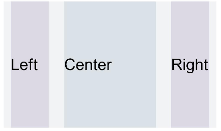
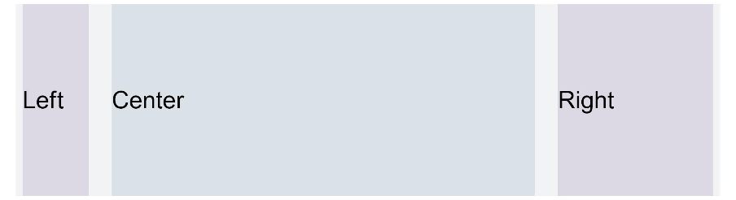
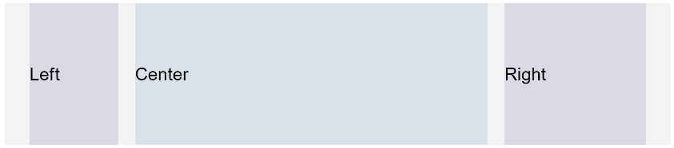

# 栅格设置
<!--Kit: ArkUI-->
<!--Subsystem: ArkUI-->
<!--Owner: @zju_ljz-->
<!--Designer: @lanshouren-->
<!--Tester: @liuli0427-->
<!--Adviser: @Brilliantry_Rui-->

栅格设置可以为布局提供规律性的结构，解决多尺寸多设备的动态布局问题，保证不同设备上各个模块的布局一致性，适用于响应式布局开发、多设备UI适配、跨设备布局统一等场景。

>  **说明：**
>
>  - 从API version 7开始支持。后续版本的新增接口，采用上角标单独标记接口的起始版本。 
>
>  - 从API version 9开始，该模块不再维护，推荐使用新组件[GridCol](ts-container-gridcol.md)、[GridRow](ts-container-gridrow.md)替代。其中useSizeType从API version 9开始废弃，gridSpan和gridOffset从API version 14开始废弃。
>
>  - 栅格布局的列宽、列间距由距离最近的[GridContainer](ts-container-gridcontainer.md)父组件决定。GridContainer用于定义栅格系统的总列数、列间距、尺寸断点等参数。使用栅格属性的组件树上至少需要有1个GridContainer容器组件。
>
>  - useSizeType、gridSpan、gridOffset属性调用时其父组件或祖先组件必须是GridContainer。

## 属性

**系统能力：** SystemCapability.ArkUI.ArkUI.Full

| 名称        | 参数类型                                                     | 描述                                                         |
| ----------- | ------------------------------------------------------------ | ------------------------------------------------------------ |
| useSizeType<sup>(deprecated) </sup> | {<br>xs?:&nbsp;number&nbsp;\|&nbsp;{&nbsp;span:&nbsp;number,&nbsp;offset:&nbsp;number&nbsp;},<br>sm?:&nbsp;number&nbsp;\|&nbsp;{&nbsp;span:&nbsp;number,&nbsp;offset:&nbsp;number&nbsp;},<br>md?:&nbsp;number&nbsp;\|&nbsp;{&nbsp;span:&nbsp;number,&nbsp;offset:&nbsp;number&nbsp;},<br>lg?:&nbsp;number&nbsp;\|&nbsp;{&nbsp;span:&nbsp;number,&nbsp;offset:&nbsp;number&nbsp;}<br>} | 设置在特定设备宽度类型下的占用列数和偏移列数，span：占用列数（需为非负整数）；offset：偏移列数。<br>当值为number类型时，仅设置列数，当格式如{"span":&nbsp;1,&nbsp;"offset":&nbsp;0}时，指同时设置占用列数与偏移列数。<br>-&nbsp;xs：指设备宽度类型为SizeType.XS（<320vp）时的占用列数和偏移列数。<br>-&nbsp;sm：指设备宽度类型为SizeType.SM（320vp-600vp）时的占用列数和偏移列数。<br>-&nbsp;md：指设备宽度类型为SizeType.MD（600vp-840vp）时的占用列数和偏移列数。<br>-&nbsp;lg：指设备宽度类型为SizeType.LG（≥840vp）时的占用列数和偏移列数。<br>各尺寸类型的详细断点配置请参见[GridContainer](ts-container-gridcontainer.md)。<br>**说明：**<br>- 调用该属性时，其父组件或祖先组件必须是GridContainer。<br>从API version 7开始支持，从API version 9开始废弃，建议使用新组件[GridCol](ts-container-gridcol.md)、[GridRow](ts-container-gridrow.md)替代。 |
| gridSpan<sup>(deprecated) </sup>    | number                   | 默认占用列数，指useSizeType属性没有设置对应尺寸的列数(span)时，占用的栅格列数，需为非负整数。<br>**说明：**<br>- 调用该属性时，其父组件或祖先组件必须是GridContainer。<br>- 设置了栅格span属性，组件的宽度由栅格布局决定。<br>默认值：1<br>**原子化服务API：** 从API version 11开始，该接口支持在原子化服务中使用。<br>从API version 7开始支持，从API version 14开始废弃，建议使用新组件[GridCol](ts-container-gridcol.md)、[GridRow](ts-container-gridrow.md)替代。  |
| gridOffset<sup>(deprecated) </sup>  | number                                                       | 默认偏移列数，指useSizeType属性没有设置对应尺寸的偏移(offset)时，当前组件沿着父组件Start方向偏移的列数，即组件起始位置相对于父组件Start方向偏移n列。当useSizeType设置了对应尺寸的offset时，gridOffset设置无效。<br>**说明：**<br>- 调用该属性时，其父组件或祖先组件必须是GridContainer。<br>- 配置该属性后，当前组件在父组件水平方向的布局不再跟随父组件原有的布局方式，而是沿着父组件的Start方向偏移一定位移。<br>- 偏移位移&nbsp;=&nbsp;（列宽&nbsp;+&nbsp;间距）\*&nbsp;偏移列数。<br>- 设置了偏移(gridOffset)的组件之后的兄弟组件会根据该组件进行相对布局。<br>默认值：0<br>**原子化服务API：** 从API version 11开始，该接口支持在原子化服务中使用。<br>从API version 7开始支持，从API version 14开始废弃，建议使用新组件[GridCol](ts-container-gridcol.md)、[GridRow](ts-container-gridrow.md)替代。 |

## 示例

设置不同设备类型下的栅格配置。gridSpan和gridOffset用于设置默认占用列数和偏移列数，仅在useSizeType未配置对应尺寸时生效。示例中useSizeType配置了sm尺寸的值（span: 2, offset: 1），若要在其他未配置的尺寸下实现相同的栅格效果，可通过gridSpan和gridOffset设置默认值。

> **说明：**
>
> 本示例展示的是已废弃接口的用法。建议使用新组件[GridCol](ts-container-gridcol.md)、[GridRow](ts-container-gridrow.md)来实现栅格布局。

<!--code_no_check-->

```ts
// xxx.ets
@Entry
@Component
struct GridContainerExample1 {
  build() {
    Column() {
      Text('useSizeType').fontSize(15).fontColor(0xCCCCCC).width('90%')
      GridContainer() {
        Row() {
          Row() {
            Text('Left').fontSize(25)
          }
          .useSizeType({
            xs: { span: 1, offset: 0 }, sm: { span: 1, offset: 0 },
            md: { span: 1, offset: 0 }, lg: { span: 2, offset: 0 }
          })
          .height("100%")
          .backgroundColor(0x66bbb2cb)

          Row() {
            Text('Center').fontSize(25)
          }
          .useSizeType({
            xs: { span: 1, offset: 0 }, sm: { span: 2, offset: 1 },
            md: { span: 5, offset: 1 }, lg: { span: 7, offset: 2 }
          })
          .height("100%")
          .backgroundColor(0x66b6c5d1)

          Row() {
            Text('Right').fontSize(25)
          }
          .useSizeType({
            xs: { span: 1, offset: 0 }, sm: { span: 1, offset: 3 },
            md: { span: 2, offset: 6 }, lg: { span: 3, offset: 9 }
          })
          .height("100%")
          .backgroundColor(0x66bbb2cb)
        }
        .height(200)

      }
      .backgroundColor(0xf1f3f5)
      .margin({ top: 10 })

      // 单独设置组件的span和offset,在sm尺寸大小的设备上使用useSizeType中sm的数据实现一样的效果
      Text('gridSpan,gridOffset').fontSize(15).fontColor(0xCCCCCC).width('90%')
      GridContainer() {
        Row() {
          Row() {
            Text('Left').fontSize(25)
          }
          .gridSpan(1)
          .height("100%")
          .backgroundColor(0x66bbb2cb)

          Row() {
            Text('Center').fontSize(25)
          }
          .gridSpan(2)
          .gridOffset(1)
          .height("100%")
          .backgroundColor(0x66b6c5d1)

          Row() {
            Text('Right').fontSize(25)
          }
          .gridSpan(1)
          .gridOffset(3)
          .height("100%")
          .backgroundColor(0x66bbb2cb)
        }.height(200)
      }
    }
  }
}
```

**图1** 设备宽度为SM



**图2** 设备宽度为MD



**图3** 设备宽度为LG



**图4** 单独设置gridSpan和gridOffset在特定屏幕大小下的效果与useSizeType效果一致

