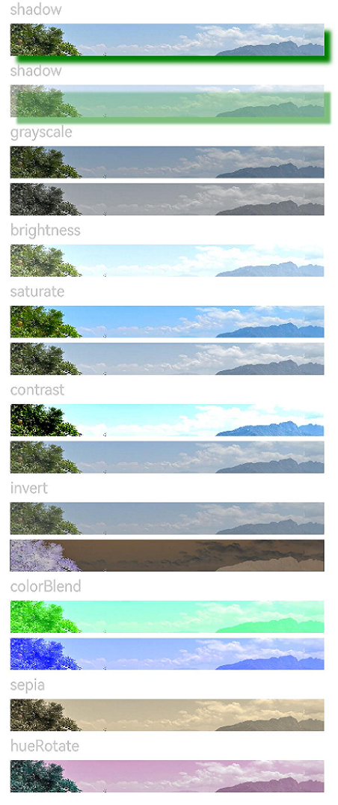
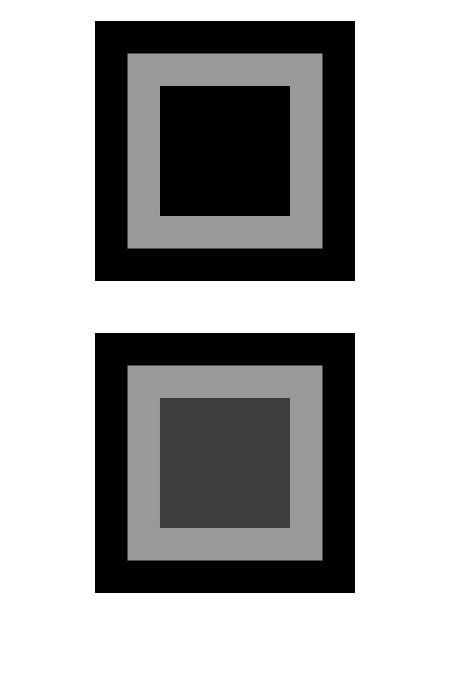
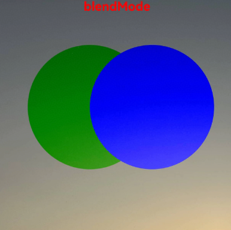
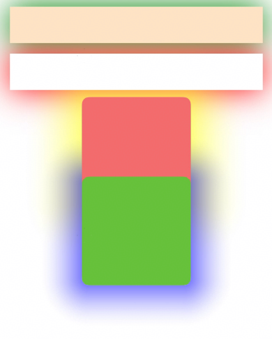
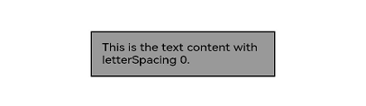
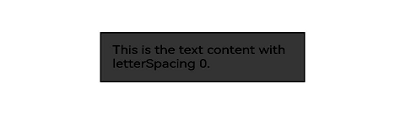
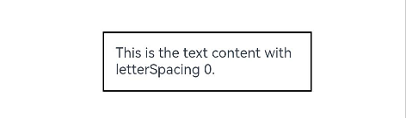
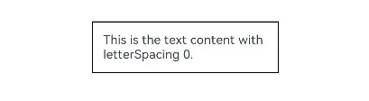
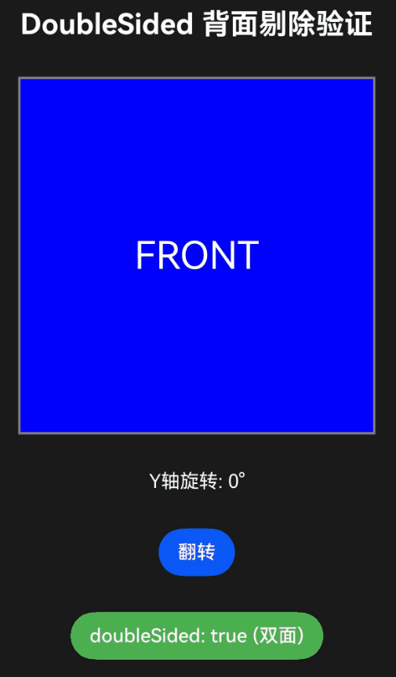

# 图像效果
<!--Kit: ArkUI-->
<!--Subsystem: ArkUI-->
<!--Owner: @hehongyang3-->
<!--Designer: @hehongyang3-->
<!--Tester: @lxl007-->
<!--Adviser: @Brilliantry_Rui-->

设置组件的模糊、阴影、球面效果以及设置图片的图像效果。

>  **说明：**
>
> - 本模块同时支持ArkTS-Dyn、ArkTS-Sta。
>
> - 从API version 7开始支持。后续版本如有新增内容，则采用上角标单独标记该内容的起始版本。

## blur

blur(value: number, options?: BlurOptions): T

为组件添加内容模糊效果。

**原子化服务API（仅ArkTS-Dyn）：** 从API version 11开始，该接口支持在原子化服务中使用。

**卡片能力（仅ArkTS-Dyn）：** 从API version 9开始，该接口支持在ArkTS卡片中使用。

**系统能力：** SystemCapability.ArkUI.ArkUI.Full

**ArkTS模式：** 该接口仅适用于ArkTS-Dyn。

**相关接口：** 该接口对应的ArkTS-Sta的接口是[blur<sup>23+</sup>](#blur23)。

**ArkTS-Dyn起始版本：** 7

**参数：** 

| 参数名                | 类型                                                         | 必填 | 说明                                                         |
| --------------------- | ------------------------------------------------------------ | ---- | ------------------------------------------------------------ |
| value                 | number                                                       | 是   | 当前组件添加内容模糊效果，入参为模糊半径，模糊半径越大越模糊，value值小于等于0时不模糊。 |
| options<sup>11+</sup> | [BlurOptions](ts-universal-attributes-foreground-blur-style.md#bluroptions11) | 否   | 灰阶模糊参数。对图像中的黑白色进行色阶调整，使其趋于灰色更为柔和美观，对图像中的彩色调整没有效果。<br/>默认值：grayscale: [0,0] |

**返回值：**

| 类型   | 说明                     |
| ------ | ------------------------ |
| T | 返回当前组件。 |

## blur<sup>18+</sup>

blur(blurRadius: Optional\<number>, options?: BlurOptions): T

为组件添加内容模糊效果。与[blur](#blur)相比，blurRadius参数新增了对undefined类型的支持。

**原子化服务API（仅ArkTS-Dyn）：** 从API version 18开始，该接口支持在原子化服务中使用。

**卡片能力（仅ArkTS-Dyn）：** 从API version 18开始，该接口支持在ArkTS卡片中使用。

**模型约束：** 此接口仅可在Stage模型下使用。

**系统能力：** SystemCapability.ArkUI.ArkUI.Full

**ArkTS模式：** 该接口仅适用于ArkTS-Dyn。

**相关接口：** 该接口对应的ArkTS-Sta的接口是[blur<sup>23+</sup>](#blur23)。

**ArkTS-Dyn起始版本：** 18

**参数：** 

| 参数名                | 类型                                                         | 必填 | 说明                                                         |
| --------------------- | ------------------------------------------------------------ | ---- | ------------------------------------------------------------ |
| blurRadius            | [Optional](ts-universal-attributes-custom-property.md#optionalt)\<number>                                            | 是   | 当前组件添加内容模糊效果，入参为模糊半径，模糊半径越大越模糊，blurRadius值小于等于0时不模糊。<br/>当blurRadius的值为undefined时，维持之前取值。从未设置该属性时，默认值为0，表示不模糊。|
| options | [BlurOptions](ts-universal-attributes-foreground-blur-style.md#bluroptions11) | 否   | 灰阶模糊参数。对图像中的黑白色进行色阶调整，使其趋于灰色更为柔和美观，对图像中的彩色调整没有效果。<br/>默认值：grayscale: [0,0] |

**返回值：**

| 类型   | 说明                     |
| ------ | ------------------------ |
| T | 返回当前组件。 |

## blur<sup>19+</sup>

blur(blurRadius: Optional\<number>, options?: BlurOptions, sysOptions?: SystemAdaptiveOptions): T

为组件添加内容模糊效果。与[blur<sup>18+</sup>](#blur18)相比，新增了sysOptions参数，即支持系统自适应调节参数。

**卡片能力（仅ArkTS-Dyn）：** 从API version 19开始，该接口支持在ArkTS卡片中使用。

**原子化服务API（仅ArkTS-Dyn）：** 从API version 19开始，该接口支持在原子化服务中使用。

**模型约束：** 此接口仅可在Stage模型下使用。

**系统能力：** SystemCapability.ArkUI.ArkUI.Full

**ArkTS模式：** 该接口仅适用于ArkTS-Dyn。

**相关接口：** 该接口对应的ArkTS-Sta的接口是[blur<sup>23+</sup>](#blur23)。

**ArkTS-Sta起始版本：** 23

**参数：** 

| 参数名                | 类型                                                         | 必填 | 说明                                                         |
| --------------------- | ------------------------------------------------------------ | ---- | ------------------------------------------------------------ |
| blurRadius            | [Optional](ts-universal-attributes-custom-property.md#optionalt)\<number>                                            | 是   | 当前组件添加内容模糊效果，入参为模糊半径，模糊半径越大越模糊，blurRadius值小于等于0时不模糊。<br/>当blurRadius的值为undefined时，维持之前取值。从未设置该属性时，默认值为0，表示不模糊。 |
| options | [BlurOptions](ts-universal-attributes-foreground-blur-style.md#bluroptions11) | 否   | 灰阶模糊参数。对图像中的黑白色进行色阶调整，使其趋于灰色更为柔和美观，对图像中的彩色调整没有效果。<br/>默认值：grayscale: [0,0]  |
| sysOptions   |  [SystemAdaptiveOptions](ts-universal-attributes-background.md#systemadaptiveoptions19)    |   否   |  系统自适应调节参数。<br/>默认值：{ disableSystemAdaptation: false }    |

**返回值：**

| 类型   | 说明                     |
| ------ | ------------------------ |
| T | 返回当前组件。 |

## blur<sup>23+</sup>

blur(blurRadius: double | undefined, options?: BlurOptions, sysOptions?: SystemAdaptiveOptions)

为组件添加内容模糊效果。

**ArkTS模式：** 该接口仅适用于ArkTS-Sta。

**相关接口：** 该接口对应的ArkTS-Dyn的接口是[blur](#blur)，[blur<sup>18+</sup>](#blur18)和[blur<sup>19+</sup>](#blur19)。

**ArkTS-Sta起始版本：** 23

**系统能力：** SystemCapability.ArkUI.ArkUI.Full

**参数：** 

| 参数名                | 类型                                                         | 必填 | 说明                                                         |
| --------------------- | ------------------------------------------------------------ | ---- | ------------------------------------------------------------ |
| blurRadius            | double \| undefined                                            | 是   | 当前组件添加内容模糊效果，入参为模糊半径，模糊半径越大越模糊，为0时不模糊。<br/>当blurRadius的值为undefined时，维持之前取值。<br/>取值范围：[0, +∞) |
| options | [BlurOptions](ts-universal-attributes-foreground-blur-style.md#bluroptions11) | 否   | 灰阶模糊参数。对图像中的黑白色进行色阶调整，使其趋于灰色更为柔和美观，对图像中的彩色调整没有效果。<br/>默认值：grayscale: [0,0]  |
| sysOptions   |  [SystemAdaptiveOptions](ts-universal-attributes-background.md#systemadaptiveoptions19)    |   否   |  系统自适应调节参数。<br/>默认值：{ disableSystemAdaptation: false }    |

## shadow

shadow(value: ShadowOptions | ShadowStyle): T

为组件添加阴影效果。

**原子化服务API（仅ArkTS-Dyn）：** 从API version 11开始，该接口支持在原子化服务中使用。

**卡片能力（仅ArkTS-Dyn）：** 从API version 9开始，该接口支持在ArkTS卡片中使用。

**系统能力：** SystemCapability.ArkUI.ArkUI.Full

**ArkTS模式：** 该接口仅适用于ArkTS-Dyn。

**相关接口：** 该接口对应的ArkTS-Sta的接口是[shadow<sup>23+</sup>](#shadow23)。

**ArkTS-Dyn起始版本：** 7

**参数：** 

| 参数名 | 类型                                                         | 必填 | 说明                                                         |
| ------ | ------------------------------------------------------------ | ---- | ------------------------------------------------------------ |
| value  | [ShadowOptions](#shadowoptions对象说明)&nbsp;\|&nbsp;[ShadowStyle](#shadowstyle10枚举说明)<sup>10+</sup> | 是   | 为当前组件添加阴影效果。<br/>入参类型为ShadowOptions时，可以指定模糊半径、阴影的颜色、X轴和Y轴的偏移量。<br/>入参类型为ShadowStyle时，可指定不同阴影样式。 |

**返回值：**

| 类型   | 说明                     |
| ------ | ------------------------ |
| T | 返回当前组件。 |

## shadow<sup>18+</sup>

shadow(options: Optional\<ShadowOptions | ShadowStyle>): T

为组件添加阴影效果。与[shadow](#shadow)相比，options参数新增了对undefined类型的支持。

**原子化服务API（仅ArkTS-Dyn）：** 从API version 18开始，该接口支持在原子化服务中使用。

**卡片能力（仅ArkTS-Dyn）：** 从API version 18开始，该接口支持在ArkTS卡片中使用。

**模型约束：** 此接口仅可在Stage模型下使用。

**系统能力：** SystemCapability.ArkUI.ArkUI.Full

**ArkTS模式：** 该接口仅适用于ArkTS-Dyn。

**相关接口：** 该接口对应的ArkTS-Sta的接口是[shadow<sup>23+</sup>](#shadow23)。

**ArkTS-Dyn起始版本：** 18

**参数：** 

| 参数名  | 类型                                                         | 必填                                                         | 说明 |
| ------- | ------------------------------------------------------------ | ------------------------------------------------------------ | ---- |
| options | [Optional](ts-universal-attributes-custom-property.md#optionalt)\<[ShadowOptions](#shadowoptions对象说明)&nbsp;\|&nbsp;[ShadowStyle](#shadowstyle10枚举说明)> | 是 |   为当前组件添加阴影效果。<br/>入参类型为ShadowOptions时，可以指定模糊半径、阴影的颜色、X轴和Y轴的偏移量。<br/>入参类型为ShadowStyle时，可指定不同阴影样式。<br/>当options的值为undefined时，恢复为无样式的阴影效果。   |

**返回值：**

| 类型   | 说明                     |
| ------ | ------------------------ |
| T | 返回当前组件。 |

## shadow<sup>23+</sup>

shadow(value: ShadowOptions | ShadowStyle | undefined)

为组件添加阴影效果。

**ArkTS模式：** 该接口仅适用于ArkTS-Sta。

**相关接口：** 该接口对应的ArkTS-Dyn的接口是[shadow](#shadow)和[shadow<sup>18+</sup>](#shadow18)。

**ArkTS-Sta起始版本：** 23

**系统能力：** SystemCapability.ArkUI.ArkUI.Full

**参数：** 

| 参数名                | 类型                                                         | 必填 | 说明                                                         |
| --------------------- | ------------------------------------------------------------ | ---- | ------------------------------------------------------------ |
| value  | [ShadowOptions](#shadowoptions对象说明)&nbsp;\|&nbsp;[ShadowStyle<sup>10+</sup>](#shadowstyle10枚举说明) \| undefined | 是   | 为当前组件添加阴影效果。<br/>入参类型为ShadowOptions时，可以指定模糊半径、阴影的颜色、X轴和Y轴的偏移量。<br/>入参类型为ShadowStyle时，可指定不同阴影样式。<br/>当value的值为undefined时，恢复为无样式的阴影效果。 |

## grayscale

grayscale(value: number): T

为组件添加灰度效果。上层渲染灰度会覆盖下层子组件渲染。不通过该接口设置时，默认无变化。

**原子化服务API（仅ArkTS-Dyn）：** 从API version 11开始，该接口支持在原子化服务中使用。

**卡片能力（仅ArkTS-Dyn）：** 从API version 9开始，该接口支持在ArkTS卡片中使用。

**系统能力：** SystemCapability.ArkUI.ArkUI.Full

**ArkTS模式：** 该接口仅适用于ArkTS-Dyn。

**相关接口：** 该接口对应的ArkTS-Sta的接口是[grayscale<sup>23+</sup>](#grayscale23)。

**ArkTS-Sta起始版本：** 23

**参数：** 

| 参数名 | 类型   | 必填 | 说明                                                         |
| ------ | ------ | ---- | ------------------------------------------------------------ |
| value  | number | 是   | 为当前组件添加灰度效果。值定义为灰度转换的比例，入参1.0则完全转为灰度图像，入参0.0则图像无变化，入参在0.0和1.0之间时，效果呈线性变化。<br/>取值范围：[0.0, 1.0]<br/>**说明：**<br/>设置小于0.0的值时，按值为0.0处理，设置大于1.0的值时，按值为1.0处理。 |

**返回值：**

| 类型   | 说明                     |
| ------ | ------------------------ |
| T | 返回当前组件。 |

## grayscale<sup>18+</sup>

grayscale(grayscale: Optional\<number>): T

为组件添加灰度效果。上层渲染灰度会覆盖下层子组件渲染。不通过该接口设置时，默认无变化。与[grayscale](#grayscale)相比，grayscale参数新增了对undefined类型的支持。

**原子化服务API（仅ArkTS-Dyn）：** 从API version 18开始，该接口支持在原子化服务中使用。

**卡片能力（仅ArkTS-Dyn）：** 从API version 18开始，该接口支持在ArkTS卡片中使用。

**模型约束：** 此接口仅可在Stage模型下使用。

**系统能力：** SystemCapability.ArkUI.ArkUI.Full

**ArkTS模式：** 该接口仅适用于ArkTS-Dyn。

**相关接口：** 该接口对应的ArkTS-Sta的接口是[grayscale<sup>23+</sup>](#grayscale23)。

**ArkTS-Dyn起始版本：** 18

**参数：** 

| 参数名    | 类型              | 必填 | 说明                                                         |
| --------- | ----------------- | ---- | ------------------------------------------------------------ |
| grayscale | [Optional](ts-universal-attributes-custom-property.md#optionalt)\<number> | 是   | 为当前组件添加灰度效果。值定义为灰度转换的比例，入参1.0则完全转为灰度图像，入参0.0则图像无变化，入参在0.0和1.0之间时，效果呈线性变化。<br/>取值范围：[0.0, 1.0]<br/>**说明：**<br/>设置小于0.0的值时，按值为0.0处理，设置大于1.0的值时，按值为1.0处理。<br/>当grayscale的值为undefined时，取默认值0.0。恢复为无灰度效果。 |

**返回值：**

| 类型   | 说明                     |
| ------ | ------------------------ |
| T | 返回当前组件。 |

## grayscale<sup>23+</sup>

grayscale(value: double | undefined)

为组件添加灰度效果。

**系统能力：** SystemCapability.ArkUI.ArkUI.Full

**ArkTS模式：** 该接口仅适用于ArkTS-Sta。

**相关接口：** 该接口对应的ArkTS-Dyn的接口是[grayscale](#grayscale)和[grayscale<sup>18+</sup>](#grayscale18)。

**ArkTS-Sta起始版本：** 23

**参数：** 

| 参数名 | 类型   | 必填 | 说明                                                         |
| ------ | ------ | ---- | ------------------------------------------------------------ |
| value  | double \| undefined | 是   | 为当前组件添加灰度效果。值定义为灰度转换的比例，入参1.0则完全转为灰度图像，入参0.0则图像无变化，入参在0.0和1.0之间时，效果呈线性变化。<br/>取值范围：[0.0, 1.0]<br/>**说明：**<br/>设置小于0.0的值时，按值为0.0处理，设置大于1.0的值时，按值为1.0处理。<br/>当grayscale的值为undefined时，取默认值0.0。恢复为无灰度效果。 |

## brightness

brightness(value: number): T

为组件添加高光效果。不通过该接口设置时，默认无变化。

**原子化服务API（仅ArkTS-Dyn）：** 从API version 11开始，该接口支持在原子化服务中使用。

**卡片能力（仅ArkTS-Dyn）：** 从API version 9开始，该接口支持在ArkTS卡片中使用。

**系统能力：** SystemCapability.ArkUI.ArkUI.Full

**ArkTS模式：** 该接口仅适用于ArkTS-Dyn。

**相关接口：** 该接口对应的ArkTS-Sta的接口是[brightness<sup>23+</sup>](#brightness23)。

**ArkTS-Dyn起始版本：** 7

**参数：** 

| 参数名 | 类型   | 必填 | 说明                                                         |
| ------ | ------ | ---- | ------------------------------------------------------------ |
| value  | number | 是   | 为当前组件添加高光效果，入参为高光比例，值为1时没有效果，小于1时亮度变暗，小于或等于0为全黑，大于1时亮度增加，数值越大亮度越大，亮度大于或等于2时会变为全白。<br/>取值范围：[0, +∞)<br/>推荐取值范围：[0, 2]<br/>**说明：**<br/>设置小于0的值时，按值为0处理。|

**返回值：**

| 类型   | 说明                     |
| ------ | ------------------------ |
| T | 返回当前组件。 |

## brightness<sup>18+</sup>

brightness(brightness: Optional\<number>): T

为组件添加高光效果。不通过该接口设置时，默认无变化。与[brightness](#brightness)相比，brightness参数新增了对undefined类型的支持。

**原子化服务API（仅ArkTS-Dyn）：** 从API version 18开始，该接口支持在原子化服务中使用。

**卡片能力（仅ArkTS-Dyn）：** 从API version 18开始，该接口支持在ArkTS卡片中使用。

**模型约束：** 此接口仅可在Stage模型下使用。

**系统能力：** SystemCapability.ArkUI.ArkUI.Full

**ArkTS模式：** 该接口仅适用于ArkTS-Dyn。

**相关接口：** 该接口对应的ArkTS-Sta的接口是[brightness<sup>23+</sup>](#brightness23)。

**ArkTS-Dyn起始版本：** 18

**参数：** 

| 参数名     | 类型              | 必填 | 说明                                                         |
| ---------- | ----------------- | ---- | ------------------------------------------------------------ |
| brightness | [Optional](ts-universal-attributes-custom-property.md#optionalt)\<number> | 是   | 为当前组件添加高光效果，入参为高光比例，值为1时没有效果，小于1时亮度变暗，小于或等于0为全黑，大于1时亮度增加，数值越大亮度越大，亮度大于或等于2时会变为全白。<br/>取值范围：[0, +∞)<br/>推荐取值范围：[0, 2]<br/>**说明：**<br/>设置小于0的值时，按值为0处理。<br/>当brightness的值为undefined时，恢复为亮度为1的高光效果。 |

**返回值：**

| 类型   | 说明                     |
| ------ | ------------------------ |
| T | 返回当前组件。 |

## brightness<sup>23+</sup>

brightness(value: double | undefined)

为组件添加高光效果。

**系统能力：** SystemCapability.ArkUI.ArkUI.Full

**ArkTS模式：** 该接口仅适用于ArkTS-Sta。

**相关接口：** 该接口对应的ArkTS-Dyn的接口是[brightness](#brightness)和[brightness<sup>18+</sup>](#brightness18)。

**ArkTS-Sta起始版本：** 23

**参数：** 

| 参数名 | 类型   | 必填 | 说明                                                         |
| ------ | ------ | ---- | ------------------------------------------------------------ |
| value  | double \| undefined | 是   | 为当前组件添加高光效果，入参为高光比例，值为1时没有效果，小于1时亮度变暗，小于或等于0为全黑，大于1时亮度增加，数值越大亮度越大，亮度大于或等于2时会变为全白。<br/>取值范围：[0, +∞)<br/>推荐取值范围：[0, 2]<br/>**说明：**<br/>设置小于0的值时，按值为0处理。<br/>当brightness的值为undefined时，恢复为亮度为1的高光效果。 |

## saturate

saturate(value: number): T

为组件添加饱和度效果。不通过该接口设置时，默认无变化。

**原子化服务API（仅ArkTS-Dyn）：** 从API version 11开始，该接口支持在原子化服务中使用。

**卡片能力（仅ArkTS-Dyn）：** 从API version 9开始，该接口支持在ArkTS卡片中使用。

**系统能力：** SystemCapability.ArkUI.ArkUI.Full

**ArkTS模式：** 该接口仅适用于ArkTS-Dyn。

**相关接口：** 该接口对应的ArkTS-Sta的接口是[saturate<sup>23+</sup>](#saturate23)。

**ArkTS-Dyn起始版本：** 7

**参数：** 

| 参数名 | 类型   | 必填 | 说明                                                         |
| ------ | ------ | ---- | ------------------------------------------------------------ |
| value  | number | 是   | 为当前组件添加饱和度效果，饱和度为颜色中的含色成分和消色成分(灰)的比例，入参为1时，显示原图像，大于1时含色成分越大，饱和度越大，小于1时消色成分越大，饱和度越小。<br/>推荐取值范围：[0, 50)<br/>**说明：**<br/>设置小于0的值时，按值为0处理。 |

**返回值：**

| 类型   | 说明                     |
| ------ | ------------------------ |
| T | 返回当前组件。 |

## saturate<sup>18+</sup>

saturate(saturate: Optional\<number>): T

为组件添加饱和度效果。不通过该接口设置时，默认无变化。与[saturate](#saturate)相比，saturate参数新增了对undefined类型的支持。

**原子化服务API（仅ArkTS-Dyn）：** 从API version 18开始，该接口支持在原子化服务中使用。

**卡片能力（仅ArkTS-Dyn）：** 从API version 18开始，该接口支持在ArkTS卡片中使用。

**模型约束：** 此接口仅可在Stage模型下使用。

**系统能力：** SystemCapability.ArkUI.ArkUI.Full

**ArkTS模式：** 该接口仅适用于ArkTS-Dyn。

**相关接口：** 该接口对应的ArkTS-Sta的接口是[saturate<sup>23+</sup>](#saturate23)。

**ArkTS-Dyn起始版本：** 18

**参数：** 

| 参数名   | 类型              | 必填 | 说明                                                         |
| -------- | ----------------- | ---- | ------------------------------------------------------------ |
| saturate | [Optional](ts-universal-attributes-custom-property.md#optionalt)\<number> | 是   | 为当前组件添加饱和度效果，饱和度为颜色中的含色成分和消色成分(灰)的比例，入参为1时，显示原图像，大于1时含色成分越大，饱和度越大，小于1时消色成分越大，饱和度越小。<br/>推荐取值范围：[0, 50)<br/>**说明：**<br/>设置小于0的值时，按值为0处理。<br/>当saturate的值为undefined时。恢复为饱和度为1的效果。 |

**返回值：**

| 类型   | 说明                     |
| ------ | ------------------------ |
| T | 返回当前组件。 |

## saturate<sup>23+</sup>

saturate(value: double | undefined)

为组件添加饱和度效果。不通过该接口设置时，默认无变化。

**系统能力：** SystemCapability.ArkUI.ArkUI.Full

**ArkTS模式：** 该接口仅适用于ArkTS-Sta。

**相关接口：** 该接口对应的ArkTS-Dyn的接口是[saturate](#saturate)和[saturate<sup>18+</sup>](#saturate18)。

**ArkTS-Sta起始版本：** 23

**参数：** 

| 参数名 | 类型   | 必填 | 说明                                                         |
| ------ | ------ | ---- | ------------------------------------------------------------ |
| value  | double \| undefined | 是   | 为当前组件添加饱和度效果，饱和度为颜色中的含色成分和消色成分(灰)的比例，入参为1时，显示原图像，大于1时含色成分越大，饱和度越大，小于1时消色成分越大，饱和度越小。<br/>推荐取值范围：[0, 50)<br/>**说明：**<br/>设置小于0的值时，按值为0处理。<br/>当saturate的值为undefined时。恢复为饱和度为1的效果。 |

## contrast

contrast(value: number): T

为组件添加对比度效果。不通过该接口设置时，默认无变化。

**原子化服务API（仅ArkTS-Dyn）：** 从API version 11开始，该接口支持在原子化服务中使用。

**卡片能力（仅ArkTS-Dyn）：** 从API version 9开始，该接口支持在ArkTS卡片中使用。

**系统能力：** SystemCapability.ArkUI.ArkUI.Full

**ArkTS模式：** 该接口仅适用于ArkTS-Dyn。

**相关接口：** 该接口对应的ArkTS-Sta的接口是[contrast<sup>23+</sup>](#contrast23)。

**ArkTS-Dyn起始版本：** 7

**参数：** 

| 参数名 | 类型   | 必填 | 说明                                                         |
| ------ | ------ | ---- | ------------------------------------------------------------ |
| value  | number | 是   | 为当前组件添加对比度效果，入参为对比度的值。值为1时，显示原图，大于1时，值越大对比度越高，图像越清晰醒目，小于1时，值越小对比度越低，当对比度为0时，图像变为全灰。<br/>推荐取值范围：[0, 10)<br/>**说明：**<br/>设置小于0的值时，按值为0处理。 |

**返回值：**

| 类型   | 说明                     |
| ------ | ------------------------ |
| T | 返回当前组件。 |

## contrast<sup>18+</sup>

contrast(contrast: Optional\<number>): T

为组件添加对比度效果。不通过该接口设置时，默认无变化。与[contrast](#contrast)相比，contrast参数新增了对undefined类型的支持。

**原子化服务API（仅ArkTS-Dyn）：** 从API version 18开始，该接口支持在原子化服务中使用。

**卡片能力（仅ArkTS-Dyn）：** 从API version 18开始，该接口支持在ArkTS卡片中使用。

**模型约束：** 此接口仅可在Stage模型下使用。

**系统能力：** SystemCapability.ArkUI.ArkUI.Full

**ArkTS模式：** 该接口仅适用于ArkTS-Dyn。

**相关接口：** 该接口对应的ArkTS-Sta的接口是[contrast<sup>23+</sup>](#contrast23)。

**ArkTS-Dyn起始版本：** 18

**参数：** 

| 参数名   | 类型              | 必填 | 说明                                                         |
| -------- | ----------------- | ---- | ------------------------------------------------------------ |
| contrast | [Optional](ts-universal-attributes-custom-property.md#optionalt)\<number> | 是   | 为当前组件添加对比度效果，入参为对比度的值。值为1时，显示原图，大于1时，值越大对比度越高，图像越清晰醒目，小于1时，值越小对比度越低，当对比度为0时，图像变为全灰。<br/>推荐取值范围：[0, 10)<br/>**说明：**<br/>设置小于0的值时，按值为0处理。<br/>当contrast的值为undefined时，恢复为对比度为1的效果。 |

**返回值：**

| 类型   | 说明                     |
| ------ | ------------------------ |
| T | 返回当前组件。 |

## contrast<sup>23+</sup>

contrast(value: double | undefined)

为组件添加对比度效果。不通过该接口设置时，默认无变化。

**系统能力：** SystemCapability.ArkUI.ArkUI.Full

**ArkTS模式：** 该接口仅适用于ArkTS-Sta。

**相关接口：** 该接口对应的ArkTS-Dyn的接口是[contrast](#contrast)和[contrast<sup>18+</sup>](#contrast18)。

**ArkTS-Sta起始版本：** 23

**参数：** 

| 参数名 | 类型   | 必填 | 说明                                                         |
| ------ | ------ | ---- | ------------------------------------------------------------ |
| value  | double \| undefined | 是   | 为当前组件添加对比度效果，入参为对比度的值。值为1时，显示原图，大于1时，值越大对比度越高，图像越清晰醒目，小于1时，值越小对比度越低，当对比度为0时，图像变为全灰。<br/>推荐取值范围：[0, 10)<br/>**说明：**<br/>设置小于0的值时，按值为0处理。<br/>当contrast的值为undefined时，恢复为对比度为1的效果。 |

## invert

invert(value: number | InvertOptions): T

反转输入的图像。

**原子化服务API（仅ArkTS-Dyn）：** 从API version 11开始，该接口支持在原子化服务中使用。

**卡片能力（仅ArkTS-Dyn）：** 从API version 9开始，该接口支持在ArkTS卡片中使用。

**系统能力：** SystemCapability.ArkUI.ArkUI.Full

**ArkTS模式：** 该接口仅适用于ArkTS-Dyn。

**相关接口：** 该接口对应的ArkTS-Sta的接口是[invert<sup>23+</sup>](#invert23)。

**ArkTS-Dyn起始版本：** 7

**参数：** 

| 参数名 | 类型                                                         | 必填 | 说明                                                         |
| ------ | ------------------------------------------------------------ | ---- | ------------------------------------------------------------ |
| value  | number&nbsp;\|&nbsp;[InvertOptions](#invertoptions11对象说明)<sup>11+</sup> | 是   | 反转输入的图像。<br/>入参对象为number时，入参为图像反转的比例，值为1时完全反转，值为0则图像无变化。<br/>取值范围：[0, 1]。<br/>设置小于0的值时，按值为0处理。设置大于1的值时，按值为1处理。<br/>入参对象为 InvertOptions时，对比背景颜色灰度值和阈值区间，背景颜色灰度值小于阈值区间时反色取high值，当背景颜色灰度值大于阈值区间时反色取low值，背景颜色灰度值在阈值区间内取值由high线性渐变到low。<br/>**说明：**<br/>number和InvertOptions两种形式的入参对应不同的反转效果。两种类型的入参切换时，不会清除之前已设置的反转效果，两种反转效果会同时存在，建议始终使用同一种形式的入参。 |

**返回值：**

| 类型   | 说明                     |
| ------ | ------------------------ |
| T | 返回当前组件。 |

## invert<sup>18+</sup>

invert(options: Optional\<number | InvertOptions>): T

反转输入的图像。与[invert](#invert)相比，options参数新增了对undefined类型的支持。

**原子化服务API（仅ArkTS-Dyn）：** 从API version 18开始，该接口支持在原子化服务中使用。

**卡片能力（仅ArkTS-Dyn）：** 从API version 18开始，该接口支持在ArkTS卡片中使用。

**模型约束：** 此接口仅可在Stage模型下使用。

**系统能力：** SystemCapability.ArkUI.ArkUI.Full

**ArkTS模式：** 该接口仅适用于ArkTS-Dyn。

**相关接口：** 该接口对应的ArkTS-Sta的接口是[invert<sup>23+</sup>](#invert23)。

**ArkTS-Dyn起始版本：** 18

**参数：** 

| 参数名  | 类型                                                         | 必填 | 说明                                                         |
| ------- | ------------------------------------------------------------ | ---- | ------------------------------------------------------------ |
| options | [Optional](ts-universal-attributes-custom-property.md#optionalt)\<number&nbsp;\|&nbsp;[InvertOptions](#invertoptions11对象说明)<sup>11+</sup>> | 是   | 反转输入的图像。<br/>入参对象为number时。入参为图像反转的比例，值为1时完全反转，值为0则图像无变化。<br/>取值范围：[0, 1]。<br/>设置小于0的值时，按值为0处理。设置大于1的值时，按值为1处理。<br/>入参对象为 InvertOptions时，对比背景颜色灰度值和阈值区间，背景颜色灰度值小于阈值区间时反色取high值，当背景颜色灰度值大于阈值区间时反色取low值，背景颜色灰度值在阈值区间内取值由high线性渐变到low。<br/>当options的值为undefined时，恢复为图像无变化的效果。<br/>**说明：**<br/>number和InvertOptions两种形式的入参对应不同的反转效果。两种类型的入参切换时，不会清除之前已设置的反转效果，两种反转效果会同时存在，建议始终使用同一种形式的入参。|

**返回值：**

| 类型   | 说明                     |
| ------ | ------------------------ |
| T | 返回当前组件。 |

## invert<sup>23+</sup>

invert(value: double | InvertOptions | undefined)

反转输入的图像。

**系统能力：** SystemCapability.ArkUI.ArkUI.Full

**ArkTS模式：** 该接口仅适用于ArkTS-Sta。

**相关接口：** 该接口对应的ArkTS-Dyn的接口是[invert](#invert)和[invert<sup>18+</sup>](#invert18)。

**ArkTS-Sta起始版本：** 23

**参数：** 

| 参数名 | 类型                                                         | 必填 | 说明                                                         |
| ------ | ------------------------------------------------------------ | ---- | ------------------------------------------------------------ |
| value  | double \| &nbsp;[InvertOptions](#invertoptions11对象说明)<sup>11+</sup><br/> \| undefined | 是   | 反转输入的图像。<br/>入参对象为number时,入参为图像反转的比例，值为1时完全反转，值为0则图像无变化。（百分比）<br/>取值范围：[0, 1]。<br/>设置小于0的值时，按值为0处理。设置大于1的值时，按值为1处理。<br/>入参对象为 InvertOptions时，对比背景颜色灰度值和阈值区间，背景颜色灰度值小于阈值区间时反色取high值，当背景颜色灰度值大于阈值区间时反色取low值，背景颜色灰度值在阈值区间内取值由high线性渐变到low。<br/>当value的值为undefined时，恢复为图像无变化的效果。 |

## sepia

sepia(value: number): T

将图像转换为深褐色。

**原子化服务API（仅ArkTS-Dyn）：** 从API version 11开始，该接口支持在原子化服务中使用。

**卡片能力（仅ArkTS-Dyn）：** 从API version 9开始，该接口支持在ArkTS卡片中使用。

**系统能力：** SystemCapability.ArkUI.ArkUI.Full

**ArkTS模式：** 该接口仅适用于ArkTS-Dyn。

**相关接口：** 该接口对应的ArkTS-Sta的接口是[sepia<sup>23+</sup>](#sepia23)。

**ArkTS-Dyn起始版本：** 7

**参数：** 

| 参数名 | 类型   | 必填 | 说明                                                         |
| ------ | ------ | ---- | ------------------------------------------------------------ |
| value  | number | 是   | 将图像转换为深褐色，降低色彩度，产生温暖复古的图像风格。入参为褐色滤镜强度，值为1则完全是深褐色的，值小于等于0则图像无变化，值大于1会进一步放大色彩偏移比例，图像整体会变得更亮且色彩更加偏黄/偏红，但不属于标准sepia效果。<br/>取值范围：[0, +∞)，推荐取值范围：(0, 1]。 |

**返回值：**

| 类型   | 说明                     |
| ------ | ------------------------ |
| T | 返回当前组件。 |

## sepia<sup>18+</sup>

sepia(sepia: Optional\<number>): T

将图像转换为深褐色。与[sepia](#sepia)相比，sepia参数新增了对undefined类型的支持。

**原子化服务API（仅ArkTS-Dyn）：** 从API version 18开始，该接口支持在原子化服务中使用。

**卡片能力（仅ArkTS-Dyn）：** 从API version 18开始，该接口支持在ArkTS卡片中使用。

**模型约束：** 此接口仅可在Stage模型下使用。

**系统能力：** SystemCapability.ArkUI.ArkUI.Full

**ArkTS模式：** 该接口仅适用于ArkTS-Dyn。

**相关接口：** 该接口对应的ArkTS-Sta的接口是[sepia<sup>23+</sup>](#sepia23)。

**ArkTS-Dyn起始版本：** 18

**参数：** 

| 参数名 | 类型              | 必填 | 说明                                                         |
| ------ | ----------------- | ---- | ------------------------------------------------------------ |
| sepia  | [Optional](ts-universal-attributes-custom-property.md#optionalt)\<number> | 是   | 将图像转换为深褐色，降低色彩度，产生温暖复古的图像风格。入参为褐色滤镜强度，值为1则完全是深褐色的，值小于等于0则图像无变化，值大于1会进一步放大色彩偏移比例，图像整体会变得更亮且色彩更加偏黄/偏红，但不属于标准sepia效果。<br/>当sepia的值为undefined时，恢复为图像无变化的效果。<br/> 取值范围：[0, +∞)，推荐取值范围：(0, 1]。 |

**返回值：**

| 类型   | 说明                     |
| ------ | ------------------------ |
| T | 返回当前组件。 |

## sepia<sup>23+</sup>

sepia(value: double | undefined)

将图像转换为深褐色。

**系统能力：** SystemCapability.ArkUI.ArkUI.Full

**ArkTS模式：** 该接口仅适用于ArkTS-Sta。

**相关接口：** 该接口对应的ArkTS-Dyn的接口是[sepia](#sepia)和[sepia<sup>18+</sup>](#sepia18)。

**ArkTS-Sta起始版本：** 23

**参数：** 

| 参数名 | 类型   | 必填 | 说明                                                         |
| ------ | ------ | ---- | ------------------------------------------------------------ |
| value  | double \| undefined | 是   | 将图像转换为深褐色，降低色彩度，产生温暖复古的图像风格。入参为褐色滤镜强度，值为1则完全是深褐色的，值小于等于0则图像无变化，值大于1会进一步放大色彩偏移比例，图像整体会变得更亮且色彩更加偏黄/偏红，但不属于标准sepia效果。（百分比）<br/>当value的值为undefined时，恢复为图像无变化的效果。<br/>取值范围：[0, +∞)，推荐取值范围：(0, 1]。 |

## hueRotate

hueRotate(value: number | string): T

色相旋转效果。不通过该接口设置时，默认无变化。

**原子化服务API（仅ArkTS-Dyn）：** 从API version 11开始，该接口支持在原子化服务中使用。

**卡片能力（仅ArkTS-Dyn）：** 从API version 9开始，该接口支持在ArkTS卡片中使用。

**系统能力：** SystemCapability.ArkUI.ArkUI.Full

**ArkTS模式：** 该接口仅适用于ArkTS-Dyn。

**相关接口：** 该接口对应的ArkTS-Sta的接口是[hueRotate<sup>23+</sup>](#huerotate23)。

**ArkTS-Dyn起始版本：** 7

**参数：** 

| 参数名 | 类型                       | 必填 | 说明                                                         |
| ------ | -------------------------- | ---- | ------------------------------------------------------------ |
| value  | number&nbsp;\|&nbsp;string | 是   | 色相旋转效果，输入参数为旋转角度。<br/>取值范围：(-∞, +∞)<br/>**说明：**<br/>色调旋转360度会显示原始颜色。先将色调旋转180 度，然后再旋转-180度会显示原始颜色。数据类型为number时，值为90和'90deg'效果一致。 |

**返回值：**

| 类型   | 说明                     |
| ------ | ------------------------ |
| T | 返回当前组件。 |

## hueRotate<sup>18+</sup>

hueRotate(rotation: Optional\<number | string>): T

色相旋转效果。不通过该接口设置时，默认无变化。与[hueRotate](#huerotate)相比，rotation参数新增了对undefined类型的支持。

**原子化服务API（仅ArkTS-Dyn）：** 从API version 18开始，该接口支持在原子化服务中使用。

**卡片能力（仅ArkTS-Dyn）：** 从API version 18开始，该接口支持在ArkTS卡片中使用。

**模型约束：** 此接口仅可在Stage模型下使用。

**系统能力：** SystemCapability.ArkUI.ArkUI.Full

**ArkTS模式：** 该接口仅适用于ArkTS-Dyn。

**相关接口：** 该接口对应的ArkTS-Sta的接口是[hueRotate<sup>23+</sup>](#huerotate23)。

**ArkTS-Dyn起始版本：** 18

**参数：** 

| 参数名   | 类型                                  | 必填                                                         | 说明 |
| -------- | ------------------------------------- | ------------------------------------------------------------ | ---- |
| rotation | [Optional](ts-universal-attributes-custom-property.md#optionalt)\<number&nbsp;\|&nbsp;string> | 是   |色相旋转效果，输入参数为旋转角度。<br/>取值范围：(-∞, +∞)<br/>string需为数值字符串类型。<br/>**说明：**<br/>色调旋转360度会显示原始颜色。先将色调旋转180 度，然后再旋转-180度会显示原始颜色。数据类型为number时，值为90和'90deg'效果一致。<br/>当rotation的值为undefined时，恢复为无色相旋转的效果。 |

**返回值：**

| 类型   | 说明                     |
| ------ | ------------------------ |
| T | 返回当前组件。 |

## hueRotate<sup>23+</sup>

hueRotate(value: double | string | undefined)

色相旋转效果。

**系统能力：** SystemCapability.ArkUI.ArkUI.Full

**ArkTS模式：** 该接口仅适用于ArkTS-Sta。

**相关接口：** 该接口对应的ArkTS-Dyn的接口是[hueRotate](#huerotate)和[hueRotate<sup>18+</sup>](#huerotate18)。

**ArkTS-Sta起始版本：** 23

**参数：** 

| 参数名 | 类型                       | 必填 | 说明                                                         |
| ------ | -------------------------- | ---- | ------------------------------------------------------------ |
| value  | double&nbsp;\|&nbsp;string \| undefined | 是   | 色相旋转效果，输入参数为旋转角度。<br/>默认值：'0deg'<br/>取值范围：(-∞, +∞)<br/>**说明：**<br/>色调旋转360度会显示原始颜色。先将色调旋转180 度，然后再旋转-180度会显示原始颜色。数据类型为number时，值为90和'90deg'效果一致。<br/>当value的值为undefined时，恢复为无色相旋转的效果。 |

## colorBlend

colorBlend(value: Color | string | Resource): T

为组件添加颜色叠加效果。

**原子化服务API（仅ArkTS-Dyn）：** 从API version 11开始，该接口支持在原子化服务中使用。

**卡片能力（仅ArkTS-Dyn）：** 从API version 9开始，该接口支持在ArkTS卡片中使用。

**系统能力：** SystemCapability.ArkUI.ArkUI.Full

**ArkTS模式：** 该接口仅适用于ArkTS-Dyn。

**相关接口：** 该接口对应的ArkTS-Sta的接口是[colorBlend<sup>23+</sup>](#colorblend23)。

**ArkTS-Dyn起始版本：** 7

**参数：** 

| 参数名 | 类型                                                         | 必填 | 说明                                           |
| ------ | ------------------------------------------------------------ | ---- | ---------------------------------------------- |
| value  | [Color](ts-appendix-enums.md#color)&nbsp;\|&nbsp;string&nbsp;\|&nbsp;[Resource](ts-types.md#resource) | 是   | 为当前组件添加颜色叠加效果，入参为叠加的颜色字符串。取值可为string类型，如'0x000000'，'rgba(0,0,0,1)'。 |

**返回值：**

| 类型   | 说明                     |
| ------ | ------------------------ |
| T | 返回当前组件。 |

## colorBlend<sup>18+</sup>

colorBlend(color: Optional\<Color | string | Resource>): T

为组件添加颜色叠加效果。与[colorBlend](#colorblend)相比，color参数新增了对undefined类型的支持。

**原子化服务API（仅ArkTS-Dyn）：** 从API version 18开始，该接口支持在原子化服务中使用。

**卡片能力（仅ArkTS-Dyn）：** 从API version 18开始，该接口支持在ArkTS卡片中使用。

**模型约束：** 此接口仅可在Stage模型下使用。

**系统能力：** SystemCapability.ArkUI.ArkUI.Full

**ArkTS模式：** 该接口仅适用于ArkTS-Dyn。

**相关接口：** 该接口对应的ArkTS-Sta的接口是[colorBlend<sup>23+</sup>](#colorblend23)。

**ArkTS-Dyn起始版本：** 18

**参数：** 

| 参数名 | 类型                                                         | 必填 | 说明                                                         |
| ------ | ------------------------------------------------------------ | ---- | ------------------------------------------------------------ |
| color  | [Optional](ts-universal-attributes-custom-property.md#optionalt)\<[Color](ts-appendix-enums.md#color)&nbsp;\|&nbsp;string&nbsp;\|&nbsp;[Resource](ts-types.md#resource)> | 是   | 为当前组件添加颜色叠加效果，入参为叠加的颜色。取值可为string类型，如'0x000000'，'rgba(0,0,0,1)'。<br/>当color的值为undefined时，恢复为无颜色叠加的效果。 |

**返回值：**

| 类型   | 说明                     |
| ------ | ------------------------ |
| T | 返回当前组件。 |

## colorBlend<sup>23+</sup>

colorBlend(value: Color | string | Resource | undefined)

为组件添加颜色叠加效果。

**系统能力：** SystemCapability.ArkUI.ArkUI.Full

**ArkTS模式：** 该接口仅适用于ArkTS-Sta。

**相关接口：** 该接口对应的ArkTS-Dyn的接口是[colorBlend](#colorblend)和[colorBlend<sup>18+</sup>](#colorblend18)。

**ArkTS-Sta起始版本：** 23

**参数：** 

| 参数名 | 类型                                                         | 必填 | 说明                                           |
| ------ | ------------------------------------------------------------ | ---- | ---------------------------------------------- |
| value  | [Color](ts-appendix-enums.md#color)&nbsp;\|&nbsp;string&nbsp;\|&nbsp;[Resource](ts-types.md#resource) \| undefined | 是   | 为当前组件添加颜色叠加效果，入参为叠加的颜色字符串。<br/>当value的值为undefined时，恢复为无颜色叠加的效果。 |

## linearGradientBlur<sup>12+</sup> 

linearGradientBlur(value: number, options: LinearGradientBlurOptions): T

为组件添加内容线性渐变模糊效果。

**原子化服务API（仅ArkTS-Dyn）：** 从API version 12开始，该接口支持在原子化服务中使用。

**模型约束：** 此接口仅可在Stage模型下使用。

**系统能力：** SystemCapability.ArkUI.ArkUI.Full

**ArkTS模式：** 该接口仅适用于ArkTS-Dyn。

**相关接口：** 该接口对应的ArkTS-Sta的接口是[linearGradientBlur<sup>23+</sup>](#lineargradientblur23)。

**ArkTS-Dyn起始版本：** 12

**参数：** 

| 参数名  | 类型                                                         | 必填 | 说明                                                         |
| ------- | ------------------------------------------------------------ | ---- | ------------------------------------------------------------ |
| value   | number                                                       | 是   | 为模糊半径，模糊半径越大越模糊，为0时不模糊。<br/>取值范围：[0, 1000] |
| options | [LinearGradientBlurOptions](#lineargradientbluroptions12) | 是   | 设置线性渐变模糊效果。  <br/>线性渐变参数，包含模糊程度和模糊位置数组fractionStops，及渐变模糊方向direction。|

**返回值：**

| 类型   | 说明                     |
| ------ | ------------------------ |
| T | 返回当前组件。 |

## linearGradientBlur<sup>18+</sup> 

linearGradientBlur(blurRadius: Optional\<number>, options: Optional\<LinearGradientBlurOptions>): T

为组件添加内容线性渐变模糊效果。与[linearGradientBlur<sup>12+</sup>](#lineargradientblur12)相比，新增了对undefined类型的支持。

**原子化服务API（仅ArkTS-Dyn）：** 从API version 18开始，该接口支持在原子化服务中使用。

**模型约束：** 此接口仅可在Stage模型下使用。

**系统能力：** SystemCapability.ArkUI.ArkUI.Full

**ArkTS模式：** 该接口仅适用于ArkTS-Dyn。

**相关接口：** 该接口对应的ArkTS-Sta的接口是[linearGradientBlur<sup>23+</sup>](#lineargradientblur23)。

**ArkTS-Dyn起始版本：** 18

**参数：** 

| 参数名  | 类型                                                         | 必填 | 说明                                                         |
| ------- | ------------------------------------------------------------ | ---- | ------------------------------------------------------------ |
| blurRadius   | [Optional](ts-universal-attributes-custom-property.md#optionalt)\<number>   | 是   | 模糊半径，模糊半径越大越模糊，为0时不模糊。<br/>取值范围：[0, 1000]<br/>当blurRadius的值为undefined时，恢复为渐变模糊为0的效果。 |
| options | [Optional](ts-universal-attributes-custom-property.md#optionalt)\<[LinearGradientBlurOptions](#lineargradientbluroptions12)> | 是   | 设置线性渐变模糊效果。<br/>线性渐变参数，包含模糊程度和模糊位置数组fractionStops，及渐变模糊方向direction。|

**返回值：**

| 类型   | 说明                     |
| ------ | ------------------------ |
| T | 返回当前组件。 |

## linearGradientBlur<sup>23+</sup> 

linearGradientBlur(value: double | undefined, options: LinearGradientBlurOptions | undefined)

**系统能力：** SystemCapability.ArkUI.ArkUI.Full

**ArkTS模式：** 该接口仅适用于ArkTS-Sta。

**相关接口：** 该接口对应的ArkTS-Dyn的接口是[linearGradientBlur<sup>12+</sup>](#lineargradientblur12)和[linearGradientBlur<sup>18+</sup>](#lineargradientblur18)。

**ArkTS-Sta起始版本：** 23

**参数：** 

| 参数名  | 类型                                                         | 必填 | 说明                                                         |
| ------- | ------------------------------------------------------------ | ---- | ------------------------------------------------------------ |
| value   | double \| undefined                                            | 是   | 为模糊半径，模糊半径越大越模糊，为0时不模糊。<br/>取值范围：[0, 1000]<br/>当value的值为undefined时，恢复为渐变模糊为0的效果。 |
| options | [LinearGradientBlurOptions](#lineargradientbluroptions12) \| undefined | 是   | 设置线性渐变模糊效果。<br/>当options的值为undefined时，恢复为渐变模糊为0的效果。<br/>线性渐变参数，包含模糊程度和模糊位置数组fractionStops，及渐变模糊方向direction。  |

## renderGroup<sup>10+</sup>

renderGroup(value: boolean): T

设置是否组成节点组。节点组表示当前组件和子组件组成的子树先在离屏画布中渲染，再与父组件融合绘制。设置为节点组后，系统会缓存绘制结果，提升性能。但如果节点组内的组件频繁更新，缓存失效，可能导致性能下降。此外，设置为节点组后，当前组件的不透明度不为1时，绘制效果可能有差异。

不设置该属性时，默认不组成节点组。

**原子化服务API（仅ArkTS-Dyn）：** 从API version 11开始，该接口支持在原子化服务中使用。

**卡片能力（仅ArkTS-Dyn）：** 从API version 12开始，该接口支持在ArkTS卡片中使用。

**模型约束：** 此接口仅可在Stage模型下使用。

**系统能力：** SystemCapability.ArkUI.ArkUI.Full

**ArkTS模式：** 该接口仅适用于ArkTS-Dyn。

**相关接口：** 该接口对应的ArkTS-Sta的接口是[renderGroup<sup>23+</sup>](#rendergroup23)。

**ArkTS-Dyn起始版本：** 10

**参数：** 

| 参数名 | 类型    | 必填 | 说明                                                         |
| ------ | ------- | ---- | ------------------------------------------------------------ |
| value  | boolean | 是   | 设置当前组件和子组件是否组成节点组。<br/> false表示不组成节点组，不进行离屏渲染直接绘制。<br/> true表示当前组件和子组件组成节点组，进行离屏渲染后再与父组件融合绘制。 |

**返回值：**

| 类型   | 说明                     |
| ------ | ------------------------ |
| T | 返回当前组件。 |

## renderGroup<sup>18+</sup>

renderGroup(isGroup: Optional\<boolean>): T

设置是否组成节点组。节点组表示当前组件和子组件组成的子树先在离屏画布中渲染，再与父组件融合绘制。设置为节点组后，系统会缓存绘制结果，提升性能。但如果节点组内的组件频繁更新，缓存失效，可能导致性能下降。此外，设置为节点组后，当前组件的不透明度不为1时，绘制效果可能有差异。

与[renderGroup<sup>10+</sup>](#rendergroup10)相比，isGroup参数新增了对undefined类型的支持。

不设置该属性时，默认不组成节点组。

**原子化服务API（仅ArkTS-Dyn）：** 从API version 18开始，该接口支持在原子化服务中使用。

**模型约束：** 此接口仅可在Stage模型下使用。

**系统能力：** SystemCapability.ArkUI.ArkUI.Full

**卡片能力（仅ArkTS-Dyn）：** 从API version 18开始，该接口支持在ArkTS卡片中使用。

**ArkTS模式：** 该接口仅适用于ArkTS-Dyn。

**相关接口：** 该接口对应的ArkTS-Sta的接口是[renderGroup<sup>23+</sup>](#rendergroup23)。

**ArkTS-Dyn起始版本：** 18

**参数：** 

| 参数名  | 类型               | 必填 | 说明                                                         |
| ------- | ------------------ | ---- | ------------------------------------------------------------ |
| isGroup | [Optional](ts-universal-attributes-custom-property.md#optionalt)\<boolean> | 是   | 设置当前组件和子组件是否组成节点组。<br/> false表示不组成节点组，不进行离屏渲染直接绘制。<br/> true表示当前组件和子组件组成节点组，进行离屏渲染后再与父组件融合绘制。<br/>当isGroup的值为undefined时，按照不组成节点组处理。 |

**返回值：**

| 类型   | 说明                     |
| ------ | ------------------------ |
| T | 返回当前组件。 |

## renderGroup<sup>23+</sup>

renderGroup(value: boolean | undefined)

设置是否组成节点组。节点组表示当前组件和子组件组成的子树先在离屏画布中渲染，再与父组件融合绘制。设置为节点组后，系统会缓存绘制结果，提升性能。但如果节点组内的组件频繁更新，缓存失效，可能导致性能下降。此外，设置为节点组后，当前组件的不透明度不为1时，绘制效果可能有差异。

不设置该属性时，默认不组成节点组。

**系统能力：** SystemCapability.ArkUI.ArkUI.Full

**模型约束：** 此接口仅可在Stage模型下使用。

**ArkTS模式：** 该接口仅适用于ArkTS-Sta。

**相关接口：** 该接口对应的ArkTS-Dyn的接口是[renderGroup<sup>10+</sup>](#rendergroup10)和[renderGroup<sup>18+</sup>](#rendergroup18)。

**ArkTS-Sta起始版本：** 23

**参数：** 

| 参数名 | 类型    | 必填 | 说明                                                         |
| ------ | ------- | ---- | ------------------------------------------------------------ |
| value  | boolean \| undefined | 是   | 设置当前控件和子控件是否先整体离屏渲染绘制后再与父控件融合绘制。当前控件的不透明度不为1时绘制效果可能有差异。<br/>默认值：false <br/> false表示不进行离屏渲染直接绘制。<br/>当value的值为undefined时，按照不组成节点组处理。 |

## blendMode<sup>11+</sup>

blendMode(value: BlendMode, type?: BlendApplyType): T

将当前控件的内容（包含子节点内容）与下方画布（可能为离屏画布）已有内容进行混合。

**卡片能力（仅ArkTS-Dyn）：** 从API version 11开始，该接口支持在ArkTS卡片中使用。

**原子化服务API（仅ArkTS-Dyn）：** 从API version 12开始，该接口支持在原子化服务中使用。

**模型约束：** 此接口仅可在Stage模型下使用。

**系统能力：** SystemCapability.ArkUI.ArkUI.Full

**ArkTS模式：** 该接口仅适用于ArkTS-Dyn。

**相关接口：** 该接口对应的ArkTS-Sta的接口是[blendMode<sup>23+</sup>](#blendmode23)。

**ArkTS-Dyn起始版本：** 11

**参数：** 

| 参数名 | 类型                                | 必填 | 说明                                                         |
| ------ | ----------------------------------- | ---- | ------------------------------------------------------------ |
| value  | [BlendMode](#blendmode11枚举说明)   | 是   | 混合模式。<br/>默认值：BlendMode.NONE<br/>**说明：**<br/>混合模式设置为BlendMode.NONE时，blend效果实际为默认的BlendMode.SRC_OVER，且BlendApplyType不生效。 |
| type   | [BlendApplyType](#blendapplytype11枚举说明) | 否   | blendMode实现方式是否离屏。<br/>默认值：BlendApplyType.FAST<br/>**说明：**<br/>1. 设置BlendApplyType.FAST时，不离屏。<br/>2. 设置BlendApplyType.OFFSCREEN时，会创建当前组件大小的离屏画布，再将当前组件（含子组件）的内容绘制到离屏画布上，再用指定的混合模式与下方画布已有内容进行混合。使用该实现方式时，将导致[linearGradientBlur<sup>12+</sup>](#lineargradientblur12)、[backgroundEffect](ts-universal-attributes-background.md#backgroundeffect11)、[brightness](#brightness)、[blur](#blur)等需要截屏的接口无法截取到正确的画面。 |

**返回值：**

| 类型   | 说明                     |
| ------ | ------------------------ |
| T | 返回当前组件。 |

## blendMode<sup>18+</sup> 

blendMode(mode: Optional\<BlendMode>, type?: BlendApplyType): T

将当前控件的内容（包含子节点内容）与下方画布（可能为离屏画布）已有内容进行混合。与[blendMode<sup>11+</sup>](#blendmode11)相比，mode参数新增了对undefined类型的支持。

**卡片能力（仅ArkTS-Dyn）：** 从API version 18开始，该接口支持在ArkTS卡片中使用。

**原子化服务API（仅ArkTS-Dyn）：** 从API version 18开始，该接口支持在原子化服务中使用。

**模型约束：** 此接口仅可在Stage模型下使用。

**系统能力：** SystemCapability.ArkUI.ArkUI.Full

**ArkTS模式：** 该接口仅适用于ArkTS-Dyn。

**相关接口：** 该接口对应的ArkTS-Sta的接口是[blendMode<sup>23+</sup>](#blendmode23)。

**ArkTS-Dyn起始版本：** 18

**参数：** 

| 参数名 | 类型                            | 必填 | 说明                                                         |
| ------ | ------------------------------- | ---- | ------------------------------------------------------------ |
| mode | [Optional](ts-universal-attributes-custom-property.md#optionalt)\<[BlendMode](#blendmode11枚举说明)> | 是   | 混合模式。<br/>默认值：BlendMode.NONE<br/>当mode的值为undefined时，恢复为内容不进行混合的效果。<br/>**说明：**<br/>混合模式设置为BlendMode.NONE时，blend效果实际为默认的BlendMode.SRC_OVER，且BlendApplyType不生效。 |
| type   | [BlendApplyType](#blendapplytype11枚举说明)  |    否    | blendMode实现方式是否离屏。<br/>默认值：BlendApplyType.FAST<br/>**说明：**<br/>1. 设置BlendApplyType.FAST时，不离屏。<br/>2. 设置BlendApplyType.OFFSCREEN时，会创建当前组件大小的离屏画布，再将当前组件（含子组件）的内容绘制到离屏画布上，再用指定的混合模式与下方画布已有内容进行混合。使用该实现方式时，将导致[linearGradientBlur<sup>12+</sup>](#lineargradientblur12)、[backgroundEffect](ts-universal-attributes-background.md#backgroundeffect11)、[brightness](#brightness)、[blur](#blur)等需要截屏的接口无法截取到正确的画面。|

**返回值：**

| 类型   | 说明                     |
| ------ | ------------------------ |
| T | 返回当前组件。 |

## blendMode<sup>23+</sup> 

blendMode(value: BlendMode | undefined, type?: BlendApplyType)

将当前控件的内容（包含子节点内容）与下方画布（可能为离屏画布）已有内容进行混合。

**系统能力：** SystemCapability.ArkUI.ArkUI.Full

**模型约束：** 此接口仅可在Stage模型下使用。

**ArkTS模式：** 该接口仅适用于ArkTS-Sta。

**相关接口：** 该接口对应的ArkTS-Dyn的接口是[blendMode<sup>11+</sup>](#blendmode11)和[blendMode<sup>18+</sup>](#blendmode18)。

**ArkTS-Sta起始版本：** 23

**参数：** 

| 参数名 | 类型                                | 必填 | 说明                                                         |
| ------ | ----------------------------------- | ---- | ------------------------------------------------------------ |
| value  | [BlendMode](#blendmode11枚举说明) \| undefined   | 是   | 混合模式。<br/>默认值：BlendMode.NONE<br/>当mode的值为undefined时，恢复为内容不进行混合的效果。<br/>**说明：**<br/>混合模式设置为BlendMode.NONE时，blend效果实际为默认的BlendMode.SRC_OVER，且BlendApplyType不生效。 |
| type   | [BlendApplyType](#blendapplytype11枚举说明) | 否   | blendMode实现方式是否离屏。<br/>默认值：BlendApplyType.FAST<br/>**说明：**<br/>1. 设置BlendApplyType.FAST时，不离屏。<br/>2. 设置BlendApplyType.OFFSCREEN时，会创建当前组件大小的离屏画布，再将当前组件（含子组件）的内容绘制到离屏画布上，再用指定的混合模式与下方画布已有内容进行混合。使用该实现方式时，将导致[linearGradientBlur<sup>12+</sup>](#lineargradientblur12)，[backgroundEffect](ts-universal-attributes-background.md#backgroundeffect11)，[brightness](#brightness)等需要截屏的接口无法截取到正确的画面。 |

## BlendApplyType<sup>11+</sup>枚举说明

指示如何将指定的混合模式应用于视图的内容。

**卡片能力（仅ArkTS-Dyn）：** 从API version 11开始，该接口支持在ArkTS卡片中使用。

**原子化服务API（仅ArkTS-Dyn）：** 从API version 12开始，该接口支持在原子化服务中使用。

**模型约束：** 此接口仅可在Stage模型下使用。

**系统能力：** SystemCapability.ArkUI.ArkUI.Full

**ArkTS-Dyn起始版本：** 11

**ArkTS-Sta起始版本：** 23

| 名称        | 值       | 说明        |
| ------- | --------- | --------- |
| FAST           | 0 |  在目标图像上按顺序混合视图的内容。                        |
| OFFSCREEN      | 1 |  将此组件和子组件内容绘制到离屏画布上，然后整体进行混合。    |

## useShadowBatching<sup>11+</sup> 

useShadowBatching(value: boolean): T

控件内部子节点的阴影进行同层绘制，同层元素阴影重叠。

**原子化服务API（仅ArkTS-Dyn）：** 从API version 12开始，该接口支持在原子化服务中使用。

**模型约束：** 此接口仅可在Stage模型下使用。

**系统能力：** SystemCapability.ArkUI.ArkUI.Full

**卡片能力（仅ArkTS-Dyn）：** 从API version 11开始，该接口支持在ArkTS卡片中使用。

**ArkTS模式：** 该接口仅适用于ArkTS-Dyn。

**相关接口：** 该接口对应的ArkTS-Sta的接口是[useShadowBatching<sup>23+</sup>](#useshadowbatching23)。

**ArkTS-Dyn起始版本：** 11

**参数：** 

| 参数名 | 类型    | 必填 | 说明                                                         |
| ------ | ------- | ---- | ------------------------------------------------------------ |
| value  | boolean | 是   | 控件内部子节点的阴影是否进行同层绘制。<br/>默认值：false<br/> true：控件内部子节点的阴影进行同层绘制，子节点的阴影不会产生重叠覆盖效果。<br/> false：控件内部子节点的阴影不进行同层绘制，子节点的阴影重叠区域有覆盖效果。<br/>**说明：**<br/>1. 默认不开启，如果子节点的阴影半径较大，阴影有重叠区域，后绘制的子节点阴影会覆盖在之前绘制的子节点阴影之上。 当开启时，子节点的阴影将同时绘制，不会产生覆盖效果。<br/>2. 不推荐useShadowBatching嵌套使用，如果嵌套使用，只会对当前的子节点生效，无法递推。 |

**返回值：**

| 类型   | 说明                     |
| ------ | ------------------------ |
| T | 返回当前组件。 |

## useShadowBatching<sup>18+</sup> 

useShadowBatching(use: Optional\<boolean>): T

控件内部子节点的阴影进行同层绘制，同层元素阴影重叠。与[useShadowBatching<sup>11+</sup>](#useshadowbatching11)相比，use参数新增了对undefined类型的支持。

**原子化服务API（仅ArkTS-Dyn）：** 从API version 18开始，该接口支持在原子化服务中使用。

**模型约束：** 此接口仅可在Stage模型下使用。

**系统能力：** SystemCapability.ArkUI.ArkUI.Full

**卡片能力（仅ArkTS-Dyn）：** 从API version 18开始，该接口支持在ArkTS卡片中使用。

**ArkTS模式：** 该接口仅适用于ArkTS-Dyn。

**相关接口：** 该接口对应的ArkTS-Sta的接口是[useShadowBatching<sup>23+</sup>](#useshadowbatching23)。

**ArkTS-Dyn起始版本：** 18

**参数：** 

| 参数名 | 类型               | 必填 | 说明                                                         |
| ------ | ------------------ | ---- | ------------------------------------------------------------ |
| use    | [Optional](ts-universal-attributes-custom-property.md#optionalt)\<boolean> | 是   | 控件内部子节点的阴影是否进行同层绘制。<br/>默认值：false<br/> true：控件内部子节点的阴影进行同层绘制，子节点的阴影不会产生重叠覆盖效果。<br/> false：控件内部子节点的阴影不进行同层绘制，子节点的阴影重叠区域有覆盖效果。<br/>**说明：**<br/>1. 默认不开启，如果子节点的阴影半径较大，阴影有重叠区域，后绘制的子节点阴影会覆盖在之前绘制的子节点阴影之上。 当开启时，子节点的阴影将同时绘制，不会产生覆盖效果。<br/>2. 不推荐useShadowBatching嵌套使用，如果嵌套使用，只会对当前的子节点生效，无法递推。<br/>当use的值为undefined时，恢复为不使用元素阴影重叠的效果。 |

**返回值：**

| 类型   | 说明                     |
| ------ | ------------------------ |
| T | 返回当前组件。 |

## useShadowBatching<sup>23+</sup> 

useShadowBatching(value: boolean | undefined)

控件内部子节点的阴影进行同层绘制，同层元素阴影重叠。

**系统能力：** SystemCapability.ArkUI.ArkUI.Full

**模型约束：** 此接口仅可在Stage模型下使用。

**ArkTS模式：** 该接口仅适用于ArkTS-Sta。

**相关接口：** 该接口对应的ArkTS-Dyn的接口是[useShadowBatching<sup>11+</sup> ](#useshadowbatching11)和[useShadowBatching<sup>18+</sup>](#useshadowbatching18)。

**ArkTS-Sta起始版本：** 23

**参数：** 

| 参数名 | 类型    | 必填 | 说明                                                         |
| ------ | ------- | ---- | ------------------------------------------------------------ |
| value  | boolean \| undefined | 是   | 控件内部子节点的阴影进行同层绘制，同层元素阴影重叠。<br/>默认值：false<br/>**说明：**<br/>1. 默认不开启，如果子节点的阴影半径较大，节点各自的阴影会互相重叠。 当开启时，元素的阴影将不会重叠。<br/>2. 不推荐useShadowBatching嵌套使用，如果嵌套使用，只会对当前的子节点生效，无法递推。<br/>当value的值为undefined时，恢复为不使用元素阴影重叠的效果。 |

## sphericalEffect<sup>12+</sup>

sphericalEffect(value: number): T

设置组件的图像球面化程度。

**原子化服务API（仅ArkTS-Dyn）：** 从API version 12开始，该接口支持在原子化服务中使用。

**模型约束：** 此接口仅可在Stage模型下使用。

**系统能力：** SystemCapability.ArkUI.ArkUI.Full

**ArkTS模式：** 该接口仅适用于ArkTS-Dyn。

**相关接口：** 该接口对应的ArkTS-Sta的接口是[sphericalEffect<sup>23+</sup>](#sphericaleffect23)。

**ArkTS-Dyn起始版本：** 12

**参数：** 

| 参数名 | 类型   | 必填 | 说明                                                         |
| ------ | ------ | ---- | ------------------------------------------------------------ |
| value  | number | 是   | 设置组件的图像球面化程度。<br/>取值范围：[0,1]。<br/>**说明：**<br/>1. 如果value等于0则图像保持原样，如果value等于1则图像为完全球面化效果。在0和1之间，数值越大，则球面化程度越高。<br/>`value < 0 `或者` value > 1`为异常情况，`value < 0`按0处理，`value > 1`按1处理。<br/>2. 组件阴影和外描边不支持球面效果。<br>3. 设置value大于0时，组件冻屏并且把组件内容绘制到透明离屏buffer上，如果要更新组件属性则需要把value设置为0。 |

**返回值：**

| 类型   | 说明                     |
| ------ | ------------------------ |
| T | 返回当前组件。 |

## sphericalEffect<sup>18+</sup>

sphericalEffect(effect: Optional\<number>): T

设置组件的图像球面化程度。与[sphericalEffect<sup>12+</sup>](#sphericaleffect12)相比，effect参数新增了对undefined类型的支持。

**原子化服务API（仅ArkTS-Dyn）：** 从API version 18开始，该接口支持在原子化服务中使用。

**模型约束：** 此接口仅可在Stage模型下使用。

**系统能力：** SystemCapability.ArkUI.ArkUI.Full

**ArkTS模式：** 该接口仅适用于ArkTS-Dyn。

**相关接口：** 该接口对应的ArkTS-Sta的接口是[sphericalEffect<sup>23+</sup>](#sphericaleffect23)。

**ArkTS-Dyn起始版本：** 18

**参数：** 

| 参数名 | 类型              | 必填 | 说明                                                         |
| ------ | ----------------- | ---- | ------------------------------------------------------------ |
| effect | [Optional](ts-universal-attributes-custom-property.md#optionalt)\<number> | 是   | 设置组件的图像球面化程度。<br/>取值范围：[0,1]。<br/>**说明：**<br/>1. 如果effect等于0则图像保持原样，如果effect等于1则图像为完全球面化效果。在0和1之间，数值越大，则球面化程度越高。<br/>`effect < 0 `或者` effect > 1`为异常情况，`effect < 0`按0处理，`effect > 1`按1处理。<br/>2. 组件阴影和外描边不支持球面效果。<br/>3. 设置effect大于0时，组件冻屏并且把组件内容绘制到透明离屏buffer上，如果要更新组件属性则需要把effect设置为0。<br/>当effect的值为undefined时，恢复为图像球面化程度为0的效果。 |

**返回值：**

| 类型   | 说明                     |
| ------ | ------------------------ |
| T | 返回当前组件。 |

## sphericalEffect<sup>23+</sup>

sphericalEffect(value: double | undefined)

设置组件的图像球面化程度。

**系统能力：** SystemCapability.ArkUI.ArkUI.Full

**模型约束：** 此接口仅可在Stage模型下使用。

**ArkTS模式：** 该接口仅适用于ArkTS-Sta。

**相关接口：** 该接口对应的ArkTS-Dyn的接口是[sphericalEffect<sup>12+</sup>](#sphericaleffect12)和[sphericalEffect<sup>18+</sup>](#sphericaleffect18)。

**ArkTS-Sta起始版本：** 23

**参数：** 

| 参数名 | 类型   | 必填 | 说明                                                         |
| ------ | ------ | ---- | ------------------------------------------------------------ |
| value  | double \| undefined | 是   | 设置组件的图像球面化程度。<br/>取值范围：[0,1]。<br/>**说明：**<br/>1. 如果value等于0则图像保持原样，如果value等于1则图像为完全球面化效果。在0和1之间，数值越大，则球面化程度越高。<br/>`value < 0 `或者` value > 1`为异常情况，`value < 0`按0处理，`value > 1`按1处理。<br/>2. 组件阴影和外描边不支持球面效果。<br>3. 设置value大于0时，组件冻屏不更新并且把组件内容绘制到透明离屏buffer上，如果要更新组件属性则需要把value设置为0。<br/>当value的值为undefined时，恢复为图像球面化程度为0的效果。 |

## lightUpEffect<sup>12+</sup> 

lightUpEffect(value: number): T

设置组件图像亮起程度。

**原子化服务API（仅ArkTS-Dyn）：** 从API version 12开始，该接口支持在原子化服务中使用。

**模型约束：** 此接口仅可在Stage模型下使用。

**系统能力：** SystemCapability.ArkUI.ArkUI.Full

**ArkTS模式：** 该接口仅适用于ArkTS-Dyn。

**相关接口：** 该接口对应的ArkTS-Sta的接口是[lightUpEffect<sup>23+</sup>](#lightupeffect23)。

**ArkTS-Dyn起始版本：** 12

**参数：** 

| 参数名 | 类型   | 必填 | 说明                                                         |
| ------ | ------ | ---- | ------------------------------------------------------------ |
| value  | number | 是   | 设置组件图像亮起程度。<br/>取值范围：[0,1]。<br/>如果value等于0则图像为全黑，如果value等于1则图像为全亮效果。0到1之间数值越大，表示图像亮度越高。`value < 0` 或者 `value > 1`为异常情况，`value < 0`按0处理，`value > 1`按1处理。 |

**返回值：**

| 类型   | 说明                     |
| ------ | ------------------------ |
| T | 返回当前组件。 |

## lightUpEffect<sup>18+</sup> 

lightUpEffect(degree: Optional\<number>): T

设置组件图像亮起程度。与[lightUpEffect<sup>12+</sup>](#lightupeffect12)相比，degree参数新增了对undefined类型的支持。

**原子化服务API（仅ArkTS-Dyn）：** 从API version 18开始，该接口支持在原子化服务中使用。

**模型约束：** 此接口仅可在Stage模型下使用。

**系统能力：** SystemCapability.ArkUI.ArkUI.Full

**ArkTS模式：** 该接口仅适用于ArkTS-Dyn。

**相关接口：** 该接口对应的ArkTS-Sta的接口是[lightUpEffect<sup>23+</sup>](#lightupeffect23)。

**ArkTS-Dyn起始版本：** 18

**参数：** 

| 参数名 | 类型              | 必填 | 说明                                                         |
| ------ | ----------------- | ---- | ------------------------------------------------------------ |
| degree | [Optional](ts-universal-attributes-custom-property.md#optionalt)\<number> | 是   | 设置组件图像亮起程度。<br/>取值范围：[0,1]。<br/>如果value等于0则图像为全黑，如果value等于1则图像为全亮效果。0到1之间数值越大，表示图像亮度越高。`degree < 0` 或者 `degree > 1`为异常情况，`degree < 0`按0处理，`degree > 1`按1处理。<br/>当degree的值为undefined时，恢复为亮起为1的效果。 |

**返回值：**

| 类型   | 说明                     |
| ------ | ------------------------ |
| T | 返回当前组件。 |

## lightUpEffect<sup>23+</sup> 

lightUpEffect(value: double | undefined)

设置组件图像亮起程度。

**系统能力：** SystemCapability.ArkUI.ArkUI.Full

**模型约束：** 此接口仅可在Stage模型下使用。

**ArkTS模式：** 该接口仅适用于ArkTS-Sta。

**相关接口：** 该接口对应的ArkTS-Dyn的接口是[lightUpEffect<sup>12+</sup> ](#lightupeffect12)和[lightUpEffect<sup>18+</sup>](#lightupeffect18)。

**ArkTS-Sta起始版本：** 23

**参数：** 

| 参数名 | 类型   | 必填 | 说明                                                         |
| ------ | ------ | ---- | ------------------------------------------------------------ |
| value  | double \| undefined | 是   | 设置组件图像亮起程度。<br/>取值范围：[0,1]。<br/>如果value等于0则图像为全黑，如果value等于1则图像为全亮效果。0到1之间数值越大，表示图像亮度越高。`value < 0` 或者 `value > 1`为异常情况，`value < 0`按0处理，`value > 1`按1处理。<br/>当value的值为undefined时，恢复为亮起为1的效果。 |

## pixelStretchEffect<sup>12+</sup> 

pixelStretchEffect(options: PixelStretchEffectOptions): T

设置组件的图像边缘像素扩展距离。

**原子化服务API（仅ArkTS-Dyn）：** 从API version 12开始，该接口支持在原子化服务中使用。

**模型约束：** 此接口仅可在Stage模型下使用。

**系统能力：** SystemCapability.ArkUI.ArkUI.Full

**ArkTS模式：** 该接口仅适用于ArkTS-Dyn。

**相关接口：** 该接口对应的ArkTS-Sta的接口是[pixelStretchEffect<sup>23+</sup>](#pixelstretcheffect23)。

**ArkTS-Dyn起始版本：** 12

**参数：** 

| 参数名  | 类型                                                      | 必填 | 说明                                                         |
| ------- | --------------------------------------------------------- | ---- | ------------------------------------------------------------ |
| options | [PixelStretchEffectOptions](#pixelstretcheffectoptions10) | 是   | 设置组件的图像边缘像素扩展距离。<br/>参数`options`包括上下左右四个方向的边缘像素扩展距离。<br/>**说明：**<br/>1. 如果距离为正值，表示向外扩展，放大原来图像大小。上下左右四个方向分别用边缘像素填充，填充的距离即为设置的边缘扩展的距离。<br/>2. 如果距离为负值，表示内缩，但是最终图像大小不变。<br/>内缩方式：<br/>图像根据`options`的设置缩小，缩小大小为四个方向边缘扩展距离的绝对值。<br/>图像用边缘像素扩展到原来大小。<br/>3. 对`options`的输入约束：<br/>上下左右四个方向的扩展统一为非正值或者非负值。即四个边同时向外扩或者内缩，方向一致。<br/>所有方向的输入均为百分比或者具体值，不支持百分比和具体值混用。<br/>所有异常情况下，显示为{0, 0, 0, 0}效果，即跟原图保持一致。 |

**返回值：**

| 类型   | 说明                     |
| ------ | ------------------------ |
| T | 返回当前组件。 |

## pixelStretchEffect<sup>18+</sup> 

pixelStretchEffect(options: Optional\<PixelStretchEffectOptions>): T

设置组件的图像边缘像素扩展距离。与[pixelStretchEffect<sup>12+</sup>](#pixelstretcheffect12)相比，options参数新增了对undefined类型的支持。

**原子化服务API（仅ArkTS-Dyn）：** 从API version 18开始，该接口支持在原子化服务中使用。

**模型约束：** 此接口仅可在Stage模型下使用。

**系统能力：** SystemCapability.ArkUI.ArkUI.Full

**ArkTS模式：** 该接口仅适用于ArkTS-Dyn。

**相关接口：** 该接口对应的ArkTS-Sta的接口是[pixelStretchEffect<sup>23+</sup>](#pixelstretcheffect23)。

**ArkTS-Sta起始版本：** 23

**参数：** 

<!--Table: 10%; auto; 10%; auto-->
| 参数名  | 类型                                                         | 必填 | 说明                                                         |
| ------- | ------------------------------------------------------------ | ---- | ------------------------------------------------------------ |
| options | [Optional](ts-universal-attributes-custom-property.md#optionalt)\<[PixelStretchEffectOptions](#pixelstretcheffectoptions10)> | 是   | 设置组件的图像边缘像素扩展距离。<br/>参数`options`包括上下左右四个方向的边缘像素扩展距离。<br/>**说明：**<br/>1. 如果距离为正值，表示向外扩展，放大原来图像大小。上下左右四个方向分别用边缘像素填充，填充的距离即为设置的边缘扩展的距离。<br/>2. 如果距离为负值，表示内缩，但是最终图像大小不变。<br/>内缩方式：<br/>图像根据`options`的设置缩小，缩小大小为四个方向边缘扩展距离的绝对值。<br/>图像用边缘像素扩展到原来大小。<br/>3. 对`options`的输入约束：<br/>上下左右四个方向的扩展统一为非正值或者非负值。即四个边同时向外扩或者内缩，方向一致。<br/>所有方向的输入均为百分比或者具体值，不支持百分比和具体值混用。<br/>所有异常情况下，显示为{0, 0, 0, 0}效果，即跟原图保持一致。<br/>当options的值为undefined时，恢复为无像素扩展效果。 |

**返回值：**

| 类型   | 说明                     |
| ------ | ------------------------ |
| ArkTS-Dyn: T <br/> ArkTS-Sta: this | 返回当前组件。 |

## pixelStretchEffect<sup>23+</sup> 

pixelStretchEffect(options: PixelStretchEffectOptions | undefined)

设置组件的图像边缘像素扩展距离。

**系统能力：** SystemCapability.ArkUI.ArkUI.Full

**模型约束：** 此接口仅可在Stage模型下使用。

**ArkTS模式：** 该接口仅适用于ArkTS-Sta。

**相关接口：** 该接口对应的ArkTS-Dyn的接口是[pixelStretchEffect<sup>12+</sup>](#pixelstretcheffect12)和[pixelStretchEffect<sup>18+</sup>](#pixelstretcheffect18)。

**ArkTS-Sta起始版本：** 23

**参数：** 

| 参数名  | 类型                                                         | 必填 | 说明                                                         |
| ------- | ------------------------------------------------------------ | ---- | ------------------------------------------------------------ |
| options | [PixelStretchEffectOptions](#pixelstretcheffectoptions10) \| undefined | 是   | 设置组件的图像边缘像素扩展距离。<br/>参数`options`包括上下左右四个方向的边缘像素扩展距离。<br/>**说明：**<br/>1. 如果距离为正值，表示向外扩展，放大原来图像大小。上下左右四个方向分别用边缘像素填充，填充的距离即为设置的边缘扩展的距离。<br/>2. 如果距离为负值，表示内缩，但是最终图像大小不变。<br/>内缩方式：<br/>图像根据`options`的设置缩小，缩小大小为四个方向边缘扩展距离的绝对值。<br/>图像用边缘像素扩展到原来大小。<br/>3. 对`options`的输入约束：<br/>上下左右四个方向的扩展统一为非正值或者非负值。即四个边同时向外扩或者内缩，方向一致。<br/>所有方向的输入均为百分比或者具体值，不支持百分比和具体值混用。<br/>所有异常情况下，显示为{0, 0, 0, 0}效果，即跟原图保持一致。<br/>当options的值为undefined时，恢复为无像素扩展效果。 |

## PixelStretchEffectOptions<sup>10+</sup>

像素扩展属性集合，用于描述像素扩展的信息。

**原子化服务API（仅ArkTS-Dyn）：** 从API version 11开始，该接口支持在原子化服务中使用。

**模型约束：** 此接口仅可在Stage模型下使用。

**系统能力：** SystemCapability.ArkUI.ArkUI.Full

**ArkTS-Dyn起始版本：** 10

**ArkTS-Sta起始版本：** 23

| 名称 | 类型 | 只读 | 可选 | 说明 |
| --------- | ------| ------- | ------- | --------|
| left   | [Length](ts-types.md#length) | 否    | 是    | 组件图像左边沿像素扩展距离。<br/>默认值：0vp |
| right  | [Length](ts-types.md#length) | 否    | 是    | 组件图像右边沿像素扩展距离。<br/>默认值：0vp |
| top    | [Length](ts-types.md#length) | 否    | 是    | 组件图像上边沿像素扩展距离。<br/>默认值：0vp |
| bottom | [Length](ts-types.md#length) | 否    | 是    | 组件图像下边沿像素扩展距离。<br/>默认值：0vp |

## systemBarEffect<sup>12+</sup>

systemBarEffect(): T

根据背景进行智能反色并且带有模糊效果。

**原子化服务API（仅ArkTS-Dyn）：** 从API version 12开始，该接口支持在原子化服务中使用。

**模型约束：** 此接口仅可在Stage模型下使用。

**系统能力：** SystemCapability.ArkUI.ArkUI.Full

**ArkTS-Dyn起始版本：** 12

**ArkTS-Sta起始版本：** 23

**返回值：**

| 类型   | 说明                     |
| ------ | ------------------------ |
| T | 返回当前组件。 |

## ShadowType<sup>10+</sup>枚举说明

阴影类型。

**原子化服务API（仅ArkTS-Dyn）：** 从API version 11开始，该接口支持在原子化服务中使用。

**模型约束：** 此接口仅可在Stage模型下使用。

**系统能力：** SystemCapability.ArkUI.ArkUI.Full

**ArkTS-Dyn起始版本：** 10

**ArkTS-Sta起始版本：** 23

| 名称       | 值 | 说明                                   |
| -------- | ------ | ---------------------------------- |
| COLOR    | 0 | 颜色。                                    |
| BLUR     | 1 | 模糊。                                    |


## ShadowOptions对象说明

阴影属性集合，用于设置阴影的模糊半径、阴影的颜色、X轴和Y轴的偏移量。

**系统能力：** SystemCapability.ArkUI.ArkUI.Full

**ArkTS-Dyn起始版本：** 7

**ArkTS-Sta起始版本：** 23

| 名称      | 类型                                       | 只读 | 可选   | 说明                                       |
| ------- | ---------------------------------------- | ---- | ---- | ---------------------------------------- |
| radius  | number \| [Resource](ts-types.md#resource) | 否 | 否    | 阴影模糊半径。<br/>取值范围：[0, +∞)<br/>单位：px<br/>**说明：**  <br/>设置小于0的值时，按值为0处理。<br/>如需使用vp单位的数值可用[vp2px](../arkts-apis-uicontext-uicontext.md#vp2px12)进行转换。<br/>如果radius为Resource类型，则传入的值需为number类型。<br/>**原子化服务API（仅ArkTS-Dyn）：** 从API version 11开始，该接口支持在原子化服务中使用。<br/>**卡片能力（仅ArkTS-Dyn）：** 从API version 9开始，该接口支持在ArkTS卡片中使用。<br/>**ArkTS-Dyn起始版本：** 7<br/>**ArkTS-Sta起始版本：** 23 |
| type<sup>10+</sup> | [ShadowType](#shadowtype10枚举说明)  |      否 | 是    | 阴影类型。<br/>默认值：COLOR <br/>**原子化服务API（仅ArkTS-Dyn）：** 从API version 11开始，该接口支持在原子化服务中使用。<br/>**模型约束：** 此接口仅可在Stage模型下使用。 <br/>**ArkTS-Dyn起始版本：** 10<br/>**ArkTS-Sta起始版本：** 23       |
| color   | [Color](ts-appendix-enums.md#color) \| string \| [Resource](ts-types.md#resource)\| [ColoringStrategy](ts-appendix-enums.md#coloringstrategy10)<sup>11+</sup> | 否  | 是  | 阴影的颜色。<br/>默认为黑色。 <br/>**说明：** <br/>从API version 11开始，该接口支持使用ColoringStrategy实现智能取色，智能取色功能不支持在ArkTS卡片、[textShadow](ts-basic-components-text.md#textshadow10)中使用。<br/>当前仅支持平均取色和主色取色，智能取色区域为shadow绘制区域。<br/>支持使用'average'字符串触发智能平均取色模式，支持使用'primary'字符串触发智能主色模式。<br/>**原子化服务API（仅ArkTS-Dyn）：** 从API version 11开始，该接口支持在原子化服务中使用。<br/>**卡片能力（仅ArkTS-Dyn）：** 从API version 9开始，该接口支持在ArkTS卡片中使用。<br/>**ArkTS-Dyn起始版本：** 7<br/>**ArkTS-Sta起始版本：** 23|
| offsetX | number \| [Resource](ts-types.md#resource) | 否  | 是  | 阴影的X轴偏移量。<br/>默认值：0<br/>单位：px<br/>**说明：** <br/>如需使用vp单位的数值可用[vp2px](../arkts-apis-uicontext-uicontext.md#vp2px12)进行转换。<br/>如果offsetX为Resource类型，则传入的值需为number类型。<br/> **原子化服务API（仅ArkTS-Dyn）：** 从API version 11开始，该接口支持在原子化服务中使用。<br/>**卡片能力（仅ArkTS-Dyn）：** 从API version 9开始，该接口支持在ArkTS卡片中使用。<br/>**ArkTS-Dyn起始版本：** 7<br/>**ArkTS-Sta起始版本：** 23 |
| offsetY | number \| [Resource](ts-types.md#resource) | 否 | 是   | 阴影的Y轴偏移量。<br/>默认值：0<br/>单位：px<br/>**说明：** <br/>如需使用vp单位的数值可用[vp2px](../arkts-apis-uicontext-uicontext.md#vp2px12)进行转换。<br/>如果offsetY为Resource类型，则传入的值需为number类型。<br/>**原子化服务API（仅ArkTS-Dyn）：** 从API version 11开始，该接口支持在原子化服务中使用。<br/>**卡片能力（仅ArkTS-Dyn）：** 从API version 9开始，该接口支持在ArkTS卡片中使用。<br/>**ArkTS-Dyn起始版本：** 7<br/>**ArkTS-Sta起始版本：** 23|
| fill<sup>11+</sup>     | boolean                                    | 否  | 是  | 阴影是否内部填充。true表示阴影在内部填充，false表示阴影在外部填充。<br/>默认值：false。<br/>**说明：**<br/>[textShadow](ts-basic-components-text.md#textshadow10)中该字段不生效。<br/>**原子化服务API（仅ArkTS-Dyn）：** 从API version 12开始，该接口支持在原子化服务中使用。<br/>**模型约束：** 此接口仅可在Stage模型下使用。 <br/>**ArkTS-Dyn起始版本：** 11<br/>**ArkTS-Sta起始版本：** 23|

## ShadowStyle<sup>10+</sup>枚举说明

组件阴影效果。

**原子化服务API（仅ArkTS-Dyn）：** 从API version 11开始，该接口支持在原子化服务中使用。

**模型约束：** 此接口仅可在Stage模型下使用。

**系统能力：** SystemCapability.ArkUI.ArkUI.Full

**ArkTS-Dyn起始版本：** 10

**ArkTS-Sta起始版本：** 23

| 名称                | 值 | 说明     |
| ----------------- | ---- | ------ |
| OUTER_DEFAULT_XS  | 0 | 超小阴影。  |
| OUTER_DEFAULT_SM  | 1 | 小阴影。   |
| OUTER_DEFAULT_MD  | 2 | 中阴影。   |
| OUTER_DEFAULT_LG  | 3 | 大阴影。   |
| OUTER_FLOATING_SM | 4 | 浮动小阴影。 |
| OUTER_FLOATING_MD | 5 | 浮动中阴影。 |

## BlendMode<sup>11+</sup>枚举说明

混合模式。

>  **说明：**
>
>  blendMode枚举中，s表示源像素，d表示目标像素，sa表示源像素透明度，da表示目标像素透明度，r表示混合后像素，ra表示混合后像素透明度。

**卡片能力（仅ArkTS-Dyn）：** 从API version 11开始，该接口支持在ArkTS卡片中使用。

**原子化服务API（仅ArkTS-Dyn）：** 从API version 12开始，该接口支持在原子化服务中使用。

**模型约束：** 此接口仅可在Stage模型下使用。

**系统能力：** SystemCapability.ArkUI.ArkUI.Full

**ArkTS-Dyn起始版本：** 11

**ArkTS-Sta起始版本：** 23

| 名称           | 值 | 说明                                                             |
| ---------------| --- | ------                                                        |
| NONE            | 0 | 将上层图像直接覆盖到下层图像上，不进行任何混合操作。              |
| CLEAR           | 1 | 将源像素覆盖的目标像素清除为完全透明。                      |
| SRC             | 2 |  r = s，只显示源像素。                    |
| DST             | 3 |  r = d，只显示目标像素。                  |
| SRC_OVER        | 4 |  r = s + (1 - sa) * d，将源像素按照透明度进行混合，覆盖在目标像素上。                 |
| DST_OVER        | 5 |  r = d + (1 - da) * s，将目标像素按照透明度进行混合，覆盖在源像素上。                 |
| SRC_IN          | 6 |  r = s * da，只显示源像素中与目标像素重叠的部分。                        |
| DST_IN          | 7 |  r = d * sa，只显示目标像素中与源像素重叠的部分。                        |
| SRC_OUT         | 8 |  r = s * (1 - da)，只显示源像素中与目标像素不重叠的部分。                |
| DST_OUT         | 9 |  r = d * (1 - sa)，只显示目标像素中与源像素不重叠的部分。                |
| SRC_ATOP        | 10 |  r = s * da + d * (1 - sa)，在源像素和目标像素重叠的地方绘制源像素，在源像素和目标像素不重叠的地方绘制目标像素。                 |
| DST_ATOP        | 11 |  r = d * sa + s * (1 - da)，在源像素和目标像素重叠的地方绘制目标像素，在源像素和目标像素不重叠的地方绘制源像素。                 |
| XOR             | 12 |  r = s * (1 - da) + d * (1 - sa)，在源像素和目标像素重叠的地方不显示像素，不重叠的地方显示源像素和目标像素。                     |
| PLUS            | 13 |  r = min(s + d, 1)，将源像素值与目标像素值相加，并将结果作为新的像素值。                     |
| MODULATE        | 14 |  r = s * d，将源像素与目标像素进行乘法运算，并将结果作为新的像素值。                          |
| SCREEN          | 15 |  r = s + d - s * d，将两个图像的像素值相加，然后减去它们的乘积来实现混合。                    |
| OVERLAY         | 16 |  根据目标像素来决定使用MULTIPLY混合模式还是SCREEN混合模式。                                  |
| DARKEN          | 17 |  rc = s + d - max(s * da, d * sa), ra = kSrcOver，当两个颜色重叠时，较暗的颜色会覆盖较亮的颜色。                 |
| LIGHTEN         | 18 |  rc = s + d - min(s * da, d * sa), ra = kSrcOver，将源图像和目标图像中的像素进行比较，选取两者中较亮的像素作为最终的混合结果。            |
| COLOR_DODGE     | 19 |  使目标像素变得更亮来反映源像素。                     |
| COLOR_BURN      | 20 |  使目标像素变得更暗来反映源像素。                     |
| HARD_LIGHT      | 21 |  根据源像素的值来决定目标像素变得更亮或者更暗。根据源像素来决定使用MULTIPLY混合模式还是SCREEN混合模式。                  |
| SOFT_LIGHT      | 22 |  根据源像素来决定使用LIGHTEN混合模式还是DARKEN混合模式。                                                             |
| DIFFERENCE      | 23 |  rc = s + d - 2 * (min(s * da, d * sa)), ra = kSrcOver，对比源像素和目标像素，亮度更高的像素减去亮度更低的像素，产生高对比度的效果。                      |
| EXCLUSION       | 24 |  rc = s + d - 2 * (s * d), ra = kSrcOver，对比源像素和目标像素，亮度更高的像素减去亮度更低的像素，产生柔和的效果。          |
| MULTIPLY        | 25 |  r = s * (1 - da) + d * (1 - sa) + s * d，将源图像与目标图像进行乘法混合，得到一张新的图像。                           |
| HUE             | 26 |  保留源图像的亮度和饱和度，但会使用目标图像的色调来替换源图像的色调。                                   |
| SATURATION      | 27 |  保留目标像素的亮度和色调，但会使用源像素的饱和度来替换目标像素的饱和度。                                |
| COLOR           | 28 |  保留源像素的饱和度和色调，但会使用目标像素的亮度来替换源像素的亮度。                                   |
| LUMINOSITY      | 29 |  保留目标像素的色调和饱和度，但会用源像素的亮度替换目标像素的亮度。                                     |

## LinearGradientBlurOptions<sup>12+</sup>

**原子化服务API（仅ArkTS-Dyn）：** 从API version 12开始，该接口支持在原子化服务中使用。

**模型约束：** 此接口仅可在Stage模型下使用。

**系统能力：** SystemCapability.ArkUI.ArkUI.Full

**ArkTS-Dyn起始版本：** 12

**ArkTS-Sta起始版本：** 23

| 名称 | 类型 | 只读 | 可选 | 说明 |
| --------- | ------| ------- | ------- | --------|
| fractionStops | [FractionStop](#fractionstop12)[]                          | 否 | 否    | 数组中保存的每一个二元数组（取值0-1，小于0则为0，大于1则为1）表示[模糊程度, 模糊位置]；模糊位置需严格递增，开发者传入的数据不符合规范会记录日志，渐变模糊数组中二元数组个数必须大于等于2，否则渐变模糊不生效。 |
| direction     | [GradientDirection](ts-appendix-enums.md#gradientdirection) | 否 | 否    | 渐变模糊方向。<br/>默认值：<br/>GradientDirection.Bottom |

## FractionStop<sup>12+</sup>

type FractionStop = [ number, number ]

定义模糊段。

**原子化服务API（仅ArkTS-Dyn）：** 从API version 12开始，该接口支持在原子化服务中使用。

**模型约束：** 此接口仅可在Stage模型下使用。

**系统能力：** SystemCapability.ArkUI.ArkUI.Full

**ArkTS模式：** 该接口仅适用于ArkTS-Dyn。

**相关接口：** 该接口对应的ArkTS-Sta的接口是[FractionStop<sup>23+</sup>](#fractionstop23)。

**ArkTS-Dyn起始版本：** 12

| 类型      | 说明                                                       |
| ------------- | ---------------------------------------------------------- |
| [ number, number ]        |   第一个number表示分数，值1表示不透明，0表示完全透明。<br/>取值范围：[0, 1]  <br/>第二个number表示停止位置，值1表示区域结束位置，0表示区域开始位置。<br/> 取值范围：[0, 1]     |
## FractionStop<sup>23+</sup>

FractionStop = [ double, double ]

定义模糊段。

**系统能力：** SystemCapability.ArkUI.ArkUI.Full

**ArkTS模式：** 该接口仅适用于ArkTS-Sta。

**相关接口：** 该接口对应的ArkTS-Dyn的接口是[FractionStop<sup>12+</sup>](#fractionstop12)。

**ArkTS-Sta起始版本：** 23

| 取值范围       | 说明                                                       |
| ------------- | ---------------------------------------------------------- |
| [ double, double ]        |   第一个double表示分数，值1表示不透明，0表示完全透明。<br/>取值范围：[0, 1]  <br/>第二个double表示停止位置，值1表示区域结束位置，0表示区域开始位置。<br/> 取值范围：[0, 1]     |

## InvertOptions<sup>11+</sup>对象说明

前景智能取反色。

**原子化服务API（仅ArkTS-Dyn）：** 从API version 12开始，该接口支持在原子化服务中使用。

**模型约束：** 此接口仅可在Stage模型下使用。

**系统能力：** SystemCapability.ArkUI.ArkUI.Full

**ArkTS-Dyn起始版本：** 11

**ArkTS-Sta起始版本：** 23

| 名称 | 类型 | 只读 | 可选 | 说明 |
| --------- | ------| ------- | ------- | --------|
| low            | ArkTS-Dyn: number<br/>ArkTS-Sta: double   | 否 | 否  | 背景颜色灰度值大于阈值区间时的取值。 <br/>取值范围：[0, 1]                  |
| high           |ArkTS-Dyn: number<br/>ArkTS-Sta: double   number | 否 | 否  | 背景颜色灰度值小于阈值区间时的取值。  <br/>取值范围：[0, 1]            |
| threshold      | ArkTS-Dyn: number<br/>ArkTS-Sta: double   | 否 | 否  | 灰度阈值。    <br/>取值范围：[0, 1]                             |
| thresholdRange | ArkTS-Dyn: number<br/>ArkTS-Sta: double   | 否 | 否  | 阈值范围。<br/>取值范围：[0, 1]<br/>**说明：**<br/>灰度阈值上下偏移thresholdRange构成阈值区间，背景颜色灰度值在区间内取值由high线性渐变到low。|

## BackgroundImageOptions<sup>18+</sup>

定义背景图选项。

>  **说明：**
>
>  背景图片的同步加载可能会带来潜在性能问题，详情可见[Image](ts-basic-components-image.md#image-1)中说明。

**卡片能力（仅ArkTS-Dyn）：** 从API version 18开始，该接口支持在ArkTS卡片中使用。

**原子化服务API（仅ArkTS-Dyn）：** 从API version 18开始，该接口支持在原子化服务中使用。

**模型约束：** 此接口仅可在Stage模型下使用。

**系统能力：** SystemCapability.ArkUI.ArkUI.Full

**ArkTS-Dyn起始版本：** 18

**ArkTS-Sta起始版本：** 23

| 名称 | 类型 | 只读 | 可选 | 说明 |
| --------- | ------| ------- | ------- | --------|
| syncLoad       | boolean                                         | 否 | 是  | 是否同步加载图片，默认是异步加载。同步加载时阻塞UI线程，不会显示占位图。<br/>默认值：false <br/>false：异步加载图片。<br/>true：同步加载图片。      |
| repeat         | [ImageRepeat](ts-appendix-enums.md#imagerepeat) | 否    | 是    | 设置背景图片的重复样式。默认值为ImageRepeat.NoRepeat。                      |

## freeze<sup>12+</sup>

ArkTS-Dyn: freeze(value: boolean): T

ArkTS-Sta: freeze(value: boolean | undefined): this

设置当前控件和子控件是否整体离屏渲染绘制后重复绘制缓存，不再进行内部属性更新。

**原子化服务API（仅ArkTS-Dyn）：** 从API version 12开始，该接口支持在原子化服务中使用。

**模型约束：** 此接口仅可在Stage模型下使用。

**系统能力：** SystemCapability.ArkUI.ArkUI.Full

**ArkTS-Dyn起始版本：** 12

**ArkTS-Sta起始版本：** 23

**参数：** 

| 参数名 | 类型    | 必填 | 说明                                                         |
| ------ | ------- | ---- | ------------------------------------------------------------ |
| value  | ArkTS-Dyn: boolean <br/> ArkTS-Sta: boolean \| undefined | 是   | 设置当前控件和子控件是否整体离屏渲染绘制后重复绘制缓存，不再进行内部属性更新。当前控件的不透明度不为1时绘制效果可能有差异。<br/>默认值：false <br/> true时离屏渲染绘制后重复绘制缓存，false时离屏渲染绘制后不重复绘制缓存。<br/>当value的值为undefined时，维持之前取值。 |

**返回值：**

| 类型   | 说明                     |
| ------ | ------------------------ |
| ArkTS-Dyn: T <br/> ArkTS-Sta: this | 返回当前组件。 |

## freeze<sup>18+</sup>

freeze(freeze: Optional\<boolean>): T

设置当前控件和子控件是否整体离屏渲染绘制后重复绘制缓存，不再进行内部属性更新。与[freeze](#freeze12)相比，freeze参数新增了对undefined类型的支持。

>**说明：**
>
> 从API version 20开始，该接口支持在[attributeModifier](ts-universal-attributes-attribute-modifier.md#attributemodifier)中调用。

**原子化服务API（仅ArkTS-Dyn）：** 从API version 18开始，该接口支持在原子化服务中使用。

**模型约束：** 此接口仅可在Stage模型下使用。

**系统能力：** SystemCapability.ArkUI.ArkUI.Full

**ArkTS模式：** 该接口仅适用于ArkTS-Dyn。

**ArkTS-Dyn起始版本：** 18

**参数：** 

| 参数名 | 类型               | 必填 | 说明                                                         |
| ------ | ------------------ | ---- | ------------------------------------------------------------ |
| freeze | [Optional](ts-universal-attributes-custom-property.md#optionalt)\<boolean> | 是   | 设置当前控件和子控件是否整体离屏渲染绘制后重复绘制缓存，不再进行内部属性更新。当前控件的不透明度不为1时绘制效果可能有差异。<br/>默认值：false<br/> true时离屏渲染绘制后重复绘制缓存，false时离屏渲染绘制后不重复绘制缓存。<br/>当freeze的值为undefined时，维持之前取值。 |

**返回值：**

| 类型   | 说明                     |
| ------ | ------------------------ |
| T | 返回当前组件。 |


## systemMaterial

ArkTS-Dyn: systemMaterial(material: SystemUiMaterial | undefined): T

ArkTS-Sta: systemMaterial(material: SystemUiMaterial | undefined): this

设置组件的系统材质。不同系统材质对应不同的属性影响效果，该接口可以影响背景色[backgroundColor](ts-universal-attributes-background.md#backgroundcolor)、边框颜色[borderColor](ts-universal-attributes-border.md#bordercolor)、边框宽度[borderWidth](ts-universal-attributes-border.md#borderwidth)、阴影[shadow](ts-universal-attributes-image-effect.md#shadow)、材质层滤镜[materialFilter](ts-universal-attributes-filter-effect.md#materialfilter23)效果，影响的属性与设备算力档位相关，参考[ImmersiveMaterial](../arkts-apis-uimaterial.md#immersivematerial)。使用示例请参考[示例1（设置沉浸式系统材质）](../arkts-apis-uimaterial.md#示例1设置沉浸式系统材质)。

> **说明：**
> 
> - 在同时设置了材质影响的通用属性发生冲突时，除阴影外，总体原则为后设置的生效，对于阴影属性取决于[ImmersiveMaterial](../arkts-apis-uimaterial.md#immersivematerial)的applyShadow参数。
>   - 先设置[backgroundColor](ts-universal-attributes-background.md#backgroundcolor)属性后设置[systemMaterial](#systemmaterial)属性：backgroundColor属性被覆盖。在高算力和中算力设备上，背景色属性被清空为透明色；在低算力设备上，材质自带的背景色效果覆盖了先设置的backgroundColor属性。
>   - 先设置[systemMaterial](#systemmaterial)属性后设置[backgroundColor](ts-universal-attributes-background.md#backgroundcolor)属性：systemMaterial属性影响的背景色效果被覆盖，背景色属性生效为后设置的backgroundColor属性的颜色。
> - 对于所有设备算力档位均需要材质颜色的场景，可以通过[ImmersiveMaterial](../arkts-apis-uimaterial.md#immersivematerial)的materialColor参数承载，不再设置[backgroundColor](ts-universal-attributes-background.md#backgroundcolor)属性。

**模型约束：** 此接口仅可在Stage模型下使用。

**卡片能力：** 从API版本26.0.0开始，该接口支持在ArkTS卡片中使用。

**原子化服务API：** 从API版本26.0.0开始，该接口支持在原子化服务中使用。

**系统能力：** SystemCapability.ArkUI.ArkUI.Full

**ArkTS-Dyn起始版本：** 26.0.0

**ArkTS-Sta起始版本：** 26.0.0

**参数：**

| 参数名 | 类型                            | 必填 | 说明                                                         |
| ------ | ------------------------------- | ---- | ------------------------------------------------------------ |
| material  | [SystemUiMaterial](#systemuimaterial) &nbsp;\|&nbsp; undefined  | 是   | 组件的系统材质对象。设置为undefined时恢复为无材质的效果，若同时设置了材质对象影响的通用属性，会恢复至对应通用属性设置的值，冲突的属性由材质对象决定，参考[ImmersiveMaterial](../arkts-apis-uimaterial.md#immersivematerial)。  |

**返回值：**

| 类型 | 说明 |
| -------- | -------- |
| ArkTS-Dyn: T<br/>ArkTS-Sta: this | 返回当前组件。 |

## SystemUiMaterial

type SystemUiMaterial = import('../api/@ohos.arkui.uiMaterial').default.Material

系统材质对象基类。

**模型约束：** 此接口仅可在Stage模型下使用。

**卡片能力：** 从API版本26.0.0开始，该接口支持在ArkTS卡片中使用。

**原子化服务API：** 从API版本26.0.0开始，该接口支持在原子化服务中使用。

**系统能力：** SystemCapability.ArkUI.ArkUI.Full

**ArkTS-Dyn起始版本：** 26.0.0

**ArkTS-Sta起始版本：** 26.0.0

| 类型                              | 说明           |
| --------------------------------- | -------------- |
| import('../api/@ohos.arkui.uiMaterial').default.[Material](../arkts-apis-uimaterial.md#material)     | 系统材质对象基类。 |

## doubleSided

ArkTS-Dyn: doubleSided(value: Optional\<boolean>): T

ArkTS-Sta: doubleSided(value: boolean | undefined): this;

是否绘制组件的双面。

**模型约束：** 此接口仅可在Stage模型下使用。

**卡片能力（仅ArkTS-Dyn）：** 从API版本26.0.0开始，该接口支持在ArkTS卡片中使用。

**原子化服务API（仅ArkTS-Dyn）：** 从API版本26.0.0开始，该接口支持在原子化服务中使用。

**系统能力：** SystemCapability.ArkUI.ArkUI.Full

**ArkTS-Dyn起始版本：** 26.0.0

**ArkTS-Sta起始版本：** 26.0.0

**参数：**

| 参数名 | 类型                        | 必填 | 说明                                                         |
| ------ | -------------------------- | ---- | ------------------------------------------------------------ |
| value  | ArkTS-Dyn: [Optional](ts-universal-attributes-custom-property.md#optionalt)\<boolean><br/>ArkTS-Sta: boolean \| undefined         | 是   | 是否绘制组件的双面。<br/>设置为true表示组件的正面和背面都是可见的。<br/>设置为false表示组件的正面是可见的，旋转时组件的背面是不可见的。<br/>设置为undefined时效果和设置为true时保持一致，默认开启双面绘制。  |

**返回值：**

| 类型 | 说明 |
| -------- | -------- |
| ArkTS-Dyn: T<br/>ArkTS-Sta: this | 返回当前组件。 |

## 示例

### 示例1（设置图片不同属性效果）
设置图片的效果，包括阴影，灰度，高光，饱和度，对比度，图像反转，叠色，色相旋转等。
```ts
// xxx.ets
@Entry
@Component
struct ImageEffectsExample {
  build() {
    Column({ space: 5 }) {
      // 添加阴影效果，图片效果不变
      Text('shadow').fontSize(15).fontColor(0xCCCCCC).width('90%')
      // $r("app.media.image")需要替换为开发者所需的图像资源文件。
      Image($r('app.media.image'))
        .width('90%')
        .height(30)
        .shadow({
          radius: 10,
          color: Color.Green,
          offsetX: 20,
          offsetY: 20
        })

      // 添加内部阴影效果
      Text('shadow').fontSize(15).fontColor(0xCCCCCC).width('90%')
      // $r("app.media.image")需要替换为开发者所需的图像资源文件。
      Image($r('app.media.image'))
        .width('90%')
        .height(30)
        .shadow({
          radius: 5,
          color: Color.Green,
          offsetX: 20,
          offsetY: 20,
          fill: true
        }).opacity(0.5)

      // 灰度效果0~1，越接近1，灰度越明显
      Text('grayscale').fontSize(15).fontColor(0xCCCCCC).width('90%')
      // $r("app.media.image")需要替换为开发者所需的图像资源文件。
      Image($r('app.media.image')).width('90%').height(30).grayscale(0.3)
      // $r("app.media.image")需要替换为开发者所需的图像资源文件。
      Image($r('app.media.image')).width('90%').height(30).grayscale(0.8)

      // 高光效果，1为正常图片，<1变暗，>1亮度增大
      Text('brightness').fontSize(15).fontColor(0xCCCCCC).width('90%')
      // $r("app.media.image")需要替换为开发者所需的图像资源文件。
      Image($r('app.media.image')).width('90%').height(30).brightness(1.2)

      // 饱和度，原图为1
      Text('saturate').fontSize(15).fontColor(0xCCCCCC).width('90%')
      // $r("app.media.image")需要替换为开发者所需的图像资源文件。
      Image($r('app.media.image')).width('90%').height(30).saturate(2.0)
      // $r("app.media.image")需要替换为开发者所需的图像资源文件。
      Image($r('app.media.image')).width('90%').height(30).saturate(0.7)

      // 对比度，1为原图，>1值越大越清晰，<1值越小越模糊
      Text('contrast').fontSize(15).fontColor(0xCCCCCC).width('90%')
      // $r("app.media.image")需要替换为开发者所需的图像资源文件。
      Image($r('app.media.image')).width('90%').height(30).contrast(2.0)
      // $r("app.media.image")需要替换为开发者所需的图像资源文件。
      Image($r('app.media.image')).width('90%').height(30).contrast(0.8)

      // 图像反转比例
      Text('invert').fontSize(15).fontColor(0xCCCCCC).width('90%')
      // $r("app.media.image")需要替换为开发者所需的图像资源文件。
      Image($r('app.media.image')).width('90%').height(30).invert(0.2)
      // $r("app.media.image")需要替换为开发者所需的图像资源文件。
      Image($r('app.media.image')).width('90%').height(30).invert(0.8)

      // 叠色添加
      Text('colorBlend').fontSize(15).fontColor(0xCCCCCC).width('90%')
      // $r("app.media.image")需要替换为开发者所需的图像资源文件。
      Image($r('app.media.image')).width('90%').height(30).colorBlend(Color.Green)
      // $r("app.media.image")需要替换为开发者所需的图像资源文件。
      Image($r('app.media.image')).width('90%').height(30).colorBlend(Color.Blue)

      // 深褐色
      Text('sepia').fontSize(15).fontColor(0xCCCCCC).width('90%')
      // $r("app.media.image")需要替换为开发者所需的图像资源文件。
      Image($r('app.media.image')).width('90%').height(30).sepia(0.8)

      // 色相旋转
      Text('hueRotate').fontSize(15).fontColor(0xCCCCCC).width('90%')
      // $r("app.media.image")需要替换为开发者所需的图像资源文件。
      Image($r('app.media.image')).width('90%').height(30).hueRotate(90)
    }.width('100%').margin({ top: 5 })
  }
}
```




### 示例2（设置组件线性渐变模糊效果）

该示例主要演示通过[linearGradientBlur](#lineargradientblur12)设置组件的内容线性渐变模糊效果。

```ts
// xxx.ets
@Entry
@Component
struct ImageExample1 {
  // $r('app.media.testlinearGradientBlurOrigin')需要替换为开发者所需的资源文件。
  private_resource1: Resource = $r('app.media.testlinearGradientBlurOrigin')
  @State image_src: Resource = this.private_resource1

  build() {
    Column() {
      Flex({ direction: FlexDirection.Column, alignItems: ItemAlign.Start }) {
        Row({ space: 5 }) {
          Image(this.image_src)
            .blur(0) // 设置图片模糊效果为不模糊
            .linearGradientBlur(60,
              { fractionStops: [[0, 0], [0, 0.33], [1, 0.66], [1, 1]], direction: GradientDirection.Bottom })
        }
      }
    }
  }
}
```


### 示例3（设置离屏渲染效果）

该示例主要演示通过[renderGroup](#rendergroup10)来设置组件是否先整体离屏渲染绘制后，再与父组件融合绘制。

```ts
// xxx.ets
@Component
struct Component1 {
  @Prop renderGroupValue: boolean;

  build() {
    Row() {
      Row() {
        Row()
          .backgroundColor(Color.Black)
          .width(100)
          .height(100)
          .opacity(1)
      }
      .backgroundColor(Color.White)
      .width(150)
      .height(150)
      .justifyContent(FlexAlign.Center)
      .opacity(0.6)
      .renderGroup(this.renderGroupValue)
    }
    .backgroundColor(Color.Black)
    .width(200)
    .height(200)
    .justifyContent(FlexAlign.Center)
    .opacity(1)
  }
}

@Entry
@Component
struct RenderGroupExample {
  build() {
    Column() {
      Component1({ renderGroupValue: true })
        .margin(20)
      Component1({ renderGroupValue: false })
        .margin(20)
    }
    .width("100%")
    .height("100%")
    .alignItems(HorizontalAlign.Center)
  }
}
```



### 示例4（当前组件内容与下方画布内容混合）

该示例主要演示通过[blendMode](#blendmode11)将当前组件内容与下方画布内容混合。

```ts
// xxx.ets
@Entry
@Component
struct Index {
  build() {
    Column() {
      Text("blendMode")
        .fontSize(20)
        .fontWeight(FontWeight.Bold)
        .fontColor('#ffff0101')
      Row() {
        Circle()
          .width(200)
          .height(200)
          .fill(Color.Green)
          .position({ x: 50, y: 50 })
        Circle()
          .width(200)
          .height(200)
          .fill(Color.Blue)
          .position({ x: 150, y: 50 })
      }
      .blendMode(BlendMode.OVERLAY, BlendApplyType.OFFSCREEN)
      .alignItems(VerticalAlign.Center)
      .height(300)
      .width('100%')
    }
    .height('100%')
    .width('100%')
    // $r("app.media.image")需要替换为开发者所需的图像资源文件。
    .backgroundImage($r('app.media.image'))
    .backgroundImageSize(ImageSize.Cover)
  }
}
```



### 示例5（前景智能取反色）

该示例主要通过[InvertOptions](#invertoptions11对象说明)来实现前景智能取反色。

```ts
// xxx.ets
@Entry
@Component
struct Index {
  build() {
    Stack() {
      Column()
      Stack() {
        // $r("app.media.r")需要替换为开发者所需的图像资源文件。
        // 该示例中图片为从左到右，颜色由浅到深。
        Image($r('app.media.r')).width('100%')
        Column() {
          Column().width("100%").height(30).invert({
            low: 0,
            high: 1,
            threshold: 0.5,
            thresholdRange: 0.2
          })
          Column().width("100%").height(30).invert({
            low: 0.2,
            high: 0.5,
            threshold: 0.3,
            thresholdRange: 0.2
          })
        }
      }
      .width('100%')
      .height('100%')
    }
  }
}
```


### 示例6（设置同层阴影不重叠效果）

该示例主要通过[useShadowBatching](#useshadowbatching11)搭配[shadow](#shadow)实现同层阴影不重叠效果。

```ts
// xxx.ets
@Entry
@Component
struct UseShadowBatchingExample {
  build() {
    Column() {
      Column({ space: 10 }) {
        Stack() {

        }
        .width('90%')
        .height(50)
        .margin({ top: 5 })
        .backgroundColor(0xFFE4C4)
        .shadow({
          radius: 120,
          color: Color.Green,
          offsetX: 0,
          offsetY: 0
        })
        .align(Alignment.TopStart)
        .shadow({
          radius: 120,
          color: Color.Green,
          offsetX: 0,
          offsetY: 0
        })

        Stack() {

        }
        .width('90%')
        .height(50)
        .margin({ top: 5 })
        .backgroundColor(0xFFE4C4)
        .align(Alignment.TopStart)
        .shadow({
          radius: 120,
          color: Color.Red,
          offsetX: 0,
          offsetY: 0
        })
        .width('90%')
        .backgroundColor(Color.White)

        Column() {
          Text()
            .fontWeight(FontWeight.Bold)
            .fontSize(20)
            .fontColor(Color.White)
        }
        .justifyContent(FlexAlign.Center)
        .width(150)
        .height(150)
        .borderRadius(10)
        .backgroundColor(0xf56c6c)
        .shadow({
          radius: 300,
          color: Color.Yellow,
          offsetX: 0,
          offsetY: 0
        })

        Column() {
          Text()
            .fontWeight(FontWeight.Bold)
            .fontSize(20)
            .fontColor(Color.White)
        }
        .justifyContent(FlexAlign.Center)
        .width(150)
        .height(150)
        .backgroundColor(0x67C23A)
        .borderRadius(10)
        .translate({ y: -50 })
        .shadow({
          radius: 220,
          color: Color.Blue,
          offsetX: 0,
          offsetY: 0
        })
      }
      .useShadowBatching(true)
    }
    .width('100%').margin({ top: 5 })
  }
}
```



### 示例7（设置组件图像球面效果）

该示例主要演示通过[sphericalEffect](#sphericaleffect12)设置组件的图像球面效果。

```ts
// xxx.ets
@Entry
@Component
struct SphericalEffectExample {
  build() {
    Stack() {
      TextInput({ placeholder: "请输入变化范围百分比（[0%,100%]）" })
        .width('50%')
        .height(35)
        .type(InputType.Number)
        .enterKeyType(EnterKeyType.Done)
        .caretColor(Color.Red)
        .placeholderColor(Color.Blue)
        .placeholderFont({
          size: 20,
          style: FontStyle.Italic,
          weight: FontWeight.Bold
        })
        .sphericalEffect(0.5)
    }.alignContent(Alignment.Center).width("100%").height("100%")
  }
}
```

效果图如下：


去掉sphericalEffect的设置，效果如下：


### 示例8（设置组件图像渐亮效果）

该示例主要演示通过[lightUpEffect](#lightupeffect12)设置组件的图像渐亮效果。

```ts
// xxx.ets
@Entry
@Component
struct LightUpExample {
  build() {
    Stack() {
      Text('This is the text content with letterSpacing 0.')
        .letterSpacing(0)
        .fontSize(12)
        .border({ width: 1 })
        .padding(10)
        .width('50%')
        .lightUpEffect(0.6)
    }.alignContent(Alignment.Center).width("100%").height("100%")
  }
}

```

效果图如下：



修改lightUpEffect参数值为0.2：



去掉lightUpEffect的设置，效果如下：



### 示例9（设置组件图像边缘像素扩展效果）

该示例主要演示通过[pixelStretchEffect](#pixelstretcheffect12)设置组件的图像边缘像素扩展效果。

```ts
// xxx.ets
@Entry
@Component
struct PixelStretchExample {
  build() {
    Stack() {
      Text('This is the text content with letterSpacing 0.')
        .letterSpacing(0)
        .fontSize(12)
        .border({ width: 1 })
        .padding(10)
        .clip(false)
        .width('50%')
        .pixelStretchEffect({
          top: 10,
          left: 10,
          right: 10,
          bottom: 10
        })
    }.alignContent(Alignment.Center).width("100%").height("100%")
  }
}
```

效果图如下：


去掉pixelStretchEffect的设置，原图效果如下：




### 示例10（系统导航条智能反色）

该示例主要演示通过[systemBarEffect](#systembareffect12)来实现系统导航条智能反色。

```ts
// xxx.ets
@Entry
@Component
struct Index {
  build() {
    Column() {
      Stack() {
        // $r("app.media.testImage")需要替换为开发者所需的图像资源文件。
        Image($r('app.media.testImage')).width('100%').height('100%')
        Column()
          .width(150)
          .height(10)
          .systemBarEffect()
          .border({ radius: 5 })
          .margin({ bottom: 80 })
      }.alignContent(Alignment.Center)
    }
  }
}
```

效果图如下：


### 示例11（设置组件是否双面绘制）

该示例主要演示通过[doubleSided](#doublesided)来设置组件是否双面绘制。

从API版本26.0.0开始，新增doubleSided方法。

```ts
// xxx.ets
@Entry
@Component
struct DoubleSided {
  @State angleY: number = 0;
  @State isAnimating: boolean = false;
  @State isDoubleSided: boolean = true;
  build() {
    Column({space: 30}) {
      Text('DoubleSided 背面剔除验证')
        .fontSize(24)
        .fontWeight(FontWeight.Bold)
        .fontColor(Color.White)
      Stack() {
        Stack() {
          Text('FRONT')
            .fontSize(32)
            .fontColor(Color.White)
        }
        .width(300)
        .height(300)
        .backgroundColor(Color.Blue)
        .border({ width: 2, color: Color.Gray })
        .doubleSided(this.isDoubleSided)
        .rotate({ x: 0, y: 1, z: 0, angle: this.angleY})
      }
      .width(300)
      .height(300)
      Text(`Y轴旋转： ${Math.round(this.angleY)}°`)
        .fontSize(16)
        .fontColor(Color.White)
      Button(this.isAnimating ? '复原' : '翻转')
        .onClick(() => {
          if (this.isAnimating) {
            this.angleY = 0
            this.isAnimating = false
          } else {
            this.isAnimating = true
            this.angleY = 180
          }
        })
      Button(`doubleSided: ${this.isDoubleSided ? 'true (双面)' : 'false (单面)'}`)
        .backgroundColor(this.isDoubleSided ? '#4CAF50' : '#F44336')
        .onClick(() => {
          this.isDoubleSided = !this.isDoubleSided
        })
    }
    .width('100%')
    .height('100%')
    .justifyContent(FlexAlign.Center)
    .backgroundColor('#1a1a1a')
  }
}
```

