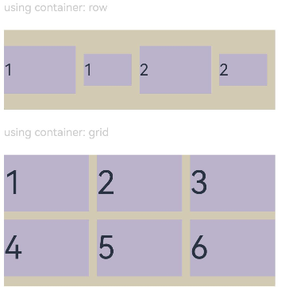

# 布局约束
<!--Kit: ArkUI-->
<!--Subsystem: ArkUI-->
<!--Owner: @camlostshi-->
<!--Designer: @lanshouren-->
<!--Tester: @liuli0427-->
<!--Adviser: @Brilliantry_Rui-->

通过组件的宽高比和显示优先级约束组件显示效果，支持固定宽高比设置和响应式优先级控制两个核心特性，可解决组件变形、布局错乱等问题，提升界面显示质量。

- **aspectRatio**：适用于需要保持固定宽高比的组件，如图片展示、视频播放器、卡片布局等场景。解决组件在不同设备和屏幕方向下需要保持特定宽高比的问题，避免图片或视频拉伸变形。
- **displayPriority**：适用于响应式布局场景，当父容器空间不足时，可以根据优先级自动隐藏低优先级组件。解决响应式布局中空间不足时组件显示优先级控制问题，避免内容溢出或布局错乱。

>  **说明：**
>
>  从API version 7开始支持。后续版本的新增接口，采用上角标单独标记接口的起始版本。

## aspectRatio

aspectRatio(value: number): T

指定当前组件的宽高比，aspectRatio=width/height。
- 仅设置width、aspectRatio时，height=width/aspectRatio。
- 仅设置height、aspectRatio时，width=height*aspectRatio。
- 同时设置width、height和aspectRatio时，height会被重新计算为width/aspectRatio，显式设置的height值不生效。

适用于需要保持固定宽高比的组件，例如图片展示、视频播放器、响应式布局中保持比例等场景。

设置aspectRatio属性后，组件宽高会受父组件内容区大小限制，[constraintSize](ts-universal-attributes-size.md#constraintsize)的优先级高于aspectRatio。当constraintSize设置的约束与aspectRatio计算结果冲突时，组件将优先遵循constraintSize的约束，此时aspectRatio可能无法生效。

**卡片能力：** 从API version 9开始，该接口支持在ArkTS卡片中使用。

**原子化服务API：** 从API version 11开始，该接口支持在原子化服务中使用。

**系统能力：** SystemCapability.ArkUI.ArkUI.Full

**参数：**

| 参数名 | 类型   | 必填 | 说明                                                         |
| ------ | ------ | ---- | ------------------------------------------------------------ |
| value  | number | 是   | 指定当前组件的宽高比，取值范围(0, +∞)。<br>API version 9及以前，默认值：1.0。<br>API version 10及以后，默认值：无。<br>**说明：**<br>当需要保持组件的宽高比例时使用（如显示图片、视频等需要保持比例的内容）。<br>该属性设置为非法值（小于等于0）时不生效。API version 10及以后，未设置值时该属性不生效。<br>设置该属性后，组件宽高会受父组件内容区大小限制，constraintSize的优先级高于aspectRatio。<br>例如：Row仅设置宽度且无子组件时，若aspectRatio未设置或为负值，则高度为0。 |

**返回值：**

| 类型 | 说明 |
| --- | --- |
|  T | 返回当前组件实例，支持链式调用。 |

## displayPriority

displayPriority(value: number): T

设置当前组件在Row/Column/Flex(单行)容器中显示的优先级，优先级由数值的整数部分决定，整数部分越大优先级越高。

适用于响应式布局中根据父容器空间动态显示/隐藏子组件的场景。例如，在不同屏幕尺寸下优先显示重要内容，隐藏次要内容。

**卡片能力：** 从API version 9开始，该接口支持在ArkTS卡片中使用。

**原子化服务API：** 从API version 11开始，该接口支持在原子化服务中使用。

**系统能力：** SystemCapability.ArkUI.ArkUI.Full

**参数：**

| 参数名 | 类型   | 必填 | 说明                                                         |
| ------ | ------ | ---- | ------------------------------------------------------------ |
| value  | number | 是   | 设置当前组件在布局容器中显示的优先级，取值范围[0, +∞)。<br>默认值：1<br>**说明：**<br>仅在[Row](./ts-container-row.md)/[Column](./ts-container-column.md)/[Flex(单行)](./ts-container-flex.md)容器组件中生效。<br>当容器空间有限，需要控制组件显示顺序或隐藏低优先级组件时使用（如在Flex容器中根据空间大小动态显示内容）。建议根据组件重要性设置优先级，关键组件设置较大的值（如2-10），次要组件设置较小的值（如1）。<br>小数点后的数字不影响优先级。不大于1的所有值优先级相同。大于1时，displayPriority的整数部分越大，优先级越高；同一整数区间内的值优先级相同。例如：0.5和1.0优先级相同（均不大于1）；1.5和1.9优先级相同（整数部分均为1）；2.0和2.9优先级相同（整数部分均为2），且高于1.x的优先级。<br>若父容器空间不足，隐藏低优先级子组件。若某一优先级级别的子组件被隐藏，则所有更低优先级的子组件也都会被隐藏。 |

**返回值：**

| 类型 | 说明 |
| --- | --- |
|  T | 返回当前组件实例，支持链式调用。 |

## 示例

### 示例1（设置组件宽高比）

通过aspectRatio设置不同的宽高比。

```ts
// xxx.ets
@Entry
@Component
struct AspectRatioExample {
  private children: string[] = ['1', '2', '3', '4', '5', '6']

  build() {
    Column({ space: 20 }) {
      Text('using container: row').fontSize(14).fontColor(0xCCCCCC).width('100%')
      Row({ space: 10 }) {
        ForEach(this.children, (item:string) => {
          // 组件宽度 = 组件高度*1.5 = 90
          Text(item)
            .backgroundColor(0xbbb2cb)
            .fontSize(20)
            .aspectRatio(1.5)
            .height(60)
          // 组件高度 = 组件宽度/1.5 = 60/1.5 = 40
          Text(item)
            .backgroundColor(0xbbb2cb)
            .fontSize(20)
            .aspectRatio(1.5)
            .width(60)
        }, (item:string) => item)
      }
      .size({ width: "100%", height: 100 })
      .backgroundColor(0xd2cab3)
      .clip(true)

      // grid子元素width/height=3/2
      Text('using container: grid').fontSize(14).fontColor(0xCCCCCC).width('100%')
      Grid() {
        ForEach(this.children, (item:string) => {
          GridItem() {
            Text(item)
              .backgroundColor(0xbbb2cb)
              .fontSize(40)
              .width('100%')
              .aspectRatio(1.5)
          }
        }, (item:string) => item)
      }
      .columnsTemplate('1fr 1fr 1fr')
      .columnsGap(10)
      .rowsGap(10)
      .size({ width: "100%", height: 165 })
      .backgroundColor(0xd2cab3)
    }.padding(10)
  }
}
```

**图1** 竖屏显示<br>


**图2** 横屏显示<br>


### 示例2（设置组件显示优先级）

使用displayPriority为子组件设置显示优先级。

```ts
class ContainerInfo {
  label: string = '';
  size: string = '';
}

class ChildInfo {
  text: string = '';
  priority: number = 0;
}

@Entry
@Component
struct DisplayPriorityExample {
  // 显示容器大小
  private container: ContainerInfo[] = [
    { label: 'Big container', size: '90%' },
    { label: 'Middle container', size: '50%' },
    { label: 'Small container', size: '30%' }
  ]
  private children: ChildInfo[] = [
    { text: '1\n(priority:2)', priority: 2 },
    { text: '2\n(priority:1)', priority: 1 },
    { text: '3\n(priority:3)', priority: 3 },
    { text: '4\n(priority:1)', priority: 1 },
    { text: '5\n(priority:2)', priority: 2 }
  ]
  @State currentIndex: number = 0;

  build() {
    Column({ space: 10 }) {
      // 切换父级容器大小
      Button(this.container[this.currentIndex].label).backgroundColor(0x317aff)
        .onClick(() => {
          this.currentIndex = (this.currentIndex + 1) % this.container.length;
        })
      // 通过变量设置Flex父容器宽度
      Flex({ justifyContent: FlexAlign.SpaceBetween }) {
        ForEach(this.children, (item:ChildInfo) => {
          // 使用displayPriority给子组件绑定显示优先级
          Text(item.text)
            .width(120)
            .height(60)
            .fontSize(24)
            .textAlign(TextAlign.Center)
            .backgroundColor(0xbbb2cb)
            .displayPriority(item.priority)
        }, (item:ChildInfo) => item.text)
      }
      .width(this.container[this.currentIndex].size)
      .backgroundColor(0xd2cab3)
    }.width("100%").margin({ top: 50 })
  }
}
```

横屏显示


