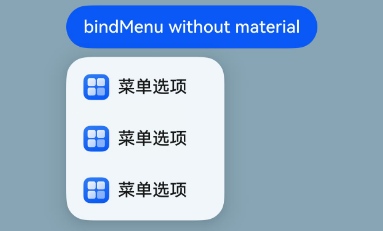
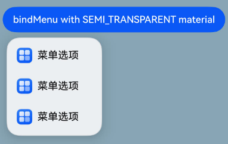

# 菜单控制（系统接口）
<!--Kit: ArkUI-->
<!--Subsystem: ArkUI-->
<!--Owner: @Armstrong15-->
<!--Designer: @zhanghaibo0-->
<!--Tester: @lxl007-->
<!--Adviser: @Brilliantry_Rui-->

为组件绑定弹出式菜单，支持长按、点击或鼠标右键来触发菜单的弹出，菜单项以垂直列表形式显示。

> **说明：**
>
> - 该组件从API version 7开始支持。后续版本如有新增内容，则采用上角标单独标记该内容的起始版本。
>
> - 本文仅介绍当前模块的系统接口，其他公开接口参见[菜单控制](./ts-universal-attributes-menu.md)。

## ContextMenuOptions<sup>10+</sup>

菜单项的信息。

**系统能力：** SystemCapability.ArkUI.ArkUI.Full

| 名称                  | 类型                                                         | 只读 | 可选 | 说明                                                         |
| --------------------- | ------------------------------------------------------------ | ---- | ------------------------------------------------------------ | ------------------------------------------------------------ |
| systemMaterial<sup>23+</sup> | [SystemUiMaterial](./ts-universal-attributes-image-effect-sys.md#systemuimaterial23) | 否 | 是 | 设置菜单的系统材质。不同系统材质对应不同的属性影响效果，该接口影响背景色[backgroundColor](ts-universal-attributes-background.md#backgroundcolor)、边框颜色[borderColor](ts-universal-attributes-border.md#bordercolor)、边框宽度[borderWidth](ts-universal-attributes-border.md#borderwidth)、阴影[shadow](ts-universal-attributes-image-effect.md#shadow)，不建议与上述接口一起使用。材质设置为非法值、undefined时，按照不设置系统材质处理。<br />**默认值：** undefined<br />**系统接口：** 此接口为系统接口。<br />**原子化服务API：** 从API version 23开始，该接口支持在原子化服务中使用。<br />**模型约束：** 此接口仅可在Stage模型下使用。 |

## 示例
### 示例1（设置菜单的系统材质）

该示例通过设置[ContextMenuOptions](#contextmenuoptions10)中的systemMaterial属性，实现了菜单的系统材质视效。

从API version 23开始，在ContextMenuOptions中新增了systemMaterial属性。

```ts
@Entry
@Component
struct Index {
  @Builder
  MyMenu() {
    Menu() {
      MenuItem({ startIcon: this.iconStr, content: '菜单选项' })
      MenuItem({ startIcon: this.iconStr, content: '菜单选项' })
      MenuItem({ startIcon: this.iconStr, content: '菜单选项' })
    }
  }

  build() {
    Column() {
      Button('bindMenu with THICK material')
        .bindMenu(this.MyMenu, {
          systemMaterial: new uiMaterail.Material({ type: uiMaterail.MaterialType.SEMI_TRANSPARENT })
        })
    }
    // $r('app.media.img')需要替换为开发者所需的图像资源文件。
    .backgroundImage($r('app.media.img'))
  }
}
```
未设置系统材质



设置系统材质

