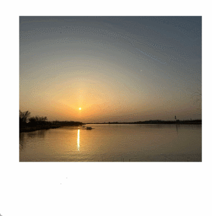

# 运动模糊
<!--Kit: ArkUI-->
<!--Subsystem: ArkUI-->
<!--Owner: @CCFFWW-->
<!--Designer: @CCFFWW-->
<!--Tester: @lxl007-->
<!--Adviser: @Brilliantry_Rui-->

设置组件由缩放大小或位移变化引起的运动过程中的动态模糊效果。需要与动画的[AnimateParam](ts-explicit-animation.md#animateparam对象说明)的onFinish参数配合使用。

>  **说明：**
>
>  从API version 12开始支持。后续版本如有新增内容，则采用上角标单独标记该内容的起始版本。

## motionBlur

motionBlur(value: MotionBlurOptions): T

在当前组件由缩放大小或位移变化引起的运动过程中，增加动态模糊效果。

> **说明：**
>
> - 不建议在组件内转场、共享元素转场、组件内隐式元素转场和粒子动画场景中使用该属性，否则会产生非预期效果。
>
> - 该属性需要在开始状态将motionBlur的参数radius设置为0，否则冷启动时会有非预期效果。
>
> - 该属性需要与动画的AnimateParam的onFinish参数配合使用，需要在运动模糊动画结束后将motionBlur的参数radius置为0，否则会产生非预期效果。
>
> - 在使用该属性过程中，不要在使用过程中频繁更改同一个组件的模糊半径，否则会产生非预期效果。比如示例中的动画，频繁点击会出现模糊效果偶尔失效的情况。
>
> - 运动模糊锚点坐标需要与动画缩放的锚点保持一致，否则会产生非预期效果。
>
> - 模糊半径建议设置1以内，否则会产生非预期效果。

**原子化服务API：** 从API version 12开始，该接口支持在原子化服务中使用。

**系统能力：** SystemCapability.ArkUI.ArkUI.Full

**参数：** 

| 参数名 | 类型                                            | 必填 | 说明               |
| ------ | ----------------------------------------------- | ---- | ------------------ |
| value  | [MotionBlurOptions](#motionbluroptions对象说明) | 是   | 定义运动模糊参数。 |

**返回值：**

| 类型   | 说明                     |
| ------ | ------------------------ |
| T | 返回当前组件。 |

## motionBlur<sup>18+</sup>

motionBlur(motionBlur: Optional\<MotionBlurOptions>): T

在当前组件由缩放大小或位移变化引起的运动过程中，增加动态模糊效果。与[motionBlur](#motionblur)相比，motionBlur参数新增了对undefined类型的支持。

1、不建议在组件内转场、共享元素转场、组件内隐式元素转场、粒子动画场景下使用该属性，否则会产生非预期效果。

2、该属性需要在开始状态将motionBlur的参数radius设置为0，否则冷启动时会有非预期效果。

3、该属性需要与动画的AnimateParam的onFinish参数配合使用，需要在运动模糊动画结束后将motionBlur的参数radius置为0，否则会产生非预期效果。

4、在使用该属性过程中，不要在使用过程中频繁更改同一个组件的模糊半径，否则会产生非预期效果。比如示例中的动画，频繁点击会出现模糊效果偶尔失效的情况。

5、运动模糊锚点坐标需要与动画缩放的锚点保持一致，否则会产生非预期效果。

6、模糊半径建议设置1以内，否则会产生非预期效果。

**原子化服务API：** 从API version 18开始，该接口支持在原子化服务中使用。

**系统能力：** SystemCapability.ArkUI.ArkUI.Full

**参数：** 

|   参数名    |    类型                                                      |  必填  |     说明                                                       |
| ---------- | ---------------------------------------------------------- | ---- | ------------------------------------------------------------ |
| motionBlur | Optional\<[MotionBlurOptions](#motionbluroptions对象说明)> | 是   | 定义运动模糊参数。<br/>当motionBlur的值为undefined时，维持之前取值。 |

**返回值：**

| 类型   | 说明                     |
| ------ | ------------------------ |
| T | 返回当前组件。 |

## MotionBlurOptions对象说明

运动模糊选项。

**原子化服务API：** 从API version 12开始，该接口支持在原子化服务中使用。

**系统能力：** SystemCapability.ArkUI.ArkUI.Full

| 名称          | 类型                                                        | 只读  | 可选  | 说明                                                         |
| ------------- | ----------------------------------------------------------- | ----- | ----- | ------------------------------------------------------------ |
| radius | number      | 否    | 否    | 模糊半径，取值范围[0.0, ∞)，建议设置1.0以内。 |
| anchor | [MotionBlurAnchor](#motionbluranchor对象说明) | 否    | 否    | 运动模糊锚点坐标。运动模糊锚点坐标设置时需要与动画缩放的锚点保持一致设置。 |

## MotionBlurAnchor对象说明

运动模糊锚坐标。

**原子化服务API：** 从API version 12开始，该接口支持在原子化服务中使用。

**系统能力：** SystemCapability.ArkUI.ArkUI.Full

| 名称          | 类型                                                        | 只读  | 可选  | 说明                                                         |
| ------------- | ----------------------------------------------------------- | ----- | ----- | ------------------------------------------------------------ |
| x | number      | 否    | 否    | 锚点坐标x值，取值范围[0.0, 1.0]。 |
| y | number      | 否    | 否    | 锚点坐标y值，取值范围[0.0, 1.0]。 |

## 示例

属性动画状态下添加运动模糊效果。
```ts
// xxx.ets
import { curves } from '@kit.ArkUI';

@Entry
@Component
struct motionBlurTest {
  @State widthSize: number = 300
  @State heightSize: number = 240
  @State flag: boolean = true
  @State radius: number = 0
  @State x: number = 0.5
  @State y: number = 0.5

  build() {
    Column() {
      Column() {
        // $r('app.media.test')需要替换为开发者所需的图像资源文件。
        Image($r('app.media.test'))
          .width(this.widthSize)
          .height(this.heightSize)
          .scale({ x: this.flag ? 1 : 0.8,y: this.flag ? 1 : 0.8 ,centerX: "50%", centerY: "50%" })
          .onClick(() => {
            this.radius = 50;
            this.x = 0.5;
            this.y = 0.5;
            this.flag = !this.flag;
          })
          .animation({
            duration: 2000, // 动画播放时间
            iterations:1, // 动画播放次数
            playMode:PlayMode.Alternate, // 动画播放模式，在奇数次（1、3、5...）正向播放，在偶数次（2、4、6...）反向播放
            curve: curves.springCurve(10, 1, 228, 30), // 动画曲线
            onFinish: () => {
              this.radius = 0;
              console.info("onFinish")
            },
          })
          .motionBlur({ radius: this.radius, anchor: { x: this.x, y: this.y } })
      }
    }.width('100%')
    .margin({ top: 50 })
  }
}
```


