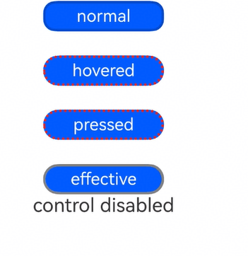

# 多态样式

设置组件不同状态下的样式。

>  **说明：**
>
> - 本模块同时支持ArkTS-Dyn、ArkTS-Sta。
>
> - 从API version 8开始支持。后续版本如有新增内容，则采用上角标单独标记该内容的起始版本。
>
> - 从API version 11开始支持另一种写法[attributeModifier](./ts-universal-attributes-attribute-modifier.md)，可根据开发者需要动态设置属性。
>
> - 多态样式仅支持[通用属性](ts-component-general-attributes.md)。如果多态样式不生效，则该属性可能为组件的私有属性，例如：[fontColor](./ts-universal-attributes-text-style.md)、[TextInput](./ts-basic-components-textinput.md)组件的[backgroundColor](./ts-universal-attributes-background.md#backgroundcolor18)等。此时，可以通过attributeModifier动态设置组件属性来解决此问题。
>
> - 当前多态样式实现依赖于组件自定义节点的刷新机制。因Builder不具备独立的自定义父节点，无法直接触发刷新，致使多态样式无法直接在Builder中生效。解决方法是将多态样式封装至自定义组件内部，再将此组件置于@Builder中，以此来间接实现多态样式。示例代码可参考[示例3设置Builder多态样式](#示例3设置builder多态样式)。

## stateStyles

ArkTS-Dyn: stateStyles(value: StateStyles): T

ArkTS-Sta: stateStyles(value: StateStyles | undefined): this

设置组件不同状态的样式。

**卡片能力：** 从API version 9开始，该接口支持在ArkTS卡片中使用。

**原子化服务API：** 从API version 11开始，该接口支持在原子化服务中使用。

**系统能力：** SystemCapability.ArkUI.ArkUI.Full

**ArkTS-Dyn起始版本：** 8

**ArkTS-Sta起始版本：** 22

**参数：**

| 参数名 | 类型                                | 必填 | 说明                     |
| ------ | ----------------------------------- | ---- | ------------------------ |
| value  | ArkTS-Dyn: [StateStyles](#statestyles)<br/> ArkTS-Sta: [StateStyles](#statestyles) \| undefined | 是   | 设置组件不同状态的样式。 |

**返回值：**

| 类型 | 说明 |
| -------- | -------- |
| ArkTs-Dyn: T<br/>ArkTs-Sta: this | 返回当前组件。 |


## CustomStyles
定义用于多态样式的回调类型。

**ArkTS版本：** 该接口仅适用于ArkTS1.2。

**参数：**

| 参数名 | 类型                                | 必填 | 说明                     |
| ------ | ----------------------------------- | ---- | ------------------------ |
| value  | CommonMethod | 是   | 提供组件的实例。 |


## StateStyles

**卡片能力：** 从API version 9开始，该接口支持在ArkTS卡片中使用。

**原子化服务API：** 从API version 11开始，该接口支持在原子化服务中使用。

**系统能力：** SystemCapability.ArkUI.ArkUI.Full

| 名称 | 类型 | 只读 | 可选 | 说明 |
| -------- | -------- | -------- | -------- | -------- |
| normal | ArkTS1.1: any <br/> ArkTS1.2: [CustomStyles](#customstyles) | 否 | 是 | 组件无状态的样式。<br/> ArkTS1.1: 仅支持使用@style修饰的样式代码块。 |
| pressed | ArkTS1.1: any <br/> ArkTS1.2: [CustomStyles](#customstyles) | 否 | 是 | 组件按下状态的样式。<br/> ArkTS1.1: 仅支持使用@style修饰的样式代码块。 |
| disabled | ArkTS1.1: any <br/> ArkTS1.2: [CustomStyles](#customstyles) | 否 | 是 | 组件禁用状态的样式。<br/> ArkTS1.1: 仅支持使用@style修饰的样式代码块。 |
| focused | ArkTS1.1: any <br/> ArkTS1.2: [CustomStyles](#customstyles) | 否 | 是 | 组件获焦状态的样式。<br/> ArkTS1.1: 仅支持使用@style修饰的样式代码块。 |
| clicked | ArkTS1.1: any <br/> ArkTS1.2: [CustomStyles](#customstyles) | 否 | 是 | 组件点击状态的样式。<br/> ArkTS1.1: 仅支持使用@style修饰的样式代码块。 |
| selected<sup>10+</sup> | object | 否 | 是 | 组件选中状态的样式。<br/> ArkTS1.1: 仅支持使用@style修饰的样式代码块。<br/> |

**selected选中状态说明**

- 当前多态样式的选中状态样式依赖组件选中属性值，可以使用[onClick](ts-universal-events-click.md)修改属性值，或使用属性自带[$$](../../../ui/state-management/arkts-two-way-sync.md)双向绑定功能。

- 当前支持selected的组件及其参数/属性值：

  | 组件                                                         | 支持的参数/属性 | 起始API版本 |
  | ------------------------------------------------------------ | --------------- | ----------- |
  | [Checkbox](ts-basic-components-checkbox.md) | select          | 10          |
  | [CheckboxGroup](ts-basic-components-checkboxgroup.md) | selectAll       | 10          |
  | [Radio](ts-basic-components-radio.md)  | checked         | 10          |
  | [Toggle](ts-basic-components-toggle.md) | isOn            | 10          |
  | [ListItem](ts-container-listitem.md) | selected         | 10          |
  | [GridItem](ts-container-griditem.md) | selected         | 10          |
  | [MenuItem](ts-basic-components-menuitem.md) | selected         | 10          |

**pressed和clicked状态说明**

- 当clicked和pressed同时在一个组件上使用时，只有后注册的状态才能生效。

## 示例

### 示例1（设置Text多态样式）

该示例展示了状态为pressed和disabled时Text组件的样式变化。

ArkTS1.1示例:
```ts
// xxx.ets
@Entry
@Component
struct StyleExample {
  @State isEnable: boolean = true

  @Styles pressedStyles():void {
    .backgroundColor("#ED6F21")
    .borderRadius(10)
    .borderStyle(BorderStyle.Dashed)
    .borderWidth(2)
    .borderColor("#33000000")
    .width(120)
    .height(30)
    .opacity(1)
  }

  @Styles disabledStyles():void {
    .backgroundColor("#E5E5E5")
    .borderRadius(10)
    .borderStyle(BorderStyle.Solid)
    .borderWidth(2)
    .borderColor("#2a4c1919")
    .width(90)
    .height(25)
    .opacity(1)
  }

  @Styles normalStyles():void {
    .backgroundColor("#0A59F7")
    .borderRadius(10)
    .borderStyle(BorderStyle.Solid)
    .borderWidth(2)
    .borderColor("#33000000")
    .width(100)
    .height(25)
    .opacity(1)
  }

  build() {
    Flex({ direction: FlexDirection.Column, alignItems: ItemAlign.Center }) {
      Text("normal")
        .fontSize(14)
        .fontColor(Color.White)
        .opacity(0.5)
        .stateStyles({
          normal: this.normalStyles,
        })
        .margin({ bottom: 20 })
        .textAlign(TextAlign.Center)
      Text("pressed")
        .backgroundColor("#0A59F7")
        .borderRadius(20)
        .borderStyle(BorderStyle.Dotted)
        .borderWidth(2)
        .borderColor(Color.Red)
        .width(100)
        .height(25)
        .opacity(1)
        .fontSize(14)
        .fontColor(Color.White)
        .stateStyles({
          pressed: this.pressedStyles,
        })
        .margin({ bottom: 20 })
        .textAlign(TextAlign.Center)
      Text(this.isEnable == true ? "effective" : "disabled")
        .backgroundColor("#0A59F7")
        .borderRadius(20)
        .borderStyle(BorderStyle.Solid)
        .borderWidth(2)
        .borderColor(Color.Gray)
        .width(100)
        .height(25)
        .opacity(1)
        .fontSize(14)
        .fontColor(Color.White)
        .enabled(this.isEnable)
        .stateStyles({
          disabled: this.disabledStyles,
        })
        .textAlign(TextAlign.Center)
      Text("control disabled")
        .onClick(() => {
          this.isEnable = !this.isEnable
          console.info(`${this.isEnable}`)
        })
    }
    .width(350).height(300)
  }
}
```
ArkTS1.2示例:
```ts
// xxx.ets
import { Entry, Component, CustomStyles, CommonMethod, Flex, BorderStyle, FlexDirection, ItemAlign, Text, TextAlign, Color, ClickEvent, Margin} from '@ohos.arkui.component'
import { State } from '@ohos.arkui.stateManagement'
@Entry
@Component
struct StyleExample {
  @State isEnable: boolean = true

  pressedStyles: CustomStyles = (instance: CommonMethod):void => {
    instance.backgroundColor("#ED6F21")
    instance.borderRadius(10)
    instance.borderStyle(BorderStyle.Dashed)
    instance.borderWidth(2)
    instance.borderColor("#33000000")
    instance.width(120)
    instance.height(30)
    instance.opacity(1)
  }

  disabledStyles: CustomStyles = (instance: CommonMethod):void => {
    instance.backgroundColor("#E5E5E5")
    instance.borderRadius(10)
    instance.borderStyle(BorderStyle.Solid)
    instance.borderWidth(2)
    instance.borderColor("#2a4c1919")
    instance.width(90)
    instance.height(25)
    instance.opacity(1)
  }

  normalStyles: CustomStyles = (instance: CommonMethod):void => {
    instance.backgroundColor("#0A59F7")
    instance.borderRadius(10)
    instance.borderStyle(BorderStyle.Solid)
    instance.borderWidth(2)
    instance.borderColor("#33000000")
    instance.width(100)
    instance.height(25)
    instance.opacity(1)
  }

  build() {
    Flex({ direction: FlexDirection.Column, alignItems: ItemAlign.Center }) {
      Text("normal")
        .fontSize(14)
        .fontColor(Color.White)
        .opacity(0.5)
        .stateStyles({
          normal: this.normalStyles,
        })
        .margin({ bottom: 20 } as Margin)
        .textAlign(TextAlign.Center)
      Text("pressed")
        .backgroundColor("#0A59F7")
        .borderRadius(20)
        .borderStyle(BorderStyle.Dotted)
        .borderWidth(2)
        .borderColor(Color.Red)
        .width(100)
        .height(25)
        .opacity(1)
        .fontSize(14)
        .fontColor(Color.White)
        .stateStyles({
          pressed: this.pressedStyles,
        })
        .margin({ bottom: 20 } as Margin)
        .textAlign(TextAlign.Center)
      Text(this.isEnable == true ? "effective" : "disabled")
        .backgroundColor("#0A59F7")
        .borderRadius(20)
        .borderStyle(BorderStyle.Solid)
        .borderWidth(2)
        .borderColor(Color.Gray)
        .width(100)
        .height(25)
        .opacity(1)
        .fontSize(14)
        .fontColor(Color.White)
        .enabled(this.isEnable)
        .stateStyles({
          disabled: this.disabledStyles,
        })
        .textAlign(TextAlign.Center)
      Text("control disabled")
        .onClick((e: ClickEvent) => {
          this.isEnable = !this.isEnable
          console.info(`${this.isEnable}`)
        })
    }
    .width(350).height(300)
  }
}
```



### 示例2（设置Radio多态样式）

该示例展示了状态为selected时Radio组件的样式变化。

ArkTS1.1示例:
```ts
// xxx.ets
@Entry
@Component
struct Index {
  @State value: boolean = false
  @State value2: boolean = false

  @Styles
  normalStyles(): void{
    .backgroundColor("#E5E5E1")
  }

  @Styles
  selectStyles(): void{
    .backgroundColor("#ED6F21")
    .borderWidth(2)
  }

  build() {
    Flex({ direction: FlexDirection.Row, justifyContent: FlexAlign.Center, alignItems: ItemAlign.Center }) {
      Column() {
        Text('Radio1')
          .fontSize(25)
        Radio({ value: 'Radio1', group: 'radioGroup1' })
          .checked(this.value)
          .height(50)
          .width(50)
          .borderWidth(0)
          .borderRadius(30)
          .onClick(() => {
            this.value = !this.value
          })
          .stateStyles({
            normal: this.normalStyles,
            selected: this.selectStyles,
          })
      }
      .margin(30)

      Column() {
        Text('Radio2')
          .fontSize(25)
        Radio({ value: 'Radio2', group: 'radioGroup2' })
          .checked($$this.value2)
          .height(50)
          .width(50)
          .borderWidth(0)
          .borderRadius(30)
          .onClick(() => {
            this.value2 = !this.value2
          })
          .stateStyles({
            normal: this.normalStyles,
            selected: this.selectStyles,
          })
      }
      .margin(30)
    }.padding({ top: 30 })
  }
}
```
ArkTS1.2示例:
```ts
// xxx.ets
import { Entry, Component, CommonMethod, Flex, Radio, Column, BorderStyle, FlexDirection, FlexAlign, ItemAlign, Text, TextAlign, ClickEvent, Padding, $$ } from '@ohos.arkui.component'
import { State } from '@ohos.arkui.stateManagement'
@Entry
@Component
struct Index {
  @State value: boolean = false
  @State value2: boolean = false

  normalStyles(instance: CommonMethod): void{
    instance.backgroundColor("#E5E5E1")
  }

  selectStyles(instance: CommonMethod): void{
    instance.backgroundColor("#ED6F21")
    instance.borderWidth(2)
  }

  build() {
    Flex({ direction: FlexDirection.Row, justifyContent: FlexAlign.Center, alignItems: ItemAlign.Center }) {
      Column() {
        Text('Radio1')
          .fontSize(25)
        Radio({ value: 'Radio1', group: 'radioGroup1' })
          .checked(this.value)
          .height(50)
          .width(50)
          .borderWidth(0)
          .borderRadius(30)
          .onClick((e: ClickEvent) => {
            this.value = !this.value
          })
          .stateStyles({
            normal: this.normalStyles,
            selected: this.selectStyles,
          })
      }
      .margin(30)

      Column() {
        Text('Radio2')
          .fontSize(25)
        Radio({ value: 'Radio2', group: 'radioGroup2' })
          .checked($$(this.value2))
          .height(50)
          .width(50)
          .borderWidth(0)
          .borderRadius(30)
          .onClick((e: ClickEvent) => {
            this.value2 = !this.value2
          })
          .stateStyles({
            normal: this.normalStyles,
            selected: this.selectStyles,
          })
      }
      .margin(30)
    }.padding({ top: 30 } as Padding)
  }
}
```


### 示例3（设置Builder多态样式）

该示例展示了状态为pressed时Builder组件的样式变化。

ArkTS1.1示例:
```ts
import { ComponentContent } from '@kit.ArkUI';
import { BusinessError } from '@kit.BasicServicesKit';

@Component
struct Child {
  build() {
    Row()
      .zIndex(10)
      .width(100)
      .height(200)
      .stateStyles({
        normal: {
          .backgroundColor(Color.Blue)
        },
        pressed: {
          .backgroundColor(Color.Black)
        }
      })
  }
}

@Builder
function
buildText() {
  Child()
}

@Entry
@Component
struct Index {
  private contentNode: ComponentContent<Object> =
    new ComponentContent(this.getUIContext(), wrapBuilder(buildText));

  build() {
    Button('OpenCustomDialog').onClick((event: ClickEvent) => {
      this.getUIContext()
        .getPromptAction()
        .openCustomDialog(this.contentNode)
        .then(() => {
          console.info('OpenCustomDialog complete.')
        })
        .catch((error: BusinessError) => {
          let message = (error as BusinessError).message;
          let code = (error as BusinessError).code;
          console.error(`OpenCustomDialog args error code is ${code}, message is ${message}`);
        })
    })
  }
}
```
ArkTS1.2示例:
```ts
import { Entry, Component, CommonMethod, Builder, wrapBuilder, Button, Row, ComponentContent, ClickEvent, BusinessError, Color } from '@ohos.arkui.component'

@Component
struct Child {
  build() {
    Row()
      .zIndex(10)
      .width(100)
      .height(200)
      .stateStyles({
        normal: (instance: CommonMethod): void => {
          instance.backgroundColor(Color.Blue)
        },
        pressed: (instance: CommonMethod): void => {
          instance.backgroundColor(Color.Black)
        }
      })
  }
}

@Builder
function
buildText() {
  Child()
}

@Entry
@Component
struct Index {
  private contentNode: ComponentContent<Object> =
    new ComponentContent<Object>(this.getUIContext(), wrapBuilder(buildText));

  build() {
    Button('OpenCustomDialog').onClick((event: ClickEvent) => {
      this.getUIContext()
        .getPromptAction()
        .openCustomDialog(this.contentNode)
        .then(() => {
          console.info('OpenCustomDialog complete.')
        })
        .catch((error: Error) => {
          let message = (error as BusinessError).message;
          let code = (error as BusinessError).code;
          console.error(`OpenCustomDialog args error code is ${code}, message is ${message}`);
        })
    })
  }
}
```
