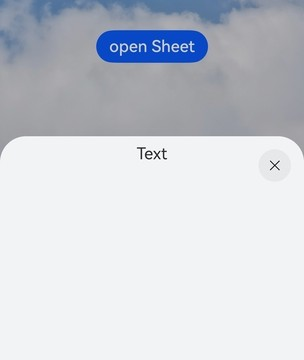
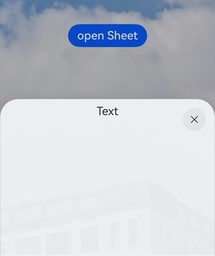

# 半模态转场 (系统接口)
<!--Kit: ArkUI-->
<!--Subsystem: ArkUI-->
<!--Owner: @CCFFWW-->
<!--Designer: @CCFFWW-->
<!--Tester: @lxl007-->
<!--Adviser: @Brilliantry_Rui-->

通过bindSheet属性为组件绑定半模态页面，在组件插入时可通过设置自定义或默认的内置高度确定半模态大小。

>  **说明：**
>
>  从API version 10开始支持。后续版本如有新增内容，则采用上角标单独标记该内容的起始版本。
>
>  不支持路由跳转。
>
> 本文仅介绍当前模块的系统接口，其他公开接口参见[bindSheet](./ts-universal-attributes-sheet-transition.md#bindsheet)。

## SheetOptions

配置半模态页面的可选属性。继承自[BindOptions](./ts-universal-attributes-sheet-transition.md#bindoptions)。

**系统能力：** SystemCapability.ArkUI.ArkUI.Full

| 名称              | 类型                                       | 只读 | 可选   | 描述              |
| --------------- | ------------------------------- | --------- | ---- | --------------- |
| offset<sup>14+</sup>       | [Position](ts-types.md#position) | 否 | 否    | 设置半模态弹窗偏移量。当半模态为底部弹窗时，支持设置底部间距。不支持设置半模态的[SheetOptions](ts-universal-attributes-sheet-transition.md#sheetoptions)中的detents属性。y轴设置为负数的时候不生效。<br/> 默认值：x轴为0vp，y轴坐标为0vp。<br/>**系统接口：** 此接口为系统接口。|
| systemMaterial<sup>24+</sup> |  [SystemUiMaterial](ts-universal-attributes-image-effect-sys.md#systemuimaterial23) | 否 | 是  |设置组件的系统材质。<br/>默认值：undefined <br/>**说明**: 不同系统材质对应不同的属性影响效果，该接口影响背景色[backgroundColor](ts-universal-attributes-background.md#backgroundcolor)、边框颜色[borderColor](ts-universal-attributes-border.md#bordercolor)、边框宽度[borderWidth](ts-universal-attributes-border.md#borderwidth)、阴影[shadow](ts-universal-attributes-image-effect.md#shadow)，不建议与上述接口一起使用。使用示例请参考[示例1（半模态设置系统材质）](#示例1半模态设置系统材质)。<br/>**系统接口：** 此接口为系统接口。 <br/>**模型约束：** 此接口仅可在Stage模型下使用。 |

## 示例

### 示例1（半模态设置系统材质）

该示例通过半模态systemMaterial属性设置系统材质。

从API version 24开始，[SheetOptions](./ts-universal-attributes-sheet-transition.md#sheetoptions)新增systemMaterial属性。

```ts
// xxx.ets
import uiMaterail from '@ohos.arkui.uiMaterial';

@Entry
@Component
struct SheetMaterialExample {
  @State isShow: boolean = false;
  @State sheetHeight: number = 300;
  @State myMaterial: uiMaterail.Material = new uiMaterail.Material({ type: uiMaterail.MaterialType.SEMI_TRANSPARENT });

  @Builder
  myBuilder() {
    Column({ space: 10 }) {
      Text("Text")
        .fontSize(20)
        .margin(10)
    }
    .width('100%')
    .height('100%')
  }

  build() {
    Stack() {
      // 请开发者替换为实际资源文件
      Image($r('app.media.startIcon'))
      Column() {
        Button("open Sheet")
          .onClick(() => {
            this.isShow = true;
          })
          .fontSize(20)
          .margin(10)
          .bindSheet($$this.isShow, this.myBuilder(), {
            height: this.sheetHeight,
            // 以下接口不建议与systemMaterial一起使用
            // borderWidth: 20,
            // borderColor: Color.Red,
            // backgroundColor: Color.Green,
            // shadow: { radius: 30, type: ShadowType.COLOR, color: Color.Yellow },
            systemMaterial: this.myMaterial // 从API version 24开始，新增systemMaterial属性
          })
      }
      .justifyContent(FlexAlign.Center)
      .width('100%')
      .height('100%')
    }
  }
}
```

未设置系统材质：



设置系统材质：

