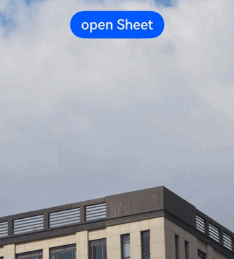
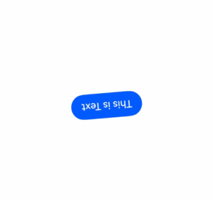

# 半模态转场 (系统接口)
<!--Kit: ArkUI-->
<!--Subsystem: ArkUI-->
<!--Owner: @hehongyang3-->
<!--Designer: @hehongyang3-->
<!--Tester: @lxl007-->
<!--Adviser: @Brilliantry_Rui-->

通过bindSheet属性为组件绑定半模态页面，在组件插入时可通过设置自定义或默认的内置高度确定半模态大小。

>  **说明：**
>
> - 从API version 10开始支持。后续版本如有新增内容，则采用上角标单独标记该内容的起始版本。
>
> - 本模块接口仅可在Stage模型下使用。
>
> - 不支持路由跳转。
>
> - 本文仅介绍当前模块的系统接口，其他公开接口参见[bindSheet](./ts-universal-attributes-sheet-transition.md#bindsheet)。

## SheetOptions

配置半模态页面的可选属性。继承自[BindOptions](./ts-universal-attributes-sheet-transition.md#bindoptions)。

**系统能力：** SystemCapability.ArkUI.ArkUI.Full

| 名称              | 类型                                       | 只读 | 可选   | 说明              |
| --------------- | ------------------------------- | --------- | ---- | --------------- |
| offset<sup>14+</sup>       | [Position](ts-types.md#position) | 否 | 否    | 设置半模态弹窗偏移量。当半模态为底部弹窗时，支持设置底部间距。不支持设置半模态的[SheetOptions](ts-universal-attributes-sheet-transition.md#sheetoptions)中的detents属性。y轴设置为负数的时候不生效。<br/> 默认值：x轴为0vp，y轴坐标为0vp。<br/>**系统接口：** 此接口为系统接口。|
| edgeLightMode | [EdgeLightMode](#edgelightmode) | 否 | 是 | 设置半模态弹窗边缘光效动画模式。<br/>默认值：EdgeLightMode.EDGELIGHT_DISABLED<br/>**起始版本：** 26.0.0<br/>**模型约束：** 此接口仅可在Stage模型下使用。<br/>**系统接口：** 此接口为系统接口。|
| blurSnapshot | [BlurSnapshotOptions](#blursnapshotoptions) | 否 | 是 | 半模态模糊快照优化选项，用于降低模糊渲染的计算开销。当使用blurStyle或systemMaterial设置模糊或材质效果时发现功耗过高，可开启模糊优化。该属性在半模态展示后不支持和undefined之间的动态切换。<br/>默认值：undefined<br/>**起始版本：** 26.0.0<br/>**模型约束：** 此接口仅可在Stage模型下使用。<br/>**系统接口：** 此接口为系统接口。|

## BlurSnapshotOptions

模糊快照优化选项。设置该对象后，将开启模糊优化。

**系统能力：** SystemCapability.ArkUI.ArkUI.Full

**起始版本：** 26.0.0

**模型约束：** 此接口仅可在Stage模型下使用。

**系统接口：** 此接口为系统接口。

| 名称 | 类型 | 只读 | 可选 | 说明 |
| --- | --- | --- | --- | --- |
| enableFreeze | boolean | 否 | 是 | 设置模糊快照是否开启冻结优化。开启后，在模糊快照时应用冻结优化以降低渲染开销。<br>拉起半模态后支持动态切换该参数值。<br/>默认值：false<br/>**起始版本：** 26.0.0<br/>**模型约束：** 此接口仅可在Stage模型下使用。<br/>**系统接口：** 此接口为系统接口。|

## EdgeLightMode

边缘光效动画模式枚举。

**起始版本：** 26.0.0

**系统接口：** 此接口为系统接口。

**模型约束：** 此接口仅可在Stage模型下使用。

**系统能力：** SystemCapability.ArkUI.ArkUI.Full

| 名称 | 值 | 说明 |
| --- | --- | --- |
| EDGELIGHT_AUTO | 0 | 自适应边缘光效动画。<br/>根据设备运算能力，在低算力设备上关闭，在中高算力设备上开启。 |
| EDGELIGHT_ENABLED | 1 | 开启边缘光效动画。 |
| EDGELIGHT_DISABLED | 2 | 关闭边缘光效动画。 |

## 示例

### 示例1（半模态设置边缘光效动画）

以下示例通过设置edgeLightMode属性开启边缘光效动画，同时使用[SheetOptions](ts-universal-attributes-sheet-transition.md#sheetoptions)中的systemMaterial接口实现了半透明材质效果。

从API版本26.0.0开始，[SheetOptions](ts-universal-attributes-sheet-transition-sys.md#sheetoptions)新增edgeLightMode属性。

```ts
// xxx.ets
import { uiMaterial } from '@kit.ArkUI';

@Entry
@Component
struct SheetMaterialExample {
  @State isShow: boolean = false;
  @State sheetHeight: number = 300;
  @State myMaterial: SystemUiMaterial | undefined = new uiMaterial.ImmersiveMaterial({
    style: 0,
  });

  @Builder
  myBuilder() {
    Column({ space: 10 }) {
      Text("Text")
        .fontSize(20)
        .margin(10)
    }
    .width('100%')
    .height('100%')
  }

  build() {
    Stack() {
      // 请开发者替换为实际资源文件
      Image($r('app.media.startIcon'))
      Column() {
        Button("open Sheet")
          .onClick(() => {
            this.isShow = true;
          })
          .fontSize(20)
          .margin(10)
          .bindSheet($$this.isShow, this.myBuilder(), {
            height: this.sheetHeight,
            backgroundColor: Color.Transparent,
            edgeLightMode: EdgeLightMode.EDGELIGHT_ENABLED,
            systemMaterial: this.myMaterial
          })
      }
      .justifyContent(FlexAlign.Center)
      .width('100%')
      .height('100%')
    }
  }
}
```



### 示例2（半模态设置模糊优化）

以下示例通过设置blurSnapshot属性开启模糊优化。当使用[SheetOptions](ts-universal-attributes-sheet-transition.md#sheetoptions)中的systemMaterial接口设置材质效果或使用[SheetOptions](ts-universal-attributes-sheet-transition.md#sheetoptions)中的blurStyle接口设置模糊时发现功耗过高，可以尝试开启模糊优化。

从API版本26.0.0开始，[SheetOptions](ts-universal-attributes-sheet-transition-sys.md#sheetoptions)新增blurSnapshot属性。

```ts
// xxx.ets
import { uiMaterial } from '@kit.ArkUI';

@Entry
@Component
struct SheetTransitionExample {
  @State isShow: boolean = false;
  @State rotateAngle: number = 0;
  @State myMaterial: SystemUiMaterial | undefined = new uiMaterial.ImmersiveMaterial({
    style: uiMaterial.ImmersiveStyle.ULTRA_THIN,
  });

  @Builder
  myBuilder() {
    Text("Context")
  }

  build() {
    Stack() {
      Button('This is Text')
        .margin(100)
        .rotate({
          x: 0,
          y: 0,
          z: 1,
          angle: this.rotateAngle
        })
        .onAppear(() => {
          this.getUIContext()?.animateTo({
            duration: 1200,
            curve: Curve.Friction,
            delay: 500,
            iterations: -1,
            expectedFrameRateRange: {
              min: 10,
              max: 120,
              expected: 60,
            }
          }, () => {
            this.rotateAngle = 360;
          })
        })
      Column() {
        Button("Open BindSheet")
          .onClick(() => {
            this.isShow = true;
          })
          .fontSize(20)
          .margin(10)
          .bindSheet($$this.isShow, this.myBuilder(), {
            height: 400,
            showClose: true,
            backgroundColor: Color.Transparent,
            // 若在设置blurStyle或者systemMaterial时发现功耗过高，可以尝试开启模糊优化
            blurStyle: BlurStyle.Thin,
            // systemMaterial: this.myMaterial,
            blurSnapshot: { enableFreeze: true },
          })
      }
      .justifyContent(FlexAlign.Start)
      .width('100%')
      .height('100%')
    }
  }
}

```


