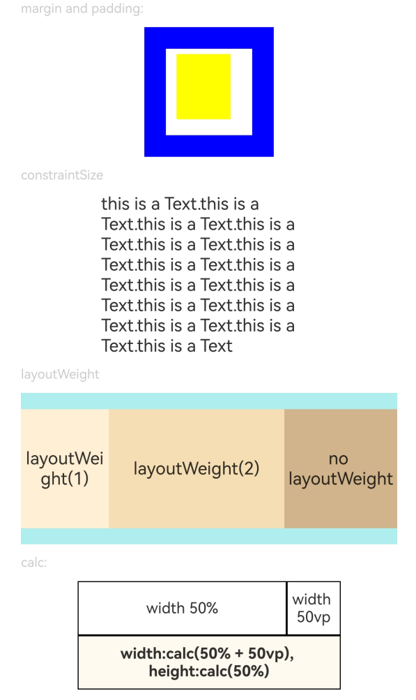
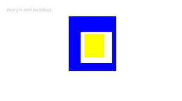
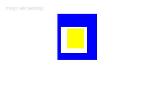
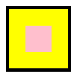
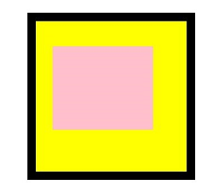
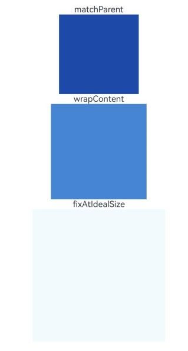
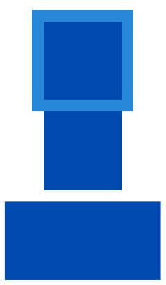

# 尺寸设置
<!--Kit: ArkUI-->
<!--Subsystem: ArkUI-->
<!--Owner: @camlostshi-->
<!--Designer: @lanshouren-->
<!--Tester: @liuli0427-->
<!--Adviser: @Brilliantry_Rui-->

设置组件的宽高、边距。通过设置组件尺寸相关属性，可以实现灵活的页面布局和响应式设计，常见场景包括固定组件大小、按比例分配布局空间、设置组件内外边距、实现安全区域适配等。

>  **说明：**
>
> - 从API version 7开始支持。后续版本的新增接口，采用上角标单独标记接口的起始版本。
>
> - 如果组件的尺寸通过百分比进行设置，在计算组件尺寸的百分比大小时，参考最近设置了固定大小的祖先节点的尺寸。
>
> - 从API version 10开始，尺寸设置内部分属性支持使用calc计算特性，具体支持属性请参考对应的属性说明。calc计算特性是一种动态计算长度值的函数，常用于灵活设置布局尺寸（如宽度、高度、边距等）。它允许通过数学表达式组合不同单位和数值，支持通过加减乘除括号运算符组成计算表达式，实现动态响应式设计。注意，在使用calc时，运算符与数值之间需要使用空格隔开。具体使用场景可见[示例1](#示例1设置组件的宽高和边距)。

## width

width(value: Length): T

设置组件自身的宽度，缺省时使用子组件自身内容需要的宽度。若子组件的宽大于父组件的宽，则子组件会溢出显示在父组件外部。

从API version 10开始，该接口支持calc计算特性。

**卡片能力：** 从API version 9开始，该接口支持在ArkTS卡片中使用。

**原子化服务API：** 从API version 11开始，该接口支持在原子化服务中使用。

**系统能力：** SystemCapability.ArkUI.ArkUI.Full

**参数：**

| 参数名   | 类型                           | 必填   | 说明                  |
| ----- | ---------------------------- | ---- | ------------------- |
| value | [Length](ts-types.md#length) | 是    | 要设置的组件宽度。<br>单位：vp<br>设置百分比时，以父容器的宽度作为基础值。<br>异常值：参数为undefined时，属性设置不生效；其它异常值时，width属性恢复到不配置时的默认行为。 |

**返回值：**

| 类型 | 说明 |
| --- | --- |
|  T | 返回当前组件对象，用于链式调用。 |

>  **说明：**
>
>  - 在[TextInput](./ts-basic-components-textinput.md)组件中，width设置auto表示自适应文本宽度。
>
>  - 在[AlphabetIndexer](./ts-container-alphabet-indexer.md)组件中，width设置auto表示自适应宽度最大索引项的宽度。
>
>  - 在[Row](./ts-container-row.md)、[Column](./ts-container-column.md)、[RelativeContainer](./ts-container-relativecontainer.md)组件中，width设置auto表示自适应子组件。

## height

height(value: Length): T

设置组件自身的高度，缺省时使用子组件自身内容需要的高度。若子组件的高大于父组件的高，则子组件会溢出显示在父组件外部。

从API version 10开始，该接口支持calc计算特性。

**卡片能力：** 从API version 9开始，该接口支持在ArkTS卡片中使用。

**原子化服务API：** 从API version 11开始，该接口支持在原子化服务中使用。

**系统能力：** SystemCapability.ArkUI.ArkUI.Full

**参数：**

| 参数名   | 类型                           | 必填   | 说明                  |
| ----- | ---------------------------- | ---- | ------------------- |
| value | [Length](ts-types.md#length) | 是    | 要设置的组件高度。<br>单位：vp<br>设置百分比时，以父容器的高度作为基础值。<br>异常值：参数为undefined时，属性设置不生效；其它异常值时，height属性恢复到不配置时的默认行为。 |

**返回值：**

| 类型 | 说明 |
| --- | --- |
|  T | 返回当前组件对象，用于链式调用。 |

>  **说明：**
>
>  在[Row](./ts-container-row.md)、[Column](./ts-container-column.md)、[RelativeContainer](./ts-container-relativecontainer.md)组件中，width、height设置auto表示自适应子组件。

## width<sup>15+</sup>

width(widthValue: Length | LayoutPolicy): T

设置组件自身的宽度或水平方向布局策略，缺省时使用子组件自身内容需要的宽度。若子组件的宽大于父组件的宽，则子组件会溢出显示在父组件外部。

从API version 15开始，当参数为Length类型时，该接口支持calc计算特性。

**卡片能力：** 从API version 15开始，该接口支持在ArkTS卡片中使用。

**原子化服务API：** 从API version 15开始，该接口支持在原子化服务中使用。

**模型约束：** 此接口仅可在Stage模型下使用。

**系统能力：** SystemCapability.ArkUI.ArkUI.Full

**参数：**

| 参数名   | 类型                           | 必填   | 说明                  |
| ----- | ---------------------------- | ---- | ------------------- |
| widthValue | [Length](ts-types.md#length)&nbsp;\|&nbsp;[LayoutPolicy](#layoutpolicy15) | 是    | 要设置的组件宽度或水平方向布局策略。<br>单位：vp<br>设置百分比时，以父容器的宽度作为基础值。 |

**返回值：**

| 类型 | 说明 |
| --- | --- |
|  T | 返回当前组件对象，用于链式调用。 |

## height<sup>15+</sup>

height(heightValue: Length | LayoutPolicy): T

设置组件自身的高度或垂直方向布局策略，缺省时使用子组件自身内容需要的高度。若子组件的高大于父组件的高，则子组件会溢出显示在父组件外部。

从API version 15开始，当参数为Length类型时，该接口支持calc计算特性。

**卡片能力：** 从API version 15开始，该接口支持在ArkTS卡片中使用。

**原子化服务API：** 从API version 15开始，该接口支持在原子化服务中使用。

**模型约束：** 此接口仅可在Stage模型下使用。

**系统能力：** SystemCapability.ArkUI.ArkUI.Full

**参数：**

| 参数名   | 类型                           | 必填   | 说明                  |
| ----- | ---------------------------- | ---- | ------------------- |
| heightValue | [Length](ts-types.md#length)&nbsp;\|&nbsp;[LayoutPolicy](#layoutpolicy15) | 是    | 要设置的组件高度或垂直方向布局策略。<br>单位：vp<br>设置百分比时，以父容器的高度作为基础值。 |

**返回值：**

| 类型 | 说明 |
| --- | --- |
|  T | 返回当前组件对象，用于链式调用。 |

## size

size(value: SizeOptions): T

设置组件自身的宽高尺寸。设置后会影响组件在父容器中的布局和显示大小。

从API version 10开始，该接口支持calc计算特性。

**卡片能力：** 从API version 9开始，该接口支持在ArkTS卡片中使用。

**原子化服务API：** 从API version 11开始，该接口支持在原子化服务中使用。

**系统能力：** SystemCapability.ArkUI.ArkUI.Full

**参数：**

| 参数名   | 类型                              | 必填   | 说明                |
| ----- | ------------------------------- | ---- | ----------------- |
| value | [SizeOptions](ts-types.md#sizeoptions) | 是    | 设置宽高尺寸。<br>异常值：参数为undefined时，属性设置不生效；其它异常值时，size属性恢复到不配置时的默认行为。<br>单位：vp |

**返回值：**

| 类型 | 说明 |
| --- | --- |
|  T | 返回当前组件对象，用于链式调用。 |

## padding

padding(value: Padding | Length | LocalizedPadding): T

设置组件的内边距属性。设置后会在组件内容和边框之间创建额外空间，影响组件内部内容的布局区域。

从API version 10开始，该接口支持calc计算特性。

**卡片能力：** 从API version 9开始，该接口支持在ArkTS卡片中使用。

**原子化服务API：** 从API version 11开始，该接口支持在原子化服务中使用。

**系统能力：** SystemCapability.ArkUI.ArkUI.Full

**参数：**

| 参数名   | 类型                                       | 必填   | 说明                                       |
| ----- | ---------------------------------------- | ---- | ---------------------------------------- |
| value | [Padding](ts-types.md#padding)&nbsp;\|&nbsp;[Length](ts-types.md#length)&nbsp;\|&nbsp;[LocalizedPadding](ts-types.md#localizedpadding12)<sup>12+</sup>| 是    | 设置组件的内边距。<br>参数为Length类型时，四个方向内边距同时生效。<br>默认值：0 <br>单位：vp<br>padding设置百分比时，上下左右内边距均以父容器的width作为基础值。 |

**返回值：**

| 类型 | 说明 |
| --- | --- |
|  T | 返回当前组件对象，用于链式调用。 |

## margin

margin(value: Margin | Length | LocalizedMargin): T

设置组件的外边距属性。在计算位置时外边距视为组件大小的一部分，从而影响组件位置。

从API version 10开始，该接口支持calc计算特性。

**卡片能力：** 从API version 9开始，该接口支持在ArkTS卡片中使用。

**原子化服务API：** 从API version 11开始，该接口支持在原子化服务中使用。

**系统能力：** SystemCapability.ArkUI.ArkUI.Full

**参数：**

| 参数名 | 类型                                                         | 必填     | 说明                                                         |
| ------ | ------------------------------------------------------------ | -------- | ------------------------------------------------------------ |
| value  | [Margin](ts-types.md#margin)&nbsp;\|&nbsp;[Length](ts-types.md#length)&nbsp;\|&nbsp;[LocalizedMargin](ts-types.md#localizedmargin12)<sup>12+</sup> | &nbsp;是 | 设置组件的外边距。<br>参数为Length类型时，四个方向外边距同时生效。<br>默认值：0 <br>单位：vp<br>margin设置百分比时，上下左右外边距均以父容器的width作为基础值。在[Row](./ts-container-row.md)、[Column](./ts-container-column.md)、[Flex](./ts-container-flex.md)交叉轴上布局时，子组件在交叉轴方向占用的空间包含子组件本身尺寸和margin值。<br>例如Column容器宽100，其中子组件宽50，margin left为10，right为20，子组件宽度与左右margin之和为50+10+20=80，小于容器宽度100，子组件在交叉轴方向居中对齐，此时水平方向左侧和右侧各有(100-80)/2=10的空白区域。 |

**返回值：**

| 类型 | 说明 |
| --- | --- |
|  T | 返回当前组件对象，用于链式调用。 |

## safeAreaPadding<sup>14+</sup>

safeAreaPadding(paddingValue: Padding | LengthMetrics | LocalizedPadding): T

设置安全区边距属性。允许容器向自身添加组件级安全区域，供子组件延伸，支持[attributeModifier](ts-universal-attributes-attribute-modifier.md#attributemodifier)动态设置属性方法。与padding不同，safeAreaPadding用于设置组件级安全区域供子组件延伸使用，而padding用于设置组件内容区域的内边距，两者可同时设置、分别生效。

>**说明：**
>
> 从API version 18开始，该接口支持在[attributeModifier](ts-universal-attributes-attribute-modifier.md#attributemodifier)中调用。

**卡片能力：** 从API version 14开始，该接口支持在ArkTS卡片中使用。

**原子化服务API：** 从API version 14开始，该接口支持在原子化服务中使用。

**模型约束：** 此接口仅可在Stage模型下使用。

**系统能力：** SystemCapability.ArkUI.ArkUI.Full

**参数：**

| 参数名   | 类型                                       | 必填   | 说明                                       |
| ----- | ---------------------------------------- | ---- | ---------------------------------------- |
| paddingValue | [Padding](ts-types.md#padding)&nbsp;\|&nbsp;[LengthMetrics](../js-apis-arkui-graphics.md#lengthmetrics12)&nbsp;\|&nbsp;[LocalizedPadding](ts-types.md#localizedpadding12)| 是    | 设置组件的安全区边距，用于在组件内部创建组件级安全区域供子组件延伸使用。<br>默认值：0 <br>单位：vp<br>paddingValue设置百分比时，上下左右内边距均以父容器的width作为基础值。 |

**返回值：**

| 类型 | 说明 |
| --- | --- |
|  T | 返回当前组件对象，用于链式调用。 |

> **说明：**
> 
> 当父辈和祖先容器设置了组件级安全区域时，子组件可以感知并利用该区域，称该区域为累计安全区延伸（accumulatedSafeAreaExpand，下文简称SAE），表示子组件在四个方向上各可延伸的长度。当祖辈与更上一级祖辈的safeAreaPadding相邻接（即未被margin、border、padding分隔）时，SAE将递归地向外累积，直至不存在相邻的更外层safeAreaPadding或递归至页面容器外。系统级避让区域（如状态栏、导航条、挖孔区等，详情参见[安全区域](./ts-universal-attributes-expand-safe-area.md)中的说明）可视为页面容器特有的safeAreaPadding，同样参与该延伸范围的计算。
>
>通过与其他属性配合使用，可对上述计算得到的组件级安全区区域加以利用。例如，对子组件设置[ignoreLayoutSafeArea](./ts-universal-attributes-expand-safe-area.md#ignorelayoutsafearea20)属性，即可利用SAE延伸组件的布局范围。

## layoutWeight

layoutWeight(value: number | string): T

设置组件的布局权重，使组件在父容器（[Row](./ts-container-row.md)/[Column](./ts-container-column.md)/[Flex](./ts-container-flex.md)）的主轴方向按照权重分配尺寸。适用于父容器尺寸确定、需要多个子组件按比例分配剩余空间的场景。

**卡片能力：** 从API version 9开始，该接口支持在ArkTS卡片中使用。

**原子化服务API：** 从API version 11开始，该接口支持在原子化服务中使用。

**系统能力：** SystemCapability.ArkUI.ArkUI.Full

**参数：**

| 参数名   | 类型                         | 必填      | 说明                                       |
| ----- | -------------------------- | ------- | ---------------------------------------- |
| value | number&nbsp;\|&nbsp;string | &nbsp;是 | 父容器尺寸确定时，不设置layoutWeight属性或者layoutWeight属性生效值为0的子组件优先占位，这些子组件占位后在主轴留下的空间称为主轴剩余空间。设置了layoutWeight属性且layoutWeight属性生效值大于0的子组件会从主轴剩余空间中按照各自所设置的权重占比分配尺寸，分配时会忽略子组件本身的width/height设置，但保留minWidth/minHeight约束。<br>默认值：0<br>取值范围：[0, +∞)<br>超出范围时：传入小于0的值时，按0处理。<br>**说明：** <br>仅在[Row](./ts-container-row.md)/[Column](./ts-container-column.md)/[Flex](./ts-container-flex.md)布局中生效。<br>可选值为大于等于0的数字，或者可以转换为数字的字符串（支持整数、小数格式）。<br>如果容器中有子组件设置了layoutWeight属性，且设置的属性值大于0，则所有子组件不会再基于[flexShrink](./ts-universal-attributes-flex-layout.md#flexshrink)和[flexGrow](./ts-universal-attributes-flex-layout.md#flexgrow)布局。 |

**返回值：**

| 类型 | 说明 |
| --- | --- |
|  T | 返回当前组件对象，用于链式调用。 |

## constraintSize

constraintSize(value: ConstraintSizeOptions): T

设置约束尺寸，组件布局时进行尺寸范围限制。设置后组件的宽度和高度将被限制在指定的最小值和最大值范围内，constraintSize的优先级高于width和height属性。

从API version 10开始，该接口支持calc计算特性。

**卡片能力：** 从API version 9开始，该接口支持在ArkTS卡片中使用。

**原子化服务API：** 从API version 11开始，该接口支持在原子化服务中使用。

**系统能力：** SystemCapability.ArkUI.ArkUI.Full

**参数：**

| 参数名   | 类型                                       | 必填   | 说明                                       |
| ----- | ---------------------------------------- | ---- | ---------------------------------------- |
| value | [ConstraintSizeOptions](ts-types.md#constraintsizeoptions) | 是    | 设置约束尺寸。constraintSize的优先级高于[width](#width)和[height](#height)。取值结果参考constraintSize取值对width/height影响。<br>默认值：<br>{<br>minWidth:&nbsp;0,<br>maxWidth:&nbsp;Infinity,<br>minHeight:&nbsp;0,<br>maxHeight:&nbsp;Infinity<br>}<br>异常值：数值开头的字符串仅解析出数字部分，非数值开头的字符串解析为0；其它异常值时，constraintSize属性恢复到不配置时的默认行为。<br>单位：vp|

**返回值：**

| 类型 | 说明 |
| --- | --- |
|  T | 返回当前组件对象，用于链式调用。 |

**constraintSize(minWidth/maxWidth/minHeight/maxHeight)取值对width/height影响：**

| 缺省值                                      | 结果                                       |
| ---------------------------------------- | ---------------------------------------- |
| 全部缺省 | width=MAX(minWidth,MIN(maxWidth,width))<br>height=MAX(minHeight,MIN(maxHeight,height)) |
| maxWidth、maxHeight | width=MAX(minWidth,width)<br>height=MAX(minHeight,height) |
| minWidth、minHeight | width=MIN(maxWidth,width)<br>height=MIN(maxHeight,height) |
| width、height | 若minWidth<maxWidth，组件自身布局逻辑生效，width取值范围为[minWidth,maxWidth]；否则，width=MAX(minWidth,maxWidth)。<br>若minHeight<maxHeight，组件自身布局逻辑生效，height取值范围为[minHeight,maxHeight]；否则，height=MAX(minHeight,maxHeight)。 |
| width与maxWidth、height与maxHeight | width=minWidth<br>height=minHeight |
| width与minWidth、height与minHeight | 组件自身布局逻辑生效，width取值约束为不大于maxWidth。<br>组件自身布局逻辑生效，height取值约束为不大于maxHeight。 |
| minWidth与maxWidth、minHeight与maxHeight | width以所设值为基础，根据其他布局属性发生可能的拉伸或者压缩。<br>height以所设值为基础，根据其他布局属性发生可能的拉伸或者压缩。|
| width与minWidth与maxWidth | 使用父容器传递的布局限制进行布局。 |
| height与minHeight与maxHeight | 使用父容器传递的布局限制进行布局。 |

## LayoutPolicy<sup>15+</sup>

用于组件宽度和高度的布局策略。提供matchParent、wrapContent、fixAtIdealSize三种布局策略选项，分别用于组件自适应父组件布局、根据内容自适应但不超过父组件尺寸、根据内容自适应且可超过父组件尺寸的场景。

**模型约束：** 此接口仅可在Stage模型下使用。

**系统能力：** SystemCapability.ArkUI.ArkUI.Full

| 名称      | 类型   | 只读 | 可选 | 说明 |
| --------- | ------ | ---- | ---- |---------- |
| matchParent | [LayoutPolicy](#layoutpolicy15) | 是 | 否   | 当前组件自适应父组件布局时，其大小与父组件内容区相等，不包括padding，border和safeAreaPadding。适用于需要组件填满父容器内容区的场景，例如列表项、卡片容器等。<br>**卡片能力：** 从API version 15开始，该接口支持在ArkTS卡片中使用。 <br>**原子化服务API：** 从API version 15开始，该接口支持在原子化服务中使用。|
| wrapContent<sup>20+</sup> | [LayoutPolicy](#layoutpolicy15) | 是 | 否   | 当前组件自适应子组件（内容）时，其大小与子组件（内容）相等，并且其大小受父组件内容区大小约束。适用于需要根据内容自动调整大小但不能超出父容器的场景，例如文本容器、弹窗内容区等。<br>**卡片能力：** 从API version 20开始，该接口支持在ArkTS卡片中使用。 <br>**原子化服务API：** 从API version 20开始，该接口支持在原子化服务中使用。|
| fixAtIdealSize<sup>20+</sup> | [LayoutPolicy](#layoutpolicy15) | 是 | 否   | 当前组件自适应子组件（内容）时，其大小与子组件（内容）相等，并且其大小不受父组件内容区大小约束。适用于需要根据内容自动调整大小且可以超出父容器的场景，例如悬浮提示、下拉菜单等。<br>**卡片能力：** 从API version 20开始，该接口支持在ArkTS卡片中使用。 <br>**原子化服务API：** 从API version 20开始，该接口支持在原子化服务中使用。|

>  **说明：**
>
> - LayoutPolicy支持设置三种布局策略：matchParent（自适应父组件布局）、wrapContent（根据内容自适应但不超过父组件尺寸的布局）和fixAtIdealSize（根据内容自适应，可能超过父组件尺寸的布局）。具体示例代码参见[设置布局策略](#示例5设置布局策略)。
>
> - wrapContent和fixAtIdealSize场景，组件无法通过内容确定大小时，如果组件大小有默认值，则按照默认值进行测算，组件最终以默认大小显示；如果没有默认值，则按照宽高(0,0)进行测算，组件最终以零尺寸显示。
> 
> - 容器设置wrapContent，并且有子组件设置matchParent时（包括仅一边设置matchParent），容器先由确定大小的子组件撑大，设置matchParent的子组件再匹配容器大小；如果没有确定大小的子组件，容器和子组件大小均为0。
>
> - LayoutPolicy的设置会被constraintSize约束，即当同时设置LayoutPolicy和constraintSize时，constraintSize的约束优先生效。
> 
> - 从API version 15开始，仅Row和Column组件的width和height属性支持设置LayoutPolicy类型参数，其他组件设置LayoutPolicy类型参数后与不设置宽度或高度表现一致；从API version 20开始，所有基础组件均支持设置LayoutPolicy类型参数。
>
> - 当Row、Column、Flex组件主轴尺寸自适应子组件，且子组件A仅交叉轴设置matchParent时，API版本26.0.0之前，子组件A不参与Row、Column、Flex组件的主轴尺寸测量过程，此时Row、Column、Flex组件主轴方向不自适应子组件A的尺寸；从API版本26.0.0开始，子组件A会参与Row、Column、Flex组件的主轴尺寸测量过程，此时Row、Column、Flex组件主轴方向会自适应子组件A的尺寸。交叉轴方向同理。具体变更效果参见[示例6（子组件单方向设置matchParent效果）](#示例6子组件单方向设置matchparent效果)。

## 示例

### 示例1（设置组件的宽高和边距）

设置组件的宽度、高度、内边距及外边距。

```ts
// xxx.ets
@Entry
@Component
struct SizeExample {
  build() {
    Column({ space: 10 }) {
      Text('margin and padding:').fontSize(12).fontColor(0xCCCCCC).width('90%')
      Row() {
        // 宽度80 ,高度80 ,外边距20(蓝色区域），上下左右的内边距分别为5、15、10、20（白色区域）
        Row() {
          Row()
            .size({ width: '100%', height: '100%' })
            .backgroundColor(Color.Yellow)
        }
        .width(80)
        .height(80)
        .padding({
          top: 5,
          left: 10,
          bottom: 15,
          right: 20
        })
        .margin(20)
        .backgroundColor(Color.White)
      }.backgroundColor(Color.Blue)

      Text('constraintSize')
        .fontSize(12)
        .fontColor(0xCCCCCC)
        .width('90%')
      Text('this is a Text.this is a Text.this is a Text.this is a Text.this is a Text.this is a Text.this is a Text.this is a Text.this is a Text.this is a Text.this is a Text.this is a Text.this is a Text.this is a Text.this is a Text')
        .width('90%')
        .constraintSize({ maxWidth: 200 })

      Text('layoutWeight')
        .fontSize(12)
        .fontColor(0xCCCCCC)
        .width('90%')
      // 父容器尺寸确定时，设置了layoutWeight的子组件在主轴布局尺寸按照权重进行分配，忽略本身尺寸设置。
      Row() {
        // 权重1，占主轴剩余空间1/3
        Text('layoutWeight(1)')
          .size({ width: '30%', height: 110 }).backgroundColor(0xFFEFD5).textAlign(TextAlign.Center)
          .layoutWeight(1)
        // 权重2，占主轴剩余空间2/3
        Text('layoutWeight(2)')
          .size({ width: '30%', height: 110 }).backgroundColor(0xF5DEB3).textAlign(TextAlign.Center)
          .layoutWeight(2)
        // 未设置layoutWeight属性，组件按照自身尺寸渲染
        Text('no layoutWeight')
          .size({ width: '30%', height: 110 }).backgroundColor(0xD2B48C).textAlign(TextAlign.Center)
      }
      .size({ width: '90%', height: 140 })
      .backgroundColor(0xAFEEEE)

      // calc计算特性
      Text('calc:')
        .fontSize(12)
        .fontColor(0xCCCCCC)
        .width('90%')
      Column() {
        Row() {
          Text('width 50%')
            .fontSize(14)
            .borderWidth(1)
            .textAlign(TextAlign.Center)
            .size({ width: '50%', height: 50 })
          Text('width 50vp')
            .fontSize(14)
            .borderWidth(1)
            .textAlign(TextAlign.Center)
            .size({ width: '50vp', height: 50 })
        }
        .width('100%')
        .justifyContent(FlexAlign.Center)

        Text('width:calc(50% + 50vp), height:calc(50%)')
          .fontSize(14)
          .borderWidth(1)
          .fontWeight(FontWeight.Bold)
          .backgroundColor(0xFFFAF0)
          .textAlign(TextAlign.Center)
          .size({ width: 'calc(50% + 50vp)', height: 'calc(50%)' })
          // width和height设置百分比时，以父容器的width和height作为基础值。calc的宽度计算结果与上方的两个text宽度之和相等。
      }.width('100%').height(100)
    }
    .width('100%')
    .margin({ top: 5 })
  }
}
```



### 示例2（LocalizedPadding和LocalizedMargin类型的使用）

使用LocalizedPadding类型和LocalizedMargin类型定义padding和margin属性。

```ts
// xxx.ets
import { LengthMetrics } from '@kit.ArkUI'

@Entry
@Component
struct SizeExample {
  build() {
    Column({ space: 10 }) {
      Text('margin and padding:')
        .fontSize(12)
        .fontColor(0xCCCCCC)
        .width('90%')
      Row() {
        // 宽度80 ,高度80 ,上下开始结束的外边距40、20、30、10(蓝色区域），上下开始结束的内边距分别为5、15、10、20（白色区域）
        Row() {
          Row()
            .size({ width: '100%', height: '100%' })
            .backgroundColor(Color.Yellow)
        }
        .width(80)
        .height(80)
        .padding({
          top: LengthMetrics.vp(5),
          bottom: LengthMetrics.vp(15),
          start: LengthMetrics.vp(10),
          end: LengthMetrics.vp(20)
        })
        .margin({
          top: LengthMetrics.vp(40),
          bottom: LengthMetrics.vp(20),
          start: LengthMetrics.vp(30),
          end: LengthMetrics.vp(10)
        })
        .backgroundColor(Color.White)
      }
      .backgroundColor(Color.Blue)
    }
    .width('100%')
    .margin({ top: 5 })
  }
}
```

从左至右显示语言示例图



从右至左显示语言示例图



### 示例3（设置组件级安全区）

对容器设置组件级安全区。

```ts
// xxx.ets
import { LengthMetrics } from '@kit.ArkUI';

@Entry
@Component
struct SafeAreaPaddingExample {
  build() {
    Column() {
      Column() {
        Column()
          .width('100%')
          .height('100%')
          .backgroundColor(Color.Pink)
      }
      .width(200)
      .height(200)
      .backgroundColor(Color.Yellow)
      .borderWidth(10)
      .padding(10)
      .safeAreaPadding(LengthMetrics.vp(40))
    }
    .height('100%')
    .width('100%')
  }
}
```



### 示例4（使用attributeModifier动态设置安全区）

使用attributeModifier对容器设置组件级安全区。

```ts
// xxx.ets
class MyModifier implements AttributeModifier<CommonAttribute> {
  applyNormalAttribute(instance: CommonAttribute): void {
    instance.safeAreaPadding({
      left: 10,
      top: 20,
      right: 30,
      bottom: 40
    })
  }
}

@Entry
@Component
struct SafeAreaPaddingExample {
  @State modifier: MyModifier = new MyModifier()

  build() {
    Column() {
      Column() {
        Column()
          .width('100%')
          .height('100%')
          .backgroundColor(Color.Pink)
      }
      .width(200)
      .height(200)
      .backgroundColor(Color.Yellow)
      .borderWidth(10)
      .padding(10)
      .attributeModifier(this.modifier)
    }
    .height('100%')
    .width('100%')
  }
}
```



### 示例5（设置布局策略）

对容器大小设置布局策略。

```ts
// xxx.ets
@Entry
@Component
struct LayoutPolicyExample {
  build() {
    Column() {
      Column() {
        // matchParent生效时，当前组件会与其父组件内容区大小（180vp * 180vp）相等，同时依旧受自身constraintSize（150vp * 150vp）约束，因此当前组件大小为150vp * 150vp
        Text('matchParent')
        Flex()
          .backgroundColor('rgb(0, 74, 175)')
          .width(LayoutPolicy.matchParent)
          .height(LayoutPolicy.matchParent)
          .constraintSize({ maxWidth: 150, maxHeight: 150 })

        // wrapContent生效时，当前组件会与其子组件大小（300vp * 300vp）相等，但不能超过父组件内容大小（180vp * 180vp）且会受自身constraintSize（250vp * 250vp）约束，因此当前组件大小为180vp * 180vp
        Text('wrapContent')
        Row() {
          Flex()
            .width(300)
            .height(300)
        }
        .backgroundColor('rgb(39, 135, 217)')
        .width(LayoutPolicy.wrapContent)
        .height(LayoutPolicy.wrapContent)
        .constraintSize({ maxWidth: 250, maxHeight: 250 })

        // 从API version 20开始，layoutPolicy支持wrapContent和fixAtIdealSize。fixAtIdealSize生效时，当前组件会与其子组件大小（300vp * 300vp）相等，可以超过父组件内容大小（180vp * 180vp）但会受自身constraintSize（250vp * 250vp）约束，因此当前组件大小为250vp * 250vp
        Text('fixAtIdealSize')

        Row() {
          Flex()
            .width(300)
            .height(300)
        }
        .backgroundColor('rgb(240, 250, 255)')
        .width(LayoutPolicy.fixAtIdealSize)
        .height(LayoutPolicy.fixAtIdealSize)
        .constraintSize({ maxWidth: 250, maxHeight: 250 })
      }
      .width(200)
      .height(200)
      .padding(10)
    }
    .width('100%')
    .height('100%')
  }
}
```



### 示例6（子组件单方向设置matchParent效果）

该示例展示Column组件自适应子组件且子组件仅单方向设置matchParent时的布局效果。从API版本26.0.0开始，Column组件高度自适应第一个和第二个子组件，宽度自适应第一个和第三个子组件。

```ts
@Entry
@Component
struct Demo {
  build() {
    Column() {
      // API版本26.0.0之前，父组件高度计算为 padding + 组件1高度 = 30px * 2 + 200px = 260px, 宽度计算为 padding + 组件1宽度 = 30px * 2 + 200px = 260px
      // 从API版本26.0.0开始，父组件高度计算为 padding + space + 组件1高度 + 组件2高度 = 30px * 2 + 30px + 200px + 200px = 490px, 宽度计算为 padding + max(组件1宽度, 组件3宽度) = 30px * 2 + max(200px, 400px) = 460px
      Column({space: "30px"}) {
        Column()
          .width("200px")
          .height("200px")
          .backgroundColor('rgb(0, 74, 175)')

        Column()
          .width(LayoutPolicy.matchParent) // 子组件宽度与父组件内容区宽度保持一致
          .height("200px")
          .backgroundColor('rgb(0, 74, 175)')

        Column()
          .width("400px")
          .height(LayoutPolicy.matchParent) // 子组件高度与父组件内容区高度保持一致
          .backgroundColor('rgb(0, 74, 175)')
      }
      .width(LayoutPolicy.wrapContent)
      .height(LayoutPolicy.wrapContent)
      .backgroundColor('rgb(39, 135, 217)')
      .padding("30px")
    }.width("100%")
  }
}
```

|API版本26.0.0前|从API版本26.0.0开始|
|--|--|
|||
